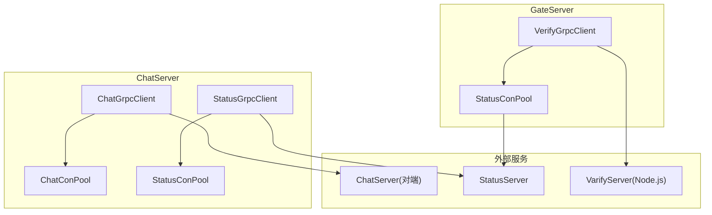
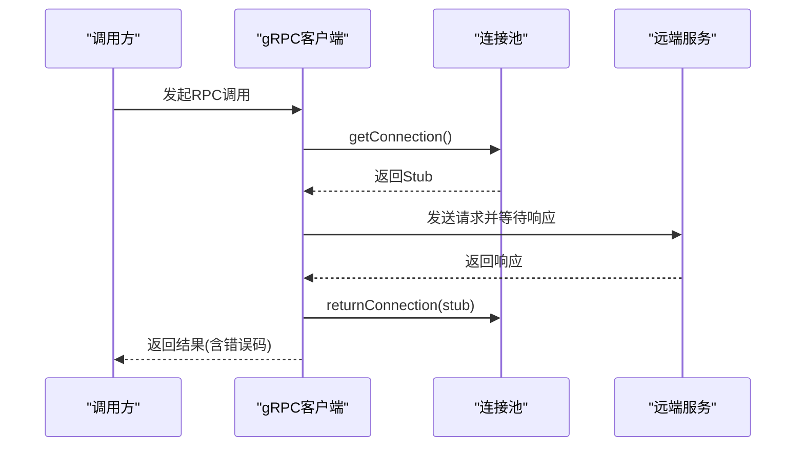
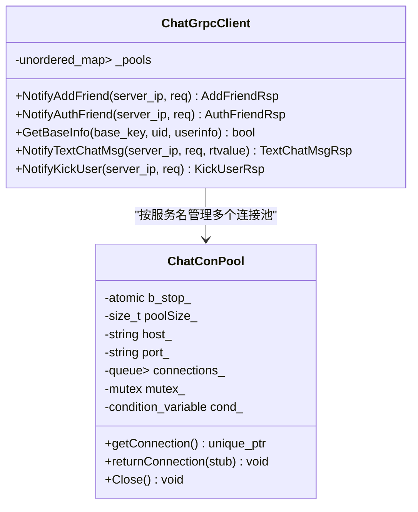
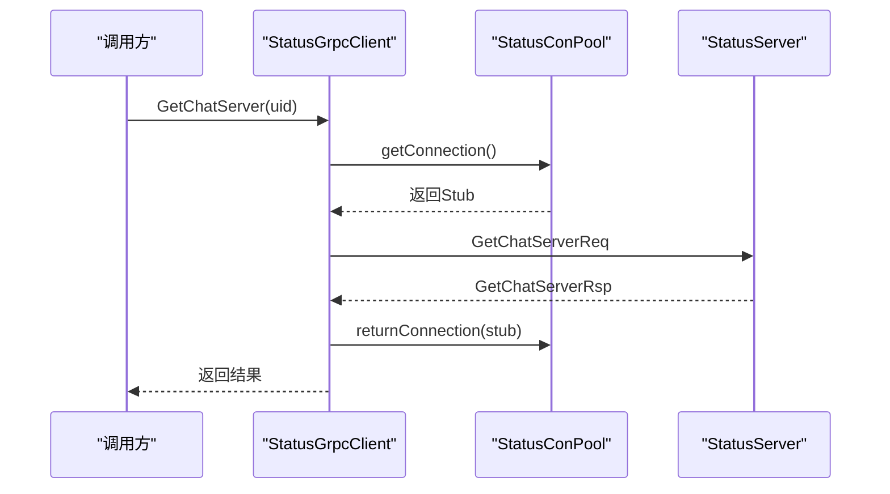
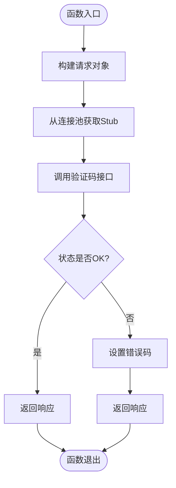
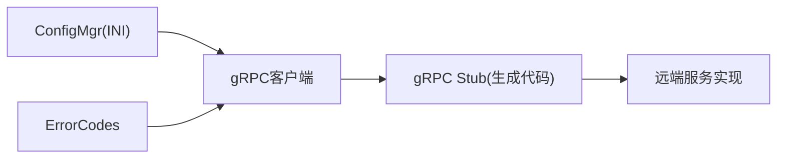
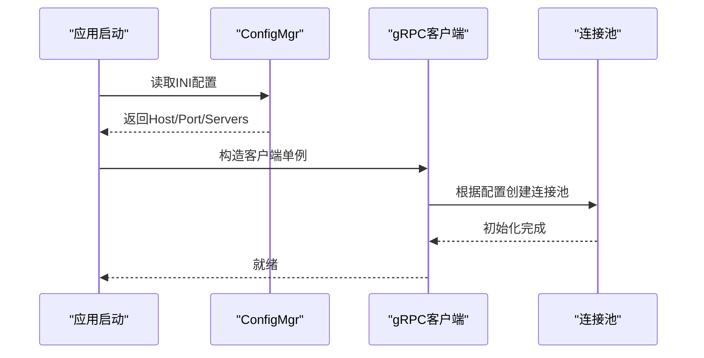

# gRPC客户端实现指南

<cite>
**本文引用的文件**   
- [ChatGrpcClient.h](file://server/ChatServer/include/ChatGrpcClient.h)
- [ChatGrpcClient.cpp](file://server/ChatServer/src/ChatGrpcClient.cpp)
- [StatusGrpcClient.h](file://server/ChatServer/include/StatusGrpcClient.h)
- [StatusGrpcClient.cpp](file://server/ChatServer/src/StatusGrpcClient.cpp)
- [VerifyGrpcClient.h](file://server/GateServer/include/VerifyGrpcClient.h)
- [VerifyGrpcClient.cpp](file://server/GateServer/src/VerifyGrpcClient.cpp)
- [const.h](file://server/ChatServer/include/const.h)
- [Singleton.h](file://server/ChatServer/include/Singleton.h)
- [ConfigMgr.h](file://server/ChatServer/include/ConfigMgr.h)
- [chat.proto](file://proto/chat_service/chat.proto)
- [status.proto](file://proto/status_service/status.proto)
- [verify.proto](file://proto/verify_service/verify.proto)
- [chatserver1.ini](file://server/ChatServer/config/chatserver1.ini)
- [config.ini](file://server/GateServer/config/config.ini)
</cite>

## 更新摘要
**变更内容**   
- ChatGrpcClient和StatusGrpcClient已添加详细的Doxygen注释，包括gRPC客户端实现和服务间通信机制
- 更新了连接池管理的详细注释说明
- 增强了API接口的参数说明和返回值描述
- 完善了错误处理和异常安全机制的文档说明

## 目录
1. [简介](#简介)
2. [项目结构](#项目结构)
3. [核心组件](#核心组件)
4. [架构总览](#架构总览)
5. [详细组件分析](#详细组件分析)
6. [依赖关系分析](#依赖关系分析)
7. [性能与内存管理](#性能与内存管理)
8. [故障转移与重试策略](#故障转移与重试策略)
9. [线程安全设计](#线程安全设计)
10. [配置与初始化示例](#配置与初始化示例)
11. [调试、日志与监控](#调试日志与监控)
12. [常见问题排查](#常见问题排查)
13. [结论](#结论)

## 简介
本指南聚焦于LLFCChat项目的gRPC客户端实现，围绕ChatGrpcClient、StatusGrpcClient、VerifyGrpcClient三类客户端的架构设计与实现原理展开。文档涵盖连接池管理、负载均衡策略、故障转移机制、重试逻辑、线程安全设计、内存管理与性能优化技巧，并提供完整的初始化、参数配置、异步调用与生命周期管理的实践建议，以及调试、日志与监控等运维要点。

**更新** ChatGrpcClient和StatusGrpcClient现已包含详细的Doxygen注释，提供了完整的API文档和实现说明。

## 项目结构
- 协议定义位于proto目录，分别定义了聊天服务、状态服务与验证码服务的接口与消息结构。
- ChatServer中的ChatGrpcClient用于与其他ChatServer实例进行跨服通信（好友申请、认证、文本消息、踢人等）。
- ChatServer与GateServer中均实现了StatusGrpcClient，用于查询当前用户所在的ChatServer或完成登录校验。
- GateServer中的VerifyGrpcClient用于向Node.js实现的验证码服务发起请求。
- 各客户端通过自定义的连接池类（ChatConPool、StatusConPool、RPConPool）复用gRPC Stub，降低连接建立开销。
- 配置由ConfigMgr从INI文件中读取，决定目标服务地址与端口。



**图示来源** 
- [ChatGrpcClient.h:34-94](file://server/ChatServer/include/ChatGrpcClient.h#L34-L94)
- [StatusGrpcClient.h:20-80](file://server/ChatServer/include/StatusGrpcClient.h#L20-L80)
- [VerifyGrpcClient.h:18-78](file://server/GateServer/include/VerifyGrpcClient.h#L18-L78)
- [chat.proto:6-12](file://proto/chat_service/chat.proto#L6-L12)
- [status.proto:6-9](file://proto/status_service/status.proto#L6-L9)
- [verify.proto:6-8](file://proto/verify_service/verify.proto#L6-L8)

**章节来源**
- [chat.proto:1-105](file://proto/chat_service/chat.proto#L1-L105)
- [status.proto:1-32](file://proto/status_service/status.proto#L1-L32)
- [verify.proto:1-19](file://proto/verify_service/verify.proto#L1-L19)

## 核心组件
- **ChatGrpcClient**：面向ChatService的客户端，维护多目标PeerServer的连接池映射，提供好友申请、认证、文本消息、踢人等通知能力。
- **StatusGrpcClient**：面向StatusService的客户端，提供获取ChatServer信息与登录校验能力。
- **VerifyGrpcClient**：面向VarifyService的客户端，提供验证码下发能力。
- **连接池**：ChatConPool、StatusConPool、RPConPool，负责创建与管理gRPC Channel与Stub，支持条件变量等待与停止信号。
- **单例模式**：所有客户端通过Singleton模板类保证全局唯一实例。
- **配置管理**：ConfigMgr从INI文件加载服务地址与端口，供客户端构造连接池使用。

**更新** 所有核心组件现在都包含详细的Doxygen注释，提供了完整的API文档和使用说明。

**章节来源**
- [ChatGrpcClient.h:126-189](file://server/ChatServer/include/ChatGrpcClient.h#L126-L189)
- [StatusGrpcClient.h:111-148](file://server/ChatServer/include/StatusGrpcClient.h#L111-L148)
- [VerifyGrpcClient.h:80-108](file://server/GateServer/include/VerifyGrpcClient.h#L80-L108)
- [Singleton.h:7-65](file://server/ChatServer/include/Singleton.h#L7-L65)
- [ConfigMgr.h:68-133](file://server/ChatServer/include/ConfigMgr.h#L68-L133)

## 架构总览
整体采用"服务间gRPC通信 + 连接池复用"的架构。每个客户端持有对应服务的连接池，按目标服务名或固定地址分配连接；调用时从池中获取Stub，执行RPC后归还连接。错误码统一在响应体中设置，便于上层处理。



**图示来源**
- [ChatGrpcClient.cpp:32-60](file://server/ChatServer/src/ChatGrpcClient.cpp#L32-L60)
- [StatusGrpcClient.cpp:3-21](file://server/ChatServer/src/StatusGrpcClient.cpp#L3-L21)
- [VerifyGrpcClient.h:87-104](file://server/GateServer/include/VerifyGrpcClient.h#L87-L104)

## 详细组件分析

### ChatGrpcClient 组件分析
- **功能职责**：封装ChatService的跨服通知接口，包括好友申请、认证、文本消息、踢人等。
- **连接池管理**：维护unordered_map<string, unique_ptr<ChatConPool>>，以PeerServer名称为键，动态创建并缓存连接池。
- **调用流程**：查找目标池 -> 获取Stub -> 构建ClientContext -> 调用RPC -> 设置响应默认值 -> 异常时设置错误码 -> 归还连接。
- **数据缓存**：GetBaseInfo优先从Redis读取用户信息，未命中则回源MySQL并写回缓存。

**更新** ChatGrpcClient现在包含完整的Doxygen注释，详细说明了每个方法的功能、参数和返回值。



**图示来源**
- [ChatGrpcClient.h:34-94](file://server/ChatServer/include/ChatGrpcClient.h#L34-L94)
- [ChatGrpcClient.h:126-189](file://server/ChatServer/include/ChatGrpcClient.h#L126-L189)

**章节来源**
- [ChatGrpcClient.cpp:9-30](file://server/ChatServer/src/ChatGrpcClient.cpp#L9-L30)
- [ChatGrpcClient.cpp:32-60](file://server/ChatServer/src/ChatGrpcClient.cpp#L32-L60)
- [ChatGrpcClient.cpp:107-135](file://server/ChatServer/src/ChatGrpcClient.cpp#L107-L135)
- [ChatGrpcClient.cpp:137-173](file://server/ChatServer/src/ChatGrpcClient.cpp#L137-L173)
- [ChatGrpcClient.cpp:175-202](file://server/ChatServer/src/ChatGrpcClient.cpp#L175-L202)
- [chat.proto:6-12](file://proto/chat_service/chat.proto#L6-L12)

### StatusGrpcClient 组件分析
- **功能职责**：封装StatusService的接口，提供获取ChatServer信息和登录校验。
- **连接池管理**：单一StatusConPool实例，基于配置文件中的Host与Port初始化。
- **调用流程**：构造请求 -> 获取Stub -> 调用RPC -> 成功返回响应，失败设置错误码 -> 归还连接。

**更新** StatusGrpcClient现在包含完整的Doxygen注释，详细说明了连接池管理和API接口的使用方法。



**图示来源**
- [StatusGrpcClient.cpp:3-21](file://server/ChatServer/src/StatusGrpcClient.cpp#L3-L21)
- [StatusGrpcClient.cpp:23-43](file://server/ChatServer/src/StatusGrpcClient.cpp#L23-L43)
- [status.proto:6-9](file://proto/status_service/status.proto#L6-L9)

**章节来源**
- [StatusGrpcClient.h:20-80](file://server/ChatServer/include/StatusGrpcClient.h#L20-80)
- [StatusGrpcClient.cpp:46-52](file://server/ChatServer/src/StatusGrpcClient.cpp#L46-L52)

### VerifyGrpcClient 组件分析
- **功能职责**：封装VarifyService的验证码下发接口。
- **连接池管理**：单一RPConPool实例，基于配置文件中的Host与Port初始化。
- **调用流程**：构造请求 -> 获取Stub -> 调用RPC -> 成功返回响应，失败设置错误码 -> 归还连接。



**图示来源**
- [VerifyGrpcClient.h:87-104](file://server/GateServer/include/VerifyGrpcClient.h#L87-L104)
- [verify.proto:6-8](file://proto/verify_service/verify.proto#L6-L8)

**章节来源**
- [VerifyGrpcClient.h:18-78](file://server/GateServer/include/VerifyGrpcClient.h#L18-L78)
- [VerifyGrpcClient.cpp:4-9](file://server/GateServer/src/VerifyGrpcClient.cpp#L4-L9)

### 连接池与资源管理
- **连接池通用特性**：
  - 使用std::queue存储unique_ptr<Stub>，避免重复创建Channel与Stub。
  - 使用mutex保护队列操作，使用condition_variable实现阻塞获取与唤醒。
  - 原子标志b_stop_配合Close方法实现优雅关闭，防止析构期间继续获取连接。
- **资源释放**：
  - 析构时先标记停止并唤醒所有等待线程，再清空队列确保无悬挂引用。
  - Defer RAII辅助类确保异常路径也能正确归还连接。

**更新** 连接池类现在包含详细的Doxygen注释，说明了每个方法的作用和参数含义。

```mermaid
classDiagram
class RPConPool {
-atomic<bool> b_stop_
-size_t poolSize_
-string host_
-string port_
-queue<unique_ptr<VarifyService : : Stub>> connections_
-mutex mutex_
-condition_variable cond_
+getConnection() unique_ptr<VarifyService : : Stub>
+returnConnection(stub) void
+Close() void
}
class Defer {
-function<void()> func_
+~Defer() void
}
RPConPool --> Defer : "异常安全归还连接"
```

**图示来源**
- [VerifyGrpcClient.h:18-78](file://server/GateServer/include/VerifyGrpcClient.h#L18-L78)
- [const.h:24-36](file://server/ChatServer/include/const.h#L24-L36)

**章节来源**
- [ChatGrpcClient.h:34-94](file://server/ChatServer/include/ChatGrpcClient.h#L34-L94)
- [StatusGrpcClient.h:20-80](file://server/ChatServer/include/StatusGrpcClient.h#L20-80)
- [VerifyGrpcClient.h:18-78](file://server/GateServer/include/VerifyGrpcClient.h#L18-L78)
- [const.h:24-36](file://server/ChatServer/include/const.h#L24-L36)

## 依赖关系分析
- **客户端与服务端协议解耦**：通过proto生成的stub进行调用，服务端实现可独立演进。
- **配置驱动**：ConfigMgr读取INI配置，决定连接池的目标地址与数量。
- **错误码集中管理**：ErrorCodes枚举统一表示各类错误，便于上层判断与上报。



**图示来源**
- [ConfigMgr.h:46-82](file://server/ChatServer/include/ConfigMgr.h#L46-L82)
- [const.h:5-20](file://server/ChatServer/include/const.h#L5-L20)
- [chat.proto:6-12](file://proto/chat_service/chat.proto#L6-L12)
- [status.proto:6-9](file://proto/status_service/status.proto#L6-L9)
- [verify.proto:6-8](file://proto/verify_service/verify.proto#L6-L8)

**章节来源**
- [chatserver1.ini:1-30](file://server/ChatServer/config/chatserver1.ini#L1-L30)
- [config.ini:1-25](file://server/GateServer/config/config.ini#L1-L25)

## 性能与内存管理
- **连接复用**：通过连接池减少Channel与Stub的频繁创建销毁，降低系统调用与内存分配开销。
- **线程安全**：互斥锁保护队列操作，条件变量避免忙轮询，提升并发效率。
- **内存管理**：使用智能指针管理Stub生命周期，避免手动释放导致的泄漏或悬空引用。
- **缓存策略**：GetBaseInfo优先读Redis，未命中再查MySQL并回填缓存，降低数据库压力。
- **批量处理**：文本消息采用repeated字段传输，减少多次RPC往返。

## 故障转移与重试策略
- **当前实现特点**：
  - 无内置重试逻辑，调用失败时设置错误码返回上层。
  - 无负载均衡策略，连接池内连接选择为FIFO。
  - 无健康检查与自动故障转移。
- **建议改进方向**：
  - 增加指数退避重试与最大重试次数限制。
  - 引入健康检查与熔断器，隔离不可用节点。
  - 实现加权轮询或最少活跃连接数等负载均衡策略。
  - 针对网络抖动与超时场景增加快速失败与降级策略。

## 线程安全设计
- **连接池内部**：
  - 使用std::mutex保护队列的push/pop操作。
  - 使用std::condition_variable实现阻塞等待与唤醒。
  - 使用atomic<bool>作为停止标志，避免竞态条件。
- **客户端层**：
  - 单例模式保证全局唯一实例，避免多线程重复初始化。
  - 调用过程无共享可变状态，仅访问连接池与上下文。

**更新** 所有线程安全相关的组件现在都有详细的Doxygen注释，说明了并发控制机制。

**章节来源**
- [ChatGrpcClient.h:34-94](file://server/ChatServer/include/ChatGrpcClient.h#L34-L94)
- [StatusGrpcClient.h:20-80](file://server/ChatServer/include/StatusGrpcClient.h#L20-80)
- [VerifyGrpcClient.h:18-78](file://server/GateServer/include/VerifyGrpcClient.h#L18-L78)
- [Singleton.h:7-65](file://server/ChatServer/include/Singleton.h#L7-L65)

## 配置与初始化示例
- **初始化步骤**：
  - 加载配置文件，解析目标服务地址与端口。
  - 创建客户端单例实例，构造函数中初始化连接池。
  - 根据业务需要调用相应接口进行RPC。
- **关键配置项**：
  - PeerServer列表：用于ChatGrpcClient动态创建连接池。
  - StatusServer与VarifyServer的地址端口：用于StatusGrpcClient与VerifyGrpcClient初始化。



**图示来源**
- [ChatGrpcClient.cpp:9-30](file://server/ChatServer/src/ChatGrpcClient.cpp#L9-L30)
- [StatusGrpcClient.cpp:46-52](file://server/ChatServer/src/StatusGrpcClient.cpp#L46-L52)
- [VerifyGrpcClient.cpp:4-9](file://server/GateServer/src/VerifyGrpcClient.cpp#L4-L9)
- [chatserver1.ini:24-30](file://server/ChatServer/config/chatserver1.ini#L24-L30)
- [config.ini:3-8](file://server/GateServer/config/config.ini#L3-L8)

**章节来源**
- [ConfigMgr.h:46-82](file://server/ChatServer/include/ConfigMgr.h#L46-L82)
- [chatserver1.ini:1-30](file://server/ChatServer/config/chatserver1.ini#L1-L30)
- [config.ini:1-25](file://server/GateServer/config/config.ini#L1-L25)

## 调试、日志与监控
- **调试技巧**：
  - 打印错误码与请求参数，定位问题根因。
  - 启用gRPC底层日志（如环境变量GRPC_VERBOSITY与GRPC_TRACE）。
  - 使用断点跟踪连接池获取与归还路径。
- **日志记录**：
  - 记录每次RPC的请求ID、目标服务、耗时与结果。
  - 记录连接池状态（空闲连接数、等待线程数）。
- **监控指标**：
  - RPC成功率、失败率、平均延迟、P99延迟。
  - 连接池命中率、连接创建频率、连接泄漏检测。
  - 缓存命中率（Redis/Mysql）与回源频率。

## 常见问题排查
- **连接池耗尽**：
  - 现象：调用阻塞或超时。
  - 排查：检查是否有未归还连接的异常路径；确认连接池大小是否合理。
- **配置错误**：
  - 现象：无法连接到目标服务。
  - 排查：核对INI配置中的Host与Port是否正确；确认服务是否启动。
- **错误码非零**：
  - 现象：响应中error字段非Success。
  - 排查：查看ErrorCodes枚举含义；检查服务端实现与输入参数。
- **缓存未命中**：
  - 现象：GetBaseInfo频繁回源数据库。
  - 排查：检查Redis连接与Key是否存在；确认序列化格式是否正确。

**章节来源**
- [const.h:5-20](file://server/ChatServer/include/const.h#L5-L20)
- [ChatGrpcClient.cpp:63-105](file://server/ChatServer/src/ChatGrpcClient.cpp#L63-L105)

## 结论
LLFCChat的gRPC客户端实现采用了清晰的分层架构与连接池复用机制，有效提升了并发性能与资源利用率。通过统一的错误码与配置管理，增强了系统的可维护性与可扩展性。**更新** 随着ChatGrpcClient和StatusGrpcClient的详细Doxygen注释的添加，代码的可读性和可维护性得到了显著提升。建议在现有基础上引入重试、负载均衡与健康检查等高级特性，进一步提升系统的健壮性与可用性。同时，完善日志与监控体系，有助于快速定位问题与优化性能。

**更新** 新增的详细注释使得开发者能够更容易理解gRPC客户端的实现细节，包括连接池管理机制、服务间通信流程和错误处理策略，为后续的功能扩展和维护工作奠定了良好的基础。