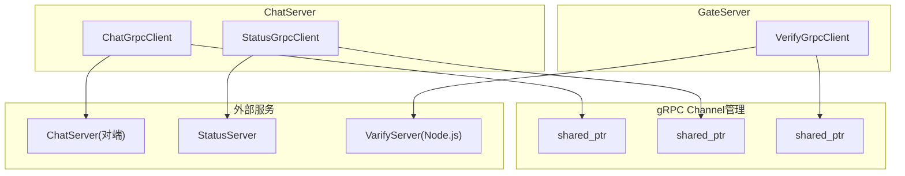
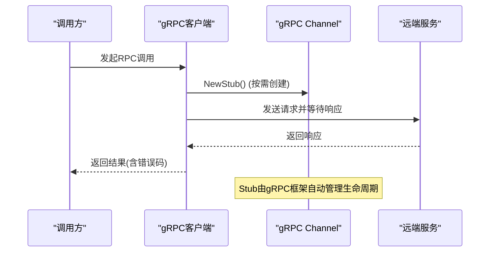
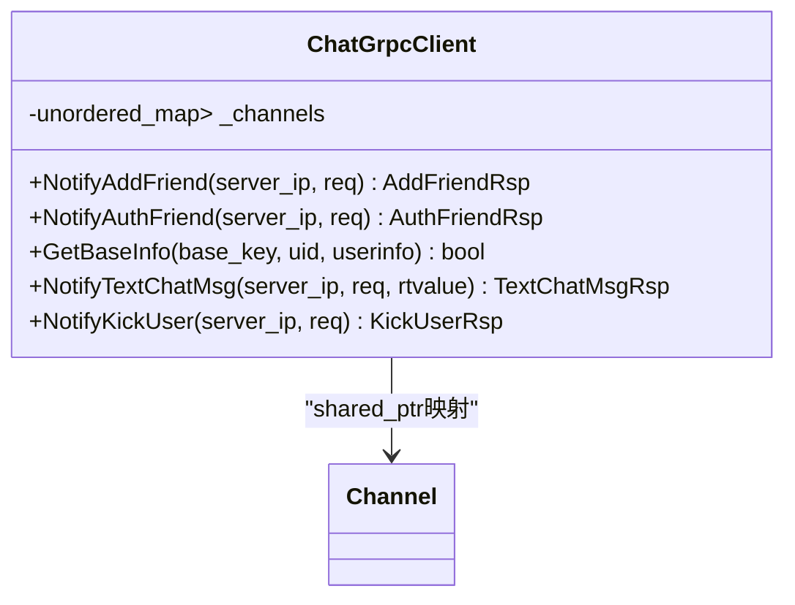
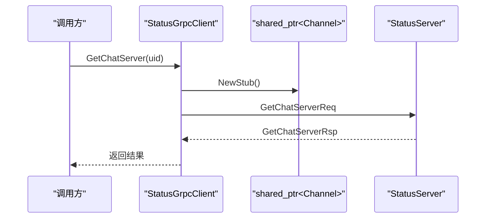
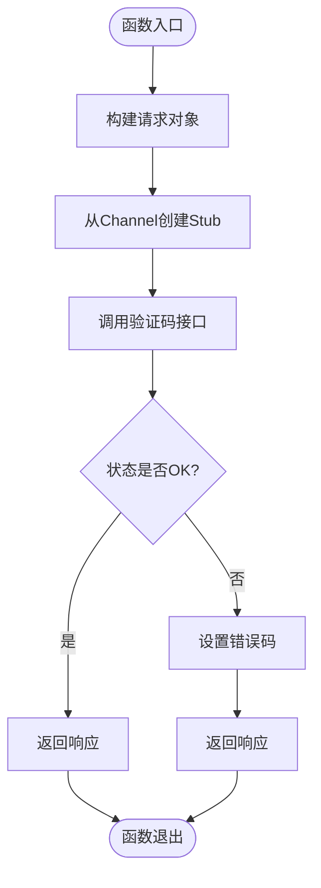
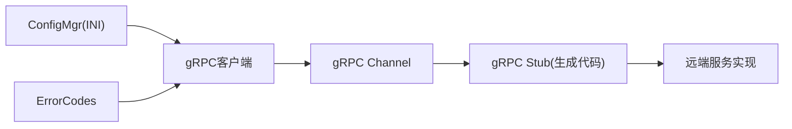
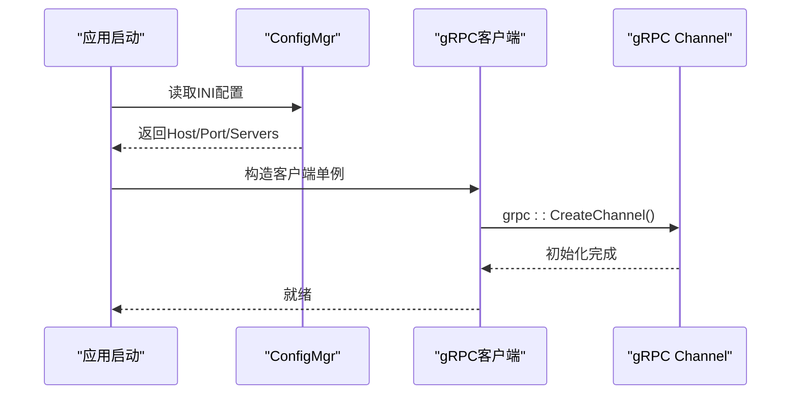

# gRPC客户端实现指南

<cite>
**本文引用的文件**   
- [ChatGrpcClient.h](file://server/ChatServer/include/ChatGrpcClient.h)
- [ChatGrpcClient.cpp](file://server/ChatServer/src/ChatGrpcClient.cpp)
- [StatusGrpcClient.h](file://server/ChatServer/include/StatusGrpcClient.h)
- [StatusGrpcClient.cpp](file://server/ChatServer/src/StatusGrpcClient.cpp)
- [VerifyGrpcClient.h](file://server/GateServer/include/VerifyGrpcClient.h)
- [VerifyGrpcClient.cpp](file://server/GateServer/src/VerifyGrpcClient.cpp)
- [const.h](file://server/ChatServer/include/const.h)
- [Singleton.h](file://server/ChatServer/include/Singleton.h)
- [ConfigMgr.h](file://server/ChatServer/include/ConfigMgr.h)
- [chat.proto](file://proto/chat_service/chat.proto)
- [status.proto](file://proto/status_service/status.proto)
- [verify.proto](file://proto/verify_service/verify.proto)
- [chatserver1.ini](file://server/ChatServer/config/chatserver1.ini)
- [config.ini](file://server/GateServer/config/config.ini)
</cite>

## 更新摘要
**变更内容**   
- **重大架构重构**：从自定义连接池（ChatConPool、StatusConPool、RPConPool）完全迁移到gRPC内置Channel管理
- **简化设计**：移除了复杂的连接池管理逻辑，采用按需创建Stub的模式
- **统一超时处理**：所有RPC调用使用统一的3秒超时机制
- **内存优化**：通过shared_ptr<Channel>实现连接复用，减少资源消耗
- **代码简化**：移除了条件变量、互斥锁等并发控制组件

## 目录
1. [简介](#简介)
2. [项目结构](#项目结构)
3. [核心组件](#核心组件)
4. [架构总览](#架构总览)
5. [详细组件分析](#详细组件分析)
6. [依赖关系分析](#依赖关系分析)
7. [性能与内存管理](#性能与内存管理)
8. [故障转移与重试策略](#故障转移与重试策略)
9. [线程安全设计](#线程安全设计)
10. [配置与初始化示例](#配置与初始化示例)
11. [调试、日志与监控](#调试日志与监控)
12. [常见问题排查](#常见问题排查)
13. [结论](#结论)

## 简介
本指南聚焦于LLFCChat项目的gRPC客户端实现，围绕ChatGrpcClient、StatusGrpcClient、VerifyGrpcClient三类客户端的架构设计与实现原理展开。**最新更新**：项目已完成从自定义连接池到gRPC内置Channel管理的重大架构重构，采用更简洁高效的按需Stub创建模式，统一了超时处理机制，显著简化了代码复杂度并提升了维护性。

## 项目结构
- 协议定义位于proto目录，分别定义了聊天服务、状态服务与验证码服务的接口与消息结构。
- ChatServer中的ChatGrpcClient用于与其他ChatServer实例进行跨服通信（好友申请、认证、文本消息、踢人等）。
- ChatServer与GateServer中均实现了StatusGrpcClient，用于查询当前用户所在的ChatServer或完成登录校验。
- GateServer中的VerifyGrpcClient用于向Node.js实现的验证码服务发起请求。
- **架构重构后**：各客户端直接使用gRPC内置Channel管理机制，通过shared_ptr<Channel>共享连接，按需创建Stub实例。
- 配置由ConfigMgr从INI文件中读取，决定目标服务地址与端口。



**图示来源** 
- [ChatGrpcClient.h:94-96](file://server/ChatServer/include/ChatGrpcClient.h#L94-L96)
- [StatusGrpcClient.h:52-54](file://server/ChatServer/include/StatusGrpcClient.h#L52-L54)
- [VerifyGrpcClient.h:43-44](file://server/GateServer/include/VerifyGrpcClient.h#L43-L44)

**章节来源**
- [chat.proto:1-105](file://proto/chat_service/chat.proto#L1-L105)
- [status.proto:1-32](file://proto/status_service/status.proto#L1-L32)
- [verify.proto:1-19](file://proto/verify_service/verify.proto#L1-L19)

## 核心组件
- **ChatGrpcClient**：面向ChatService的客户端，维护unordered_map<string, shared_ptr<Channel>>映射表，按目标服务名动态创建和管理Channel，提供好友申请、认证、文本消息、踢人等通知能力。
- **StatusGrpcClient**：面向StatusService的客户端，持有单一shared_ptr<Channel>实例，提供获取ChatServer信息与登录校验能力。
- **VerifyGrpcClient**：面向VarifyService的客户端，持有单一shared_ptr<Channel>实例，提供验证码下发能力。
- **单例模式**：所有客户端通过Singleton模板类保证全局唯一实例。
- **配置管理**：ConfigMgr从INI文件加载服务地址与端口，供客户端构造Channel使用。

**更新** 架构重构后，所有客户端都采用了统一的Channel管理模式，移除了复杂的连接池逻辑。

**章节来源**
- [ChatGrpcClient.h:40-96](file://server/ChatServer/include/ChatGrpcClient.h#L40-L96)
- [StatusGrpcClient.h:25-55](file://server/ChatServer/include/StatusGrpcClient.h#L25-L55)
- [VerifyGrpcClient.h:17-44](file://server/GateServer/include/VerifyGrpcClient.h#L17-L44)
- [Singleton.h:24-65](file://server/ChatServer/include/Singleton.h#L24-L65)
- [ConfigMgr.h:75-133](file://server/ChatServer/include/ConfigMgr.h#L75-L133)

## 架构总览
整体采用"gRPC内置Channel管理 + 按需Stub创建"的简洁架构。每个客户端在构造函数中创建并缓存Channel实例，调用时直接从Channel创建Stub，执行RPC后由gRPC框架自动管理Stub生命周期。错误码统一在响应体中设置，便于上层处理。



**图示来源**
- [ChatGrpcClient.cpp:46-47](file://server/ChatServer/src/ChatGrpcClient.cpp#L46-L47)
- [StatusGrpcClient.cpp:10-11](file://server/ChatServer/src/StatusGrpcClient.cpp#L10-L11)
- [VerifyGrpcClient.h:29-30](file://server/GateServer/include/VerifyGrpcClient.h#L29-L30)

## 详细组件分析

### ChatGrpcClient 组件分析
- **功能职责**：封装ChatService的跨服通知接口，包括好友申请、认证、文本消息、踢人等。
- **Channel管理**：维护unordered_map<string, shared_ptr<Channel>>，以PeerServer名称为键，在构造函数中预创建所有Channel。
- **调用流程**：查找Channel -> 按需创建Stub -> 设置3秒超时 -> 调用RPC -> 异常时设置错误码。
- **数据缓存**：GetBaseInfo优先从Redis读取用户信息，未命中则回源MySQL并写回缓存。

**更新** 架构重构后，移除了复杂的连接池管理，采用更简洁的Channel映射表模式。



**图示来源**
- [ChatGrpcClient.h:94-96](file://server/ChatServer/include/ChatGrpcClient.h#L94-L96)
- [ChatGrpcClient.h:55-89](file://server/ChatServer/include/ChatGrpcClient.h#L55-L89)

**章节来源**
- [ChatGrpcClient.cpp:9-30](file://server/ChatServer/src/ChatGrpcClient.cpp#L9-L30)
- [ChatGrpcClient.cpp:32-57](file://server/ChatServer/src/ChatGrpcClient.cpp#L32-L57)
- [ChatGrpcClient.cpp:104-129](file://server/ChatServer/src/ChatGrpcClient.cpp#L104-L129)
- [ChatGrpcClient.cpp:131-164](file://server/ChatServer/src/ChatGrpcClient.cpp#L131-L164)
- [ChatGrpcClient.cpp:166-190](file://server/ChatServer/src/ChatGrpcClient.cpp#L166-L190)
- [chat.proto:6-12](file://proto/chat_service/chat.proto#L6-L12)

### StatusGrpcClient 组件分析
- **功能职责**：封装StatusService的接口，提供获取ChatServer信息和登录校验。
- **Channel管理**：单一shared_ptr<Channel>实例，在构造函数中基于配置文件中的Host与Port初始化。
- **调用流程**：构造请求 -> 从Channel创建Stub -> 设置3秒超时 -> 调用RPC -> 成功返回响应，失败设置错误码。

**更新** 架构重构后，移除了StatusConPool连接池，直接使用gRPC内置Channel管理。



**图示来源**
- [StatusGrpcClient.cpp:3-19](file://server/ChatServer/src/StatusGrpcClient.cpp#L3-L19)
- [StatusGrpcClient.cpp:21-39](file://server/ChatServer/src/StatusGrpcClient.cpp#L21-L39)
- [status.proto:6-9](file://proto/status_service/status.proto#L6-L9)

**章节来源**
- [StatusGrpcClient.h:25-55](file://server/ChatServer/include/StatusGrpcClient.h#L25-L55)
- [StatusGrpcClient.cpp:42-49](file://server/ChatServer/src/StatusGrpcClient.cpp#L42-L49)

### VerifyGrpcClient 组件分析
- **功能职责**：封装VarifyService的验证码下发接口。
- **Channel管理**：单一shared_ptr<Channel>实例，在构造函数中基于配置文件中的Host与Port初始化。
- **调用流程**：构造请求 -> 从Channel创建Stub -> 设置3秒超时 -> 调用RPC -> 成功返回响应，失败设置错误码。

**更新** 架构重构后，移除了RPConPool连接池，直接使用gRPC内置Channel管理。



**图示来源**
- [VerifyGrpcClient.h:23-38](file://server/GateServer/include/VerifyGrpcClient.h#L23-L38)
- [verify.proto:6-8](file://proto/verify_service/verify.proto#L6-L8)

**章节来源**
- [VerifyGrpcClient.h:17-44](file://server/GateServer/include/VerifyGrpcClient.h#L17-L44)
- [VerifyGrpcClient.cpp:4-9](file://server/GateServer/src/VerifyGrpcClient.cpp#L4-L9)

### Defer RAII工具类
- **功能职责**：提供延迟执行机制，确保资源释放和默认值设置不会因异常或提前返回而被遗漏。
- **使用场景**：在各RPC方法中用于设置响应的默认值和清理工作。
- **实现原理**：利用RAII特性，在析构时自动执行传入的lambda函数。

**更新** Defer类作为通用工具类，在重构后的代码中继续发挥重要作用。

```mermaid
classDiagram
class Defer {
-function<void()> func_
+Defer(func) void
+~Defer() void
}
class ChatGrpcClient {
+NotifyAddFriend() AddFriendRsp
+NotifyAuthFriend() AuthFriendRsp
+NotifyTextChatMsg() TextChatMsgRsp
+NotifyKickUser() KickUserRsp
}
ChatGrpcClient --> Defer : "用于响应默认值设置"
```

**图示来源**
- [const.h:35-51](file://server/ChatServer/include/const.h#L35-L51)
- [ChatGrpcClient.cpp:35-39](file://server/ChatServer/src/ChatGrpcClient.cpp#L35-L39)

**章节来源**
- [const.h:28-51](file://server/ChatServer/include/const.h#L28-L51)

## 依赖关系分析
- **客户端与服务端协议解耦**：通过proto生成的stub进行调用，服务端实现可独立演进。
- **配置驱动**：ConfigMgr读取INI配置，决定Channel的目标地址。
- **错误码集中管理**：ErrorCodes枚举统一表示各类错误，便于上层判断与上报。



**图示来源**
- [ConfigMgr.h:75-133](file://server/ChatServer/include/ConfigMgr.h#L75-L133)
- [const.h:10-25](file://server/ChatServer/include/const.h#L10-L25)
- [chat.proto:6-12](file://proto/chat_service/chat.proto#L6-L12)
- [status.proto:6-9](file://proto/status_service/status.proto#L6-L9)
- [verify.proto:6-8](file://proto/verify_service/verify.proto#L6-L8)

**章节来源**
- [chatserver1.ini:1-30](file://server/ChatServer/config/chatserver1.ini#L1-L30)
- [config.ini:1-25](file://server/GateServer/config/config.ini#L1-L25)

## 性能与内存管理
- **Channel复用**：通过shared_ptr<Channel>实现连接复用，避免重复创建Channel的开销。
- **按需Stub创建**：每次RPC调用时按需创建Stub，由gRPC框架自动管理生命周期，避免手动释放导致的泄漏。
- **统一超时处理**：所有RPC调用使用统一的3秒超时机制，防止阻塞等待。
- **内存管理**：使用智能指针管理Channel和Stub生命周期，避免手动释放导致的泄漏或悬空引用。
- **缓存策略**：GetBaseInfo优先读Redis，未命中再查MySQL并回填缓存，降低数据库压力。
- **批量处理**：文本消息采用repeated字段传输，减少多次RPC往返。

**更新** 架构重构后，内存管理和性能优化更加简洁高效，减少了自定义连接池带来的复杂性。

## 故障转移与重试策略
- **当前实现特点**：
  - 无内置重试逻辑，调用失败时设置错误码返回上层。
  - 无负载均衡策略，Channel选择基于配置映射。
  - 无健康检查与自动故障转移。
  - 统一的3秒超时机制，快速失败。
- **建议改进方向**：
  - 增加指数退避重试与最大重试次数限制。
  - 引入健康检查与熔断器，隔离不可用节点。
  - 实现加权轮询或最少活跃连接数等负载均衡策略。
  - 针对网络抖动与超时场景增加快速失败与降级策略。

## 线程安全设计
- **Channel层**：gRPC内置的Channel实现保证了线程安全，支持多线程并发访问。
- **客户端层**：
  - 单例模式保证全局唯一实例，避免多线程重复初始化。
  - ChatGrpcClient的Channel映射表在构造时初始化，后续只读访问。
  - 调用过程无共享可变状态，仅访问Channel与上下文。
- **Defer工具**：线程安全的延迟执行机制，确保资源正确释放。

**更新** 架构重构后，线程安全主要依赖gRPC框架的内部实现，大大简化了并发控制逻辑。

**章节来源**
- [ChatGrpcClient.h:40-96](file://server/ChatServer/include/ChatGrpcClient.h#L40-L96)
- [StatusGrpcClient.h:25-55](file://server/ChatServer/include/StatusGrpcClient.h#L25-L55)
- [VerifyGrpcClient.h:17-44](file://server/GateServer/include/VerifyGrpcClient.h#L17-L44)
- [Singleton.h:24-65](file://server/ChatServer/include/Singleton.h#L24-L65)

## 配置与初始化示例
- **初始化步骤**：
  - 加载配置文件，解析目标服务地址与端口。
  - 创建客户端单例实例，构造函数中初始化Channel。
  - 根据业务需要调用相应接口进行RPC。
- **关键配置项**：
  - PeerServer列表：用于ChatGrpcClient预创建多个Channel。
  - StatusServer与VarifyServer的地址端口：用于StatusGrpcClient与VerifyGrpcClient初始化。



**图示来源**
- [ChatGrpcClient.cpp:9-30](file://server/ChatServer/src/ChatGrpcClient.cpp#L9-L30)
- [StatusGrpcClient.cpp:42-49](file://server/ChatServer/src/StatusGrpcClient.cpp#L42-L49)
- [VerifyGrpcClient.cpp:4-9](file://server/GateServer/src/VerifyGrpcClient.cpp#L4-L9)
- [chatserver1.ini:24-30](file://server/ChatServer/config/chatserver1.ini#L24-L30)
- [config.ini:3-8](file://server/GateServer/config/config.ini#L3-L8)

**章节来源**
- [ConfigMgr.h:75-133](file://server/ChatServer/include/ConfigMgr.h#L75-L133)
- [chatserver1.ini:1-30](file://server/ChatServer/config/chatserver1.ini#L1-L30)
- [config.ini:1-25](file://server/GateServer/config/config.ini#L1-L25)

## 调试、日志与监控
- **调试技巧**：
  - 打印错误码与请求参数，定位问题根因。
  - 启用gRPC底层日志（如环境变量GRPC_VERBOSITY与GRPC_TRACE）。
  - 使用断点跟踪Channel创建与Stub生命周期。
- **日志记录**：
  - 记录每次RPC的请求ID、目标服务、耗时与结果。
  - 记录Channel创建与销毁情况。
- **监控指标**：
  - RPC成功率、失败率、平均延迟、P99延迟。
  - Channel复用率、Stub创建频率。
  - 缓存命中率（Redis/Mysql）与回源频率。

## 常见问题排查
- **连接失败**：
  - 现象：无法连接到目标服务。
  - 排查：核对INI配置中的Host与Port是否正确；确认服务是否启动。
- **超时问题**：
  - 现象：RPC调用超时。
  - 排查：检查目标服务响应时间；确认网络延迟；考虑调整超时时间。
- **错误码非零**：
  - 现象：响应中error字段非Success。
  - 排查：查看ErrorCodes枚举含义；检查服务端实现与输入参数。
- **缓存未命中**：
  - 现象：GetBaseInfo频繁回源数据库。
  - 排查：检查Redis连接与Key是否存在；确认序列化格式是否正确。

**章节来源**
- [const.h:10-25](file://server/ChatServer/include/const.h#L10-L25)
- [ChatGrpcClient.cpp:51-54](file://server/ChatServer/src/ChatGrpcClient.cpp#L51-L54)

## 结论
LLFCChat的gRPC客户端实现经过重大架构重构，从复杂的自定义连接池迁移到gRPC内置Channel管理，显著简化了代码复杂度并提升了可维护性。**更新** 新的架构采用按需Stub创建模式，统一了超时处理机制，通过shared_ptr<Channel>实现连接复用，在保证性能的同时大幅降低了开发和维护成本。建议在现有基础上继续完善重试、负载均衡与健康检查等高级特性，进一步提升系统的健壮性与可用性。同时，建立完善的日志与监控体系，有助于快速定位问题与优化性能。

**更新** 架构重构后的代码更加简洁清晰，开发者能够更容易理解gRPC客户端的实现细节，包括Channel管理机制、服务间通信流程和错误处理策略，为后续的功能扩展和维护工作奠定了良好的基础。