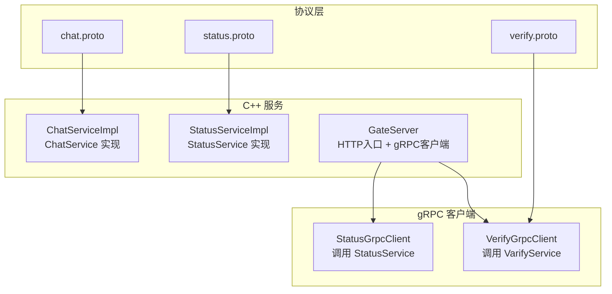
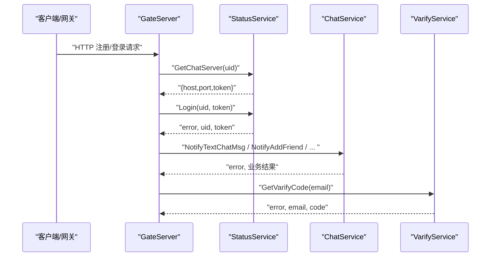
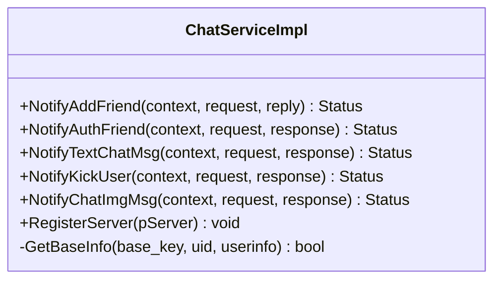
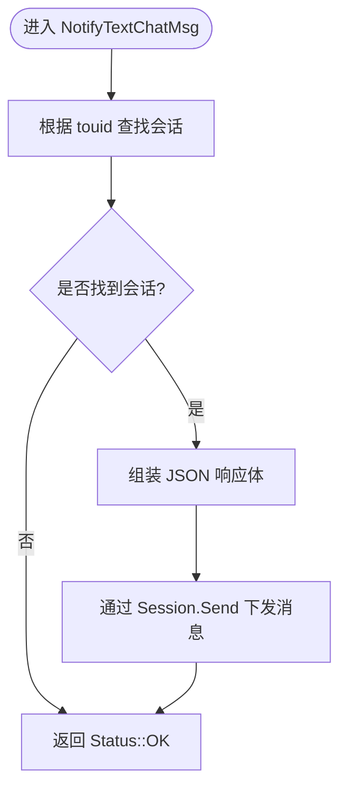
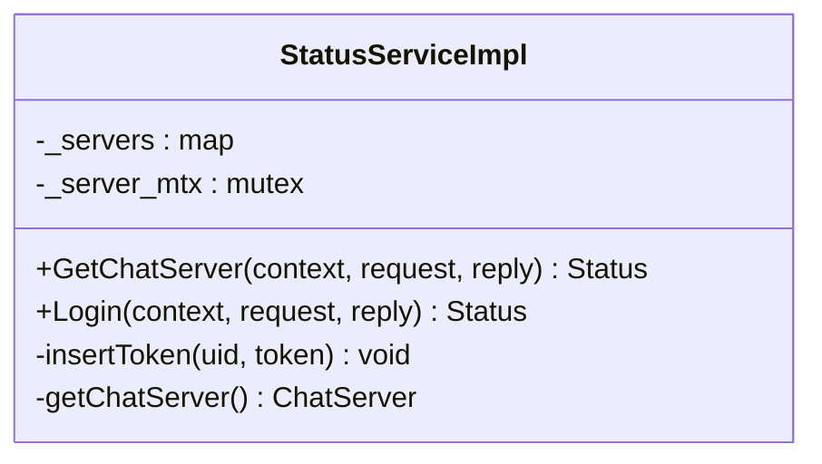
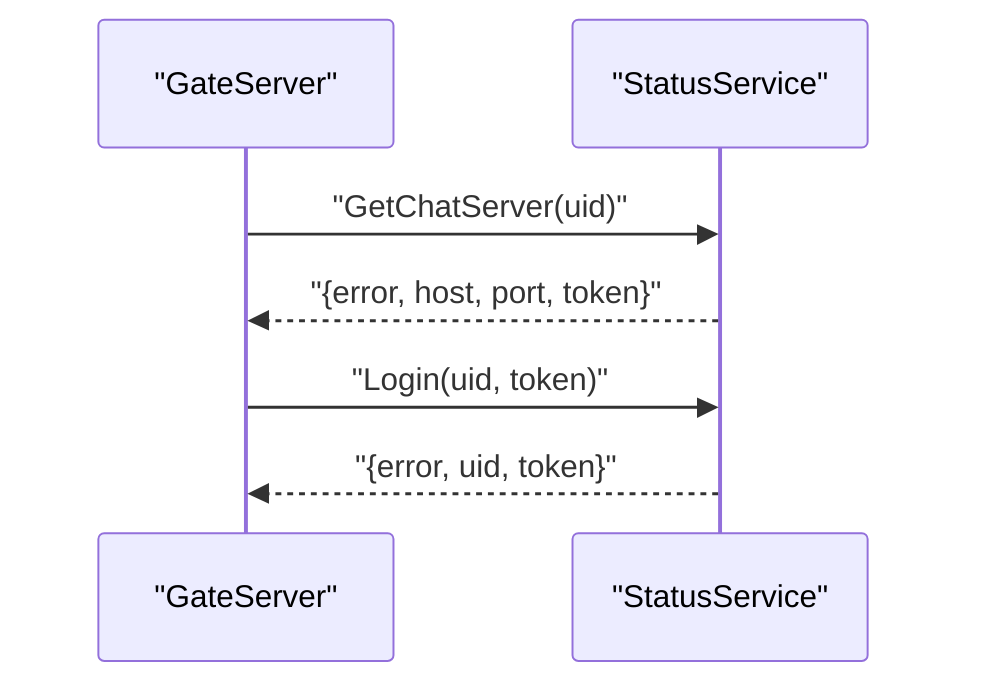
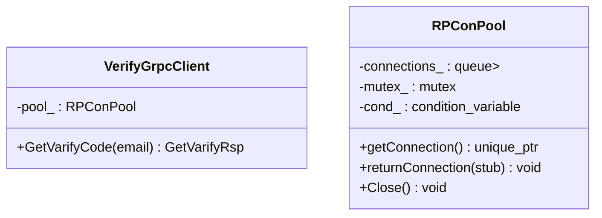
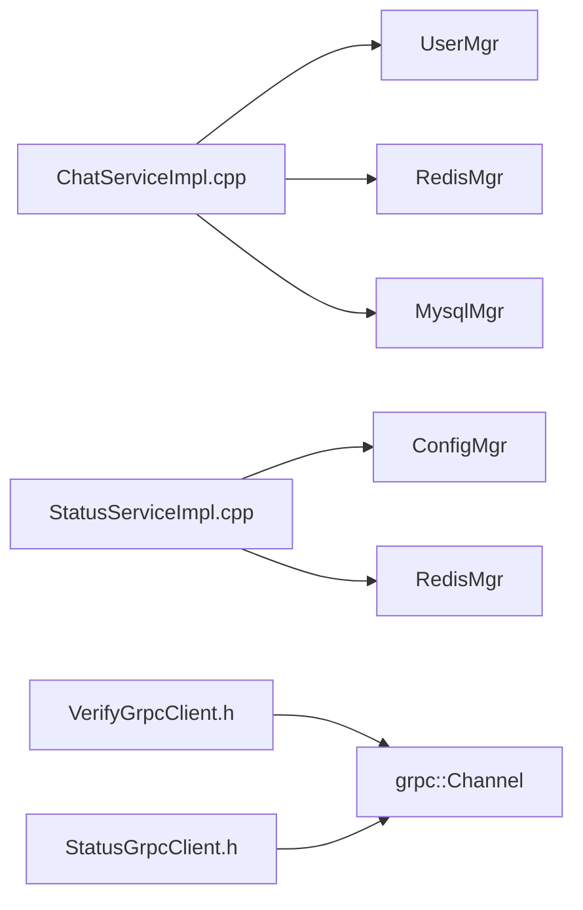

# gRPC微服务接口

<cite>
**本文引用的文件**   
- [chat.proto](file://proto/chat_service/chat.proto)
- [status.proto](file://proto/status_service/status.proto)
- [verify.proto](file://proto/verify_service/verify.proto)
- [ChatServiceImpl.h](file://server/ChatServer/include/ChatServiceImpl.h)
- [ChatServiceImpl.cpp](file://server/ChatServer/src/ChatServiceImpl.cpp)
- [StatusServiceImpl.h](file://server/StatusServer/include/StatusServiceImpl.h)
- [StatusServiceImpl.cpp](file://server/StatusServer/src/StatusServiceImpl.cpp)
- [VerifyGrpcClient.h](file://server/GateServer/include/VerifyGrpcClient.h)
- [StatusGrpcClient.h](file://server/GateServer/include/StatusGrpcClient.h)
- [const.h](file://server/GateServer/include/const.h)
</cite>

## 目录
1. [简介](#简介)
2. [项目结构](#项目结构)
3. [核心组件](#核心组件)
4. [架构总览](#架构总览)
5. [详细组件分析](#详细组件分析)
6. [依赖关系分析](#依赖关系分析)
7. [性能与可用性](#性能与可用性)
8. [故障排查指南](#故障排查指南)
9. [结论](#结论)
10. [附录：跨语言调用与调试](#附录跨语言调用与调试)

## 简介
本文件为 LLFCChat 的 gRPC 微服务接口文档，覆盖 ChatService、StatusService、VerifyService（在 proto 中命名为 VarifyService）三个服务的 RPC 方法定义、消息格式、错误码约定、客户端与服务端实现要点、连接配置、负载均衡与故障转移策略，以及跨语言调用示例和调试工具使用方法。同时给出服务发现与熔断降级的设计建议与实践路径。

## 项目结构
- 协议定义位于 proto 目录，分别对应 chat_service、status_service、verify_service。
- C++ 服务端实现位于 server 子目录：
  - ChatServer：提供 ChatService 实现，处理好友申请、认证、文本聊天、踢人、图片通知等。
  - StatusServer：提供 StatusService 实现，负责分配 ChatServer 地址与登录校验。
  - GateServer：聚合外部 HTTP 入口，并作为 gRPC 客户端调用 VerifyService 与 StatusService。
- 常量与错误码定义位于 const.h。

图表来源 
- [chat.proto:1-105](file://proto/chat_service/chat.proto#L1-L105)
- [status.proto:1-32](file://proto/status_service/status.proto#L1-L32)
- [verify.proto:1-19](file://proto/verify_service/verify.proto#L1-L19)
- [ChatServiceImpl.h:1-55](file://server/ChatServer/include/ChatServiceImpl.h#L1-L55)
- [StatusServiceImpl.h:1-52](file://server/StatusServer/include/StatusServiceImpl.h#L1-L52)
- [VerifyGrpcClient.h:1-113](file://server/GateServer/include/VerifyGrpcClient.h#L1-L113)
- [StatusGrpcClient.h:1-98](file://server/GateServer/include/StatusGrpcClient.h#L1-L98)

章节来源
- [chat.proto:1-105](file://proto/chat_service/chat.proto#L1-L105)
- [status.proto:1-32](file://proto/status_service/status.proto#L1-L32)
- [verify.proto:1-19](file://proto/verify_service/verify.proto#L1-L19)
- [const.h:31-44](file://server/GateServer/include/const.h#L31-L44)

## 核心组件
- ChatService：面向 ChatServer 内部或跨实例通信，包含好友申请通知、好友认证通知、文本聊天消息推送、踢人通知、图片消息通知等方法。
- StatusService：状态与路由服务，提供获取 ChatServer 地址与登录令牌校验。
- VarifyService（verify.proto）：验证码派发服务，由 GateServer 调用以发送邮箱验证码。

章节来源
- [chat.proto:6-12](file://proto/chat_service/chat.proto#L6-L12)
- [status.proto:6-9](file://proto/status_service/status.proto#L6-L9)
- [verify.proto:6-8](file://proto/verify_service/verify.proto#L6-L8)

## 架构总览
LLFCChat 采用多服务拆分：GateServer 暴露 HTTP 入口，通过 gRPC 调用 StatusService 完成用户登录与 ChatServer 路由；ChatServer 提供聊天业务 gRPC 能力；VarifyService（Node.js）提供验证码能力。

图表来源 
- [status.proto:6-9](file://proto/status_service/status.proto#L6-L9)
- [chat.proto:6-12](file://proto/chat_service/chat.proto#L6-L12)
- [verify.proto:6-8](file://proto/verify_service/verify.proto#L6-L8)
- [StatusGrpcClient.h:1-98](file://server/GateServer/include/StatusGrpcClient.h#L1-L98)
- [VerifyGrpcClient.h:1-113](file://server/GateServer/include/VerifyGrpcClient.h#L1-L113)

## 详细组件分析

### ChatService（ChatServer）
- 职责
  - 接收来自其他 ChatServer 或 GateServer 的通知类请求，将消息转发到在线用户的 TCP Session。
  - 支持好友申请、好友认证、文本聊天消息、踢人、图片下载通知等。
- 关键方法
  - NotifyAddFriend：向目标用户推送好友申请信息。
  - NotifyAuthFriend：向目标用户推送好友认证信息与历史消息摘要。
  - NotifyTextChatMsg：向目标用户推送文本聊天消息。
  - NotifyKickUser：踢出指定用户并清理会话。
  - NotifyChatImgMsg：通知目标用户有图片资源可下载。
- 错误码
  - 统一使用 ErrorCodes 枚举，如 Success、UidInvalid、TokenInvalid、RPCFailed 等。
- 数据流
  - 收到 gRPC 请求后，查询内存中的用户会话，若存在则构造 JSON 并通过 TCP 下发；否则直接返回成功状态（幂等）。

图表来源 
- [ChatServiceImpl.h:29-53](file://server/ChatServer/include/ChatServiceImpl.h#L29-L53)

图表来源 
- [ChatServiceImpl.cpp:105-139](file://server/ChatServer/src/ChatServiceImpl.cpp#L105-L139)

章节来源
- [chat.proto:6-12](file://proto/chat_service/chat.proto#L6-L12)
- [ChatServiceImpl.h:29-53](file://server/ChatServer/include/ChatServiceImpl.h#L29-L53)
- [ChatServiceImpl.cpp:16-47](file://server/ChatServer/src/ChatServiceImpl.cpp#L16-L47)
- [ChatServiceImpl.cpp:49-103](file://server/ChatServer/src/ChatServiceImpl.cpp#L49-L103)
- [ChatServiceImpl.cpp:105-139](file://server/ChatServer/src/ChatServiceImpl.cpp#L105-L139)
- [ChatServiceImpl.cpp:187-210](file://server/ChatServer/src/ChatServiceImpl.cpp#L187-L210)
- [ChatServiceImpl.cpp:217-239](file://server/ChatServer/src/ChatServiceImpl.cpp#L217-L239)
- [const.h:31-44](file://server/GateServer/include/const.h#L31-L44)

### StatusService（StatusServer）
- 职责
  - 为客户端或 GateServer 提供 ChatServer 的地址与令牌。
  - 校验登录令牌的有效性，防止重复登录或非法访问。
- 关键方法
  - GetChatServer：根据 uid 返回 ChatServer 的 host、port 与 token。
  - Login：校验 uid 与 token 的合法性。
- 负载均衡
  - 当前实现从配置中读取 ChatServer 列表，选择第一个（可扩展为基于 Redis 的连接数最小化策略）。
- 令牌管理
  - 使用 Redis 存储 uid -> token 映射，用于登录校验与防重登。

图表来源 
- [StatusServiceImpl.h:36-50](file://server/StatusServer/include/StatusServiceImpl.h#L36-L50)

图表来源 
- [status.proto:6-9](file://proto/status_service/status.proto#L6-L9)
- [StatusServiceImpl.cpp:17-27](file://server/StatusServer/src/StatusServiceImpl.cpp#L17-L27)
- [StatusServiceImpl.cpp:94-116](file://server/StatusServer/src/StatusServiceImpl.cpp#L94-L116)

章节来源
- [status.proto:6-9](file://proto/status_service/status.proto#L6-L9)
- [StatusServiceImpl.h:36-50](file://server/StatusServer/include/StatusServiceImpl.h#L36-L50)
- [StatusServiceImpl.cpp:17-27](file://server/StatusServer/src/StatusServiceImpl.cpp#L17-L27)
- [StatusServiceImpl.cpp:94-116](file://server/StatusServer/src/StatusServiceImpl.cpp#L94-L116)
- [const.h:31-44](file://server/GateServer/include/const.h#L31-L44)

### VarifyService（verify.proto，Node.js 实现）
- 职责
  - 为 GateServer 提供邮箱验证码派发能力。
- 关键方法
  - GetVarifyCode：根据 email 生成并下发验证码。
- 客户端封装
  - GateServer 通过 VerifyGrpcClient 维护连接池，复用 gRPC Channel/Stub，失败时设置统一错误码。

图表来源 
- [VerifyGrpcClient.h:18-78](file://server/GateServer/include/VerifyGrpcClient.h#L18-L78)
- [VerifyGrpcClient.h:80-113](file://server/GateServer/include/VerifyGrpcClient.h#L80-L113)

章节来源
- [verify.proto:6-8](file://proto/verify_service/verify.proto#L6-L8)
- [VerifyGrpcClient.h:1-113](file://server/GateServer/include/VerifyGrpcClient.h#L1-L113)
- [const.h:31-44](file://server/GateServer/include/const.h#L31-L44)

## 依赖关系分析
- 协议依赖
  - ChatService、StatusService、VarifyService 均使用 message 命名空间下的消息类型。
- 运行时依赖
  - ChatServiceImpl 依赖 UserMgr、RedisMgr、MysqlMgr、utils 等模块进行会话与数据访问。
  - StatusServiceImpl 依赖 ConfigMgr、RedisMgr 进行配置加载与令牌管理。
  - GateServer 的 gRPC 客户端依赖 InsecureChannelCredentials（开发环境），生产应替换为安全凭据。

图表来源 
- [ChatServiceImpl.cpp:1-10](file://server/ChatServer/src/ChatServiceImpl.cpp#L1-L10)
- [StatusServiceImpl.cpp:1-10](file://server/StatusServer/src/StatusServiceImpl.cpp#L1-L10)
- [VerifyGrpcClient.h:1-15](file://server/GateServer/include/VerifyGrpcClient.h#L1-L15)
- [StatusGrpcClient.h:1-10](file://server/GateServer/include/StatusGrpcClient.h#L1-L10)

章节来源
- [ChatServiceImpl.cpp:1-10](file://server/ChatServer/src/ChatServiceImpl.cpp#L1-L10)
- [StatusServiceImpl.cpp:1-10](file://server/StatusServer/src/StatusServiceImpl.cpp#L1-L10)
- [VerifyGrpcClient.h:1-15](file://server/GateServer/include/VerifyGrpcClient.h#L1-L15)
- [StatusGrpcClient.h:1-10](file://server/GateServer/include/StatusGrpcClient.h#L1-L10)

## 性能与可用性
- 连接池
  - VerifyGrpcClient 与 StatusGrpcClient 均实现了连接池，复用 Channel/Stub，减少握手开销。
- 负载均衡
  - StatusService 当前选择配置中的第一个 ChatServer；可扩展为基于 Redis 的连接计数最小化策略。
- 超时与重试
  - 建议在客户端 Context 设置合理超时，并在失败时进行有限次重试（指数退避）。
- 熔断与降级
  - 对频繁失败的下游服务启用熔断器（如固定窗口/滑动窗口统计），触发后快速失败或走降级逻辑（如缓存最近一次结果）。
- 背压与限流
  - 在高并发场景下，结合队列与线程池限制入站请求速率，避免雪崩。

[本节为通用指导，不直接分析具体文件]

## 故障排查指南
- 常见错误码
  - Success：操作成功。
  - RPCFailed：gRPC 调用失败。
  - TokenInvalid：令牌无效。
  - UidInvalid：用户 ID 无效。
  - VarifyExpired/VarifyCodeErr：验证码过期或错误。
- 定位步骤
  - 检查 gRPC 调用返回的 error 字段与 Status。
  - 查看 StatusService 的 Login 流程是否正确校验 Redis 中的 token。
  - 确认 ChatServiceImpl 是否能查找到目标用户的会话。
  - 核对 VerifyService 的验证码生成与过期策略。

章节来源
- [const.h:31-44](file://server/GateServer/include/const.h#L31-L44)
- [StatusServiceImpl.cpp:94-116](file://server/StatusServer/src/StatusServiceImpl.cpp#L94-L116)
- [ChatServiceImpl.cpp:105-139](file://server/ChatServer/src/ChatServiceImpl.cpp#L105-L139)

## 结论
LLFCChat 的 gRPC 微服务清晰划分了聊天、状态与验证码三大职责域。通过统一的错误码与消息格式，配合连接池与基础负载均衡，已具备较好的扩展性与稳定性。后续可在负载均衡、熔断降级、安全传输等方面进一步增强。

[本节为总结性内容，不直接分析具体文件]

## 附录：跨语言调用与调试

### Protocol Buffers 消息与方法一览
- ChatService
  - NotifyAddFriend(AddFriendReq) -> AddFriendRsp
  - NotifyAuthFriend(AuthFriendReq) -> AuthFriendRsp
  - NotifyTextChatMsg(TextChatMsgReq) -> TextChatMsgRsp
  - NotifyKickUser(KickUserReq) -> KickUserRsp
  - NotifyChatImgMsg(NotifyChatImgReq) -> NotifyChatImgRsp
- StatusService
  - GetChatServer(GetChatServerReq) -> GetChatServerRsp
  - Login(LoginReq) -> LoginRsp
- VarifyService
  - GetVarifyCode(GetVarifyReq) -> GetVarifyRsp

章节来源
- [chat.proto:6-12](file://proto/chat_service/chat.proto#L6-L12)
- [status.proto:6-9](file://proto/status_service/status.proto#L6-L9)
- [verify.proto:6-8](file://proto/verify_service/verify.proto#L6-L8)

### 连接配置
- 客户端通道
  - 开发环境使用不安全凭据（InsecureChannelCredentials），生产环境需替换为 TLS 凭据。
- 连接池大小
  - 根据 QPS 与 CPU 核数调整连接池大小，避免过多连接导致资源耗尽。
- 超时与重试
  - 为每个 RPC 设置合理的超时时间，并在失败时进行有限次重试。

章节来源
- [VerifyGrpcClient.h:20-28](file://server/GateServer/include/VerifyGrpcClient.h#L20-L28)
- [StatusGrpcClient.h:21-29](file://server/GateServer/include/StatusGrpcClient.h#L21-L29)

### 客户端与服务端实现要点（C++）
- 服务端
  - 继承 Service 基类并实现各 RPC 方法。
  - 使用 Defer 确保统一设置错误码与返回值。
- 客户端
  - 使用 NewStub(Channel) 创建 Stub，并通过连接池复用。
  - 捕获 Status 并转换为业务错误码。

章节来源
- [ChatServiceImpl.h:29-53](file://server/ChatServer/include/ChatServiceImpl.h#L29-L53)
- [ChatServiceImpl.cpp:16-47](file://server/ChatServer/src/ChatServiceImpl.cpp#L16-L47)
- [VerifyGrpcClient.h:87-104](file://server/GateServer/include/VerifyGrpcClient.h#L87-L104)
- [StatusGrpcClient.h:88-94](file://server/GateServer/include/StatusGrpcClient.h#L88-L94)

### 跨语言调用示例（概念性）
- Go
  - 使用 protoc-gen-go-grpc 生成代码，创建 Channel 与 Stub，调用相应 RPC。
- Python
  - 使用 grpcio-tools 生成代码，创建 Channel 与 Stub，调用相应 RPC。
- C++
  - 使用 gRPC C++ 库，创建 Channel 与 Stub，调用相应 RPC。

[本节为概念性说明，不直接分析具体文件]

### 调试工具使用方法
- grpcurl
  - 使用 grpcurl 列出服务方法与描述，便于验证接口契约。
- grpc_cli
  - 使用命令行工具直接发起 RPC 请求，观察返回结果。
- 日志与追踪
  - 在服务端打印关键路径日志，结合分布式追踪（如 OpenTelemetry）定位问题。

[本节为通用指导，不直接分析具体文件]