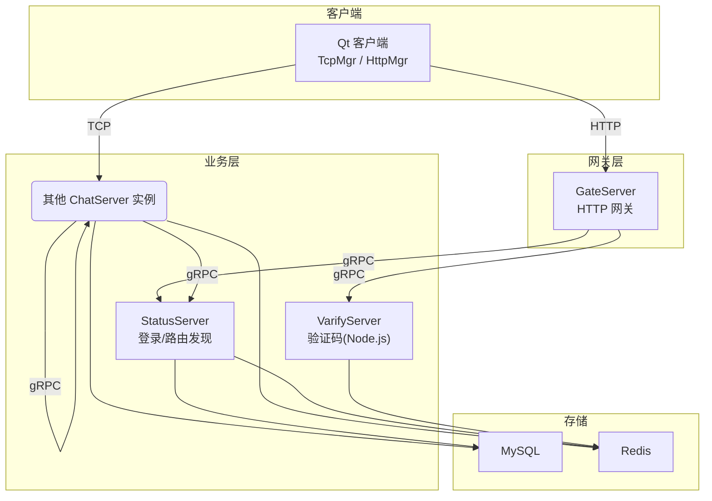
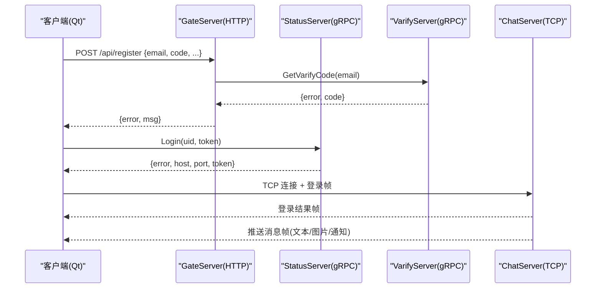
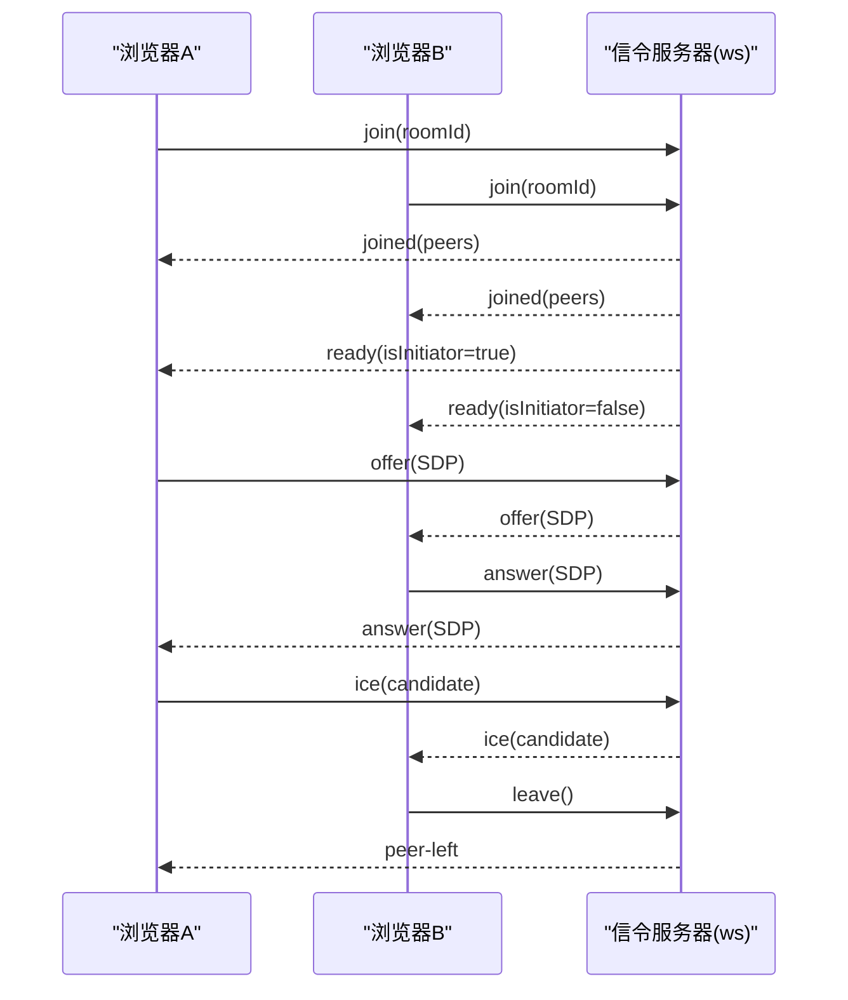
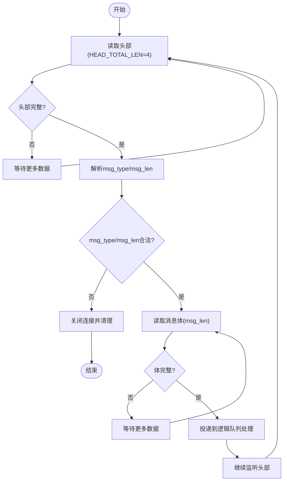
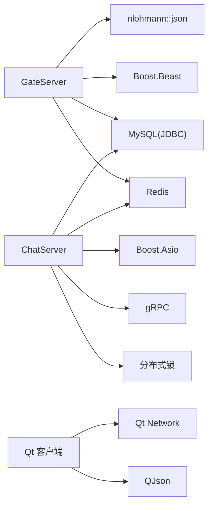

# 网络通信

<cite>
**本文引用的文件**   
- [README.md](file://README.md)
- [chat.proto](file://proto/chat_service/chat.proto)
- [status.proto](file://proto/status_service/status.proto)
- [verify.proto](file://proto/verify_service/verify.proto)
- [message.proto (VarifyServer)](file://server/VarifyServer/message.proto)
- [HttpConnection.h](file://server/GateServer/include/HttpConnection.h)
- [HttpConnection.cpp](file://server/GateServer/src/HttpConnection.cpp)
- [CSession.h](file://server/ChatServer/include/CSession.h)
- [CSession.cpp](file://server/ChatServer/src/CSession.cpp)
- [const.h (GateServer)](file://server/GateServer/include/const.h)
- [const.h (ChatServer)](file://server/ChatServer/include/const.h)
- [tcpmgr.h](file://client/llfcchat/include/tcpmgr.h)
- [tcpmgr.cpp](file://client/llfcchat/src/tcpmgr.cpp)
- [httpmgr.h](file://client/llfcchat/include/httpmgr.h)
- [day44-webrtc信令服务器实现.md](file://开发文档/day44-webrtc信令服务器实现.md)
</cite>

## 目录
1. [简介](#简介)
2. [项目结构](#项目结构)
3. [核心组件](#核心组件)
4. [架构总览](#架构总览)
5. [详细组件分析](#详细组件分析)
6. [依赖关系分析](#依赖关系分析)
7. [性能考虑](#性能考虑)
8. [故障排查指南](#故障排查指南)
9. [结论](#结论)
10. [附录](#附录)

## 简介
本文件为 LLFCChat 网络通信系统的 API 文档，覆盖以下通信方式：
- RESTful API（HTTP）：方法、URL 模式、请求/响应格式、鉴权与错误码
- WebSocket API（WebRTC 信令）：连接处理、消息格式、事件类型、实时交互流程
- Socket API（TCP 长连接）：连接协议、数据帧、二进制格式、状态管理
- IPC/Pipe 通信：进程间数据流、消息传递与同步（基于 gRPC 的跨服务调用）
同时包含协议示例、错误处理策略、安全考量、速率限制建议、版本信息、常见用例、客户端实现指南、性能优化技巧以及调试与监控方法。

## 项目结构
LLFCChat 采用多服务分布式架构，主要包含：
- GateServer：HTTP 网关，负责 REST 路由、参数解析、鉴权转发
- ChatServer：聊天业务主服务，维护 TCP 会话、消息路由、好友认证、文本/图片消息通知
- StatusServer：状态服务，提供登录与 ChatServer 路由发现
- VarifyServer：验证码服务（Node.js），提供邮箱验证码生成
- Client（Qt）：桌面客户端，封装 HTTP 与 TCP 通信

图表来源
- [HttpConnection.cpp:1-225](file://server/GateServer/src/HttpConnection.cpp#L1-L225)
- [CSession.cpp:1-200](file://server/ChatServer/src/CSession.cpp#L1-L200)
- [status.proto:1-32](file://proto/status_service/status.proto#L1-L32)
- [verify.proto:1-19](file://proto/verify_service/verify.proto#L1-L19)
- [message.proto (VarifyServer):1-44](file://server/VarifyServer/message.proto#L1-L44)

章节来源
- [README.md:1-112](file://README.md#L1-L112)

## 核心组件
- GateServer HTTP 网关：基于 Boost.Beast 异步处理 GET/POST，解析 URL 与查询参数，统一返回 JSON，并转发至后端服务
- ChatServer TCP 会话：自定义二进制帧（头部+体），心跳保活，发送队列限流，异常连接清理
- StatusServer 状态服务：用户登录校验、分配 ChatServer 地址与 Token
- VarifyServer 验证码服务：按邮箱生成验证码，缓存于 Redis
- Qt 客户端：HttpMgr 封装 HTTP 请求；TcpMgr 封装 TCP 粘包处理、消息分发与信号回调

章节来源
- [HttpConnection.h:1-36](file://server/GateServer/include/HttpConnection.h#L1-L36)
- [HttpConnection.cpp:1-225](file://server/GateServer/src/HttpConnection.cpp#L1-L225)
- [CSession.h:1-86](file://server/ChatServer/include/CSession.h#L1-L86)
- [CSession.cpp:1-200](file://server/ChatServer/src/CSession.cpp#L1-L200)
- [tcpmgr.h:1-90](file://client/llfcchat/include/tcpmgr.h#L1-L90)
- [tcpmgr.cpp:1-200](file://client/llfcchat/src/tcpmgr.cpp#L1-L200)
- [httpmgr.h:1-34](file://client/llfcchat/include/httpmgr.h#L1-L34)

## 架构总览
系统通过 GateServer 暴露 REST API，内部使用 gRPC 进行服务间通信；聊天实时通信通过 ChatServer 的 TCP 长连接完成；WebRTC 视频通话的信令由独立的 Node.js WebSocket 服务承担。

图表来源
- [status.proto:1-32](file://proto/status_service/status.proto#L1-L32)
- [verify.proto:1-19](file://proto/verify_service/verify.proto#L1-L19)
- [message.proto (VarifyServer):1-44](file://server/VarifyServer/message.proto#L1-L44)
- [CSession.cpp:1-200](file://server/ChatServer/src/CSession.cpp#L1-L200)

## 详细组件分析

### RESTful API（GateServer）
- 协议与框架：HTTP/1.1，Boost.Beast 异步 I/O
- 路由与解析：GET 支持查询参数解析；POST 支持 JSON Body
- 鉴权：Token 校验（由 StatusServer 签发），错误码集中定义
- 错误码：ErrorCodes 枚举（如 TokenInvalid、UidInvalid、RPCFailed 等）

常用接口（示例）
- POST /api/login
  - 请求体：{uid, token}
  - 响应体：{error, uid, token}
- POST /api/register
  - 请求体：{email, code, password, ...}
  - 响应体：{error, msg}
- GET /api/user/search?keyword=...
  - 查询参数：keyword
  - 响应体：{error, list}

身份验证
- 登录成功后由 StatusServer 返回 token，后续请求需在 Header 或 Body 中携带 token
- GateServer 对 token 有效性进行校验，失败返回 TokenInvalid

错误处理
- 未匹配路由返回 404 与 text/plain 提示
- JSON 解析失败返回 Error_Json
- RPC 调用失败返回 RPCFailed

速率限制与安全
- 建议在 GateServer 入口增加 IP/UID 维度的频率限制（如令牌桶）
- CORS 允许所有来源（生产环境应限制具体域名）
- 输入校验与长度限制（防止超大请求）

版本信息
- 当前未显式版本号，建议在 URL 前缀加入 v1/v2 以兼容演进

章节来源
- [HttpConnection.cpp:1-225](file://server/GateServer/src/HttpConnection.cpp#L1-L225)
- [const.h (GateServer):1-65](file://server/GateServer/include/const.h#L1-L65)

### WebSocket API（WebRTC 信令）
- 技术栈：Node.js + Express + ws
- 职责：房间管理、offer/answer/ice 信令转发，不参与媒体传输
- 连接建立：复用 HTTP 端口，路径升级至 WebSocket

消息格式（JSON）
- join：{type:"join", roomId:"room1"}
- ready：{type:"ready", isInitiator:true/false}
- offer/answer/ice：透传 WebRTC 协商对象
- leave：{type:"leave"}
- 错误：{type:"error", message:"..."}

交互流程

章节来源
- [day44-webrtc信令服务器实现.md:1-367](file://开发文档/day44-webrtc信令服务器实现.md#L1-L367)

### Socket API（ChatServer TCP）
- 连接模型：每连接一个 CSession，异步读写，心跳保活
- 数据帧格式：固定头部（消息类型 2字节 + 消息长度 2字节）+ 可变长度消息体
- 发送队列：线程安全队列，最大长度限制，避免内存溢出
- 心跳机制：记录最后接收时间，超时判定离线并清理

帧解析流程

章节来源
- [CSession.h:1-86](file://server/ChatServer/include/CSession.h#L1-L86)
- [CSession.cpp:1-200](file://server/ChatServer/src/CSession.cpp#L1-L200)
- [const.h (ChatServer):1-104](file://server/ChatServer/include/const.h#L1-L104)

### gRPC 服务（Status/Verify/Chat）
- StatusService：GetChatServer、Login
- VarifyService：GetVarifyCode
- ChatService：NotifyAddFriend、NotifyAuthFriend、NotifyTextChatMsg、NotifyKickUser、NotifyChatImgMsg

消息与字段说明
- LoginReq/Resp：uid、token、error
- GetChatServerReq/Resp：uid -> host/port/token
- GetVarifyReq/Resp：email -> code
- ChatService 各 Notify*：用于服务间通知（如好友申请、文本消息、图片通知、踢人）

章节来源
- [status.proto:1-32](file://proto/status_service/status.proto#L1-L32)
- [verify.proto:1-19](file://proto/verify_service/verify.proto#L1-L19)
- [message.proto (VarifyServer):1-44](file://server/VarifyServer/message.proto#L1-L44)
- [chat.proto:1-105](file://proto/chat_service/chat.proto#L1-L105)

### 客户端实现（Qt）
- HttpMgr：封装 QNetworkAccessManager，统一 Post 请求与回调
- TcpMgr：封装 QTcpSocket，处理粘包、消息头解析、发送队列、错误与断开处理
- 信号槽：将网络事件映射为 UI 可响应的信号（登录、搜索、好友申请、聊天消息等）

章节来源
- [httpmgr.h:1-34](file://client/llfcchat/include/httpmgr.h#L1-L34)
- [tcpmgr.h:1-90](file://client/llfcchat/include/tcpmgr.h#L1-L90)
- [tcpmgr.cpp:1-200](file://client/llfcchat/src/tcpmgr.cpp#L1-L200)

## 依赖关系分析
- GateServer 依赖 nlohmann/json、Boost.Beast、MySQL JDBC、Redis（通过 MysqlMgr/RedisMgr）
- ChatServer 依赖 Boost.Asio、gRPC、MySQL、Redis、分布式锁
- 客户端依赖 Qt 网络模块与 JSON 库

图表来源
- [const.h (GateServer):1-65](file://server/GateServer/include/const.h#L1-L65)
- [const.h (ChatServer):1-104](file://server/ChatServer/include/const.h#L1-L104)

章节来源
- [const.h (GateServer):1-65](file://server/GateServer/include/const.h#L1-L65)
- [const.h (ChatServer):1-104](file://server/ChatServer/include/const.h#L1-L104)

## 性能考虑
- 异步 I/O：GateServer 与 ChatServer 均采用非阻塞 I/O，提升并发能力
- 粘包处理：客户端与服务端均实现固定头部+变长体的帧解析，避免粘包/半包问题
- 发送队列限流：服务端设置 MAX_SENDQUE，防止内存暴涨
- 心跳保活：服务端记录最后接收时间，及时清理僵尸连接
- 资源分离：静态资源与信令服务独立部署，减少耦合
- 数据库与缓存：热点数据入 Redis，降低 DB 压力

[本节为通用指导，不直接分析具体文件]

## 故障排查指南
- HTTP 404：检查路由是否注册，确认 URL 与参数解析逻辑
- JSON 解析失败：检查 Content-Type 与请求体格式，定位 Error_Json
- Token 失效：核对 StatusServer 登录流程与 token 生命周期
- TCP 断连：查看心跳超时与异常连接清理逻辑，检查客户端重连策略
- 粘包/半包：确认头部长度与体长度一致，检查缓冲区处理顺序
- 验证码过期：核对 VarifyServer 缓存 TTL 与重试次数

章节来源
- [HttpConnection.cpp:1-225](file://server/GateServer/src/HttpConnection.cpp#L1-L225)
- [CSession.cpp:1-200](file://server/ChatServer/src/CSession.cpp#L1-L200)
- [tcpmgr.cpp:1-200](file://client/llfcchat/src/tcpmgr.cpp#L1-L200)

## 结论
LLFCChat 的网络通信体系以 GateServer 作为 HTTP 入口，ChatServer 承载实时聊天，StatusServer 与 VarifyServer 提供辅助能力，并通过 gRPC 解耦服务边界。WebSocket 信令独立部署，满足 WebRTC 低延迟需求。整体设计强调异步高并发、健壮的数据帧解析与完善的错误处理，适合扩展与运维监控。

[本节为总结性内容，不直接分析具体文件]

## 附录

### 协议与消息速查
- HTTP 错误码：见 const.h (GateServer) 中的 ErrorCodes
- TCP 消息类型：见 const.h (ChatServer) 中的 MSG_TYPES
- gRPC 服务与消息：见 proto 目录下的 chat/status/verify 定义

章节来源
- [const.h (GateServer):1-65](file://server/GateServer/include/const.h#L1-L65)
- [const.h (ChatServer):1-104](file://server/ChatServer/include/const.h#L1-L104)
- [chat.proto:1-105](file://proto/chat_service/chat.proto#L1-L105)
- [status.proto:1-32](file://proto/status_service/status.proto#L1-L32)
- [verify.proto:1-19](file://proto/verify_service/verify.proto#L1-L19)