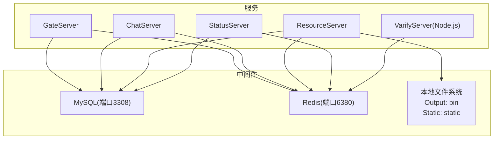
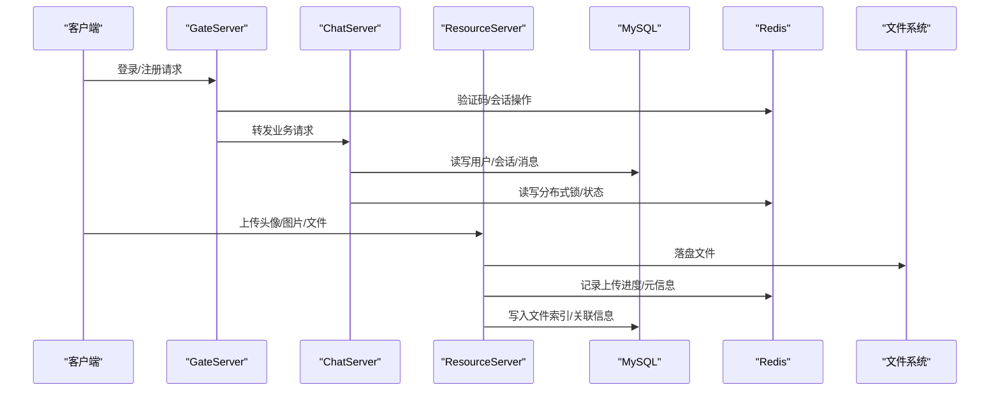
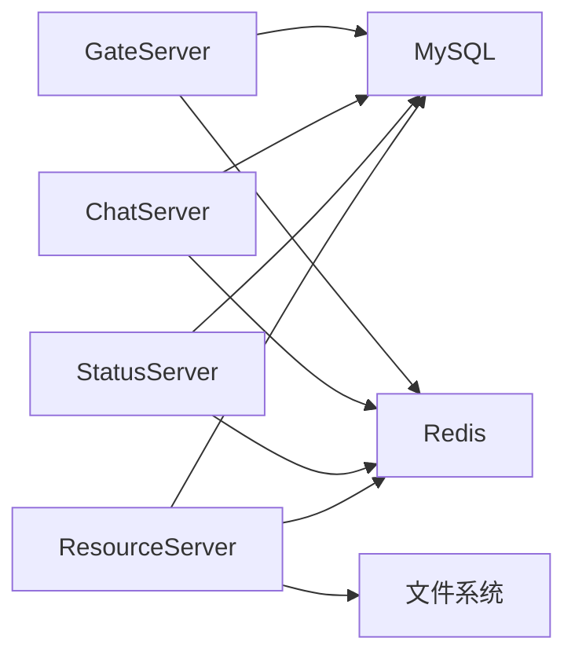

# 备份恢复

<cite>
**本文引用的文件**   
- [README.md](file://README.md)
- [chatserver1.ini](file://server/ChatServer/config/chatserver1.ini)
- [config.ini（GateServer）](file://server/GateServer/config/config.ini)
- [config.ini（ResourceServer）](file://server/ResourceServer/config/config.ini)
- [config.ini（StatusServer）](file://server/StatusServer/config/config.ini)
- [llfc.sql](file://sql备份/llfc.sql)
- [redis.js](file://server/VarifyServer/redis.js)
- [FileSystem.h](file://server/ResourceServer/include/FileSystem.h)
- [FileSystem.cpp](file://server/ResourceServer/src/FileSystem.cpp)
- [const.h](file://server/ResourceServer/include/const.h)
- [day09-redis服务搭建.md](file://开发文档/day09-redis服务搭建.md)
- [day38-断点续传.md](file://开发文档/day38-断点续传.md)
</cite>

## 目录
1. [简介](#简介)
2. [项目结构](#项目结构)
3. [核心组件](#核心组件)
4. [架构总览](#架构总览)
5. [详细组件分析](#详细组件分析)
6. [依赖关系分析](#依赖关系分析)
7. [性能考虑](#性能考虑)
8. [故障排查指南](#故障排查指南)
9. [结论](#结论)
10. [附录](#附录)

## 简介
本文件为 LLFCChat 项目的备份与恢复策略说明，覆盖以下范围：
- MySQL 全量备份、增量备份、binlog 备份策略
- Redis 数据持久化配置（RDB 快照、AOF 日志）、数据迁移
- 文件存储备份（头像、聊天图片、用户上传文件）
- 灾难恢复流程（恢复步骤、服务重启顺序、一致性校验）
- 备份验证与测试方法
- 自动化备份脚本与恢复演练流程

## 项目结构
LLFCChat 由多个后端服务组成，分别通过配置文件指定 MySQL、Redis 等中间件连接信息；资源服务负责文件上传下载；验证码服务使用 Node.js + ioredis 管理验证码与心跳。

图表来源
- [config.ini（GateServer）:9-18](file://server/GateServer/config/config.ini#L9-L18)
- [chatserver1.ini:14-23](file://server/ChatServer/config/chatserver1.ini#L14-L23)
- [config.ini（ResourceServer）:5-18](file://server/ResourceServer/config/config.ini#L5-L18)
- [config.ini（StatusServer）:4-13](file://server/StatusServer/config/config.ini#L4-L13)
- [redis.js:6-13](file://server/VarifyServer/redis.js#L6-L13)

章节来源
- [README.md:1-112](file://README.md#L1-L112)
- [config.ini（GateServer）:1-25](file://server/GateServer/config/config.ini#L1-L25)
- [chatserver1.ini:1-30](file://server/ChatServer/config/chatserver1.ini#L1-L30)
- [config.ini（ResourceServer）:1-27](file://server/ResourceServer/config/config.ini#L1-L27)
- [config.ini（StatusServer）:1-23](file://server/StatusServer/config/config.ini#L1-L23)
- [redis.js:1-101](file://server/VarifyServer/redis.js#L1-L101)

## 核心组件
- MySQL 数据库
  - 库名：llfc
  - 主要表：user、friend、friend_apply、chat_thread、private_chat、group_chat、group_chat_member、chat_message 等
  - 参考 SQL 备份文件：llfc.sql
- Redis 缓存
  - 用于验证码、用户会话、分布式锁、上传进度等
  - 验证码服务使用 ioredis 客户端
- 文件存储
  - ResourceServer 输出路径 Output.Path=bin，静态路径 Static.Path=static
  - 文件上传/下载由 FileSystem 及 FileWorker/DownloadWorker 处理

章节来源
- [llfc.sql:1-756](file://sql备份/llfc.sql#L1-L756)
- [config.ini（ResourceServer）:15-18](file://server/ResourceServer/config/config.ini#L15-L18)
- [FileSystem.h:1-21](file://server/ResourceServer/include/FileSystem.h#L1-L21)
- [FileSystem.cpp:1-29](file://server/ResourceServer/src/FileSystem.cpp#L1-L29)
- [redis.js:1-101](file://server/VarifyServer/redis.js#L1-L101)

## 架构总览
从备份恢复视角，系统的关键数据面如下：
- MySQL：结构化业务数据（用户、好友、会话、消息等）
- Redis：临时状态与热点数据（验证码、会话、锁、上传进度）
- 文件系统：非结构化数据（头像、聊天图片、通用文件）

图表来源
- [config.ini（GateServer）:1-25](file://server/GateServer/config/config.ini#L1-L25)
- [chatserver1.ini:1-30](file://server/ChatServer/config/chatserver1.ini#L1-L30)
- [config.ini（ResourceServer）:1-27](file://server/ResourceServer/config/config.ini#L1-L27)
- [redis.js:1-101](file://server/VarifyServer/redis.js#L1-L101)

## 详细组件分析

### MySQL 备份策略
- 全量备份
  - 使用 mysqldump 对 llfc 库进行逻辑备份，生成 .sql 文件
  - 建议定期执行并异地归档，保留多份历史版本
- 增量备份
  - 开启 MySQL binlog，按时间点或事务点进行增量恢复
  - 结合全量备份实现 PITR（Point-in-Time Recovery）
- Binlog 备份
  - 定时复制 binlog 到安全位置，确保可恢复到任意时刻
- 注意事项
  - 备份前检查外键约束与字符集设置
  - 大表建议分库分表或分区后单独备份
  - 备份期间避免影响在线写入高峰

章节来源
- [llfc.sql:1-756](file://sql备份/llfc.sql#L1-L756)

### Redis 持久化与迁移
- RDB 快照
  - 定期触发 save/bgsave，生成 dump.rdb 快照文件
  - 适合冷备与快速恢复，但可能丢失最后一次快照后的数据
- AOF 日志
  - 启用 appendonly 与合适的 fsync 策略（everysec 推荐）
  - 保证较高数据安全性，恢复时重放 AOF
- 数据迁移
  - 跨版本迁移可使用 redis-dump/redis-cli --pipe 或管道导出导入
  - 注意 key 命名空间与过期时间保持一致

章节来源
- [day09-redis服务搭建.md:1-808](file://开发文档/day09-redis服务搭建.md#L1-L808)
- [redis.js:1-101](file://server/VarifyServer/redis.js#L1-L101)

### 文件存储备份
- 存储路径
  - Output.Path=bin，Static.Path=static
  - 头像、聊天图片、用户上传文件均落盘至该路径
- 备份策略
  - 全量同步：rsync/sync 将 bin/static 目录同步到远端或对象存储
  - 增量同步：基于时间戳或增量工具（如 rclone、duplicati）
  - 元数据一致性：与 MySQL 中的文件索引保持同步
- 注意事项
  - 大文件传输建议使用断点续传与校验（MD5/SHA）
  - 备份前暂停写入或使用快照，保证一致性

章节来源
- [config.ini（ResourceServer）:15-18](file://server/ResourceServer/config/config.ini#L15-L18)
- [FileSystem.h:1-21](file://server/ResourceServer/include/FileSystem.h#L1-L21)
- [FileSystem.cpp:1-29](file://server/ResourceServer/src/FileSystem.cpp#L1-L29)
- [const.h:1-117](file://server/ResourceServer/include/const.h#L1-L117)

### 灾难恢复流程
- 恢复顺序
  1) 启动 MySQL，恢复全量 .sql，再回放 binlog 到目标时间点
  2) 启动 Redis，优先恢复 AOF 再加载 RDB 快照
  3) 恢复文件系统（bin/static），校验文件完整性
  4) 依次启动各服务：StatusServer → ChatServer → GateServer → ResourceServer
- 一致性校验
  - 比对关键表行数、最近消息 ID、用户会话数量
  - 随机抽样校验文件 MD5 与数据库索引一致
- 回滚策略
  - 若恢复失败，回到上一个已知良好的备份点重新执行

章节来源
- [config.ini（StatusServer）:1-23](file://server/StatusServer/config/config.ini#L1-L23)
- [config.ini（ChatServer）:1-30](file://server/ChatServer/config/chatserver1.ini#L1-L30)
- [config.ini（GateServer）:1-25](file://server/GateServer/config/config.ini#L1-L25)
- [config.ini（ResourceServer）:1-27](file://server/ResourceServer/config/config.ini#L1-L27)

### 备份验证与测试
- 单元测试
  - 在隔离环境导入 .sql，验证建表与数据完整性
  - 模拟 Redis 恢复，验证 key 集合与过期时间
- 集成测试
  - 启动服务后执行登录、发消息、上传头像/图片等操作，确认读写正常
  - 校验文件下载与数据库索引一致
- 演练计划
  - 每月进行一次完整恢复演练，记录耗时与问题
  - 建立回滚预案与告警机制

章节来源
- [llfc.sql:1-756](file://sql备份/llfc.sql#L1-L756)
- [day09-redis服务搭建.md:1-808](file://开发文档/day09-redis服务搭建.md#L1-L808)

### 自动化备份脚本与恢复演练
- MySQL 备份
  - 每日凌晨执行 mysqldump 全量备份，每小时增量复制 binlog
  - 备份文件命名包含日期与时间戳，保留 N 天
- Redis 备份
  - 定时触发 bgsave，并将 dump.rdb 与 AOF 文件同步到远端
- 文件备份
  - 使用 rsync/rclone 增量同步 bin/static 到对象存储或 NAS
- 恢复演练
  - 编写一键恢复脚本，按顺序恢复 MySQL → Redis → 文件 → 启动服务
  - 自动执行一致性校验并上报结果

章节来源
- [config.ini（ResourceServer）:15-18](file://server/ResourceServer/config/config.ini#L15-L18)
- [day09-redis服务搭建.md:1-808](file://开发文档/day09-redis服务搭建.md#L1-L808)

## 依赖关系分析
- 服务与中间件依赖
  - GateServer、ChatServer、StatusServer 均依赖 MySQL 与 Redis
  - ResourceServer 额外依赖本地文件系统
- 配置集中性
  - 各服务通过 ini 配置文件声明中间件地址、端口、密码
- 风险点
  - 单点故障：MySQL、Redis、文件存储需高可用部署
  - 配置泄露：配置文件含敏感信息，需加密与权限控制

图表来源
- [config.ini（GateServer）:9-18](file://server/GateServer/config/config.ini#L9-L18)
- [chatserver1.ini:14-23](file://server/ChatServer/config/chatserver1.ini#L14-L23)
- [config.ini（StatusServer）:4-13](file://server/StatusServer/config/config.ini#L4-L13)
- [config.ini（ResourceServer）:5-18](file://server/ResourceServer/config/config.ini#L5-L18)

章节来源
- [config.ini（GateServer）:1-25](file://server/GateServer/config/config.ini#L1-L25)
- [chatserver1.ini:1-30](file://server/ChatServer/config/chatserver1.ini#L1-L30)
- [config.ini（StatusServer）:1-23](file://server/StatusServer/config/config.ini#L1-L23)
- [config.ini（ResourceServer）:1-27](file://server/ResourceServer/config/config.ini#L1-L27)

## 性能考虑
- MySQL
  - 合理索引设计，避免全表扫描
  - 备份期间限制并发写入，降低 IO 压力
- Redis
  - 使用连接池减少连接开销
  - AOF fsync 策略平衡性能与安全
- 文件存储
  - 大文件分片上传与并行下载
  - 使用 CDN 或对象存储加速访问

[本节为通用指导，不直接分析具体文件]

## 故障排查指南
- MySQL 故障
  - 检查连接参数与权限
  - 查看错误日志与慢查询日志
- Redis 故障
  - 检查认证与网络连通性
  - 监控内存与持久化状态
- 文件存储故障
  - 检查磁盘空间与权限
  - 校验文件完整性与索引一致性

章节来源
- [day09-redis服务搭建.md:1-808](file://开发文档/day09-redis服务搭建.md#L1-L808)
- [redis.js:1-101](file://server/VarifyServer/redis.js#L1-L101)

## 结论
通过制定完善的 MySQL、Redis、文件存储备份策略，并结合自动化脚本与定期演练，可有效保障 LLFCChat 的数据安全与服务可用性。建议在生产环境实施高可用架构与严格的权限管控，持续优化备份与恢复流程。

[本节为总结，不直接分析具体文件]

## 附录
- 常用命令参考
  - MySQL：mysqldump、mysqlbinlog、pt-archiver
  - Redis：bgsave、aof-rewrite、redis-cli
  - 文件：rsync、rclone、md5sum
- 备份周期建议
  - 全量：每日一次
  - 增量：每小时一次
  - binlog：实时复制

[本节为补充信息，不直接分析具体文件]