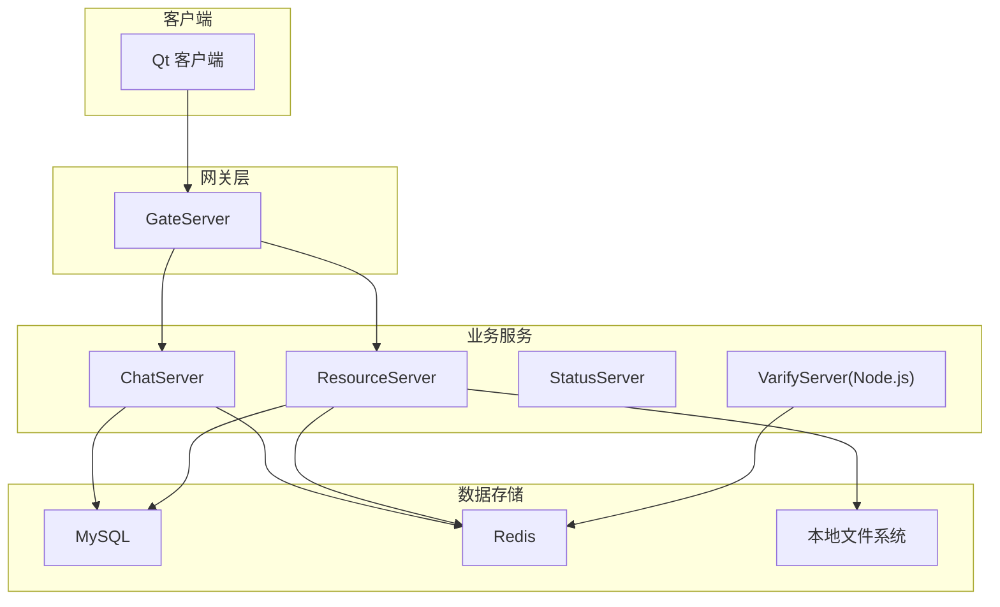
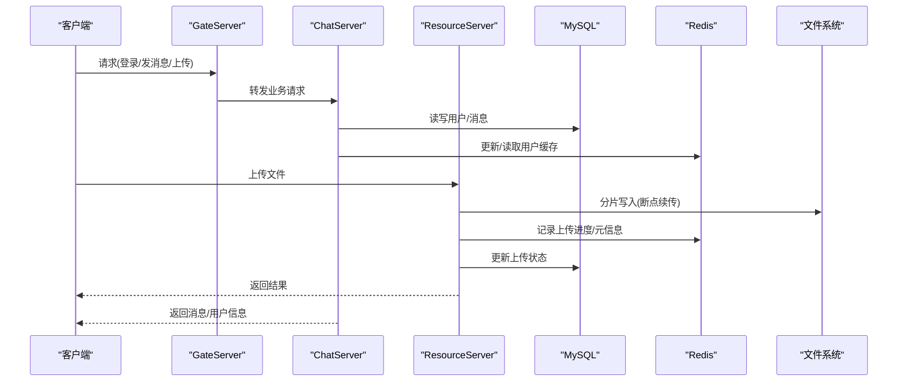
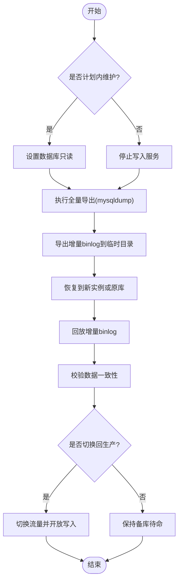
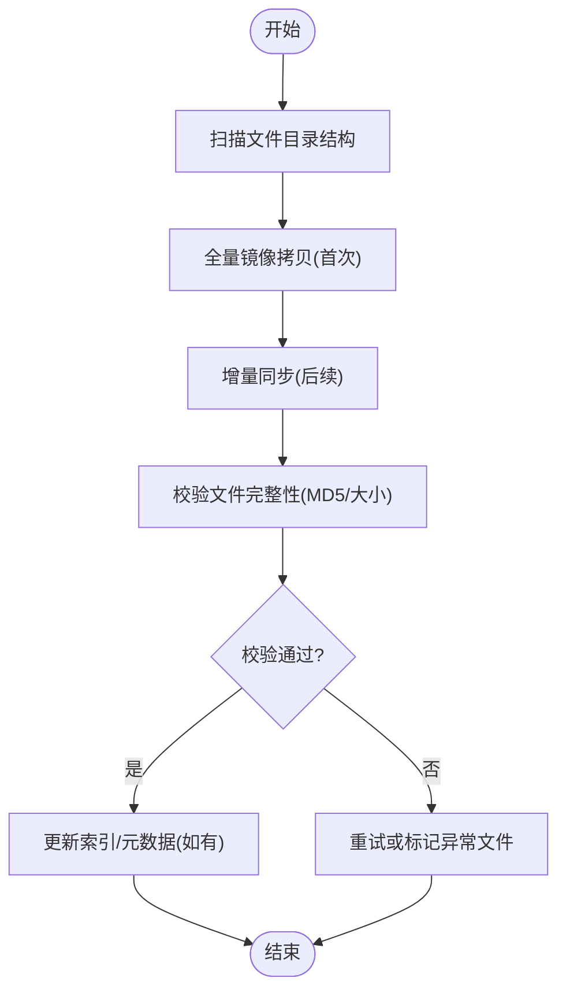
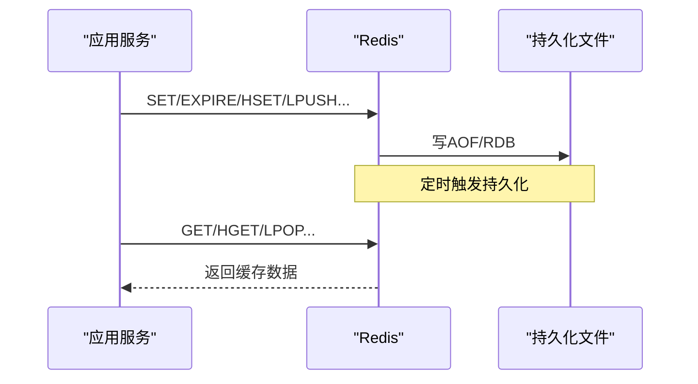
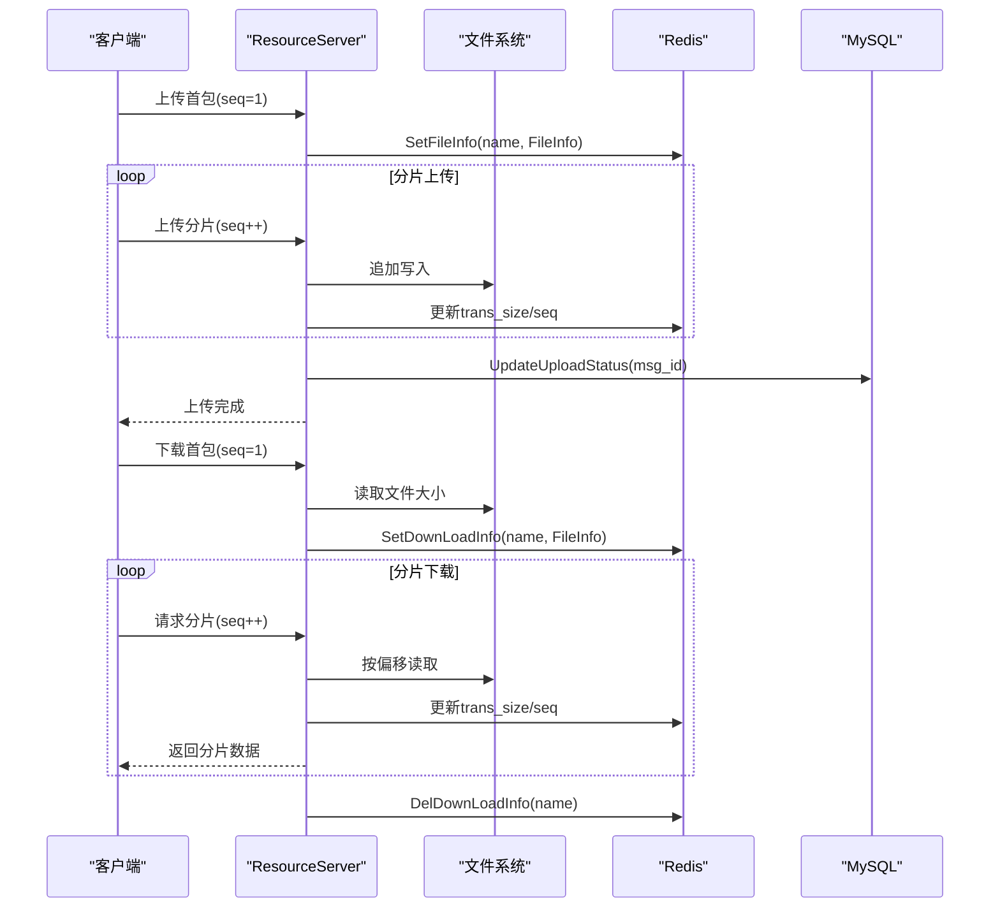
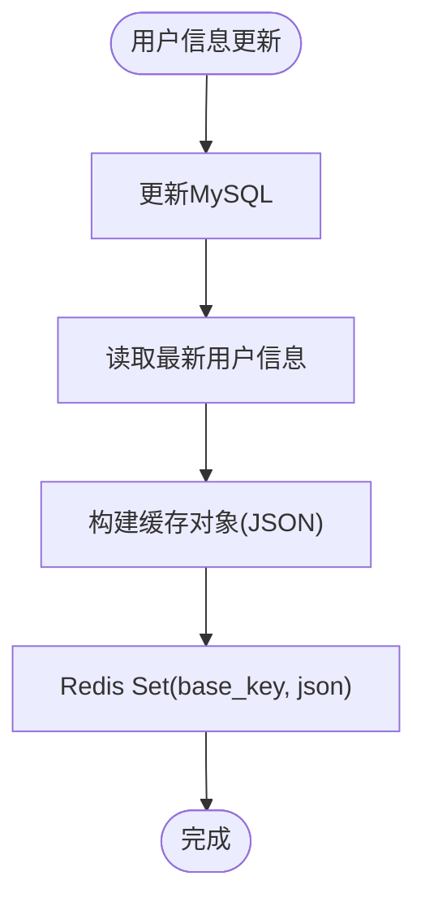
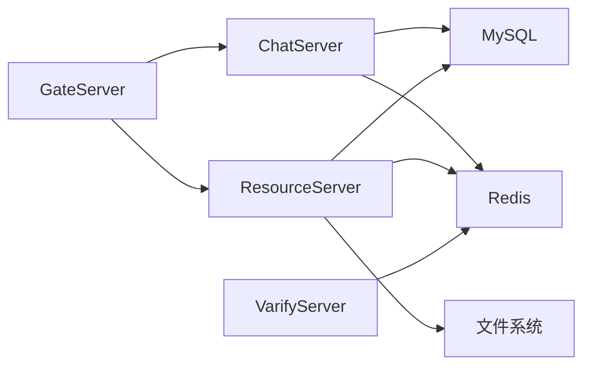

# 备份恢复

<cite>
**本文引用的文件**   
- [README.md](file://README.md)
- [MysqlMgr.h](file://server/ChatServer/include/MysqlMgr.h)
- [RedisMgr.h](file://server/ChatServer/include/RedisMgr.h)
- [FileSystem.h](file://server/ResourceServer/include/FileSystem.h)
- [FileWorker.h](file://server/ResourceServer/include/FileWorker.h)
- [FileInfo.h](file://server/ResourceServer/include/FileInfo.h)
- [LogicWorker.cpp](file://server/ResourceServer/src/LogicWorker.cpp)
- [FileWorker.cpp](file://server/ResourceServer/src/FileWorker.cpp)
- [LogicSystem.cpp](file://server/ChatServer/src/LogicSystem.cpp)
- [ChatGrpcClient.cpp](file://server/ChatServer/src/ChatGrpcClient.cpp)
- [config.ini（资源服务）](file://server/ResourceServer/config/config.ini)
- [config.ini（网关服务）](file://server/GateServer/config/config.ini)
- [chatserver1.ini（聊天服务）](file://server/ChatServer/config/chatserver1.ini)
- [llfc.sql](file://sql备份/llfc.sql)
- [chat_message.sql](file://sql备份/chat_message.sql)
- [redis.js（验证服务）](file://server/VarifyServer/redis.js)
</cite>

## 目录
1. [简介](#简介)
2. [项目结构](#项目结构)
3. [核心组件](#核心组件)
4. [架构总览](#架构总览)
5. [详细组件分析](#详细组件分析)
6. [依赖关系分析](#依赖关系分析)
7. [性能考虑](#性能考虑)
8. [故障排查指南](#故障排查指南)
9. [结论](#结论)
10. [附录](#附录)

## 简介
本文件为 LLFCChat 系统的数据备份与恢复方案，覆盖数据库、文件存储与 Redis 缓存三类数据。文档给出全量与增量备份策略、RTO/RPO 目标、灾难恢复流程、自动化脚本建议以及版本升级时的数据保护策略。内容基于仓库中实际代码与配置进行分析，确保可落地执行。

## 项目结构
LLFCChat 采用多服务架构：
- ChatServer：聊天逻辑、用户会话、消息读写、Redis 缓存同步
- ResourceServer：文件上传/下载、断点续传、本地文件系统持久化
- GateServer：HTTP 入口、鉴权转发
- StatusServer：状态服务
- VarifyServer：验证码/邮箱等辅助服务（Node.js），使用 ioredis 操作 Redis

关键数据位置：
- MySQL：聊天消息、用户信息、会话线程等结构化数据
- 文件系统：头像、聊天图片、传输文件（由 ResourceServer 写入）
- Redis：用户基础信息缓存、登录态、分布式锁、上传/下载进度等

**图表来源** 
- [config.ini（网关服务）](file://server/GateServer/config/config.ini)
- [config.ini（资源服务）](file://server/ResourceServer/config/config.ini)
- [chatserver1.ini（聊天服务）](file://server/ChatServer/config/chatserver1.ini)

**章节来源**
- [README.md](file://README.md)

## 核心组件
- 数据库访问层：MysqlMgr/MysqlDao 负责用户注册、好友关系、聊天消息的增删改查
- 缓存访问层：RedisMgr/RedisConPool 提供连接池、键值存取、分布式锁、过期设置
- 文件处理层：FileSystem/FileWorker/DownloadWorker 管理上传/下载任务队列与磁盘 I/O
- 配置中心：各服务通过 config.ini 指定 MySQL/Redis 地址与端口

**章节来源**
- [MysqlMgr.h](file://server/ChatServer/include/MysqlMgr.h)
- [RedisMgr.h](file://server/ChatServer/include/RedisMgr.h)
- [FileSystem.h](file://server/ResourceServer/include/FileSystem.h)
- [FileWorker.h](file://server/ResourceServer/include/FileWorker.h)
- [FileInfo.h](file://server/ResourceServer/include/FileInfo.h)
- [config.ini（资源服务）](file://server/ResourceServer/config/config.ini)
- [config.ini（网关服务）](file://server/GateServer/config/config.ini)
- [chatserver1.ini（聊天服务）](file://server/ChatServer/config/chatserver1.ini)

## 架构总览
下图展示数据在系统中的流转路径，以及备份恢复的关键节点：
- 写路径：客户端 → GateServer → ChatServer/ResourceServer → MySQL/Redis/FS
- 读路径：客户端 ← GateServer ← ChatServer/ResourceServer ← MySQL/Redis/FS
- 备份节点：MySQL 快照/导出、Redis 持久化文件、文件系统目录

**图表来源** 
- [LogicWorker.cpp](file://server/ResourceServer/src/LogicWorker.cpp)
- [FileWorker.cpp](file://server/ResourceServer/src/FileWorker.cpp)
- [LogicSystem.cpp](file://server/ChatServer/src/LogicSystem.cpp)
- [ChatGrpcClient.cpp](file://server/ChatServer/src/ChatGrpcClient.cpp)

## 详细组件分析

### 数据库备份与恢复（MySQL）
- 数据范围：用户表、聊天消息表、会话线程表等
- 全量备份：使用 mysqldump 导出完整 SQL（仓库已提供示例 .sql 文件）
- 增量备份：启用 MySQL binlog，按时间点或事务位点恢复
- 恢复流程：先停写或进入只读 → 导入全量 → 回放增量日志 → 校验一致性

**图表来源** 
- [llfc.sql](file://sql备份/llfc.sql)
- [chat_message.sql](file://sql备份/chat_message.sql)

**章节来源**
- [llfc.sql](file://sql备份/llfc.sql)
- [chat_message.sql](file://sql备份/chat_message.sql)

### 文件存储备份与恢复（ResourceServer 文件系统）
- 存储内容：用户头像、聊天图片、传输文件
- 备份策略：
  - 全量：对输出目录进行镜像拷贝（rsync/scp）
  - 增量：基于时间戳或 inode 差异增量复制
- 恢复策略：优先恢复最新全量，再应用增量；校验 MD5/文件大小与元信息一致

**图表来源** 
- [FileWorker.cpp](file://server/ResourceServer/src/FileWorker.cpp)
- [LogicWorker.cpp](file://server/ResourceServer/src/LogicWorker.cpp)

**章节来源**
- [FileWorker.cpp](file://server/ResourceServer/src/FileWorker.cpp)
- [LogicWorker.cpp](file://server/ResourceServer/src/LogicWorker.cpp)

### Redis 缓存持久化与恢复
- 用途：用户基础信息缓存、登录态、分布式锁、上传/下载进度
- 持久化：开启 AOF 与 RDB 双持久化，定期落盘
- 备份：直接拷贝 dump.rdb 与 appendonly.aof
- 恢复：替换持久化文件后重启 Redis，服务自动加载

**图表来源** 
- [RedisMgr.h](file://server/ChatServer/include/RedisMgr.h)
- [redis.js（验证服务）](file://server/VarifyServer/redis.js)

**章节来源**
- [RedisMgr.h](file://server/ChatServer/include/RedisMgr.h)
- [redis.js（验证服务）](file://server/VarifyServer/redis.js)

### 上传/下载流程中的断点续传与状态持久化
- 上传：首包创建 FileInfo 并写入 Redis，后续分片追加写入磁盘，最后更新数据库状态并清理 Redis 进度
- 下载：首包获取文件大小并初始化 Redis 进度，后续按偏移量读取并 Base64 编码返回，完成时清理 Redis

**图表来源** 
- [FileWorker.cpp](file://server/ResourceServer/src/FileWorker.cpp)
- [LogicWorker.cpp](file://server/ResourceServer/src/LogicWorker.cpp)
- [FileInfo.h](file://server/ResourceServer/include/FileInfo.h)

**章节来源**
- [FileWorker.cpp](file://server/ResourceServer/src/FileWorker.cpp)
- [LogicWorker.cpp](file://server/ResourceServer/src/LogicWorker.cpp)
- [FileInfo.h](file://server/ResourceServer/include/FileInfo.h)

### 用户信息与缓存一致性
- 用户信息变更（如头像更新）后，需同时更新 MySQL 与 Redis 缓存
- 常见模式：先写库，再写缓存；或写库成功后异步刷新缓存

**图表来源** 
- [LogicSystem.cpp](file://server/ChatServer/src/LogicSystem.cpp)
- [ChatGrpcClient.cpp](file://server/ChatServer/src/ChatGrpcClient.cpp)

**章节来源**
- [LogicSystem.cpp](file://server/ChatServer/src/LogicSystem.cpp)
- [ChatGrpcClient.cpp](file://server/ChatServer/src/ChatGrpcClient.cpp)

## 依赖关系分析
- ChatServer 依赖 MySQL 与 Redis，用于用户与会话数据
- ResourceServer 依赖 MySQL、Redis 与本地文件系统，用于文件上传/下载
- GateServer 作为 HTTP 入口，转发至 ChatServer/ResourceServer
- VarifyServer 使用 ioredis 操作 Redis

**图表来源** 
- [config.ini（网关服务）](file://server/GateServer/config/config.ini)
- [config.ini（资源服务）](file://server/ResourceServer/config/config.ini)
- [chatserver1.ini（聊天服务）](file://server/ChatServer/config/chatserver1.ini)
- [redis.js（验证服务）](file://server/VarifyServer/redis.js)

**章节来源**
- [config.ini（网关服务）](file://server/GateServer/config/config.ini)
- [config.ini（资源服务）](file://server/ResourceServer/config/config.ini)
- [chatserver1.ini（聊天服务）](file://server/ChatServer/config/chatserver1.ini)
- [redis.js（验证服务）](file://server/VarifyServer/redis.js)

## 性能考虑
- 数据库：
  - 使用索引优化查询（如 thread_id + created_at）
  - 批量插入消息，减少事务开销
  - 读写分离与连接池调优
- 缓存：
  - 合理设置过期时间，避免热点 key 长期占用内存
  - 使用 AOF 与 RDB 组合，平衡性能与可靠性
- 文件：
  - 分片大小与并发度调优，避免磁盘 IO 瓶颈
  - 使用增量备份减少带宽与时间成本

[本节为通用指导，不直接分析具体文件]

## 故障排查指南
- MySQL 问题：
  - 检查连接池与权限，确认 schema 与密码正确
  - 查看错误日志与慢查询日志
- Redis 问题：
  - 检查连接池健康与 AUTH 认证
  - 监控内存与持久化文件状态
- 文件问题：
  - 检查目录权限与磁盘空间
  - 校验 MD5 与文件大小一致性
- 服务间通信：
  - 检查 gRPC/HTTP 端口与防火墙规则
  - 核对配置文件中 Host/Port

**章节来源**
- [RedisMgr.h](file://server/ChatServer/include/RedisMgr.h)
- [config.ini（资源服务）](file://server/ResourceServer/config/config.ini)
- [config.ini（网关服务）](file://server/GateServer/config/config.ini)
- [chatserver1.ini（聊天服务）](file://server/ChatServer/config/chatserver1.ini)

## 结论
LLFCChat 的数据备份与恢复应围绕 MySQL、Redis 与文件系统三大组件展开。通过全量+增量策略、严格的恢复流程与自动化脚本，可实现稳定的 RTO/RPO 目标。建议在每次版本升级前执行预演恢复，确保数据一致性与服务可用性。

[本节为总结性内容，不直接分析具体文件]

## 附录

### RTO/RPO 目标建议
- RTO（恢复时间目标）：≤ 30 分钟（含数据校验与服务启动）
- RPO（恢复点目标）：≤ 5 分钟（基于 binlog 与 Redis AOF）

[本节为通用指导，不直接分析具体文件]

### 自动化备份脚本建议
- MySQL：
  - 每日凌晨执行 mysqldump 全量备份
  - 每小时导出增量 binlog 到独立目录
- Redis：
  - 定时触发 BGSAVE，并拷贝 dump.rdb 与 appendonly.aof
- 文件系统：
  - 使用 rsync --delete 实现增量同步
- 通知与告警：
  - 备份成功/失败邮件或企业微信通知

[本节为通用指导，不直接分析具体文件]

### 版本升级时的数据保护策略
- 升级前：
  - 全量备份 MySQL、Redis 与文件系统
  - 记录当前版本号与配置快照
- 升级中：
  - 停止写入或切换到只读
  - 执行数据库迁移脚本（谨慎回滚）
- 升级后：
  - 校验数据一致性
  - 逐步放开写入并观察指标

[本节为通用指导，不直接分析具体文件]