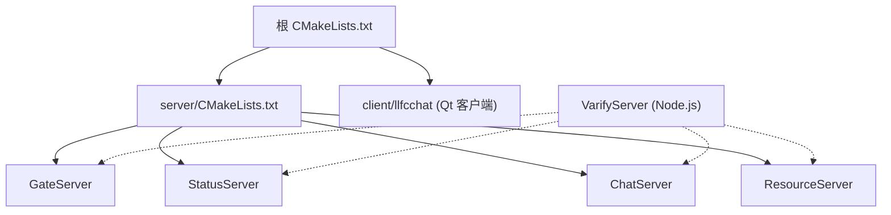
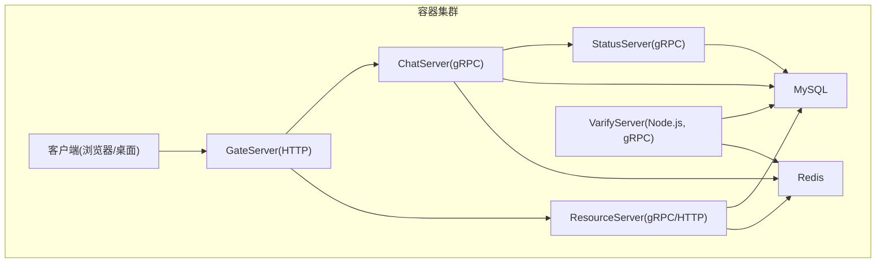
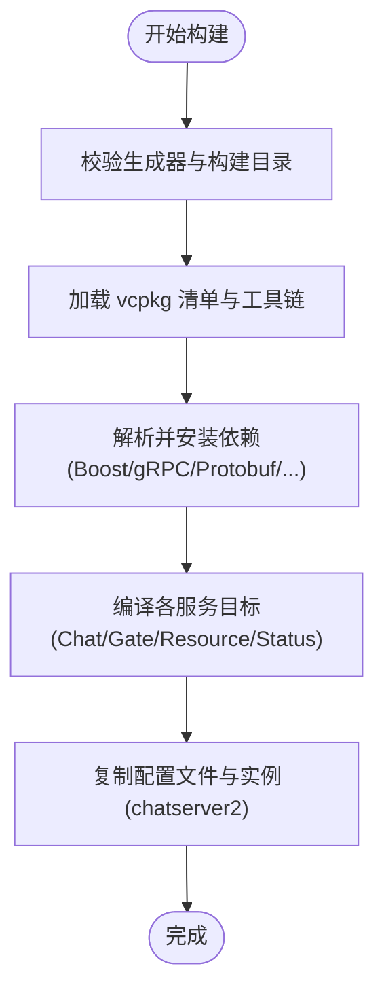
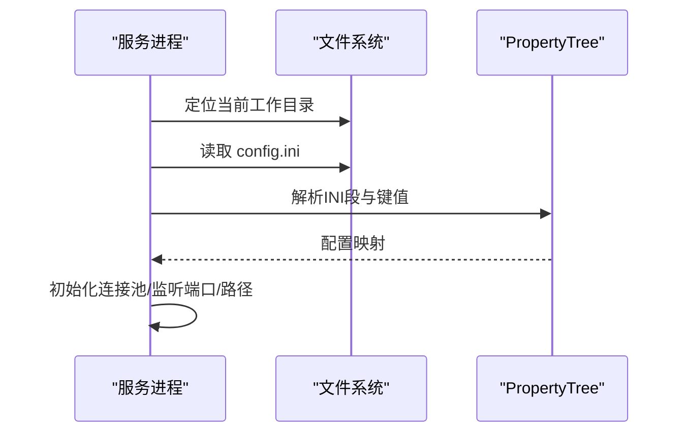
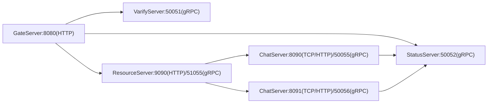
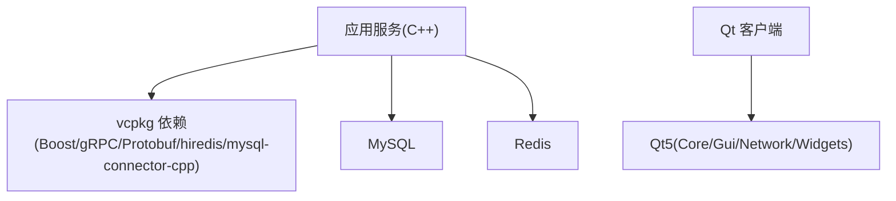

# 容器化部署

<cite>
**本文引用的文件**   
- [README.md](file://README.md)
- [CMakeLists.txt](file://CMakeLists.txt)
- [CMakePresets.json](file://CMakePresets.json)
- [vcpkg.json](file://vcpkg.json)
- [server/CMakeLists.txt](file://server/CMakeLists.txt)
- [server/ChatServer/CMakeLists.txt](file://server/ChatServer/CMakeLists.txt)
- [cmake/Dependencies.cmake](file://cmake/Dependencies.cmake)
- [server/GateServer/config/config.ini](file://server/GateServer/config/config.ini)
- [server/StatusServer/config/config.ini](file://server/StatusServer/config/config.ini)
- [server/ResourceServer/config/config.ini](file://server/ResourceServer/config/config.ini)
- [server/ChatServer/config/chatserver1.ini](file://server/ChatServer/config/chatserver1.ini)
- [server/VarifyServer/package.json](file://server/VarifyServer/package.json)
- [server/VarifyServer/config.js](file://server/VarifyServer/config.js)
- [server/ChatServer/src/ConfigMgr.cpp](file://server/ChatServer/src/ConfigMgr.cpp)
- [server/GateServer/src/ConfigMgr.cpp](file://server/GateServer/src/ConfigMgr.cpp)
- [server/ResourceServer/src/ConfigMgr.cpp](file://server/ResourceServer/src/ConfigMgr.cpp)
- [server/StatusServer/src/ConfigMgr.cpp](file://server/StatusServer/src/ConfigMgr.cpp)
</cite>

## 目录
1. [简介](#简介)
2. [项目结构](#项目结构)
3. [核心组件](#核心组件)
4. [架构总览](#架构总览)
5. [详细组件分析](#详细组件分析)
6. [依赖分析](#依赖分析)
7. [性能考虑](#性能考虑)
8. [故障排查指南](#故障排查指南)
9. [结论](#结论)
10. [附录](#附录)

## 简介
本文件面向 LLFCChat 项目的容器化与生产部署，覆盖以下主题：
- Docker 镜像构建流程与多阶段构建优化、依赖管理、镜像分层策略
- 服务编排（Docker Compose / Kubernetes）与服务间通信、网络设置
- 环境变量与配置注入、密钥管理、环境隔离
- 健康检查、日志收集、资源限制等运维配置
- 镜像安全扫描、漏洞修复、版本管理等生产要求

项目为 C++ 聊天系统，包含多个后端服务（GateServer、ChatServer、ResourceServer、StatusServer）以及一个 Node.js 验证服务（VarifyServer），并通过 gRPC 与 HTTP 进行服务间通信。客户端使用 Qt 开发，不在容器化范围内。

**章节来源**
- [README.md:1-112](file://README.md#L1-L112)

## 项目结构
LLFCChat 采用多子工程结构，顶层 CMake 聚合 server 与 client 两个子目录；server 下包含 GateServer、ChatServer、ResourceServer、StatusServer 四个 C++ 服务，以及 VarifyServer（Node.js）。各服务通过配置文件（INI/JSON）加载运行时参数，如端口、数据库与 Redis 连接信息、对端服务地址等。

**图表来源**
- [CMakeLists.txt:1-34](file://CMakeLists.txt#L1-L34)
- [server/CMakeLists.txt:1-38](file://server/CMakeLists.txt#L1-L38)

**章节来源**
- [CMakeLists.txt:1-34](file://CMakeLists.txt#L1-L34)
- [server/CMakeLists.txt:1-38](file://server/CMakeLists.txt#L1-L38)

## 核心组件
- GateServer：HTTP 入口网关，负责鉴权转发与路由到下游服务
- ChatServer：聊天业务核心，处理消息、会话、分布式锁、状态同步等
- ResourceServer：静态资源与文件上传下载服务
- StatusServer：状态服务，维护在线用户与节点状态
- VarifyServer：验证码与邮箱认证服务（Node.js）
- 外部依赖：MySQL、Redis、gRPC/Protobuf、Boost、JsonCpp、hiredis、mysql-connector-cpp、Qt（仅客户端）

这些服务的运行参数由各自配置文件提供，启动时读取当前工作目录下的 config.ini 或 chatserver*.ini。

**章节来源**
- [server/GateServer/config/config.ini:1-25](file://server/GateServer/config/config.ini#L1-L25)
- [server/ChatServer/config/chatserver1.ini:1-30](file://server/ChatServer/config/chatserver1.ini#L1-L30)
- [server/ResourceServer/config/config.ini:1-27](file://server/ResourceServer/config/config.ini#L1-L27)
- [server/StatusServer/config/config.ini:1-23](file://server/StatusServer/config/config.ini#L1-L23)
- [server/VarifyServer/package.json:1-19](file://server/VarifyServer/package.json#L1-L19)

## 架构总览
下图展示了容器化后的服务拓扑与通信关系。C++ 服务之间通过 gRPC 调用，HTTP 请求经 GateServer 进入，随后转发至 ChatServer/ResourceServer；所有服务共享 MySQL 与 Redis 作为持久化与缓存层。

**图表来源**
- [server/GateServer/config/config.ini:1-25](file://server/GateServer/config/config.ini#L1-L25)
- [server/ChatServer/config/chatserver1.ini:1-30](file://server/ChatServer/config/chatserver1.ini#L1-L30)
- [server/ResourceServer/config/config.ini:1-27](file://server/ResourceServer/config/config.ini#L1-L27)
- [server/StatusServer/config/config.ini:1-23](file://server/StatusServer/config/config.ini#L1-L23)
- [server/VarifyServer/config.js:1-14](file://server/VarifyServer/config.js#L1-L14)

## 详细组件分析

### 构建系统与依赖管理
- 顶层 CMake 指定 Ninja Multi-Config 生成器，强制非源码内构建，统一 vcpkg 安装路径与仓库根路径
- vcpkg 清单集中声明 C++ 依赖（Boost、grpc、protobuf、hiredis、mysql-connector-cpp、Qt5）
- CMakePresets 提供 Windows 调试/发布预设，便于 CI/CD 复用
- cmake/Dependencies.cmake 封装 find_package 逻辑，屏蔽平台差异

**图表来源**
- [CMakeLists.txt:1-34](file://CMakeLists.txt#L1-L34)
- [CMakePresets.json:1-35](file://CMakePresets.json#L1-L35)
- [vcpkg.json:1-32](file://vcpkg.json#L1-L32)
- [cmake/Dependencies.cmake:1-82](file://cmake/Dependencies.cmake#L1-L82)
- [server/ChatServer/CMakeLists.txt:1-109](file://server/ChatServer/CMakeLists.txt#L1-L109)

**章节来源**
- [CMakeLists.txt:1-34](file://CMakeLists.txt#L1-L34)
- [CMakePresets.json:1-35](file://CMakePresets.json#L1-L35)
- [vcpkg.json:1-32](file://vcpkg.json#L1-L32)
- [cmake/Dependencies.cmake:1-82](file://cmake/Dependencies.cmake#L1-L82)
- [server/ChatServer/CMakeLists.txt:1-109](file://server/ChatServer/CMakeLists.txt#L1-L109)

### 服务配置与运行时行为
- 各 C++ 服务在启动时从当前工作目录读取 config.ini/chatserver*.ini，使用 Boost.PropertyTree 解析 INI 段与键值
- 关键配置项包括服务端口、Host、对端服务地址、MySQL/Redis 连接信息与输出路径等
- ResourceServer 额外根据 Output/Static 配置动态创建静态目录

**图表来源**
- [server/ChatServer/src/ConfigMgr.cpp:1-30](file://server/ChatServer/src/ConfigMgr.cpp#L1-L30)
- [server/GateServer/src/ConfigMgr.cpp:1-30](file://server/GateServer/src/ConfigMgr.cpp#L1-L30)
- [server/ResourceServer/src/ConfigMgr.cpp:1-82](file://server/ResourceServer/src/ConfigMgr.cpp#L1-L82)
- [server/StatusServer/src/ConfigMgr.cpp:1-30](file://server/StatusServer/src/ConfigMgr.cpp#L1-L30)

**章节来源**
- [server/ChatServer/src/ConfigMgr.cpp:1-30](file://server/ChatServer/src/ConfigMgr.cpp#L1-L30)
- [server/GateServer/src/ConfigMgr.cpp:1-30](file://server/GateServer/src/ConfigMgr.cpp#L1-L30)
- [server/ResourceServer/src/ConfigMgr.cpp:1-82](file://server/ResourceServer/src/ConfigMgr.cpp#L1-L82)
- [server/StatusServer/src/ConfigMgr.cpp:1-30](file://server/StatusServer/src/ConfigMgr.cpp#L1-L30)

### 服务间通信与端口约定
- GateServer：对外暴露 HTTP 端口（默认 8080），内部访问 VarifyServer、StatusServer、ResourceServer
- ChatServer：对外 TCP/HTTP（示例 8090），gRPC RPCPort（示例 50055），并感知 PeerServer（chatserver2）
- ResourceServer：对外 HTTP（示例 9090），gRPC RPCPort（示例 51055），并注册对端 ChatServer
- StatusServer：对外 gRPC（示例 50052），维护 ChatServer 列表
- VarifyServer：Node.js 服务，gRPC 端口（示例 50051），依赖 Redis 与 MySQL

**图表来源**
- [server/GateServer/config/config.ini:1-25](file://server/GateServer/config/config.ini#L1-L25)
- [server/ChatServer/config/chatserver1.ini:1-30](file://server/ChatServer/config/chatserver1.ini#L1-L30)
- [server/ResourceServer/config/config.ini:1-27](file://server/ResourceServer/config/config.ini#L1-L27)
- [server/StatusServer/config/config.ini:1-23](file://server/StatusServer/config/config.ini#L1-L23)

**章节来源**
- [server/GateServer/config/config.ini:1-25](file://server/GateServer/config/config.ini#L1-L25)
- [server/ChatServer/config/chatserver1.ini:1-30](file://server/ChatServer/config/chatserver1.ini#L1-L30)
- [server/ResourceServer/config/config.ini:1-27](file://server/ResourceServer/config/config.ini#L1-L27)
- [server/StatusServer/config/config.ini:1-23](file://server/StatusServer/config/config.ini#L1-L23)

### Node.js 验证服务（VarifyServer）
- 依赖 @grpc/grpc-js、ioredis、nodemailer 等
- 通过 config.js 读取 config.json 中的邮件、MySQL、Redis 配置
- 建议以独立容器运行，挂载配置与日志卷

**章节来源**
- [server/VarifyServer/package.json:1-19](file://server/VarifyServer/package.json#L1-L19)
- [server/VarifyServer/config.js:1-14](file://server/VarifyServer/config.js#L1-L14)

## 依赖分析
- C++ 依赖通过 vcpkg 统一管理，CMake 脚本中集中 find_package，避免硬编码路径
- 客户端依赖 Qt5（Core/Gui/Network/Widgets），仅在本地或打包分发时使用
- 运行时依赖：MySQL、Redis、gRPC/Protobuf 运行时库（随二进制静态链接或随镜像提供）

**图表来源**
- [vcpkg.json:1-32](file://vcpkg.json#L1-L32)
- [cmake/Dependencies.cmake:1-82](file://cmake/Dependencies.cmake#L1-L82)

**章节来源**
- [vcpkg.json:1-32](file://vcpkg.json#L1-L32)
- [cmake/Dependencies.cmake:1-82](file://cmake/Dependencies.cmake#L1-L82)

## 性能考虑
- 使用静态链接减少运行时依赖体积与版本冲突风险（vcpkg 已配置 x64-windows-static-md）
- 合理划分镜像层：基础镜像→依赖→源码→构建产物→运行态最小集
- 控制 I/O：将静态资源与日志落盘到独立卷，避免镜像膨胀
- 连接池：MySQL/Redis 连接池大小按 CPU 核数与内存上限估算
- 并发模型：Asio 事件循环与线程池结合，避免阻塞 IO

[本节为通用指导，不直接分析具体文件]

## 故障排查指南
- 配置加载失败：确认容器工作目录下存在正确的 config.ini 或 chatserver*.ini，且权限可读
- 端口冲突：检查宿主机端口映射与服务配置是否一致
- 数据库/缓存连接：核对 Host/Port/Passwd/Schema，确保网络可达与账号权限正确
- 日志定位：查看服务标准输出与挂载的日志目录，必要时开启更详细的日志级别

**章节来源**
- [server/ChatServer/src/ConfigMgr.cpp:1-30](file://server/ChatServer/src/ConfigMgr.cpp#L1-L30)
- [server/ResourceServer/src/ConfigMgr.cpp:1-82](file://server/ResourceServer/src/ConfigMgr.cpp#L1-L82)

## 结论
LLFCChat 的容器化应围绕“可重复构建、可观测、可伸缩”的目标展开：通过 vcpkg + CMake 实现依赖与构建一致性；通过环境变量与配置卷实现灵活部署；通过健康检查、日志与资源限制保障稳定性；通过镜像扫描与版本治理满足生产合规。建议在 CI/CD 中固化构建与测试流程，并在不同环境（开发/预发/生产）严格隔离配置与密钥。

[本节为总结性内容，不直接分析具体文件]

## 附录

### 一、Docker 镜像构建最佳实践（多阶段构建与分层）
- 构建阶段（builder）
  - 基于包含 C++ 工具链与 vcpkg 的基础镜像
  - 安装依赖（vcpkg install）、执行 CMake 构建
  - 仅保留必要运行时库与二进制
- 运行阶段（runtime）
  - 选择精简基础镜像（如 distroless/alpine）
  - 拷贝二进制与配置文件
  - 设置非 root 用户、只读根文件系统（可选）
- 分层策略
  - 基础镜像层（固定）
  - 依赖层（vcpkg 包）
  - 源码层（变更频繁）
  - 构建产物层（二进制）
  - 配置与数据层（挂载卷）

[本节为通用指导，不直接分析具体文件]

### 二、Docker Compose 编排要点
- 定义服务：GateServer、ChatServer×N、ResourceServer、StatusServer、VarifyServer、MySQL、Redis
- 网络：自定义桥接网络，服务间通过服务名通信
- 卷：MySQL 数据卷、Redis 数据卷、静态资源卷、日志卷
- 环境变量：数据库密码、Redis 密码、服务端口、对端地址等
- 健康检查：HTTP/TCP 探针，失败重启策略
- 资源限制：CPU/内存上限与下限

[本节为通用指导，不直接分析具体文件]

### 三、Kubernetes 部署要点
- Deployment：副本数、滚动更新、探针（liveness/readiness）
- Service：ClusterIP/NodePort/Ingress 暴露方式
- ConfigMap/Secret：配置与密钥分离，环境变量或卷挂载
- PersistentVolume：MySQL/Redis 持久化存储
- NetworkPolicy：限制服务间访问
- HPA：基于 CPU/内存或自定义指标自动扩缩容

[本节为通用指导，不直接分析具体文件]

### 四、环境变量与配置注入
- C++ 服务：优先从环境变量覆盖 config.ini 中的敏感项（如密码），或在启动前生成最终配置文件
- Node.js 服务：通过环境变量注入 config.json 的值，或使用 .env 文件（需安全管控）
- 密钥管理：使用 K8s Secret、云厂商密钥管理服务或 Vault 注入

[本节为通用指导，不直接分析具体文件]

### 五、健康检查与日志收集
- 健康检查：为每个服务暴露轻量 HTTP/TCP 探针，返回 200 表示就绪
- 日志收集：stdout/stderr 输出结构化日志，配合 sidecar 或 DaemonSet 采集
- 日志轮转：限制单文件大小与数量，避免磁盘打满

[本节为通用指导，不直接分析具体文件]

### 六、资源限制与弹性
- 限制 CPU/Memory，防止单服务占用过多资源
- 设置合理的初始与最大堆大小（如适用）
- 监控告警：QPS、延迟、错误率、资源使用率

[本节为通用指导，不直接分析具体文件]

### 七、镜像安全与版本管理
- 安全扫描：Trivy/Clair 等扫描镜像漏洞，阻断高危漏洞合并
- 基线镜像：使用官方或企业可信镜像，定期更新补丁
- 版本标签：语义化版本（vX.Y.Z），同时保留 latest 指向稳定版
- SBOM：生成软件物料清单，便于审计与溯源

[本节为通用指导，不直接分析具体文件]