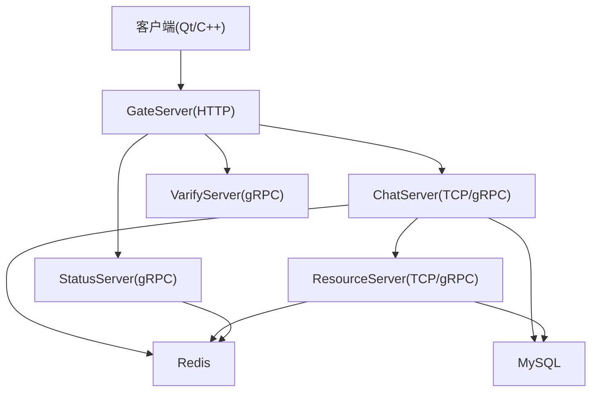
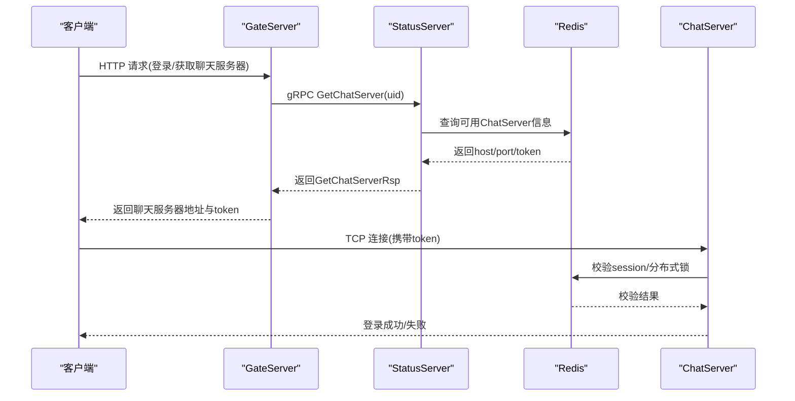
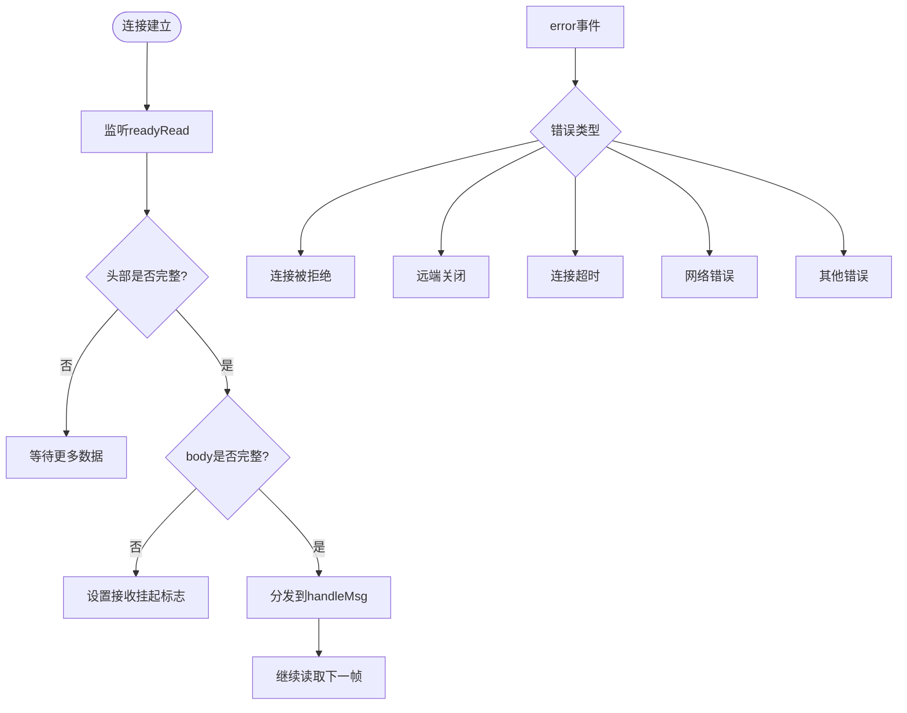
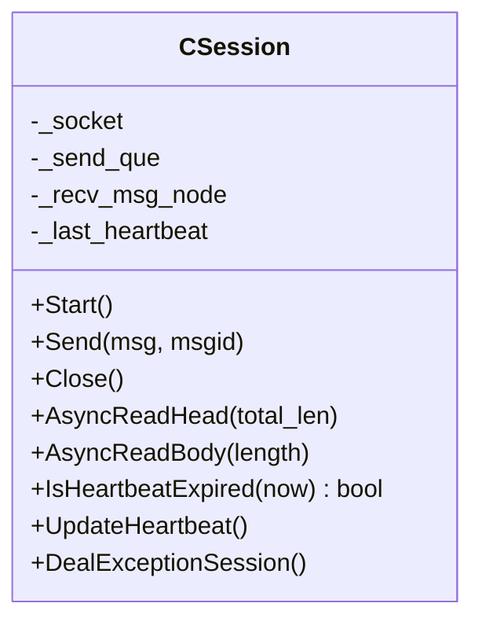
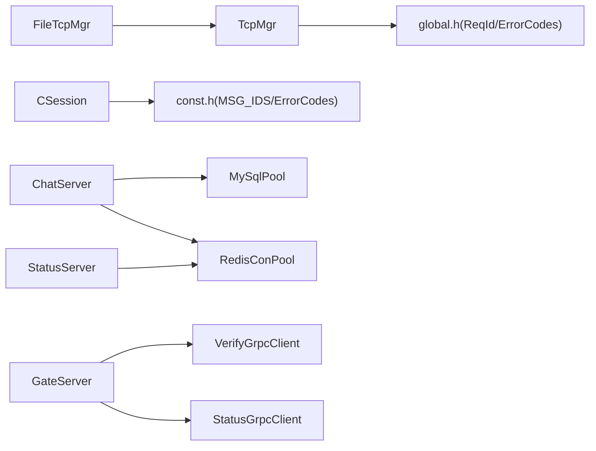

# 故障排查

<cite>
**本文引用的文件**   
- [README.md](file://README.md)
- [tcpmgr.cpp](file://client/llfcchat/src/tcpmgr.cpp)
- [filetcpmgr.cpp](file://client/llfcchat/src/filetcpmgr.cpp)
- [CSession.h](file://server/ChatServer/include/CSession.h)
- [CSession.cpp](file://server/ChatServer/src/CSession.cpp)
- [RedisMgr.h（ChatServer）](file://server/ChatServer/include/RedisMgr.h)
- [MysqlDao.h（ChatServer）](file://server/ChatServer/include/MysqlDao.h)
- [const.h（ChatServer）](file://server/ChatServer/include/const.h)
- [global.h（客户端全局常量）](file://client/llfcchat/include/global.h)
- [VerifyGrpcClient.h（GateServer）](file://server/GateServer/include/VerifyGrpcClient.h)
- [StatusServiceImpl.h（StatusServer）](file://server/StatusServer/include/StatusServiceImpl.h)
- [day35心跳逻辑.md](file://开发文档/day35心跳逻辑.md)
- [day33单服程踢人逻辑.md](file://开发文档/day33单服程踢人逻辑.md)
- [day14-登录功能.md](file://开发文档/day14-登录功能.md)
- [day42-用户加载聊天资源.md](file://开发文档/day42-用户加载聊天资源.md)
- [更新记录.md](file://更新记录.md)
</cite>

## 目录
1. [简介](#简介)
2. [项目结构](#项目结构)
3. [核心组件](#核心组件)
4. [架构总览](#架构总览)
5. [详细组件分析](#详细组件分析)
6. [依赖关系分析](#依赖关系分析)
7. [性能注意事项](#性能注意事项)
8. [故障排查指南](#故障排查指南)
9. [结论](#结论)
10. [附录](#附录)

## 简介
本指南面向LLFCChat系统的运维与研发人员，聚焦于常见问题的定位与解决，覆盖网络连接、数据库连接、Redis通信、gRPC服务间调用、消息队列积压、客户端连接异常等。同时提供日志分析方法、关键错误码识别、性能诊断工具与方法建议，以及网络抓包与断线重连策略，帮助快速恢复服务并提升稳定性。

## 项目结构
系统由客户端（Qt/C++）、多个后端服务（ChatServer、GateServer、ResourceServer、StatusServer、VarifyServer）及协议定义（proto）组成。客户端通过HTTP与Gate交互获取服务地址，随后建立TCP长连接到ChatServer；图片与文件传输走ResourceServer；状态与路由由StatusServer管理；验证码由VarifyServer提供。各服务普遍使用MySQL与Redis作为持久化与缓存/分布式锁支撑。

图表来源 
- [day14-登录功能.md:254-329](file://开发文档/day14-登录功能.md#L254-L329)
- [day42-用户加载聊天资源.md:169-226](file://开发文档/day42-用户加载聊天资源.md#L169-L226)
- [CSession.h:1-86](file://server/ChatServer/include/CSession.h#L1-L86)

章节来源
- [README.md:1-112](file://README.md#L1-L112)

## 核心组件
- 客户端网络层：TcpMgr负责TCP连接、粘包处理、错误回调与发送队列；FileTcpMgr负责分片上传/下载、拥塞窗口控制与进度回传。
- 服务端会话层：CSession封装异步读写、心跳维护、异常会话清理与消息投递。
- 存储层：MySqlPool/RedisConPool提供连接池、健康检查与自动重连。
- 服务间通信：gRPC客户端（StatusGrpcClient、VerifyGrpcClient）与服务实现（StatusServiceImpl、ChatServiceImpl）。

章节来源
- [tcpmgr.cpp:1-200](file://client/llfcchat/src/tcpmgr.cpp#L1-L200)
- [filetcpmgr.cpp:37-77](file://client/llfcchat/src/filetcpmgr.cpp#L37-L77)
- [CSession.h:1-86](file://server/ChatServer/include/CSession.h#L1-L86)
- [MysqlDao.h（ChatServer）:42-100](file://server/ChatServer/include/MysqlDao.h#L42-L100)
- [RedisMgr.h（ChatServer）:198-246](file://server/ChatServer/include/RedisMgr.h#L198-L246)
- [VerifyGrpcClient.h（GateServer）:1-63](file://server/GateServer/include/VerifyGrpcClient.h#L1-L63)
- [StatusServiceImpl.h（StatusServer）:1-50](file://server/StatusServer/include/StatusServiceImpl.h#L1-L50)

## 架构总览
下图展示一次典型登录与聊天服务器分配流程，涉及HTTP、gRPC与Redis状态同步。

图表来源 
- [day14-登录功能.md:254-329](file://开发文档/day14-登录功能.md#L254-L329)
- [day42-用户加载聊天资源.md:169-226](file://开发文档/day42-用户加载聊天资源.md#L169-L226)
- [StatusServiceImpl.h（StatusServer）:1-50](file://server/StatusServer/include/StatusServiceImpl.h#L1-L50)

## 详细组件分析

### 客户端TCP管理器（TcpMgr）
- 职责：建立TCP连接、粘包解析、错误分类上报、发送队列与字节计数、信号驱动UI更新。
- 关键点：readyRead循环中按“头部+长度”解析；error事件分支区分拒绝、远端关闭、超时、网络错误；bytesWritten驱动分段发送。

图表来源 
- [tcpmgr.cpp:1-200](file://client/llfcchat/src/tcpmgr.cpp#L1-L200)

章节来源
- [tcpmgr.cpp:1-200](file://client/llfcchat/src/tcpmgr.cpp#L1-L200)

### 文件传输模块（FileTcpMgr）
- 职责：分片上传/下载、拥塞窗口控制、进度与完成回调、断点续传。
- 关键点：批量发送时维护未确认序列集合；最后一片标记last；下载完成后触发界面刷新或通知。

章节来源
- [filetcpmgr.cpp:37-77](file://client/llfcchat/src/filetcpmgr.cpp#L37-L77)
- [更新记录.md:226-292](file://更新记录.md#L226-L292)

### 服务端会话（CSession）
- 职责：异步读头/体、写队列串行化、心跳时间戳维护、异常会话清理。
- 关键点：asyncReadFull组合读取；HandleWrite保证顺序发送；IsHeartbeatExpired配合定时任务清理僵尸连接。

图表来源 
- [CSession.h:1-86](file://server/ChatServer/include/CSession.h#L1-L86)
- [CSession.cpp:184-224](file://server/ChatServer/src/CSession.cpp#L184-L224)

章节来源
- [CSession.h:1-86](file://server/ChatServer/include/CSession.h#L1-L86)
- [CSession.cpp:184-224](file://server/ChatServer/src/CSession.cpp#L184-L224)

### 存储连接池（MySQL/Redis）
- MySQL连接池：周期性健康检查（SELECT 1），失败计数驱动重连，线程安全归还连接。
- Redis连接池：PING保活，AUTH认证，异常捕获后重建连接，checkThread定期巡检。

章节来源
- [MysqlDao.h（ChatServer）:42-100](file://server/ChatServer/include/MysqlDao.h#L42-L100)
- [MysqlDao.h（ChatServer）:102-160](file://server/ChatServer/include/MysqlDao.h#L102-L160)
- [MysqlDao.h（ChatServer）:213-232](file://server/ChatServer/include/MysqlDao.h#L213-L232)
- [RedisMgr.h（ChatServer）:198-246](file://server/ChatServer/include/RedisMgr.h#L198-L246)
- [RedisMgr.h（ChatServer）:281-304](file://server/ChatServer/include/RedisMgr.h#L281-L304)

### 服务间gRPC通信
- GateServer通过VerifyGrpcClient访问验证码服务；StatusGrpcClient向StatusServer查询聊天服务器；StatusServiceImpl维护服务注册与选择。
- 错误码统一：ErrorCodes::RPCFailed用于RPC失败场景。

章节来源
- [VerifyGrpcClient.h（GateServer）:1-63](file://server/GateServer/include/VerifyGrpcClient.h#L1-L63)
- [day14-登录功能.md:254-329](file://开发文档/day14-登录功能.md#L254-L329)
- [StatusServiceImpl.h（StatusServer）:1-50](file://server/StatusServer/include/StatusServiceImpl.h#L1-L50)

## 依赖关系分析
- 客户端依赖：Qt网络库、JSON解析、自定义ReqId与ErrorCodes。
- 服务端依赖：Boost.Asio/Beast、gRPC、MySQL Connector、hiredis、配置管理。
- 跨服务依赖：gRPC通道复用池、Redis分布式锁与会话键前缀。

图表来源 
- [global.h（客户端全局常量）:43-101](file://client/llfcchat/include/global.h#L43-L101)
- [const.h（ChatServer）:1-104](file://server/ChatServer/include/const.h#L1-L104)
- [MysqlDao.h（ChatServer）:213-232](file://server/ChatServer/include/MysqlDao.h#L213-L232)
- [RedisMgr.h（ChatServer）:281-304](file://server/ChatServer/include/RedisMgr.h#L281-L304)
- [VerifyGrpcClient.h（GateServer）:1-63](file://server/GateServer/include/VerifyGrpcClient.h#L1-L63)

章节来源
- [global.h（客户端全局常量）:43-101](file://client/llfcchat/include/global.h#L43-L101)
- [const.h（ChatServer）:1-104](file://server/ChatServer/include/const.h#L1-L104)

## 性能注意事项
- 心跳机制：服务端定时器周期检测会话过期，减少频繁加锁的统计开销，集中写入Redis连接数。
- 连接池健康检查：MySQL每N秒执行轻量探测，失败计数驱动重连；Redis PING保活与AUTH重试。
- 发送队列与拥塞窗口：客户端批量发送限制cwnd大小，避免拥塞；文件分片与last标记保障可靠传输。
- 日志与监控：关键路径输出错误码与耗时，便于定位热点与瓶颈。

章节来源
- [day35心跳逻辑.md:488-550](file://开发文档/day35心跳逻辑.md#L488-L550)
- [day35心跳逻辑.md:644-688](file://开发文档/day35心跳逻辑.md#L644-L688)
- [MysqlDao.h（ChatServer）:42-100](file://server/ChatServer/include/MysqlDao.h#L42-L100)
- [RedisMgr.h（ChatServer）:198-246](file://server/ChatServer/include/RedisMgr.h#L198-L246)
- [更新记录.md:226-292](file://更新记录.md#L226-L292)

## 故障排查指南

### 一、网络连接问题（客户端）
常见问题
- 连接被拒绝、主机不可达、连接超时、网络错误、远端关闭。
- 粘包/半包导致解析失败。

定位步骤
- 查看TcpMgr的error分支日志，确认具体SocketError类型。
- 检查readyRead中的头部与长度解析是否完整，关注缓冲剩余长度与_pending标志。
- 验证目标端口可达性（telnet/curl），确认防火墙/NAT规则。

解决方案
- 增加重连退避与指数退避策略。
- 对粘包进行边界保护：确保头部长度字段合法且不超过MAX_LENGTH。
- 在客户端增加连接存活检测（心跳），失败提示并重试。

章节来源
- [tcpmgr.cpp:1-200](file://client/llfcchat/src/tcpmgr.cpp#L1-L200)
- [global.h（客户端全局常量）:43-101](file://client/llfcchat/include/global.h#L43-L101)

### 二、数据库连接失败（MySQL）
常见问题
- 连接池初始化失败、健康检查失败、重连失败。
- SELECT 1探测抛出SQLException。

定位步骤
- 观察checkConnectionPro与reconnect日志，确认_fail_count变化与重连结果。
- 核对URL、用户名、密码、schema配置是否正确。
- 检查MySQL服务状态与权限。

解决方案
- 调整连接池大小与探测间隔。
- 增加重试次数与退避策略。
- 对异常进行隔离与告警，避免雪崩。

章节来源
- [MysqlDao.h（ChatServer）:42-100](file://server/ChatServer/include/MysqlDao.h#L42-L100)
- [MysqlDao.h（ChatServer）:102-160](file://server/ChatServer/include/MysqlDao.h#L102-L160)
- [MysqlDao.h（ChatServer）:213-232](file://server/ChatServer/include/MysqlDao.h#L213-L232)

### 三、Redis通信异常
常见问题
- PING失败、AUTH认证失败、连接池耗尽、checkThread崩溃。
- 分布式锁获取失败或释放异常。

定位步骤
- 检查RedisMgr::checkThread日志，关注reply为null与AUTH错误。
- 确认Redis服务可达、密码正确、ACL权限。
- 监控连接池大小与fail_count。

解决方案
- 增大连接池容量，优化checkThread频率。
- 对AUTH失败进行配置校验与告警。
- 分布式锁操作增加超时与幂等释放。

章节来源
- [RedisMgr.h（ChatServer）:198-246](file://server/ChatServer/include/RedisMgr.h#L198-L246)
- [RedisMgr.h（ChatServer）:281-304](file://server/ChatServer/include/RedisMgr.h#L281-L304)

### 四、服务间通信故障（gRPC）
常见问题
- RPC调用失败（ErrorCodes::RPCFailed）、通道创建失败、Stub池耗尽。
- StatusServer无法返回有效ChatServer信息。

定位步骤
- 检查VerifyGrpcClient与StatusGrpcClient的错误分支与日志。
- 确认gRPC服务端口与证书配置（如启用TLS）。
- 查看StatusServiceImpl中服务注册与选择逻辑。

解决方案
- 增加gRPC通道健康检查与自动重建。
- 对RPC失败进行重试与降级策略。
- 完善错误码与日志上下文（uid、host、port）。

章节来源
- [VerifyGrpcClient.h（GateServer）:1-63](file://server/GateServer/include/VerifyGrpcClient.h#L1-L63)
- [day14-登录功能.md:254-329](file://开发文档/day14-登录功能.md#L254-L329)
- [StatusServiceImpl.h（StatusServer）:1-50](file://server/StatusServer/include/StatusServiceImpl.h#L1-L50)

### 五、消息队列积压（逻辑处理）
常见问题
- LogicSystem队列堆积，消息处理延迟。
- 心跳检测与业务处理竞争锁导致阻塞。

定位步骤
- 监控LogicSystem队列长度与消费速率。
- 检查CSession::AsyncReadBody投递逻辑与异常分支。
- 评估业务处理耗时与并发度。

解决方案
- 扩容消费者线程，优化批处理。
- 将耗时操作下沉到独立工作线程。
- 增加背压与限流，防止雪崩。

章节来源
- [day33单服程踢人逻辑.md:397-460](file://开发文档/day33单服程踢人逻辑.md#L397-L460)

### 六、客户端连接问题调试与网络抓包
常见问题
- 连接不稳定、丢包、中间设备回收空闲连接。
- 粘包导致消息错乱。

定位步骤
- 使用Wireshark抓取TCP流，确认三次握手、心跳包、数据帧边界。
- 检查客户端日志中的error分支与bytesWritten计数。
- 验证服务器侧CSession心跳更新时间戳。

解决方案
- 合理设置心跳间隔（如10s）与超时阈值（如60s）。
- 对粘包进行严格长度校验与非法长度拒绝。
- 在网络层增加保活与重连策略。

章节来源
- [tcpmgr.cpp:1-200](file://client/llfcchat/src/tcpmgr.cpp#L1-L200)
- [CSession.h:1-86](file://server/ChatServer/include/CSession.h#L1-L86)
- [day35心跳逻辑.md:488-550](file://开发文档/day35心跳逻辑.md#L488-L550)

### 七、日志分析方法与关键错误码
- 客户端错误码：ERR_JSON、ERR_NETWORK等，结合qDebug输出定位解析与网络问题。
- 服务端错误码：ErrorCodes::Success、Error_Json、RPCFailed、TokenInvalid、UidInvalid等。
- 关键日志位置：
  - 客户端：TcpMgr error分支、FileTcpMgr写入与进度日志。
  - 服务端：CSession读写错误、Redis/MySQL连接池健康检查、gRPC调用结果。

章节来源
- [global.h（客户端全局常量）:90-111](file://client/llfcchat/include/global.h#L90-L111)
- [const.h（ChatServer）:1-104](file://server/ChatServer/include/const.h#L1-L104)
- [tcpmgr.cpp:1-200](file://client/llfcchat/src/tcpmgr.cpp#L1-L200)
- [filetcpmgr.cpp:37-77](file://client/llfcchat/src/filetcpmgr.cpp#L37-L77)

### 八、性能问题诊断工具与方法
- 内存泄漏检测：Valgrind（Linux）、Visual Studio Diagnostic Tools（Windows）。
- CPU热点分析：perf、VTune、gprof。
- 网络性能：tcptrace、Wireshark统计、ss/netstat监控连接数与重传。
- 应用层指标：连接池利用率、队列长度、心跳成功率、RPC成功率。

[本节为通用指导，不直接分析具体文件]

### 九、服务间通信故障排查步骤
- 确认gRPC服务端口与证书配置。
- 检查Stub池初始化与连接数。
- 查看StatusServer服务注册与选择逻辑。
- 验证Redis中会话与锁键一致性。

章节来源
- [VerifyGrpcClient.h（GateServer）:1-63](file://server/GateServer/include/VerifyGrpcClient.h#L1-L63)
- [StatusServiceImpl.h（StatusServer）:1-50](file://server/StatusServer/include/StatusServiceImpl.h#L1-L50)
- [RedisMgr.h（ChatServer）:281-304](file://server/ChatServer/include/RedisMgr.h#L281-L304)

### 十、客户端连接问题调试方法与网络抓包分析
- 抓包要点：SYN/ACK、心跳包、数据帧长度、重传与丢包。
- 客户端日志：error分支分类、bytesWritten计数、pending标志。
- 服务器侧：CSession心跳更新时间戳、异常会话清理。

章节来源
- [tcpmgr.cpp:1-200](file://client/llfcchat/src/tcpmgr.cpp#L1-L200)
- [CSession.h:1-86](file://server/ChatServer/include/CSession.h#L1-L86)
- [day35心跳逻辑.md:488-550](file://开发文档/day35心跳逻辑.md#L488-L550)

## 结论
通过系统化梳理客户端与服务端的网络、存储、gRPC通信与心跳机制，结合日志分析与性能诊断方法，可高效定位并解决LLFCChat系统中的常见问题。建议在生产环境完善监控告警、连接池与健康检查、错误码与日志规范，以提升系统稳定性与可观测性。

## 附录
- 常用命令与工具：Wireshark、Valgrind、perf、VTune、ss、netstat。
- 配置项检查清单：MySQL URL/凭据、Redis Host/Port/Passwd、gRPC端口与证书、客户端ReqId与ErrorCodes一致性。

[本节为通用指导，不直接分析具体文件]