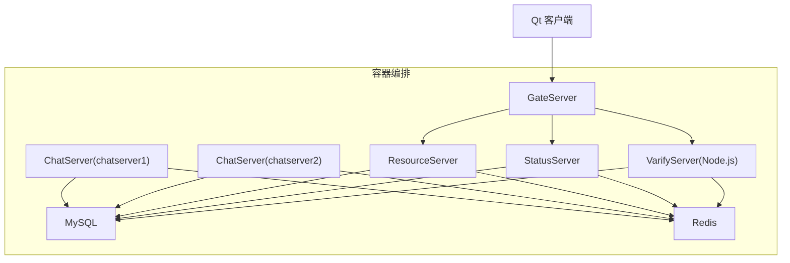
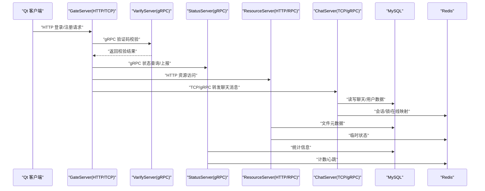
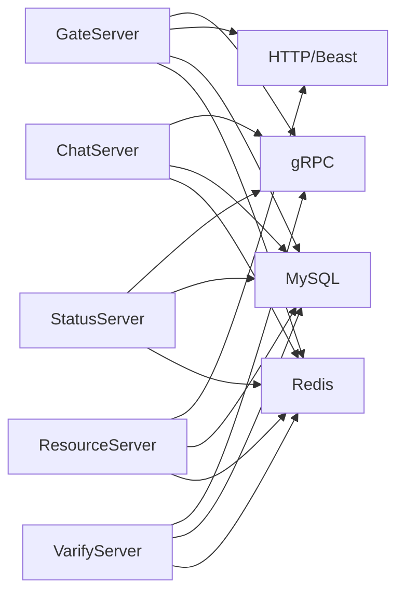

# Docker部署

<cite>
**本文引用的文件**   
- [README.md](file://README.md)
- [CMakeLists.txt](file://CMakeLists.txt)
- [CMakePresets.json](file://CMakePresets.json)
- [vcpkg.json](file://vcpkg.json)
- [server/CMakeLists.txt](file://server/CMakeLists.txt)
- [client/llfcchat/CMakeLists.txt](file://client/llfcchat/CMakeLists.txt)
- [server/GateServer/config/config.ini](file://server/GateServer/config/config.ini)
- [server/ResourceServer/config/config.ini](file://server/ResourceServer/config/config.ini)
- [server/StatusServer/config/config.ini](file://server/StatusServer/config/config.ini)
- [server/ChatServer/config/chatserver1.ini](file://server/ChatServer/config/chatserver1.ini)
- [server/VarifyServer/package.json](file://server/VarifyServer/package.json)
- [server/VarifyServer/config.js](file://server/VarifyServer/config.js)
- [server/VarifyServer/redis.js](file://server/VarifyServer/redis.js)
- [sql备份/llfc.sql](file://sql备份/llfc.sql)
</cite>

## 目录
1. [简介](#简介)
2. [项目结构](#项目结构)
3. [核心组件](#核心组件)
4. [架构总览](#架构总览)
5. [详细组件分析](#详细组件分析)
6. [依赖关系分析](#依赖关系分析)
7. [性能考虑](#性能考虑)
8. [故障排查指南](#故障排查指南)
9. [结论](#结论)
10. [附录](#附录)

## 简介
本文件为 LLFCChat 项目的容器化部署指南，目标是在生产环境中以 Docker 与 docker-compose 编排运行 C++ 后端服务（GateServer、ChatServer、ResourceServer、StatusServer）与 Node.js 验证服务（VarifyServer），并集成 MySQL 与 Redis 持久化。文档涵盖多阶段 Dockerfile 设计、镜像体积优化、构建加速、服务依赖与网络配置、数据卷挂载、环境变量注入、监控日志与故障恢复、以及生产安全加固建议。

## 项目结构
LLFCChat 包含以下关键部分：
- C++ 服务端：GateServer、ChatServer、ResourceServer、StatusServer，使用 CMake + vcpkg 管理依赖，基于 Boost.Asio/Beast、gRPC、MySQL Connector/C++、hiredis 等库。
- Node.js 验证服务：VarifyServer，基于 @grpc/grpc-js、ioredis、nodemailer 等。
- Qt 客户端：Windows 桌面应用（不在容器内运行）。
- 数据库与缓存：MySQL（SQL 脚本在 sql备份）、Redis（用于验证码、会话、分布式锁等）。

**图示来源** 
- [server/GateServer/config/config.ini:1-25](file://server/GateServer/config/config.ini#L1-L25)
- [server/ChatServer/config/chatserver1.ini:1-30](file://server/ChatServer/config/chatserver1.ini#L1-L30)
- [server/ResourceServer/config/config.ini:1-27](file://server/ResourceServer/config/config.ini#L1-L27)
- [server/StatusServer/config/config.ini:1-23](file://server/StatusServer/config/config.ini#L1-L23)
- [server/VarifyServer/package.json:1-19](file://server/VarifyServer/package.json#L1-L19)

**章节来源**
- [README.md:1-112](file://README.md#L1-L112)
- [CMakeLists.txt:1-34](file://CMakeLists.txt#L1-L34)
- [server/CMakeLists.txt:1-38](file://server/CMakeLists.txt#L1-L38)
- [client/llfcchat/CMakeLists.txt:1-222](file://client/llfcchat/CMakeLists.txt#L1-L222)

## 核心组件
- GateServer：HTTP/TCP 网关，负责鉴权转发、路由到聊天/资源/状态服务。
- ChatServer：聊天业务逻辑，处理消息、好友申请、跨服通信。
- ResourceServer：静态资源与文件上传下载。
- StatusServer：状态管理与心跳统计。
- VarifyServer：验证码派发、邮箱发送、登录令牌校验。
- MySQL：用户、聊天消息、会话等持久化存储。
- Redis：验证码、会话、分布式锁、在线用户映射等。

**章节来源**
- [server/GateServer/config/config.ini:1-25](file://server/GateServer/config/config.ini#L1-L25)
- [server/ChatServer/config/chatserver1.ini:1-30](file://server/ChatServer/config/chatserver1.ini#L1-L30)
- [server/ResourceServer/config/config.ini:1-27](file://server/ResourceServer/config/config.ini#L1-L27)
- [server/StatusServer/config/config.ini:1-23](file://server/StatusServer/config/config.ini#L1-L23)
- [server/VarifyServer/package.json:1-19](file://server/VarifyServer/package.json#L1-L19)

## 架构总览
下图展示了容器间通信与服务依赖关系，端口与协议依据各服务的配置文件确定。

**图示来源** 
- [server/GateServer/config/config.ini:1-25](file://server/GateServer/config/config.ini#L1-L25)
- [server/VarifyServer/package.json:1-19](file://server/VarifyServer/package.json#L1-L19)
- [server/StatusServer/config/config.ini:1-23](file://server/StatusServer/config/config.ini#L1-L23)
- [server/ResourceServer/config/config.ini:1-27](file://server/ResourceServer/config/config.ini#L1-L27)
- [server/ChatServer/config/chatserver1.ini:1-30](file://server/ChatServer/config/chatserver1.ini#L1-L30)

## 详细组件分析

### C++ 服务容器化策略（多阶段构建）
- 构建阶段（builder）：安装编译工具链、CMake、Ninja、vcpkg，拉取依赖（Boost、gRPC、protobuf、mysql-connector-cpp、hiredis），编译生成可执行文件。
- 运行阶段（runtime）：仅包含运行时所需的最小基础镜像（如 glibc 环境），拷贝二进制与配置文件，暴露端口，设置健康检查与日志输出。

关键点：
- 使用 vcpkg 清单锁定依赖版本，确保可重复构建。
- 将 CMake 预设与 Ninja Multi-Config 作为构建器要求，利于并行构建与多配置支持。
- 通过 COPY --from=builder 只复制产物，显著减小镜像体积。

**章节来源**
- [CMakeLists.txt:1-34](file://CMakeLists.txt#L1-L34)
- [CMakePresets.json:1-35](file://CMakePresets.json#L1-L35)
- [vcpkg.json:1-32](file://vcpkg.json#L1-L32)
- [server/CMakeLists.txt:1-38](file://server/CMakeLists.txt#L1-L38)

### Node.js 验证服务容器化策略
- 使用官方 node 镜像，安装依赖后以非 root 用户运行。
- 通过环境变量或挂载 config.json 注入配置（邮箱、MySQL、Redis 连接参数）。
- 启用 ioredis 重连与心跳机制，提升稳定性。

**章节来源**
- [server/VarifyServer/package.json:1-19](file://server/VarifyServer/package.json#L1-L19)
- [server/VarifyServer/config.js:1-14](file://server/VarifyServer/config.js#L1-L14)
- [server/VarifyServer/redis.js:1-48](file://server/VarifyServer/redis.js#L1-L48)

### 数据持久化配置（MySQL 与 Redis）
- MySQL：
  - 数据目录挂载至宿主机路径，避免容器重建丢失数据。
  - 初始化 SQL 脚本可通过 initdb 或启动后导入 llfc.sql。
- Redis：
  - 数据目录与配置文件挂载，开启 AOF/RDB 持久化。
  - 密码与端口按服务配置一致。

**章节来源**
- [sql备份/llfc.sql:1-200](file://sql备份/llfc.sql#L1-L200)

### 环境变量管理与配置注入最佳实践
- 所有敏感信息（数据库密码、Redis 密码、邮箱凭据）通过环境变量注入，不写入镜像或代码。
- C++ 服务读取 .ini 配置文件，可在容器启动时由外部卷挂载覆盖默认配置。
- Node.js 服务从 config.json 读取，可通过环境变量替换 key 值或使用模板引擎生成。

**章节来源**
- [server/GateServer/config/config.ini:1-25](file://server/GateServer/config/config.ini#L1-L25)
- [server/ResourceServer/config/config.ini:1-27](file://server/ResourceServer/config/config.ini#L1-L27)
- [server/StatusServer/config/config.ini:1-23](file://server/StatusServer/config/config.ini#L1-L23)
- [server/ChatServer/config/chatserver1.ini:1-30](file://server/ChatServer/config/chatserver1.ini#L1-L30)
- [server/VarifyServer/config.js:1-14](file://server/VarifyServer/config.js#L1-L14)

### 容器监控、日志收集与故障恢复
- 监控：
  - 为每个服务添加健康检查端点（HTTP 或 gRPC 健康接口）。
  - 使用 docker-compose healthcheck 定期探测。
- 日志：
  - 统一输出到 stdout/stderr，由容器运行时收集；或挂载日志目录到宿主机。
- 故障恢复：
  - 设置 restart 策略（on-failure、always），限制重启次数。
  - 对 MySQL/Redis 设置独立容器与数据卷，保证数据不丢失。

[本节为通用指导，无需特定文件引用]

### 生产环境容器安全加固建议
- 最小权限原则：以非 root 用户运行服务。
- 镜像安全扫描：使用 Trivy/Clair 扫描漏洞。
- 网络隔离：使用自定义桥接网络，仅开放必要端口。
- 密钥管理：使用 Docker Secrets 或外部密钥管理服务。
- 只读根文件系统：除必要写目录外，设置为只读。
- 更新策略：定期更新基础镜像与依赖，固定版本。

[本节为通用指导，无需特定文件引用]

## 依赖关系分析
- C++ 服务依赖：
  - Boost.Asio/Beast：网络与 HTTP。
  - gRPC/Protobuf：服务间通信。
  - MySQL Connector/C++：数据库访问。
  - hiredis：Redis 客户端。
- Node.js 服务依赖：
  - @grpc/grpc-js：gRPC 客户端。
  - ioredis：Redis 客户端。
  - nodemailer：邮件发送。

**图示来源** 
- [vcpkg.json:1-32](file://vcpkg.json#L1-L32)
- [server/VarifyServer/package.json:1-19](file://server/VarifyServer/package.json#L1-L19)

**章节来源**
- [vcpkg.json:1-32](file://vcpkg.json#L1-L32)
- [server/VarifyServer/package.json:1-19](file://server/VarifyServer/package.json#L1-L19)

## 性能考虑
- 构建优化：
  - 使用多阶段构建，分离 builder 与 runtime。
  - 缓存 vcpkg 包与 npm 依赖层。
  - 并行编译（Ninja Multi-Config）。
- 运行优化：
  - 合理分配 CPU/内存限制。
  - 连接池与超时配置（MySQL、Redis）。
  - 静态资源 CDN 或本地缓存。
- 网络优化：
  - 服务间使用 gRPC 减少序列化开销。
  - 同一宿主内使用 Docker 网络降低延迟。

[本节为通用指导，无需特定文件引用]

## 故障排查指南
- 常见错误：
  - 端口冲突：检查各服务端口是否与配置一致。
  - 数据库连接失败：确认 MySQL 地址、端口、用户名、密码。
  - Redis 认证失败：核对密码与端口。
  - gRPC 调用超时：检查服务是否启动且端口可达。
- 排查步骤：
  - 查看容器日志（docker logs）。
  - 进入容器执行网络连通性测试（ping/curl）。
  - 检查健康检查与健康状态。
  - 核对配置文件与挂载卷是否正确。

**章节来源**
- [server/GateServer/config/config.ini:1-25](file://server/GateServer/config/config.ini#L1-L25)
- [server/ResourceServer/config/config.ini:1-27](file://server/ResourceServer/config/config.ini#L1-L27)
- [server/StatusServer/config/config.ini:1-23](file://server/StatusServer/config/config.ini#L1-L23)
- [server/ChatServer/config/chatserver1.ini:1-30](file://server/ChatServer/config/chatserver1.ini#L1-L30)
- [server/VarifyServer/redis.js:1-48](file://server/VarifyServer/redis.js#L1-L48)

## 结论
通过多阶段 Dockerfile 与 docker-compose 编排，可将 LLFCChat 的 C++ 与 Node.js 服务高效地容器化部署。结合数据卷、环境变量、健康检查与重启策略，可实现稳定、可观测、易维护的生产环境。遵循安全加固与性能优化建议，进一步提升系统可靠性与扩展性。

[本节为总结性内容，无需特定文件引用]

## 附录
- 构建命令参考：
  - C++：使用 CMake + Ninja Multi-Config，vcpkg 管理依赖。
  - Node.js：npm install 安装依赖，node server.js 启动。
- 端口规划：
  - GateServer：HTTP/TCP 入口。
  - ChatServer：TCP/gRPC 聊天通道。
  - ResourceServer：HTTP/RPC 资源服务。
  - StatusServer：gRPC 状态服务。
  - VarifyServer：gRPC 验证服务。
  - MySQL：3306（映射宿主机端口）。
  - Redis：6379（映射宿主机端口）。

[本节为补充信息，无需特定文件引用]