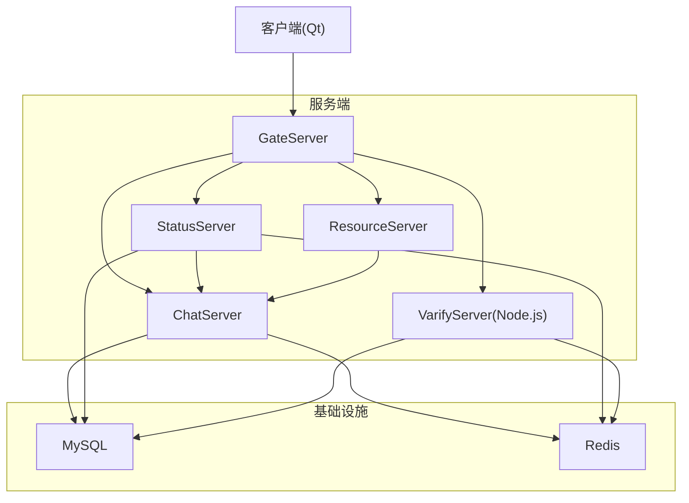
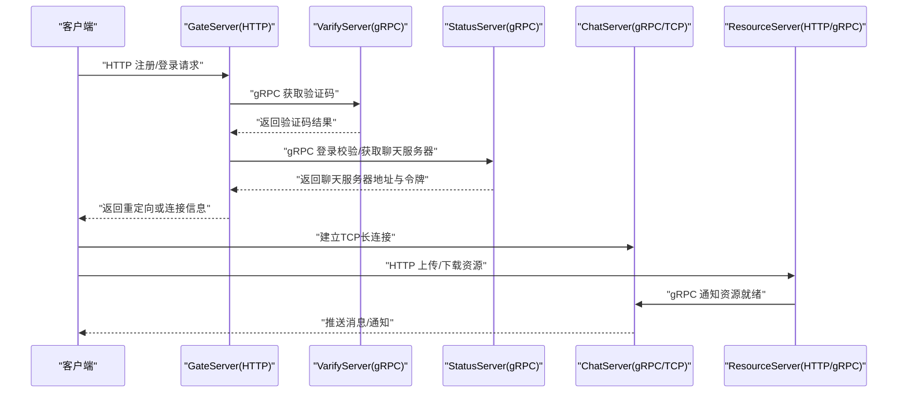
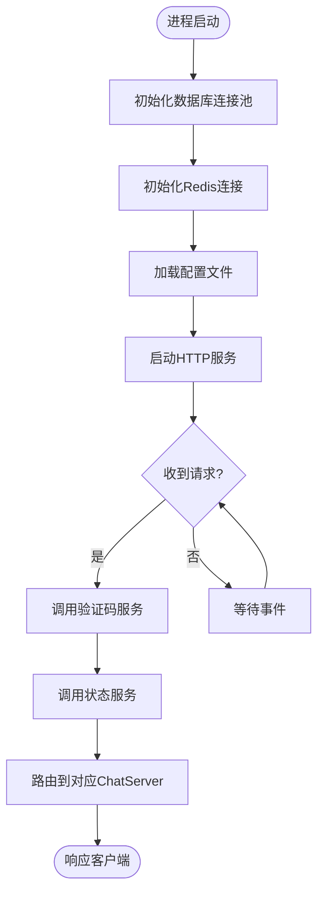
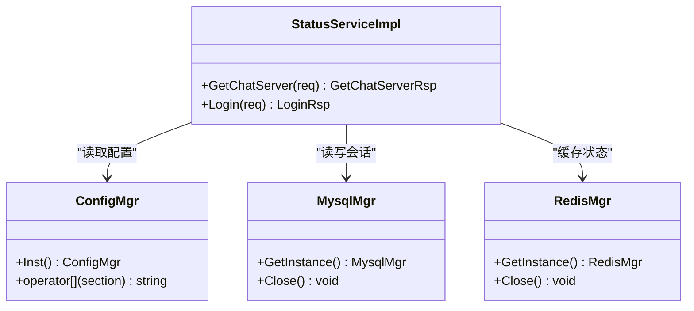
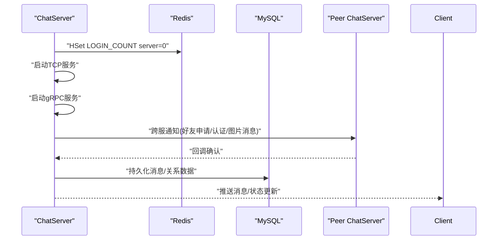
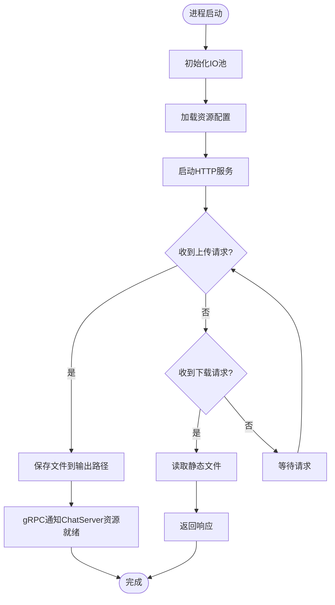
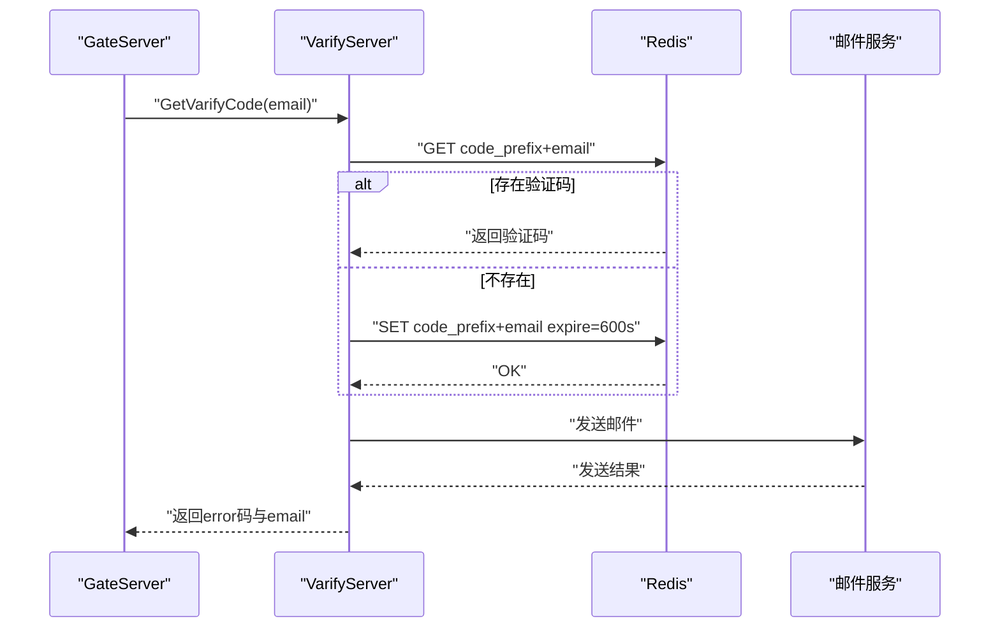
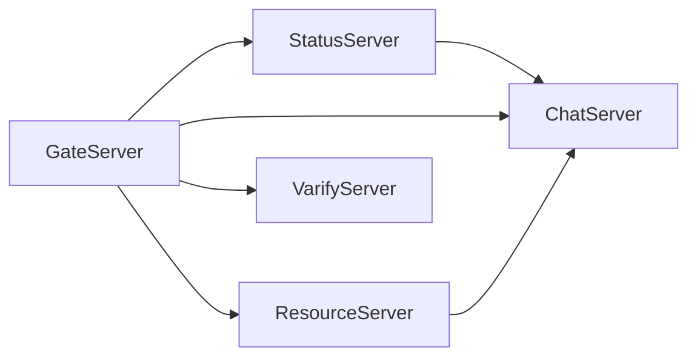

# 服务部署

<cite>
**本文引用的文件**
- [README.md](file://README.md)
- [GateServer配置](file://server/GateServer/config/config.ini)
- [StatusServer配置](file://server/StatusServer/config/config.ini)
- [ChatServer配置1](file://server/ChatServer/config/chatserver1.ini)
- [ResourceServer配置](file://server/ResourceServer/config/config.ini)
- [VarifyServer配置加载](file://server/VarifyServer/config.js)
- [VarifyServer包信息](file://server/VarifyServer/package.json)
- [GateServer主程序](file://server/GateServer/src/GateServer.cpp)
- [StatusServer主程序](file://server/StatusServer/src/StatusServer.cpp)
- [ChatServer主程序](file://server/ChatServer/src/ChatServer.cpp)
- [ResourceServer主程序](file://server/ResourceServer/src\ResourceServer.cpp)
- [VarifyServer主程序](file://server/VarifyServer/server.js)
- [状态服务接口定义](file://proto/status_service/status.proto)
- [聊天服务接口定义](file://proto/chat_service/chat.proto)
- [验证码服务接口定义](file://proto/verify_service/verify.proto)
</cite>

## 目录
1. [简介](#简介)
2. [项目结构](#项目结构)
3. [核心组件](#核心组件)
4. [架构总览](#架构总览)
5. [详细组件分析](#详细组件分析)
6. [依赖关系与启动顺序](#依赖关系与启动顺序)
7. [配置文件详解](#配置文件详解)
8. [Docker容器化部署](#docker容器化部署)
9. [生产环境部署策略](#生产环境部署策略)
10. [监控与健康检查](#监控与健康检查)
11. [性能考虑](#性能考虑)
12. [故障排查指南](#故障排查指南)
13. [结论](#结论)

## 简介
本部署文档面向LLFCChat微服务，目标是为运维与开发人员提供一套可操作的部署指南。内容涵盖：
- 服务启动顺序与依赖关系（GateServer → StatusServer → ChatServer → ResourceServer → VarifyServer）
- 配置文件结构与参数说明（数据库、Redis、端口等）
- Docker容器化方案（Dockerfile与docker-compose编排）
- 生产环境部署策略（负载均衡、故障转移、水平扩展）
- 服务监控与健康检查配置方法

## 项目结构
仓库采用多服务分层组织，服务端包含五个核心微服务：GateServer、StatusServer、ChatServer、ResourceServer、VarifyServer。每个服务拥有独立配置与源码目录，gRPC接口定义集中在proto目录。

图表来源
- [GateServer主程序:1-160](file://server/GateServer/src/GateServer.cpp#L1-L160)
- [StatusServer主程序:1-69](file://server/StatusServer/src/StatusServer.cpp#L1-L69)
- [ChatServer主程序:1-81](file://server/ChatServer/src/ChatServer.cpp#L1-L81)
- [ResourceServer主程序:1-42](file://server/ResourceServer/src\ResourceServer.cpp#L1-L42)
- [VarifyServer主程序:1-76](file://server/VarifyServer/server.js#L1-L76)

章节来源
- [README.md:1-112](file://README.md#L1-L112)

## 核心组件
- GateServer：HTTP入口网关，负责鉴权、路由转发、与验证码服务交互、查询状态服务以定位聊天服务器。
- StatusServer：gRPC状态服务，维护用户登录会话与聊天服务器路由信息。
- ChatServer：gRPC+TCP聊天服务，处理消息推送、好友关系通知、踢人逻辑、心跳等。
- ResourceServer：资源服务，提供静态资源与文件上传下载能力，通过gRPC与ChatServer协作。
- VarifyServer：Node.js实现的验证码服务，生成并发送邮箱验证码，使用Redis缓存验证码。

章节来源
- [GateServer主程序:1-160](file://server/GateServer/src/GateServer.cpp#L1-L160)
- [StatusServer主程序:1-69](file://server/StatusServer/src/StatusServer.cpp#L1-L69)
- [ChatServer主程序:1-81](file://server/ChatServer/src/ChatServer.cpp#L1-L81)
- [ResourceServer主程序:1-42](file://server/ResourceServer/src\ResourceServer.cpp#L1-L42)
- [VarifyServer主程序:1-76](file://server/VarifyServer/server.js#L1-L76)

## 架构总览
系统采用混合通信模式：
- HTTP：客户端到GateServer的认证与注册流程
- gRPC：服务间通信（StatusService、ChatService、VarifyService）
- TCP：客户端与ChatServer的长连接用于实时消息推送

图表来源
- [GateServer主程序:1-160](file://server/GateServer/src/GateServer.cpp#L1-L160)
- [StatusServer主程序:1-69](file://server/StatusServer/src/StatusServer.cpp#L1-L69)
- [ChatServer主程序:1-81](file://server/ChatServer/src/ChatServer.cpp#L1-L81)
- [ResourceServer主程序:1-42](file://server/ResourceServer/src\ResourceServer.cpp#L1-L42)
- [VarifyServer主程序:1-76](file://server/VarifyServer/server.js#L1-L76)
- [状态服务接口定义:1-32](file://proto/status_service/status.proto#L1-L32)
- [聊天服务接口定义:1-105](file://proto/chat_service/chat.proto#L1-L105)
- [验证码服务接口定义:1-19](file://proto/verify_service/verify.proto#L1-L19)

## 详细组件分析

### GateServer
- 职责：HTTP网关、验证码调用、状态服务查询、路由转发
- 关键行为：初始化MysqlMgr与RedisMgr；读取配置中的端口；启动AsioIOServicePool；监听HTTP端口；优雅关闭信号处理
- 依赖：VarifyServer(gRPC)、StatusServer(gRPC)、Redis、MySQL

图表来源
- [GateServer主程序:1-160](file://server/GateServer/src/GateServer.cpp#L1-L160)
- [GateServer配置:1-25](file://server/GateServer/config/config.ini#L1-L25)

章节来源
- [GateServer主程序:1-160](file://server/GateServer/src/GateServer.cpp#L1-L160)
- [GateServer配置:1-25](file://server/GateServer/config/config.ini#L1-L25)

### StatusServer
- 职责：gRPC状态服务，维护用户登录会话、分配聊天服务器实例
- 关键行为：构建gRPC服务器；注册StatusServiceImpl；监听端口；信号处理优雅关闭
- 依赖：MySQL、Redis、ChatServer列表（配置中声明）

图表来源
- [StatusServer主程序:1-69](file://server/StatusServer/src/StatusServer.cpp#L1-L69)
- [状态服务接口定义:1-32](file://proto/status_service/status.proto#L1-L32)
- [StatusServer配置:1-23](file://server/StatusServer/config/config.ini#L1-L23)

章节来源
- [StatusServer主程序:1-69](file://server/StatusServer/src/StatusServer.cpp#L1-L69)
- [StatusServer配置:1-23](file://server/StatusServer/config/config.ini#L1-L23)
- [状态服务接口定义:1-32](file://proto/status_service/status.proto#L1-L32)

### ChatServer
- 职责：gRPC+TCP聊天服务，处理消息、好友关系、踢人、心跳
- 关键行为：初始化AsioIOServicePool；设置登录计数到Redis；启动TCP服务；启动gRPC服务；信号处理优雅关闭
- 依赖：StatusServer、其他ChatServer实例、Redis、MySQL

图表来源
- [ChatServer主程序:1-81](file://server/ChatServer/src/ChatServer.cpp#L1-L81)
- [聊天服务接口定义:1-105](file://proto/chat_service/chat.proto#L1-L105)
- [ChatServer配置1:1-30](file://server/ChatServer/config/chatserver1.ini#L1-L30)

章节来源
- [ChatServer主程序:1-81](file://server/ChatServer/src/ChatServer.cpp#L1-L81)
- [ChatServer配置1:1-30](file://server/ChatServer/config/chatserver1.ini#L1-L30)
- [聊天服务接口定义:1-105](file://proto/chat_service/chat.proto#L1-L105)

### ResourceServer
- 职责：HTTP资源服务，提供静态资源与文件上传下载；通过gRPC与ChatServer协作
- 关键行为：初始化AsioIOServicePool；启动HTTP服务；信号处理优雅关闭
- 依赖：ChatServer(gRPC)、Redis、MySQL

图表来源
- [ResourceServer主程序:1-42](file://server/ResourceServer/src\ResourceServer.cpp#L1-L42)
- [ResourceServer配置:1-27](file://server/ResourceServer/config/config.ini#L1-L27)

章节来源
- [ResourceServer主程序:1-42](file://server/ResourceServer/src\ResourceServer.cpp#L1-L42)
- [ResourceServer配置:1-27](file://server/ResourceServer/config/config.ini#L1-L27)

### VarifyServer
- 职责：Node.js实现的验证码服务，生成并发送邮箱验证码，使用Redis缓存
- 关键行为：加载config.json；实现gRPC服务；从Redis获取或生成验证码；发送邮件
- 依赖：Redis、MySQL（可选）、邮件服务

图表来源
- [VarifyServer主程序:1-76](file://server/VarifyServer/server.js#L1-L76)
- [VarifyServer配置加载:1-15](file://server/VarifyServer/config.js#L1-L15)
- [验证码服务接口定义:1-19](file://proto/verify_service/verify.proto#L1-L19)

章节来源
- [VarifyServer主程序:1-76](file://server/VarifyServer/server.js#L1-L76)
- [VarifyServer配置加载:1-15](file://server/VarifyServer/config.js#L1-L15)
- [VarifyServer包信息:1-19](file://server/VarifyServer/package.json#L1-L19)
- [验证码服务接口定义:1-19](file://proto/verify_service/verify.proto#L1-L19)

## 依赖关系与启动顺序
推荐的启动顺序为：GateServer → StatusServer → ChatServer → ResourceServer → VarifyServer。该顺序确保：
- GateServer先启动以便接收外部请求
- StatusServer随后启动，提供路由与会话管理
- ChatServer启动后加入集群，接受来自GateServer和StatusServer的请求
- ResourceServer启动以支持资源上传下载
- VarifyServer最后启动，确保验证码服务可用

图表来源
- [GateServer主程序:1-160](file://server/GateServer/src/GateServer.cpp#L1-L160)
- [StatusServer主程序:1-69](file://server/StatusServer/src/StatusServer.cpp#L1-L69)
- [ChatServer主程序:1-81](file://server/ChatServer/src/ChatServer.cpp#L1-L81)
- [ResourceServer主程序:1-42](file://server/ResourceServer/src\ResourceServer.cpp#L1-L42)
- [VarifyServer主程序:1-76](file://server/VarifyServer/server.js#L1-L76)

章节来源
- [GateServer主程序:1-160](file://server/GateServer/src/GateServer.cpp#L1-L160)
- [StatusServer主程序:1-69](file://server/StatusServer/src/StatusServer.cpp#L1-L69)
- [ChatServer主程序:1-81](file://server/ChatServer/src/ChatServer.cpp#L1-L81)
- [ResourceServer主程序:1-42](file://server/ResourceServer/src\ResourceServer.cpp#L1-L42)
- [VarifyServer主程序:1-76](file://server/VarifyServer/server.js#L1-L76)

## 配置文件详解
各服务的配置文件位于各自config目录下，主要包含以下部分：
- 服务自身端口与主机绑定
- 依赖服务地址（如VarifyServer、StatusServer、ChatServer）
- 数据库连接（Host、Port、User、Passwd、Schema）
- Redis连接（Host、Port、Passwd）
- 输出路径与静态资源路径（ResourceServer）
- 对端ChatServer列表（ChatServer与ResourceServer）

示例字段说明（基于实际配置）：
- GateServer配置：[GateServer]Port、[VarifyServer]Host/Port、[StatusServer]Host/Port、[Mysql]*、[Redis]*、[ResServer]*
- StatusServer配置：[StatusServer]Port/Host、[Mysql]*、[Redis]*、[chatservers]Name、[chatserver1/2]*
- ChatServer配置：[GateServer]Port、[VarifyServer]*、[StatusServer]*、[SelfServer]*、[Mysql]*、[Redis]*、[PeerServer]Servers、[chatserver2]*
- ResourceServer配置：[SelfServer]*、[Mysql]*、[Redis]*、[Output]Path、[Static]Path、[chatserver1/2]*
- VarifyServer配置：通过config.js加载config.json，包含email、mysql、redis相关字段

章节来源
- [GateServer配置:1-25](file://server/GateServer/config/config.ini#L1-L25)
- [StatusServer配置:1-23](file://server/StatusServer/config/config.ini#L1-L23)
- [ChatServer配置1:1-30](file://server/ChatServer/config/chatserver1.ini#L1-L30)
- [ResourceServer配置:1-27](file://server/ResourceServer/config/config.ini#L1-L27)
- [VarifyServer配置加载:1-15](file://server/VarifyServer/config.js#L1-L15)

## Docker容器化部署
建议为每个C++服务构建镜像，VarifyServer使用Node.js镜像。以下为推荐步骤：

- 基础镜像选择
  - C++服务：使用包含编译工具链的基础镜像（如ubuntu或centos），或在CI中预编译二进制
  - VarifyServer：node:18-alpine

- Dockerfile编写要点
  - 复制已编译的二进制到镜像
  - 复制配置文件到镜像指定路径
  - 暴露端口（HTTP/gRPC/TCP）
  - 设置环境变量覆盖配置（如数据库地址、Redis密码）
  - 健康检查命令（curl或自定义探针）

- docker-compose编排
  - 定义服务：gate、status、chat1、chat2、resource、varify
  - 网络：统一bridge网络，内部DNS解析
  - 卷挂载：配置文件、静态资源、日志
  - 依赖关系：depends_on按启动顺序声明
  - 环境变量：注入数据库、Redis、端口等配置

注意：由于仓库未提供现有Dockerfile与compose文件，以上为通用实践指导。可根据实际二进制路径与配置目录调整。

## 生产环境部署策略
- 负载均衡
  - 在GateServer前部署Nginx或云负载均衡器，将HTTP请求分发到多个GateServer实例
  - gRPC层可使用服务网格（如Istio）或服务发现（Consul/Etcd）进行动态路由

- 故障转移
  - StatusServer高可用：多实例部署，配合Redis做会话同步
  - ChatServer多实例：通过StatusServer维护在线实例列表，自动切换
  - 健康检查：定期探测服务端口与业务接口，失败实例剔除

- 水平扩展
  - ChatServer无状态化：会话与状态存储于Redis/MySQL，便于横向扩展
  - ResourceServer共享存储：使用对象存储（如MinIO/S3）替代本地文件系统
  - VarifyServer无状态：验证码存Redis，多实例共享

## 监控与健康检查
- 指标采集
  - 暴露Prometheus指标端点（HTTP /metrics）
  - 记录关键业务指标：登录数、消息吞吐、错误率、延迟

- 健康检查
  - HTTP健康端点：/healthz返回200表示服务正常
  - gRPC健康检查：实现grpc.health.v1.Health服务
  - 依赖健康：检查MySQL、Redis连接状态

- 日志收集
  - 结构化日志（JSON格式）
  - 集中式日志平台（ELK/Loki）

- 告警规则
  - 服务不可用、错误率升高、延迟超过阈值、资源耗尽

## 性能考虑
- 连接池优化：MySQL与Redis连接池大小根据负载调优
- 异步IO：AsioIOServicePool合理设置线程数
- 内存管理：避免大对象频繁分配，使用对象池
- 缓存策略：热点数据缓存至Redis，减少数据库压力
- 序列化：gRPC使用protobuf，保持高效传输

## 故障排查指南
- 常见问题
  - 端口冲突：检查配置文件中端口是否被占用
  - 数据库连接失败：验证Host、Port、User、Passwd、Schema
  - Redis认证失败：检查Passwd是否正确
  - gRPC连接超时：确认服务地址与防火墙规则

- 调试技巧
  - 启用详细日志级别
  - 使用tcpdump/Wireshark抓包分析网络问题
  - 查看系统资源使用情况（CPU、内存、磁盘IO）

- 恢复策略
  - 重启服务：优先重启单个实例，观察是否恢复
  - 回滚配置：快速回退到上一个稳定版本
  - 降级服务：禁用非核心功能，保障核心链路

## 结论
本部署文档提供了LLFCChat微服务的完整部署指南，包括服务依赖、配置说明、容器化方案、生产策略与监控方法。按照本文档实施，可实现高可用、可扩展、易维护的聊天系统部署。