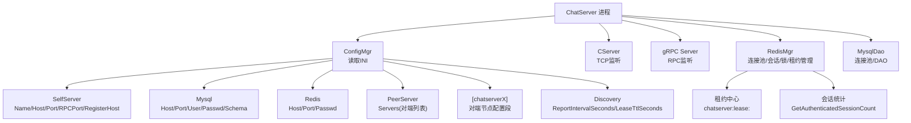
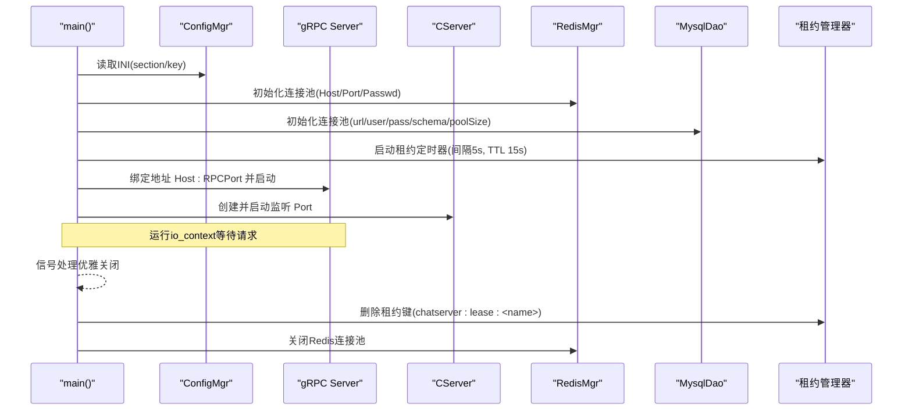
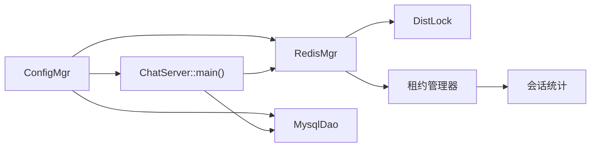

# ChatServer聊天服务配置

<cite>
**本文引用的文件**   
- [chatserver1.ini](file://server/ChatServer/config/chatserver1.ini)
- [chatserver2.ini](file://server/ChatServer/config/chatserver2.ini)
- [ConfigMgr.h](file://server/ChatServer/include/ConfigMgr.h)
- [ConfigMgr.cpp](file://server/ChatServer/src/ConfigMgr.cpp)
- [RedisMgr.h](file://server/ChatServer/include/RedisMgr.h)
- [RedisMgr.cpp](file://server/ChatServer/src/RedisMgr.cpp)
- [MysqlDao.h](file://server/ChatServer/include/MysqlDao.h)
- [MysqlDao.cpp](file://server/ChatServer/src/MysqlDao.cpp)
- [DistLock.h](file://server/ChatServer/include/DistLock.h)
- [DistLock.cpp](file://server/ChatServer/src/DistLock.cpp)
- [const.h](file://server/ChatServer/include/const.h)
- [ChatServer.cpp](file://server/ChatServer/src/ChatServer.cpp)
- [CServer.cpp](file://server/ChatServer/src/CServer.cpp)
- [CServer.h](file://server/ChatServer/include/CServer.h)
- [im_common.h](file://tests/integration/im_common.h)
</cite>

## 更新摘要
**所做更改**   
- 移除了旧的心跳机制（CHATSERVER_HEARTBEAT_PREFIX），新增了基于Redis SETEX的租约发布系统
- 新增Discovery配置段，包含ReportIntervalSeconds和LeaseTtlSeconds参数
- 更新了服务注册机制，从心跳注册改为租约续租模式
- 完善了分布式部署配置说明，强调租约机制的优势和配置方法
- 添加了租约状态监控和故障排查指南

## 目录
1. [简介](#简介)
2. [项目结构](#项目结构)
3. [核心组件](#核心组件)
4. [架构总览](#架构总览)
5. [详细组件分析](#详细组件分析)
6. [依赖关系分析](#依赖关系分析)
7. [性能考虑](#性能考虑)
8. [故障排查指南](#故障排查指南)
9. [结论](#结论)
10. [附录](#附录)

## 简介
本文件为 ChatServer 聊天核心服务的配置文档，重点说明 chatserver1.ini 与 chatserver2.ini 的配置项含义、多实例部署差异、MySQL 连接池、Redis 会话与分布式锁等高级选项，并提供单机与集群部署示例以及配置验证方法。**最新更新**：实现了全新的基于Redis SETEX的租约发布系统，替代原有的心跳注册机制。新系统通过定期续租确保服务可用性，提供更可靠的分布式服务发现能力。

## 项目结构
ChatServer 使用 INI 配置文件管理运行时参数，通过 ConfigMgr 加载并暴露给各模块（如 RedisMgr、MysqlDao）。两个示例配置文件分别用于启动两个不同实例，区分自身端口、RPC 端口以及对端服务器信息。

图表来源 
- [ConfigMgr.cpp:1-42](file://server/ChatServer/src/ConfigMgr.cpp#L1-L42)
- [RedisMgr.cpp:1-11](file://server/ChatServer/src/RedisMgr.cpp#L1-L11)
- [MysqlDao.cpp:1-13](file://server/ChatServer/src/MysqlDao.cpp#L1-L13)
- [ChatServer.cpp:20-51](file://server/ChatServer/src/ChatServer.cpp#L20-L51)

章节来源
- [chatserver1.ini:1-44](file://server/ChatServer/config/chatserver1.ini#L1-L44)
- [chatserver2.ini:1-44](file://server/ChatServer/config/chatserver2.ini#L1-L44)
- [ConfigMgr.h:1-84](file://server/ChatServer/include/ConfigMgr.h#L1-L84)
- [ConfigMgr.cpp:1-50](file://server/ChatServer/src/ConfigMgr.cpp#L1-L50)

## 核心组件
- 配置管理器 ConfigMgr：单例模式，基于 Boost.PropertyTree 解析 INI，提供按 section/key 取值能力。
- Redis 管理器 RedisMgr：封装 hiredis 连接池、常用命令、分布式锁调用、登录计数统计、**租约管理**。
- MySQL DAO MysqlDao：封装 cppconn 连接池、健康检查与重连、事务与分页查询。
- 分布式锁 DistLock：基于 Redis SET NX EX + Lua 原子释放。
- 常量定义 const.h：包含键前缀、锁超时、重试时间等全局常量。

章节来源
- [ConfigMgr.h:46-84](file://server/ChatServer/include/ConfigMgr.h#L46-L84)
- [ConfigMgr.cpp:1-50](file://server/ChatServer/src/ConfigMgr.cpp#L1-L50)
- [RedisMgr.h:267-305](file://server/ChatServer/include/RedisMgr.h#L267-305)
- [RedisMgr.cpp:1-11](file://server/ChatServer/src/RedisMgr.cpp#L1-L11)
- [MysqlDao.h:25-232](file://server/ChatServer/include/MysqlDao.h#L25-L232)
- [MysqlDao.cpp:1-13](file://server/ChatServer/src/MysqlDao.cpp#L1-L13)
- [DistLock.h:1-18](file://server/ChatServer/include/DistLock.h#L1-L18)
- [DistLock.cpp:1-73](file://server/ChatServer/src/DistLock.cpp#L1-L73)
- [const.h:81-94](file://server/ChatServer/include/const.h#L81-L94)

## 架构总览
ChatServer 启动流程中，首先由 ConfigMgr 加载当前工作目录下的 INI 文件，随后初始化 gRPC 服务与 TCP 服务，同时建立 Redis 与 MySQL 连接池。**重大更新**：服务启动时自动创建租约定时器，定期向Redis报告已认证会话数量，实现基于SETEX的租约续租机制。进程退出时自动清理租约资源。

图表来源 
- [ChatServer.cpp:20-51](file://server/ChatServer/src/ChatServer.cpp#L20-51)
- [ConfigMgr.cpp:1-42](file://server/ChatServer/src/ConfigMgr.cpp#L1-L42)
- [RedisMgr.cpp:1-11](file://server/ChatServer/src/RedisMgr.cpp#L1-L11)
- [MysqlDao.cpp:1-13](file://server/ChatServer/src/MysqlDao.cpp#L1-L13)

## 详细组件分析

### 配置文件结构与参数说明
- 通用段
  - GateServer.Port：网关端口（示例值保留，实际由其他服务使用）
  - VarifyServer.Host/Port：验证码服务地址
  - StatusServer.Host/Port：状态服务地址
- SelfServer（自身服务）
  - Name：实例名（用于 Redis 登录计数等标识）
  - Host：gRPC 监听地址（通常为 0.0.0.0）
  - Port：TCP 业务监听端口
  - RPCPort：gRPC 服务端口
  - **RegisterHost：服务注册外部IP地址（可选，默认使用Host）**
- Mysql（数据库）
  - Host/Port/User/Passwd/Schema：MySQL 连接信息与库名
- Redis（缓存与会话）
  - Host/Port/Passwd：Redis 连接信息
- PeerServer（对端发现）
  - Servers：以逗号分隔的对端实例名称列表（对应后续同名配置段）
- 对端节点配置段（如 [chatserver2]）
  - Name/Host/Port：对端实例的名称、主机与 gRPC 端口
- **Discovery（租约配置）**
  - ReportIntervalSeconds：租约上报间隔（秒），默认5秒
  - LeaseTtlSeconds：租约过期时间（秒），默认15秒

章节来源
- [chatserver1.ini:1-44](file://server/ChatServer/config/chatserver1.ini#L1-L44)
- [chatserver2.ini:1-44](file://server/ChatServer/config/chatserver2.ini#L1-L44)

### 多实例部署差异与区分
- 实例名：SelfServer.Name 必须唯一（如 chatserver1、chatserver2），用于在 Redis 中区分登录计数等数据。
- 端口隔离：SelfServer.Port 与 SelfServer.RPCPort 不可冲突；示例中分别为 8090/50055 与 8091/50056。
- 对端指向：PeerServer.Servers 指向对方实例名；对应的 [chatserverX] 段需填写对方的 Host 与 RPCPort。
- 共享资源：MySQL 与 Redis 通常共享同一实例（或分库/分实例但网络可达），确保跨实例一致性。
- **服务注册**：在分布式环境中，RegisterHost 应设置为对外可访问的IP地址，以便其他服务能够正确发现和服务调用。

章节来源
- [chatserver1.ini:1-44](file://server/ChatServer/config/chatserver1.ini#L1-L44)
- [chatserver2.ini:1-44](file://server/ChatServer/config/chatserver2.ini#L1-L44)

### MySQL 连接池配置与行为
- 连接参数来源：从 Mysql 段读取 Host、Port、User、Passwd、Schema，拼接 URL 后初始化连接池。
- 连接池大小：默认固定值（代码中初始化为 5），可通过修改源码调整。
- 健康检查：后台线程周期性执行 SELECT 1 检测存活，失败则尝试重建连接。
- 事务与并发：DAO 层使用事务与行级锁避免死锁，插入好友关系时按 uid 顺序锁定。

章节来源
- [MysqlDao.cpp:1-13](file://server/ChatServer/src/MysqlDao.cpp#L1-L13)
- [MysqlDao.h:25-232](file://server/ChatServer/include/MysqlDao.h#L25-L232)
- [MysqlDao.cpp:247-504](file://server/ChatServer/src/MysqlDao.cpp#L247-L504)

### Redis 会话存储与分布式锁
- 连接池：RedisConPool 维护多个 hiredis 连接，支持 AUTH 认证与 PING 保活，异常自动重连。
- 会话与计数：使用 Hash 存储登录计数（键 LOGIN_COUNT），按实例名自增/自减。
- 分布式锁：acquireLock/releaseLock 基于 SET NX EX + Lua 脚本保证原子性，持有时间与重试时间在常量中定义。
- 键命名规范：用户IP、Token、会话等使用前缀（USERIPPREFIX、USERTOKENPREFIX、USER_SESSION_PREFIX 等）。

章节来源
- [RedisMgr.h:9-265](file://server/ChatServer/include/RedisMgr.h#L9-L265)
- [RedisMgr.cpp:1-11](file://server/ChatServer/src/RedisMgr.cpp#L1-L11)
- [RedisMgr.cpp:395-461](file://server/ChatServer/src/RedisMgr.cpp#L395-L461)
- [DistLock.cpp:1-73](file://server/ChatServer/src/DistLock.cpp#L1-L73)
- [const.h:81-94](file://server/ChatServer/include/const.h#L81-L94)

### gRPC 服务配置
- 监听地址：由 SelfServer.Host 与 SelfServer.RPCPort 组合而成。
- 服务注册：ChatServiceImpl 在服务构建时注册，并在启动后等待请求。
- 进程内协作：gRPC 线程与 Asio IO 线程并行运行，统一通过信号处理优雅关闭。

章节来源
- [ChatServer.cpp:40-51](file://server/ChatServer/src/ChatServer.cpp#L40-L51)

### Redis租约发布系统（替代心跳机制）
**重大更新**：ChatServer 实现了基于Redis SETEX的租约发布系统，完全替代了原有的心跳注册机制。

- **租约机制原理**：
  - 租约键格式：`chatserver:lease:` + 服务名称
  - 租约值：当前已认证的会话数量（整数）
  - 续租操作：使用SETEX命令设置值和过期时间
  - 租约失效：当TTL过期且未续租时，租约自动失效

- **配置参数**：
  - ReportIntervalSeconds：租约上报间隔，默认5秒
  - LeaseTtlSeconds：租约过期时间，默认15秒（建议为上报间隔的3倍）

- **工作流程**：
  1. 服务启动时立即上报一次会话数
  2. 每ReportIntervalSeconds秒续租一次
  3. 获取当前已认证会话数量
  4. 使用SETEX命令设置租约键和TTL
  5. 上报失败仅记录错误，下一周期自动重试

- **优雅关闭**：
  - 进程退出时自动删除租约键
  - 确保租约不会永久残留

章节来源
- [ChatServer.cpp:30-70](file://server/ChatServer/src/ChatServer.cpp#L30-L70)
- [RedisMgr.cpp:80-110](file://server/ChatServer/src/RedisMgr.cpp#L80-L110)
- [im_common.h:133-135](file://tests/integration/im_common.h#L133-L135)

### 配置热重载机制与限制
- 现状：ConfigMgr 在构造时读取当前工作目录下的 config.ini 文件，未实现运行时热重载。
- 影响：修改 INI 后需重启进程生效。
- 建议：如需热重载，可在 ConfigMgr 增加定时扫描与原子替换接口，并在关键模块订阅变更事件。

章节来源
- [ConfigMgr.cpp:1-12](file://server/ChatServer/src/ConfigMgr.cpp#L1-L12)

### 配置验证方法
- 启动日志：ConfigMgr 构造时会打印路径与全部 section/key-value 对，便于核对。
- 最小化验证：仅配置必要的 SelfServer、Mysql、Redis 段，确认服务能正常启动并连通。
- 端口校验：确保 SelfServer.Port、SelfServer.RPCPort 未被占用且防火墙放行。
- 凭据校验：MySQL 与 Redis 的密码、用户名、Schema 正确无误。
- **租约验证**：启动后可通过Redis客户端检查 `chatserver:lease:chatserver1` 键是否定期更新。

章节来源
- [ConfigMgr.cpp:1-42](file://server/ChatServer/src/ConfigMgr.cpp#L1-L42)
- [ChatServer.cpp:20-51](file://server/ChatServer/src/ChatServer.cpp#L20-L51)

## 依赖关系分析
- 配置依赖：ConfigMgr 被 RedisMgr、MysqlDao、主程序等广泛依赖，作为唯一配置入口。
- 运行时依赖：RedisMgr 与 MysqlDao 均依赖底层库（hiredis、cppconn），并通过连接池管理资源。
- 分布式协调：DistLock 依赖 Redis，用于跨实例互斥访问。
- **租约依赖**：ChatServer 启动时依赖 RedisMgr 进行租约管理和会话统计。

图表来源 
- [ConfigMgr.cpp:1-42](file://server/ChatServer/src/ConfigMgr.cpp#L1-L42)
- [RedisMgr.cpp:1-11](file://server/ChatServer/src/RedisMgr.cpp#L1-L11)
- [MysqlDao.cpp:1-13](file://server/ChatServer/src/MysqlDao.cpp#L1-L13)
- [ChatServer.cpp:20-51](file://server/ChatServer/src/ChatServer.cpp#L20-L51)

章节来源
- [ConfigMgr.h:46-84](file://server/ChatServer/include/ConfigMgr.h#L46-L84)
- [RedisMgr.h:267-305](file://server/ChatServer/include/RedisMgr.h#L267-305)
- [MysqlDao.h:236-267](file://server/ChatServer/include/MysqlDao.h#L236-L267)
- [DistLock.h:1-18](file://server/ChatServer/include/DistLock.h#L1-L18)

## 性能考虑
- 连接池大小：MySQL 默认 5 个连接，可根据 QPS 与 CPU 核数调优；Redis 默认 10 个连接。
- 健康检查周期：MySQL/Redis 均有后台线程定期 PING/SELECT 1，避免长连接失效。
- 分布式锁超时：LOCK_TIME_OUT 与 ACQUIRE_TIME_OUT 控制锁持有与重试，避免阻塞。
- 网络与端口：确保本机或跨机网络延迟低，端口不冲突，避免频繁重连。
- **租约性能优化**：租约上报频率较低（默认5秒），使用轻量级的SETEX操作，对性能影响极小。

章节来源
- [MysqlDao.h:25-60](file://server/ChatServer/include/MysqlDao.h#L25-L60)
- [RedisMgr.h:9-48](file://server/ChatServer/include/RedisMgr.h#L9-L48)
- [const.h:91-94](file://server/ChatServer/include/const.h#L91-L94)

## 故障排查指南
- 无法读取配置：检查当前工作目录下是否存在正确的 INI 文件名与路径；查看 ConfigMgr 构造输出。
- 数据库连接失败：核对 Mysql 段的 Host/Port/User/Passwd/Schema；观察连接池日志与异常码。
- Redis 认证失败：检查 Passwd 是否正确；确认 AUTH 成功与 PING 返回 OK。
- 分布式锁获取失败：检查 LOCK_TIME_OUT 与 ACQUIRE_TIME_OUT 是否过小；确认 Redis 可用。
- 端口冲突：确认 SelfServer.Port 与 RPCPort 未被占用；防火墙策略允许。
- **租约上报失败**：检查Redis连接是否正常，确认 `chatserver:lease:*` 键是否定期更新。
- **租约TTL配置不当**：确保LeaseTtlSeconds大于ReportIntervalSeconds，建议为3倍关系。
- **会话统计异常**：检查CServer::GetAuthenticatedSessionCount方法是否正常工作。

章节来源
- [ConfigMgr.cpp:1-42](file://server/ChatServer/src/ConfigMgr.cpp#L1-L42)
- [MysqlDao.cpp:1-13](file://server/ChatServer/src/MysqlDao.cpp#L1-L13)
- [RedisMgr.cpp:1-11](file://server/ChatServer/src/RedisMgr.cpp#L1-L11)
- [DistLock.cpp:1-73](file://server/ChatServer/src/DistLock.cpp#L1-L73)
- [ChatServer.cpp:30-70](file://server/ChatServer/src/ChatServer.cpp#L30-L70)

## 结论
ChatServer 的配置系统简洁可靠，通过 INI 集中管理服务端口、数据库与缓存连接、对端发现等关键参数。**重大更新**：全新的基于Redis SETEX的租约发布系统替代了原有心跳机制，提供了更稳定可靠的分布式服务发现能力。新系统通过定期续租确保服务可用性，配置简单且性能优异。多实例部署需确保实例名与端口唯一，合理设置租约参数以获得最佳效果。当前版本不支持配置热重载，修改后需重启进程。

## 附录

### 单机部署示例
- 仅启动一个 ChatServer 实例，SelfServer.Name 设为唯一值，PeerServer.Servers 可为空或不配置。
- 共享本地 MySQL 与 Redis 实例，确保凭据正确。
- RegisterHost可不配置，默认使用Host配置。
- Discovery配置使用默认值（ReportIntervalSeconds=5, LeaseTtlSeconds=15）。

章节来源
- [chatserver1.ini:1-44](file://server/ChatServer/config/chatserver1.ini#L1-L44)

### 多机集群部署示例
- 两台机器分别运行 chatserver1 与 chatserver2，各自端口与 RPC 端口不冲突。
- PeerServer.Servers 指向对方实例名，并在对应 [chatserverX] 段填写对方 Host 与 RPCPort。
- MySQL 与 Redis 可共用或通过代理访问，确保网络可达与权限正确。
- **RegisterHost配置**：在容器化或NAT环境下，应设置为容器IP或公网IP，确保其他服务能够正确访问。
- **租约配置优化**：根据网络延迟调整ReportIntervalSeconds和LeaseTtlSeconds参数。

章节来源
- [chatserver1.ini:1-44](file://server/ChatServer/config/chatserver1.ini#L1-L44)
- [chatserver2.ini:1-44](file://server/ChatServer/config/chatserver2.ini#L1-L44)

### 配置项速查表
- SelfServer
  - Name：实例名（唯一）
  - Host：gRPC 监听地址
  - Port：TCP 业务端口
  - RPCPort：gRPC 端口
  - RegisterHost：服务注册外部IP（可选）
- Mysql
  - Host/Port/User/Passwd/Schema：数据库连接信息
- Redis
  - Host/Port/Passwd：缓存连接信息
- PeerServer
  - Servers：对端实例名列表
- 对端段 [chatserverX]
  - Name/Host/Port：对端实例信息
- **Discovery（新增）**
  - ReportIntervalSeconds：租约上报间隔（秒）
  - LeaseTtlSeconds：租约过期时间（秒）

章节来源
- [chatserver1.ini:1-44](file://server/ChatServer/config/chatserver1.ini#L1-L44)
- [chatserver2.ini:1-44](file://server/ChatServer/config/chatserver2.ini#L1-L44)

### 租约状态检查
- 检查租约状态：`GET chatserver:lease:chatserver1`
- 查看租约剩余时间：`TTL chatserver:lease:chatserver1`
- 查看所有在线服务：`KEYS chatserver:lease:*`
- 验证服务可访问性：根据注册信息中的host和port进行连接测试
- 监控租约更新频率：定期检查租约值的更新时间

章节来源
- [ChatServer.cpp:30-70](file://server/ChatServer/src/ChatServer.cpp#L30-L70)
- [RedisMgr.cpp:80-110](file://server/ChatServer/src/RedisMgr.cpp#L80-L110)
- [im_common.h:133-135](file://tests/integration/im_common.h#L133-L135)