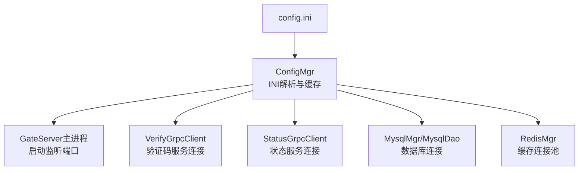
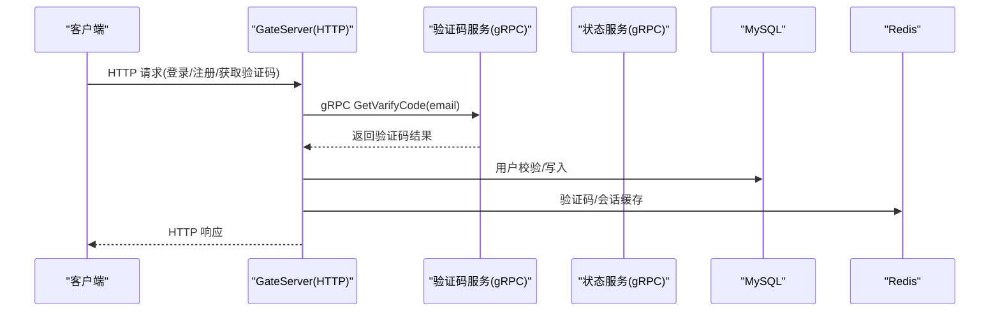
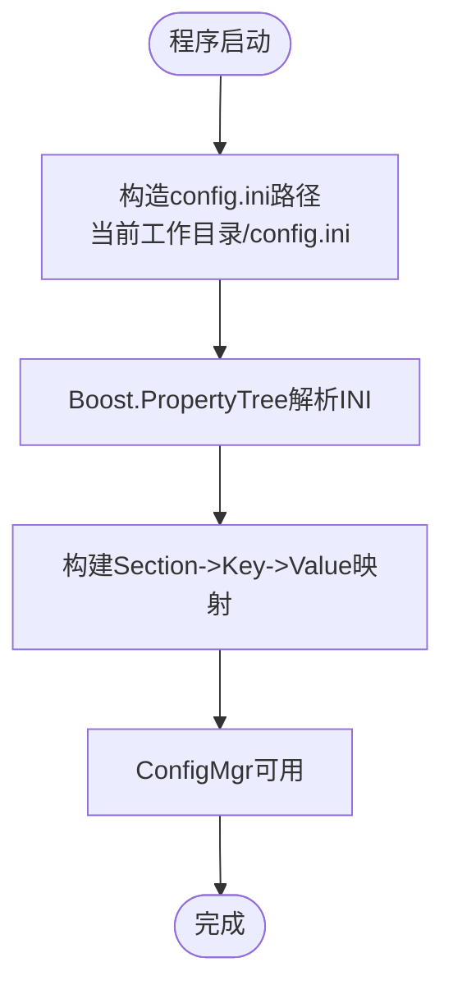
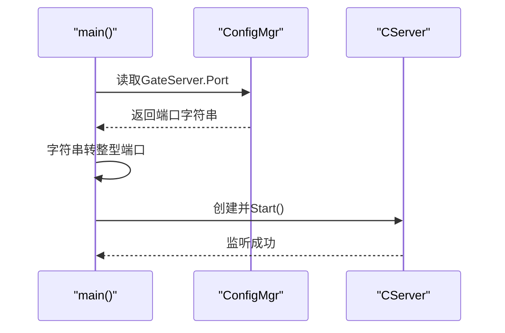
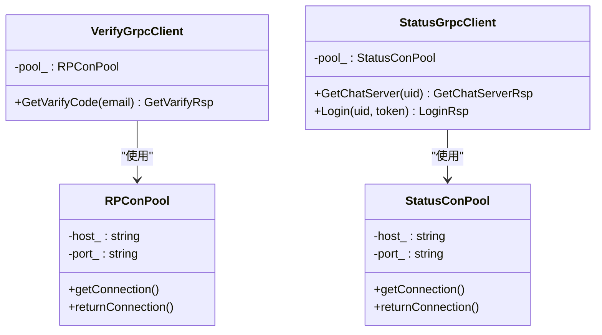
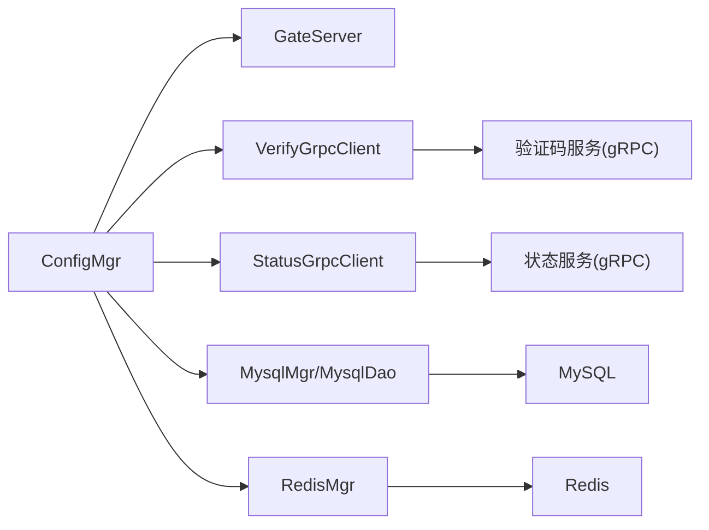

# GateServer网关配置

<cite>
**本文引用的文件**   
- [server/GateServer/config/config.ini](file://server/GateServer/config/config.ini)
- [server/GateServer/include/ConfigMgr.h](file://server/GateServer/include/ConfigMgr.h)
- [server/GateServer/src/ConfigMgr.cpp](file://server/GateServer/src/ConfigMgr.cpp)
- [server/GateServer/src/GateServer.cpp](file://server/GateServer/src/GateServer.cpp)
- [server/GateServer/include/VerifyGrpcClient.h](file://server/GateServer/include/VerifyGrpcClient.h)
- [server/GateServer/include/StatusGrpcClient.h](file://server/GateServer/include/StatusGrpcClient.h)
</cite>

## 目录
1. [简介](#简介)
2. [项目结构](#项目结构)
3. [核心组件](#核心组件)
4. [架构总览](#架构总览)
5. [详细组件分析](#详细组件分析)
6. [依赖关系分析](#依赖关系分析)
7. [性能考虑](#性能考虑)
8. [故障排查指南](#故障排查指南)
9. [结论](#结论)
10. [附录](#附录)

## 简介
本文件为 GateServer 网关服务的配置文档，聚焦于配置文件 config.ini 的结构与参数说明。内容涵盖端口、验证码服务（VarifyServer）、状态服务（StatusServer）、MySQL、Redis、资源服务（ResServer）等配置项的作用、默认值、取值范围与示例；并给出开发环境与生产环境的差异建议、完整模板、配置验证方法与常见错误排查。

## 项目结构
GateServer 的配置由 INI 文件提供，运行时通过 ConfigMgr 读取并缓存到内存中，供 HTTP 服务、RPC 客户端、数据库与缓存模块使用。



图示来源 
- [server/GateServer/config/config.ini:1-25](file://server/GateServer/config/config.ini#L1-L25)
- [server/GateServer/src/ConfigMgr.cpp:1-50](file://server/GateServer/src/ConfigMgr.cpp#L1-L50)
- [server/GateServer/src/GateServer.cpp:128-158](file://server/GateServer/src/GateServer.cpp#L128-L158)
- [server/GateServer/include/VerifyGrpcClient.h:1-113](file://server/GateServer/include/VerifyGrpcClient.h#L1-L113)
- [server/GateServer/include/StatusGrpcClient.h:1-98](file://server/GateServer/include/StatusGrpcClient.h#L1-L98)

章节来源
- [server/GateServer/config/config.ini:1-25](file://server/GateServer/config/config.ini#L1-L25)
- [server/GateServer/src/ConfigMgr.cpp:1-50](file://server/GateServer/src/ConfigMgr.cpp#L1-L50)
- [server/GateServer/src/GateServer.cpp:128-158](file://server/GateServer/src/GateServer.cpp#L128-L158)

## 核心组件
- 配置文件：config.ini，位于 GateServer 工作目录下，包含各子系统连接信息。
- 配置管理器：ConfigMgr，负责加载 INI 文件并暴露按 Section 和 Key 的查询接口。
- 运行入口：GateServer.cpp 在启动时读取 Port 并启动 HTTP 监听。
- RPC 客户端：VerifyGrpcClient、StatusGrpcClient 根据配置连接验证码与状态服务。
- 数据访问：MysqlMgr/MysqlDao 与 RedisMgr 根据配置建立连接与连接池。

章节来源
- [server/GateServer/include/ConfigMgr.h:1-84](file://server/GateServer/include/ConfigMgr.h#L1-L84)
- [server/GateServer/src/ConfigMgr.cpp:1-50](file://server/GateServer/src/ConfigMgr.cpp#L1-L50)
- [server/GateServer/src/GateServer.cpp:128-158](file://server/GateServer/src/GateServer.cpp#L128-L158)
- [server/GateServer/include/VerifyGrpcClient.h:1-113](file://server/GateServer/include/VerifyGrpcClient.h#L1-L113)
- [server/GateServer/include/StatusGrpcClient.h:1-98](file://server/GateServer/include/StatusGrpcClient.h#L1-L98)

## 架构总览
GateServer 作为网关，统一对外暴露 HTTP 接口，内部通过 gRPC 调用验证码与状态服务，并通过 MySQL/Redis 进行持久化与缓存。



图示来源 
- [server/GateServer/src/GateServer.cpp:128-158](file://server/GateServer/src/GateServer.cpp#L128-L158)
- [server/GateServer/include/VerifyGrpcClient.h:80-113](file://server/GateServer/include/VerifyGrpcClient.h#L80-L113)
- [server/GateServer/include/StatusGrpcClient.h:81-98](file://server/GateServer/include/StatusGrpcClient.h#L81-L98)

## 详细组件分析

### 配置文件结构与参数说明
config.ini 采用标准 INI 格式，包含以下 Section 与 Key：

- [GateServer]
  - Port：HTTP 监听端口
    - 作用：GateServer 对外暴露的 HTTP 服务端口
    - 默认值：8080
    - 取值范围：1-65535（建议使用 >1024 的非特权端口）
    - 示例：Port = 8080
- [VarifyServer]
  - Host：验证码服务地址
    - 作用：gRPC 客户端连接的验证码服务主机名或IP
    - 默认值：127.0.0.1
    - 取值范围：合法主机名或IPv4/IPv6地址
    - 示例：Host = 127.0.0.1
  - Port：验证码服务端口
    - 作用：gRPC 服务端口
    - 默认值：50051
    - 取值范围：1-65535
    - 示例：Port = 50051
- [StatusServer]
  - Host：状态服务地址
    - 作用：gRPC 客户端连接的状态服务主机名或IP
    - 默认值：127.0.0.1
    - 取值范围：合法主机名或IPv4/IPv6地址
    - 示例：Host = 127.0.0.1
  - Port：状态服务端口
    - 作用：gRPC 服务端口
    - 默认值：50052
    - 取值范围：1-65535
    - 示例：Port = 50052
- [Mysql]
  - Host：MySQL 主机
    - 默认值：127.0.0.1
    - 示例：Host = 127.0.0.1
  - Port：MySQL 端口
    - 默认值：3308
    - 示例：Port = 3308
  - User：数据库用户名
    - 默认值：root
    - 示例：User = root
  - Passwd：数据库密码
    - 默认值：123456.
    - 示例：Passwd = 123456.
  - Schema：数据库名称
    - 默认值：llfc
    - 示例：Schema = llfc
- [Redis]
  - Host：Redis 主机
    - 默认值：127.0.0.1
    - 示例：Host = 127.0.0.1
  - Port：Redis 端口
    - 默认值：6380
    - 示例：Port = 6380
  - Passwd：Redis 认证密码
    - 默认值：123456
    - 示例：Passwd = 123456
- [ResServer]
  - Name：资源服务标识名
    - 作用：用于服务发现或路由识别
    - 默认值：reserver
    - 示例：Name = reserver
  - Host：资源服务主机
    - 默认值：127.0.0.1
    - 示例：Host = 127.0.0.1
  - Port：资源服务HTTP端口
    - 默认值：9090
    - 示例：Port = 9090
  - RPCPort：资源服务RPC端口
    - 默认值：51055
    - 示例：RPCPort = 51055

章节来源
- [server/GateServer/config/config.ini:1-25](file://server/GateServer/config/config.ini#L1-L25)

### 配置加载机制
- 加载路径：程序从当前工作目录读取 config.ini
- 解析方式：使用 Boost.PropertyTree 解析 INI
- 存储结构：Section -> Key -> Value 的映射，支持按 Section 与 Key 查询
- 异常处理：缺失 Section/Key 时返回空字符串



图示来源 
- [server/GateServer/src/ConfigMgr.cpp:1-50](file://server/GateServer/src/ConfigMgr.cpp#L1-L50)

章节来源
- [server/GateServer/src/ConfigMgr.cpp:1-50](file://server/GateServer/src/ConfigMgr.cpp#L1-L50)
- [server/GateServer/include/ConfigMgr.h:1-84](file://server/GateServer/include/ConfigMgr.h#L1-L84)

### 启动流程与端口读取
- GateServer 启动时通过 ConfigMgr 读取 GateServer.Port
- 将字符串转换为整型端口号并启动 HTTP 监听
- 初始化 Redis、MySQL 等依赖组件



图示来源 
- [server/GateServer/src/GateServer.cpp:128-158](file://server/GateServer/src/GateServer.cpp#L128-L158)

章节来源
- [server/GateServer/src/GateServer.cpp:128-158](file://server/GateServer/src/GateServer.cpp#L128-L158)

### gRPC 客户端与配置关联
- VerifyGrpcClient：根据 VarifyServer.Host 与 Port 创建 gRPC Channel
- StatusGrpcClient：根据 StatusServer.Host 与 Port 创建 gRPC Channel
- 两者均使用连接池管理 Stub，提高并发能力



图示来源 
- [server/GateServer/include/VerifyGrpcClient.h:1-113](file://server/GateServer/include/VerifyGrpcClient.h#L1-L113)
- [server/GateServer/include/StatusGrpcClient.h:1-98](file://server/GateServer/include/StatusGrpcClient.h#L1-L98)

章节来源
- [server/GateServer/include/VerifyGrpcClient.h:1-113](file://server/GateServer/include/VerifyGrpcClient.h#L1-L113)
- [server/GateServer/include/StatusGrpcClient.h:1-98](file://server/GateServer/include/StatusGrpcClient.h#L1-L98)

### 数据库与缓存配置
- MySQL：通过 MysqlMgr/MysqlDao 使用 Host、Port、User、Passwd、Schema
- Redis：通过 RedisMgr 使用 Host、Port、Passwd，并维护连接池与健康检查

章节来源
- [server/GateServer/config/config.ini:1-25](file://server/GateServer/config/config.ini#L1-L25)

## 依赖关系分析
- 配置依赖：GateServer、VerifyGrpcClient、StatusGrpcClient、MysqlMgr、RedisMgr 均依赖 ConfigMgr 提供的配置
- 外部依赖：gRPC 服务（验证码、状态）、MySQL、Redis
- 潜在循环依赖：无直接循环，均为单向依赖



图示来源 
- [server/GateServer/src/ConfigMgr.cpp:1-50](file://server/GateServer/src/ConfigMgr.cpp#L1-L50)
- [server/GateServer/include/VerifyGrpcClient.h:1-113](file://server/GateServer/include/VerifyGrpcClient.h#L1-L113)
- [server/GateServer/include/StatusGrpcClient.h:1-98](file://server/GateServer/include/StatusGrpcClient.h#L1-L98)

章节来源
- [server/GateServer/src/ConfigMgr.cpp:1-50](file://server/GateServer/src/ConfigMgr.cpp#L1-L50)

## 性能考虑
- 端口选择：避免与系统服务冲突，优先选择高位端口
- gRPC 连接池：Verify/Status 客户端已实现连接池，合理设置池大小可提升吞吐
- Redis 连接池：内置健康检查与自动重连，确保高可用
- MySQL 连接：建议配合连接池与超时策略，避免阻塞

[本节为通用指导，不直接分析具体文件]

## 故障排查指南
- 配置文件路径问题
  - 现象：无法读取 config.ini
  - 排查：确认程序工作目录存在 config.ini；查看日志中的“Config path”输出
  - 参考：ConfigMgr 构造器打印路径与解析过程
- 端口占用或权限不足
  - 现象：启动失败或监听失败
  - 排查：检查端口是否被占用；非特权端口需 >1024
  - 参考：GateServer 启动时读取 Port 并监听
- gRPC 连接失败
  - 现象：验证码或状态服务调用失败
  - 排查：核对 VarifyServer/StatusServer 的 Host 与 Port；确认服务已启动且网络可达
  - 参考：VerifyGrpcClient/StatusGrpcClient 的连接池与通道创建
- 数据库连接失败
  - 现象：MySQL 操作报错
  - 排查：核对 Mysql 的 Host、Port、User、Passwd、Schema；确认数据库服务与权限
- Redis 认证失败或连接断开
  - 现象：Redis 命令执行失败或连接池健康检查失败
  - 排查：核对 Redis 的 Host、Port、Passwd；确认服务运行与防火墙规则
  - 参考：RedisMgr 连接池 AUTH 与 PING 健康检查逻辑

章节来源
- [server/GateServer/src/ConfigMgr.cpp:1-50](file://server/GateServer/src/ConfigMgr.cpp#L1-L50)
- [server/GateServer/src/GateServer.cpp:128-158](file://server/GateServer/src/GateServer.cpp#L128-L158)
- [server/GateServer/include/VerifyGrpcClient.h:1-113](file://server/GateServer/include/VerifyGrpcClient.h#L1-L113)
- [server/GateServer/include/StatusGrpcClient.h:1-98](file://server/GateServer/include/StatusGrpcClient.h#L1-L98)

## 结论
GateServer 的配置以 config.ini 为中心，通过 ConfigMgr 集中加载并提供给各子系统使用。正确配置端口、gRPC 服务地址、数据库与缓存信息是保障服务稳定运行的关键。建议在开发与生产环境分别维护独立的配置文件，严格区分敏感信息与网络拓扑。

[本节为总结性内容，不直接分析具体文件]

## 附录

### 完整配置文件模板
以下为基于现有仓库内容的完整模板，可直接复制并根据实际环境修改：

```ini
[GateServer]
Port = 8080

[VarifyServer]
Host = 127.0.0.1
Port = 50051

[StatusServer]
Host = 127.0.0.1
Port = 50052

[Mysql]
Host = 127.0.0.1
Port = 3308
User = root
Passwd = 123456.
Schema = llfc

[Redis]
Host = 127.0.0.1
Port = 6380
Passwd = 123456

[ResServer]
Name = reserver
Host = 127.0.0.1
Port = 9090
RPCPort = 51055
```

章节来源
- [server/GateServer/config/config.ini:1-25](file://server/GateServer/config/config.ini#L1-L25)

### 开发环境与生产环境配置差异建议
- 开发环境
  - 所有服务部署在本机（127.0.0.1），端口使用本地测试端口
  - 数据库与缓存可使用默认或简单密码
  - 便于快速调试与重启
- 生产环境
  - 服务分离部署，使用内网 IP 或域名
  - 强密码与最小权限原则（数据库、Redis）
  - 合理设置端口与防火墙策略
  - 监控与告警接入，关注连接池与重试指标

[本节为通用指导，不直接分析具体文件]

### 配置验证方法
- 启动前自检
  - 确认 config.ini 存在于工作目录
  - 检查端口未被占用（如 netstat 或 lsof）
  - 校验 gRPC 服务可达（telnet/curl/grpc_health_probe）
- 启动后验证
  - 观察 GateServer 监听端口是否正常
  - 尝试调用验证码与状态服务接口
  - 执行简单的 MySQL/Redis 操作验证连通性

[本节为通用指导，不直接分析具体文件]