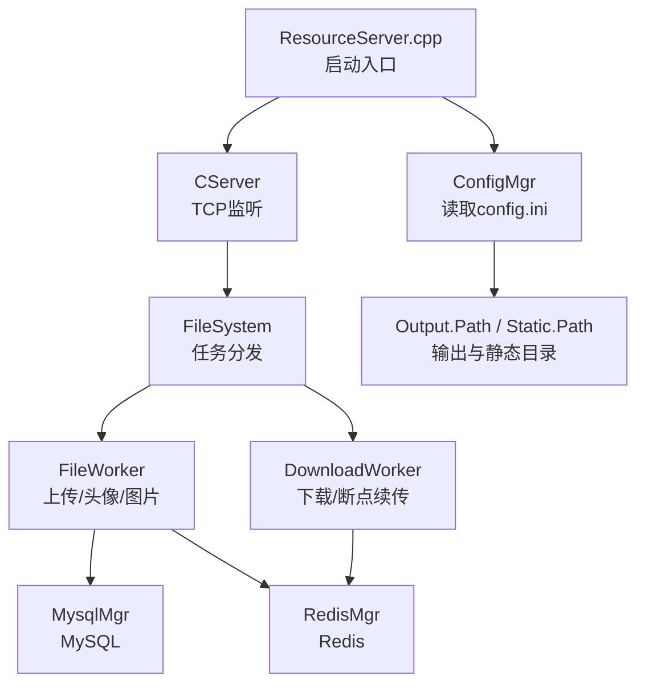
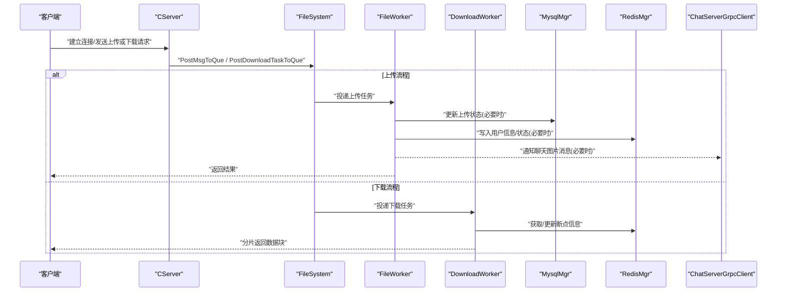
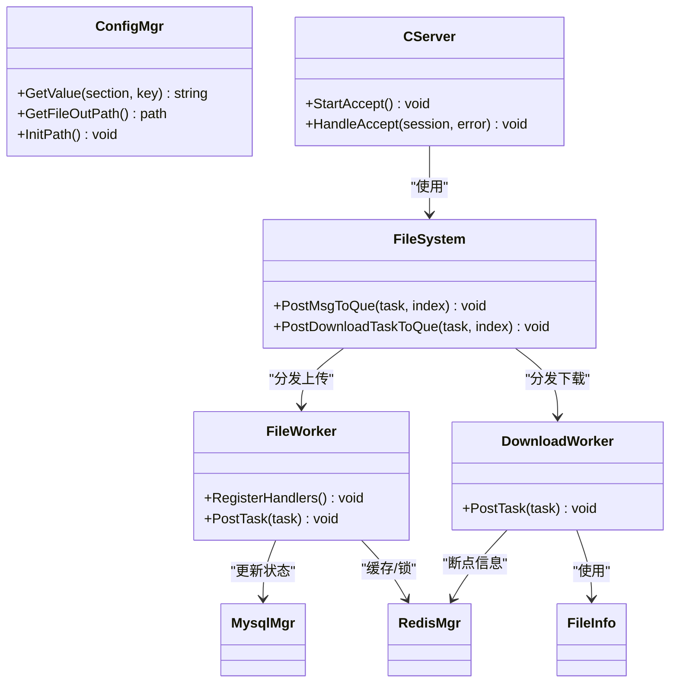

# ResourceServer资源服务配置

<cite>
**本文引用的文件**   
- [server\ResourceServer\config\config.ini](file://server/ResourceServer/config/config.ini)
- [server\ResourceServer\include\ConfigMgr.h](file://server/ResourceServer/include/ConfigMgr.h)
- [server\ResourceServer\src\ConfigMgr.cpp](file://server/ResourceServer/src/ConfigMgr.cpp)
- [server\ResourceServer\include\const.h](file://server/ResourceServer/include/const.h)
- [server\ResourceServer\include\FileWorker.h](file://server/ResourceServer/include/FileWorker.h)
- [server\ResourceServer\src\FileWorker.cpp](file://server/ResourceServer/src/FileWorker.cpp)
- [server\ResourceServer\include\FileSystem.h](file://server/ResourceServer/include/FileSystem.h)
- [server\ResourceServer\src\FileSystem.cpp](file://server/ResourceServer/src/FileSystem.cpp)
- [server\ResourceServer\include\CServer.h](file://server/ResourceServer/include/CServer.h)
- [server\ResourceServer\src\CServer.cpp](file://server/ResourceServer/src/CServer.cpp)
- [server\ResourceServer\src\ResourceServer.cpp](file://server/ResourceServer/src/ResourceServer.cpp)
- [server\ResourceServer\include\MysqlMgr.h](file://server/ResourceServer/include/MysqlMgr.h)
- [server\ResourceServer\include\RedisMgr.h](file://server/ResourceServer/include/RedisMgr.h)
- [server\ResourceServer\include\FileInfo.h](file://server/ResourceServer/include/FileInfo.h)
</cite>

## 目录
1. [简介](#简介)
2. [项目结构](#项目结构)
3. [核心组件](#核心组件)
4. [架构总览](#架构总览)
5. [详细组件分析](#详细组件分析)
6. [依赖关系分析](#依赖关系分析)
7. [性能与优化](#性能与优化)
8. [故障排查指南](#故障排查指南)
9. [结论](#结论)
10. [附录：配置项速查表](#附录配置项速查表)

## 简介
本文件为 ResourceServer 资源存储服务的配置文档，聚焦于 config.ini 的结构与参数含义，覆盖文件存储路径、HTTP/gRPC 端口（如适用）、数据库连接、Redis 缓存、并发工作线程、分片与断点续传、大文件优化、分布式扩展与监控清理等。读者可据此完成本地部署、生产调优与问题定位。

## 项目结构
ResourceServer 的配置文件位于 server/ResourceServer/config/config.ini，运行时由 ConfigMgr 加载并解析；网络监听由 CServer 负责；文件上传/下载由 FileWorker/DownloadWorker 处理；持久化通过 MysqlMgr/RedisMgr 访问 MySQL 与 Redis；启动入口在 ResourceServer.cpp。

图表来源 
- [server\ResourceServer\src\ResourceServer.cpp:15-41](file://server/ResourceServer/src/ResourceServer.cpp#L15-L41)
- [server\ResourceServer\include\CServer.h:1-25](file://server/ResourceServer/include/CServer.h#L1-L25)
- [server\ResourceServer\src\CServer.cpp:1-49](file://server/ResourceServer/src/CServer.cpp#L1-L49)
- [server\ResourceServer\include\ConfigMgr.h:1-90](file://server/ResourceServer/include/ConfigMgr.h#L1-L90)
- [server\ResourceServer\src\ConfigMgr.cpp:1-83](file://server/ResourceServer/src/ConfigMgr.cpp#L1-L83)
- [server\ResourceServer\include\FileSystem.h:1-21](file://server/ResourceServer/include/FileSystem.h#L1-L21)
- [server\ResourceServer\src\FileSystem.cpp:1-29](file://server/ResourceServer/src/FileSystem.cpp#L1-L29)
- [server\ResourceServer\include\FileWorker.h:1-91](file://server/ResourceServer/include/FileWorker.h#L1-L91)
- [server\ResourceServer\src\FileWorker.cpp:1-660](file://server/ResourceServer/src/FileWorker.cpp#L1-L660)
- [server\ResourceServer\include\MysqlMgr.h:1-44](file://server/ResourceServer/include/MysqlMgr.h#L1-L44)
- [server\ResourceServer\include\RedisMgr.h:1-313](file://server/ResourceServer/include/RedisMgr.h#L1-L313)

章节来源
- [server\ResourceServer\src\ResourceServer.cpp:15-41](file://server/ResourceServer/src/ResourceServer.cpp#L15-L41)
- [server\ResourceServer\include\CServer.h:1-25](file://server/ResourceServer/include/CServer.h#L1-L25)
- [server\ResourceServer\src\CServer.cpp:1-49](file://server/ResourceServer/src/CServer.cpp#L1-L49)
- [server\ResourceServer\include\ConfigMgr.h:1-90](file://server/ResourceServer/include/ConfigMgr.h#L1-L90)
- [server\ResourceServer\src\ConfigMgr.cpp:1-83](file://server/ResourceServer/src/ConfigMgr.cpp#L1-L83)
- [server\ResourceServer\include\FileSystem.h:1-21](file://server/ResourceServer/include/FileSystem.h#L1-L21)
- [server\ResourceServer\src\FileSystem.cpp:1-29](file://server/ResourceServer/src/FileSystem.cpp#L1-L29)
- [server\ResourceServer\include\FileWorker.h:1-91](file://server/ResourceServer/include/FileWorker.h#L1-L91)
- [server\ResourceServer\src\FileWorker.cpp:1-660](file://server/ResourceServer/src/FileWorker.cpp#L1-L660)
- [server\ResourceServer\include\MysqlMgr.h:1-44](file://server/ResourceServer/include/MysqlMgr.h#L1-L44)
- [server\ResourceServer\include\RedisMgr.h:1-313](file://server/ResourceServer/include/RedisMgr.h#L1-L313)

## 核心组件
- 配置管理 ConfigMgr：从当前工作目录加载 config.ini，提供按 Section/Key 取值能力，并初始化输出与静态目录路径。
- 网络服务 CServer：基于 Boost.Asio 的 TCP 服务器，监听 SelfServer.Port。
- 文件系统 FileSystem：维护多组 FileWorker/DownloadWorker，按索引分发任务。
- 文件工作者 FileWorker/DownloadWorker：实现上传、头像更新、聊天图片上传、信息同步、续传、下载与断点续传。
- 数据层 MysqlMgr/RedisMgr：封装 MySQL/Redis 操作，含连接池、健康检查、分布式锁与下载进度缓存。
- 数据结构 FileInfo/ChatImgInfo：描述文件元信息与聊天图片信息。

章节来源
- [server\ResourceServer\include\ConfigMgr.h:1-90](file://server/ResourceServer/include/ConfigMgr.h#L1-L90)
- [server\ResourceServer\src\ConfigMgr.cpp:1-83](file://server/ResourceServer/src/ConfigMgr.cpp#L1-L83)
- [server\ResourceServer\include\CServer.h:1-25](file://server/ResourceServer/include/CServer.h#L1-L25)
- [server\ResourceServer\src\CServer.cpp:1-49](file://server/ResourceServer/src/CServer.cpp#L1-L49)
- [server\ResourceServer\include\FileSystem.h:1-21](file://server/ResourceServer/include/FileSystem.h#L1-L21)
- [server\ResourceServer\src\FileSystem.cpp:1-29](file://server/ResourceServer/src/FileSystem.cpp#L1-L29)
- [server\ResourceServer\include\FileWorker.h:1-91](file://server/ResourceServer/include/FileWorker.h#L1-L91)
- [server\ResourceServer\src\FileWorker.cpp:1-660](file://server/ResourceServer/src/FileWorker.cpp#L1-L660)
- [server\ResourceServer\include\MysqlMgr.h:1-44](file://server/ResourceServer/include/MysqlMgr.h#L1-L44)
- [server\ResourceServer\include\RedisMgr.h:1-313](file://server/ResourceServer/include/RedisMgr.h#L1-L313)
- [server\ResourceServer\include\FileInfo.h:1-26](file://server/ResourceServer/include/FileInfo.h#L1-L26)

## 架构总览
ResourceServer 以 TCP 协议对外提供服务，接收上传/下载请求后，将任务投递到对应 Worker 队列中异步处理；上传完成后可能更新 MySQL 状态并通过 gRPC 通知 ChatServer；下载过程使用 Redis 缓存断点信息以实现断点续传。

图表来源 
- [server\ResourceServer\src\CServer.cpp:1-49](file://server/ResourceServer/src/CServer.cpp#L1-L49)
- [server\ResourceServer\include\FileSystem.h:1-21](file://server/ResourceServer/include/FileSystem.h#L1-L21)
- [server\ResourceServer\src\FileSystem.cpp:1-29](file://server/ResourceServer/src/FileSystem.cpp#L1-L29)
- [server\ResourceServer\include\FileWorker.h:1-91](file://server/ResourceServer/include/FileWorker.h#L1-L91)
- [server\ResourceServer\src\FileWorker.cpp:1-660](file://server/ResourceServer/src/FileWorker.cpp#L1-L660)
- [server\ResourceServer\include\MysqlMgr.h:1-44](file://server/ResourceServer/include/MysqlMgr.h#L1-L44)
- [server\ResourceServer\include\RedisMgr.h:1-313](file://server/ResourceServer/include/RedisMgr.h#L1-L313)

## 详细组件分析

### 配置文件结构与参数说明
- 文件位置：server/ResourceServer/config/config.ini
- 主要 Section：
  - SelfServer：服务自身标识与监听端口
    - Name：服务名称
    - Host：监听地址（示例为 0.0.0.0）
    - Port：TCP 监听端口（示例为 9090）
  - Mysql：MySQL 连接参数
    - Host、Port、User、Passwd、Schema
  - Redis：Redis 连接参数
    - Host、Port、Passwd
  - Output：二进制输出目录相对路径（默认 bin）
  - Static：静态文件根目录相对路径（默认 static）
  - chatserver1/chatserver2：gRPC 下游服务节点列表（名称、Host、Port），用于通知或调用

注意：
- 当前代码未直接读取 HTTP 端口配置；如需暴露 HTTP 接口，需新增相应配置并在启动时绑定。
- gRPC 端口由 chatserverX 的 Port 指定，供 ResourceServer 作为客户端调用。

章节来源
- [server\ResourceServer\config\config.ini:1-27](file://server/ResourceServer/config/config.ini#L1-L27)
- [server\ResourceServer\src\ResourceServer.cpp:15-41](file://server/ResourceServer/src/ResourceServer.cpp#L15-L41)
- [server\ResourceServer\include\CServer.h:1-25](file://server/ResourceServer/include/CServer.h#L1-L25)
- [server\ResourceServer\src\CServer.cpp:1-49](file://server/ResourceServer/src/CServer.cpp#L1-L49)

### 文件存储路径与目录初始化
- 输出目录与静态目录由 Output.Path 与 Static.Path 组合生成：bin/static
- 启动时若目录不存在则自动创建；路径存在则复用
- 文件实际落盘路径由上传任务中的 path 字段决定，通常位于静态目录下

章节来源
- [server\ResourceServer\src\ConfigMgr.cpp:1-83](file://server/ResourceServer/src/ConfigMgr.cpp#L1-L83)
- [server\ResourceServer\include\ConfigMgr.h:1-90](file://server/ResourceServer/include/ConfigMgr.h#L1-L90)

### 并发上传/下载与工作线程
- FILE_WORKER_COUNT：上传逻辑工作线程数（默认 4）
- DOWN_LOAD_WORKER_COUNT：下载逻辑工作线程数（默认 4）
- FileSystem 构造时创建固定数量的 FileWorker/DownloadWorker，并按 index 路由任务
- 每个 Worker 内部有独立线程与任务队列，保证并发执行

章节来源
- [server\ResourceServer\include\const.h:1-117](file://server/ResourceServer/include/const.h#L1-L117)
- [server\ResourceServer\include\FileSystem.h:1-21](file://server/ResourceServer/include/FileSystem.h#L1-L21)
- [server\ResourceServer\src\FileSystem.cpp:1-29](file://server/ResourceServer/src/FileSystem.cpp#L1-L29)
- [server\ResourceServer\include\FileWorker.h:1-91](file://server/ResourceServer/include/FileWorker.h#L1-L91)
- [server\ResourceServer\src\FileWorker.cpp:1-660](file://server/ResourceServer/src/FileWorker.cpp#L1-L660)

### 分片与断点续传策略
- 分片大小：MAX_FILE_LEN（默认 32KB）
- 上传：
  - seq=1 表示首包，采用截断模式打开文件；后续包追加写入
  - last=1 表示最后一个包，写入完成后触发后续逻辑（如更新状态、通知）
- 下载：
  - 首次下载：计算文件大小，写入 Redis 保存 total_size、seq、trans_size
  - 续传：从 Redis 读取断点信息，校验 seq，按偏移量读取 MAX_FILE_LEN 字节
  - 最后一片：删除 Redis 中的断点信息，避免残留

章节来源
- [server\ResourceServer\include\const.h:1-117](file://server/ResourceServer/include/const.h#L1-L117)
- [server\ResourceServer\src\FileWorker.cpp:1-660](file://server/ResourceServer/src/FileWorker.cpp#L1-L660)
- [server\ResourceServer\include\FileInfo.h:1-26](file://server/ResourceServer/include/FileInfo.h#L1-L26)

### 大文件存储优化
- 内存缓冲：下载读取使用固定大小的 buffer（MAX_FILE_LEN），降低内存占用
- 磁盘 IO：顺序读写 + 追加写，减少随机 IO；首包 trunc，后续 append
- 编码传输：Base64 编解码在网络层传输，便于跨语言与文本通道传输

章节来源
- [server\ResourceServer\src\FileWorker.cpp:1-660](file://server/ResourceServer/src/FileWorker.cpp#L1-L660)
- [server\ResourceServer\include\const.h:1-117](file://server/ResourceServer/include/const.h#L1-L117)

### 分布式文件存储与负载均衡
- 当前实现为单机文件存储，无内置副本与一致性机制
- 可通过多实例部署配合外部负载均衡器（如 Nginx）进行水平扩展
- 建议：
  - 使用共享存储（NFS/S3/OSS）替代本地磁盘，实现多实例一致访问
  - 引入对象存储的分片上传与断点续传能力，提升可靠性
  - 结合 Redis 做全局元数据与分片状态管理

章节来源
- [server\ResourceServer\config\config.ini:1-27](file://server/ResourceServer/config/config.ini#L1-L27)
- [server\ResourceServer\src\FileWorker.cpp:1-660](file://server/ResourceServer/src/FileWorker.cpp#L1-L660)

### 监控与清理策略
- 监控：
  - 日志输出包含关键路径、错误码、进度与状态变更
  - Redis 连接池具备健康检查与自动重连
- 清理：
  - 下载完成后删除 Redis 中的断点信息
  - 头像上传成功后更新用户信息并刷新 Redis 缓存
  - 建议在业务侧增加定时任务清理过期/无效文件与元数据

章节来源
- [server\ResourceServer\src\FileWorker.cpp:1-660](file://server/ResourceServer/src/FileWorker.cpp#L1-L660)
- [server\ResourceServer\include\RedisMgr.h:1-313](file://server/ResourceServer/include/RedisMgr.h#L1-L313)

## 依赖关系分析
- 启动阶段：ResourceServer.cpp 读取 SelfServer.Port 并启动 CServer
- 配置阶段：ConfigMgr 解析 config.ini，初始化路径
- 运行阶段：CServer 接受连接，FileSystem 分发任务至 FileWorker/DownloadWorker
- 数据阶段：FileWorker/DownloadWorker 调用 MysqlMgr/RedisMgr 完成持久化与缓存

图表来源 
- [server\ResourceServer\src\ResourceServer.cpp:15-41](file://server/ResourceServer/src/ResourceServer.cpp#L15-L41)
- [server\ResourceServer\include\ConfigMgr.h:1-90](file://server/ResourceServer/include/ConfigMgr.h#L1-L90)
- [server\ResourceServer\src\ConfigMgr.cpp:1-83](file://server/ResourceServer/src/ConfigMgr.cpp#L1-L83)
- [server\ResourceServer\include\CServer.h:1-25](file://server/ResourceServer/include/CServer.h#L1-L25)
- [server\ResourceServer\src\CServer.cpp:1-49](file://server/ResourceServer/src/CServer.cpp#L1-L49)
- [server\ResourceServer\include\FileSystem.h:1-21](file://server/ResourceServer/include/FileSystem.h#L1-L21)
- [server\ResourceServer\src\FileSystem.cpp:1-29](file://server/ResourceServer/src/FileSystem.cpp#L1-L29)
- [server\ResourceServer\include\FileWorker.h:1-91](file://server/ResourceServer/include/FileWorker.h#L1-L91)
- [server\ResourceServer\src\FileWorker.cpp:1-660](file://server/ResourceServer/src/FileWorker.cpp#L1-L660)
- [server\ResourceServer\include\MysqlMgr.h:1-44](file://server/ResourceServer/include/MysqlMgr.h#L1-L44)
- [server\ResourceServer\include\RedisMgr.h:1-313](file://server/ResourceServer/include/RedisMgr.h#L1-L313)
- [server\ResourceServer\include\FileInfo.h:1-26](file://server/ResourceServer/include/FileInfo.h#L1-L26)

## 性能与优化
- 并发度调整：根据 CPU 核数与 IO 特性调整 FILE_WORKER_COUNT/DOWN_LOAD_WORKER_COUNT
- 分片大小：MAX_FILE_LEN 影响内存与网络开销，可按带宽与延迟调优
- 目录结构：合理划分静态目录层级，减少单目录文件数量，提升文件系统遍历效率
- 缓存策略：利用 Redis 缓存热点用户信息与下载进度，降低数据库压力
- 连接池：确保 Redis 连接池大小与超时设置合理，避免连接耗尽

章节来源
- [server\ResourceServer\include\const.h:1-117](file://server/ResourceServer/include/const.h#L1-L117)
- [server\ResourceServer\include\RedisMgr.h:1-313](file://server/ResourceServer/include/RedisMgr.h#L1-L313)
- [server\ResourceServer\src\ConfigMgr.cpp:1-83](file://server/ResourceServer/src/ConfigMgr.cpp#L1-L83)

## 故障排查指南
- 常见错误码：
  - FileWritePermissionFailed：文件写入权限不足
  - FileReadPermissionFailed：文件读取权限不足
  - FileNotExists：文件不存在
  - FileSeqInvalid：序列号不匹配
  - FileOffsetInvalid：偏移量越界
  - FileReadFailed：读取失败
  - RedisReadErr：Redis 读取失败
- 排查步骤：
  - 检查 config.ini 中路径是否正确，确认 bin/static 目录存在且可写
  - 核对上传 seq/last 标志是否符合协议
  - 查看 Redis 连接是否可用，关注连接池健康检查日志
  - 观察下载断点信息是否存在且 seq 一致
  - 检查 MySQL 状态更新是否成功

章节来源
- [server\ResourceServer\include\const.h:1-117](file://server/ResourceServer/include/const.h#L1-L117)
- [server\ResourceServer\src\FileWorker.cpp:1-660](file://server/ResourceServer/src/FileWorker.cpp#L1-L660)
- [server\ResourceServer\include\RedisMgr.h:1-313](file://server/ResourceServer/include/RedisMgr.h#L1-L313)

## 结论
ResourceServer 的配置以 config.ini 为核心，涵盖服务端口、数据存储路径、数据库与缓存连接、以及下游 gRPC 节点。其上传/下载流程通过多线程 Worker 与 Redis 断点缓存实现高并发与断点续传。生产环境建议结合外部负载均衡与对象存储实现分布式与高可用，并完善监控与清理策略。

## 附录：配置项速查表
- SelfServer
  - Name：服务名称
  - Host：监听地址
  - Port：TCP 监听端口
- Mysql
  - Host：MySQL 主机
  - Port：MySQL 端口
  - User：用户名
  - Passwd：密码
  - Schema：数据库名
- Redis
  - Host：Redis 主机
  - Port：Redis 端口
  - Passwd：密码
- Output
  - Path：二进制输出目录（相对路径）
- Static
  - Path：静态文件根目录（相对路径）
- chatserver1/chatserver2
  - Name：服务名称
  - Host：主机地址
  - Port：gRPC 端口

章节来源
- [server\ResourceServer\config\config.ini:1-27](file://server/ResourceServer/config/config.ini#L1-L27)