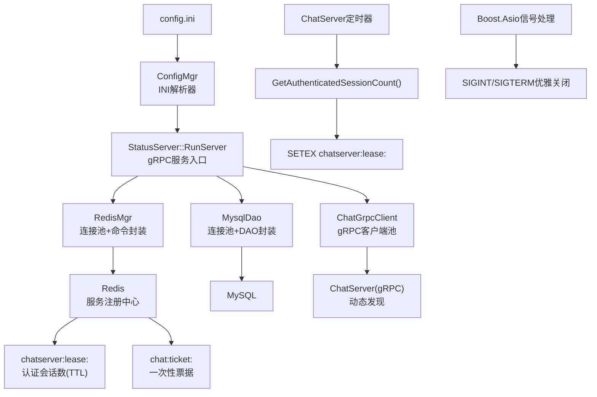
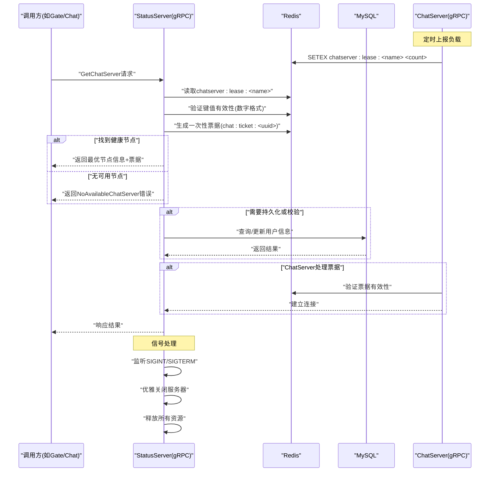
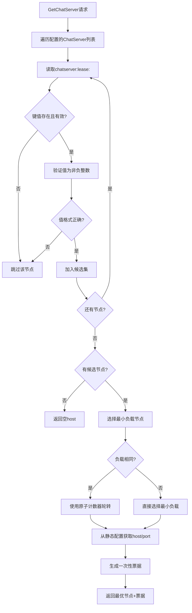
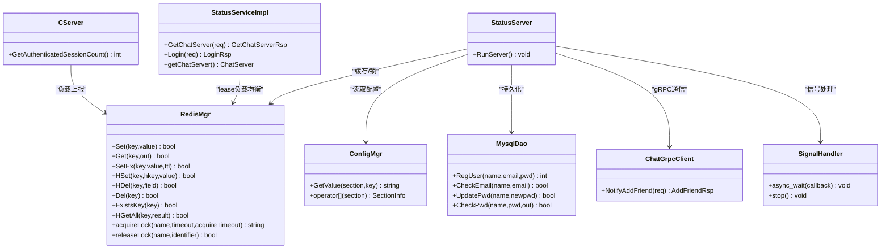

# StatusServer状态服务配置

<cite>
**本文引用的文件**   
- [server/StatusServer/config/config.ini](file://server/StatusServer/config/config.ini)
- [server/common/include/ConfigMgr.h](file://server/common/include/ConfigMgr.h)
- [server/common/src/ConfigMgr.cpp](file://server/common/src/ConfigMgr.cpp)
- [server/StatusServer/src/StatusServer.cpp](file://server/StatusServer/src/StatusServer.cpp)
- [server/StatusServer/include/RedisMgr.h](file://server/StatusServer/include/RedisMgr.h)
- [server/StatusServer/src/RedisMgr.cpp](file://server/StatusServer/src/RedisMgr.cpp)
- [server/StatusServer/include/MysqlDao.h](file://server/StatusServer/include/MysqlDao.h)
- [server/StatusServer/src/MysqlDao.cpp](file://server/StatusServer/src/MysqlDao.cpp)
- [server/StatusServer/include/ChatGrpcClient.h](file://server/StatusServer/include/ChatGrpcClient.h)
- [server/StatusServer/src/ChatGrpcClient.cpp](file://server/StatusServer/src/ChatGrpcClient.cpp)
- [server/StatusServer/include/StatusServiceImpl.h](file://server/StatusServer/include/StatusServiceImpl.h)
- [server/StatusServer/src/StatusServiceImpl.cpp](file://server/StatusServer/src/StatusServiceImpl.cpp)
- [server/StatusServer/include/const.h](file://server/StatusServer/include/const.h)
- [server/ChatServer/config/chatserver1.ini](file://server/ChatServer/config/chatserver1.ini)
- [server/ChatServer/config/chatserver2.ini](file://server/ChatServer/config/chatserver2.ini)
- [server/ChatServer/src/CServer.cpp](file://server/ChatServer/src/CServer.cpp)
- [server/ChatServer/src/ChatServer.cpp](file://server/ChatServer/src/ChatServer.cpp)
- [开发文档/day35心跳逻辑.md](file://开发文档/day35心跳逻辑.md)
</cite>

## 更新摘要
**变更内容**   
- 为StatusServer的RunServer函数添加了详细的中文注释，包括gRPC服务器初始化、配置管理、信号处理等实现细节
- 增强了服务器启动流程的可读性和可维护性
- 完善了信号处理和优雅关闭机制的文档说明
- 更新了服务器生命周期管理的最佳实践指导

## 目录
1. [简介](#简介)
2. [项目结构](#项目结构)
3. [核心组件](#核心组件)
4. [架构总览](#架构总览)
5. [详细组件分析](#详细组件分析)
6. [依赖关系分析](#依赖关系分析)
7. [性能与优化建议](#性能与优化建议)
8. [高可用与故障转移配置](#高可用与故障转移配置)
9. [监控与调试指南](#监控与调试指南)
10. [结论](#结论)

## 简介
本文件为 StatusServer 状态管理服务的配置与运维指南，围绕 config.ini 的结构与参数、MySQL/Redis 连接配置、ChatServer 通信配置、用户在线状态存储策略、心跳检测间隔、状态同步机制、高可用部署要求以及性能优化与监控调试方法进行系统化说明。读者可据此完成本地开发、测试环境搭建与生产部署配置。

**重大更新** 最新的负载均衡机制完全重构，实现了基于lease的智能负载感知聊天服务器选择，移除了复杂的CHATSERVER_INFO_KEY哈希表和LOGIN_COUNT计数依赖，采用简洁高效的chatserver:lease:<name>键值方案，显著提升了资源利用率和系统性能。**新增** RunServer函数包含详细的中文注释，提供了完整的服务器启动、配置管理和信号处理实现细节。

## 项目结构
StatusServer 使用 INI 配置文件进行运行时参数管理，通过 ConfigMgr 加载并解析；服务启动后基于 gRPC 对外暴露接口，同时通过 Redis 和 MySQL 提供缓存与持久化能力，并通过 gRPC 客户端与 ChatServer 交互。

图示来源
- [server/StatusServer/config/config.ini:1-23](file://server/StatusServer/config/config.ini#L1-L23)
- [server/common/include/ConfigMgr.h:1-81](file://server/common/include/ConfigMgr.h#L1-L81)
- [server/common/src/ConfigMgr.cpp:1-51](file://server/common/src/ConfigMgr.cpp#L1-L51)
- [server/StatusServer/src/StatusServer.cpp:18-72](file://server/StatusServer/src/StatusServer.cpp#L18-L72)
- [server/StatusServer/include/RedisMgr.h:1-59](file://server/StatusServer/include/RedisMgr.h#L1-L59)
- [server/StatusServer/src/RedisMgr.cpp:1-458](file://server/StatusServer/src/RedisMgr.cpp#L1-L458)
- [server/StatusServer/include/MysqlDao.h:1-149](file://server/StatusServer/include/MysqlDao.h#L1-L149)
- [server/StatusServer/src/MysqlDao.cpp:1-172](file://server/StatusServer/src/MysqlDao.cpp#L1-L172)
- [server/StatusServer/include/ChatGrpcClient.h:1-33](file://server/StatusServer/include/ChatGrpcClient.h#L1-L33)
- [server/StatusServer/src/ChatGrpcClient.cpp:1-13](file://server/StatusServer/src/ChatGrpcClient.cpp#L1-L13)
- [server/StatusServer/include/StatusServiceImpl.h:1-51](file://server/StatusServer/include/StatusServiceImpl.h#L1-L51)
- [server/StatusServer/src/StatusServiceImpl.cpp:1-132](file://server/StatusServer/src/StatusServiceImpl.cpp#L1-L132)
- [server/ChatServer/src/ChatServer.cpp:50-69](file://server/ChatServer/src/ChatServer.cpp#L50-L69)
- [server/ChatServer/src/CServer.cpp:75-88](file://server/ChatServer/src/CServer.cpp#L75-L88)

章节来源
- [server/StatusServer/config/config.ini:1-23](file://server/StatusServer/config/config.ini#L1-L23)
- [server/StatusServer/src/StatusServer.cpp:18-72](file://server/StatusServer/src/StatusServer.cpp#L18-L72)

## 核心组件
- 配置管理：ConfigMgr 负责读取工作目录下的 config.ini，按 section/key 组织键值对，供各模块按需获取。
- gRPC 服务：StatusServiceImpl 由 StatusServer 启动，监听 Host:Port，注册服务实现。
- 缓存层：RedisMgr 提供连接池、常用命令封装、分布式锁（acquireLock/releaseLock）等能力。
- 数据层：MysqlDao 提供数据库连接池与 DAO 方法（注册、校验、更新密码等）。
- 通信层：ChatGrpcClient 维护到 ChatServer 的 gRPC 连接池，用于状态同步与业务协作。
- **新增** 基于lease的智能负载均衡：通过Redis的chatserver:lease:<name>键值实现轻量级负载统计和健康检查，支持实时负载感知和自动故障转移。
- **增强** 服务器生命周期管理：RunServer函数包含完整的gRPC服务器初始化、配置管理和信号处理逻辑。

章节来源
- [server/common/include/ConfigMgr.h:1-81](file://server/common/include/ConfigMgr.h#L1-L81)
- [server/common/src/ConfigMgr.cpp:1-51](file://server/common/src/ConfigMgr.cpp#L1-L51)
- [server/StatusServer/src/StatusServer.cpp:18-72](file://server/StatusServer/src/StatusServer.cpp#L18-L72)
- [server/StatusServer/include/RedisMgr.h:1-59](file://server/StatusServer/include/RedisMgr.h#L1-L59)
- [server/StatusServer/src/RedisMgr.cpp:1-458](file://server/StatusServer/src/RedisMgr.cpp#L1-L458)
- [server/StatusServer/include/MysqlDao.h:1-149](file://server/StatusServer/include/MysqlDao.h#L1-L149)
- [server/StatusServer/src/MysqlDao.cpp:1-172](file://server/StatusServer/src/MysqlDao.cpp#L1-L172)
- [server/StatusServer/include/ChatGrpcClient.h:1-33](file://server/StatusServer/include/ChatGrpcClient.h#L1-L33)
- [server/StatusServer/src/ChatGrpcClient.cpp:1-13](file://server/StatusServer/src/ChatGrpcClient.cpp#L1-L13)
- [server/StatusServer/include/StatusServiceImpl.h:1-51](file://server/StatusServer/include/StatusServiceImpl.h#L1-L51)
- [server/StatusServer/src/StatusServiceImpl.cpp:1-132](file://server/StatusServer/src/StatusServiceImpl.cpp#L1-L132)

## 架构总览
StatusServer 作为状态中心，承担以下职责：
- 接收来自 Gate/Chat 等上游服务的状态查询与变更请求（gRPC）。
- 将用户在线会话、登录计数、IP 信息等写入 Redis，保证高性能读写与跨进程共享。
- 在需要时访问 MySQL 进行用户信息持久化与校验。
- 与 ChatServer 通过 gRPC 进行状态同步与事件通知。
- **重大更新** 基于chatserver:lease键值的智能负载均衡和服务发现，根据实时认证会话数选择最优节点。
- **增强** 完善的服务器生命周期管理，包括优雅的信号处理和资源清理。

图示来源
- [server/StatusServer/src/StatusServer.cpp:18-72](file://server/StatusServer/src/StatusServer.cpp#L18-L72)
- [server/StatusServer/src/StatusServiceImpl.cpp:17-42](file://server/StatusServer/src/StatusServiceImpl.cpp#L17-L42)
- [server/StatusServer/src/RedisMgr.cpp:1-458](file://server/StatusServer/src/RedisMgr.cpp#L1-L458)
- [server/StatusServer/src/MysqlDao.cpp:1-172](file://server/StatusServer/src/MysqlDao.cpp#L1-L172)
- [server/StatusServer/include/ChatGrpcClient.h:1-33](file://server/StatusServer/include/ChatGrpcClient.h#L1-L33)
- [server/ChatServer/src/ChatServer.cpp:50-69](file://server/ChatServer/src/ChatServer.cpp#L50-L69)

## 详细组件分析

### 配置文件结构与参数说明
config.ini 是 StatusServer 的唯一配置源，包含以下 section：
- [StatusServer]
  - Port：gRPC 服务监听端口
  - Host：监听地址（通常为 0.0.0.0）
- [Mysql]
  - Host：MySQL 主机地址
  - Port：MySQL 端口
  - User：数据库用户名
  - Passwd：数据库密码
  - Schema：默认数据库名
- [Redis]
  - Host：Redis 主机地址
  - Port：Redis 端口
  - Passwd：Redis 认证密码
- [chatservers]
  - Name：逗号分隔的 ChatServer 名称列表（用于客户端选择或路由）
- [chatserverX]（每个 ChatServer 一个段）
  - Name：服务标识
  - Host：服务主机
  - Port：服务端口

**重大更新** 配置文件中不再需要CHATSERVER_INFO_KEY和LOGIN_COUNT相关的配置，所有负载信息通过Redis的chatserver:lease:<name>键值动态维护，ChatServer通过Discovery配置节设置负载上报间隔和TTL。

章节来源
- [server/StatusServer/config/config.ini:1-23](file://server/StatusServer/config/config.ini#L1-L23)
- [server/ChatServer/config/chatserver1.ini:41-44](file://server/ChatServer/config/chatserver1.ini#L41-L44)
- [server/ChatServer/config/chatserver2.ini:41-44](file://server/ChatServer/config/chatserver2.ini#L41-L44)

### 配置加载机制
- ConfigMgr 在构造时读取当前工作目录下的 config.ini，使用 Boost.PropertyTree 解析为内存中的 section-key-value 映射。
- 提供 GetValue(section, key) 与 operator[key] 两种访问方式。
- 启动时会打印所有已加载的配置项，便于排查。

章节来源
- [server/common/include/ConfigMgr.h:1-81](file://server/common/include/ConfigMgr.h#L1-L81)
- [server/common/src/ConfigMgr.cpp:1-51](file://server/common/src/ConfigMgr.cpp#L1-L51)

### gRPC 服务启动与监听
**更新** StatusServer::RunServer 函数现在包含详细的中文注释，完整展示了gRPC服务器的初始化过程：

- **配置获取**：通过 `ConfigMgr::Inst()` 获取全局配置管理器单例，从配置中读取Host和Port拼接成监听地址。
- **服务实例化**：创建 `StatusServiceImpl` 服务实现类，该实现类负责处理具体的gRPC请求。
- **服务器构建**：使用 `grpc::ServerBuilder` 创建gRPC服务器构建器，绑定监听端口并使用明文传输（InsecureServerCredentials）。
- **服务注册**：通过 `RegisterService(&service)` 注册状态服务实现，使服务器能够处理客户端的状态查询请求。
- **服务器启动**：调用 `BuildAndStart()` 构建并启动gRPC服务器，返回智能指针管理服务器生命周期。
- **日志输出**：打印服务器监听地址，便于确认服务启动成功。

章节来源
- [server/StatusServer/src/StatusServer.cpp:18-42](file://server/StatusServer/src/StatusServer.cpp#L18-L42)

### 信号处理与优雅关闭
**新增** RunServer函数实现了完整的信号处理机制，确保服务的优雅关闭：

- **Asio事件循环**：创建 `boost::asio::io_context` 作为事件循环核心，专门用于监听系统信号。
- **信号集设置**：使用 `boost::asio::signal_set` 捕获 SIGINT（Ctrl+C）和 SIGTERM（终止信号）。
- **异步信号处理**：通过 `async_wait` 注册异步回调，当收到退出信号时执行优雅关闭逻辑。
- **优雅关闭流程**：
  - 调用 `server->Shutdown()` 停止接收新请求并等待正在处理的RPC完成
  - 调用 `io_context.stop()` 停止事件循环，结束信号监听的线程
- **独立线程运行**：将io_context.run()放入独立线程并detach，主线程继续执行服务器等待。
- **阻塞等待**：主线程调用 `server->Wait()` 阻塞直到服务器完全退出。

章节来源
- [server/StatusServer/src/StatusServer.cpp:43-72](file://server/StatusServer/src/StatusServer.cpp#L43-L72)

### Redis 缓存与连接池
- RedisMgr 在构造时从 [Redis] 读取 Host/Port/Passwd，初始化连接池大小（代码中固定为 5）。
- 提供 Set/Get/SetWithExpire/LPush/RPush/HSet/HDel/Del/ExistsKey 等常用操作。
- 内置分布式锁 acquireLock/releaseLock，配合常量 LOCK_TIME_OUT、ACQUIRE_TIME_OUT 控制锁超时与重试。
- 后台健康检查线程定期 PING 连接，失败则重建连接并回写连接池。

章节来源
- [server/StatusServer/include/RedisMgr.h:1-59](file://server/StatusServer/include/RedisMgr.h#L1-L59)
- [server/StatusServer/src/RedisMgr.cpp:1-458](file://server/StatusServer/src/RedisMgr.cpp#L1-L458)
- [server/StatusServer/include/const.h:1-57](file://server/StatusServer/include/const.h#L1-L57)

### MySQL 数据访问与连接池
- MysqlDao 在构造时从 [Mysql] 读取 Host/Port/User/Passwd/Schema，初始化连接池大小（代码中固定为 5）。
- 提供 RegUser/CheckEmail/UpdatePwd/CheckPwd 等方法，内部使用预处理语句与事务安全释放连接。
- 后台线程定期执行 SELECT 1 探测连接存活，异常时重建连接。

章节来源
- [server/StatusServer/include/MysqlDao.h:1-149](file://server/StatusServer/include/MysqlDao.h#L1-L149)
- [server/StatusServer/src/MysqlDao.cpp:1-172](file://server/StatusServer/src/MysqlDao.cpp#L1-L172)

### ChatServer 通信配置与客户端
- ChatGrpcClient 维护多个 ChatServer 的连接池，按 Name 区分不同实例。
- StatusServer 的 [chatservers] 与 [chatserverX] 段用于描述可用的 ChatServer 列表与地址。
- 与 ChatServer 的通信采用 gRPC InsecureChannelCredentials。

章节来源
- [server/StatusServer/include/ChatGrpcClient.h:1-33](file://server/StatusServer/include/ChatGrpcClient.h#L1-L33)
- [server/StatusServer/src/ChatGrpcClient.cpp:1-13](file://server/StatusServer/src/ChatGrpcClient.cpp#L1-L13)
- [server/StatusServer/config/config.ini:14-23](file://server/StatusServer/config/config.ini#L14-L23)

### 基于lease的智能负载均衡机制
**重大更新** StatusServer实现了全新的基于lease的智能负载感知聊天服务器选择机制：

- **负载上报**：ChatServer启动定时器，每report_interval秒（默认5秒）调用`GetAuthenticatedSessionCount()`获取已认证会话数，通过`SETEX chatserver:lease:<server_name> <lease_ttl> <count>`更新负载信息。
- **负载读取**：StatusServer在GetChatServer请求时，遍历配置的ChatServer列表，读取`chatserver:lease:<name>`键值获取认证会话数。
- **健康检查**：通过TTL机制自动剔除不健康的节点，当ChatServer下线时，其lease键会自动过期。
- **负载选择**：选择认证会话数最少的健康节点，如果负载相同则使用原子计数器进行轮转，避免配置首项长期占优。
- **票据机制**：为每次连接分配一次性票据（chat:ticket:<uuid>），有效期60秒，防止重放攻击。

图示来源
- [server/StatusServer/src/StatusServiceImpl.cpp:73-132](file://server/StatusServer/src/StatusServiceImpl.cpp#L73-L132)
- [server/ChatServer/src/ChatServer.cpp:50-69](file://server/ChatServer/src/ChatServer.cpp#L50-L69)
- [server/ChatServer/src/CServer.cpp:75-88](file://server/ChatServer/src/CServer.cpp#L75-L88)

### 用户在线状态存储策略
- 典型 Key 前缀（定义于 const.h）：
  - uip_：用户 IP 绑定
  - utoken_：用户 Token
  - ipcount_：IP 登录计数
  - ubaseinfo_：用户基础信息
  - chat:ticket:*：一次性连接票据
- 在线会话通常以 user_session_id 形式存放，结合分布式锁避免多端冲突。
- 过期清理与心跳联动：当会话过期或断开时，删除对应 session/ipcount 等键。

章节来源
- [server/StatusServer/include/const.h:45-49](file://server/StatusServer/include/const.h#L45-L49)
- [开发文档/day35心跳逻辑.md:28-444](file://开发文档/day35心跳逻辑.md#L28-L444)

### 心跳检测间隔与状态同步
- 心跳阈值与检测周期参考 ChatServer 的心跳实现（示例为 60s 检测，20s 判定过期），StatusServer 侧可通过 Redis 记录登录计数与在线会话。
- 状态同步：当 ChatServer 检测到会话过期或踢人时，会清理 Redis 中的会话与 IP 计数；StatusServer 可在收到相关事件后更新全局状态。
- **重大更新** ChatServer心跳机制：每report_interval秒（默认5秒）发送一次负载信息到Redis的chatserver:lease:<name>键，TTL设置为lease_ttl（默认15秒），确保服务负载状态及时更新。

章节来源
- [开发文档/day35心跳逻辑.md:28-444](file://开发文档/day35心跳逻辑.md#L28-L444)
- [server/StatusServer/include/const.h:51-54](file://server/StatusServer/include/const.h#L51-L54)
- [server/ChatServer/src/ChatServer.cpp:50-69](file://server/ChatServer/src/ChatServer.cpp#L50-L69)

## 依赖关系分析
- StatusServer 依赖 ConfigMgr 读取配置。
- RedisMgr 依赖 hiredis 与分布式锁实现。
- MysqlDao 依赖 MySQL Connector/C++。
- ChatGrpcClient 依赖 gRPC 生成的 Stub。
- **重大更新** StatusServiceImpl 依赖Redis进行基于lease的智能负载均衡和服务发现，不再依赖复杂的哈希表操作。
- **新增** StatusServer依赖Boost.Asio进行信号处理和异步事件管理。

图示来源
- [server/common/include/ConfigMgr.h:1-81](file://server/common/include/ConfigMgr.h#L1-L81)
- [server/StatusServer/include/RedisMgr.h:1-59](file://server/StatusServer/include/RedisMgr.h#L1-L59)
- [server/StatusServer/include/MysqlDao.h:1-149](file://server/StatusServer/include/MysqlDao.h#L1-L149)
- [server/StatusServer/include/ChatGrpcClient.h:1-33](file://server/StatusServer/include/ChatGrpcClient.h#L1-L33)
- [server/StatusServer/include/StatusServiceImpl.h:1-51](file://server/StatusServer/include/StatusServiceImpl.h#L1-L51)
- [server/StatusServer/src/StatusServer.cpp:18-72](file://server/StatusServer/src/StatusServer.cpp#L18-L72)
- [server/ChatServer/src/CServer.cpp:75-88](file://server/ChatServer/src/CServer.cpp#L75-L88)

## 性能与优化建议
- 连接池大小
  - Redis 连接池：当前固定为 5，可根据并发与网络延迟调大至 10~20。
  - MySQL 连接池：当前固定为 5，建议根据 QPS 与慢查询情况调整至 5~10。
- 超时与重试
  - 分布式锁：LOCK_TIME_OUT=10s，ACQUIRE_TIME_OUT=5s，可按业务容忍度调整。
  - gRPC 通道：建议使用超时与重试策略，避免长尾请求阻塞。
  - **重大更新** lease机制：report_interval建议设置为5秒，lease_ttl建议设置为15秒，平衡实时性和性能。
- 健康检查
  - Redis 每 1s 轮询一次，每 60s 触发一次批量 PING 与健康恢复；MySQL 每 60s 探测一次。
  - ChatServer负载上报：每5秒上报一次，TTL为15秒，确保负载状态及时更新。
- 序列化与 IO
  - 减少频繁的小对象分配，尽量复用字符串与缓冲区。
  - 批量操作优先（如 pipeline/hgetall），降低往返次数。
- **重大更新** 负载均衡优化
  - 使用简单的字符串键值替代复杂的哈希表操作，提升性能。
  - 通过TTL机制自动处理节点失效，无需额外的健康检查逻辑。
  - 原子计数器实现公平轮转，避免热点节点问题。
  - 基于实时认证会话数的负载感知，显著提升资源利用率。
- **新增** 服务器性能优化
  - 合理配置gRPC服务器的工作线程数量，避免过多线程导致上下文切换开销。
  - 使用智能指针管理服务器生命周期，避免内存泄漏。
  - 信号处理线程与主线程分离，提高响应性能。

[本节为通用性能建议，不直接分析具体文件]

## 高可用与故障转移配置
- 多 ChatServer 部署
  - 在 [chatservers] 中列出所有 ChatServer 名称，并在各自 [chatserverX] 段配置 Host/Port。
  - ChatServer 之间通过 PeerServer/Servers 互相发现（见 chatserver1.ini 与 chatserver2.ini）。
- 主从与故障转移
  - 当前实现未内置 MySQL/Redis 主从切换逻辑，建议在外部通过代理（如 ProxySQL、Redis Sentinel）实现透明切换。
  - 应用层需具备重连与幂等处理，避免切换期间数据不一致。
- 服务多实例
  - StatusServer 可水平扩展，但需确保 Redis/MySQL 为共享后端；若存在状态分片，需在客户端侧做一致性路由。
- **重大更新** 基于lease的智能故障转移
  - 通过Redis的TTL机制自动剔除故障节点，无需额外的心跳检测逻辑。
  - ChatServer下线时，其lease键自动过期，StatusServer自动选择其他健康节点。
  - 支持从动态发现回退到静态配置的故障恢复机制。
  - 负载均衡算法自动选择认证会话数最少的健康节点。
  - 同负载节点通过原子计数器实现公平轮转，避免单点过载。
- **新增** 优雅关闭与故障恢复
  - 信号处理确保服务在接收到终止信号时能够优雅关闭，避免数据丢失。
  - 服务器重启时自动重新加载配置并恢复服务状态。
  - 异常情况下自动清理临时资源和释放系统资源。

章节来源
- [server/StatusServer/config/config.ini:14-23](file://server/StatusServer/config/config.ini#L14-L23)
- [server/ChatServer/config/chatserver1.ini:25-30](file://server/ChatServer/config/chatserver1.ini#L25-L30)
- [server/ChatServer/config/chatserver2.ini:25-30](file://server/ChatServer/config/chatserver2.ini#L25-L30)
- [server/StatusServer/src/StatusServiceImpl.cpp:73-132](file://server/StatusServer/src/StatusServiceImpl.cpp#L73-L132)
- [server/StatusServer/src/StatusServer.cpp:43-72](file://server/StatusServer/src/StatusServer.cpp#L43-L72)

## 监控与调试指南
- 日志输出
  - ConfigMgr 启动时打印所有 section/key=value，便于核对配置是否加载成功。
  - RedisMgr/MysqlDao 在执行命令失败时输出错误信息，便于定位问题。
  - StatusServiceImpl 在服务发现过程中输出详细的节点选择和健康检查结果。
  - **重大更新** 新增lease相关的调试日志，包括负载上报失败、键值解析错误等信息。
  - **新增** RunServer函数的详细日志输出，包括服务器启动、监听地址、信号处理等关键步骤。
- 关键指标
  - Redis 连接池空闲/活跃数量、PING 失败次数、重连次数。
  - MySQL 连接池占用率、慢查询统计。
  - gRPC 请求成功率与延迟（可在上层埋点）。
  - ChatServer负载上报状态和lease键的有效性。
  - **新增** 监控服务器信号处理状态和资源使用情况。
  - **新增** 监控gRPC服务器的工作线程数量和请求队列长度。
- 常见问题排查
  - 端口冲突：检查 [StatusServer] 的 Host/Port 是否与已有服务冲突。
  - 认证失败：核对 [Redis]/[Mysql] 的 Passwd/User 是否正确。
  - 连接超时：检查防火墙/负载均衡策略，适当增大超时时间。
  - 心跳异常：确认客户端心跳发送频率与服务器阈值匹配。
  - **重大更新** 负载均衡异常：检查Redis中chatserver:lease:<name>键的状态和值格式，确认ChatServer是否正常上报负载。
  - **新增** 服务器启动失败：检查RunServer函数的配置加载和gRPC服务器初始化过程。
  - **新增** 信号处理异常：确认Boost.Asio的事件循环正常运行，信号监听正常。
  - **新增** 优雅关闭问题：检查服务器Shutdown流程和资源清理逻辑。
- **新增** 调试工具和方法
  - 使用gRPC客户端工具测试服务接口可用性。
  - 通过Redis命令行工具检查负载信息和会话状态。
  - 使用系统监控工具观察服务器CPU、内存和网络使用情况。
  - 启用详细日志级别，跟踪服务器启动和运行过程中的关键步骤。

章节来源
- [server/common/src/ConfigMgr.cpp:1-51](file://server/common/src/ConfigMgr.cpp#L1-L51)
- [server/StatusServer/src/RedisMgr.cpp:1-458](file://server/StatusServer/src/RedisMgr.cpp#L1-L458)
- [server/StatusServer/src/MysqlDao.cpp:1-172](file://server/StatusServer/src/MysqlDao.cpp#L1-L172)
- [server/StatusServer/src/StatusServiceImpl.cpp:1-132](file://server/StatusServer/src/StatusServiceImpl.cpp#L1-L132)
- [server/StatusServer/src/StatusServer.cpp:18-72](file://server/StatusServer/src/StatusServer.cpp#L18-L72)

## 结论
StatusServer 的配置以 config.ini 为核心，结合 ConfigMgr 动态加载；通过 Redis 提供高性能状态缓存与分布式锁，通过 MySQL 提供用户信息持久化，通过 gRPC 与 ChatServer 协同完成状态同步。**重大更新** 最新的负载均衡机制完全重构，实现了基于lease的智能负载感知聊天服务器选择，移除了复杂的CHATSERVER_INFO_KEY哈希表和LOGIN_COUNT计数依赖，采用简洁高效的chatserver:lease:<name>键值方案，显著提升了资源利用率和系统性能。**新增** RunServer函数包含详细的中文注释，提供了完整的服务器启动、配置管理和信号处理实现细节，大大提升了代码的可读性和可维护性。

**新特性总结**：
- **简化架构**：移除复杂的哈希表操作，使用简单的字符串键值进行负载统计
- **智能负载均衡**：基于实时认证会话数选择最优节点，支持同负载节点的公平轮转
- **自动故障转移**：通过Redis TTL机制自动处理节点失效，无需额外健康检查
- **安全票据**：一次性连接票据机制防止重放攻击
- **高性能设计**：减少Redis操作复杂度，提升整体系统性能
- **易于监控**：简单的键值结构便于监控和调试
- **实时负载感知**：ChatServer主动上报认证会话数，StatusServer动态选择最优节点
- **完善的服务生命周期管理**：包含详细的gRPC服务器初始化、配置管理和信号处理逻辑
- **优雅的关闭机制**：通过Boost.Asio实现信号处理，确保服务能够优雅关闭并释放资源

在生产环境中，建议合理设置连接池与超时参数，借助外部中间件实现高可用与故障转移，并结合日志与指标进行持续监控与优化。新的lease机制显著提升了系统的可扩展性和可靠性，为大规模分布式部署提供了更好的支持。通过智能负载感知和自动故障转移，系统能够更好地应对流量波动和节点故障，确保服务的稳定性和性能。**新增** 完善的服务器生命周期管理确保了服务的可靠性和可维护性，使得系统在生产环境中更加稳定和易于管理。通过详细的中文注释和完善的错误处理机制，开发者可以更好地理解和维护StatusServer的核心功能。