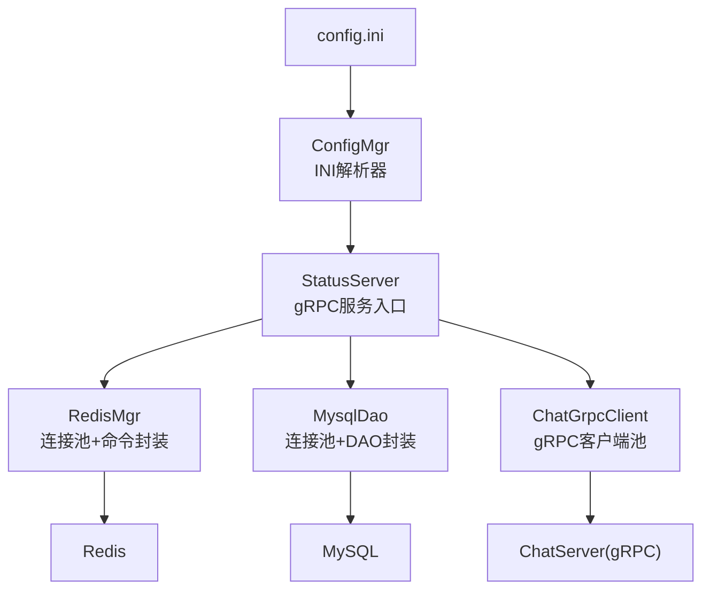
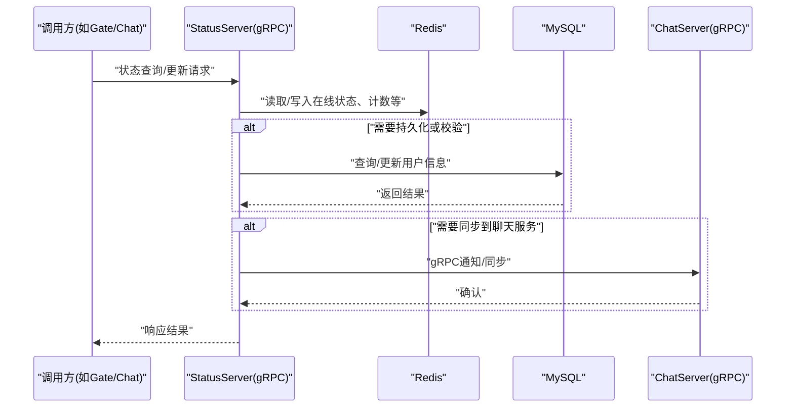
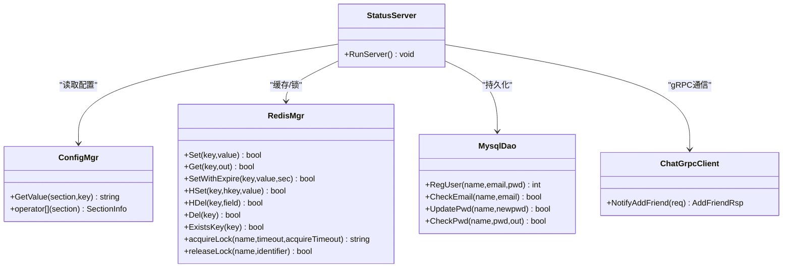

# StatusServer状态服务配置

<cite>
**本文引用的文件**   
- [server/StatusServer/config/config.ini](file://server/StatusServer/config/config.ini)
- [server/StatusServer/include/ConfigMgr.h](file://server/StatusServer/include/ConfigMgr.h)
- [server/StatusServer/src/ConfigMgr.cpp](file://server/StatusServer/src/ConfigMgr.cpp)
- [server/StatusServer/src/StatusServer.cpp](file://server/StatusServer/src/StatusServer.cpp)
- [server/StatusServer/include/RedisMgr.h](file://server/StatusServer/include/RedisMgr.h)
- [server/StatusServer/src/RedisMgr.cpp](file://server/StatusServer/src/RedisMgr.cpp)
- [server/StatusServer/include/MysqlDao.h](file://server/StatusServer/include/MysqlDao.h)
- [server/StatusServer/src/MysqlDao.cpp](file://server/StatusServer/src/MysqlDao.cpp)
- [server/StatusServer/include/ChatGrpcClient.h](file://server/StatusServer/include/ChatGrpcClient.h)
- [server/ChatServer/config/chatserver1.ini](file://server/ChatServer/config/chatserver1.ini)
- [server/ChatServer/config/chatserver2.ini](file://server/ChatServer/config/chatserver2.ini)
- [开发文档/day35心跳逻辑.md](file://开发文档/day35心跳逻辑.md)
</cite>

## 目录
1. [简介](#简介)
2. [项目结构](#项目结构)
3. [核心组件](#核心组件)
4. [架构总览](#架构总览)
5. [详细组件分析](#详细组件分析)
6. [依赖关系分析](#依赖关系分析)
7. [性能与优化建议](#性能与优化建议)
8. [高可用与故障转移配置](#高可用与故障转移配置)
9. [监控与调试指南](#监控与调试指南)
10. [结论](#结论)

## 简介
本文件为 StatusServer 状态管理服务的配置与运维指南，围绕 config.ini 的结构与参数、MySQL/Redis 连接配置、ChatServer 通信配置、用户在线状态存储策略、心跳检测间隔、状态同步机制、高可用部署要求以及性能优化与监控调试方法进行系统化说明。读者可据此完成本地开发、测试环境搭建与生产部署配置。

## 项目结构
StatusServer 使用 INI 配置文件进行运行时参数管理，通过 ConfigMgr 加载并解析；服务启动后基于 gRPC 对外暴露接口，同时通过 Redis 和 MySQL 提供缓存与持久化能力，并通过 gRPC 客户端与 ChatServer 交互。

图示来源
- [server/StatusServer/config/config.ini:1-23](file://server/StatusServer/config/config.ini#L1-L23)
- [server/StatusServer/include/ConfigMgr.h:1-84](file://server/StatusServer/include/ConfigMgr.h#L1-L84)
- [server/StatusServer/src/ConfigMgr.cpp:1-50](file://server/StatusServer/src/ConfigMgr.cpp#L1-L50)
- [server/StatusServer/src/StatusServer.cpp:1-69](file://server/StatusServer/src/StatusServer.cpp#L1-L69)
- [server/StatusServer/include/RedisMgr.h:1-300](file://server/StatusServer/include/RedisMgr.h#L1-L300)
- [server/StatusServer/src/RedisMgr.cpp:1-431](file://server/StatusServer/src/RedisMgr.cpp#L1-L431)
- [server/StatusServer/include/MysqlDao.h:1-149](file://server/StatusServer/include/MysqlDao.h#L1-L149)
- [server/StatusServer/src/MysqlDao.cpp:1-172](file://server/StatusServer/src/MysqlDao.cpp#L1-L172)
- [server/StatusServer/include/ChatGrpcClient.h:1-97](file://server/StatusServer/include/ChatGrpcClient.h#L1-L97)

章节来源
- [server/StatusServer/config/config.ini:1-23](file://server/StatusServer/config/config.ini#L1-L23)
- [server/StatusServer/src/StatusServer.cpp:1-69](file://server/StatusServer/src/StatusServer.cpp#L1-L69)

## 核心组件
- 配置管理：ConfigMgr 负责读取工作目录下的 config.ini，按 section/key 组织键值对，供各模块按需获取。
- gRPC 服务：StatusServiceImpl 由 StatusServer 启动，监听 Host:Port，注册服务实现。
- 缓存层：RedisMgr 提供连接池、常用命令封装、分布式锁（acquireLock/releaseLock）等能力。
- 数据层：MysqlDao 提供数据库连接池与 DAO 方法（注册、校验、更新密码等）。
- 通信层：ChatGrpcClient 维护到 ChatServer 的 gRPC 连接池，用于状态同步与业务协作。

章节来源
- [server/StatusServer/include/ConfigMgr.h:1-84](file://server/StatusServer/include/ConfigMgr.h#L1-L84)
- [server/StatusServer/src/ConfigMgr.cpp:1-50](file://server/StatusServer/src/ConfigMgr.cpp#L1-L50)
- [server/StatusServer/src/StatusServer.cpp:1-69](file://server/StatusServer/src/StatusServer.cpp#L1-L69)
- [server/StatusServer/include/RedisMgr.h:1-300](file://server/StatusServer/include/RedisMgr.h#L1-L300)
- [server/StatusServer/src/RedisMgr.cpp:1-431](file://server/StatusServer/src/RedisMgr.cpp#L1-L431)
- [server/StatusServer/include/MysqlDao.h:1-149](file://server/StatusServer/include/MysqlDao.h#L1-L149)
- [server/StatusServer/src/MysqlDao.cpp:1-172](file://server/StatusServer/src/MysqlDao.cpp#L1-L172)
- [server/StatusServer/include/ChatGrpcClient.h:1-97](file://server/StatusServer/include/ChatGrpcClient.h#L1-L97)

## 架构总览
StatusServer 作为状态中心，承担以下职责：
- 接收来自 Gate/Chat 等上游服务的状态查询与变更请求（gRPC）。
- 将用户在线会话、登录计数、IP 信息等写入 Redis，保证高性能读写与跨进程共享。
- 在需要时访问 MySQL 进行用户信息持久化与校验。
- 与 ChatServer 通过 gRPC 进行状态同步与事件通知。

图示来源
- [server/StatusServer/src/StatusServer.cpp:1-69](file://server/StatusServer/src/StatusServer.cpp#L1-L69)
- [server/StatusServer/src/RedisMgr.cpp:1-431](file://server/StatusServer/src/RedisMgr.cpp#L1-L431)
- [server/StatusServer/src/MysqlDao.cpp:1-172](file://server/StatusServer/src/MysqlDao.cpp#L1-L172)
- [server/StatusServer/include/ChatGrpcClient.h:1-97](file://server/StatusServer/include/ChatGrpcClient.h#L1-L97)

## 详细组件分析

### 配置文件结构与参数说明
config.ini 是 StatusServer 的唯一配置源，包含以下 section：
- [StatusServer]
  - Port：gRPC 服务监听端口
  - Host：监听地址（通常为 0.0.0.0）
- [Mysql]
  - Host：MySQL 主机地址
  - Port：MySQL 端口
  - User：数据库用户名
  - Passwd：数据库密码
  - Schema：默认数据库名
- [Redis]
  - Host：Redis 主机地址
  - Port：Redis 端口
  - Passwd：Redis 认证密码
- [chatservers]
  - Name：逗号分隔的 ChatServer 名称列表（用于客户端选择或路由）
- [chatserverX]（每个 ChatServer 一个段）
  - Name：服务标识
  - Host：服务主机
  - Port：服务端口

章节来源
- [server/StatusServer/config/config.ini:1-23](file://server/StatusServer/config/config.ini#L1-L23)

### 配置加载机制
- ConfigMgr 在构造时读取当前工作目录下的 config.ini，使用 Boost.PropertyTree 解析为内存中的 section-key-value 映射。
- 提供 GetValue(section, key) 与 operator[key] 两种访问方式。
- 启动时会打印所有已加载的配置项，便于排查。

章节来源
- [server/StatusServer/include/ConfigMgr.h:1-84](file://server/StatusServer/include/ConfigMgr.h#L1-L84)
- [server/StatusServer/src/ConfigMgr.cpp:1-50](file://server/StatusServer/src/ConfigMgr.cpp#L1-L50)

### gRPC 服务启动与监听
- StatusServer::RunServer 从 ConfigMgr 读取 Host 与 Port，拼接 server_address。
- 创建 gRPC ServerBuilder，添加监听端口与服务实现，启动等待信号量以优雅关闭。
- 主线程等待服务器退出，异常路径中确保资源释放。

章节来源
- [server/StatusServer/src/StatusServer.cpp:1-69](file://server/StatusServer/src/StatusServer.cpp#L1-L69)

### Redis 缓存与连接池
- RedisMgr 在构造时从 [Redis] 读取 Host/Port/Passwd，初始化连接池大小（代码中固定为 5）。
- 提供 Set/Get/SetWithExpire/LPush/RPush/HSet/HDel/Del/ExistsKey 等常用操作。
- 内置分布式锁 acquireLock/releaseLock，配合常量 LOCK_TIME_OUT、ACQUIRE_TIME_OUT 控制锁超时与重试。
- 后台健康检查线程定期 PING 连接，失败则重建连接并回写连接池。

章节来源
- [server/StatusServer/include/RedisMgr.h:1-300](file://server/StatusServer/include/RedisMgr.h#L1-L300)
- [server/StatusServer/src/RedisMgr.cpp:1-431](file://server/StatusServer/src/RedisMgr.cpp#L1-L431)
- [server/StatusServer/include/const.h:1-75](file://server/StatusServer/include/const.h#L1-L75)

### MySQL 数据访问与连接池
- MysqlDao 在构造时从 [Mysql] 读取 Host/Port/User/Passwd/Schema，初始化连接池大小（代码中固定为 5）。
- 提供 RegUser/CheckEmail/UpdatePwd/CheckPwd 等方法，内部使用预处理语句与事务安全释放连接。
- 后台线程定期执行 SELECT 1 探测连接存活，异常时重建连接。

章节来源
- [server/StatusServer/include/MysqlDao.h:1-149](file://server/StatusServer/include/MysqlDao.h#L1-L149)
- [server/StatusServer/src/MysqlDao.cpp:1-172](file://server/StatusServer/src/MysqlDao.cpp#L1-L172)

### ChatServer 通信配置与客户端
- ChatGrpcClient 维护多个 ChatServer 的连接池，按 Name 区分不同实例。
- StatusServer 的 [chatservers] 与 [chatserverX] 段用于描述可用的 ChatServer 列表与地址。
- 与 ChatServer 的通信采用 gRPC InsecureChannelCredentials。

章节来源
- [server/StatusServer/include/ChatGrpcClient.h:1-97](file://server/StatusServer/include/ChatGrpcClient.h#L1-L97)
- [server/StatusServer/config/config.ini:1-23](file://server/StatusServer/config/config.ini#L1-L23)

### 用户在线状态存储策略
- 典型 Key 前缀（定义于 const.h）：
  - uip_：用户 IP 绑定
  - utoken_：用户 Token
  - ipcount_：IP 登录计数
  - ubaseinfo_：用户基础信息
  - logincount：登录计数（按服务名分片）
- 在线会话通常以 user_session_id 形式存放，结合分布式锁避免多端冲突。
- 过期清理与心跳联动：当会话过期或断开时，删除对应 session/ipcount 等键。

章节来源
- [server/StatusServer/include/const.h:1-75](file://server/StatusServer/include/const.h#L1-L75)
- [开发文档/day35心跳逻辑.md:28-444](file://开发文档/day35心跳逻辑.md#L28-L444)

### 心跳检测间隔与状态同步
- 心跳阈值与检测周期参考 ChatServer 的心跳实现（示例为 60s 检测，20s 判定过期），StatusServer 侧可通过 Redis 记录登录计数与在线会话。
- 状态同步：当 ChatServer 检测到会话过期或踢人时，会清理 Redis 中的会话与 IP 计数；StatusServer 可在收到相关事件后更新全局状态。

章节来源
- [开发文档/day35心跳逻辑.md:28-444](file://开发文档/day35心跳逻辑.md#L28-L444)

## 依赖关系分析
- StatusServer 依赖 ConfigMgr 读取配置。
- RedisMgr 依赖 hiredis 与分布式锁实现。
- MysqlDao 依赖 MySQL Connector/C++。
- ChatGrpcClient 依赖 gRPC 生成的 Stub。

图示来源
- [server/StatusServer/include/ConfigMgr.h:1-84](file://server/StatusServer/include/ConfigMgr.h#L1-L84)
- [server/StatusServer/include/RedisMgr.h:1-300](file://server/StatusServer/include/RedisMgr.h#L1-L300)
- [server/StatusServer/include/MysqlDao.h:1-149](file://server/StatusServer/include/MysqlDao.h#L1-L149)
- [server/StatusServer/include/ChatGrpcClient.h:1-97](file://server/StatusServer/include/ChatGrpcClient.h#L1-L97)
- [server/StatusServer/src/StatusServer.cpp:1-69](file://server/StatusServer/src/StatusServer.cpp#L1-L69)

## 性能与优化建议
- 连接池大小
  - Redis 连接池：当前固定为 5，可根据并发与网络延迟调大至 10~20。
  - MySQL 连接池：当前固定为 5，建议根据 QPS 与慢查询情况调整至 5~10。
- 超时与重试
  - 分布式锁：LOCK_TIME_OUT=10s，ACQUIRE_TIME_OUT=5s，可按业务容忍度调整。
  - gRPC 通道：建议使用超时与重试策略，避免长尾请求阻塞。
- 健康检查
  - Redis 每 1s 轮询一次，每 60s 触发一次批量 PING 与健康恢复；MySQL 每 60s 探测一次。
- 序列化与 IO
  - 减少频繁的小对象分配，尽量复用字符串与缓冲区。
  - 批量操作优先（如 pipeline/hgetall），降低往返次数。

[本节为通用性能建议，不直接分析具体文件]

## 高可用与故障转移配置
- 多 ChatServer 部署
  - 在 [chatservers] 中列出所有 ChatServer 名称，并在各自 [chatserverX] 段配置 Host/Port。
  - ChatServer 之间通过 PeerServer/Servers 互相发现（见 chatserver1.ini 与 chatserver2.ini）。
- 主从与故障转移
  - 当前实现未内置 MySQL/Redis 主从切换逻辑，建议在外部通过代理（如 ProxySQL、Redis Sentinel）实现透明切换。
  - 应用层需具备重连与幂等处理，避免切换期间数据不一致。
- 服务多实例
  - StatusServer 可水平扩展，但需确保 Redis/MySQL 为共享后端；若存在状态分片，需在客户端侧做一致性路由。

章节来源
- [server/StatusServer/config/config.ini:1-23](file://server/StatusServer/config/config.ini#L1-L23)
- [server/ChatServer/config/chatserver1.ini:1-30](file://server/ChatServer/config/chatserver1.ini#L1-L30)
- [server/ChatServer/config/chatserver2.ini:1-30](file://server/ChatServer/config/chatserver2.ini#L1-L30)

## 监控与调试指南
- 日志输出
  - ConfigMgr 启动时打印所有 section/key=value，便于核对配置是否加载成功。
  - RedisMgr/MysqlDao 在执行命令失败时输出错误信息，便于定位问题。
- 关键指标
  - Redis 连接池空闲/活跃数量、PING 失败次数、重连次数。
  - MySQL 连接池占用率、慢查询统计。
  - gRPC 请求成功率与延迟（可在上层埋点）。
- 常见问题排查
  - 端口冲突：检查 [StatusServer] 的 Host/Port 是否与已有服务冲突。
  - 认证失败：核对 [Redis]/[Mysql] 的 Passwd/User 是否正确。
  - 连接超时：检查防火墙/负载均衡策略，适当增大超时时间。
  - 心跳异常：确认客户端心跳发送频率与服务器阈值匹配。

章节来源
- [server/StatusServer/src/ConfigMgr.cpp:1-50](file://server/StatusServer/src/ConfigMgr.cpp#L1-L50)
- [server/StatusServer/src/RedisMgr.cpp:1-431](file://server/StatusServer/src/RedisMgr.cpp#L1-L431)
- [server/StatusServer/src/MysqlDao.cpp:1-172](file://server/StatusServer/src/MysqlDao.cpp#L1-L172)

## 结论
StatusServer 的配置以 config.ini 为核心，结合 ConfigMgr 动态加载；通过 Redis 提供高性能状态缓存与分布式锁，通过 MySQL 提供用户信息持久化，通过 gRPC 与 ChatServer 协同完成状态同步。在生产环境中，建议合理设置连接池与超时参数，借助外部中间件实现高可用与故障转移，并结合日志与指标进行持续监控与优化。