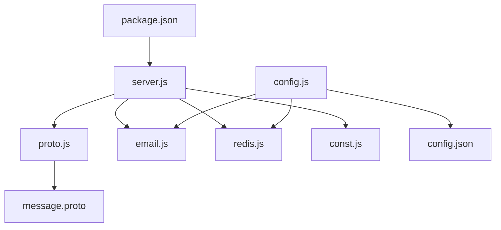
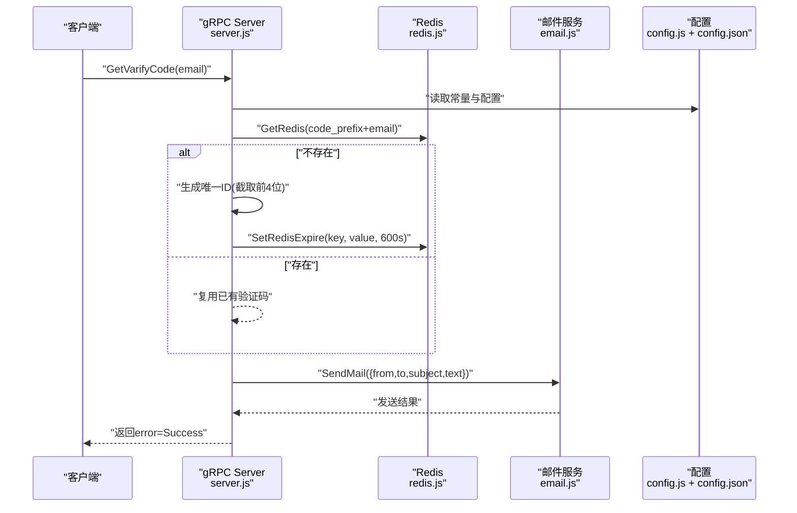
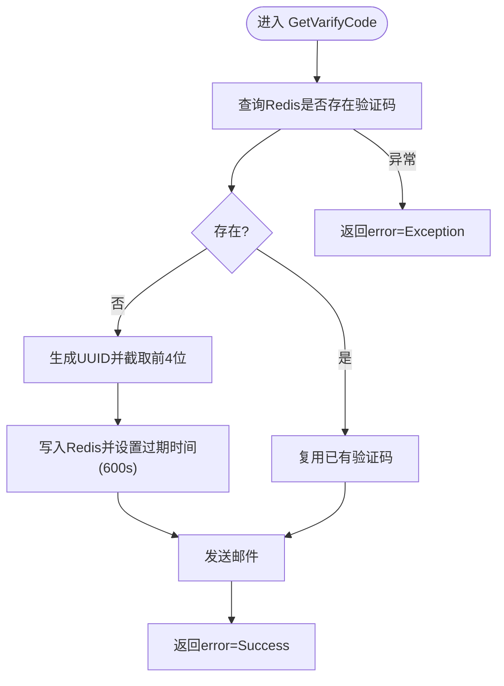
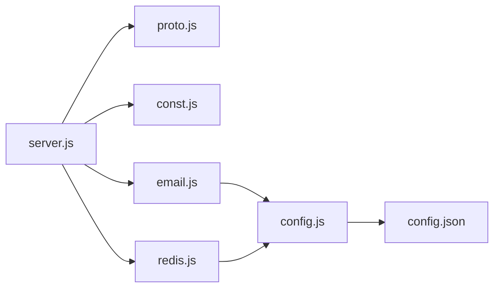

# VarifyServer验证码服务配置

<cite>
**本文引用的文件**   
- [server/VarifyServer/package.json](file://server/VarifyServer/package.json)
- [server/VarifyServer/server.js](file://server/VarifyServer/server.js)
- [server/VarifyServer/config.js](file://server/VarifyServer/config.js)
- [server/VarifyServer/email.js](file://server/VarifyServer/email.js)
- [server/VarifyServer/redis.js](file://server/VarifyServer/redis.js)
- [server/VarifyServer/const.js](file://server/VarifyServer/const.js)
- [server/VarifyServer/proto.js](file://server/VarifyServer/proto.js)
- [server/VarifyServer/message.proto](file://server/VarifyServer/message.proto)
- [server/VarifyServer/config.json](file://server/VarifyServer/config.json)
</cite>

## 目录
1. [简介](#简介)
2. [项目结构](#项目结构)
3. [核心组件](#核心组件)
4. [架构总览](#架构总览)
5. [详细组件分析](#详细组件分析)
6. [依赖关系分析](#依赖关系分析)
7. [性能与可用性](#性能与可用性)
8. [故障排查指南](#故障排查指南)
9. [结论](#结论)
10. [附录：环境变量与生产环境建议](#附录环境变量与生产环境建议)

## 简介
本文件为 VarifyServer 验证码服务的完整配置文档，覆盖 Node.js 环境要求、npm 依赖管理、服务启动方式，以及邮箱 SMTP、Redis 缓存、gRPC 接口等关键配置的详细说明。同时给出开发与生产环境的差异建议、安全限流与队列化扩展思路、监控与日志实践，帮助读者快速部署并稳定运行该服务。

## 项目结构
VarifyServer 基于 Node.js 与 gRPC 提供验证码获取能力，使用 Redis 缓存验证码，使用 Nodemailer 发送邮件。核心文件职责如下：
- package.json：定义项目元数据、脚本与依赖
- server.js：gRPC 服务入口与验证码处理逻辑
- config.js：从 config.json 加载全局配置并导出
- email.js：封装邮件发送（Nodemailer）
- redis.js：封装 Redis 连接与常用操作（含心跳）
- const.js：常量与错误码
- proto.js：加载 message.proto 生成 gRPC 客户端/服务端代码
- message.proto：gRPC 服务与消息定义
- config.json：运行时配置（邮箱、MySQL、Redis）

图表来源
- [server/VarifyServer/package.json:1-19](file://server/VarifyServer/package.json#L1-L19)
- [server/VarifyServer/server.js:1-76](file://server/VarifyServer/server.js#L1-L76)
- [server/VarifyServer/proto.js:1-12](file://server/VarifyServer/proto.js#L1-L12)
- [server/VarifyServer/message.proto:1-44](file://server/VarifyServer/message.proto#L1-L44)
- [server/VarifyServer/email.js:1-37](file://server/VarifyServer/email.js#L1-L37)
- [server/VarifyServer/redis.js:1-101](file://server/VarifyServer/redis.js#L1-L101)
- [server/VarifyServer/const.js:1-10](file://server/VarifyServer/const.js#L1-L10)
- [server/VarifyServer/config.js:1-15](file://server/VarifyServer/config.js#L1-L15)
- [server/VarifyServer/config.json:1-21](file://server/VarifyServer/config.json#L1-L21)

章节来源
- [server/VarifyServer/package.json:1-19](file://server/VarifyServer/package.json#L1-L19)
- [server/VarifyServer/server.js:1-76](file://server/VarifyServer/server.js#L1-L76)
- [server/VarifyServer/config.js:1-15](file://server/VarifyServer/config.js#L1-L15)
- [server/VarifyServer/email.js:1-37](file://server/VarifyServer/email.js#L1-L37)
- [server/VarifyServer/redis.js:1-101](file://server/VarifyServer/redis.js#L1-L101)
- [server/VarifyServer/const.js:1-10](file://server/VarifyServer/const.js#L1-L10)
- [server/VarifyServer/proto.js:1-12](file://server/VarifyServer/proto.js#L1-L12)
- [server/VarifyServer/message.proto:1-44](file://server/VarifyServer/message.proto#L1-L44)
- [server/VarifyServer/config.json:1-21](file://server/VarifyServer/config.json#L1-L21)

## 核心组件
- gRPC 服务与接口
  - 服务名：VarifyService
  - RPC：GetVarifyCode(GetVarifyReq) -> GetVarifyRsp
  - 请求体包含 email；响应包含 error、email、code（当前实现中 code 字段未填充）
- 验证码生成与缓存
  - 首次请求时生成唯一标识（UUID 前缀截取），写入 Redis 并设置过期时间（秒级）
  - 后续请求若存在则复用已生成的验证码
- 邮件发送
  - 使用 Nodemailer 通过 SMTP 发送邮件，模板文本包含验证码与提示语
- Redis 缓存
  - 封装 get、exists、set+expire 等操作，内置连接错误监听与心跳机制
- 配置系统
  - 从 config.json 读取邮箱、MySQL、Redis 配置，并通过 config.js 暴露给各模块

章节来源
- [server/VarifyServer/message.proto:5-17](file://server/VarifyServer/message.proto#L5-L17)
- [server/VarifyServer/server.js:15-64](file://server/VarifyServer/server.js#L15-L64)
- [server/VarifyServer/redis.js:41-98](file://server/VarifyServer/redis.js#L41-L98)
- [server/VarifyServer/email.js:22-35](file://server/VarifyServer/email.js#L22-L35)
- [server/VarifyServer/config.js:1-15](file://server/VarifyServer/config.js#L1-L15)

## 架构总览
下图展示 VarifyServer 的运行时交互流程：客户端通过 gRPC 调用 GetVarifyCode，服务根据邮箱查询或生成验证码并写入 Redis，随后通过邮件服务发送验证码。

图表来源
- [server/VarifyServer/server.js:15-64](file://server/VarifyServer/server.js#L15-L64)
- [server/VarifyServer/redis.js:41-98](file://server/VarifyServer/redis.js#L41-L98)
- [server/VarifyServer/email.js:22-35](file://server/VarifyServer/email.js#L22-L35)
- [server/VarifyServer/config.js:1-15](file://server/VarifyServer/config.js#L1-L15)
- [server/VarifyServer/config.json:1-21](file://server/VarifyServer/config.json#L1-L21)

## 详细组件分析

### package.json：依赖与脚本
- 名称与版本：varifyserver v1.0.0
- 入口：index.js（但实际启动脚本指向 server.js）
- 脚本：serve 命令执行 node server.js
- 依赖：
  - @grpc/grpc-js：gRPC 运行时
  - @grpc/proto-loader：加载 .proto 文件
  - ioredis：Redis 客户端
  - nodemailer：邮件发送
  - uuid：生成唯一标识

章节来源
- [server/VarifyServer/package.json:1-19](file://server/VarifyServer/package.json#L1-L19)

### server.js：主服务与验证码流程
- 功能要点
  - 加载 gRPC、proto、常量、邮件与 Redis 模块
  - 实现 GetVarifyCode：按邮箱查询或生成验证码，写入 Redis（带过期时间），发送邮件，返回统一错误码
  - 绑定 gRPC 服务到 0.0.0.0:50051（非 TLS）
- 验证码规则
  - 首次生成 UUID 并截取前 4 位作为验证码
  - 有效期 600 秒（10 分钟）
- 错误码
  - Success、RedisErr、Exception（来自 const.js）

图表来源
- [server/VarifyServer/server.js:15-64](file://server/VarifyServer/server.js#L15-L64)
- [server/VarifyServer/const.js:1-10](file://server/VarifyServer/const.js#L1-L10)

章节来源
- [server/VarifyServer/server.js:1-76](file://server/VarifyServer/server.js#L1-L76)
- [server/VarifyServer/const.js:1-10](file://server/VarifyServer/const.js#L1-L10)

### config.js：全局配置加载
- 从同目录 config.json 读取 JSON 配置
- 导出 email_user、email_pass、mysql_host、mysql_port、redis_host、redis_port、redis_passwd、code_prefix
- 注意：当前代码仅导出部分字段，email.js 与 redis.js 依赖其中对应项

章节来源
- [server/VarifyServer/config.js:1-15](file://server/VarifyServer/config.js#L1-L15)
- [server/VarifyServer/config.json:1-21](file://server/VarifyServer/config.json#L1-L21)

### email.js：邮件服务
- 使用 Nodemailer 创建 SMTP 传输器
- 默认配置：host=smtp.163.com，port=465，secure=true（SSL）
- 认证信息从 config.js 导入
- SendMail 函数返回 Promise，成功返回 info.response，失败抛出错误

章节来源
- [server/VarifyServer/email.js:1-37](file://server/VarifyServer/email.js#L1-L37)
- [server/VarifyServer/config.js:1-15](file://server/VarifyServer/config.js#L1-L15)

### redis.js：缓存服务
- 使用 ioredis 创建客户端，参数来自 config.js
- 事件监听：error、end，触发重连
- 心跳：每 60 秒向 heartbeat key 写入时间戳
- 方法：
  - GetRedis(key)：获取值，不存在返回 null
  - QueryRedis(key)：判断 key 是否存在
  - SetRedisExpire(key,value,exptime)：设置键值并设置过期时间（秒）

章节来源
- [server/VarifyServer/redis.js:1-101](file://server/VarifyServer/redis.js#L1-L101)
- [server/VarifyServer/config.js:1-15](file://server/VarifyServer/config.js#L1-L15)

### const.js：常量与错误码
- code_prefix：验证码 key 前缀（"code_"）
- Errors：Success=0，RedisErr=1，Exception=2

章节来源
- [server/VarifyServer/const.js:1-10](file://server/VarifyServer/const.js#L1-L10)

### proto.js 与 message.proto：gRPC 协议
- proto.js：加载 message.proto，导出 message_proto
- message.proto：定义 VarifyService 与 GetVarifyReq/GetVarifyRsp 等消息

章节来源
- [server/VarifyServer/proto.js:1-12](file://server/VarifyServer/proto.js#L1-L12)
- [server/VarifyServer/message.proto:1-44](file://server/VarifyServer/message.proto#L1-L44)

## 依赖关系分析
- 模块耦合
  - server.js 依赖 proto.js、const.js、email.js、redis.js
  - email.js 依赖 config.js
  - redis.js 依赖 config.js
  - config.js 依赖 config.json
- 外部依赖
  - @grpc/grpc-js、@grpc/proto-loader：gRPC 通信
  - ioredis：Redis 客户端
  - nodemailer：SMTP 邮件发送
  - uuid：唯一标识生成

图表来源
- [server/VarifyServer/server.js:1-76](file://server/VarifyServer/server.js#L1-L76)
- [server/VarifyServer/email.js:1-37](file://server/VarifyServer/email.js#L1-L37)
- [server/VarifyServer/redis.js:1-101](file://server/VarifyServer/redis.js#L1-L101)
- [server/VarifyServer/config.js:1-15](file://server/VarifyServer/config.js#L1-L15)
- [server/VarifyServer/config.json:1-21](file://server/VarifyServer/config.json#L1-L21)

章节来源
- [server/VarifyServer/server.js:1-76](file://server/VarifyServer/server.js#L1-L76)
- [server/VarifyServer/email.js:1-37](file://server/VarifyServer/email.js#L1-L37)
- [server/VarifyServer/redis.js:1-101](file://server/VarifyServer/redis.js#L1-L101)
- [server/VarifyServer/config.js:1-15](file://server/VarifyServer/config.js#L1-L15)

## 性能与可用性
- 验证码缓存策略
  - 以邮箱为 key，Redis 存储验证码并设置过期时间，避免重复生成与频繁 IO
- 连接稳定性
  - Redis 客户端监听 error/end 事件并重连；定时心跳检测存活
- 并发与限流
  - 当前未实现速率限制；建议在入口处增加基于 IP 或邮箱的限流（如令牌桶/滑动窗口）
- 可扩展性
  - 可将邮件发送改为异步队列（如 Bull/RabbitMQ），提高吞吐与容错

[本节为通用指导，不直接分析具体文件]

## 故障排查指南
- 常见错误定位
  - Redis 连接失败：检查 redis.js 的连接参数与网络连通性，关注 error 与 end 事件日志
  - 邮件发送失败：核对 email.js 的 SMTP 主机、端口、用户名、授权码；确认 SSL/TLS 设置
  - gRPC 服务未启动：确认 server.js 绑定的端口未被占用，且依赖模块加载正常
- 日志输出
  - server.js 打印请求、Redis 查询结果、发送结果与异常
  - redis.js 打印连接错误、查询结果与异常
  - email.js 打印发送成功或错误信息
- 建议增强
  - 引入结构化日志（如 winston/pino）
  - 对关键路径添加指标上报（Prometheus 指标）

章节来源
- [server/VarifyServer/server.js:15-64](file://server/VarifyServer/server.js#L15-L64)
- [server/VarifyServer/redis.js:16-34](file://server/VarifyServer/redis.js#L16-L34)
- [server/VarifyServer/email.js:22-35](file://server/VarifyServer/email.js#L22-L35)

## 结论
VarifyServer 提供了简洁可靠的验证码获取能力，结合 Redis 缓存与邮件发送，满足基础注册/重置场景。建议在生产环境中完善环境变量管理、敏感信息保护、限流与监控，并将邮件发送异步化以提升稳定性与吞吐。

[本节为总结性内容，不直接分析具体文件]

## 附录：环境变量与生产环境建议
- 环境变量替代配置文件
  - 将 config.json 中的敏感字段迁移至环境变量（如 EMAIL_USER、EMAIL_PASS、REDIS_HOST、REDIS_PORT、REDIS_PASSWD）
  - 在 config.js 中优先读取环境变量，回退到配置文件
- 安全与最小权限
  - 仅开放必要端口（gRPC 50051）；生产建议使用 TLS 与鉴权
  - Redis 启用密码与访问控制，限制来源 IP
- 监控与日志
  - 接入健康检查端点（/health）
  - 采集关键指标：请求量、成功率、延迟、Redis 连接状态、邮件发送成功率
- 高可用与弹性
  - 多实例部署配合负载均衡
  - 邮件发送队列化（Bull/RabbitMQ），失败重试与死信队列
- 开发/生产差异
  - 开发：本地 Redis、SMTP 测试账号，关闭严格校验
  - 生产：启用 TLS、限流、审计日志、告警阈值

[本节为通用指导，不直接分析具体文件]