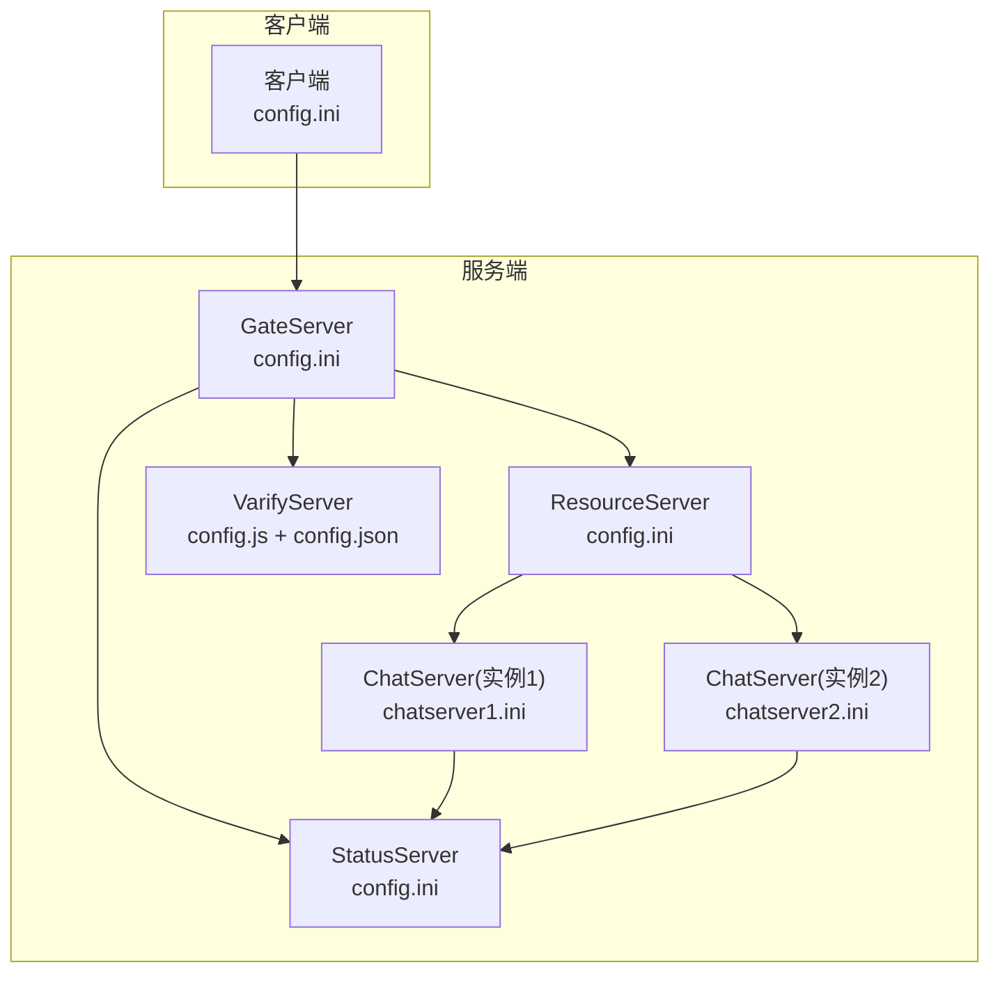
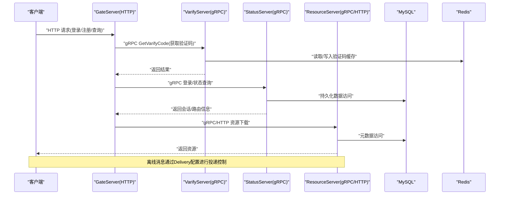

# 服务配置

<cite>
**本文引用的文件**   
- [GateServer配置文件](file://server/GateServer/config/config.ini)
- [ChatServer实例1配置](file://server/ChatServer/config/chatserver1.ini)
- [ChatServer实例2配置](file://server/ChatServer/config/chatserver2.ini)
- [StatusServer配置文件](file://server/StatusServer/config/config.ini)
- [ResourceServer配置文件](file://server/ResourceServer/config/config.ini)
- [VarifyServer配置加载器](file://server/VarifyServer/config.js)
- [VarifyServer常量定义](file://server/VarifyServer/const.js)
- [VarifyServer gRPC服务实现](file://server/VarifyServer/server.js)
- [VarifyServer邮件模块](file://server/VarifyServer/email.js)
- [VarifyServer Redis模块](file://server/VarifyServer/redis.js)
- [VarifyServer gRPC协议定义](file://server/VarifyServer/message.proto)
- [客户端配置文件](file://client/llfcchat/config/config.ini)
- [ChatServer配置管理器头文件](file://server/ChatServer/include/ConfigMgr.h)
- [ChatServer配置管理器实现](file://server/ChatServer/src/ConfigMgr.cpp)
- [ResourceServer配置管理器头文件](file://server/ResourceServer/include/ConfigMgr.h)
- [ResourceServer配置管理器实现](file://server/ResourceServer/src/ConfigMgr.cpp)
- [ChatServer逻辑系统实现](file://server/ChatServer/src/LogicSystem.cpp)
</cite>

## 更新摘要
**变更内容**   
- 新增[Delivery]配置段文档，涵盖离线消息投递相关参数
- 更新ChatServer和ResourceServer的配置说明，包含新的Delivery配置项
- 补充离线消息拉取机制的配置详解
- 增强故障排查指南中关于Delivery配置的调试方法

## 目录
1. [简介](#简介)
2. [项目结构](#项目结构)
3. [核心组件](#核心组件)
4. [架构总览](#架构总览)
5. [详细组件分析](#详细组件分析)
6. [依赖关系分析](#依赖关系分析)
7. [性能考虑](#性能考虑)
8. [故障排查指南](#故障排查指南)
9. [结论](#结论)
10. [附录](#附录)

## 简介
本文件为 LLFCChat 各微服务的配置文档，覆盖 GateServer（HTTP网关）、ChatServer（聊天服务）、StatusServer（状态管理）、ResourceServer（资源服务）以及 VarifyServer（Node.js验证码与邮箱认证）。内容包含：
- 每个服务的配置文件结构与参数说明（端口、数据库、Redis、网络通信等）
- **新增** Delivery配置段的详细说明，包括离线消息投递相关的7个关键参数
- 生产与开发环境差异建议
- 配置模板与示例
- 配置校验与调试方法

## 项目结构
各服务均提供独立的配置文件，位于各自 server/<服务名>/config 目录下；客户端也有独立配置文件。VarifyServer 使用 Node.js 的 JSON 配置文件并通过 JS 模块加载。



图表来源
- [GateServer配置文件](file://server/GateServer/config/config.ini)
- [ChatServer实例1配置](file://server/ChatServer/config/chatserver1.ini)
- [ChatServer实例2配置](file://server/ChatServer/config/chatserver2.ini)
- [StatusServer配置文件](file://server/StatusServer/config/config.ini)
- [ResourceServer配置文件](file://server/ResourceServer/config/config.ini)
- [VarifyServer配置加载器](file://server/VarifyServer/config.js)
- [客户端配置文件](file://client/llfcchat/config/config.ini)

章节来源
- [GateServer配置文件](file://server/GateServer/config/config.ini)
- [ChatServer实例1配置](file://server/ChatServer/config/chatserver1.ini)
- [ChatServer实例2配置](file://server/ChatServer/config/chatserver2.ini)
- [StatusServer配置文件](file://server/StatusServer/config/config.ini)
- [ResourceServer配置文件](file://server/ResourceServer/config/config.ini)
- [VarifyServer配置加载器](file://server/VarifyServer/config.js)
- [客户端配置文件](file://client/llfcchat/config/config.ini)

## 核心组件
- GateServer：对外暴露 HTTP 接口，转发或协调调用验证、状态、资源等后端服务。
- ChatServer：聊天业务服务，支持多实例部署，通过 gRPC 与状态服务交互，并与其他 ChatServer 实例互通。**新增** 支持离线消息投递配置。
- StatusServer：集中管理 ChatServer 实例注册与发现、用户登录态等。
- ResourceServer：文件与静态资源服务，按配置输出路径和静态目录提供服务。**新增** 支持离线消息投递配置。
- VarifyServer：基于 Node.js 的验证码与邮箱认证服务，通过 gRPC 对外暴露接口，依赖 Redis 与 SMTP。

章节来源
- [GateServer配置文件](file://server/GateServer/config/config.ini)
- [ChatServer实例1配置](file://server/ChatServer/config/chatserver1.ini)
- [ChatServer实例2配置](file://server/ChatServer/config/chatserver2.ini)
- [StatusServer配置文件](file://server/StatusServer/config/config.ini)
- [ResourceServer配置文件](file://server/ResourceServer/config/config.ini)
- [VarifyServer配置加载器](file://server/VarifyServer/config.js)
- [VarifyServer gRPC服务实现](file://server/VarifyServer/server.js)

## 架构总览
下图展示客户端到各微服务的典型调用路径及配置依赖。



图表来源
- [GateServer配置文件](file://server/GateServer/config/config.ini)
- [StatusServer配置文件](file://server/StatusServer/config/config.ini)
- [ResourceServer配置文件](file://server/ResourceServer/config/config.ini)
- [VarifyServer gRPC服务实现](file://server/VarifyServer/server.js)
- [VarifyServer Redis模块](file://server/VarifyServer/redis.js)

## 详细组件分析

### GateServer（HTTP网关）配置
- 配置文件位置：server/GateServer/config/config.ini
- 关键段落与参数
  - [GateServer]
    - Port：HTTP监听端口
  - [VarifyServer]
    - Host：验证码服务主机地址
    - Port：验证码服务 gRPC 端口
  - [StatusServer]
    - Host：状态管理服务主机地址
    - Port：状态管理服务 gRPC 端口
  - [Mysql]
    - Host/Port/User/Passwd/Schema：MySQL连接信息
  - [Redis]
    - Host/Port/Passwd：Redis连接信息
  - [ResServer]
    - Name：资源服务标识
    - Host/Port：资源服务HTTP端口
    - RPCPort：资源服务 gRPC 端口
  - [Concurrency]
    - HandlerWorkers：处理器工作线程数
    - HandlerQueueCapacity：处理器队列容量

- 配置要点
  - 确保 VarifyServer、StatusServer、ResServer 的 Host/Port 与实际运行一致
  - MySQL/Redis 凭据需与环境匹配
  - ResServer 同时暴露 HTTP 与 gRPC 端口，注意防火墙策略

章节来源
- [GateServer配置文件](file://server/GateServer/config/config.ini)

### ChatServer（聊天服务）配置
- 配置文件位置：server/ChatServer/config/chatserver1.ini、chatserver2.ini
- 关键段落与参数
  - [GateServer]
    - Port：GateServer 的 HTTP 端口（用于客户端接入）
  - [VarifyServer]/[StatusServer]
    - Host/Port：验证码与状态服务地址
  - [SelfServer]
    - Name：本实例名称
    - Host：监听地址（通常为 0.0.0.0）
    - Port：TCP/WebSocket 服务端口
    - RPCPort：gRPC 端口（用于服务间通信）
  - [Mysql]/[Redis]：同 GateServer
  - [PeerServer]
    - Servers：对端 ChatServer 实例名列表（用于跨实例消息路由）
  - [chatserverX]：对端实例的连接信息（Name/Host/Port）
  - [Concurrency]
    - LogicWorkers：逻辑处理工作线程数
    - DeliveryWorkers：投递工作线程数
  - **[Delivery]**（新增）
    - OfflineTtlSeconds：离线消息过期时间（秒），默认604800（7天）
    - OfflinePullBatch：离线消息拉取批次大小，默认100
    - PullMaxBytes：单次拉取最大字节数，默认30000
    - RpcDeadlineMs：RPC超时时间（毫秒），默认3000
    - RpcMaxAttempts：RPC最大重试次数，默认3
    - RpcBackoffMs：RPC退避间隔（毫秒），默认100

- 配置要点
  - chatserver1.ini 与 chatserver2.ini 互为 PeerServer 的对端
  - SelfServer.RPCPort 必须与 StatusServer 中注册的端口一致
  - 多实例部署时，确保各实例端口不冲突
  - **Delivery配置用于控制离线消息的存储、拉取和投递行为**

章节来源
- [ChatServer实例1配置](file://server/ChatServer/config/chatserver1.ini)
- [ChatServer实例2配置](file://server/ChatServer/config/chatserver2.ini)

### StatusServer（状态管理服务）配置
- 配置文件位置：server/StatusServer/config/config.ini
- 关键段落与参数
  - [StatusServer]
    - Port：gRPC 监听端口
    - Host：监听地址
  - [Mysql]/[Redis]：数据库与缓存连接
  - [chatservers]
    - Name：逗号分隔的 ChatServer 实例名列表
  - [chatserverX]：各 ChatServer 实例的 Name/Host/Port

- 配置要点
  - chatservers.Name 需与 ChatServer 的 SelfServer.Name 保持一致
  - 各 chatserverX 的端口需与 ChatServer 的 SelfServer.Port 对应

章节来源
- [StatusServer配置文件](file://server/StatusServer/config/config.ini)

### ResourceServer（资源服务）配置
- 配置文件位置：server/ResourceServer/config/config.ini
- 关键段落与参数
  - [SelfServer]
    - Name：服务标识
    - Host：监听地址
    - Port：HTTP 服务端口
  - [Mysql]/[Redis]：数据库与缓存连接
  - [Output]
    - Path：文件输出目录
  - [Static]
    - Path：静态资源目录
  - [chatserverX]：ChatServer 实例的 gRPC 端口（用于通知或元数据交互）
  - **[Delivery]**（新增）
    - OfflineTtlSeconds：离线消息过期时间（秒），默认604800（7天）
    - OfflinePullBatch：离线消息拉取批次大小，默认100
    - PullMaxBytes：单次拉取最大字节数，默认30000
    - RpcDeadlineMs：RPC超时时间（毫秒），默认3000
    - RpcMaxAttempts：RPC最大重试次数，默认3
    - RpcBackoffMs：RPC退避间隔（毫秒），默认100

- 配置要点
  - Output.Path 与 Static.Path 需指向实际存在的目录
  - 若启用 HTTPS，需在部署层配置证书（服务本身未直接暴露证书配置项）
  - **Delivery配置用于资源服务中的离线消息处理**

章节来源
- [ResourceServer配置文件](file://server/ResourceServer/config/config.ini)

### VarifyServer（Node.js 验证码与邮箱认证）配置
- 配置文件位置：server/VarifyServer/config.js（加载 config.json）
- 关键模块
  - config.js：从 config.json 读取邮箱、MySQL、Redis 等配置，并导出常量
  - const.js：错误码与验证码前缀等常量
  - email.js：基于 nodemailer 的 SMTP 发送模块
  - redis.js：ioredis 客户端封装，含心跳与常用操作
  - server.js：gRPC 服务实现，暴露 GetVarifyCode 接口
  - message.proto：gRPC 协议定义

- 关键配置项（由 config.js 导出）
  - email.user / email.pass：SMTP 发件人账号与授权码
  - mysql.host / mysql.port：MySQL 连接信息（当前代码未直接使用，预留）
  - redis.host / redis.port / redis.passwd：Redis 连接信息
  - code_prefix：验证码 key 前缀

- 关键行为
  - GetVarifyCode：根据邮箱生成或复用验证码，存入 Redis 并设置过期时间，随后通过 SMTP 发送邮件
  - Redis 模块提供 GetRedis/QueryRedis/SetRedisExpire 等方法，并内置心跳机制

- 配置要点
  - 确保 Redis 可写且具备足够权限
  - SMTP 服务器需开启授权码登录，且域名白名单正确
  - gRPC 默认绑定 0.0.0.0:50051，需与 GateServer 的 VarifyServer 配置一致

章节来源
- [VarifyServer配置加载器](file://server/VarifyServer/config.js)
- [VarifyServer常量定义](file://server/VarifyServer/const.js)
- [VarifyServer gRPC服务实现](file://server/VarifyServer/server.js)
- [VarifyServer邮件模块](file://server/VarifyServer/email.js)
- [VarifyServer Redis模块](file://server/VarifyServer/redis.js)
- [VarifyServer gRPC协议定义](file://server/VarifyServer/message.proto)

### 客户端配置
- 配置文件位置：client/llfcchat/config/config.ini
- 关键段落与参数
  - [GateServer]
    - host：GateServer 主机地址
    - port：GateServer HTTP 端口

- 配置要点
  - 客户端只需配置 GateServer 入口，其他服务通过 GateServer 间接访问

章节来源
- [客户端配置文件](file://client/llfcchat/config/config.ini)

### Delivery配置段详解（新增）
**Delivery配置段**是LLFCChat系统中新增的重要配置模块，专门用于控制离线消息的投递行为。该配置段在ChatServer和ResourceServer中均有应用。

#### 配置参数说明
- **OfflineTtlSeconds**（离线消息过期时间）
  - 类型：整数（秒）
  - 默认值：604800（7天）
  - 作用：控制离线消息在Redis中的存储时长，超过此时间的消息将被清理
  
- **OfflinePullBatch**（离线消息拉取批次）
  - 类型：整数
  - 默认值：100
  - 作用：每次拉取离线消息的最大数量，限制单次请求的消息量
  
- **PullMaxBytes**（拉取最大字节数）
  - 类型：整数（字节）
  - 默认值：30000
  - 作用：限制单次拉取响应的最大字节数，防止响应过大
  
- **RpcDeadlineMs**（RPC超时时间）
  - 类型：整数（毫秒）
  - 默认值：3000
  - 作用：RPC调用的超时时间，防止长时间阻塞
  
- **RpcMaxAttempts**（RPC最大重试次数）
  - 类型：整数
  - 默认值：3
  - 作用：RPC失败时的最大重试次数
  
- **RpcBackoffMs**（RPC退避间隔）
  - 类型：整数（毫秒）
  - 默认值：100
  - 作用：重试之间的等待时间，避免频繁重试

#### 工作原理
Delivery配置主要应用于离线消息拉取流程：
1. 客户端发起离线消息拉取请求
2. 系统根据OfflinePullBatch限制拉取数量
3. 通过PullMaxBytes控制响应大小
4. 使用OfflineTtlSeconds管理消息过期时间
5. 通过RPC相关参数控制服务间通信的可靠性

章节来源
- [ChatServer逻辑系统实现:1170-1349](file://server/ChatServer/src/LogicSystem.cpp#L1170-L1349)
- [ChatServer实例1配置:33-40](file://server/ChatServer/config/chatserver1.ini#L33-L40)
- [ChatServer实例2配置:33-40](file://server/ChatServer/config/chatserver2.ini#L33-L40)
- [ResourceServer配置文件:27-34](file://server/ResourceServer/config/config.ini#L27-L34)

## 依赖关系分析
- GateServer 依赖：
  - VarifyServer（gRPC）
  - StatusServer（gRPC）
  - ResourceServer（HTTP/gRPC）
  - MySQL、Redis
- ChatServer 依赖：
  - StatusServer（gRPC）
  - 对端 ChatServer（gRPC）
  - MySQL、Redis
  - **Delivery配置用于离线消息处理**
- StatusServer 依赖：
  - MySQL、Redis
  - 维护 ChatServer 实例清单
- ResourceServer 依赖：
  - MySQL、Redis
  - 文件系统（输出目录与静态目录）
  - **Delivery配置用于资源服务中的离线消息处理**
- VarifyServer 依赖：
  - Redis、SMTP（nodemailer）
  - gRPC 协议定义

```mermaid
graph LR
Client["客户端"] --> Gate["GateServer"]
Gate --> Verify["VarifyServer"]
Gate --> Status["StatusServer"]
Gate --> Resource["ResourceServer"]
Chat1["ChatServer(1)"] --> Status
Chat2["ChatServer(2)"] --> Status
Chat1 < --> Chat2
Resource --> Chat1
Resource --> Chat2
Status --> DB["MySQL"]
Status --> RD["Redis"]
Resource --> FS["文件系统"]
Verify --> RD
Verify --> SMTP["SMTP"]
Delivery["Delivery配置"] --> Chat1
Delivery --> Resource
```

图表来源
- [GateServer配置文件](file://server/GateServer/config/config.ini)
- [ChatServer实例1配置](file://server/ChatServer/config/chatserver1.ini)
- [ChatServer实例2配置](file://server/ChatServer/config/chatserver2.ini)
- [StatusServer配置文件](file://server/StatusServer/config/config.ini)
- [ResourceServer配置文件](file://server/ResourceServer/config/config.ini)
- [VarifyServer gRPC服务实现](file://server/VarifyServer/server.js)
- [VarifyServer Redis模块](file://server/VarifyServer/redis.js)
- [VarifyServer邮件模块](file://server/VarifyServer/email.js)

章节来源
- [GateServer配置文件](file://server/GateServer/config/config.ini)
- [ChatServer实例1配置](file://server/ChatServer/config/chatserver1.ini)
- [ChatServer实例2配置](file://server/ChatServer/config/chatserver2.ini)
- [StatusServer配置文件](file://server/StatusServer/config/config.ini)
- [ResourceServer配置文件](file://server/ResourceServer/config/config.ini)
- [VarifyServer gRPC服务实现](file://server/VarifyServer/server.js)
- [VarifyServer Redis模块](file://server/VarifyServer/redis.js)
- [VarifyServer邮件模块](file://server/VarifyServer/email.js)

## 性能考虑
- 连接池与并发
  - MySQL：合理设置连接池大小与超时，避免连接耗尽
  - Redis：启用连接重试与离线队列关闭（已禁用），减少阻塞
- 缓存策略
  - 验证码在 Redis 中设置过期时间，避免内存泄漏
  - 热点数据（如用户在线状态）可考虑多级缓存
  - **Delivery配置优化离线消息的存储和拉取性能**
- 网络通信
  - gRPC 长连接复用，减少握手开销
  - 大文件传输走 ResourceServer 直连或分片断点续传
  - **RPC相关Delivery参数控制服务间通信的可靠性和性能**
- I/O 与磁盘
  - ResourceServer 的输出目录与静态目录建议使用高性能磁盘或对象存储
- 监控与限流
  - 建议在 GateServer 层增加限流与熔断，保护下游服务
  - **监控Delivery配置参数的实际使用情况，优化批处理和超时设置**

## 故障排查指南
- 通用检查
  - 确认各服务配置文件中的 Host/Port 与实际运行一致
  - 检查防火墙与安全组是否放行相应端口
  - 查看服务日志定位错误堆栈
- GateServer
  - 无法连接 VarifyServer/StatusServer/ResourceServer：核对配置段与端口
  - HTTP 请求超时：检查下游服务健康与负载
- ChatServer
  - 无法加入集群：检查 PeerServer 与对端实例配置
  - 登录失败：核对 StatusServer 的实例清单与端口映射
  - **离线消息拉取问题：检查Delivery配置参数，特别是OfflinePullBatch和PullMaxBytes**
- StatusServer
  - 实例注册异常：核对 chatservers 列表与各实例端口
- ResourceServer
  - 文件下载失败：检查 Output.Path 与 Static.Path 是否存在且有读写权限
  - **离线消息处理异常：检查Delivery配置与服务间RPC通信**
- VarifyServer
  - 验证码发送失败：检查 Redis 连通性与 SMTP 授权码
  - Redis 连接断开：查看 redis.js 的心跳与重连逻辑
- 客户端
  - 无法连接 GateServer：核对 client/config.ini 的 host/port
- **Delivery配置专项排查**
  - 离线消息过期：检查OfflineTtlSeconds设置是否过短
  - 拉取性能问题：调整OfflinePullBatch和PullMaxBytes参数
  - RPC超时：检查RpcDeadlineMs和RpcBackoffMs配置
  - 重试机制：验证RpcMaxAttempts设置是否合理

章节来源
- [GateServer配置文件](file://server/GateServer/config/config.ini)
- [ChatServer实例1配置](file://server/ChatServer/config/chatserver1.ini)
- [ChatServer实例2配置](file://server/ChatServer/config/chatserver2.ini)
- [StatusServer配置文件](file://server/StatusServer/config/config.ini)
- [ResourceServer配置文件](file://server/ResourceServer/config/config.ini)
- [VarifyServer gRPC服务实现](file://server/VarifyServer/server.js)
- [VarifyServer Redis模块](file://server/VarifyServer/redis.js)
- [VarifyServer邮件模块](file://server/VarifyServer/email.js)
- [客户端配置文件](file://client/llfcchat/config/config.ini)
- [ChatServer逻辑系统实现:1170-1349](file://server/ChatServer/src/LogicSystem.cpp#L1170-L1349)

## 结论
LLFCChat 的微服务配置以 INI 与 JSON 为主，职责清晰、边界明确。通过 GateServer 统一入口，结合 StatusServer 的服务发现与 ResourceServer 的资源分发，形成可扩展的分布式架构。VarifyServer 提供轻量验证码与邮箱能力，配合 Redis 与 SMTP 完成认证流程。**新增的Delivery配置段为系统提供了完善的离线消息处理能力，通过精细化的参数控制，确保了消息投递的可靠性和性能**。生产部署时应关注端口规划、凭据安全、连接池与缓存策略，并建立完善的监控与排障体系。

## 附录

### 配置模板与示例（节选）
以下为各服务配置的关键字段参考（仅列出字段名与含义，具体值请根据环境调整）：
- GateServer（config.ini）
  - [GateServer]: Port
  - [VarifyServer]: Host, Port
  - [StatusServer]: Host, Port
  - [Mysql]: Host, Port, User, Passwd, Schema
  - [Redis]: Host, Port, Passwd
  - [ResServer]: Name, Host, Port, RPCPort
  - [Concurrency]: HandlerWorkers, HandlerQueueCapacity
- ChatServer（chatserverN.ini）
  - [GateServer]: Port
  - [VarifyServer]: Host, Port
  - [StatusServer]: Host, Port
  - [SelfServer]: Name, Host, Port, RPCPort
  - [Mysql]: Host, Port, User, Passwd, Schema
  - [Redis]: Host, Port, Passwd
  - [PeerServer]: Servers
  - [chatserverX]: Name, Host, Port
  - [Concurrency]: LogicWorkers, DeliveryWorkers
  - **[Delivery]**: OfflineTtlSeconds, OfflinePullBatch, PullMaxBytes, RpcDeadlineMs, RpcMaxAttempts, RpcBackoffMs
- StatusServer（config.ini）
  - [StatusServer]: Port, Host
  - [Mysql]: Host, Port, User, Passwd, Schema
  - [Redis]: Host, Port, Passwd
  - [chatservers]: Name
  - [chatserverX]: Name, Host, Port
- ResourceServer（config.ini）
  - [SelfServer]: Name, Host, Port
  - [Mysql]: Host, Port, User, Passwd, Schema
  - [Redis]: Host, Port, Passwd
  - [Output]: Path
  - [Static]: Path
  - [chatserverX]: Name, Host, Port
  - **[Delivery]**: OfflineTtlSeconds, OfflinePullBatch, PullMaxBytes, RpcDeadlineMs, RpcMaxAttempts, RpcBackoffMs
- VarifyServer（config.json，由 config.js 加载）
  - email.user, email.pass
  - mysql.host, mysql.port
  - redis.host, redis.port, redis.passwd
- 客户端（config.ini）
  - [GateServer]: host, port

章节来源
- [GateServer配置文件](file://server/GateServer/config/config.ini)
- [ChatServer实例1配置](file://server/ChatServer/config/chatserver1.ini)
- [ChatServer实例2配置](file://server/ChatServer/config/chatserver2.ini)
- [StatusServer配置文件](file://server/StatusServer/config/config.ini)
- [ResourceServer配置文件](file://server/ResourceServer/config/config.ini)
- [VarifyServer配置加载器](file://server/VarifyServer/config.js)
- [客户端配置文件](file://client/llfcchat/config/config.ini)

### 生产环境与开发环境差异建议
- 端口与地址
  - 开发：本地回环地址（127.0.0.1），端口分配紧凑
  - 生产：内网或公网地址，严格端口规划与最小化开放
- 凭据与密钥
  - 开发：可使用弱口令或环境变量注入
  - 生产：强密码、密钥管理（如 KMS/Secrets Manager），禁止硬编码
- 数据库与缓存
  - 开发：单实例共享
  - 生产：主从/集群、连接池上限、慢查询监控
- 日志与监控
  - 开发：控制台输出
  - 生产：结构化日志、集中收集、指标上报与告警
- 资源目录
  - 开发：相对路径或本地目录
  - 生产：独立分区或对象存储，CDN 加速静态资源
- **Delivery配置优化**
  - 开发：使用较小的批处理大小和较短的过期时间
  - 生产：根据实际负载调整批处理大小、超时时间和重试策略

### 配置校验与调试方法
- 启动前校验
  - 检查配置文件语法（INI/JSON）
  - 校验必填字段存在且类型正确
  - 端口占用检测与冲突检查
- 运行时调试
  - 打印关键配置项与服务启动日志
  - 使用网络工具（telnet/curl/grpcurl）测试端口连通性
  - 查看 Redis/MYSQL/SMTP 连接状态与错误日志
- 常见问题定位
  - 验证码发送失败：检查 Redis 键前缀与过期时间、SMTP 授权码
  - 登录失败：核对 StatusServer 实例清单与 ChatServer 端口
  - 资源下载失败：检查 Output/Static 目录权限与路径
- **Delivery配置调试**
  - 检查离线消息拉取性能：监控OfflinePullBatch的实际效果
  - 验证消息过期策略：观察OfflineTtlSeconds的设置是否合理
  - 调试RPC通信：检查RpcDeadlineMs和RpcBackoffMs的配置
  - 监控重试机制：验证RpcMaxAttempts是否有效防止无限重试

章节来源
- [GateServer配置文件](file://server/GateServer/config/config.ini)
- [ChatServer实例1配置](file://server/ChatServer/config/chatserver1.ini)
- [ChatServer实例2配置](file://server/ChatServer/config/chatserver2.ini)
- [StatusServer配置文件](file://server/StatusServer/config/config.ini)
- [ResourceServer配置文件](file://server/ResourceServer/config/config.ini)
- [VarifyServer gRPC服务实现](file://server/VarifyServer/server.js)
- [VarifyServer Redis模块](file://server/VarifyServer/redis.js)
- [VarifyServer邮件模块](file://server/VarifyServer/email.js)
- [客户端配置文件](file://client/llfcchat/config/config.ini)
- [ChatServer逻辑系统实现:1170-1349](file://server/ChatServer/src/LogicSystem.cpp#L1170-L1349)