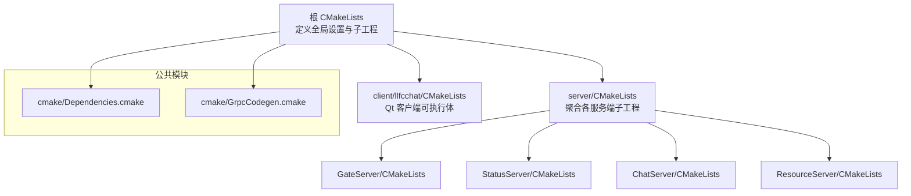
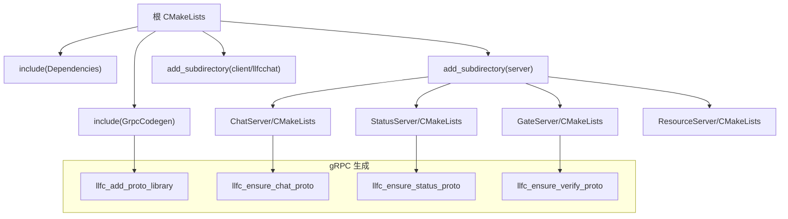
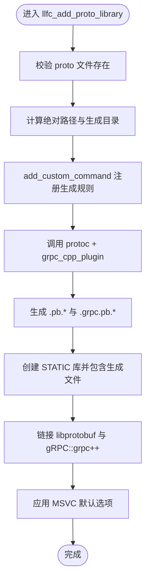
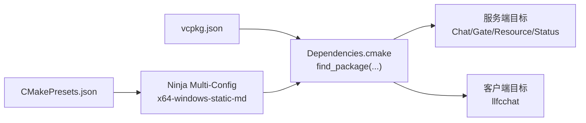

# 构建系统

<cite>
**本文引用的文件**   
- [CMakeLists.txt](file://CMakeLists.txt)
- [Dependencies.cmake](file://cmake/Dependencies.cmake)
- [GrpcCodegen.cmake](file://cmake/GrpcCodegen.cmake)
- [vcpkg.json](file://vcpkg.json)
- [CMakePresets.json](file://CMakePresets.json)
- [server/CMakeLists.txt](file://server/CMakeLists.txt)
- [client/llfcchat/CMakeLists.txt](file://client/llfcchat/CMakeLists.txt)
- [server/ChatServer/CMakeLists.txt](file://server/ChatServer/CMakeLists.txt)
- [server/GateServer/CMakeLists.txt](file://server/GateServer/CMakeLists.txt)
- [server/ResourceServer/CMakeLists.txt](file://server/ResourceServer/CMakeLists.txt)
- [server/StatusServer/CMakeLists.txt](file://server/StatusServer/CMakeLists.txt)
- [proto/chat_service/chat.proto](file://proto/chat_service/chat.proto)
- [proto/status_service/status.proto](file://proto/status_service/status.proto)
- [proto/verify_service/verify.proto](file://proto/verify_service/verify.proto)
</cite>

## 目录
1. [简介](#简介)
2. [项目结构](#项目结构)
3. [核心组件](#核心组件)
4. [架构总览](#架构总览)
5. [详细组件分析](#详细组件分析)
6. [依赖关系分析](#依赖关系分析)
7. [性能与优化](#性能与优化)
8. [故障排查指南](#故障排查指南)
9. [结论](#结论)
10. [附录](#附录)

## 简介
本文件为 LLFCChat 项目的构建系统文档，聚焦 CMake 构建体系、gRPC/Protobuf 代码生成流程、跨平台构建命令与选项、调试与优化配置、第三方依赖管理与更新，以及常见构建问题与性能优化建议。读者无需深入底层细节即可顺利完成本地构建与持续集成配置。

## 项目结构
LLFCChat 采用多子工程结构：根 CMakeLists 统一入口，server 下包含多个独立服务（GateServer、StatusServer、ChatServer、ResourceServer），client 下为 Qt 桌面客户端。所有 C++ 目标共享统一的依赖解析与 gRPC 代码生成脚本。

图表来源
- [CMakeLists.txt:1-34](file://CMakeLists.txt#L1-L34)
- [server/CMakeLists.txt:1-38](file://server/CMakeLists.txt#L1-L38)
- [client/llfcchat/CMakeLists.txt:1-222](file://client/llfcchat/CMakeLists.txt#L1-L222)
- [Dependencies.cmake:1-82](file://cmake/Dependencies.cmake#L1-L82)
- [GrpcCodegen.cmake:1-72](file://cmake/GrpcCodegen.cmake#L1-L72)

章节来源
- [CMakeLists.txt:1-34](file://CMakeLists.txt#L1-L34)
- [server/CMakeLists.txt:1-38](file://server/CMakeLists.txt#L1-L38)
- [client/llfcchat/CMakeLists.txt:1-222](file://client/llfcchat/CMakeLists.txt#L1-L222)

## 核心组件
- 根构建入口
  - 强制使用 Ninja Multi-Config 生成器，禁止源码内构建，统一 vcpkg 安装路径与仓库根路径，启用 C++17。
- 依赖管理
  - 通过 vcpkg 清单集中声明 Boost、nlohmann-json、gRPC、protobuf、hiredis、mysql-connector-cpp、Qt5 等依赖。
  - 提供 llfc_find_server_dependencies 与 llfc_find_client_dependencies 函数分别解析服务端与客户端依赖。
- gRPC 代码生成
  - 封装 llfc_add_proto_library 与若干 ensure_*_proto 函数，自动调用 protoc 与 grpc_cpp_plugin 生成 .pb/.grpc.pb 源文件并打包为静态库。
- 输出目录与部署
  - 统一将运行时产物输出到 out/run/<CONFIG>/<subdir>，并在 POST_BUILD 阶段复制配置文件与静态资源。

章节来源
- [CMakeLists.txt:1-34](file://CMakeLists.txt#L1-L34)
- [Dependencies.cmake:1-82](file://cmake/Dependencies.cmake#L1-L82)
- [GrpcCodegen.cmake:1-72](file://cmake/GrpcCodegen.cmake#L1-L72)
- [vcpkg.json:1-32](file://vcpkg.json#L1-L32)

## 架构总览
下图展示从顶层 CMake 到各子工程的组织关系，以及 gRPC 代码生成在构建期如何被触发。

图表来源
- [CMakeLists.txt:18-34](file://CMakeLists.txt#L18-L34)
- [GrpcCodegen.cmake:1-72](file://cmake/GrpcCodegen.cmake#L1-L72)
- [server/ChatServer/CMakeLists.txt:33-36](file://server/ChatServer/CMakeLists.txt#L33-L36)
- [server/StatusServer/CMakeLists.txt:33-36](file://server/StatusServer/CMakeLists.txt#L33-L36)
- [server/GateServer/CMakeLists.txt:34-37](file://server/GateServer/CMakeLists.txt#L34-L37)

## 详细组件分析

### 根 CMake 与通用工具
- 生成器与构建目录检查
  - 要求使用 Ninja Multi-Config；禁止 in-source 构建。
- vcpkg 与仓库根路径
  - 设置 VCPKG_MANIFEST_DIR、VCPKG_INSTALLED_DIR、LLFC_REPO_ROOT，确保子工程一致定位。
- C++ 标准
  - 全局启用 C++17（客户端单独覆盖为 C++11）。
- 模块引入
  - include(Dependencies) 与 include(GrpcCodegen)。

章节来源
- [CMakeLists.txt:1-34](file://CMakeLists.txt#L1-L34)

### 依赖解析（Dependencies.cmake）
- 服务端依赖
  - find_package(Boost CONFIG REQUIRED COMPONENTS asio, beast, date_time, filesystem, property_tree, uuid)
  - find_package(nlohmann_json CONFIG REQUIRED)
  - find_package(gRPC CONFIG REQUIRED)
  - find_package(Protobuf CONFIG REQUIRED)
  - find_package(hiredis CONFIG REQUIRED)
  - find_package(mysql-concpp CONFIG REQUIRED)
- 客户端依赖
  - find_package(Qt5 CONFIG REQUIRED COMPONENTS Core Gui Network Widgets)
- MSVC 默认编译选项
  - 统一 /utf-8 与忽略特定警告，设置 MSVC_RUNTIME_LIBRARY 以匹配 vcpkg 静态/动态链接策略。
- 仓库根计算与 vcpkg 初始化宏
  - llfc_get_repo_root(depth) 根据层级推导仓库根；llfc_setup_standalone_vcpkg(depth) 用于独立入口时的 vcpkg 环境准备。
- 运行产物输出目录
  - llfc_set_runtime_outdir(target_name, subdir) 将不同配置的产物输出到 out/run/<CONFIG>/<subdir>。

章节来源
- [Dependencies.cmake:1-82](file://cmake/Dependencies.cmake#L1-L82)

### gRPC 代码生成（GrpcCodegen.cmake）
- 核心函数 llfc_add_proto_library(target_name, proto_file)
  - 校验输入 proto 文件存在性，确定绝对路径与生成目录。
  - 使用 add_custom_command 调用 protobuf::protoc 与 gRPC::grpc_cpp_plugin，生成 .pb.cc/.pb.h 与 .grpc.pb.cc/.grpc.pb.h。
  - 将生成的源文件加入一个 STATIC 库，暴露头文件目录，链接 libprotobuf 与 gRPC::grpc++，并启用 cxx_std_17。
  - 应用 MSVC 默认编译选项。
- 便捷封装
  - llfc_ensure_chat_proto()、llfc_ensure_status_proto()、llfc_ensure_verify_proto() 分别指向对应 proto 文件，供各子工程按需调用。

图表来源
- [GrpcCodegen.cmake:4-47](file://cmake/GrpcCodegen.cmake#L4-L47)

章节来源
- [GrpcCodegen.cmake:1-72](file://cmake/GrpcCodegen.cmake#L1-L72)

### 服务端子工程
- server/CMakeLists.txt
  - 聚合 GateServer、StatusServer、ChatServer、ResourceServer 四个子工程。
  - 若从 server/ 独立配置，重复进行生成器与 in-source 检查，设置 vcpkg 与仓库根路径。
- ChatServer/CMakeLists.txt
  - 依赖 llfc_chat_proto 与 llfc_status_proto。
  - 链接 Boost、nlohmann_json、hiredis、mysql::concpp-jdbc-static。
  - POST_BUILD 复制两个实例的配置文件并拷贝二进制到 chatserver2 目录。
- GateServer/CMakeLists.txt
  - 依赖 llfc_status_proto 与 llfc_verify_proto。
  - 链接相同的基础库集。
  - POST_BUILD 复制 config.ini。
- ResourceServer/CMakeLists.txt
  - 依赖 llfc_chat_proto。
  - 链接基础库集。
  - POST_BUILD 复制 config.ini。
- StatusServer/CMakeLists.txt
  - 依赖 llfc_status_proto 与 llfc_chat_proto。
  - 链接基础库集。
  - POST_BUILD 复制 config.ini。

章节来源
- [server/CMakeLists.txt:1-38](file://server/CMakeLists.txt#L1-L38)
- [server/ChatServer/CMakeLists.txt:1-111](file://server/ChatServer/CMakeLists.txt#L1-L111)
- [server/GateServer/CMakeLists.txt:1-92](file://server/GateServer/CMakeLists.txt#L1-L92)
- [server/ResourceServer/CMakeLists.txt:1-104](file://server/ResourceServer/CMakeLists.txt#L1-L104)
- [server/StatusServer/CMakeLists.txt:1-87](file://server/StatusServer/CMakeLists.txt#L1-L87)

### 客户端子工程（Qt）
- client/llfcchat/CMakeLists.txt
  - 独立入口时同样进行生成器与 in-source 检查，设置 vcpkg 与仓库根路径。
  - 启用 RC 语言支持（Ninja 下嵌入 .rc 所需）。
  - 收集大量 .cpp/.h/.ui 源文件，定义可执行体 llfcchat（WIN32）。
  - 开启 AUTOMOC/AUTOUIC/AUTORCC，指定 ui 搜索路径。
  - 链接 Qt5::Core/GUI/Network/Widgets/WinMain，并通过 qt5_import_plugins 静态导入平台、图像格式与样式插件。
  - 应用 MSVC 默认选项与统一输出目录。
  - POST_BUILD 复制 config.ini 与 assets/static 到运行目录。

章节来源
- [client/llfcchat/CMakeLists.txt:1-222](file://client/llfcchat/CMakeLists.txt#L1-L222)

### Protocol Buffers 与 gRPC 接口
- chat.proto：定义 ChatService 及好友申请、认证、文本消息、踢人、图片通知等消息类型。
- status.proto：定义 StatusService 及获取聊天服务器、登录相关请求/响应。
- verify.proto：定义 VarifyService 及验证码获取请求/响应。

章节来源
- [proto/chat_service/chat.proto:1-105](file://proto/chat_service/chat.proto#L1-L105)
- [proto/status_service/status.proto:1-32](file://proto/status_service/status.proto#L1-L32)
- [proto/verify_service/verify.proto:1-19](file://proto/verify_service/verify.proto#L1-L19)

## 依赖关系分析
- 依赖声明
  - vcpkg.json 集中声明所有 C++ 与 Qt 依赖，包括 boost-*、nlohmann-json、grpc、protobuf、hiredis、mysql-connector-cpp、qt5-base、qt5-imageformats。
- 发现与链接
  - Dependencies.cmake 通过 find_package 查找上述包，并按目标类型链接相应组件。
- 生成器与工具链
  - CMakePresets.json 提供 Windows 下的 Ninja Multi-Config 预设，指定 toolchainFile 与 x64-windows-static-md 三元组，便于 IDE 或 CI 一键配置。

图表来源
- [vcpkg.json:1-32](file://vcpkg.json#L1-L32)
- [Dependencies.cmake:1-82](file://cmake/Dependencies.cmake#L1-L82)
- [CMakePresets.json:1-36](file://CMakePresets.json#L1-L36)

章节来源
- [vcpkg.json:1-32](file://vcpkg.json#L1-L32)
- [Dependencies.cmake:1-82](file://cmake/Dependencies.cmake#L1-L82)
- [CMakePresets.json:1-36](file://CMakePresets.json#L1-L36)

## 性能与优化
- 构建期优化
  - 使用 Ninja Multi-Config 提升并行构建速度。
  - 合理划分子工程，减少不必要的重编译范围。
  - 对 gRPC 生成规则使用 DEPENDS 精确依赖，避免多余重建。
- 运行时优化
  - Release/RelWithDebInfo 配置配合编译器优化开关（由工具链与 vcpkg 包决定）。
  - 静态链接第三方库可减少运行时依赖，但会增加二进制体积；可根据部署需求选择。
- 缓存与增量构建
  - 保持 out/build 与 out/run 分离，利用 CMake 缓存加速二次构建。
  - 修改 .proto 仅触发对应目标的重新生成。

[本节为通用指导，不直接分析具体文件]

## 故障排查指南
- 生成器错误
  - 现象：提示必须使用 “Ninja Multi-Config”。
  - 处理：按 CMakePresets 或命令行显式指定生成器。
- In-source 构建错误
  - 现象：禁止源码内构建。
  - 处理：在独立目录执行 cmake --preset 或 cmake -B <build_dir>。
- vcpkg 未找到或版本不匹配
  - 现象：find_package 失败或找不到包。
  - 处理：确认 VCPKG_ROOT 环境变量正确，vcpkg.json 中 baseline 可用，且已安装 x64-windows-static-md 工具链。
- gRPC/Protobuf 生成失败
  - 现象：protoc 或 grpc_cpp_plugin 未找到。
  - 处理：确保 vcpkg 安装了 grpc 与 protobuf，且 CMake 能找到对应 TARGET_FILE。
- Qt 插件缺失
  - 现象：运行时报缺少平台或图像格式插件。
  - 处理：确保 qt5_import_plugins 包含 QWindowsIntegrationPlugin、QGif/QJpeg/QWebp 等插件，并将插件 DLL 复制到运行目录。
- 配置文件缺失
  - 现象：启动后无法读取 config.ini。
  - 处理：POST_BUILD 会复制配置文件，如手动清理过 out/run，请重新构建或手动复制。

章节来源
- [CMakeLists.txt:4-16](file://CMakeLists.txt#L4-L16)
- [CMakePresets.json:1-36](file://CMakePresets.json#L1-L36)
- [client/llfcchat/CMakeLists.txt:167-222](file://client/llfcchat/CMakeLists.txt#L167-L222)
- [server/ChatServer/CMakeLists.txt:96-111](file://server/ChatServer/CMakeLists.txt#L96-L111)
- [server/GateServer/CMakeLists.txt:85-92](file://server/GateServer/CMakeLists.txt#L85-L92)
- [server/ResourceServer/CMakeLists.txt:97-104](file://server/ResourceServer/CMakeLists.txt#L97-L104)
- [server/StatusServer/CMakeLists.txt:80-87](file://server/StatusServer/CMakeLists.txt#L80-L87)

## 结论
LLFCChat 的构建系统以 CMake 为核心，结合 vcpkg 与自定义模块实现跨平台、可复用的依赖管理与 gRPC 代码生成。通过 Preset 与标准化脚本，开发者可在 Windows/Linux/macOS 上快速搭建一致的构建环境，并以最小成本进行调试与优化。

[本节为总结性内容，不直接分析具体文件]

## 附录

### 构建命令与选项（按平台）
- Windows（推荐）
  - 使用预设：cmake --preset=windows-debug 或 windows-release
  - 生成器：Ninja Multi-Config
  - 工具链：VS Build Tools + vcpkg (x64-windows-static-md)
- Linux/macOS
  - 需安装 CMake 3.25+、Ninja、vcpkg 与对应工具链。
  - 配置示例：cmake -G "Ninja Multi-Config" -DCMAKE_TOOLCHAIN_FILE=<vcpkg>/scripts/buildsystems/vcpkg.cmake -DVCPKG_TARGET_TRIPLET=x64-linux 或 x64-osx
  - 由于当前 Preset 仅含 Windows 预设，Linux/macOS 需自行添加对应 configurePreset。

章节来源
- [CMakePresets.json:1-36](file://CMakePresets.json#L1-L36)
- [CMakeLists.txt:1-16](file://CMakeLists.txt#L1-L16)

### gRPC 代码生成流程
- 触发点：各服务端 CMakeLists 调用 llfc_ensure_*_proto()。
- 生成过程：llfc_add_proto_library 通过 add_custom_command 调用 protoc 与 grpc_cpp_plugin，产出 .pb 与 .grpc.pb 源文件并打包为静态库。
- 依赖：protobuf::protoc、gRPC::grpc_cpp_plugin、libprotobuf、gRPC::grpc++。

章节来源
- [GrpcCodegen.cmake:4-47](file://cmake/GrpcCodegen.cmake#L4-L47)
- [server/ChatServer/CMakeLists.txt:33-36](file://server/ChatServer/CMakeLists.txt#L33-L36)
- [server/StatusServer/CMakeLists.txt:33-36](file://server/StatusServer/CMakeLists.txt#L33-L36)
- [server/GateServer/CMakeLists.txt:34-37](file://server/GateServer/CMakeLists.txt#L34-L37)

### 第三方依赖管理与更新
- 声明位置：vcpkg.json
- 常用操作
  - 安装依赖：vcpkg install --triplet x64-windows-static-md
  - 更新基线：调整 builtin-baseline 或升级 vcpkg 后重新安装
  - 新增依赖：在 dependencies 中添加包名与特性，再执行安装
- 注意
  - 服务端与客户端依赖分属不同 find_package 分支，避免误用。
  - Qt 插件需显式导入，否则运行时会缺失。

章节来源
- [vcpkg.json:1-32](file://vcpkg.json#L1-L32)
- [Dependencies.cmake:6-24](file://cmake/Dependencies.cmake#L6-L24)

### 常见问题速查
- 找不到 gRPC/Protobuf
  - 检查 vcpkg 是否安装成功，CMake 是否能定位到 TARGET_FILE。
- Qt 界面不显示或崩溃
  - 确认 AUTOMOC/AUTOUIC/AUTORCC 已开启，插件已复制到运行目录。
- 配置文件缺失
  - 检查 POST_BUILD 是否执行，必要时手动复制 config.ini 与静态资源。

章节来源
- [client/llfcchat/CMakeLists.txt:175-222](file://client/llfcchat/CMakeLists.txt#L175-L222)
- [server/ChatServer/CMakeLists.txt:96-111](file://server/ChatServer/CMakeLists.txt#L96-L111)
- [server/GateServer/CMakeLists.txt:85-92](file://server/GateServer/CMakeLists.txt#L85-L92)
- [server/ResourceServer/CMakeLists.txt:97-104](file://server/ResourceServer/CMakeLists.txt#L97-L104)
- [server/StatusServer/CMakeLists.txt:80-87](file://server/StatusServer/CMakeLists.txt#L80-L87)