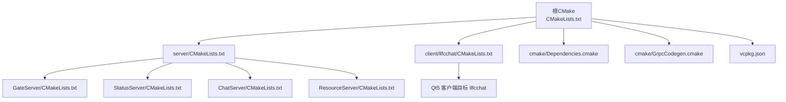
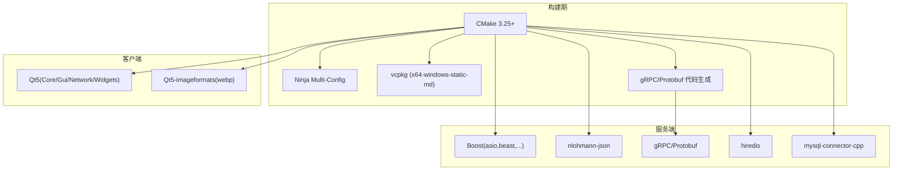
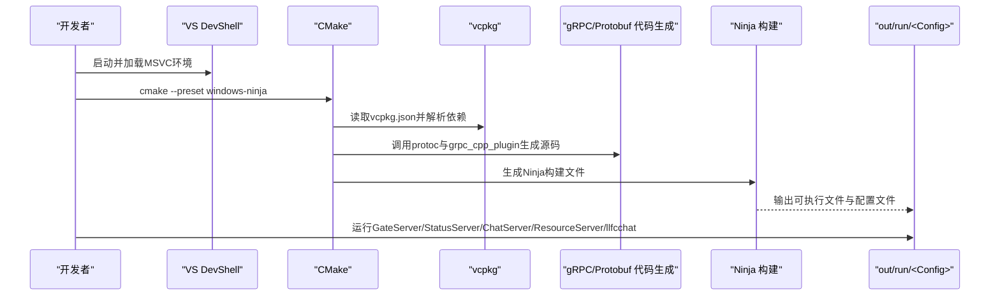
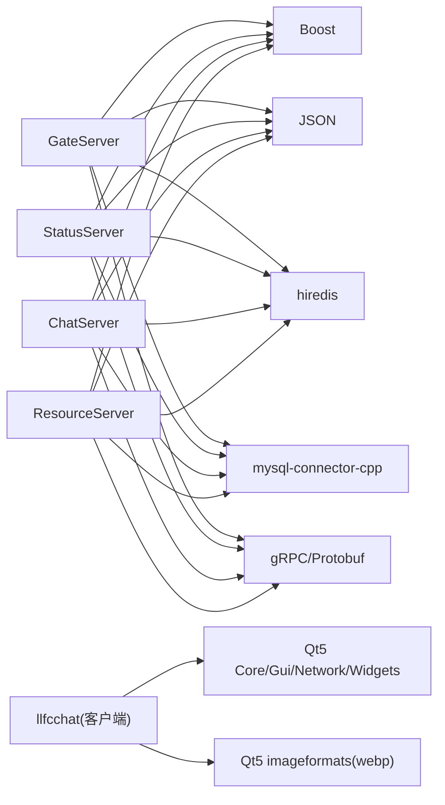

# 环境准备

<cite>
**本文引用的文件**   
- [CMakeLists.txt](file://CMakeLists.txt)
- [CMakePresets.json](file://CMakePresets.json)
- [vcpkg.json](file://vcpkg.json)
- [cmake/Dependencies.cmake](file://cmake/Dependencies.cmake)
- [cmake/GrpcCodegen.cmake](file://cmake/GrpcCodegen.cmake)
- [client/llfcchat/CMakeLists.txt](file://client/llfcchat/CMakeLists.txt)
- [server/CMakeLists.txt](file://server/CMakeLists.txt)
- [server/GateServer/CMakeLists.txt](file://server/GateServer/CMakeLists.txt)
- [server/StatusServer/CMakeLists.txt](file://server/StatusServer/CMakeLists.txt)
- [server/ChatServer/CMakeLists.txt](file://server/ChatServer/CMakeLists.txt)
- [server/ResourceServer/CMakeLists.txt](file://server/ResourceServer/CMakeLists.txt)
- [AGENTS.md](file://AGENTS.md)
- [README.md](file://README.md)
- [.gitignore](file://.gitignore)
- [client/llfcchat/config/config.ini](file://client/llfcchat/config/config.ini)
- [server/GateServer/config/config.ini](file://server/GateServer/config/config.ini)
- [server/StatusServer/config/config.ini](file://server/StatusServer/config/config.ini)
- [开发文档/day03-visualstudio配置boost和jsoncpp.md](file://开发文档/day03-visualstudio配置boost和jsoncpp.md)
- [开发文档/day07-visualstudio配置grpc.md](file://开发文档/day07-visualstudio配置grpc.md)
- [开发文档/day09-redis服务搭建.md](file://开发文档/day09-redis服务搭建.md)
- [开发文档/day11-注册功能.md](file://开发文档/day11-注册功能.md)
</cite>

## 目录
1. [简介](#简介)
2. [项目结构](#项目结构)
3. [核心组件](#核心组件)
4. [架构总览](#架构总览)
5. [详细组件分析](#详细组件分析)
6. [依赖关系分析](#依赖关系分析)
7. [性能考虑](#性能考虑)
8. [故障排除指南](#故障排除指南)
9. [结论](#结论)
10. [附录](#附录)

## 简介
本环境准备文档面向LLFCChat项目的开发与构建，覆盖系统要求、工具链与包管理器（CMake、Ninja、MSVC、vcpkg）、第三方库（Boost、gRPC、Protobuf、MySQL Connector C++、hiredis、Qt5）的安装与配置，以及环境变量与路径设置。同时提供Windows下的快速编译流程、常见问题的排查方法与最佳实践建议，帮助读者从零开始搭建可运行的开发环境。

## 项目结构
- 根级CMake脚本统一入口，强制使用“Ninja Multi-Config”生成器，并启用vcpkg清单模式。
- server子工程包含GateServer、StatusServer、ChatServer、ResourceServer四个服务。
- client子工程为Qt5桌面客户端。
- proto目录存放gRPC接口定义，由CMake在构建时自动生成C++代码。
- vcpkg.json集中声明所有C++依赖，配合CMake的toolchain自动解析。

**图表来源** 
- [CMakeLists.txt:1-34](file://CMakeLists.txt#L1-L34)
- [server/CMakeLists.txt:1-38](file://server/CMakeLists.txt#L1-L38)
- [client/llfcchat/CMakeLists.txt:1-222](file://client/llfcchat/CMakeLists.txt#L1-L222)
- [cmake/Dependencies.cmake:1-82](file://cmake/Dependencies.cmake#L1-L82)
- [cmake/GrpcCodegen.cmake:1-72](file://cmake/GrpcCodegen.cmake#L1-L72)
- [vcpkg.json:1-32](file://vcpkg.json#L1-L32)

**章节来源**
- [CMakeLists.txt:1-34](file://CMakeLists.txt#L1-L34)
- [server/CMakeLists.txt:1-38](file://server/CMakeLists.txt#L1-L38)
- [client/llfcchat/CMakeLists.txt:1-222](file://client/llfcchat/CMakeLists.txt#L1-L222)
- [vcpkg.json:1-32](file://vcpkg.json#L1-L32)

## 核心组件
- 构建系统与生成器：CMake 3.25+，Ninja Multi-Config（强制）。
- 编译器：MSVC（Visual Studio Build Tools），C++标准服务器端C++17，客户端C++11。
- 包管理器：vcpkg（清单模式，triplet x64-windows-static-md）。
- 依赖库：Boost（asio/beast/date_time/filesystem/property_tree/uuid）、nlohmann-json、gRPC、Protobuf、hiredis、mysql-connector-cpp（jdbc特性）、Qt5（Core/Gui/Network/Widgets + imageformats/webp）。
- gRPC代码生成：通过自定义CMake函数在构建树中生成.pb/.grpc.pb源文件。

**章节来源**
- [CMakeLists.txt:1-34](file://CMakeLists.txt#L1-L34)
- [cmake/Dependencies.cmake:1-82](file://cmake/Dependencies.cmake#L1-L82)
- [cmake/GrpcCodegen.cmake:1-72](file://cmake/GrpcCodegen.cmake#L1-L72)
- [client/llfcchat/CMakeLists.txt:1-222](file://client/llfcchat/CMakeLists.txt#L1-L222)
- [vcpkg.json:1-32](file://vcpkg.json#L1-L32)

## 架构总览
下图展示了构建期与运行期的关键依赖与交互：CMake通过vcpkg toolchain解析依赖；gRPC/Protobuf在构建期生成代码；服务端链接Boost、JSON、hiredis、MySQL Connector；客户端链接Qt5模块与插件。

**图表来源** 
- [cmake/Dependencies.cmake:1-82](file://cmake/Dependencies.cmake#L1-L82)
- [cmake/GrpcCodegen.cmake:1-72](file://cmake/GrpcCodegen.cmake#L1-L72)
- [vcpkg.json:1-32](file://vcpkg.json#L1-L32)

## 详细组件分析

### 系统要求与工具链
- 操作系统：Windows（推荐，便于调试与IDE集成）；Linux/macOS亦可，但需自行适配vcpkg triplet与Qt安装方式。
- 编译器与工具：
  - Visual Studio 2022/2026 Build Tools（含MSVC与CMake/Ninja）。
  - CMake 3.25+（VS内置或独立安装）。
  - Ninja（VS内置即可）。
  - vcpkg（建议使用仓库内已提交安装的vcpkg_installed目录）。
- C++标准：服务器端C++17，客户端C++11。

**章节来源**
- [CMakeLists.txt:1-34](file://CMakeLists.txt#L1-L34)
- [client/llfcchat/CMakeLists.txt:1-222](file://client/llfcchat/CMakeLists.txt#L1-L222)
- [AGENTS.md:1-58](file://AGENTS.md#L1-L58)

### vcpkg包管理器配置与使用
- 清单模式：根目录vcpkg.json声明依赖，CMake通过toolchainFile引入vcpkg。
- Triplet：x64-windows-static-md（静态运行时MD模式）。
- 安装目录：默认输出到项目根vcpkg_installed（已在.gitignore忽略，但仓库已预置）。
- 常用命令：
  - 首次配置：cmake --preset windows-ninja
  - 构建全部服务：cmake --build out/build/windows-ninja --config Debug --target GateServer StatusServer ChatServer ResourceServer
  - 构建客户端：cmake --build out/build/windows-ninja --config Debug --target llfcchat

**章节来源**
- [CMakePresets.json:1-36](file://CMakePresets.json#L1-L36)
- [vcpkg.json:1-32](file://vcpkg.json#L1-L32)
- [AGENTS.md:1-58](file://AGENTS.md#L1-L58)

### 依赖库安装与配置
- Boost：通过vcpkg安装（asio/beast/date_time/filesystem/property_tree/uuid），CMake find_package自动发现。
- gRPC与Protobuf：vcpkg安装，构建期通过GrpcCodegen生成源码并链接。
- hiredis：Redis C客户端，vcpkg安装。
- MySQL Connector C++：vcpkg安装（启用jdbc特性），CMake以mysql::concpp-jdbc-static链接。
- Qt5：vcpkg安装qt5-base与qt5-imageformats（webp），客户端链接Core/Gui/Network/Widgets及平台/图像格式/样式插件。

**章节来源**
- [cmake/Dependencies.cmake:1-82](file://cmake/Dependencies.cmake#L1-L82)
- [cmake/GrpcCodegen.cmake:1-72](file://cmake/GrpcCodegen.cmake#L1-L72)
- [server/GateServer/CMakeLists.txt:1-92](file://server/GateServer/CMakeLists.txt#L1-L92)
- [server/ChatServer/CMakeLists.txt:1-111](file://server/ChatServer/CMakeLists.txt#L1-L111)
- [client/llfcchat/CMakeLists.txt:1-222](file://client/llfcchat/CMakeLists.txt#L1-L222)
- [vcpkg.json:1-32](file://vcpkg.json#L1-L32)

### Qt5开发环境搭建（Windows/VS）
- 通过vcpkg安装qt5-base与qt5-imageformats（webp）。
- CMake自动处理MOC/UIC/RCC，并在POST_BUILD阶段复制配置文件与静态资源。
- 插件导入：platforms(QWindowsIntegrationPlugin)、imageformats(Gif/Jpeg/Webp)、styles(QWindowsVistaStylePlugin)。
- 建议在VS中使用CMake Preset进行配置与构建。

**章节来源**
- [client/llfcchat/CMakeLists.txt:1-222](file://client/llfcchat/CMakeLists.txt#L1-L222)
- [AGENTS.md:1-58](file://AGENTS.md#L1-L58)

### 环境变量与路径配置
- VCPKG_ROOT：指向vcpkg可执行文件所在目录（CMakePresets引用$env{VCPKG_ROOT}）。
- VCPKG_INSTALLED_DIR：指向项目根vcpkg_installed（CMakePresets与CMakeLists均设置）。
- LLFC_REPO_ROOT：仓库根路径（CMake内部变量，用于输出目录与proto路径）。
- PATH：确保CMake、Ninja、MSVC工具链可用（VS DevShell加载后自动配置）。

**章节来源**
- [CMakePresets.json:1-36](file://CMakePresets.json#L1-L36)
- [CMakeLists.txt:1-34](file://CMakeLists.txt#L1-L34)
- [cmake/Dependencies.cmake:1-82](file://cmake/Dependencies.cmake#L1-L82)

### 构建与运行流程（序列图）

**图表来源** 
- [CMakePresets.json:1-36](file://CMakePresets.json#L1-L36)
- [cmake/GrpcCodegen.cmake:1-72](file://cmake/GrpcCodegen.cmake#L1-L72)
- [AGENTS.md:1-58](file://AGENTS.md#L1-L58)

## 依赖关系分析
- 服务端各服务均依赖Boost、JSON、hiredis、MySQL Connector，并通过gRPC与外部服务通信。
- 客户端依赖Qt5模块与图像格式插件。
- gRPC/Protobuf在构建期生成代码，避免手工维护pb源文件。

**图表来源** 
- [server/GateServer/CMakeLists.txt:1-92](file://server/GateServer/CMakeLists.txt#L1-L92)
- [server/StatusServer/CMakeLists.txt:1-34](file://server/StatusServer/CMakeLists.txt#L1-L34)
- [server/ChatServer/CMakeLists.txt:1-111](file://server/ChatServer/CMakeLists.txt#L1-L111)
- [server/ResourceServer/CMakeLists.txt:1-34](file://server/ResourceServer/CMakeLists.txt#L1-L34)
- [client/llfcchat/CMakeLists.txt:1-222](file://client/llfcchat/CMakeLists.txt#L1-L222)

**章节来源**
- [server/GateServer/CMakeLists.txt:1-92](file://server/GateServer/CMakeLists.txt#L1-L92)
- [server/StatusServer/CMakeLists.txt:1-34](file://server/StatusServer/CMakeLists.txt#L1-L34)
- [server/ChatServer/CMakeLists.txt:1-111](file://server/ChatServer/CMakeLists.txt#L1-L111)
- [server/ResourceServer/CMakeLists.txt:1-34](file://server/ResourceServer/CMakeLists.txt#L1-L34)
- [client/llfcchat/CMakeLists.txt:1-222](file://client/llfcchat/CMakeLists.txt#L1-L222)

## 性能考虑
- 使用Ninja Multi-Config提升多配置并行构建效率。
- 服务端采用Boost.Asio异步IO模型，适合高并发场景。
- Redis连接池减少频繁建立连接的开销。
- 客户端静态导入必要Qt插件，减少运行时动态加载成本。

[本节为通用指导，不直接分析具体文件]

## 故障排除指南
- 生成器错误：必须使用“Ninja Multi-Config”，否则CMake会报错。
- 源码构建限制：禁止in-source build，需在独立构建目录。
- vcpkg未找到：确保VCPKG_ROOT正确，或CMakePresets中的toolchainFile路径有效；若未设置，CMake仍可使用项目内vcpkg_installed完成配置。
- Qt插件缺失：检查是否启用了AUTOMOC/AUTOUIC/AUTORCC，并确保imageformats插件包含WebP。
- gRPC/Protobuf生成失败：确认protobuf与grpc_cpp_plugin在PATH或CMake能找到；检查.proto路径与输出目录。
- MySQL/hiredis链接错误：确认vcpkg triplet一致（x64-windows-static-md），且Debug/Release匹配。
- 运行时找不到配置文件：POST_BUILD会将config.ini复制到可执行目录，确保运行目录存在。

**章节来源**
- [CMakeLists.txt:1-34](file://CMakeLists.txt#L1-L34)
- [client/llfcchat/CMakeLists.txt:1-222](file://client/llfcchat/CMakeLists.txt#L1-L222)
- [cmake/GrpcCodegen.cmake:1-72](file://cmake/GrpcCodegen.cmake#L1-L72)
- [AGENTS.md:1-58](file://AGENTS.md#L1-L58)

## 结论
通过CMake + vcpkg + Ninja的组合，LLFCChat实现了跨模块一致的依赖管理与构建流程。按照本文档的系统要求、工具链与依赖配置步骤，可在Windows环境下快速搭建完整开发环境，并顺利编译与运行所有服务与客户端。对于Linux/macOS，需根据各自平台调整vcpkg triplet与Qt安装方式，其余流程保持一致。

[本节为总结性内容，不直接分析具体文件]

## 附录

### 快速上手（Windows）
- 加载VS开发环境（PowerShell）
- 进入项目根目录
- 配置：cmake --preset windows-ninja
- 构建服务：cmake --build out/build/windows-ninja --config Debug --target GateServer StatusServer ChatServer ResourceServer
- 构建客户端：cmake --build out/build/windows-ninja --config Debug --target llfcchat

**章节来源**
- [AGENTS.md:1-58](file://AGENTS.md#L1-L58)

### 依赖库参考与历史配置
- Boost与jsoncpp手动配置（历史方法，现由vcpkg管理）
- gRPC手动配置（历史方法，现由vcpkg与CMake自动化）
- Redis服务搭建与hiredes库编译（历史方法，现由vcpkg管理）
- MySQL安装与环境变量配置（历史方法，现由vcpkg管理连接器）

**章节来源**
- [开发文档/day03-visualstudio配置boost和jsoncpp.md:1-194](file://开发文档/day03-visualstudio配置boost和jsoncpp.md#L1-L194)
- [开发文档/day07-visualstudio配置grpc.md:1-406](file://开发文档/day07-visualstudio配置grpc.md#L1-L406)
- [开发文档/day09-redis服务搭建.md:52-808](file://开发文档/day09-redis服务搭建.md#L52-L808)
- [开发文档/day11-注册功能.md:126-367](file://开发文档/day11-注册功能.md#L126-L367)

### 配置文件示例位置
- 客户端配置：client/llfcchat/config/config.ini
- 网关服务配置：server/GateServer/config/config.ini
- 状态服务配置：server/StatusServer/config/config.ini

**章节来源**
- [client/llfcchat/config/config.ini:1-4](file://client/llfcchat/config/config.ini#L1-L4)
- [server/GateServer/config/config.ini:1-23](file://server/GateServer/config/config.ini#L1-L23)
- [server/StatusServer/config/config.ini:1-23](file://server/StatusServer/config/config.ini#L1-L23)

### 构建产物与忽略规则
- 构建输出目录：out/build/windows-ninja（CMake二进制目录）
- 运行输出目录：out/run/<Config>/<服务名>（由CMake统一设置）
- .gitignore忽略构建产物、vcpkg_installed、*.dll/*.exe等

**章节来源**
- [CMakePresets.json:1-36](file://CMakePresets.json#L1-L36)
- [cmake/Dependencies.cmake:70-82](file://cmake/Dependencies.cmake#L70-L82)
- [.gitignore:1-77](file://.gitignore#L1-L77)