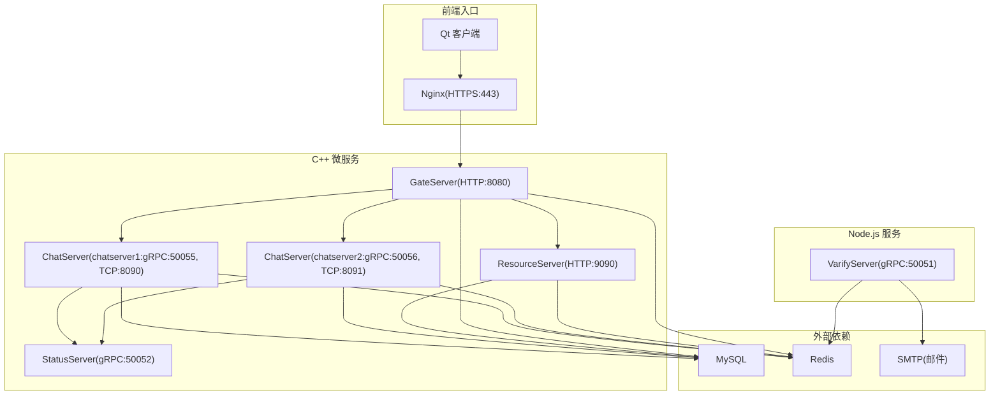
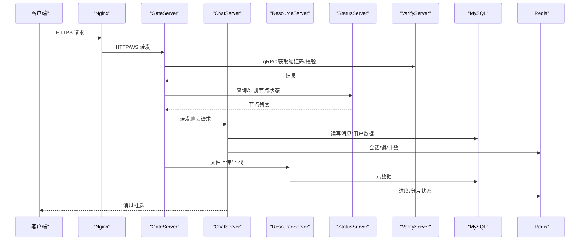
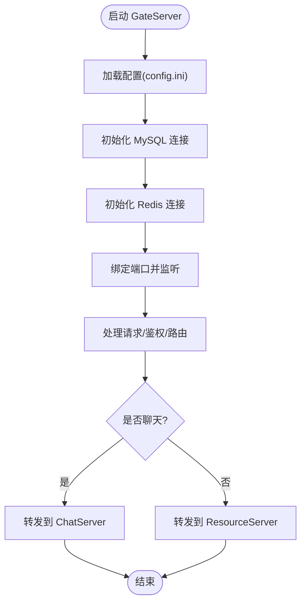
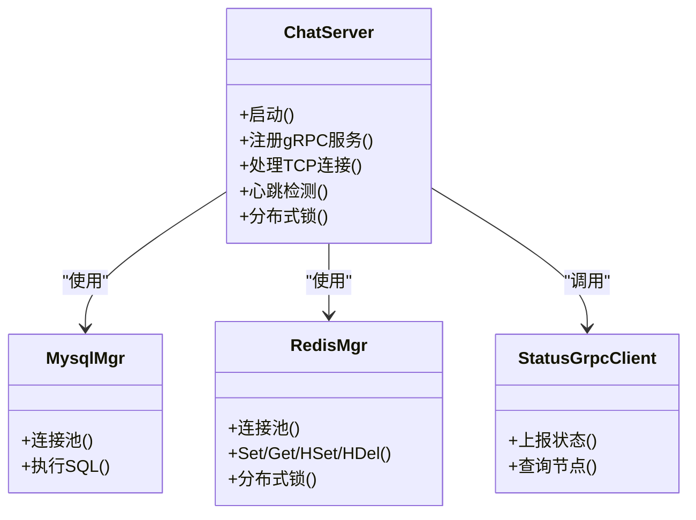
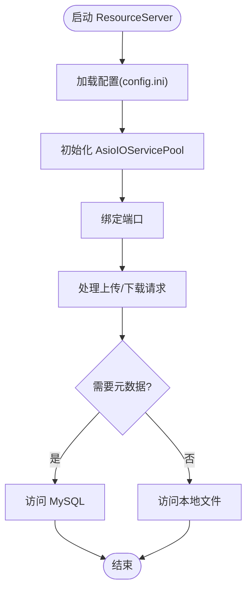
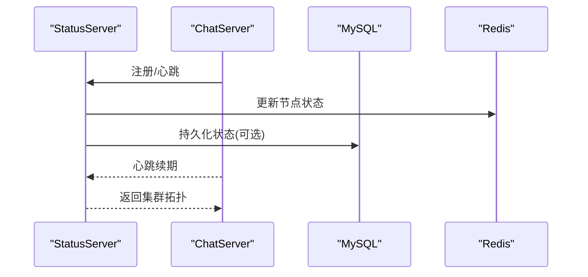
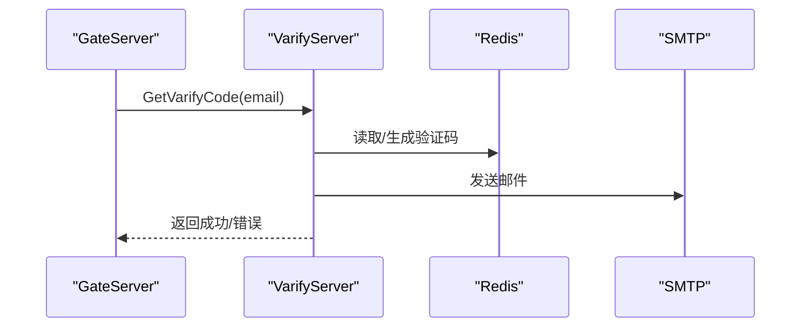
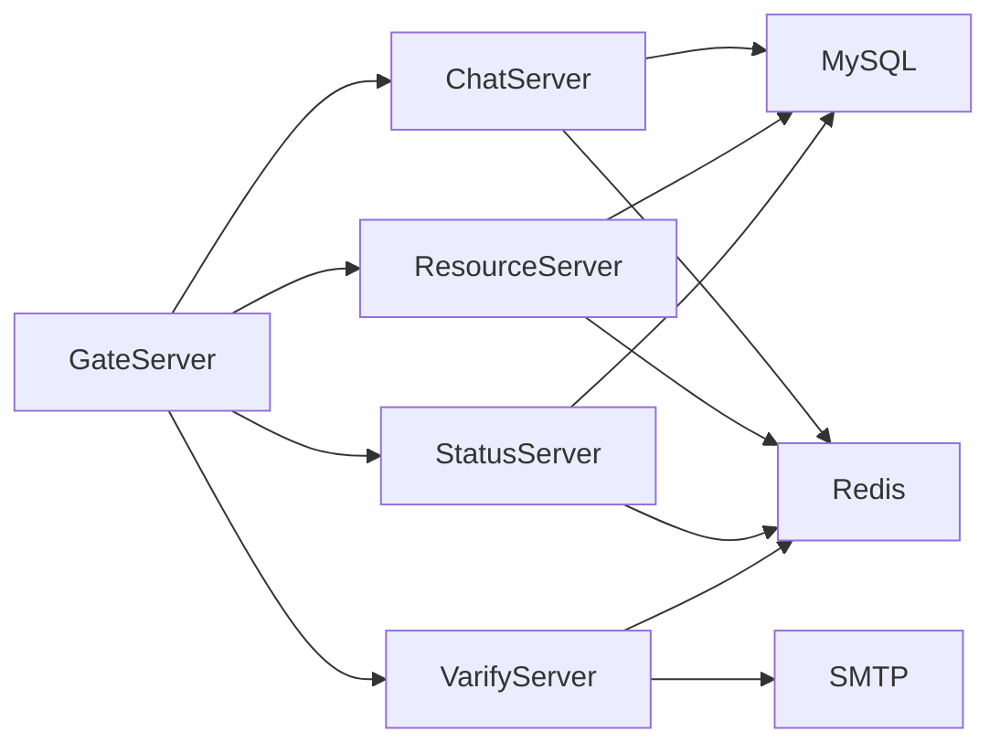

# 生产环境部署

<cite>
**本文引用的文件**   
- [README.md](file://README.md)
- [CMakeLists.txt](file://CMakeLists.txt)
- [vcpkg.json](file://vcpkg.json)
- [server/ChatServer/CMakeLists.txt](file://server/ChatServer/CMakeLists.txt)
- [server/GateServer/CMakeLists.txt](file://server/GateServer/CMakeLists.txt)
- [server/ResourceServer/CMakeLists.txt](file://server/ResourceServer/CMakeLists.txt)
- [server/StatusServer/CMakeLists.txt](file://server/StatusServer/CMakeLists.txt)
- [server/ChatServer/config/chatserver1.ini](file://server/ChatServer/config/chatserver1.ini)
- [server/GateServer/config/config.ini](file://server/GateServer/config/config.ini)
- [server/ResourceServer/config/config.ini](file://server/ResourceServer/config/config.ini)
- [server/StatusServer/config/config.ini](file://server/StatusServer/config/config.ini)
- [server/ChatServer/src/ChatServer.cpp](file://server/ChatServer/src/ChatServer.cpp)
- [server/GateServer/src/GateServer.cpp](file://server/GateServer/src/GateServer.cpp)
- [server/ResourceServer/src/ResourceServer.cpp](file://server/ResourceServer/src/ResourceServer.cpp)
- [server/StatusServer/src/StatusServer.cpp](file://server/StatusServer/src/StatusServer.cpp)
- [server/VarifyServer/package.json](file://server/VarifyServer/package.json)
- [server/VarifyServer/server.js](file://server/VarifyServer/server.js)
- [sql备份/llfc.sql](file://sql备份/llfc.sql)
</cite>

## 目录
1. [简介](#简介)
2. [项目结构](#项目结构)
3. [核心组件](#核心组件)
4. [架构总览](#架构总览)
5. [详细组件分析](#详细组件分析)
6. [依赖关系分析](#依赖关系分析)
7. [性能与高可用](#性能与高可用)
8. [故障排查指南](#故障排查指南)
9. [结论](#结论)
10. [附录](#附录)

## 简介
本文件面向生产环境，提供 LLFCChat 的完整部署指南。内容涵盖：
- 服务启动顺序与依赖管理（MySQL、Redis、gRPC 验证服务、状态服务、网关、聊天服务、资源服务）
- 负载均衡与高可用（Nginx 反向代理、会话保持策略）
- 健康检查与自动重启（进程守护、健康探针）
- 日志收集与分析（结构化日志、集中式采集）
- 监控告警（指标采集、服务状态监控）
- 数据库备份与灾难恢复
- 安全加固（防火墙、SSL/TLS、最小权限）

## 项目结构
LLFCChat 采用多服务架构，包含 C++ 编写的后端微服务与 Node.js 验证服务，以及 Qt 客户端。构建系统使用 CMake + vcpkg，Proto 定义位于 proto 目录。

**图表来源** 
- [server/GateServer/config/config.ini:1-25](file://server/GateServer/config/config.ini#L1-L25)
- [server/ChatServer/config/chatserver1.ini:1-30](file://server/ChatServer/config/chatserver1.ini#L1-L30)
- [server/ResourceServer/config/config.ini:1-27](file://server/ResourceServer/config/config.ini#L1-L27)
- [server/StatusServer/config/config.ini:1-23](file://server/StatusServer/config/config.ini#L1-L23)
- [server/VarifyServer/server.js:66-76](file://server/VarifyServer/server.js#L66-L76)

**章节来源**
- [README.md:1-112](file://README.md#L1-L112)
- [CMakeLists.txt:1-34](file://CMakeLists.txt#L1-L34)
- [vcpkg.json:1-32](file://vcpkg.json#L1-L32)

## 核心组件
- GateServer：HTTP 网关，负责认证、鉴权、路由到具体聊天服务器与资源服务。
- ChatServer：聊天业务核心，处理消息、会话、心跳、踢人等逻辑，暴露 gRPC 接口供状态服务与其他节点调用。
- ResourceServer：静态资源与文件上传下载服务，支持断点续传与进度显示。
- StatusServer：集群状态服务，维护各 ChatServer 在线状态与健康信息。
- VarifyServer：验证码与邮件发送服务，基于 gRPC 对外提供能力。
- 外部依赖：MySQL（持久化）、Redis（缓存/分布式锁/会话）、SMTP（邮件）。

**章节来源**
- [server/GateServer/src/GateServer.cpp:128-160](file://server/GateServer/src/GateServer.cpp#L128-L160)
- [server/ChatServer/src/ChatServer.cpp:20-81](file://server/ChatServer/src/ChatServer.cpp#L20-L81)
- [server/ResourceServer/src/ResourceServer.cpp:15-42](file://server/ResourceServer/src/ResourceServer.cpp#L15-L42)
- [server/StatusServer/src/StatusServer.cpp:17-69](file://server/StatusServer/src/StatusServer.cpp#L17-L69)
- [server/VarifyServer/server.js:66-76](file://server/VarifyServer/server.js#L66-L76)

## 架构总览
下图展示请求从客户端经 Nginx 进入 GateServer，再路由至 ChatServer 或 ResourceServer；状态由 StatusServer 统一维护；验证码由 VarifyServer 提供。

**图表来源** 
- [server/GateServer/config/config.ini:1-25](file://server/GateServer/config/config.ini#L1-L25)
- [server/ChatServer/config/chatserver1.ini:1-30](file://server/ChatServer/config/chatserver1.ini#L1-L30)
- [server/ResourceServer/config/config.ini:1-27](file://server/ResourceServer/config/config.ini#L1-L27)
- [server/StatusServer/config/config.ini:1-23](file://server/StatusServer/config/config.ini#L1-L23)
- [server/VarifyServer/server.js:15-76](file://server/VarifyServer/server.js#L15-L76)

## 详细组件分析

### GateServer（网关）
- 功能：接收客户端 HTTP/WebSocket 请求，进行鉴权、路由、限流、日志记录。
- 依赖：MySQL、Redis、VarifyServer(gRPC)、StatusServer(gRPC)。
- 启动要点：初始化连接池、加载配置、监听端口、信号处理优雅退出。

**图表来源** 
- [server/GateServer/src/GateServer.cpp:128-160](file://server/GateServer/src/GateServer.cpp#L128-L160)
- [server/GateServer/config/config.ini:1-25](file://server/GateServer/config/config.ini#L1-L25)

**章节来源**
- [server/GateServer/src/GateServer.cpp:128-160](file://server/GateServer/src/GateServer.cpp#L128-L160)
- [server/GateServer/config/config.ini:1-25](file://server/GateServer/config/config.ini#L1-L25)

### ChatServer（聊天服务）
- 功能：消息收发、会话管理、心跳、踢人、分布式锁、跨服通信。
- 依赖：MySQL、Redis、StatusServer(gRPC)、其他 ChatServer(gRPC)。
- 启动要点：创建 AsioIOServicePool、启动定时器、注册 gRPC 服务、信号处理。

**图表来源** 
- [server/ChatServer/src/ChatServer.cpp:20-81](file://server/ChatServer/src/ChatServer.cpp#L20-L81)
- [server/ChatServer/CMakeLists.txt:31-93](file://server/ChatServer/CMakeLists.txt#L31-L93)

**章节来源**
- [server/ChatServer/src/ChatServer.cpp:20-81](file://server/ChatServer/src/ChatServer.cpp#L20-L81)
- [server/ChatServer/CMakeLists.txt:31-93](file://server/ChatServer/CMakeLists.txt#L31-L93)

### ResourceServer（资源服务）
- 功能：文件上传/下载、断点续传、静态资源托管。
- 依赖：MySQL（元数据）、Redis（进度/分片）、本地文件系统。
- 启动要点：Asio IO 线程池、HTTP 服务、信号处理。

**图表来源** 
- [server/ResourceServer/src/ResourceServer.cpp:15-42](file://server/ResourceServer/src/ResourceServer.cpp#L15-L42)
- [server/ResourceServer/config/config.ini:1-27](file://server/ResourceServer/config/config.ini#L1-L27)

**章节来源**
- [server/ResourceServer/src/ResourceServer.cpp:15-42](file://server/ResourceServer/src/ResourceServer.cpp#L15-L42)
- [server/ResourceServer/config/config.ini:1-27](file://server/ResourceServer/config/config.ini#L1-L27)

### StatusServer（状态服务）
- 功能：维护 ChatServer 节点在线状态、健康检查、节点发现。
- 依赖：MySQL、Redis、gRPC。
- 启动要点：注册 gRPC 服务、信号处理、异步 io_context。

**图表来源** 
- [server/StatusServer/src/StatusServer.cpp:17-69](file://server/StatusServer/src/StatusServer.cpp#L17-L69)
- [server/StatusServer/config/config.ini:1-23](file://server/StatusServer/config/config.ini#L1-L23)

**章节来源**
- [server/StatusServer/src/StatusServer.cpp:17-69](file://server/StatusServer/src/StatusServer.cpp#L17-L69)
- [server/StatusServer/config/config.ini:1-23](file://server/StatusServer/config/config.ini#L1-L23)

### VarifyServer（验证码服务）
- 功能：生成验证码、存储到 Redis、发送邮件。
- 依赖：Redis、SMTP。
- 启动要点：gRPC 服务绑定、错误处理。

**图表来源** 
- [server/VarifyServer/server.js:15-76](file://server/VarifyServer/server.js#L15-L76)
- [server/VarifyServer/package.json:1-19](file://server/VarifyServer/package.json#L1-L19)

**章节来源**
- [server/VarifyServer/server.js:15-76](file://server/VarifyServer/server.js#L15-L76)
- [server/VarifyServer/package.json:1-19](file://server/VarifyServer/package.json#L1-L19)

## 依赖关系分析
- 构建依赖：CMake 3.25+、Ninja Multi-Config、vcpkg。
- 运行时依赖：Boost.Asio/Beast、nlohmann-json、hiredis、mysql-connector-cpp、grpc/protobuf、Qt5（客户端）。
- 服务间依赖：GateServer -> ChatServer/ResourceServer/StatusServer/VarifyServer；ChatServer/ResourceServer -> MySQL/Redis；StatusServer -> MySQL/Redis。

**图表来源** 
- [CMakeLists.txt:1-34](file://CMakeLists.txt#L1-L34)
- [vcpkg.json:1-32](file://vcpkg.json#L1-L32)
- [server/GateServer/config/config.ini:1-25](file://server/GateServer/config/config.ini#L1-L25)
- [server/ChatServer/config/chatserver1.ini:1-30](file://server/ChatServer/config/chatserver1.ini#L1-L30)
- [server/ResourceServer/config/config.ini:1-27](file://server/ResourceServer/config/config.ini#L1-L27)
- [server/StatusServer/config/config.ini:1-23](file://server/StatusServer/config/config.ini#L1-L23)

**章节来源**
- [CMakeLists.txt:1-34](file://CMakeLists.txt#L1-L34)
- [vcpkg.json:1-32](file://vcpkg.json#L1-L32)

## 性能与高可用
- 负载均衡
  - 在 Nginx 中为 GateServer 配置 upstream 多实例，启用轮询或加权策略。
  - 对 WebSocket 长连接启用 ip_hash 或基于 Cookie 的会话保持，确保同一客户端始终路由到同一 ChatServer。
- 高可用
  - ChatServer 多实例部署，通过 StatusServer 进行节点发现与健康检查。
  - Redis 主从或哨兵模式，避免单点故障。
  - MySQL 主从或集群，配合读写分离提升吞吐。
- 健康检查
  - 为每个服务暴露 /health 端点（可在 GateServer/ResourceServer 扩展），Nginx 定期探测。
  - 进程级健康检查：systemd 或 supervisord 监控进程存活与退出码。
- 自动重启
  - 使用 systemd 的 Restart=always、RestartSec、WatchdogSec 实现崩溃自愈。
  - 对于 Node.js 服务，使用 pm2 或 systemd 管理。

[本节为通用指导，不直接分析具体文件]

## 故障排查指南
- 启动失败
  - 检查配置文件端口冲突、网络可达性（MySQL/Redis/gRPC 端口）。
  - 查看服务标准输出与错误日志，定位异常堆栈。
- 连接超时
  - 确认防火墙规则放行必要端口（8080、9090、50051-50056、3308、6380）。
  - 检查 SELinux/AppArmor 限制。
- 登录/验证码失败
  - 验证 VarifyServer 与 Redis、SMTP 连通性。
  - 检查 Redis 键前缀与过期时间配置。
- 消息不同步
  - 检查 StatusServer 节点状态与心跳间隔。
  - 核对 ChatServer 间的 gRPC 互通与分布式锁释放。

**章节来源**
- [server/GateServer/src/GateServer.cpp:128-160](file://server/GateServer/src/GateServer.cpp#L128-L160)
- [server/ChatServer/src/ChatServer.cpp:20-81](file://server/ChatServer/src/ChatServer.cpp#L20-L81)
- [server/ResourceServer/src/ResourceServer.cpp:15-42](file://server/ResourceServer/src/ResourceServer.cpp#L15-L42)
- [server/StatusServer/src/StatusServer.cpp:17-69](file://server/StatusServer/src/StatusServer.cpp#L17-L69)
- [server/VarifyServer/server.js:15-76](file://server/VarifyServer/server.js#L15-L76)

## 结论
通过合理的启动顺序、依赖管理与高可用设计，LLFCChat 可在生产环境中稳定运行。建议结合容器化编排（如 Kubernetes）与基础设施即代码（IaC）进一步提升可运维性与弹性伸缩能力。

[本节为总结性内容，不直接分析具体文件]

## 附录

### 一、生产环境部署步骤

- 前置准备
  - 安装并启动 MySQL（端口示例：3308）、Redis（端口示例：6380）、SMTP 服务。
  - 导入数据库脚本：sql备份/llfc.sql。
  - 安装 Node.js 并安装 VarifyServer 依赖。

- 启动顺序
  1) 启动 MySQL、Redis、SMTP
  2) 启动 VarifyServer（gRPC:50051）
  3) 启动 StatusServer（gRPC:50052）
  4) 启动 ChatServer 实例（chatserver1: gRPC 50055/TCP 8090；chatserver2: gRPC 50056/TCP 8091）
  5) 启动 ResourceServer（HTTP:9090）
  6) 启动 GateServer（HTTP:8080）
  7) 启动 Nginx（HTTPS:443，反向代理到 GateServer）

- 关键配置项
  - GateServer：[GateServer]Port、[VarifyServer]Host/Port、[StatusServer]Host/Port、[Mysql]、[Redis]、[ResServer]Name/Host/Port/RPCPort
  - ChatServer：[SelfServer]Name/Host/Port/RPCPort、[PeerServer]Servers、[chatserverX]Name/Host/Port、[Mysql]、[Redis]
  - ResourceServer：[SelfServer]Name/Host/Port、[Output]Path、[Static]Path、[chatserverX]Name/Host/Port、[Mysql]、[Redis]
  - StatusServer：[StatusServer]Port/Host、[chatservers]Name、[chatserverX]Name/Host/Port、[Mysql]、[Redis]

**章节来源**
- [server/GateServer/config/config.ini:1-25](file://server/GateServer/config/config.ini#L1-L25)
- [server/ChatServer/config/chatserver1.ini:1-30](file://server/ChatServer/config/chatserver1.ini#L1-L30)
- [server/ResourceServer/config/config.ini:1-27](file://server/ResourceServer/config/config.ini#L1-L27)
- [server/StatusServer/config/config.ini:1-23](file://server/StatusServer/config/config.ini#L1-L23)
- [sql备份/llfc.sql:1-200](file://sql备份/llfc.sql#L1-L200)

### 二、Nginx 反向代理与负载均衡

- 基本配置要点
  - upstream 指向多个 GateServer 实例。
  - location / 转发到上游，设置 proxy_set_header 保留 Host/Client-IP。
  - WebSocket 支持：Upgrade、Connection 头透传。
  - 会话保持：ip_hash 或基于 Cookie 的策略。
  - SSL 终止：证书路径、协议版本、加密套件。

[本节为通用指导，不直接分析具体文件]

### 三、健康检查与自动重启

- 进程守护
  - systemd：编写 service 文件，设置 Restart=always、RestartSec、WatchdogSec。
  - 或使用 supervisord/pm2 管理 Node.js 服务。
- 健康探针
  - 在 GateServer/ResourceServer 增加 /health 端点，返回 200 表示健康。
  - Nginx 使用 health_check 模块或外部探针定时访问。

[本节为通用指导，不直接分析具体文件]

### 四、日志收集与分析

- 应用日志
  - 将 stdout/stderr 重定向到文件，按天轮转（logrotate）。
  - 引入结构化日志格式（JSON），便于 ELK/Loki 解析。
- 集中式采集
  - Filebeat/Fluent Bit 采集日志，发送到 Elasticsearch/OpenSearch。
  - Kibana/Grafana 可视化查询与告警。

[本节为通用指导，不直接分析具体文件]

### 五、监控告警

- 指标采集
  - 为各服务暴露 /metrics（Prometheus 抓取），采集 CPU/内存/连接数/QPS/延迟。
  - 使用 Grafana 面板展示关键指标。
- 告警规则
  - 基于阈值（错误率、延迟、资源使用）触发告警（Alertmanager/企业微信/钉钉）。

[本节为通用指导，不直接分析具体文件]

### 六、数据库备份与灾难恢复

- 备份策略
  - 全量备份：mysqldump 每日一次，异地存储。
  - 增量备份：开启 binlog，按小时归档。
- 恢复演练
  - 定期演练恢复流程，验证 RPO/RTO 目标。
  - 主从切换预案与自动化脚本。

**章节来源**
- [sql备份/llfc.sql:1-200](file://sql备份/llfc.sql#L1-L200)

### 七、安全加固

- 网络安全
  - 仅开放必要端口（80/443 入站，内部服务端口仅限内网）。
  - 使用 TLS 终止于 Nginx，后端服务使用内网明文或 mTLS。
- 身份与权限
  - MySQL 最小权限账户，禁止远程 root。
  - Redis 启用密码与白名单。
- 主机安全
  - 关闭不必要服务，启用防火墙与入侵检测。
  - 定期更新系统与依赖包。

[本节为通用指导，不直接分析具体文件]