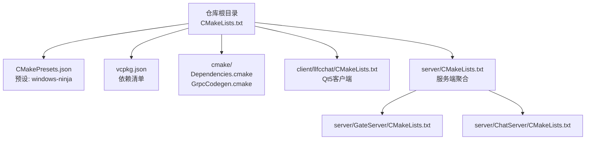
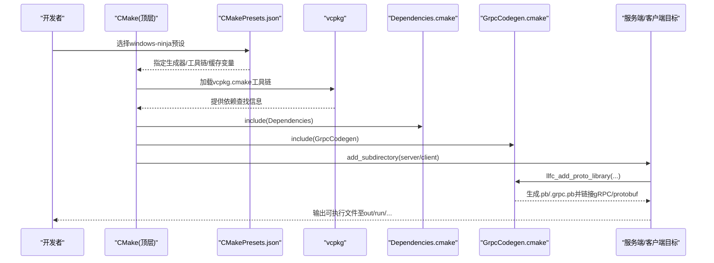
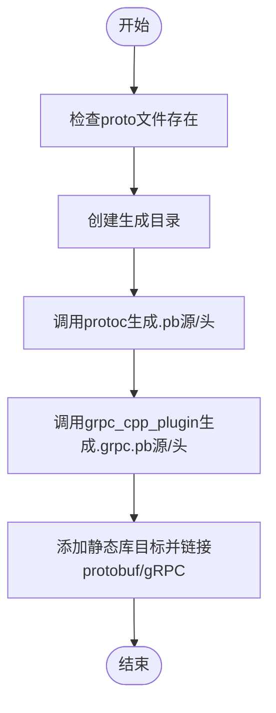
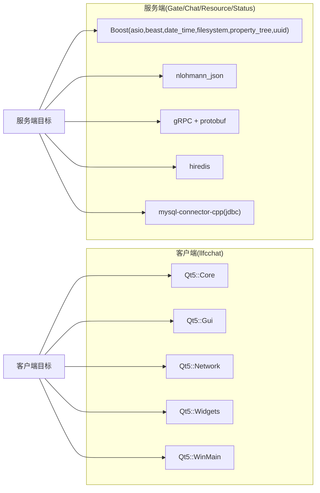

# 环境搭建

<cite>
**本文引用的文件**
- [CMakeLists.txt](file://CMakeLists.txt)
- [CMakePresets.json](file://CMakePresets.json)
- [vcpkg.json](file://vcpkg.json)
- [cmake/Dependencies.cmake](file://cmake/Dependencies.cmake)
- [cmake/GrpcCodegen.cmake](file://cmake/GrpcCodegen.cmake)
- [client/llfcchat/CMakeLists.txt](file://client/llfcchat/CMakeLists.txt)
- [server/CMakeLists.txt](file://server/CMakeLists.txt)
- [server/GateServer/CMakeLists.txt](file://server/GateServer/CMakeLists.txt)
- [server/ChatServer/CMakeLists.txt](file://server/ChatServer/CMakeLists.txt)
- [开发文档/day03-visualstudio配置boost和jsoncpp.md](file://开发文档/day03-visualstudio配置boost和jsoncpp.md)
- [开发文档/day07-visualstudio配置grpc.md](file://开发文档/day07-visualstudio配置grpc.md)
</cite>

## 目录
1. [简介](#简介)
2. [项目结构](#项目结构)
3. [核心组件](#核心组件)
4. [架构总览](#架构总览)
5. [详细组件分析](#详细组件分析)
6. [依赖分析](#依赖分析)
7. [性能考虑](#性能考虑)
8. [故障排查指南](#故障排查指南)
9. [结论](#结论)
10. [附录](#附录)

## 简介
本环境搭建文档面向LLFCChat项目的Windows与Linux开发环境，覆盖以下要点：
- 开发工具要求：Visual Studio（含MSVC）、CMake、Ninja、vcpkg
- Windows平台构建配置：Ninja Multi-Config生成器、MSVC编译器设置、静态MD运行时链接
- 依赖库安装与配置：Boost、gRPC、Protobuf、MySQL Connector、hiredis、Qt5等
- Qt5开发环境设置与插件集成
- 环境变量与路径设置、IDE集成建议
- Windows与Linux的差异与适配方法

## 项目结构
本项目采用CMake作为统一构建系统，顶层CMakeLists负责全局检查与子模块聚合；客户端与服务端分别有独立CMakeLists；依赖通过vcpkg管理；gRPC代码生成由自定义CMake脚本完成。

图表来源
- [CMakeLists.txt:1-34](file://CMakeLists.txt#L1-L34)
- [CMakePresets.json:1-36](file://CMakePresets.json#L1-L36)
- [vcpkg.json:1-32](file://vcpkg.json#L1-L32)
- [cmake/Dependencies.cmake:1-82](file://cmake/Dependencies.cmake#L1-L82)
- [cmake/GrpcCodegen.cmake:1-72](file://cmake/GrpcCodegen.cmake#L1-L72)
- [client/llfcchat/CMakeLists.txt:1-222](file://client/llfcchat/CMakeLists.txt#L1-L222)
- [server/CMakeLists.txt:1-38](file://server/CMakeLists.txt#L1-L38)
- [server/GateServer/CMakeLists.txt:1-92](file://server/GateServer/CMakeLists.txt#L1-L92)
- [server/ChatServer/CMakeLists.txt:1-111](file://server/ChatServer/CMakeLists.txt#L1-L111)

章节来源
- [CMakeLists.txt:1-34](file://CMakeLists.txt#L1-L34)
- [CMakePresets.json:1-36](file://CMakePresets.json#L1-L36)
- [vcpkg.json:1-32](file://vcpkg.json#L1-L32)

## 核心组件
- 构建系统与生成器
  - 强制使用“Ninja Multi-Config”生成器，禁止源码内构建
  - C++标准：服务端/根为C++17，客户端目标为C++11（由各自CMakeLists设定）
- vcpkg依赖管理
  - 依赖清单定义于vcpkg.json，包含Boost、nlohmann-json、gRPC、protobuf、hiredis、mysql-connector-cpp、Qt5-base、Qt5-imageformats
  - 安装目录默认指向仓库根下的vcpkg_installed
- gRPC代码生成
  - 通过cmake/GrpcCodegen.cmake中的函数封装protoc与grpc_cpp_plugin调用，生成.pb/.grpc.pb源并打包为静态库供各服务链接
- MSVC默认选项
  - 自动设置UTF-8编码、忽略特定警告、运行时库设置为多线程DLL（MD），便于与vcpkg包一致

章节来源
- [CMakeLists.txt:1-34](file://CMakeLists.txt#L1-L34)
- [vcpkg.json:1-32](file://vcpkg.json#L1-L32)
- [cmake/Dependencies.cmake:1-82](file://cmake/Dependencies.cmake#L1-L82)
- [cmake/GrpcCodegen.cmake:1-72](file://cmake/GrpcCodegen.cmake#L1-L72)
- [client/llfcchat/CMakeLists.txt:1-222](file://client/llfcchat/CMakeLists.txt#L1-L222)
- [server/CMakeLists.txt:1-38](file://server/CMakeLists.txt#L1-L38)

## 架构总览
下图展示从CMake预设到依赖解析、代码生成与最终产物输出的整体流程。

图表来源
- [CMakePresets.json:1-36](file://CMakePresets.json#L1-L36)
- [CMakeLists.txt:1-34](file://CMakeLists.txt#L1-L34)
- [cmake/Dependencies.cmake:1-82](file://cmake/Dependencies.cmake#L1-L82)
- [cmake/GrpcCodegen.cmake:1-72](file://cmake/GrpcCodegen.cmake#L1-L72)
- [server/CMakeLists.txt:1-38](file://server/CMakeLists.txt#L1-L38)
- [client/llfcchat/CMakeLists.txt:1-222](file://client/llfcchat/CMakeLists.txt#L1-L222)

## 详细组件分析

### Windows平台构建配置（Ninja + MSVC）
- 生成器与构建目录
  - 必须使用“Ninja Multi-Config”，且禁止in-source构建
  - 推荐通过CMakePresets的windows-ninja预设进行配置与构建
- 工具链与三元组
  - 工具链文件指向vcpkg/scripts/buildsystems/vcpkg.cmake
  - 目标三元组为x64-windows-static-md（静态库+动态运行时）
- MSVC编译选项
  - 统一启用UTF-8、关闭扩展、设置运行时库为MultiThreaded$<$<CONFIG:Debug>:Debug>DLL（即MD/MDd）
- 输出目录
  - 所有可执行文件输出到out/run/<CONFIG>/<subdir>，便于区分不同服务实例

章节来源
- [CMakeLists.txt:1-34](file://CMakeLists.txt#L1-L34)
- [CMakePresets.json:1-36](file://CMakePresets.json#L1-L36)
- [cmake/Dependencies.cmake:26-34](file://cmake/Dependencies.cmake#L26-L34)
- [cmake/Dependencies.cmake:70-82](file://cmake/Dependencies.cmake#L70-L82)
- [client/llfcchat/CMakeLists.txt:1-222](file://client/llfcchat/CMakeLists.txt#L1-L222)
- [server/CMakeLists.txt:1-38](file://server/CMakeLists.txt#L1-L38)

### vcpkg依赖安装与配置
- 依赖清单
  - Boost组件：asio、beast、date_time、filesystem、property_tree、uuid
  - JSON：nlohmann-json
  - RPC：grpc、protobuf
  - 缓存：hiredis
  - 数据库：mysql-connector-cpp（启用jdbc特性）
  - UI：qt5-base（禁用默认特性）、qt5-imageformats（启用webp）
- 安装命令（示例）
  - 在仓库根目录执行vcpkg install以根据vcpkg.json安装依赖
  - 确保VCPKG_ROOT已正确设置，CMake可通过toolchain文件找到vcpkg
- 安装目录
  - 默认安装到仓库根下的vcpkg_installed，CMake中通过缓存变量固定该路径

章节来源
- [vcpkg.json:1-32](file://vcpkg.json#L1-L32)
- [CMakeLists.txt:13-16](file://CMakeLists.txt#L13-L16)
- [CMakePresets.json:15-20](file://CMakePresets.json#L15-L20)

### gRPC代码生成流程
- 生成规则
  - 使用protobuf::protoc与gRPC::grpc_cpp_plugin生成.pb与.grpc.pb源文件
  - 将生成的源打包为静态库，供服务端各目标链接
- 预置Proto
  - 提供status_service/status.proto、verify_service/verify.proto、chat_service/chat.proto的生成封装

图表来源
- [cmake/GrpcCodegen.cmake:1-72](file://cmake/GrpcCodegen.cmake#L1-L72)

章节来源
- [cmake/GrpcCodegen.cmake:1-72](file://cmake/GrpcCodegen.cmake#L1-L72)

### Qt5客户端环境设置
- 依赖与模块
  - 需要Qt5 Core、Gui、Network、Widgets，以及WinMain入口
  - 启用AUTOMOC/AUTOUIC/AUTORCC处理moc/uic/rcc
- 插件导入
  - 通过qt5_import_plugins静态导入platforms、imageformats、styles插件（如QWindowsIntegrationPlugin、QGifPlugin、QJpegPlugin、QWebpPlugin、QWindowsVistaStylePlugin）
- 资源部署
  - 构建后自动复制config.ini与assets/static到可执行目录

章节来源
- [client/llfcchat/CMakeLists.txt:167-222](file://client/llfcchat/CMakeLists.txt#L167-L222)

### 服务端依赖与链接
- 通用依赖查找
  - Boost（asio/beast/date_time/filesystem/property_tree/uuid）、nlohmann_json、gRPC、Protobuf、hiredis、mysql-concpp
- 具体服务
  - GateServer：链接状态与验证Proto、Boost、JSON、hiredis、mysql-concpp
  - ChatServer：链接聊天与状态Proto、Boost、JSON、hiredis、mysql-concpp

章节来源
- [cmake/Dependencies.cmake:6-24](file://cmake/Dependencies.cmake#L6-L24)
- [server/GateServer/CMakeLists.txt:68-79](file://server/GateServer/CMakeLists.txt#L68-L79)
- [server/ChatServer/CMakeLists.txt:78-90](file://server/ChatServer/CMakeLists.txt#L78-L90)

### Visual Studio与IDE集成
- 属性管理器
  - 建议使用属性表集中管理包含目录、库目录与链接依赖，便于多项目复用
- 手动配置参考
  - 若不使用vcpkg，需按开发文档手动配置Boost、jsoncpp、gRPC的头文件与库路径、附加依赖项

章节来源
- [开发文档/day03-visualstudio配置boost和jsoncpp.md:1-194](file://开发文档/day03-visualstudio配置boost和jsoncpp.md#L1-L194)
- [开发文档/day07-visualstudio配置grpc.md:1-406](file://开发文档/day07-visualstudio配置grpc.md#L1-L406)

## 依赖分析
下图展示客户端与服务端对第三方库的依赖关系。

图表来源
- [client/llfcchat/CMakeLists.txt:191-207](file://client/llfcchat/CMakeLists.txt#L191-L207)
- [cmake/Dependencies.cmake:6-24](file://cmake/Dependencies.cmake#L6-L24)
- [server/GateServer/CMakeLists.txt:68-79](file://server/GateServer/CMakeLists.txt#L68-L79)
- [server/ChatServer/CMakeLists.txt:78-90](file://server/ChatServer/CMakeLists.txt#L78-L90)

章节来源
- [client/llfcchat/CMakeLists.txt:191-207](file://client/llfcchat/CMakeLists.txt#L191-L207)
- [cmake/Dependencies.cmake:6-24](file://cmake/Dependencies.cmake#L6-L24)
- [server/GateServer/CMakeLists.txt:68-79](file://server/GateServer/CMakeLists.txt#L68-L79)
- [server/ChatServer/CMakeLists.txt:78-90](file://server/ChatServer/CMakeLists.txt#L78-L90)

## 性能考虑
- 构建性能
  - 使用Ninja Multi-Config并行构建，配合vcpkg本地缓存减少重复下载与编译
- 运行期性能
  - 服务端使用Boost.Asio事件循环与线程池（AsioIOServicePool）提升并发处理能力
  - gRPC基于HTTP/2与Protobuf序列化，具备较高吞吐
  - 使用Redis作为缓存层降低数据库压力
- 资源部署
  - 构建后自动拷贝配置文件与静态资源，避免运行期路径问题导致的I/O开销

[本节为通用指导，不直接分析具体文件]

## 故障排查指南
- 生成器错误
  - 错误提示要求使用“Ninja Multi-Config”生成器，请检查CMake预设或命令行参数
- In-source构建错误
  - 必须在独立构建目录中进行配置与构建
- vcpkg未找到
  - 确认VCPKG_ROOT环境变量正确，CMakePresets中toolchainFile路径有效
  - 首次构建前执行vcpkg install以安装依赖
- Qt插件缺失
  - 确保qt5_import_plugins启用了必要的platforms/imageformats/styles插件
- gRPC代码生成失败
  - 检查proto文件路径是否正确，确保protobuf与gRPC插件可用
- 运行时库不一致
  - 确保所有依赖与目标均使用相同的运行时库模式（MD/MDd），避免链接冲突

章节来源
- [CMakeLists.txt:5-12](file://CMakeLists.txt#L5-L12)
- [CMakePresets.json:15-20](file://CMakePresets.json#L15-L20)
- [client/llfcchat/CMakeLists.txt:175-183](file://client/llfcchat/CMakeLists.txt#L175-L183)
- [cmake/GrpcCodegen.cmake:9-11](file://cmake/GrpcCodegen.cmake#L9-L11)

## 结论
通过统一的CMake预设与vcpkg依赖管理，LLFCChat项目在Windows平台上实现了标准化的构建流程。Ninja Multi-Config与MSVC MD运行时确保了高效的开发与一致的链接行为。gRPC代码生成与Qt插件静态导入进一步简化了跨模块依赖与资源部署。建议在团队内统一使用CMakePresets与vcpkg，以减少环境差异带来的构建问题。

[本节为总结性内容，不直接分析具体文件]

## 附录

### 环境变量与路径设置
- 必需环境变量
  - VCPKG_ROOT：指向vcpkg安装目录
  - PATH：包含CMake、Ninja、vcpkg的可执行路径
- 关键路径
  - vcpkg_installed：依赖安装目录（仓库根下）
  - out/run：构建产物输出目录（按配置分目录）

章节来源
- [CMakePresets.json:15-20](file://CMakePresets.json#L15-L20)
- [CMakeLists.txt:13-16](file://CMakeLists.txt#L13-L16)
- [cmake/Dependencies.cmake:70-82](file://cmake/Dependencies.cmake#L70-L82)

### Windows与Linux差异与适配
- Windows
  - 使用MSVC编译器，CMake预设windows-ninja，vcpkg三元组x64-windows-static-md
  - Qt插件与资源通过CMake命令自动部署
- Linux
  - 可使用Ninja或Unix Makefiles生成器，vcpkg三元组通常为x64-linux
  - Qt插件与资源部署方式可能不同，需根据平台调整CMake逻辑
- 代码层面
  - 服务端使用Boost.Asio与gRPC，跨平台兼容性好
  - 客户端依赖Qt5，UI相关代码需关注平台差异

[本节为通用指导，不直接分析具体文件]