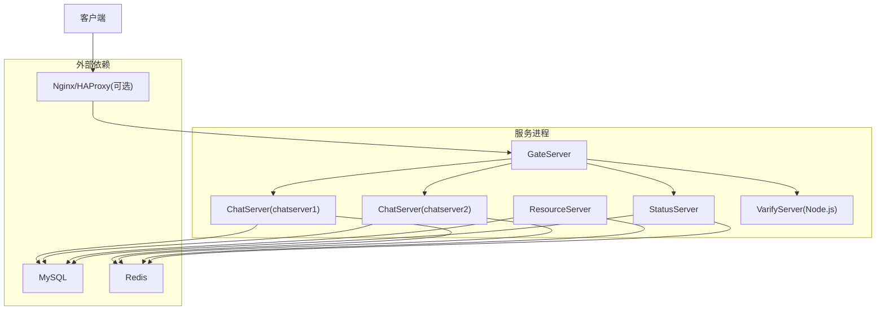
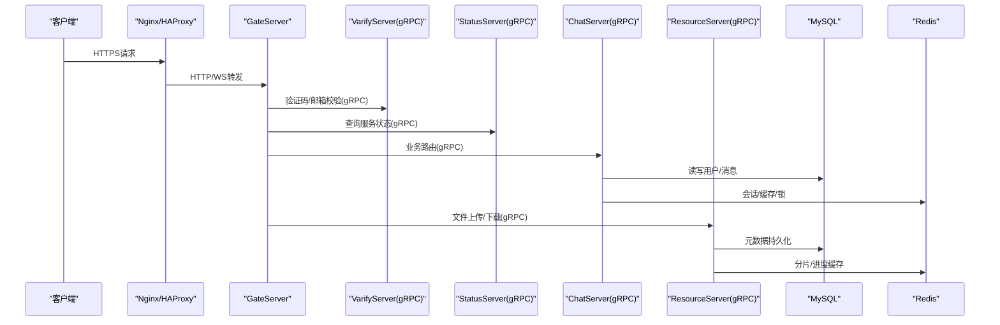
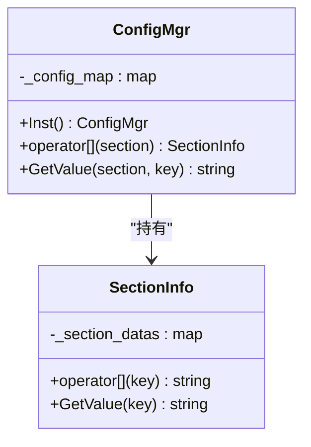
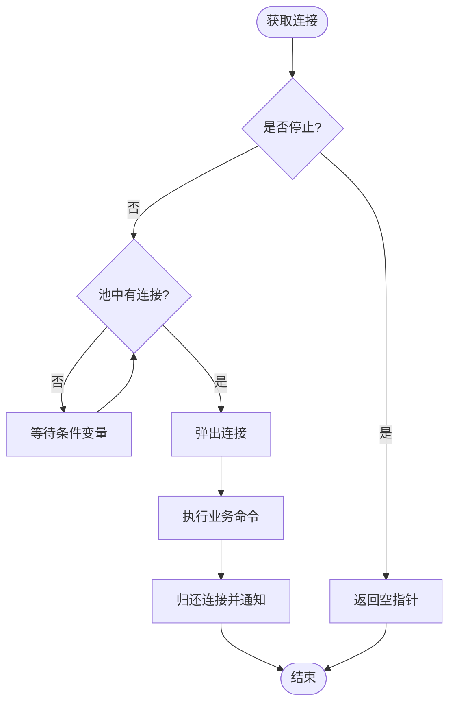

# 生产环境配置

<cite>
**本文引用的文件**   
- [ChatServer配置文件1](file://server/ChatServer/config/chatserver1.ini)
- [ChatServer配置文件2](file://server/ChatServer/config/chatserver2.ini)
- [GateServer配置文件](file://server/GateServer/config/config.ini)
- [ResourceServer配置文件](file://server/ResourceServer/config/config.ini)
- [StatusServer配置文件](file://server/StatusServer/config/config.ini)
- [ChatServer配置管理器头文件](file://server/ChatServer/include/ConfigMgr.h)
- [GateServer配置管理器头文件](file://server/GateServer/include/ConfigMgr.h)
- [ResourceServer配置管理器头文件](file://server/ResourceServer/include/ConfigMgr.h)
- [StatusServer配置管理器头文件](file://server/StatusServer/include/ConfigMgr.h)
- [ChatServer配置管理器实现](file://server/ChatServer/src/ConfigMgr.cpp)
- [GateServer配置管理器实现](file://server/GateServer/src/ConfigMgr.cpp)
- [ChatServer MySQL管理器头文件](file://server/ChatServer/include/MysqlMgr.h)
- [GateServer MySQL管理器头文件](file://server/GateServer/include/MysqlMgr.h)
- [ChatServer Redis管理器头文件](file://server/ChatServer/include/RedisMgr.h)
- [GateServer Redis管理器头文件](file://server/GateServer/include/RedisMgr.h)
- [ChatServer AsioIOServicePool头文件](file://server/ChatServer/include/AsioIOServicePool.h)
- [GateServer AsioIOServicePool头文件](file://server/GateServer/include/AsioIOServicePool.h)
</cite>

## 目录
1. [简介](#简介)
2. [项目结构](#项目结构)
3. [核心组件](#核心组件)
4. [架构总览](#架构总览)
5. [详细组件分析](#详细组件分析)
6. [依赖关系分析](#依赖关系分析)
7. [性能考虑](#性能考虑)
8. [故障排查指南](#故障排查指南)
9. [结论](#结论)
10. [附录](#附录)

## 简介
本指南面向LLFCChat项目的生产环境部署与运维，聚焦于各服务的配置文件结构与关键参数说明，涵盖数据库连接、Redis缓存、gRPC服务、线程池等核心配置；并提供负载均衡（Nginx/HAProxy）反向代理、会话保持、故障转移建议，以及高可用（主从复制、读写分离、数据同步）与性能调优（内存、连接池、超时）和安全配置（SSL、防火墙、访问控制）的落地方案。文档内容严格基于仓库中的配置文件与源码接口进行归纳与解读。

## 项目结构
LLFCChat服务端由多个独立进程组成：GateServer（网关）、ChatServer（聊天逻辑）、ResourceServer（资源/文件）、StatusServer（状态监控），以及一个Node.js验证服务VarifyServer。每个服务均通过INI配置文件管理运行时参数，并通过统一的配置管理器加载。



图表来源
- [ChatServer配置文件1](file://server/ChatServer/config/chatserver1.ini)
- [ChatServer配置文件2](file://server/ChatServer/config/chatserver2.ini)
- [GateServer配置文件](file://server/GateServer/config/config.ini)
- [ResourceServer配置文件](file://server/ResourceServer/config/config.ini)
- [StatusServer配置文件](file://server/StatusServer/config/config.ini)

章节来源
- [ChatServer配置文件1](file://server/ChatServer/config/chatserver1.ini)
- [ChatServer配置文件2](file://server/ChatServer/config/chatserver2.ini)
- [GateServer配置文件](file://server/GateServer/config/config.ini)
- [ResourceServer配置文件](file://server/ResourceServer/config/config.ini)
- [StatusServer配置文件](file://server/StatusServer/config/config.ini)

## 核心组件
- 配置管理器（ConfigMgr）：统一读取INI配置，提供按Section和Key取值能力。各服务均包含独立的ConfigMgr实现，默认从当前工作目录下的config.ini加载。
- 数据库访问（MysqlMgr/MysqlDao）：封装用户注册、认证、好友关系、聊天消息等SQL操作。
- 缓存与分布式锁（RedisMgr/RedisConPool）：连接池化、健康检查、自动重连、原子计数、分布式锁获取与释放。
- IO线程池（AsioIOServicePool）：基于Boost.Asio的io_context多实例轮询分配，默认线程数可配置或按硬件并发自适应。

章节来源
- [ChatServer配置管理器头文件](file://server/ChatServer/include/ConfigMgr.h)
- [GateServer配置管理器头文件](file://server/GateServer/include/ConfigMgr.h)
- [ResourceServer配置管理器头文件](file://server/ResourceServer/include/ConfigMgr.h)
- [StatusServer配置管理器头文件](file://server/StatusServer/include/ConfigMgr.h)
- [ChatServer配置管理器实现](file://server/ChatServer/src/ConfigMgr.cpp)
- [GateServer配置管理器实现](file://server/GateServer/src/ConfigMgr.cpp)
- [ChatServer MySQL管理器头文件](file://server/ChatServer/include/MysqlMgr.h)
- [GateServer MySQL管理器头文件](file://server/GateServer/include/MysqlMgr.h)
- [ChatServer Redis管理器头文件](file://server/ChatServer/include/RedisMgr.h)
- [GateServer Redis管理器头文件](file://server/GateServer/include/RedisMgr.h)
- [ChatServer AsioIOServicePool头文件](file://server/ChatServer/include/AsioIOServicePool.h)
- [GateServer AsioIOServicePool头文件](file://server/GateServer/include/AsioIOServicePool.h)

## 架构总览
下图展示了生产环境下典型的数据流与控制流：客户端经反向代理接入GateServer，Gate负责鉴权与路由，转发至ChatServer或ResourceServer；状态服务StatusServer聚合各ChatServer状态；所有服务共享MySQL与Redis。



图表来源
- [GateServer配置文件](file://server/GateServer/config/config.ini)
- [ChatServer配置文件1](file://server/ChatServer/config/chatserver1.ini)
- [ChatServer配置文件2](file://server/ChatServer/config/chatserver2.ini)
- [ResourceServer配置文件](file://server/ResourceServer/config/config.ini)
- [StatusServer配置文件](file://server/StatusServer/config/config.ini)

## 详细组件分析

### 配置系统（INI + ConfigMgr）
- 配置文件位置与命名
  - ChatServer使用chatserver1.ini与chatserver2.ini区分节点，包含SelfServer、PeerServer、Mysql、Redis、RPC端口等。
  - GateServer、ResourceServer、StatusServer各自拥有config.ini，定义自身监听端口、依赖服务地址与数据库/缓存连接。
- 配置项说明（节选）
  - [GateServer]Port：HTTP/WS入口端口。
  - [VarifyServer]Host/Port：验证码与邮箱校验服务gRPC地址。
  - [StatusServer]Host/Port：状态服务gRPC地址。
  - [SelfServer]Name/Host/Port/RPCPort：服务标识、监听地址、业务端口与RPC端口。
  - [Mysql]Host/Port/User/Passwd/Schema：数据库连接信息。
  - [Redis]Host/Port/Passwd：缓存与分布式锁服务连接。
  - [PeerServer]/[chatservers]：对端ChatServer列表，用于横向扩展与状态同步。
  - [Output]/[Static]：ResourceServer的文件输出与静态目录路径。
- 配置加载机制
  - 各服务ConfigMgr在构造时读取当前工作目录下的config.ini，解析为Section与Key-Value映射，并提供GetValue(section,key)接口。
  - ResourceServer额外提供GetFileOutPath()与InitPath()以处理输出路径。



图表来源
- [ChatServer配置管理器头文件](file://server/ChatServer/include/ConfigMgr.h)
- [GateServer配置管理器头文件](file://server/GateServer/include/ConfigMgr.h)
- [ResourceServer配置管理器头文件](file://server/ResourceServer/include/ConfigMgr.h)
- [StatusServer配置管理器头文件](file://server/StatusServer/include/ConfigMgr.h)
- [ChatServer配置管理器实现](file://server/ChatServer/src/ConfigMgr.cpp)
- [GateServer配置管理器实现](file://server/GateServer/src/ConfigMgr.cpp)

章节来源
- [ChatServer配置文件1](file://server/ChatServer/config/chatserver1.ini)
- [ChatServer配置文件2](file://server/ChatServer/config/chatserver2.ini)
- [GateServer配置文件](file://server/GateServer/config/config.ini)
- [ResourceServer配置文件](file://server/ResourceServer/config/config.ini)
- [StatusServer配置文件](file://server/StatusServer/config/config.ini)
- [ChatServer配置管理器头文件](file://server/ChatServer/include/ConfigMgr.h)
- [GateServer配置管理器头文件](file://server/GateServer/include/ConfigMgr.h)
- [ResourceServer配置管理器头文件](file://server/ResourceServer/include/ConfigMgr.h)
- [StatusServer配置管理器头文件](file://server/StatusServer/include/ConfigMgr.h)
- [ChatServer配置管理器实现](file://server/ChatServer/src/ConfigMgr.cpp)
- [GateServer配置管理器实现](file://server/GateServer/src/ConfigMgr.cpp)

### 数据库连接（MySQL）
- 连接参数
  - Host/Port/User/Passwd/Schema在各服务config中声明，确保跨服务一致。
- 访问封装
  - MysqlMgr暴露用户注册、密码校验、好友申请、聊天消息分页加载等接口，内部通过MysqlDao执行SQL。
- 生产建议
  - 使用连接池（若未内置，建议在DAO层引入）并设置最大连接数、空闲回收、超时重试。
  - 读写分离可通过不同Schema或只读副本，结合应用层路由策略。

章节来源
- [ChatServer MySQL管理器头文件](file://server/ChatServer/include/MysqlMgr.h)
- [GateServer MySQL管理器头文件](file://server/GateServer/include/MysqlMgr.h)
- [ChatServer配置文件1](file://server/ChatServer/config/chatserver1.ini)
- [GateServer配置文件](file://server/GateServer/config/config.ini)

### 缓存与分布式锁（Redis）
- 连接参数
  - Host/Port/Passwd在配置中声明，服务启动时初始化连接池。
- 连接池与健康检查
  - RedisConPool维护固定大小连接队列，周期性PING检测存活，失败连接自动重建并回收到池中。
  - 支持非阻塞取连接与条件变量等待，避免忙等。
- 功能接口
  - 基本KV、List、Hash操作；ExistsKey、Del；分布式锁acquireLock/releaseLock；服务器计数IncreaseCount/DecreaseCount等。
- 生产建议
  - 合理设置poolSize（建议≥CPU核数×2），根据QPS调整PING周期与超时；启用TLS与ACL白名单。



图表来源
- [ChatServer Redis管理器头文件](file://server/ChatServer/include/RedisMgr.h)
- [GateServer Redis管理器头文件](file://server/GateServer/include/RedisMgr.h)

章节来源
- [ChatServer Redis管理器头文件](file://server/ChatServer/include/RedisMgr.h)
- [GateServer Redis管理器头文件](file://server/GateServer/include/RedisMgr.h)
- [ChatServer配置文件1](file://server/ChatServer/config/chatserver1.ini)
- [GateServer配置文件](file://server/GateServer/config/config.ini)

### gRPC服务配置
- 服务发现与路由
  - GateServer通过[VarifyServer]与[StatusServer]配置调用验证码与状态服务。
  - ChatServer通过[PeerServer]与对端节点通信；ResourceServer通过[chatserver1/2]配置与聊天服务交互。
- 端口规划
  - 业务端口（HTTP/WS）与RPC端口（gRPC）分离，便于安全隔离与限流。
- 生产建议
  - 使用mTLS双向认证；配置超时与重试策略；通过StatusServer做健康检查与动态路由。

章节来源
- [GateServer配置文件](file://server/GateServer/config/config.ini)
- [ChatServer配置文件1](file://server/ChatServer/config/chatserver1.ini)
- [ChatServer配置文件2](file://server/ChatServer/config/chatserver2.ini)
- [ResourceServer配置文件](file://server/ResourceServer/config/config.ini)
- [StatusServer配置文件](file://server/StatusServer/config/config.ini)

### 线程池与IO模型
- AsioIOServicePool
  - 多io_context实例，轮询分配任务，默认线程数为硬件并发或显式配置（GateServer示例为2）。
  - Stop方法优雅关闭，WorkGuard保证io_context不提前退出。
- 生产建议
  - 根据CPU核数与I/O密集型特性调整线程数；将CPU密集与网络I/O任务分离到不同池。

章节来源
- [ChatServer AsioIOServicePool头文件](file://server/ChatServer/include/AsioIOServicePool.h)
- [GateServer AsioIOServicePool头文件](file://server/GateServer/include/AsioIOServicePool.h)

## 依赖关系分析
- 服务间依赖
  - GateServer依赖VarifyServer与StatusServer；ChatServer之间通过PeerServer互相感知；ResourceServer依赖ChatServer与存储。
- 存储依赖
  - 所有服务共享MySQL与Redis，需确保连接参数一致且具备高可用。
- 配置耦合
  - 各服务ConfigMgr默认读取当前目录config.ini，部署时需确保工作目录与配置文件路径一致。

```mermaid
graph LR
Gate["GateServer"] --> Verify["VarifyServer"]
Gate --> Status["StatusServer"]
Gate --> Chat1["ChatServer1"]
Gate --> Chat2["ChatServer2"]
Chat1 < --> Chat2
Chat1 --> DB["MySQL"]
Chat2 --> DB
Chat1 --> RC["Redis"]
Chat2 --> RC
Res["ResourceServer"] --> DB
Res --> RC
Res --> Chat1
Res --> Chat2
```

图表来源
- [GateServer配置文件](file://server/GateServer/config/config.ini)
- [ChatServer配置文件1](file://server/ChatServer/config/chatserver1.ini)
- [ChatServer配置文件2](file://server/ChatServer/config/chatserver2.ini)
- [ResourceServer配置文件](file://server/ResourceServer/config/config.ini)
- [StatusServer配置文件](file://server/StatusServer/config/config.ini)

章节来源
- [GateServer配置文件](file://server/GateServer/config/config.ini)
- [ChatServer配置文件1](file://server/ChatServer/config/chatserver1.ini)
- [ChatServer配置文件2](file://server/ChatServer/config/chatserver2.ini)
- [ResourceServer配置文件](file://server/ResourceServer/config/config.ini)
- [StatusServer配置文件](file://server/StatusServer/config/config.ini)

## 性能考虑
- 内存分配
  - 根据峰值QPS与消息体大小估算堆内存，开启jemalloc（如可用）减少碎片。
- 连接池大小
  - MySQL：建议max_connections≈(CPU核数×2~4)+缓冲；Redis：poolSize≥CPU核数×2，并根据延迟压测调整。
- 超时配置
  - gRPC：设置合理的deadline与重试次数；TCP/HTTP：连接、读、写超时分层配置。
- I/O模型
  - AsioIOServicePool线程数按负载类型调优；长连接与短连接分离处理。
- 缓存策略
  - 热点数据TTL分级；分布式锁尽量缩短持有时间；避免大对象入缓存。

[本节为通用指导，无需特定文件引用]

## 故障排查指南
- 配置加载失败
  - 确认当前工作目录下存在config.ini且格式正确；检查ConfigMgr日志输出路径。
- Redis连接异常
  - 检查AUTH密码、端口连通性；观察健康检查线程日志与fail_count变化；必要时重启连接池。
- MySQL连接耗尽
  - 监控连接数与慢查询；检查事务是否及时提交；适当扩容或优化SQL。
- gRPC不可用
  - 核对目标服务Host/Port；检查防火墙与安全组；查看StatusServer状态。
- 线程池饥饿
  - 观察CPU使用率与任务堆积；调整AsioIOServicePool线程数或拆分任务类型。

章节来源
- [ChatServer配置管理器实现](file://server/ChatServer/src/ConfigMgr.cpp)
- [GateServer配置管理器实现](file://server/GateServer/src/ConfigMgr.cpp)
- [ChatServer Redis管理器头文件](file://server/ChatServer/include/RedisMgr.h)
- [GateServer Redis管理器头文件](file://server/GateServer/include/RedisMgr.h)

## 结论
LLFCChat采用多服务解耦与INI集中配置的模式，配合连接池化的Redis与标准化的gRPC通信，具备良好的可扩展性与可观测性。生产环境中应重点关注配置一致性、连接池与超时参数、gRPC安全与可用性、以及存储层的高可用与性能调优。通过合理的负载均衡与故障转移策略，可实现稳定高效的在线聊天服务。

[本节为总结性内容，无需特定文件引用]

## 附录

### 负载均衡与反向代理（Nginx/HAProxy）
- 入口与协议
  - Nginx监听HTTPS，转发HTTP/WS到GateServer；后端Upstream配置多Gate实例。
- 会话保持
  - WebSocket场景建议使用IP Hash或Cookie持久化，避免频繁重连导致状态丢失。
- 故障转移
  - 配置健康检查与备用节点；对gRPC服务启用重试与熔断。
- 安全
  - 启用TLS终止与HSTS；限制源IP白名单；对敏感接口加鉴权。

[本节为概念性指导，无需特定文件引用]

### 高可用架构（主从复制、读写分离、数据同步）
- MySQL主从
  - 主库写入，从库只读；应用层按操作类型路由；使用GTID或半同步保障一致性。
- 读写分离
  - 通过中间件或应用层路由实现；热点读走从库，写走主库。
- 数据同步
  - 跨机房可使用异步复制+补偿机制；重要数据开启binlog与备份策略。

[本节为概念性指导，无需特定文件引用]

### 安全配置（SSL、防火墙、访问控制）
- SSL证书
  - 为Nginx配置证书与私钥；gRPC启用mTLS双向认证。
- 防火墙规则
  - 仅开放必要端口（如80/443、服务内网端口）；限制来源IP段。
- 访问控制
  - 对API与RPC接口实施鉴权与速率限制；敏感操作二次确认。

[本节为概念性指导，无需特定文件引用]