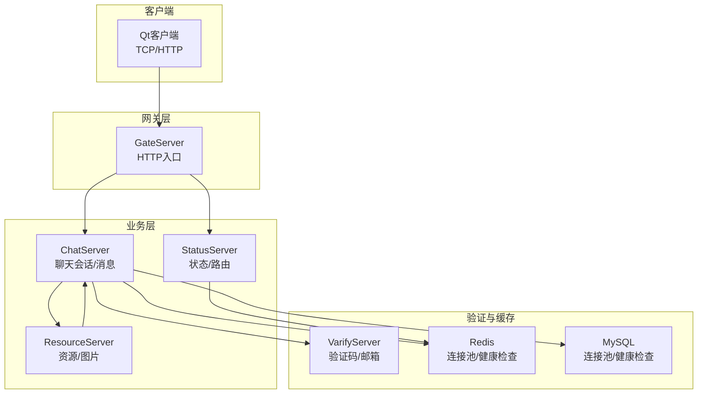
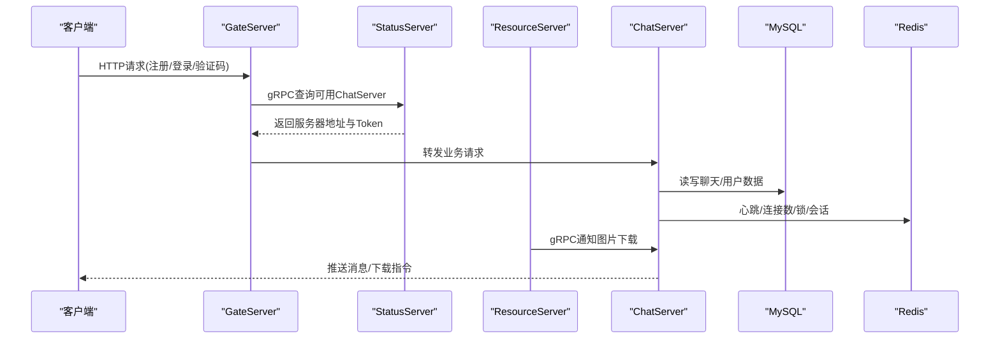
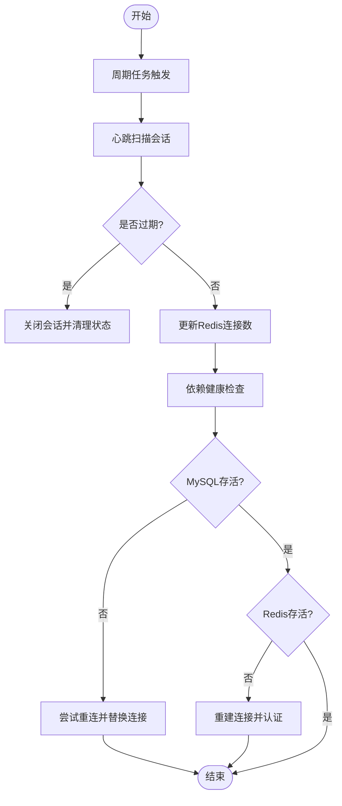
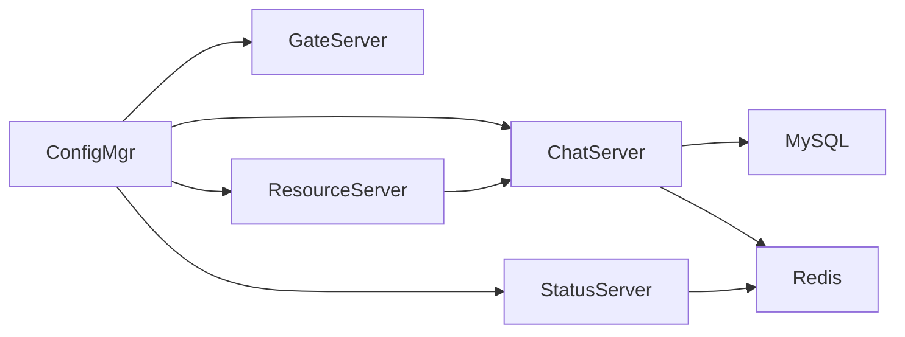

# 监控告警

<cite>
**本文引用的文件**   
- [README.md](file://README.md)
- [ChatServer1配置](file://server/ChatServer/config/chatserver1.ini)
- [GateServer配置](file://server/GateServer/config/config.ini)
- [ConfigMgr接口（ChatServer）](file://server/ChatServer/include/ConfigMgr.h)
- [ConfigMgr实现（ChatServer）](file://server/ChatServer/src/ConfigMgr.cpp)
- [MysqlDao健康检查与重连（ChatServer）](file://server/ChatServer/include/MysqlDao.h)
- [RedisMgr健康检查（ChatServer）](file://server/ChatServer/include/RedisMgr.h)
- [StatusServiceImpl（状态服务）](file://server/StatusServer/src/StatusServiceImpl.cpp)
- [utils时间戳工具](file://server/ChatServer/include/utils.h)
- [LogicSystem消息处理片段](file://server/ChatServer/src/LogicSystem.cpp)
- [ResourceServer Grpc客户端通知图片下载](file://server/ResourceServer/src/ChatServerGrpcClient.cpp)
- [VarifyServer配置](file://server/VarifyServer/config.js)
- [VarifyServer常量定义](file://server/VarifyServer/const.js)
- [心跳逻辑开发文档](file://开发文档/day35心跳逻辑.md)
- [单服程踢人逻辑开发文档](file://开发文档/day33单服程踢人逻辑.md)
- [分布式服务设计（状态服务）](file://开发文档/day27-分布式服务设计.md)
- [登录功能（状态服务启动）](file://开发文档/day14-登录功能.md)
- [Qt TCP错误处理示例](file://client/llfcchat/src/tcpmgr.cpp)
- [文件传输进度日志示例](file://client/llfcchat/src/filetcpmgr.cpp)
</cite>

## 目录
1. [简介](#简介)
2. [项目结构](#项目结构)
3. [核心组件](#核心组件)
4. [架构总览](#架构总览)
5. [详细组件分析](#详细组件分析)
6. [依赖关系分析](#依赖关系分析)
7. [性能考虑](#性能考虑)
8. [故障排查指南](#故障排查指南)
9. [结论](#结论)
10. [附录](#附录)

## 简介
本文件为LLFCChat项目的监控告警体系设计文档，覆盖以下方面：
- 日志收集方案：结构化日志格式、日志级别管理、日志轮转策略
- 性能监控：关键指标采集、APM集成建议、性能分析工具使用
- 健康检查机制：服务状态检测、依赖服务检查、自动恢复策略
- 告警规则配置：阈值设置、通知渠道、升级策略
- 监控面板搭建：Grafana仪表板、关键指标可视化、实时监控展示
- 异常检测与故障定位方法

本项目当前已具备：
- 多服务架构（ChatServer、GateServer、ResourceServer、StatusServer、VarifyServer）
- Redis连接池与健康检查、MySQL连接池与存活检测及自动重连
- 心跳与连接数统计写入Redis，用于负载均衡与健康判断
- 基于gRPC的状态服务与消息通知通道
- 客户端侧的TCP错误处理与进度日志

## 项目结构
- 服务端包含多个独立进程，各自通过配置文件加载运行参数，并通过Redis、MySQL、gRPC进行通信与协作。
- 客户端基于Qt网络模块，提供HTTP/TCP能力，并输出调试日志。
- 开发文档中记录了心跳、踢人、状态服务等关键流程的实现思路。

**图表来源** 
- [ChatServer1配置:1-30](file://server/ChatServer/config/chatserver1.ini#L1-L30)
- [GateServer配置:1-25](file://server/GateServer/config/config.ini#L1-L25)
- [StatusServiceImpl（状态服务）:1-125](file://server/StatusServer/src/StatusServiceImpl.cpp#L1-L125)
- [心跳逻辑开发文档:41-92](file://开发文档/day35心跳逻辑.md#L41-L92)

**章节来源**
- [README.md:1-112](file://README.md#L1-L112)

## 核心组件
- ConfigMgr：统一读取INI配置，提供按Section/Key访问能力，支撑各服务动态获取端口、主机、数据库与缓存信息。
- MysqlDao：维护MySQL连接池，周期性执行“SELECT 1”健康检查，失败计数驱动自动重连。
- RedisMgr：维护Redis连接池，周期性PING探测，失败时重建连接并重新认证。
- StatusServiceImpl：状态服务，负责根据配置返回ChatServer列表，结合Redis中的连接数做负载选择（可选）。
- LogicSystem：消息处理与转发，生成时间戳并构造JSON/Protobuf消息。
- ResourceServer Grpc客户端：根据消息ID查询存储路径，计算文件大小，通过gRPC通知ChatServer触发客户端异步下载。

**章节来源**
- [ConfigMgr接口（ChatServer）:65-82](file://server/ChatServer/include/ConfigMgr.h#L65-L82)
- [ConfigMgr实现（ChatServer）:1-30](file://server/ChatServer/src/ConfigMgr.cpp#L1-L30)
- [MysqlDao健康检查与重连（ChatServer）:42-160](file://server/ChatServer/include/MysqlDao.h#L42-L160)
- [RedisMgr健康检查（ChatServer）:198-246](file://server/ChatServer/include/RedisMgr.h#L198-L246)
- [StatusServiceImpl（状态服务）:1-125](file://server/StatusServer/src/StatusServiceImpl.cpp#L1-L125)
- [LogicSystem消息处理片段:435-478](file://server/ChatServer/src/LogicSystem.cpp#L435-L478)
- [ResourceServer Grpc客户端通知图片下载:1-40](file://server/ResourceServer/src/ChatServerGrpcClient.cpp#L1-L40)

## 架构总览
下图展示了从客户端到各后端服务的调用链，以及健康检查与监控数据流向。

**图表来源** 
- [GateServer配置:1-25](file://server/GateServer/config/config.ini#L1-L25)
- [ChatServer1配置:1-30](file://server/ChatServer/config/chatserver1.ini#L1-L30)
- [StatusServiceImpl（状态服务）:1-125](file://server/StatusServer/src/StatusServiceImpl.cpp#L1-L125)
- [ResourceServer Grpc客户端通知图片下载:1-40](file://server/ResourceServer/src/ChatServerGrpcClient.cpp#L1-L40)
- [心跳逻辑开发文档:644-730](file://开发文档/day35心跳逻辑.md#L644-L730)

## 详细组件分析

### 日志收集方案
- 现状
  - 服务端广泛使用标准输出打印错误与诊断信息（如连接失败、重连、异常等），便于容器或系统日志采集器收集。
  - 客户端使用qDebug输出网络错误、文件传输进度等，便于本地调试与问题复现。
- 结构化日志建议
  - 字段规范：timestamp、level、service、host、trace_id、msg、extra（键值对）
  - 输出格式：JSON行（每行一条记录），便于ELK/Fluentd/Filebeat解析
  - 日志级别：DEBUG/INFO/WARN/ERROR/FATAL，按模块开关控制
- 日志轮转策略
  - 按大小（如100MB）或时间（每日）切分，保留N天，压缩归档
  - 避免在高频路径上直接I/O，采用异步队列+批量落盘
- 采集与聚合
  - 服务端：Filebeat/FluentBit采集stdout或文件；客户端：本地日志上传或导出
  - 统一索引：ES + Kibana，建立服务维度、错误码维度、链路追踪维度

[本节为通用指导，不直接分析具体文件]

### 性能监控实现
- 关键指标采集
  - 服务级：QPS、P95/P99延迟、错误率、线程/协程数、内存/CPU占用
  - 依赖级：MySQL连接池活跃/空闲、慢查询、重连次数；Redis连接池健康、命令延迟、命中率
  - 业务级：在线会话数、消息吞吐、图片下载成功率、验证码发送成功率
- APM集成建议
  - 服务端：OpenTelemetry SDK埋点（gRPC/HTTP/DB/Cache），TraceID贯穿全链路
  - 客户端：SDK上报关键事件（登录、消息收发、下载进度、错误）
- 性能分析工具
  - Linux：perf、flamegraph、eBPF（bpftrace）
  - Windows：Visual Studio Profiler、PerfView
  - 数据库：慢查询日志、EXPLAIN、Redis INFO/慢日志

[本节为通用指导，不直接分析具体文件]

### 健康检查机制
- 服务状态检测
  - 心跳：定时扫描会话，清理超时连接，更新Redis中的连接数
  - 依赖健康：MySQL“SELECT 1”、Redis“PING”，失败则标记并尝试重连
- 自动恢复策略
  - 指数退避重试，限制最大重试次数
  - 连接池隔离，失败连接快速剔除，新连接替换
- 健康端点
  - 暴露HTTP/gRPC健康接口，供外部探针（Prometheus、K8s Liveness/Readiness）探测

**图表来源** 
- [MysqlDao健康检查与重连（ChatServer）:62-123](file://server/ChatServer/include/MysqlDao.h#L62-L123)
- [RedisMgr健康检查（ChatServer）:209-246](file://server/ChatServer/include/RedisMgr.h#L209-L246)
- [心跳逻辑开发文档:644-730](file://开发文档/day35心跳逻辑.md#L644-L730)

**章节来源**
- [MysqlDao健康检查与重连（ChatServer）:62-123](file://server/ChatServer/include/MysqlDao.h#L62-L123)
- [RedisMgr健康检查（ChatServer）:209-246](file://server/ChatServer/include/RedisMgr.h#L209-L246)
- [心跳逻辑开发文档:644-730](file://开发文档/day35心跳逻辑.md#L644-L730)

### 告警规则配置
- 阈值建议
  - 错误率：>1%持续1分钟触发警告，>5%严重告警
  - 延迟：P95>500ms警告，>1s严重
  - 依赖：MySQL重连次数>3次/分钟，Redis PING失败>2次/分钟
  - 会话：在线会话数突降>30%，可能表示服务异常或网络抖动
- 通知渠道
  - 企业微信/钉钉机器人、邮件、短信、电话（严重）
- 升级策略
  - 首次告警通知值班人员，未处理超过N分钟升级至二线/三线
  - 同一告警去重与抑制，避免风暴

[本节为通用指导，不直接分析具体文件]

### 监控面板搭建（Grafana）
- 数据源
  - Prometheus（指标）、Elasticsearch（日志）、Jaeger（链路）
- 关键面板
  - 服务概览：QPS、错误率、延迟分布、CPU/内存
  - 依赖面板：MySQL连接池、慢查询、Redis命中率、命令延迟
  - 业务面板：在线会话数、消息吞吐、图片下载成功率
  - 日志面板：错误关键词、堆栈、TraceID检索
- 实时展示
  - 使用热图、折线、仪表盘组合呈现趋势与异常

[本节为通用指导，不直接分析具体文件]

### 异常检测与故障定位
- 异常检测
  - 指标突变检测（环比/同比）、依赖健康状态变化、错误码集中出现
- 故障定位
  - 通过TraceID串联客户端、网关、业务、依赖调用链
  - 结合日志关键字（如“Error keeping connection alive”、“read failed”）快速定位
  - 使用性能分析工具定位热点函数与锁竞争

**章节来源**
- [单服程踢人逻辑开发文档:397-460](file://开发文档/day33单服程踢人逻辑.md#L397-L460)
- [Qt TCP错误处理示例:63-90](file://client/llfcchat/src/tcpmgr.cpp#L63-L90)
- [文件传输进度日志示例:399-433](file://client/llfcchat/src/filetcpmgr.cpp#L399-L433)

## 依赖关系分析
- 配置依赖：各服务通过ConfigMgr读取INI配置，确保端口、主机、数据库与缓存信息一致
- 运行时依赖：ChatServer依赖MySQL与Redis，ResourceServer依赖ChatServer的gRPC接口
- 健康依赖：Redis与MySQL的健康直接影响服务可用性，需纳入监控与告警

**图表来源** 
- [ConfigMgr接口（ChatServer）:65-82](file://server/ChatServer/include/ConfigMgr.h#L65-L82)
- [ConfigMgr实现（ChatServer）:1-30](file://server/ChatServer/src/ConfigMgr.cpp#L1-L30)
- [ChatServer1配置:1-30](file://server/ChatServer/config/chatserver1.ini#L1-L30)
- [GateServer配置:1-25](file://server/GateServer/config/config.ini#L1-L25)

**章节来源**
- [ConfigMgr接口（ChatServer）:65-82](file://server/ChatServer/include/ConfigMgr.h#L65-L82)
- [ConfigMgr实现（ChatServer）:1-30](file://server/ChatServer/src/ConfigMgr.cpp#L1-L30)
- [ChatServer1配置:1-30](file://server/ChatServer/config/chatserver1.ini#L1-L30)
- [GateServer配置:1-25](file://server/GateServer/config/config.ini#L1-L25)

## 性能考虑
- 连接池优化：合理设置MySQL/Redis连接池大小，避免过大导致资源争用或过小导致阻塞
- 心跳间隔：60秒心跳兼顾实时性与开销，可根据负载调整
- 异步化：IO操作与日志落盘异步化，减少主线程阻塞
- 缓存命中：提升Redis命中率，降低数据库压力
- 限流与熔断：对上游依赖实施限流与熔断，防止雪崩

[本节为通用指导，不直接分析具体文件]

## 故障排查指南
- 常见问题
  - 连接失败：检查MySQL/Redis配置、网络连通性、认证信息
  - 心跳超时：检查客户端网络、服务端会话清理逻辑、分布式锁
  - 图片下载失败：确认资源路径、文件大小、gRPC通知是否成功
- 排查步骤
  - 查看服务日志与客户端日志，定位错误码与堆栈
  - 检查依赖健康状态（MySQL/Redis）
  - 使用TraceID追踪调用链，定位瓶颈环节
  - 必要时重启服务或扩容实例

**章节来源**
- [单服程踢人逻辑开发文档:397-460](file://开发文档/day33单服程踢人逻辑.md#L397-L460)
- [Qt TCP错误处理示例:63-90](file://client/llfcchat/src/tcpmgr.cpp#L63-L90)
- [文件传输进度日志示例:399-433](file://client/llfcchat/src/filetcpmgr.cpp#L399-L433)

## 结论
LLFCChat项目已具备完善的多服务架构与基础健康检查能力。通过引入结构化日志、性能监控、健康端点与告警体系，可显著提升系统的可观测性与稳定性。建议优先落地日志标准化、依赖健康监控与关键指标采集，逐步完善APM与自动化告警闭环。

[本节为总结，不直接分析具体文件]

## 附录
- 相关配置与实现参考
  - [ChatServer1配置:1-30](file://server/ChatServer/config/chatserver1.ini#L1-L30)
  - [GateServer配置:1-25](file://server/GateServer/config/config.ini#L1-L25)
  - [StatusServiceImpl（状态服务）:1-125](file://server/StatusServer/src/StatusServiceImpl.cpp#L1-L125)
  - [VarifyServer配置:1-14](file://server/VarifyServer/config.js#L1-L14)
  - [VarifyServer常量定义:1-10](file://server/VarifyServer/const.js#L1-L10)
  - [登录功能（状态服务启动）:452-518](file://开发文档/day14-登录功能.md#L452-L518)
  - [分布式服务设计（状态服务）:445-486](file://开发文档/day27-分布式服务设计.md#L445-L486)
  - [utils时间戳工具:1-7](file://server/ChatServer/include/utils.h#L1-L7)

[本节为参考清单，不直接分析具体文件]