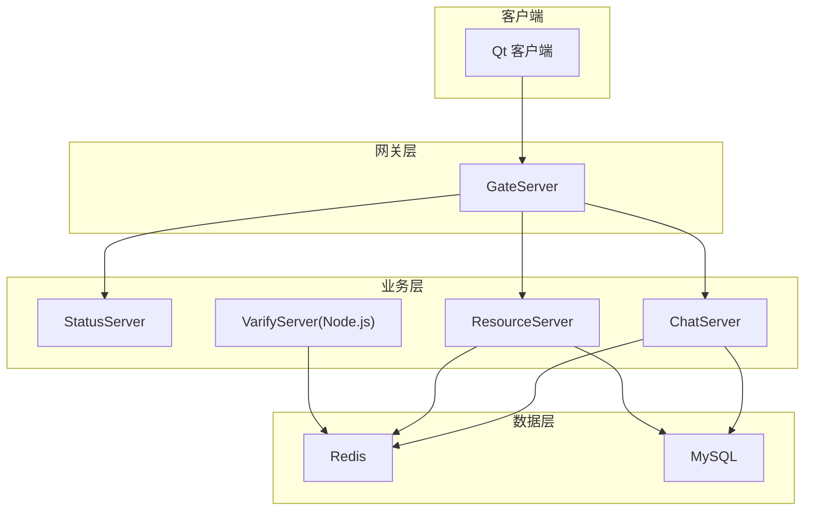
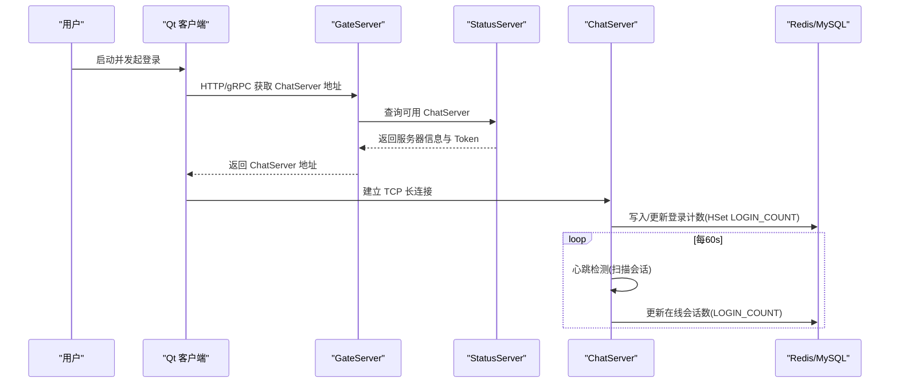
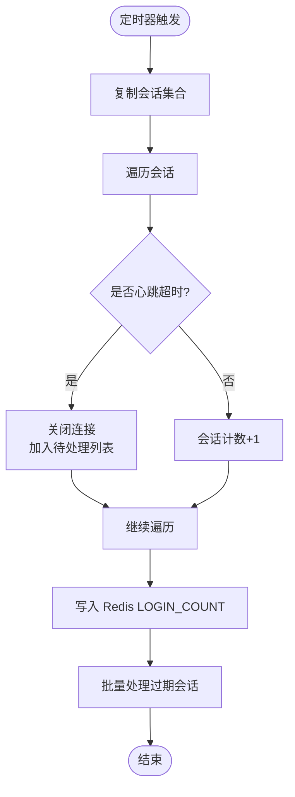
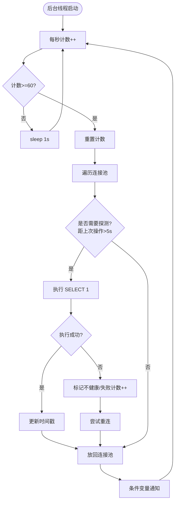
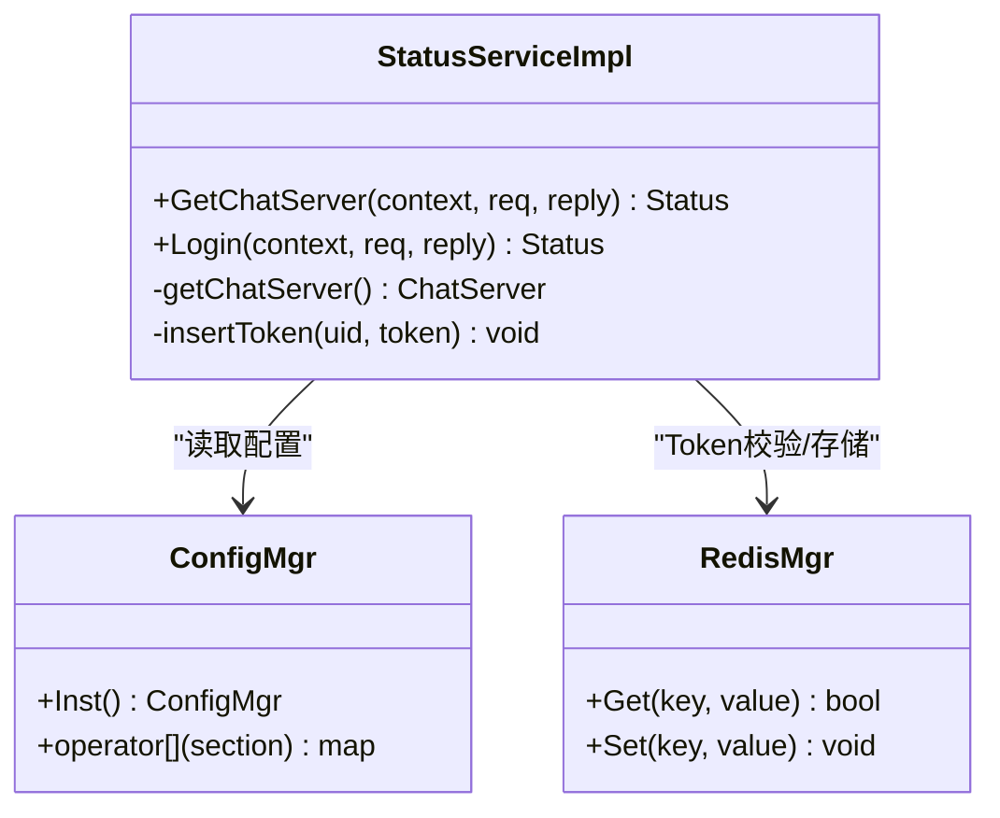
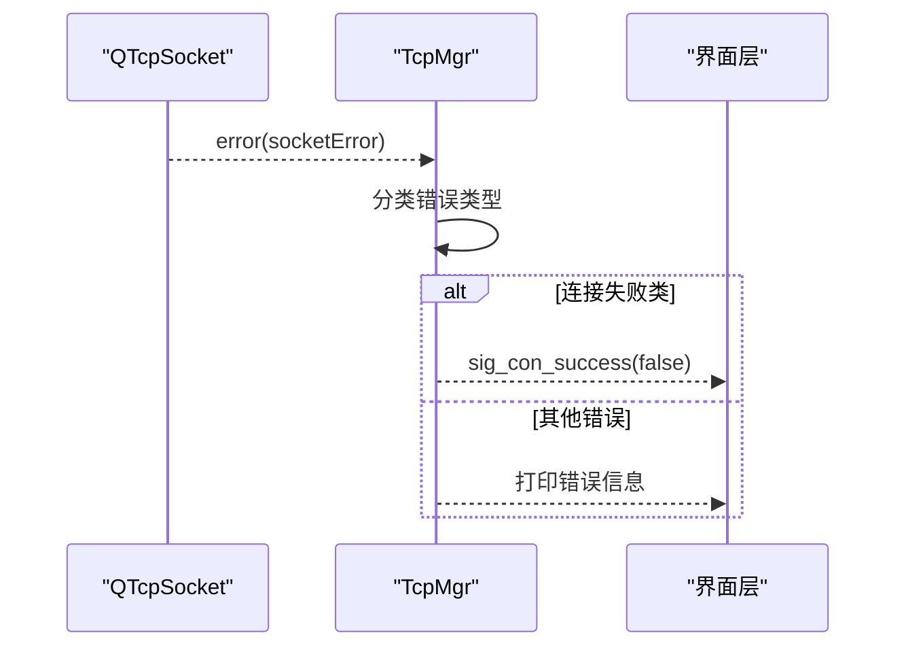
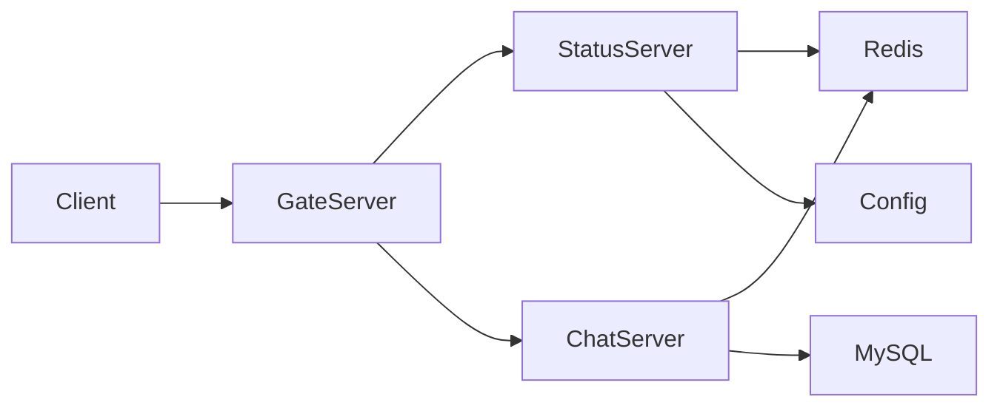

# 监控日志

<cite>
**本文引用的文件**   
- [CServer.cpp](file://server/ChatServer/src/CServer.cpp)
- [CSession.h](file://server/ChatServer/include/CSession.h)
- [MysqlDao.h](file://server/ChatServer/include/MysqlDao.h)
- [StatusServiceImpl.cpp](file://server/StatusServer/src/StatusServiceImpl.cpp)
- [StatusServer.cpp](file://server/StatusServer/src/StatusServer.cpp)
- [chatserver1.ini](file://server/ChatServer/config/chatserver1.ini)
- [config.ini](file://server/GateServer/config/config.ini)
- [const.h](file://server/ChatServer/include/const.h)
- [tcpmgr.cpp](file://client/llfcchat/src/tcpmgr.cpp)
- [filetcpmgr.cpp](file://client/llfcchat/src/filetcpmgr.cpp)
- [day35心跳逻辑.md](file://开发文档/day35心跳逻辑.md)
</cite>

## 目录
1. [简介](#简介)
2. [项目结构](#项目结构)
3. [核心组件](#核心组件)
4. [架构总览](#架构总览)
5. [详细组件分析](#详细组件分析)
6. [依赖关系分析](#依赖关系分析)
7. [性能考虑](#性能考虑)
8. [故障排查指南](#故障排查指南)
9. [结论](#结论)
10. [附录](#附录)

## 简介
本文件为 LLFCChat 系统的监控与日志管理文档，聚焦以下目标：
- 日志收集策略：应用日志、访问日志、错误日志的分类与存储方案
- 性能监控指标：CPU、内存、网络IO、连接数、RPC耗时等指标的定义与采集方法
- 健康检查端点：实现与配置建议
- 告警规则与通知机制：阈值、频率、通知渠道
- 日志分析工具集成：ELK Stack、Prometheus+Grafana 的落地方案
- 分布式追踪：链路追踪的实现思路与配置要点

说明：当前代码库中未内置专用监控系统（如 Prometheus）或集中式日志系统（如 ELK），但已具备心跳检测、会话管理、Redis 计数、gRPC 服务、MySQL/Redis 持久化等基础能力。本文基于现有代码给出可落地的监控与日志方案，并标注相关源码位置以便后续接入。

## 项目结构
LLFCChat 采用多服务架构：
- ChatServer：聊天业务主服务，维护 TCP 长连接、会话、心跳、消息路由
- GateServer：网关服务，负责 HTTP/gRPC 入口与鉴权转发
- StatusServer：状态服务，提供服务器选择与健康信息
- ResourceServer：资源服务，处理文件上传下载
- VarifyServer：验证码服务（Node.js）
- Client：Qt 客户端，负责 UI、TCP 通信、文件传输

图表来源
- [StatusServer.cpp:1-41](file://server/StatusServer/src/StatusServer.cpp#L1-L41)
- [CServer.cpp:1-133](file://server/ChatServer/src/CServer.cpp#L1-L133)
- [config.ini:1-25](file://server/GateServer/config/config.ini#L1-L25)
- [chatserver1.ini:1-30](file://server/ChatServer/config/chatserver1.ini#L1-L30)

章节来源
- [StatusServer.cpp:1-41](file://server/StatusServer/src/StatusServer.cpp#L1-L41)
- [CServer.cpp:1-133](file://server/ChatServer/src/CServer.cpp#L1-L133)
- [config.ini:1-25](file://server/GateServer/config/config.ini#L1-L25)
- [chatserver1.ini:1-30](file://server/ChatServer/config/chatserver1.ini#L1-L30)

## 核心组件
- 会话与心跳：CSession 维护会话生命周期、心跳时间戳、读写异步流程；CServer 定时扫描过期会话并统计在线数
- 数据库连接池：MysqlDao 周期性探测连接健康并自动重连
- 状态服务：StatusServiceImpl 提供服务器选择、Token 校验、登录计数读取
- 客户端网络：tcpmgr 处理 TCP 错误与事件；filetcpmgr 处理文件分片下载与进度上报

章节来源
- [CSession.h:1-86](file://server/ChatServer/include/CSession.h#L1-L86)
- [CServer.cpp:1-133](file://server/ChatServer/src/CServer.cpp#L1-L133)
- [MysqlDao.h:42-100](file://server/ChatServer/include/MysqlDao.h#L42-L100)
- [StatusServiceImpl.cpp:1-125](file://server/StatusServer/src/StatusServiceImpl.cpp#L1-L125)
- [tcpmgr.cpp:63-90](file://client/llfcchat/src/tcpmgr.cpp#L63-L90)
- [filetcpmgr.cpp:399-433](file://client/llfcchat/src/filetcpmgr.cpp#L399-L433)

## 架构总览
下图展示从客户端到各服务的请求路径，以及心跳与连接计数的关键交互。

图表来源
- [StatusServiceImpl.cpp:17-27](file://server/StatusServer/src/StatusServiceImpl.cpp#L17-L27)
- [CServer.cpp:75-118](file://server/ChatServer/src/CServer.cpp#L75-L118)

## 详细组件分析

### 心跳与会话管理（CServer/CSession）
- CServer::on_timer 每60秒遍历会话，判断是否超时，关闭僵尸连接并统计有效会话数，将结果写入 Redis 的 LOGIN_COUNT 哈希表
- CSession 维护 _last_heartbeat 原子时间戳，提供 IsHeartbeatExpired、UpdateHeartbeat、DealExceptionSession 等方法
- 异常读/写路径会触发 Close() 并清理 Redis 中的会话映射

图表来源
- [CServer.cpp:75-118](file://server/ChatServer/src/CServer.cpp#L75-L118)
- [CSession.h:46-51](file://server/ChatServer/include/CSession.h#L46-L51)

章节来源
- [CServer.cpp:75-118](file://server/ChatServer/src/CServer.cpp#L75-L118)
- [CSession.h:46-51](file://server/ChatServer/include/CSession.h#L46-L51)
- [day35心跳逻辑.md:41-92](file://开发文档/day35心跳逻辑.md#L41-L92)

### 数据库连接健康检查（MysqlDao）
- 后台线程每秒轮询，累计60次后执行一次连接健康检查
- 对每个连接执行 SELECT 1 探测，失败则标记不健康并增加失败计数
- 失败时尝试重连，成功则放回连接池并唤醒等待线程

图表来源
- [MysqlDao.h:42-100](file://server/ChatServer/include/MysqlDao.h#L42-L100)

章节来源
- [MysqlDao.h:42-100](file://server/ChatServer/include/MysqlDao.h#L42-L100)

### 状态服务与服务器选择（StatusServiceImpl）
- 初始化时加载配置中的 ChatServer 列表
- GetChatServer 返回选定的服务器信息与 Token（当前默认返回首个，预留按连接数负载均衡）
- Login 接口校验 Token 有效性并返回 UID

图表来源
- [StatusServiceImpl.cpp:1-125](file://server/StatusServer/src/StatusServiceImpl.cpp#L1-L125)

章节来源
- [StatusServiceImpl.cpp:1-125](file://server/StatusServer/src/StatusServiceImpl.cpp#L1-L125)

### 客户端网络与错误处理（tcpmgr/filetcpmgr）
- tcpmgr 监听 QTcpSocket 的错误信号，区分拒绝、远程关闭、主机未找到、超时、网络错误等，并向上层发出连接成功/失败信号
- filetcpmgr 处理文件分片下载，记录进度、完成回调、并发续传等，输出调试日志便于定位问题

图表来源
- [tcpmgr.cpp:63-90](file://client/llfcchat/src/tcpmgr.cpp#L63-L90)

章节来源
- [tcpmgr.cpp:63-90](file://client/llfcchat/src/tcpmgr.cpp#L63-L90)
- [filetcpmgr.cpp:399-433](file://client/llfcchat/src/filetcpmgr.cpp#L399-L433)

## 依赖关系分析
- ChatServer 依赖 Redis 用于会话计数与分布式锁，依赖 MySQL 进行持久化
- StatusServer 依赖配置与 Redis，提供轻量状态查询
- GateServer 作为入口，依赖 StatusServer 与后端服务
- 客户端依赖 Qt 网络栈与 JSON 解析

图表来源
- [chatserver1.ini:1-30](file://server/ChatServer/config/chatserver1.ini#L1-L30)
- [config.ini:1-25](file://server/GateServer/config/config.ini#L1-L25)

章节来源
- [chatserver1.ini:1-30](file://server/ChatServer/config/chatserver1.ini#L1-L30)
- [config.ini:1-25](file://server/GateServer/config/config.ini#L1-L25)

## 性能考虑
- 心跳周期与阈值：当前定时器为60秒，心跳阈值需结合业务延迟与网络抖动调整，避免误判
- 连接池健康检查间隔：MysqlDao 每60秒进行一次全量探测，可根据负载调优
- 队列长度限制：MAX_RECVQUE、MAX_SENDQUE 控制收发队列上限，防止内存暴涨
- Redis 写入频率：LOGIN_COUNT 在心跳结束后批量写入，降低锁竞争与网络开销
- I/O 模型：Boost.Asio 异步 I/O 提升吞吐，注意避免在回调中进行阻塞操作

[本节为通用指导，无需源码引用]

## 故障排查指南
- 连接异常：查看客户端 tcpmgr 的错误分支日志，确认拒绝、超时、网络错误等
- 会话掉线：检查 CServer 心跳检测与 CSession 的 DealExceptionSession 调用路径
- 数据库不可用：关注 MysqlDao 的连接健康检查与重连日志
- 状态服务异常：验证 StatusServiceImpl 的配置加载与 Token 校验逻辑
- 文件传输失败：检查 filetcpmgr 的分片序列号、进度回调与完成标志

章节来源
- [tcpmgr.cpp:63-90](file://client/llfcchat/src/tcpmgr.cpp#L63-L90)
- [CServer.cpp:75-118](file://server/ChatServer/src/CServer.cpp#L75-L118)
- [MysqlDao.h:42-100](file://server/ChatServer/include/MysqlDao.h#L42-L100)
- [StatusServiceImpl.cpp:94-116](file://server/StatusServer/src/StatusServiceImpl.cpp#L94-L116)
- [filetcpmgr.cpp:656-688](file://client/llfcchat/src/filetcpmgr.cpp#L656-L688)

## 结论
当前 LLFCChat 已具备会话管理、心跳检测、连接池健康检查与状态服务的基础能力，为构建完善的监控与日志体系提供了良好支撑。建议在现有基础上引入统一日志框架、指标采集与链路追踪，形成端到端的可观测性闭环。

[本节为总结性内容，无需源码引用]

## 附录

### 日志收集策略（建议）
- 应用日志
  - 分类：INFO/WARN/ERROR，按模块划分（网络、会话、数据库、RPC）
  - 存储：本地滚动文件 + 集中收集（Filebeat/Fluent Bit -> Kafka/ES）
  - 字段：时间戳、级别、模块、服务名、实例ID、TraceID、用户UID、会话ID
- 访问日志
  - 入口：GateServer 的 HTTP/gRPC 请求
  - 格式：JSON，包含方法、路径、状态码、耗时、客户端IP、UA
  - 存储：ES 索引，保留策略按合规要求设置
- 错误日志
  - 捕获：异常堆栈、上下文快照、最近操作
  - 告警：错误率突增、关键错误（DB/RPC/权限）立即通知

[本节为通用指导，无需源码引用]

### 性能监控指标（定义与采集）
- 系统级
  - CPU使用率、内存占用、磁盘I/O、网络I/O（字节/包）
  - 采集方式：操作系统探针（node_exporter/procfs）
- 应用级
  - 连接数（活跃会话）、心跳超时率、队列长度（收发）
  - RPC 调用次数、成功率、P95/P99 耗时
  - 数据库连接池大小、活跃连接、慢查询数
  - Redis 命中率、命令延迟、内存使用
  - 采集方式：自定义指标导出（HTTP /metrics 或 gRPC metrics）+ Prometheus 抓取

[本节为通用指导，无需源码引用]

### 健康检查端点（实现与配置）
- 建议暴露 /healthz 与 /readyz
  - /healthz：进程存活、依赖（MySQL/Redis）可达
  - /readyz：业务就绪（会话管理器、任务队列正常）
- 配置项
  - 端口、超时、重试次数、依赖健康阈值
- 集成
  - Kubernetes Liveness/Readiness 探针
  - 负载均衡器健康检查

[本节为通用指导，无需源码引用]

### 告警规则与通知机制
- 规则示例
  - 错误率 > 5%（5分钟窗口）
  - P99 延迟 > 500ms
  - 连接数突降 > 30%
  - Redis 内存 > 80%
  - MySQL 慢查询 > 10/s
- 通知渠道
  - 企业微信/钉钉/邮件/短信
  - 分级：警告、严重、致命，不同级别不同通道

[本节为通用指导，无需源码引用]

### 日志分析工具集成（ELK/Prometheus+Grafana）
- ELK Stack
  - Filebeat/Fluent Bit 收集日志 -> Kafka -> Logstash -> ES -> Kibana
  - 索引策略：按天滚动，冷热分层
- Prometheus + Grafana
  - 应用暴露 /metrics，Prometheus 定期抓取
  - Grafana 仪表盘：系统、应用、业务指标
  - Alertmanager 告警路由与抑制

[本节为通用指导，无需源码引用]

### 分布式追踪（链路追踪）
- 方案
  - OpenTelemetry SDK 注入（C++/Node.js）
  - TraceID 贯穿客户端->Gate->Chat/Res/Status->DB/Redis
- 配置要点
  - 采样策略（头部采样/比例采样）
  - 导出器（OTLP -> Jaeger/Zipkin）
  - 跨语言传播（HTTP Header/gRPC Metadata）

[本节为通用指导，无需源码引用]