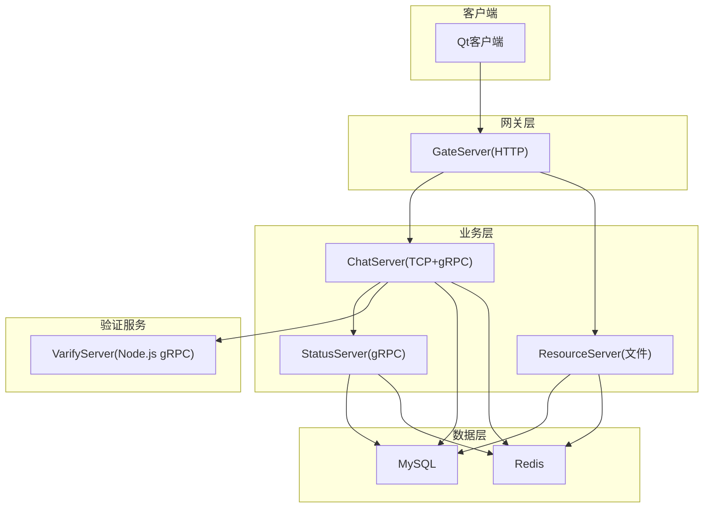
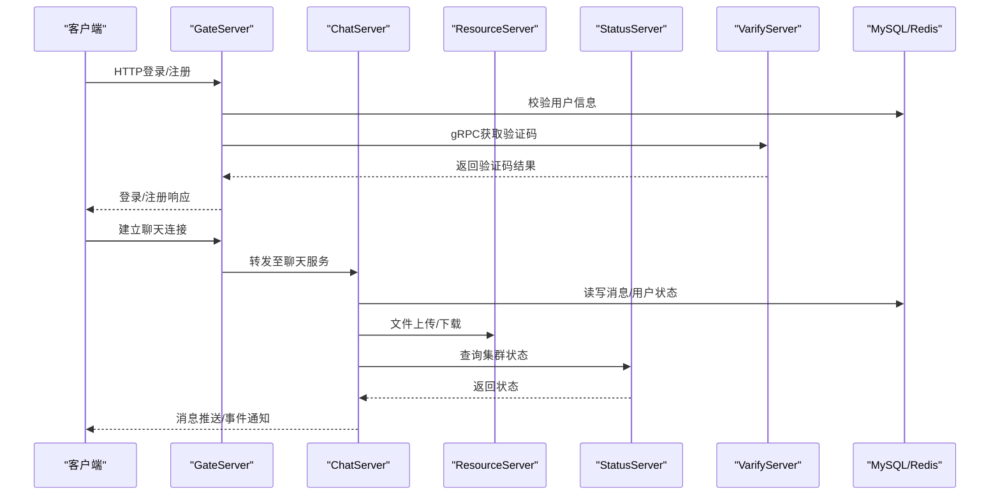
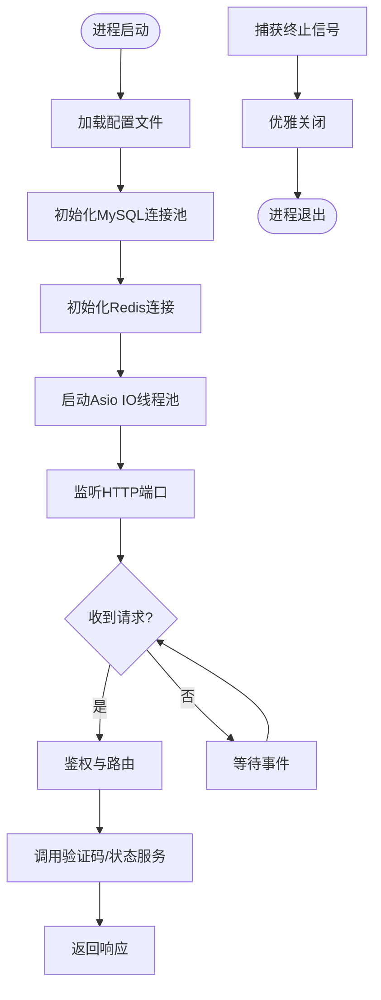
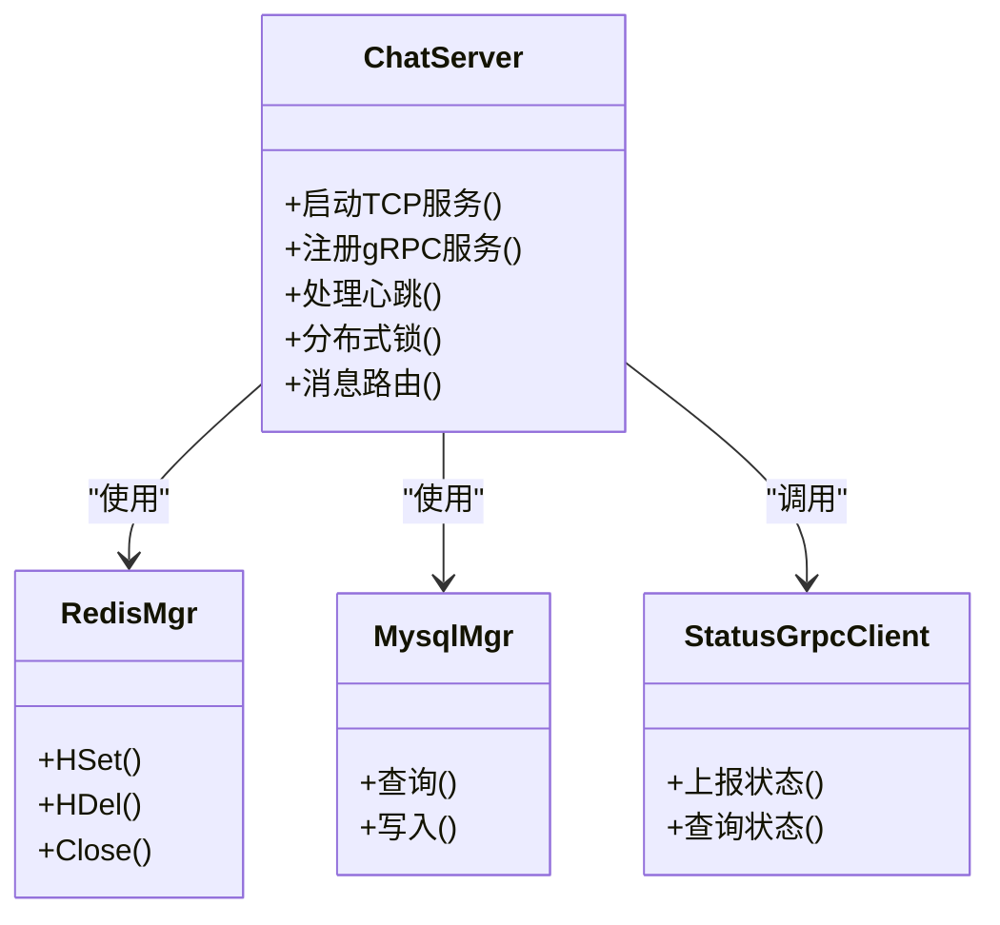
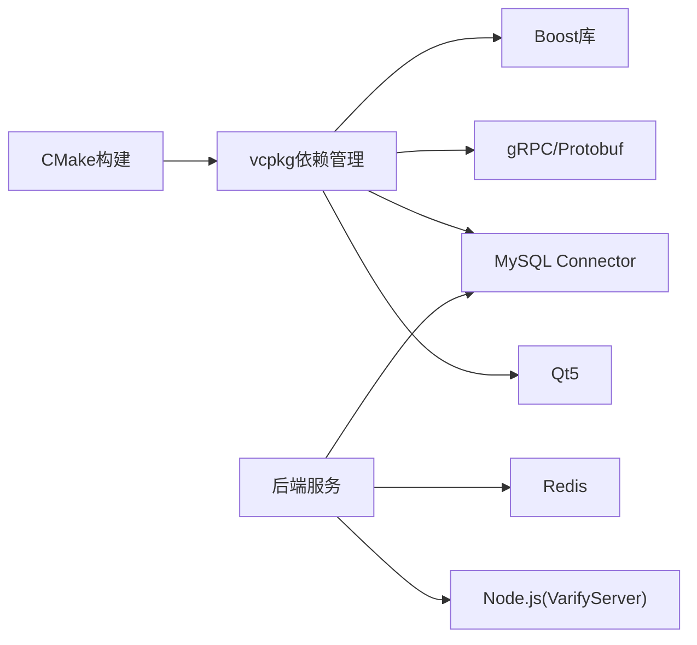

# 部署运维

<cite>
**本文引用的文件**   
- [README.md](file://README.md)
- [CMakeLists.txt](file://CMakeLists.txt)
- [CMakePresets.json](file://CMakePresets.json)
- [vcpkg.json](file://vcpkg.json)
- [server/GateServer/config/config.ini](file://server/GateServer/config/config.ini)
- [server/ChatServer/config/chatserver1.ini](file://server/ChatServer/config/chatserver1.ini)
- [server/ResourceServer/config/config.ini](file://server/ResourceServer/config/config.ini)
- [server/StatusServer/config/config.ini](file://server/StatusServer/config/config.ini)
- [server/ChatServer/src/ChatServer.cpp](file://server/ChatServer/src/ChatServer.cpp)
- [server/GateServer/src/GateServer.cpp](file://server/GateServer/src/GateServer.cpp)
- [server/ResourceServer/src/ResourceServer.cpp](file://server/ResourceServer/src/ResourceServer.cpp)
- [server/StatusServer/src/StatusServer.cpp](file://server/StatusServer/src/StatusServer.cpp)
- [server/VarifyServer/server.js](file://server/VarifyServer/server.js)
</cite>

## 目录
1. [简介](#简介)
2. [项目结构](#项目结构)
3. [核心组件](#核心组件)
4. [架构总览](#架构总览)
5. [详细组件分析](#详细组件分析)
6. [依赖分析](#依赖分析)
7. [性能考虑](#性能考虑)
8. [故障排查指南](#故障排查指南)
9. [结论](#结论)
10. [附录](#附录)

## 简介
本运维文档面向LLFCChat的生产环境部署与运维，覆盖环境搭建、服务部署、监控告警、Docker容器化、Kubernetes编排、CI/CD流水线、日志收集、性能监控、健康检查、备份恢复、容量规划、环境变量与密钥管理、自动化脚本与工具使用，以及生产最佳实践与应急响应流程。项目为C++聊天系统，包含多个后端服务（GateServer、ChatServer、ResourceServer、StatusServer）与一个Node.js验证码服务（VarifyServer），并依赖MySQL与Redis等基础设施。

## 项目结构
- 构建系统与依赖
  - CMake根工程与子模块：server与client
  - vcpkg管理第三方库（Boost、gRPC、Protobuf、MySQL Connector/C++、Qt5等）
  - CMake预设用于Windows Ninja多配置构建
- 服务端
  - GateServer：HTTP入口网关，负责鉴权、路由与转发
  - ChatServer：聊天业务主服务，提供TCP长连接与gRPC内部通信
  - ResourceServer：资源上传下载服务，处理静态资源与文件传输
  - StatusServer：状态服务，对外暴露gRPC接口查询集群状态
  - VarifyServer：Node.js实现的验证码服务，通过gRPC被其他服务调用
- 客户端
  - Qt桌面客户端，使用HTTP/TCP/gRPC与后端交互
- 配置文件
  - 各服务独立ini配置文件，定义端口、数据库、缓存、对端服务等参数

图表来源
- [server/GateServer/src/GateServer.cpp:1-160](file://server/GateServer/src/GateServer.cpp#L1-L160)
- [server/ChatServer/src/ChatServer.cpp:1-81](file://server/ChatServer/src/ChatServer.cpp#L1-L81)
- [server/ResourceServer/src/ResourceServer.cpp:1-42](file://server/ResourceServer/src/ResourceServer.cpp#L1-L42)
- [server/StatusServer/src/StatusServer.cpp:1-69](file://server/StatusServer/src/StatusServer.cpp#L1-L69)
- [server/VarifyServer/server.js:1-76](file://server/VarifyServer/server.js#L1-L76)

章节来源
- [CMakeLists.txt:1-34](file://CMakeLists.txt#L1-L34)
- [CMakePresets.json:1-36](file://CMakePresets.json#L1-L36)
- [vcpkg.json:1-32](file://vcpkg.json#L1-L32)
- [README.md:1-112](file://README.md#L1-L112)

## 核心组件
- GateServer
  - 功能：HTTP入口，接收客户端请求，进行鉴权与路由，访问Redis/MySQL，调用验证码服务
  - 关键行为：启动Asio IO线程池，监听端口，信号处理优雅退出
- ChatServer
  - 功能：聊天业务主服务，维护TCP连接，处理消息分发，gRPC内部通信，分布式锁与心跳
  - 关键行为：初始化IOServicePool，注册gRPC服务，信号处理，定时器
- ResourceServer
  - 功能：文件上传下载、静态资源托管，与ChatServer通过gRPC协作
  - 关键行为：Asio IO池，信号处理，路径配置
- StatusServer
  - 功能：对外gRPC状态查询，聚合各ChatServer状态
  - 关键行为：gRPC服务启动，信号处理，异步io_context
- VarifyServer
  - 功能：生成验证码并通过邮件发送，使用Redis缓存验证码ID
  - 关键行为：gRPC服务绑定，Redis存取，邮件发送

章节来源
- [server/GateServer/src/GateServer.cpp:128-160](file://server/GateServer/src/GateServer.cpp#L128-L160)
- [server/ChatServer/src/ChatServer.cpp:20-81](file://server/ChatServer/src/ChatServer.cpp#L20-L81)
- [server/ResourceServer/src/ResourceServer.cpp:15-42](file://server/ResourceServer/src/ResourceServer.cpp#L15-L42)
- [server/StatusServer/src/StatusServer.cpp:17-69](file://server/StatusServer/src/StatusServer.cpp#L17-L69)
- [server/VarifyServer/server.js:15-76](file://server/VarifyServer/server.js#L15-L76)

## 架构总览
系统采用微服务架构，前后端分离，服务间通过HTTP与gRPC通信，数据层由MySQL与Redis组成。GateServer作为统一入口，ChatServer承载核心聊天逻辑，ResourceServer负责文件与静态资源，StatusServer提供状态查询，VarifyServer提供验证码能力。

图表来源
- [server/GateServer/src/GateServer.cpp:128-160](file://server/GateServer/src/GateServer.cpp#L128-L160)
- [server/ChatServer/src/ChatServer.cpp:20-81](file://server/ChatServer/src/ChatServer.cpp#L20-L81)
- [server/ResourceServer/src/ResourceServer.cpp:15-42](file://server/ResourceServer/src/ResourceServer.cpp#L15-L42)
- [server/StatusServer/src/StatusServer.cpp:17-69](file://server/StatusServer/src/StatusServer.cpp#L17-L69)
- [server/VarifyServer/server.js:15-76](file://server/VarifyServer/server.js#L15-L76)

## 详细组件分析

### GateServer（网关）
- 职责：HTTP入口、鉴权、路由、外部依赖协调
- 运行方式：基于Boost.Asio的IO线程池，监听指定端口，捕获SIGINT/SIGTERM优雅退出
- 依赖：Redis、MySQL、VarifyServer（gRPC）、StatusServer（gRPC）
- 配置项：端口、验证码服务地址、状态服务地址、数据库与缓存连接信息、资源服务地址

图表来源
- [server/GateServer/src/GateServer.cpp:128-160](file://server/GateServer/src/GateServer.cpp#L128-L160)

章节来源
- [server/GateServer/config/config.ini:1-25](file://server/GateServer/config/config.ini#L1-L25)
- [server/GateServer/src/GateServer.cpp:128-160](file://server/GateServer/src/GateServer.cpp#L128-L160)

### ChatServer（聊天服务）
- 职责：维护TCP长连接、消息路由、会话管理、分布式锁、心跳检测
- 运行方式：Asio IOServicePool + gRPC服务，独立线程运行gRPC服务器
- 依赖：Redis（登录计数、分布式锁）、MySQL（持久化）、StatusServer（状态上报/查询）、ResourceServer（文件）
- 配置项：自身服务名、监听端口、RPC端口、对端ChatServer列表、数据库与缓存连接

图表来源
- [server/ChatServer/src/ChatServer.cpp:20-81](file://server/ChatServer/src/ChatServer.cpp#L20-L81)

章节来源
- [server/ChatServer/config/chatserver1.ini:1-30](file://server/ChatServer/config/chatserver1.ini#L1-L30)
- [server/ChatServer/src/ChatServer.cpp:20-81](file://server/ChatServer/src/ChatServer.cpp#L20-L81)

### ResourceServer（资源服务）
- 职责：文件上传下载、静态资源托管、与ChatServer协作
- 运行方式：Asio IO线程池，监听端口，信号处理
- 依赖：MySQL、Redis、ChatServer（gRPC）
- 配置项：输出目录、静态目录、对端ChatServer列表

章节来源
- [server/ResourceServer/config/config.ini:1-27](file://server/ResourceServer/config/config.ini#L1-L27)
- [server/ResourceServer/src/ResourceServer.cpp:15-42](file://server/ResourceServer/src/ResourceServer.cpp#L15-L42)

### StatusServer（状态服务）
- 职责：对外gRPC接口，聚合各ChatServer状态
- 运行方式：gRPC服务 + Asio io_context，信号处理优雅关闭
- 依赖：MySQL、Redis、ChatServer列表

章节来源
- [server/StatusServer/config/config.ini:1-23](file://server/StatusServer/config/config.ini#L1-L23)
- [server/StatusServer/src/StatusServer.cpp:17-69](file://server/StatusServer/src/StatusServer.cpp#L17-L69)

### VarifyServer（验证码服务）
- 职责：生成验证码、邮件发送、Redis缓存
- 运行方式：Node.js gRPC服务，绑定端口，异步处理
- 依赖：Redis、邮件服务

章节来源
- [server/VarifyServer/server.js:15-76](file://server/VarifyServer/server.js#L15-L76)

## 依赖分析
- 构建依赖
  - CMake 3.25+，Ninja Multi-Config生成器
  - vcpkg管理依赖：boost-asio、boost-beast、grpc、protobuf、hiredis、mysql-connector-cpp、qt5-base、qt5-imageformats
- 运行时依赖
  - MySQL：存储用户、消息、资源元数据
  - Redis：缓存、分布式锁、会话、验证码
  - Node.js：运行VarifyServer
  - 操作系统：Linux/Windows（开发示例含Windows预设）

图表来源
- [CMakeLists.txt:1-34](file://CMakeLists.txt#L1-L34)
- [CMakePresets.json:1-36](file://CMakePresets.json#L1-L36)
- [vcpkg.json:1-32](file://vcpkg.json#L1-L32)

章节来源
- [CMakeLists.txt:1-34](file://CMakeLists.txt#L1-L34)
- [CMakePresets.json:1-36](file://CMakePresets.json#L1-L36)
- [vcpkg.json:1-32](file://vcpkg.json#L1-L32)

## 性能考虑
- 网络模型
  - 使用Boost.Asio实现高并发IO，建议根据CPU核数调整IO线程池大小
  - gRPC服务独立线程运行，避免阻塞业务线程
- 缓存策略
  - Redis用于热点数据与分布式锁，合理设置过期时间与键空间
  - 文件分片与断点续传减少带宽占用
- 数据库优化
  - 连接池大小与超时配置需匹配负载
  - 读写分离与索引优化提升查询性能
- 资源服务
  - 静态资源直出，大文件流式传输，避免内存峰值
- 监控指标
  - 关注QPS、延迟、错误率、连接数、CPU/内存、磁盘IO、网络吞吐

[本节为通用指导，不直接分析具体文件]

## 故障排查指南
- 常见症状
  - 登录失败：检查GateServer到MySQL/Redis连通性，验证码服务是否可用
  - 聊天消息丢失：检查ChatServer与ResourceServer通信、Redis锁状态
  - 文件上传失败：检查ResourceServer路径权限、磁盘空间
  - 状态查询异常：确认StatusServer与各ChatServer可达性
- 定位步骤
  - 查看服务日志：标准输出与错误输出，结合信号处理判断退出原因
  - 检查配置文件：端口冲突、数据库密码、Redis认证
  - 网络连通性：telnet/curl测试端口，防火墙规则
  - 依赖服务健康：MySQL慢查询、Redis内存与命中率
- 应急措施
  - 快速回滚：保留历史版本镜像与配置快照
  - 降级策略：关闭非核心功能（如图片预览）保障核心聊天
  - 扩容隔离：横向扩展ChatServer实例，负载均衡

章节来源
- [server/GateServer/src/GateServer.cpp:128-160](file://server/GateServer/src/GateServer.cpp#L128-L160)
- [server/ChatServer/src/ChatServer.cpp:20-81](file://server/ChatServer/src/ChatServer.cpp#L20-L81)
- [server/ResourceServer/src/ResourceServer.cpp:15-42](file://server/ResourceServer/src/ResourceServer.cpp#L15-L42)
- [server/StatusServer/src/StatusServer.cpp:17-69](file://server/StatusServer/src/StatusServer.cpp#L17-L69)

## 结论
LLFCChat采用清晰的分层与微服务架构，具备高并发与可扩展性。通过合理的配置管理与依赖治理，可实现稳定可靠的部署。生产环境应强化监控、日志、备份与应急预案，确保业务连续性与数据安全。

[本节为总结性内容，不直接分析具体文件]

## 附录

### 环境搭建
- 基础环境
  - 安装CMake 3.25+、Ninja、vcpkg、编译器（MSVC/GCC/Clang）
  - 安装MySQL、Redis、Node.js（用于VarifyServer）
- 依赖安装
  - 使用vcpkg安装依赖：boost、grpc、protobuf、mysql-connector-cpp、qt5等
- 构建
  - Windows：使用CMake预设“windows-ninja”，选择Debug/Release配置
  - Linux：配置Ninja Multi-Config生成器，执行构建

章节来源
- [CMakePresets.json:1-36](file://CMakePresets.json#L1-L36)
- [vcpkg.json:1-32](file://vcpkg.json#L1-L32)
- [CMakeLists.txt:1-34](file://CMakeLists.txt#L1-L34)

### 服务部署
- 配置文件准备
  - 各服务ini文件，填写数据库、Redis、对端服务地址与端口
  - 注意区分不同环境的配置（开发/测试/生产）
- 启动顺序
  - 先启动MySQL、Redis、VarifyServer
  - 再启动StatusServer、ResourceServer、ChatServer
  - 最后启动GateServer
- 进程管理
  - 使用systemd或容器编排管理进程生命周期
  - 配置信号处理实现优雅退出

章节来源
- [server/GateServer/config/config.ini:1-25](file://server/GateServer/config/config.ini#L1-L25)
- [server/ChatServer/config/chatserver1.ini:1-30](file://server/ChatServer/config/chatserver1.ini#L1-L30)
- [server/ResourceServer/config/config.ini:1-27](file://server/ResourceServer/config/config.ini#L1-L27)
- [server/StatusServer/config/config.ini:1-23](file://server/StatusServer/config/config.ini#L1-L23)

### Docker容器化
- 镜像构建
  - 为每个服务创建Dockerfile，基于最小化基础镜像
  - 将配置文件与二进制分离，通过卷挂载
  - 多阶段构建减小镜像体积
- 容器编排
  - 使用docker-compose编排本地开发环境
  - 生产环境建议使用Kubernetes

[本节为通用指导，不直接分析具体文件]

### Kubernetes编排
- Deployment
  - 每个服务一个Deployment，副本数根据负载设定
  - 资源配置requests/limits限制CPU与内存
- Service
  - 暴露内部Service供服务间通信
  - Ingress暴露GateServer给外部
- ConfigMap与Secret
  - 配置文件使用ConfigMap挂载
  - 敏感信息（数据库密码、Redis密码）使用Secret
- 健康检查
  - livenessProbe与readinessProbe检查服务可用性
- 滚动更新
  - 逐步替换Pod，保证零停机发布

[本节为通用指导，不直接分析具体文件]

### CI/CD流水线
- 代码提交触发构建
  - 编译C++服务与Qt客户端
  - 运行单元测试与集成测试
- 镜像构建与推送
  - 构建Docker镜像并推送到镜像仓库
- 部署
  - 自动更新Kubernetes资源或触发蓝绿/金丝雀发布
- 回滚
  - 保留历史版本，支持快速回滚

[本节为通用指导，不直接分析具体文件]

### 日志收集
- 应用日志
  - 输出到标准输出，便于容器采集
  - 结构化日志格式（JSON）便于解析
- 集中收集
  - 使用Fluentd/Filebeat收集日志到Elasticsearch
  - Kibana可视化查询与分析
- 日志轮转
  - 按大小或时间轮转，保留策略配置

[本节为通用指导，不直接分析具体文件]

### 性能监控与健康检查
- 指标采集
  - Prometheus抓取服务暴露的指标（自定义指标）
  - 系统指标（CPU、内存、磁盘、网络）
- 告警规则
  - 设置阈值告警（错误率、延迟、资源使用率）
  - 通知渠道（邮件、钉钉、企业微信）
- 健康检查
  - HTTP/gRPC健康端点返回服务状态
  - 探针定期探测，异常时重启或摘除流量

[本节为通用指导，不直接分析具体文件]

### 备份恢复
- 数据备份
  - MySQL定时全量与增量备份
  - Redis持久化配置（RDB/AOF）
- 备份策略
  - 保留周期与异地备份
  - 加密与权限控制
- 恢复演练
  - 定期演练恢复流程，验证数据一致性

[本节为通用指导，不直接分析具体文件]

### 环境变量与密钥管理
- 环境变量
  - 服务配置通过环境变量注入，避免硬编码
  - 使用.env文件或配置中心管理
- 密钥管理
  - 使用Kubernetes Secret或HashiCorp Vault管理敏感信息
  - 定期轮换密钥，审计访问日志

[本节为通用指导，不直接分析具体文件]

### 自动化部署脚本
- 脚本功能
  - 一键部署所有服务与环境依赖
  - 配置校验与预检
  - 启动、停止、重启服务
- 工具推荐
  - Ansible/SaltStack进行配置管理
  - Helm/Kustomize管理Kubernetes资源

[本节为通用指导，不直接分析具体文件]

### 生产环境最佳实践
- 安全加固
  - 最小权限原则，网络隔离
  - TLS加密通信，证书管理
- 高可用
  - 多副本部署，跨可用区分布
  - 故障自动转移与自愈
- 可观测性
  - 完整的日志、指标、链路追踪
- 容量规划
  - 压测评估容量，预留弹性空间
  - 动态扩缩容应对流量波动

[本节为通用指导，不直接分析具体文件]

### 故障应急响应流程
- 发现与告警
  - 监控告警第一时间通知
  - 分级响应（P1/P2/P3）
- 定位与修复
  - 快速定位问题根因
  - 临时缓解措施优先
- 复盘与改进
  - 事后复盘，完善预案
  - 持续改进监控与自动化

[本节为通用指导，不直接分析具体文件]