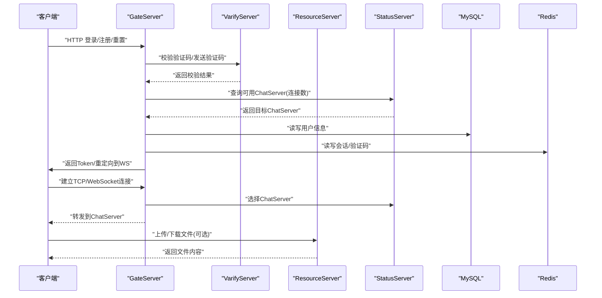
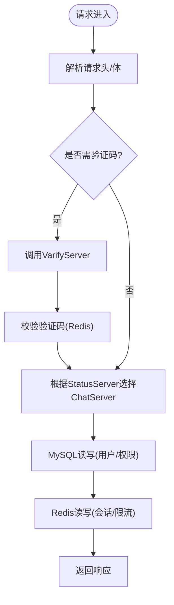
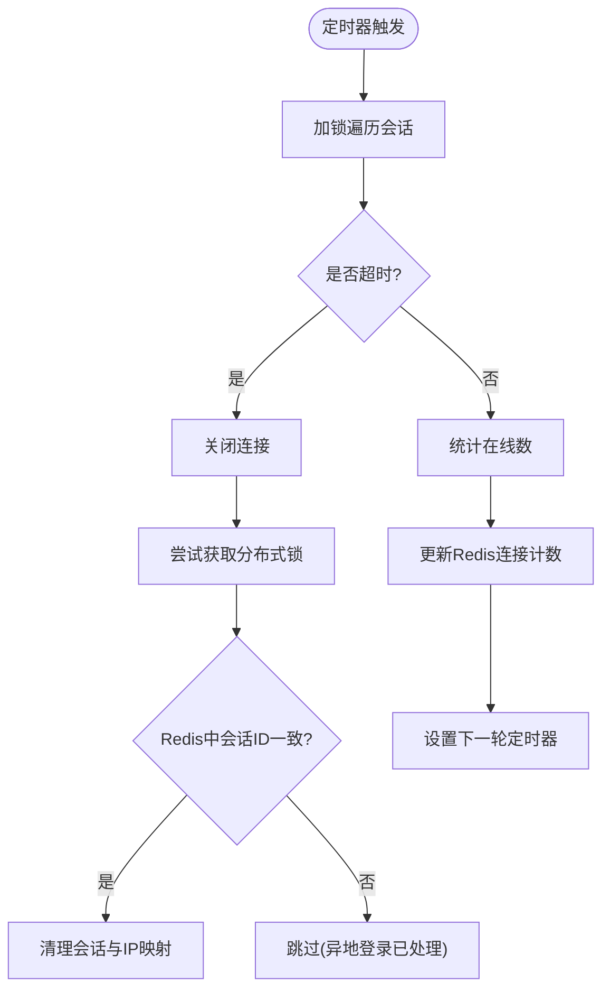
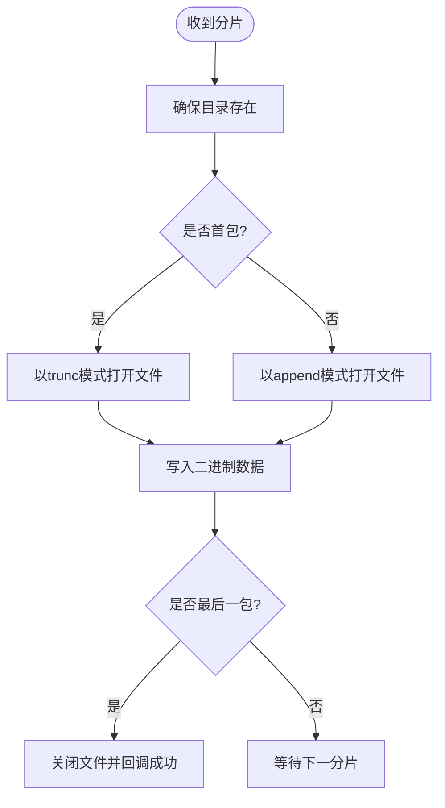
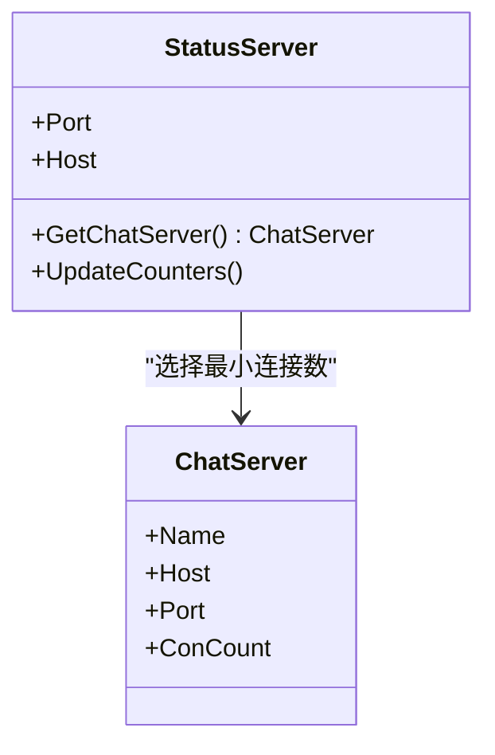
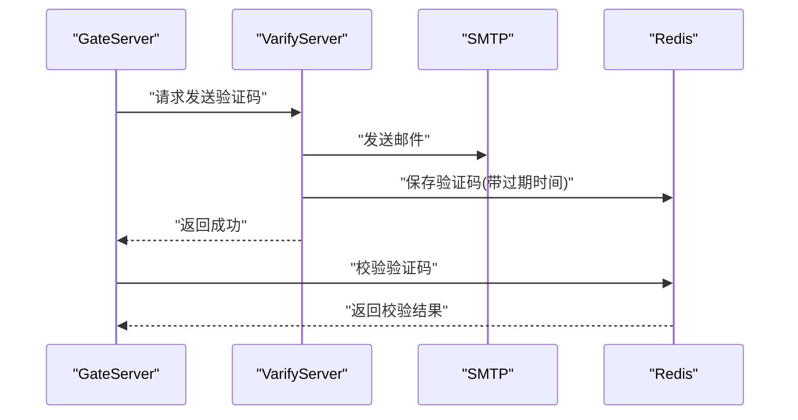
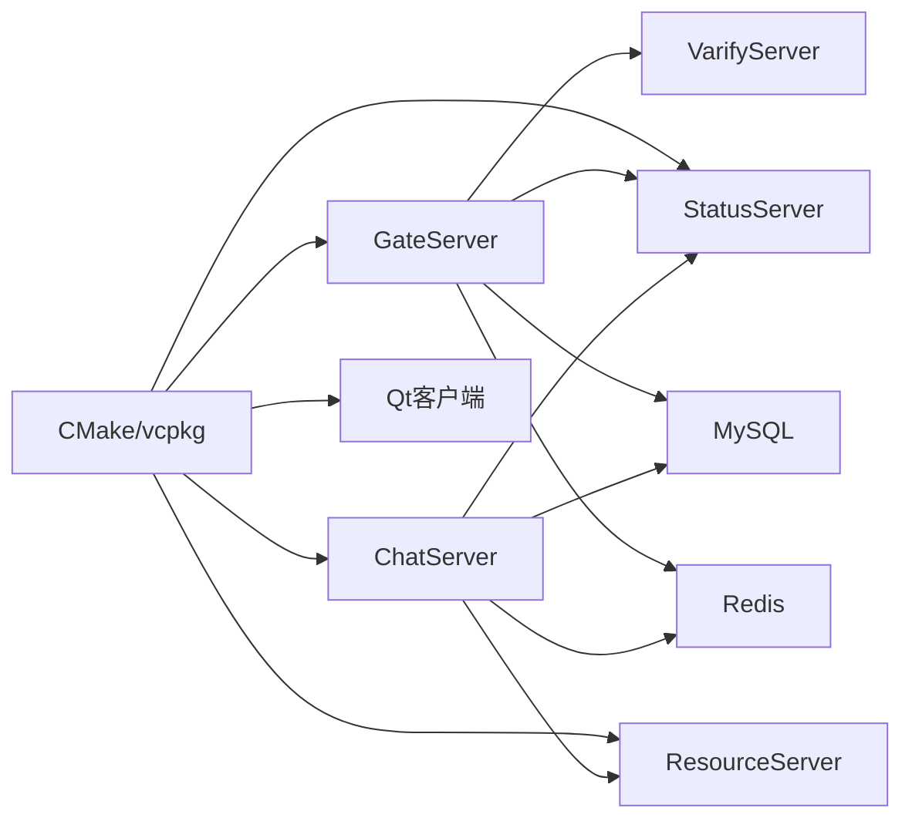

# 部署运维

<cite>
**本文引用的文件**   
- [README.md](file://README.md)
- [CMakeLists.txt](file://CMakeLists.txt)
- [vcpkg.json](file://vcpkg.json)
- [server/ChatServer/config/chatserver1.ini](file://server/ChatServer/config/chatserver1.ini)
- [server/GateServer/config/config.ini](file://server/GateServer/config/config.ini)
- [server/ResourceServer/config/config.ini](file://server/ResourceServer/config/config.ini)
- [server/StatusServer/config/config.ini](file://server/StatusServer/config/config.ini)
- [server/VarifyServer/config.js](file://server/VarifyServer/config.js)
- [server/VarifyServer/package.json](file://server/VarifyServer/package.json)
- [server/GateServer/include/MysqlDao.h](file://server/GateServer/include/MysqlDao.h)
- [server/ResourceServer/src/FileWorker.cpp](file://server/ResourceServer/src/FileWorker.cpp)
- [开发文档/day35心跳逻辑.md](file://开发文档/day35心跳逻辑.md)
- [开发文档/day33单服程踢人逻辑.md](file://开发文档/day33单服程踢人逻辑.md)
</cite>

## 目录
1. [简介](#简介)
2. [项目结构](#项目结构)
3. [核心组件](#核心组件)
4. [架构总览](#架构总览)
5. [详细组件分析](#详细组件分析)
6. [依赖分析](#依赖分析)
7. [性能考虑](#性能考虑)
8. [故障排查指南](#故障排查指南)
9. [结论](#结论)
10. [附录](#附录)

## 简介
本运维文档面向LLFCChat项目的容器化与生产环境部署，覆盖Docker镜像构建、服务编排、环境变量与配置管理、网络与安全、监控告警、日志采集、备份恢复、容量规划与成本优化等。项目由多个C++后端服务（GateServer、ChatServer、ResourceServer、StatusServer）、一个Node.js验证码服务（VarifyServer）以及Qt客户端组成，使用gRPC进行服务间通信，MySQL作为持久化存储，Redis作为缓存与会话/分布式锁支撑。

## 项目结构
- 根级构建系统：CMake + vcpkg，统一依赖管理与子模块编译入口。
- 服务端：
  - GateServer：HTTP接入层，负责鉴权、路由到业务服务。
  - ChatServer：聊天业务主服务，维护用户会话、消息转发、心跳与踢人逻辑。
  - ResourceServer：资源上传下载服务，支持断点续传与分片写入。
  - StatusServer：状态与负载均衡服务，聚合各ChatServer连接数与健康信息。
  - VarifyServer：验证码与邮件发送服务（Node.js）。
- 客户端：Qt桌面端，通过HTTP/gRPC/TCP与后端交互。
- 配置：各服务独立ini或JSON配置文件，集中管理端口、数据库、Redis、对端服务等参数。

```mermaid
graph TB
Client["客户端(Qt)"] --> Gate["GateServer(HTTP)"]
Gate --> Verify["VarifyServer(Node.js)"]
Gate --> Chat1["ChatServer(实例1)"]
Gate --> Chat2["ChatServer(实例2)"]
Chat1 < --> Redis["Redis(缓存/锁)"]
Chat2 < --> Redis
Chat1 < --> MySQL["MySQL(持久化)"]
Chat2 < --> MySQL
Chat1 < --> Res["ResourceServer(文件)"]
Chat2 < --> Res
Status["StatusServer(状态/负载均衡)"] < --> Chat1
Status < --> Chat2
Status < --> Redis
```

**图表来源** 
- [server/GateServer/config/config.ini:1-25](file://server/GateServer/config/config.ini#L1-L25)
- [server/ChatServer/config/chatserver1.ini:1-30](file://server/ChatServer/config/chatserver1.ini#L1-L30)
- [server/ResourceServer/config/config.ini:1-27](file://server/ResourceServer/config/config.ini#L1-L27)
- [server/StatusServer/config/config.ini:1-23](file://server/StatusServer/config/config.ini#L1-L23)
- [server/VarifyServer/config.js:1-15](file://server/VarifyServer/config.js#L1-L15)

**章节来源**
- [CMakeLists.txt:1-34](file://CMakeLists.txt#L1-L34)
- [vcpkg.json:1-32](file://vcpkg.json#L1-L32)
- [README.md:1-112](file://README.md#L1-L112)

## 核心组件
- GateServer：对外暴露HTTP接口，校验验证码后路由至ChatServer；直连MySQL与Redis。
- ChatServer：维护TCP长连接、心跳检测、消息分发、踢人逻辑；通过gRPC与ResourceServer和StatusServer交互。
- ResourceServer：提供文件分片上传、断点续传、静态资源访问；落盘路径可配置。
- StatusServer：汇总各ChatServer的连接数与健康状态，供GateServer做简单负载均衡。
- VarifyServer：生成验证码并发送邮件，验证码存Redis，供登录/重置流程校验。

关键配置要点（示例路径）：
- GateServer端口、ResServer地址、MySQL/Redis连接串
- ChatServer自描述名、监听端口、RPC端口、PeerServer列表
- ResourceServer输出路径、静态目录、ChatServer发现列表
- StatusServer监听的ChatServer列表与端口
- VarifyServer的邮箱凭据、MySQL/Redis连接参数

**章节来源**
- [server/GateServer/config/config.ini:1-25](file://server/GateServer/config/config.ini#L1-L25)
- [server/ChatServer/config/chatserver1.ini:1-30](file://server/ChatServer/config/chatserver1.ini#L1-L30)
- [server/ResourceServer/config/config.ini:1-27](file://server/ResourceServer/config/config.ini#L1-L27)
- [server/StatusServer/config/config.ini:1-23](file://server/StatusServer/config/config.ini#L1-L23)
- [server/VarifyServer/config.js:1-15](file://server/VarifyServer/config.js#L1-L15)

## 架构总览
下图展示请求从客户端进入，经GateServer鉴权与路由，到达ChatServer处理业务，必要时调用ResourceServer进行文件操作，并通过StatusServer获取负载信息。所有服务共享Redis与MySQL。



**图表来源** 
- [server/GateServer/config/config.ini:1-25](file://server/GateServer/config/config.ini#L1-L25)
- [server/StatusServer/config/config.ini:1-23](file://server/StatusServer/config/config.ini#L1-L23)
- [server/ResourceServer/config/config.ini:1-27](file://server/ResourceServer/config/config.ini#L1-L27)
- [server/VarifyServer/config.js:1-15](file://server/VarifyServer/config.js#L1-L15)

## 详细组件分析

### GateServer（接入层）
- 职责：HTTP接入、验证码校验、路由到ChatServer、直连MySQL/Redis。
- 配置项：服务端口、VarifyServer地址、StatusServer地址、MySQL/Redis连接、ResServer地址。
- 健康检查：内置连接池保活与自动重连机制，定期执行“SELECT 1”探测并失败计数回退。



**图表来源** 
- [server/GateServer/config/config.ini:1-25](file://server/GateServer/config/config.ini#L1-L25)
- [server/GateServer/include/MysqlDao.h:43-107](file://server/GateServer/include/MysqlDao.h#L43-L107)

**章节来源**
- [server/GateServer/config/config.ini:1-25](file://server/GateServer/config/config.ini#L1-L25)
- [server/GateServer/include/MysqlDao.h:43-107](file://server/GateServer/include/MysqlDao.h#L43-L107)

### ChatServer（业务核心）
- 职责：维护用户会话、消息转发、心跳检测、踢人逻辑、与ResourceServer/StatusServer gRPC交互。
- 配置项：SelfServer名称/端口/RPC端口、PeerServer列表、MySQL/Redis连接。
- 心跳与踢人：定时扫描会话，超时关闭并清理Redis中的会话与IP映射；多实例下通过分布式锁避免重复清理。



**图表来源** 
- [server/ChatServer/config/chatserver1.ini:1-30](file://server/ChatServer/config/chatserver1.ini#L1-L30)
- [开发文档/day35心跳逻辑.md:41-750](file://开发文档/day35心跳逻辑.md#L41-L750)
- [开发文档/day33单服程踢人逻辑.md:397-460](file://开发文档/day33单服程踢人逻辑.md#L397-L460)

**章节来源**
- [server/ChatServer/config/chatserver1.ini:1-30](file://server/ChatServer/config/chatserver1.ini#L1-L30)
- [开发文档/day35心跳逻辑.md:41-750](file://开发文档/day35心跳逻辑.md#L41-L750)
- [开发文档/day33单服程踢人逻辑.md:397-460](file://开发文档/day33单服程踢人逻辑.md#L397-L460)

### ResourceServer（文件服务）
- 职责：文件分片上传、断点续传、静态资源访问；落盘路径可配置。
- 配置项：SelfServer端口、Output路径、Static路径、ChatServer发现列表。
- 写入逻辑：首包创建/清空文件，后续追加；异常时返回错误码。



**图表来源** 
- [server/ResourceServer/config/config.ini:1-27](file://server/ResourceServer/config/config.ini#L1-L27)
- [server/ResourceServer/src/FileWorker.cpp:60-105](file://server/ResourceServer/src/FileWorker.cpp#L60-L105)

**章节来源**
- [server/ResourceServer/config/config.ini:1-27](file://server/ResourceServer/config/config.ini#L1-L27)
- [server/ResourceServer/src/FileWorker.cpp:60-105](file://server/ResourceServer/src/FileWorker.cpp#L60-L105)

### StatusServer（状态与负载均衡）
- 职责：聚合各ChatServer的连接数与健康信息，供GateServer选择最优节点。
- 配置项：服务端口/主机、MySQL/Redis连接、ChatServer列表。
- 策略：读取Redis中每个ChatServer的连接计数，选择最小者。



**图表来源** 
- [server/StatusServer/config/config.ini:1-23](file://server/StatusServer/config/config.ini#L1-L23)
- [开发文档/day35心跳逻辑.md:690-729](file://开发文档/day35心跳逻辑.md#L690-L729)

**章节来源**
- [server/StatusServer/config/config.ini:1-23](file://server/StatusServer/config/config.ini#L1-L23)
- [开发文档/day35心跳逻辑.md:690-729](file://开发文档/day35心跳逻辑.md#L690-L729)

### VarifyServer（验证码与邮件）
- 职责：生成验证码、发送邮件、将验证码存入Redis供校验。
- 配置项：邮箱账号密码、MySQL/Redis连接、验证码前缀。
- 依赖：@grpc/grpc-js、ioredis、nodemailer、uuid。



**图表来源** 
- [server/VarifyServer/config.js:1-15](file://server/VarifyServer/config.js#L1-L15)
- [server/VarifyServer/package.json:1-19](file://server/VarifyServer/package.json#L1-L19)

**章节来源**
- [server/VarifyServer/config.js:1-15](file://server/VarifyServer/config.js#L1-L15)
- [server/VarifyServer/package.json:1-19](file://server/VarifyServer/package.json#L1-L19)

## 依赖分析
- 构建依赖：CMake + vcpkg统一管理Boost、gRPC、protobuf、hiredis、mysql-connector-cpp、Qt5等。
- 运行时依赖：MySQL、Redis、SMTP服务（邮件）、文件系统（ResourceServer）。
- 服务间依赖：GateServer依赖VarifyServer、StatusServer、MySQL、Redis；ChatServer依赖Redis、MySQL、ResourceServer、StatusServer。



**图表来源** 
- [CMakeLists.txt:1-34](file://CMakeLists.txt#L1-L34)
- [vcpkg.json:1-32](file://vcpkg.json#L1-L32)

**章节来源**
- [CMakeLists.txt:1-34](file://CMakeLists.txt#L1-L34)
- [vcpkg.json:1-32](file://vcpkg.json#L1-L32)

## 性能考虑
- 连接池与保活：GateServer的MySQL连接池周期性探测并自动重连，降低连接失效影响。
- 心跳与批量更新：ChatServer每60秒统计在线数并批量写入Redis，减少频繁加锁开销。
- 负载均衡：StatusServer基于Redis中的连接计数选择最少连接的ChatServer，实现近似均衡。
- 文件IO：ResourceServer采用分片追加写，避免大文件一次性加载内存，提升吞吐与稳定性。
- 缓存与锁：Redis用于验证码、会话、分布式锁，注意键空间隔离与过期策略。

[本节为通用指导，不直接分析具体文件]

## 故障排查指南
- 登录/验证码失败：
  - 检查VarifyServer的邮箱凭据与Redis连通性。
  - 确认GateServer到VarifyServer的网络可达与端口配置。
- 心跳超时/被踢下线：
  - 检查ChatServer的心跳定时器与Redis会话ID一致性。
  - 查看分布式锁获取是否成功，避免重复清理。
- 文件上传失败：
  - 检查ResourceServer的输出目录权限与磁盘空间。
  - 确认首包与后续包的顺序与完整性。
- 数据库连接问题：
  - 观察GateServer连接池保活日志与失败计数。
  - 验证MySQL端口、用户名、密码与Schema配置。

**章节来源**
- [server/GateServer/include/MysqlDao.h:43-107](file://server/GateServer/include/MysqlDao.h#L43-L107)
- [server/ResourceServer/src/FileWorker.cpp:60-105](file://server/ResourceServer/src/FileWorker.cpp#L60-L105)
- [开发文档/day35心跳逻辑.md:41-750](file://开发文档/day35心跳逻辑.md#L41-L750)
- [开发文档/day33单服程踢人逻辑.md:397-460](file://开发文档/day33单服程踢人逻辑.md#L397-L460)

## 结论
LLFCChat采用多服务拆分与gRPC通信，结合Redis与MySQL形成高内聚、低耦合的架构。通过GateServer统一接入、StatusServer负载均衡、ChatServer会话管理、ResourceServer文件服务与VarifyServer验证码服务，满足即时通讯的核心需求。在生产环境中，建议引入容器化编排、集中式日志与监控、密钥管理与配置治理、备份与灾备策略，以提升系统的可运维性与韧性。

[本节为总结性内容，不直接分析具体文件]

## 附录

### 容器化部署方案（Docker + Compose）
- 镜像构建
  - C++服务：基于轻量基础镜像（如alpine/ubuntu），安装运行依赖（libboost、libgrpc、libmysqlclient、libhiredis等），拷贝编译产物与配置文件。
  - Node.js服务：基于node:slim，复制源码与package.json，执行npm install，启动服务。
- 服务编排
  - 定义GateServer、ChatServer（多副本）、ResourceServer、StatusServer、VarifyServer、MySQL、Redis等服务。
  - 使用网络隔离与端口映射，确保服务间通信安全。
- 环境变量与配置
  - 将敏感信息（数据库密码、Redis密码、邮箱凭据）放入环境变量或密钥管理服务。
  - 配置文件模板化，按环境注入变量（如MYSQL_HOST、REDIS_PASSWD、EMAIL_USER等）。
- 容器网络
  - 使用Compose网络或Kubernetes Service，确保服务发现与负载均衡。
  - 限制跨服务访问白名单，仅开放必要端口。

[本节为概念性指导，不直接分析具体文件]

### 生产环境部署架构
- 负载均衡
  - 在GateServer前置Nginx/HAProxy，基于权重或连接数进行转发。
  - ChatServer多副本水平扩展，StatusServer动态感知连接数。
- 数据库集群
  - MySQL主从或InnoDB Cluster，读写分离；应用侧配置只读/只写路由。
- 缓存服务
  - Redis哨兵或Cluster，保证高可用；合理设置过期时间与内存淘汰策略。
- 监控告警
  - 指标：QPS、延迟、错误率、连接数、CPU/内存、磁盘IO。
  - 告警：阈值触发（如连接数突增、错误率升高、磁盘空间不足）。

[本节为概念性指导，不直接分析具体文件]

### 日志管理与监控体系
- 日志收集
  - 结构化日志（JSON格式），统一输出到stdout/stderr，由Sidecar或Agent采集。
  - 集中式日志平台（ELK/Loki），支持检索与可视化。
- 性能监控
  - 应用埋点（Prometheus Exporter），暴露关键指标。
  - 链路追踪（OpenTelemetry），定位慢请求与瓶颈。
- 健康检查
  - HTTP探针（/healthz）与gRPC健康检查，配合编排系统自动重启。
- 异常告警
  - 基于指标与日志规则触发告警（邮件/短信/IM）。

[本节为概念性指导，不直接分析具体文件]

### 配置管理策略
- 环境配置
  - 使用ConfigMap/Kubernetes Config或外部配置中心（Consul/Nacos）。
  - 区分dev/staging/prod环境，严格隔离配置。
- 密钥管理
  - 使用Secrets管理敏感信息，禁止硬编码。
  - 定期轮换密钥，审计访问记录。
- 配置热更新
  - 支持服务启动时拉取最新配置，或监听配置变更事件动态刷新。

[本节为概念性指导，不直接分析具体文件]

### 备份恢复与灾难恢复
- 数据备份
  - MySQL定时全量+增量备份，保留策略与异地存储。
  - Redis快照与AOF持久化，定期导出到对象存储。
- 服务恢复
  - 无状态服务快速重建；有状态服务先恢复数据再启动。
- 故障切换
  - 多可用区部署，自动故障转移；演练切换流程与RTO/RPO目标。

[本节为概念性指导，不直接分析具体文件]

### 性能调优与容量规划
- 容量规划
  - 压测评估峰值QPS与资源消耗，预留扩容空间。
  - 分层扩容（网关/业务/存储），避免单点瓶颈。
- 性能调优
  - 调整线程池大小、连接池上限、Redis内存与淘汰策略。
  - 优化SQL索引与查询计划，减少锁竞争。
- 成本优化
  - 使用Spot实例与非高峰时段任务；冷热数据分层存储。
  - 监控资源利用率，及时缩容闲置实例。

[本节为概念性指导，不直接分析具体文件]