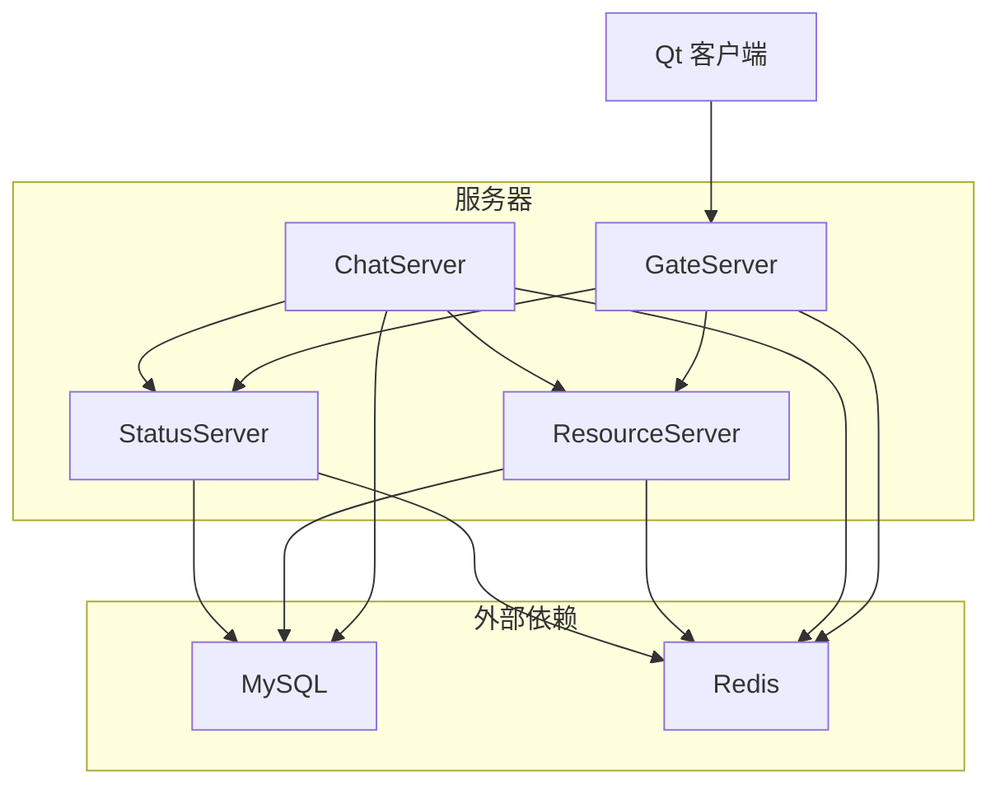
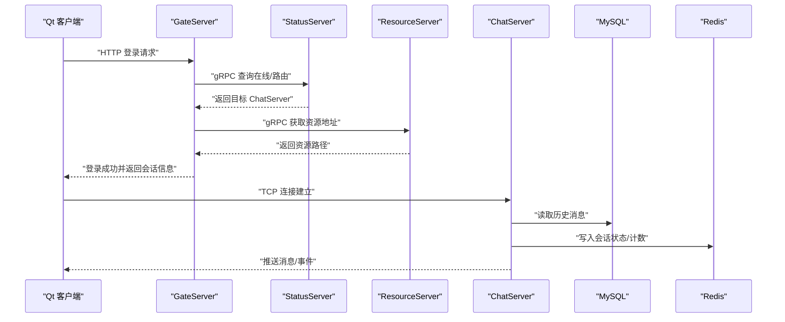
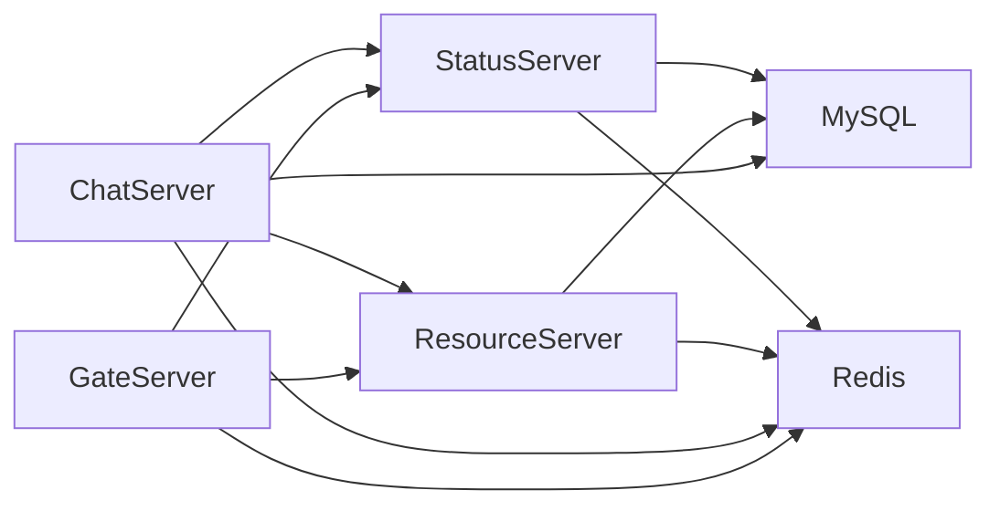

# 快速开始

<cite>
**本文引用的文件**   
- [README.md](file://README.md)
- [CMakeLists.txt](file://CMakeLists.txt)
- [CMakePresets.json](file://CMakePresets.json)
- [vcpkg.json](file://vcpkg.json)
- [AGENTS.md](file://AGENTS.md)
- [server/GateServer/config/config.ini](file://server/GateServer/config/config.ini)
- [server/ChatServer/config/chatserver1.ini](file://server/ChatServer/config/chatserver1.ini)
- [server/StatusServer/config/config.ini](file://server/StatusServer/config/config.ini)
- [server/ResourceServer/config/config.ini](file://server/ResourceServer/config/config.ini)
- [client/llfcchat/config/config.ini](file://client/llfcchat/config/config.ini)
- [server/GateServer/src/GateServer.cpp](file://server/GateServer/src/GateServer.cpp)
- [server/ChatServer/src/ChatServer.cpp](file://server/ChatServer/src/ChatServer.cpp)
- [server/StatusServer/src/StatusServer.cpp](file://server/StatusServer/src/StatusServer.cpp)
- [server/ResourceServer/src<ResourceServer.cpp](file://server/ResourceServer/src/ResourceServer.cpp)
- [sql备份/llfc.sql](file://sql备份/llfc.sql)
</cite>

## 目录
1. [简介](#简介)
2. [项目结构](#项目结构)
3. [核心组件](#核心组件)
4. [架构总览](#架构总览)
5. [详细组件分析](#详细组件分析)
6. [依赖关系分析](#依赖关系分析)
7. [性能注意事项](#性能注意事项)
8. [故障排查指南](#故障排查指南)
9. [结论](#结论)
10. [附录](#附录)

## 简介
本快速开始指南面向首次接触 LLFCChat 的开发者，提供在 Windows 环境下从零搭建、安装依赖、编译构建、启动各微服务以及基础运行测试的完整步骤。项目采用 C++ 后端（Boost.Asio、gRPC、MySQL、Redis）与 Qt 客户端，通过 CMake + vcpkg 管理依赖，使用 Ninja Multi-Config 生成器进行多配置构建。

## 项目结构
- 根目录包含 CMake 顶层脚本、预设与 vcpkg 清单，统一管理与构建流程。
- server 目录下为各微服务：GateServer、ChatServer、StatusServer、ResourceServer，每个服务拥有独立配置文件与源码。
- client/llfcchat 为 Qt 客户端工程。
- proto 目录存放 gRPC 接口定义。
- sql备份 目录包含数据库初始化脚本。

图表来源
- [CMakeLists.txt:1-34](file://CMakeLists.txt#L1-L34)
- [CMakePresets.json:1-36](file://CMakePresets.json#L1-L36)
- [vcpkg.json:1-32](file://vcpkg.json#L1-L32)

章节来源
- [CMakeLists.txt:1-34](file://CMakeLists.txt#L1-L34)
- [CMakePresets.json:1-36](file://CMakePresets.json#L1-L36)
- [vcpkg.json:1-32](file://vcpkg.json#L1-L32)

## 核心组件
- GateServer：HTTP 网关入口，负责鉴权转发、状态查询、资源路由等。
- ChatServer：聊天业务核心，处理消息收发、会话管理、心跳与踢人逻辑。
- StatusServer：状态服务，维护在线用户与服务器注册信息。
- ResourceServer：资源服务，处理头像、图片、文件上传下载。
- 验证服务（VarifyServer）：Node.js 实现，提供验证码、邮箱校验等能力。
- 客户端（Qt）：桌面聊天客户端，连接 GateServer 进行登录、聊天、资源加载。

章节来源
- [server/GateServer/src/GateServer.cpp:128-160](file://server/GateServer/src/GateServer.cpp#L128-L160)
- [server/ChatServer/src/ChatServer.cpp:20-81](file://server/ChatServer/src/ChatServer.cpp#L20-L81)
- [server/StatusServer/src/StatusServer.cpp:17-69](file://server/StatusServer/src/StatusServer.cpp#L17-L69)
- [server/ResourceServer/src/ResourceServer.cpp:15-42](file://server/ResourceServer/src/ResourceServer.cpp#L15-L42)

## 架构总览
LLFCChat 采用分层微服务架构：
- 客户端通过 HTTP/WebSocket 接入 GateServer。
- GateServer 调用 StatusServer 获取在线信息与路由，调用 ResourceServer 完成资源访问。
- ChatServer 暴露 gRPC 接口供其他服务调用，同时维护 TCP 长连接处理实时消息。
- 所有服务共享 MySQL 与 Redis，分别用于持久化与缓存/分布式锁。

图表来源
- [server/GateServer/src/GateServer.cpp:128-160](file://server/GateServer/src/GateServer.cpp#L128-L160)
- [server/ChatServer/src/ChatServer.cpp:20-81](file://server/ChatServer/src/ChatServer.cpp#L20-L81)
- [server/StatusServer/src/StatusServer.cpp:17-69](file://server/StatusServer/src/StatusServer.cpp#L17-L69)
- [server/ResourceServer/src/ResourceServer.cpp:15-42](file://server/ResourceServer/src/ResourceServer.cpp#L15-L42)

## 详细组件分析

### 环境准备（Windows）
- 安装 Visual Studio Build Tools（确保 MSVC 工具链可用）。
- 安装 CMake（VS 内置即可）与 Ninja（VS 内置）。
- 安装 vcpkg 并在环境变量中设置 VCPKG_ROOT（可选，CMakePresets 已支持默认路径）。
- 确保系统已安装或可启动 MySQL、Redis 服务。

章节来源
- [AGENTS.md:1-58](file://AGENTS.md#L1-L58)
- [CMakePresets.json:1-36](file://CMakePresets.json#L1-L36)

### 依赖项安装（vcpkg）
- 项目使用 vcpkg 清单模式，依赖包括 Boost.Asio/Beast、nlohmann-json、gRPC、protobuf、hiredis、mysql-connector-cpp、Qt5 等。
- triplet 设置为 x64-windows-static-md，安装目录位于项目根 vcpkg_installed。

章节来源
- [vcpkg.json:1-32](file://vcpkg.json#L1-L32)
- [AGENTS.md:46-58](file://AGENTS.md#L46-L58)

### 数据库与缓存部署
- MySQL：端口默认 3308，用户名 root，密码 123456.，数据库名 llfc。请导入 sql备份/llfc.sql 初始化表结构与样例数据。
- Redis：端口默认 6380，密码 123456。确保服务启动并可被本地访问。

章节来源
- [server/GateServer/config/config.ini:1-25](file://server/GateServer/config/config.ini#L1-L25)
- [server/ChatServer/config/chatserver1.ini:1-30](file://server/ChatServer/config/chatserver1.ini#L1-L30)
- [server/StatusServer/config/config.ini:1-23](file://server/StatusServer/config/config.ini#L1-L23)
- [server/ResourceServer/config/config.ini:1-27](file://server/ResourceServer/config/config.ini#L1-L27)
- [sql备份/llfc.sql:1-200](file://sql备份/llfc.sql#L1-L200)

### 编译与构建（CMake 预设）
- 使用 VS 开发环境加载后，执行以下命令：
  - 配置：cmake --preset windows-ninja
  - 构建服务器（Debug）：cmake --build out/build/windows-ninja --config Debug --target GateServer StatusServer ChatServer ResourceServer
  - 构建客户端：cmake --build out/build/windows-ninja --config Debug --target llfcchat
- Release 构建将 Debug 替换为 Release。

章节来源
- [AGENTS.md:14-35](file://AGENTS.md#L14-L35)
- [CMakePresets.json:1-36](file://CMakePresets.json#L1-L36)

### 启动各微服务
- GateServer：监听 HTTP 端口（默认 8080），需先启动 MySQL、Redis、StatusServer、ResourceServer。
- ChatServer：启动两个实例 chatserver1（TCP 8090，RPC 50055）与 chatserver2（TCP 8091，RPC 50056），需在配置中声明对端 PeerServer。
- StatusServer：gRPC 服务（默认 50052），维护 ChatServer 列表与在线状态。
- ResourceServer：静态资源与文件上传下载服务（默认 9090），输出目录与静态目录由配置指定。
- 验证服务（VarifyServer）：Node.js 服务，提供验证码与邮箱校验（端口 50051）。

章节来源
- [server/GateServer/config/config.ini:1-25](file://server/GateServer/config/config.ini#L1-L25)
- [server/ChatServer/config/chatserver1.ini:1-30](file://server/ChatServer/config/chatserver1.ini#L1-L30)
- [server/StatusServer/config/config.ini:1-23](file://server/StatusServer/config/config.ini#L1-L23)
- [server/ResourceServer/config/config.ini:1-27](file://server/ResourceServer/config/config.ini#L1-L27)
- [server/GateServer/src/GateServer.cpp:128-160](file://server/GateServer/src/GateServer.cpp#L128-L160)
- [server/ChatServer/src/ChatServer.cpp:20-81](file://server/ChatServer/src/ChatServer.cpp#L20-L81)
- [server/StatusServer/src/StatusServer.cpp:17-69](file://server/StatusServer/src/StatusServer.cpp#L17-L69)
- [server/ResourceServer/src/ResourceServer.cpp:15-42](file://server/ResourceServer/src/ResourceServer.cpp#L15-L42)

### 客户端配置与运行
- 修改 client/llfcchat/config/config.ini，设置 GateServer 的 host 与 port（默认 localhost:8080）。
- 运行客户端，尝试登录、发送消息、加载头像与图片等资源。

章节来源
- [client/llfcchat/config/config.ini:1-4](file://client/llfcchat/config/config.ini#L1-L4)

### 基本运行测试
- 启动顺序建议：MySQL → Redis → StatusServer → ResourceServer → GateServer → ChatServer（多实例）→ 客户端。
- 验证点：
  - 客户端能登录成功并进入主界面。
  - 能发送文本消息并收到对方回复。
  - 能上传/下载头像与图片资源。
  - 在线状态显示正确。

章节来源
- [server/GateServer/src/GateServer.cpp:128-160](file://server/GateServer/src/GateServer.cpp#L128-L160)
- [server/ChatServer/src/ChatServer.cpp:20-81](file://server/ChatServer/src/ChatServer.cpp#L20-L81)
- [server/StatusServer/src/StatusServer.cpp:17-69](file://server/StatusServer/src/StatusServer.cpp#L17-L69)
- [server/ResourceServer/src/ResourceServer.cpp:15-42](file://server/ResourceServer/src/ResourceServer.cpp#L15-L42)

## 依赖关系分析
- 构建依赖：CMake 3.25+、Ninja Multi-Config、MSVC 工具链、vcpkg。
- 运行时依赖：Boost.Asio/Beast、gRPC、protobuf、hiredis、mysql-connector-cpp、Qt5。
- 服务间依赖：GateServer 依赖 StatusServer、ResourceServer；ChatServer 依赖 StatusServer、ResourceServer、MySQL、Redis；ResourceServer 依赖 MySQL、Redis；StatusServer 依赖 MySQL、Redis。

图表来源
- [vcpkg.json:1-32](file://vcpkg.json#L1-L32)
- [server/GateServer/config/config.ini:1-25](file://server/GateServer/config/config.ini#L1-L25)
- [server/ChatServer/config/chatserver1.ini:1-30](file://server/ChatServer/config/chatserver1.ini#L1-L30)
- [server/StatusServer/config/config.ini:1-23](file://server/StatusServer/config/config.ini#L1-L23)
- [server/ResourceServer/config/config.ini:1-27](file://server/ResourceServer/config/config.ini#L1-L27)

章节来源
- [vcpkg.json:1-32](file://vcpkg.json#L1-L32)
- [CMakeLists.txt:1-34](file://CMakeLists.txt#L1-L34)

## 性能注意事项
- 使用 AsioIOServicePool 提升并发处理能力，合理设置线程池大小。
- Redis 用于高频读写与分布式锁，注意键空间设计与过期策略。
- MySQL 索引设计已优化常用查询（如按 thread_id 与时间排序），避免全表扫描。
- gRPC 服务应启用连接复用与超时控制，避免阻塞。

[本节为通用指导，不直接分析具体文件]

## 故障排查指南
- 无法连接 Redis：检查端口（默认 6380）、密码（默认 123456）与服务是否启动。
- 无法连接 MySQL：检查端口（默认 3308）、用户名密码与数据库是否存在，确认已导入 llfc.sql。
- 登录失败：确认 GateServer、StatusServer、ResourceServer 均已启动且配置一致。
- 聊天消息不互通：检查 ChatServer 实例是否启动、PeerServer 配置是否正确、防火墙是否放行端口。
- 资源加载失败：检查 ResourceServer 的输出目录与静态目录路径，确认文件存在且权限正确。
- 客户端连接异常：检查 client/llfcchat/config/config.ini 中的 host/port 是否与 GateServer 一致。

章节来源
- [server/GateServer/config/config.ini:1-25](file://server/GateServer/config/config.ini#L1-L25)
- [server/ChatServer/config/chatserver1.ini:1-30](file://server/ChatServer/config/chatserver1.ini#L1-L30)
- [server/StatusServer/config/config.ini:1-23](file://server/StatusServer/config/config.ini#L1-L23)
- [server/ResourceServer/config/config.ini:1-27](file://server/ResourceServer/config/config.ini#L1-L27)
- [client/llfcchat/config/config.ini:1-4](file://client/llfcchat/config/config.ini#L1-L4)
- [sql备份/llfc.sql:1-200](file://sql备份/llfc.sql#L1-L200)

## 结论
按照本指南完成环境搭建、依赖安装、编译构建与服务启动后，即可运行 LLFCChat 的全栈功能。建议在开发过程中优先保证 MySQL、Redis 与基础服务的稳定性，再逐步调试各微服务间的交互与业务逻辑。

[本节为总结性内容，不直接分析具体文件]

## 附录
- 参考文档链接与课程目录详见 README.md。
- 如需切换至第二季分支查看扩展功能，请参考 README 中的说明。

章节来源
- [README.md:1-112](file://README.md#L1-L112)