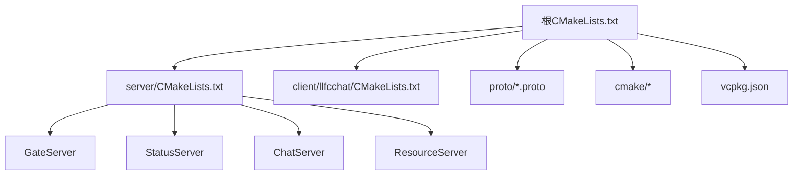
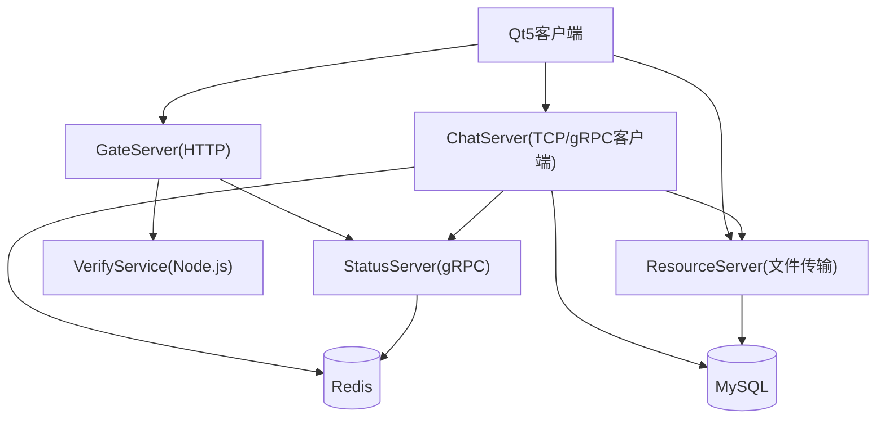
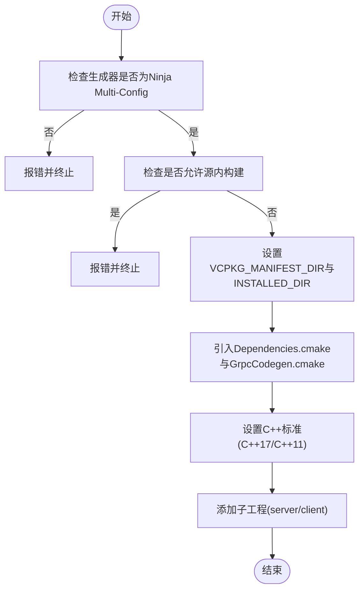
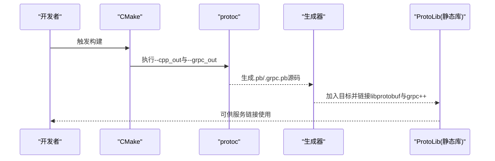
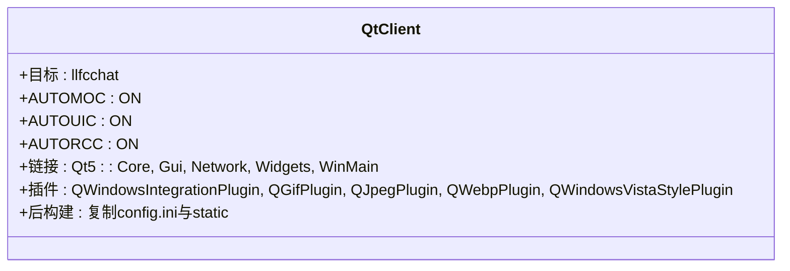
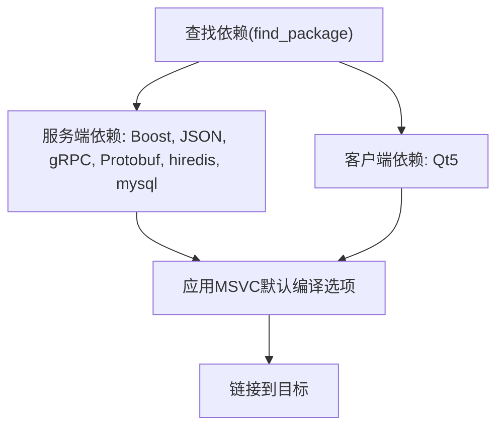
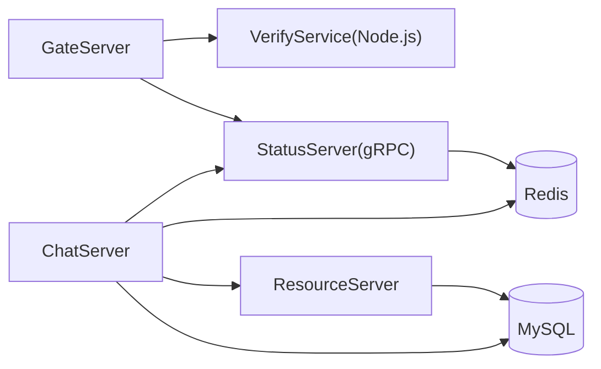
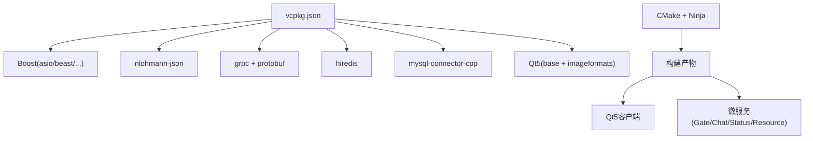

# 技术栈

<cite>
**本文引用的文件**   
- [CMakeLists.txt](file://CMakeLists.txt)
- [vcpkg.json](file://vcpkg.json)
- [README.md](file://README.md)
- [client/llfcchat/CMakeLists.txt](file://client/llfcchat/CMakeLists.txt)
- [server/CMakeLists.txt](file://server/CMakeLists.txt)
- [cmake/Dependencies.cmake](file://cmake/Dependencies.cmake)
- [cmake/GrpcCodegen.cmake](file://cmake/GrpcCodegen.cmake)
- [CMakePresets.json](file://CMakePresets.json)
- [proto/chat_service/chat.proto](file://proto/chat_service/chat.proto)
- [proto/status_service/status.proto](file://proto/status_service/status.proto)
- [proto/verify_service/verify.proto](file://proto/verify_service/verify.proto)
</cite>

## 目录
1. [简介](#简介)
2. [项目结构](#项目结构)
3. [核心组件](#核心组件)
4. [架构总览](#架构总览)
5. [详细组件分析](#详细组件分析)
6. [依赖关系分析](#依赖关系分析)
7. [性能考量](#性能考量)
8. [故障排查指南](#故障排查指南)
9. [结论](#结论)
10. [附录](#附录)

## 简介
本技术栈文档面向LLFCChat项目的开发者与集成人员，系统性梳理客户端与服务端的技术选型、构建体系、依赖管理与版本要求。客户端基于Qt5进行GUI开发；服务端采用微服务架构，使用C++17与Boost.Asio实现高性能网络IO，通过gRPC与Protocol Buffers完成服务间通信，MySQL Connector访问持久化存储，hiredis作为Redis客户端，nlohmann-json处理JSON数据。构建系统采用CMake，包管理使用vcpkg，开发环境为Visual Studio配合Ninja Multi-Config生成器。

## 项目结构
仓库采用“根级CMake聚合 + 子模块独立CMake”的多工程组织方式：
- 根CMake负责统一设置C++标准、启用vcpkg、引入公共脚本并添加子工程（server、client）。
- server下包含GateServer、StatusServer、ChatServer、ResourceServer四个微服务。
- client/llfcchat为Qt5桌面客户端工程，包含UI资源与源码。
- proto目录存放gRPC接口定义，由CMake在构建时自动生成C++代码。
- cmake目录提供依赖查找、gRPC代码生成、MSVC默认编译选项等通用脚本。
- CMakePresets.json提供Windows+Ninja的预设配置，便于IDE一键配置与构建。

图表来源 
- [CMakeLists.txt:1-34](file://CMakeLists.txt#L1-L34)
- [server/CMakeLists.txt:1-38](file://server/CMakeLists.txt#L1-L38)
- [client/llfcchat/CMakeLists.txt:1-222](file://client/llfcchat/CMakeLists.txt#L1-L222)
- [cmake/Dependencies.cmake:1-82](file://cmake/Dependencies.cmake#L1-L82)
- [cmake/GrpcCodegen.cmake:1-72](file://cmake/GrpcCodegen.cmake#L1-L72)
- [vcpkg.json:1-32](file://vcpkg.json#L1-L32)

章节来源
- [CMakeLists.txt:1-34](file://CMakeLists.txt#L1-L34)
- [server/CMakeLists.txt:1-38](file://server/CMakeLists.txt#L1-L38)
- [client/llfcchat/CMakeLists.txt:1-222](file://client/llfcchat/CMakeLists.txt#L1-L222)

## 核心组件
- 客户端（Qt5）
  - GUI框架：Qt5 Core/Gui/Network/Widgets
  - 插件：QWindowsIntegrationPlugin、图像格式插件（GIF/JPEG/WebP）、样式插件（WindowsVistaStyle）
  - 构建特性：AUTOMOC/AUTOUIC/AUTORCC自动处理MOC/UIC/RCC
  - 输出目录：统一放置于out/run/<CONFIG>/llfcchat
- 服务端（微服务）
  - GateServer：HTTP入口（Beast），对接验证服务与状态服务
  - ChatServer：聊天业务逻辑，TCP长连接（Asio），gRPC客户端调用其他服务
  - StatusServer：在线状态与心跳管理，gRPC服务实现
  - ResourceServer：文件传输与资源管理，支持断点续传
- 协议与序列化
  - gRPC + Protocol Buffers：跨服务RPC接口定义与代码生成
  - nlohmann-json：JSON解析与构造
- 网络与并发
  - Boost.Asio：异步事件循环与I/O模型
  - Boost.Beast：HTTP服务器能力（GateServer）
- 数据存储
  - MySQL Connector：关系型数据库访问
  - hiredis：Redis客户端（缓存、验证码、分布式锁等）
- 构建与工具链
  - CMake 3.25+，Ninja Multi-Config生成器
  - vcpkg包管理（x64-windows-static-md三元组）
  - Visual Studio 2022/2026 Build Tools（按预设）

章节来源
- [client/llfcchat/CMakeLists.txt:167-222](file://client/llfcchat/CMakeLists.txt#L167-L222)
- [cmake/Dependencies.cmake:1-82](file://cmake/Dependencies.cmake#L1-L82)
- [cmake/GrpcCodegen.cmake:1-72](file://cmake/GrpcCodegen.cmake#L1-L72)
- [vcpkg.json:1-32](file://vcpkg.json#L1-L32)

## 架构总览
下图展示客户端与各微服务的交互关系，以及服务间的gRPC调用路径。客户端通过HTTP登录注册流程，随后建立TCP长连接至ChatServer；状态服务维护用户在线信息；资源服务负责文件上传下载。

图表来源 
- [server/CMakeLists.txt:1-38](file://server/CMakeLists.txt#L1-L38)
- [cmake/GrpcCodegen.cmake:1-72](file://cmake/GrpcCodegen.cmake#L1-L72)
- [vcpkg.json:1-32](file://vcpkg.json#L1-L32)

## 详细组件分析

### 构建系统与版本要求
- CMake最低版本：3.25
- 生成器：Ninja Multi-Config（强制）
- C++标准：服务端C++17，客户端C++11（Qt5工程）
- vcpkg三元组：x64-windows-static-md
- MSVC运行时：多线程DLL（Debug/Release）

图表来源 
- [CMakeLists.txt:1-34](file://CMakeLists.txt#L1-L34)
- [client/llfcchat/CMakeLists.txt:1-34](file://client/llfcchat/CMakeLists.txt#L1-L34)
- [cmake/Dependencies.cmake:52-68](file://cmake/Dependencies.cmake#L52-L68)
- [CMakePresets.json:1-36](file://CMakePresets.json#L1-L36)

章节来源
- [CMakeLists.txt:1-34](file://CMakeLists.txt#L1-L34)
- [client/llfcchat/CMakeLists.txt:1-34](file://client/llfcchat/CMakeLists.txt#L1-L34)
- [CMakePresets.json:1-36](file://CMakePresets.json#L1-L36)

### gRPC与Protocol Buffers代码生成
- 通过自定义函数对每个.proto文件生成.pb与.grpc.pb源码，并封装为静态库供各服务链接。
- 生成产物位于构建目录generated/<target_name>，避免污染源码树。
- 强制c++_std_17特性，确保gRPC/protobuf兼容。

图表来源 
- [cmake/GrpcCodegen.cmake:4-47](file://cmake/GrpcCodegen.cmake#L4-L47)
- [cmake/GrpcCodegen.cmake:49-72](file://cmake/GrpcCodegen.cmake#L49-L72)

章节来源
- [cmake/GrpcCodegen.cmake:1-72](file://cmake/GrpcCodegen.cmake#L1-L72)

### Qt5客户端构建与插件
- 目标类型：WIN32可执行
- 自动处理：MOC/UIC/RCC开启
- 链接库：Qt5::Core/Gui/Network/Widgets/WinMain
- 插件导入：平台插件、图像格式插件（WebP）、样式插件
- 后构建命令：复制config.ini与static资源到输出目录

图表来源 
- [client/llfcchat/CMakeLists.txt:167-222](file://client/llfcchat/CMakeLists.txt#L167-L222)

章节来源
- [client/llfcchat/CMakeLists.txt:167-222](file://client/llfcchat/CMakeLists.txt#L167-L222)

### 依赖解析与MSVC默认选项
- 服务端依赖：Boost(asio/beast/date_time/filesystem/property_tree/uuid)、nlohmann_json、gRPC、Protobuf、hiredis、mysql-concpp
- 客户端依赖：Qt5(Core/Gui/Network/Widgets)
- MSVC默认：UTF-8编码、关闭警告4819、多线程DLL运行时

图表来源 
- [cmake/Dependencies.cmake:6-34](file://cmake/Dependencies.cmake#L6-L34)

章节来源
- [cmake/Dependencies.cmake:1-82](file://cmake/Dependencies.cmake#L1-L82)

### 微服务职责划分
- GateServer：HTTP入口，处理注册/登录请求，调用VerifyService与StatusService
- ChatServer：聊天会话管理、消息路由、文件传输协调
- StatusServer：用户在线状态、心跳检测、踢人逻辑
- ResourceServer：文件分片上传、断点续传、图片资源异步通知

图表来源 
- [server/CMakeLists.txt:1-38](file://server/CMakeLists.txt#L1-L38)

章节来源
- [server/CMakeLists.txt:1-38](file://server/CMakeLists.txt#L1-L38)

## 依赖关系分析
- 语言与标准
  - C++17（服务端）、C++11（客户端）
- 第三方库（vcpkg声明）
  - boost-asio、boost-beast、boost-date-time、boost-filesystem、boost-property-tree、boost-uuid
  - nlohmann-json
  - grpc、protobuf
  - hiredis
  - mysql-connector-cpp（jdbc特性）
  - qt5-base（默认功能关闭）、qt5-imageformats（webp特性）
- 构建工具
  - CMake 3.25+，Ninja Multi-Config
  - vcpkg（x64-windows-static-md）
  - Visual Studio Build Tools

图表来源 
- [vcpkg.json:1-32](file://vcpkg.json#L1-L32)
- [CMakeLists.txt:1-34](file://CMakeLists.txt#L1-L34)
- [CMakePresets.json:1-36](file://CMakePresets.json#L1-L36)

章节来源
- [vcpkg.json:1-32](file://vcpkg.json#L1-L32)
- [CMakeLists.txt:1-34](file://CMakeLists.txt#L1-L34)
- [CMakePresets.json:1-36](file://CMakePresets.json#L1-L36)

## 性能考量
- Asio事件循环：单线程高并发I/O，适合大量短连接或长连接场景
- gRPC二进制协议：高效序列化与压缩，降低带宽占用
- Redis缓存：热点数据与验证码快速存取，减轻MySQL压力
- 文件分片与断点续传：提升大文件传输稳定性与用户体验
- 插件按需加载：Qt图像与样式插件减少初始开销
- 建议：合理设置线程池大小、连接池参数与超时策略，监控CPU与内存峰值

## 故障排查指南
- 构建失败
  - 确认生成器为Ninja Multi-Config，且非源内构建
  - 检查vcpkg安装目录与三元组x64-windows-static-md是否正确
  - 查看CMake日志中find_package错误信息
- gRPC代码生成失败
  - 确认protoc与grpc_cpp_plugin可用
  - 检查.proto路径与输出目录权限
- 运行期问题
  - 检查config.ini与static资源是否复制到输出目录
  - 确认MySQL与Redis服务可达，账号密码正确
  - 观察端口冲突与防火墙规则

章节来源
- [CMakeLists.txt:1-34](file://CMakeLists.txt#L1-L34)
- [client/llfcchat/CMakeLists.txt:212-222](file://client/llfcchat/CMakeLists.txt#L212-L222)
- [cmake/GrpcCodegen.cmake:4-47](file://cmake/GrpcCodegen.cmake#L4-L47)

## 结论
LLFCChat以C++17为核心，结合Boost.Asio的高性能网络能力与gRPC/Protobuf的强类型服务契约，构建了可扩展的微服务架构。Qt5客户端提供丰富的GUI能力，CMake+vcpkg提供一致的构建与依赖管理体验。通过合理的分层设计与缓存策略，项目在功能完整性与性能之间取得良好平衡。

## 附录
- 协议定义位置：proto/chat_service/chat.proto、proto/status_service/status.proto、proto/verify_service/verify.proto
- 开发文档索引：README.md中的课程目录与进阶主题

章节来源
- [README.md:1-112](file://README.md#L1-L112)
- [proto/chat_service/chat.proto](file://proto/chat_service/chat.proto)
- [proto/status_service/status.proto](file://proto/status_service/status.proto)
- [proto/verify_service/verify.proto](file://proto/verify_service/verify.proto)