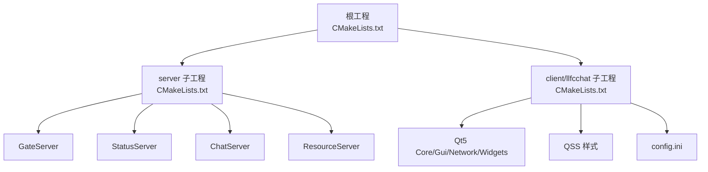
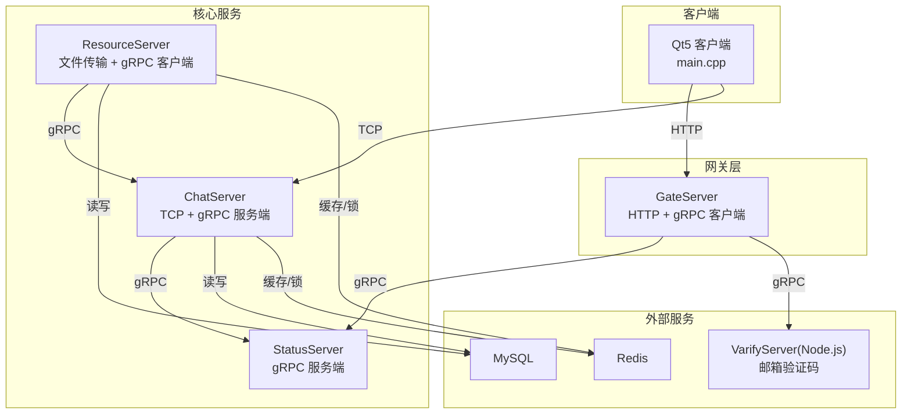
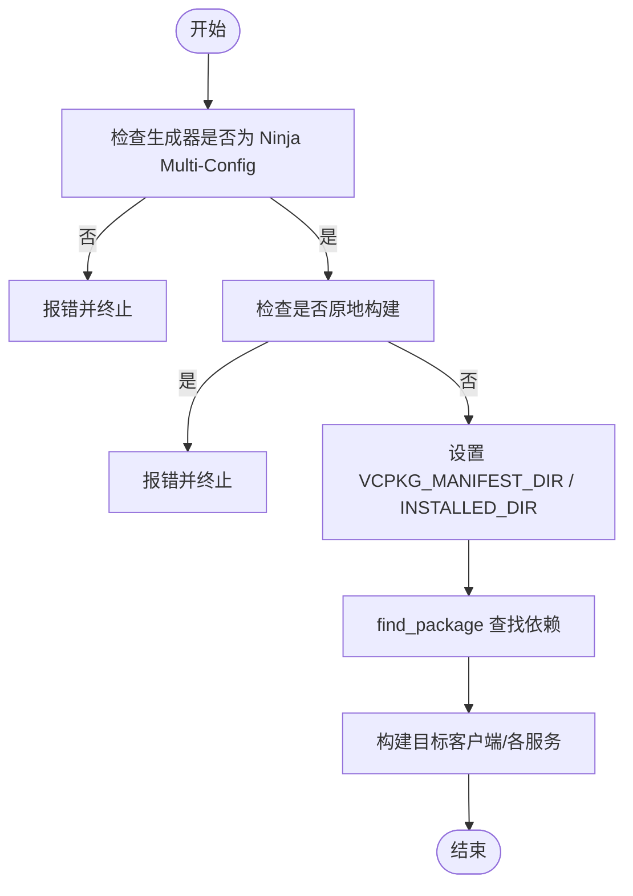
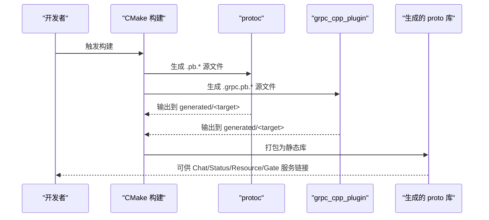
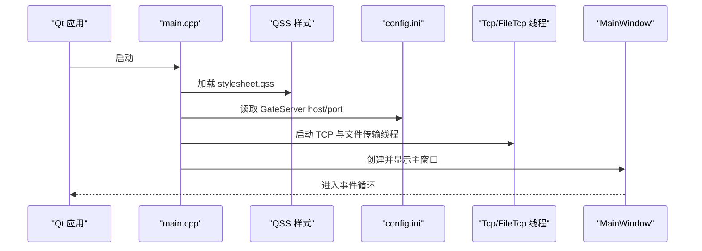
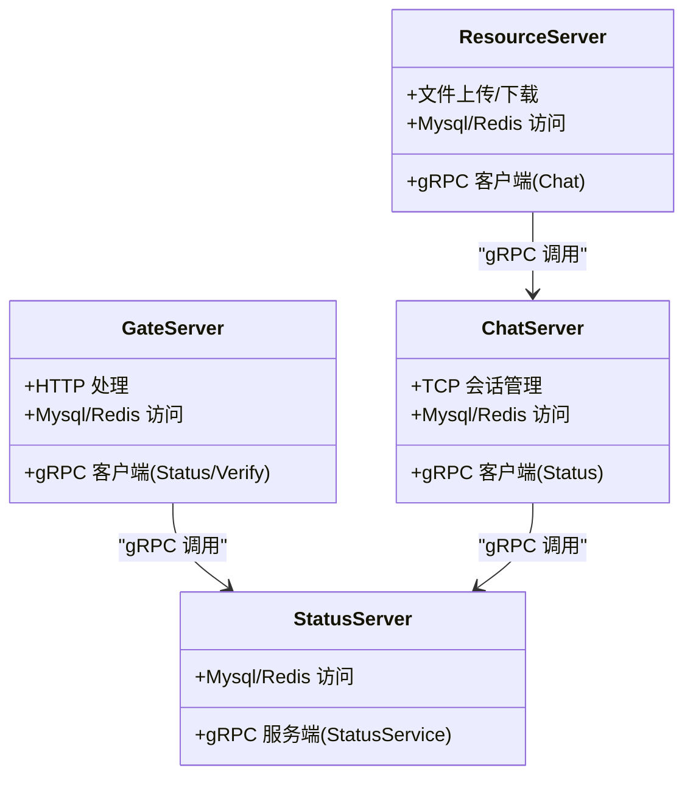
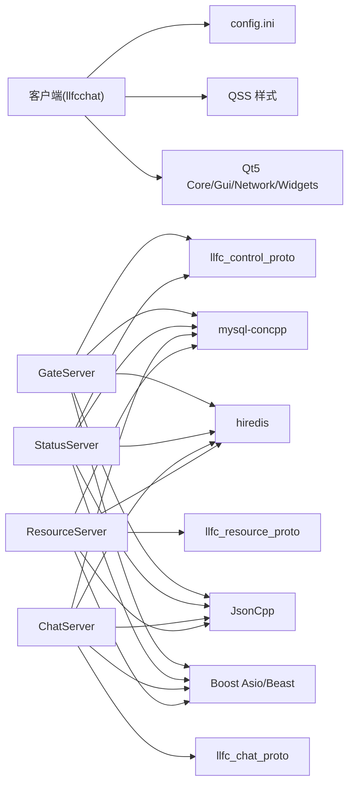

# 技术栈概览

<cite>
**本文引用的文件**
- [README.md](file://README.md)
- [vcpkg.json](file://vcpkg.json)
- [CMakeLists.txt](file://CMakeLists.txt)
- [cmake/Dependencies.cmake](file://cmake/Dependencies.cmake)
- [cmake/GrpcCodegen.cmake](file://cmake/GrpcCodegen.cmake)
- [client/llfcchat/CMakeLists.txt](file://client/llfcchat/CMakeLists.txt)
- [server/CMakeLists.txt](file://server/CMakeLists.txt)
- [server/ChatServer/CMakeLists.txt](file://server/ChatServer/CMakeLists.txt)
- [server/GateServer/CMakeLists.txt](file://server/GateServer/CMakeLists.txt)
- [server/StatusServer/CMakeLists.txt](file://server/StatusServer/CMakeLists.txt)
- [server/ResourceServer/CMakeLists.txt](file://server/ResourceServer/CMakeLists.txt)
- [server/proto/chat/message.proto](file://server/proto/chat/message.proto)
- [server/proto/control/message.proto](file://server/proto/control/message.proto)
- [server/proto/resource/message.proto](file://server/proto/resource/message.proto)
- [client/llfcchat/src/main.cpp](file://client/llfcchat/src/main.cpp)
</cite>

## 目录
1. [简介](#简介)
2. [项目结构](#项目结构)
3. [核心组件](#核心组件)
4. [架构总览](#架构总览)
5. [详细组件分析](#详细组件分析)
6. [依赖关系分析](#依赖关系分析)
7. [性能考量](#性能考量)
8. [故障排查指南](#故障排查指南)
9. [结论](#结论)
10. [附录](#附录)

## 简介
LLFCChat 是一个基于 C++17 的跨平台聊天系统，采用 Qt5 构建桌面客户端，服务端采用微服务架构并通过 gRPC 进行服务间通信。项目使用 Boost.Asio/Beast 实现高性能异步 I/O，借助 MySQL 持久化数据、Redis 提供缓存与分布式锁能力，JSONcpp 用于 JSON 数据处理。构建系统采用 CMake，包管理通过 vcpkg 统一依赖版本与安装路径，确保多模块一致的可复现构建体验。

本技术栈概览面向初学者解释选型背景，同时为有经验的开发者提供深入的技术细节与最佳实践建议。

## 项目结构
- 根级 CMake 清单定义全局构建要求（Ninja Multi-Config、C++17、vcpkg 集成），并聚合 server 与 client 子工程。
- 客户端位于 client/llfcchat，使用 Qt5 构建 GUI，包含 UI、资源、样式与网络/业务逻辑源码。
- 服务端位于 server，按职责拆分为 GateServer、StatusServer、ChatServer、ResourceServer 四个微服务，每个服务独立 CMake 配置与可执行产物。
- 协议定义集中在 server/proto，分别对应 chat、control、resource 三个领域，由自定义 CMake 脚本生成 gRPC/Protobuf 代码。
- cmake 目录下提供通用依赖解析与 gRPC 代码生成工具函数，统一各子工程的编译行为。

图表来源
- [CMakeLists.txt:1-34](file://CMakeLists.txt#L1-L34)
- [server/CMakeLists.txt:1-38](file://server/CMakeLists.txt#L1-L38)
- [client/llfcchat/CMakeLists.txt:1-222](file://client/llfcchat/CMakeLists.txt#L1-L222)

章节来源
- [CMakeLists.txt:1-34](file://CMakeLists.txt#L1-L34)
- [server/CMakeLists.txt:1-38](file://server/CMakeLists.txt#L1-L38)
- [client/llfcchat/CMakeLists.txt:1-222](file://client/llfcchat/CMakeLists.txt#L1-L222)

## 核心组件
- C++17 标准：根工程强制启用 C++17，提升语言特性与性能表现。
- Qt5 GUI：客户端使用 Qt5 Widgets 构建桌面界面，支持样式表与插件机制。
- Boost.Asio/Beast：服务端高并发网络 I/O 与 HTTP 处理。
- gRPC + Protobuf：服务间 RPC 接口定义与代码生成。
- MySQL Connector/C++：数据库访问与持久化。
- Redis（hiredis）：缓存、分布式锁与会话状态。
- JSONcpp：JSON 数据序列化/反序列化。
- CMake + vcpkg：跨平台构建与依赖管理。

章节来源
- [CMakeLists.txt:28-30](file://CMakeLists.txt#L28-L30)
- [client/llfcchat/CMakeLists.txt:191-207](file://client/llfcchat/CMakeLists.txt#L191-L207)
- [cmake/Dependencies.cmake:6-24](file://cmake/Dependencies.cmake#L6-L24)
- [vcpkg.json:6-31](file://vcpkg.json#L6-L31)

## 架构总览
客户端通过 HTTP 与 GateServer 交互完成注册、登录等控制流程；登录后通过 TCP 长连接接入 ChatServer 进行消息收发；图片等资源通过 ResourceServer 提供下载；StatusServer 负责用户状态管理与会话路由；验证码与邮件等服务由独立的 Node.js 服务提供，并通过 gRPC 被 C++ 服务调用。

图表来源
- [server/proto/control/message.proto:1-143](file://server/proto/control/message.proto#L1-L143)
- [server/proto/chat/message.proto:1-167](file://server/proto/chat/message.proto#L1-L167)
- [server/proto/resource/message.proto:1-169](file://server/proto/resource/message.proto#L1-L169)
- [client/llfcchat/src/main.cpp:1-44](file://client/llfcchat/src/main.cpp#L1-L44)

## 详细组件分析

### 构建系统与依赖管理（CMake + vcpkg）
- 根 CMake 清单强制使用 Ninja Multi-Config 生成器，禁止原地构建，设置 vcpkg 安装目录与仓库根路径。
- 通过 cmake/Dependencies.cmake 统一查找第三方库（Boost、jsoncpp、gRPC、protobuf、hiredis、mysql-concpp）。
- 客户端 CMake 清单链接 Qt5 模块，启用 MOC/UIC/RCC，静态导入平台与图像格式插件。
- vcpkg.json 声明所有依赖及特性开关（如 qt5-imageformats 的 webp）。

图表来源
- [CMakeLists.txt:4-16](file://CMakeLists.txt#L4-L16)
- [cmake/Dependencies.cmake:6-24](file://cmake/Dependencies.cmake#L6-L24)
- [client/llfcchat/CMakeLists.txt:167-207](file://client/llfcchat/CMakeLists.txt#L167-L207)
- [vcpkg.json:6-31](file://vcpkg.json#L6-L31)

章节来源
- [CMakeLists.txt:1-34](file://CMakeLists.txt#L1-L34)
- [cmake/Dependencies.cmake:1-82](file://cmake/Dependencies.cmake#L1-L82)
- [client/llfcchat/CMakeLists.txt:1-222](file://client/llfcchat/CMakeLists.txt#L1-L222)
- [vcpkg.json:1-32](file://vcpkg.json#L1-L32)

### gRPC 协议与代码生成
- 协议文件位于 server/proto，按领域划分 control、chat、resource。
- cmake/GrpcCodegen.cmake 提供 llfc_add_proto_library 函数，调用 protoc 与 grpc_cpp_plugin 生成 .pb.cc/.grpc.pb.cc 与头文件，并封装为静态库供各服务引用。
- 各服务 CMake 清单中通过 llfc_ensure_*_proto() 确保对应协议库存在并参与构建。

图表来源
- [cmake/GrpcCodegen.cmake:1-72](file://cmake/GrpcCodegen.cmake#L1-L72)
- [server/proto/control/message.proto:1-143](file://server/proto/control/message.proto#L1-L143)
- [server/proto/chat/message.proto:1-167](file://server/proto/chat/message.proto#L1-L167)
- [server/proto/resource/message.proto:1-169](file://server/proto/resource/message.proto#L1-L169)

章节来源
- [cmake/GrpcCodegen.cmake:1-72](file://cmake/GrpcCodegen.cmake#L1-L72)
- [server/proto/control/message.proto:1-143](file://server/proto/control/message.proto#L1-L143)
- [server/proto/chat/message.proto:1-167](file://server/proto/chat/message.proto#L1-L167)
- [server/proto/resource/message.proto:1-169](file://server/proto/resource/message.proto#L1-L169)

### 客户端（Qt5）
- main.cpp 初始化 QApplication，加载 QSS 样式，读取 config.ini 中的 GateServer 地址前缀，启动 TCP 线程与文件传输线程，显示主窗口。
- CMake 清单链接 Qt5::Core/Gui/Network/Widgets，启用 AUTOMOC/AUTOUIC/AUTORCC，静态导入 Windows 平台与图像格式插件。

图表来源
- [client/llfcchat/src/main.cpp:1-44](file://client/llfcchat/src/main.cpp#L1-L44)
- [client/llfcchat/CMakeLists.txt:167-207](file://client/llfcchat/CMakeLists.txt#L167-L207)

章节来源
- [client/llfcchat/src/main.cpp:1-44](file://client/llfcchat/src/main.cpp#L1-L44)
- [client/llfcchat/CMakeLists.txt:167-207](file://client/llfcchat/CMakeLists.txt#L167-L207)

### 服务端微服务
- GateServer：HTTP 入口，处理注册、登录等控制请求，作为 gRPC 客户端调用 StatusServer 与 VarifyServer。
- StatusServer：gRPC 服务端，提供用户状态查询与登录校验，维护会话路由信息。
- ChatServer：TCP 服务端，处理实时聊天消息、好友申请与通知，通过 gRPC 客户端与 StatusServer 交互。
- ResourceServer：文件传输服务，支持断点续传与进度回调，通过 gRPC 客户端与 ChatServer 协作。

图表来源
- [server/GateServer/CMakeLists.txt:37-90](file://server/GateServer/CMakeLists.txt#L37-L90)
- [server/StatusServer/CMakeLists.txt:36-85](file://server/StatusServer/CMakeLists.txt#L36-L85)
- [server/ChatServer/CMakeLists.txt:36-109](file://server/ChatServer/CMakeLists.txt#L36-L109)
- [server/ResourceServer/CMakeLists.txt:36-104](file://server/ResourceServer/CMakeLists.txt#L36-L104)

章节来源
- [server/GateServer/CMakeLists.txt:1-90](file://server/GateServer/CMakeLists.txt#L1-L90)
- [server/StatusServer/CMakeLists.txt:1-85](file://server/StatusServer/CMakeLists.txt#L1-L85)
- [server/ChatServer/CMakeLists.txt:1-109](file://server/ChatServer/CMakeLists.txt#L1-L109)
- [server/ResourceServer/CMakeLists.txt:1-104](file://server/ResourceServer/CMakeLists.txt#L1-L104)

### 数据与缓存（MySQL + Redis + JSONcpp）
- MySQL Connector/C++ 用于持久化用户、消息、文件元数据等。
- hiredis 提供 Redis 客户端，用于缓存热点数据与分布式锁。
- JSONcpp 用于 JSON 数据的序列化和反序列化，配合 HTTP/gRPC 业务逻辑。

章节来源
- [cmake/Dependencies.cmake:6-20](file://cmake/Dependencies.cmake#L6-L20)
- [vcpkg.json:6-31](file://vcpkg.json#L6-L31)

## 依赖关系分析
- 客户端依赖 Qt5 模块与资源插件，通过 CMake 自动发现与链接。
- 服务端各服务均依赖 Boost.Asio/Beast、jsoncpp、hiredis、mysql-concpp，并通过 gRPC/Protobuf 进行服务间通信。
- 协议库（llfc_control_proto、llfc_chat_proto、llfc_resource_proto）由各服务按需引入，避免重复生成。

图表来源
- [client/llfcchat/CMakeLists.txt:191-207](file://client/llfcchat/CMakeLists.txt#L191-L207)
- [server/GateServer/CMakeLists.txt:67-90](file://server/GateServer/CMakeLists.txt#L67-L90)
- [server/StatusServer/CMakeLists.txt:62-85](file://server/StatusServer/CMakeLists.txt#L62-L85)
- [server/ChatServer/CMakeLists.txt:77-109](file://server/ChatServer/CMakeLists.txt#L77-L109)
- [server/ResourceServer/CMakeLists.txt:81-104](file://server/ResourceServer/CMakeLists.txt#L81-L104)

章节来源
- [client/llfcchat/CMakeLists.txt:191-207](file://client/llfcchat/CMakeLists.txt#L191-L207)
- [server/GateServer/CMakeLists.txt:67-90](file://server/GateServer/CMakeLists.txt#L67-L90)
- [server/StatusServer/CMakeLists.txt:62-85](file://server/StatusServer/CMakeLists.txt#L62-L85)
- [server/ChatServer/CMakeLists.txt:77-109](file://server/ChatServer/CMakeLists.txt#L77-L109)
- [server/ResourceServer/CMakeLists.txt:81-104](file://server/ResourceServer/CMakeLists.txt#L81-L104)

## 性能考量
- 使用 C++17 与 Boost.Asio 的高并发模型，减少阻塞 I/O 带来的延迟。
- gRPC 基于 HTTP/2 与 Protobuf 二进制序列化，降低网络开销与 CPU 消耗。
- Redis 缓存热点数据与分布式锁，减轻 MySQL 压力并提高一致性。
- Qt5 客户端启用静态插件导入，减少运行时依赖与动态加载开销。
- 构建阶段统一依赖版本与安装路径，避免多环境不一致导致的性能退化。

[本节为通用指导，不直接分析具体文件]

## 故障排查指南
- 构建失败：确认使用 Ninja Multi-Config 生成器，且不在源码目录内构建；检查 vcpkg 安装目录与 manifest 路径是否正确。
- 依赖缺失：核对 vcpkg.json 与 cmake/Dependencies.cmake 中的 find_package 名称与组件列表。
- gRPC 生成错误：检查 proto 文件路径与 protoc/grpc_cpp_plugin 可用性与版本匹配。
- 客户端样式加载失败：确认 QSS 文件在资源文件中且路径正确。
- 配置文件读取异常：检查 config.ini 是否存在且字段名与键值正确。

章节来源
- [CMakeLists.txt:4-16](file://CMakeLists.txt#L4-L16)
- [cmake/Dependencies.cmake:6-24](file://cmake/Dependencies.cmake#L6-L24)
- [cmake/GrpcCodegen.cmake:1-72](file://cmake/GrpcCodegen.cmake#L1-L72)
- [client/llfcchat/src/main.cpp:11-34](file://client/llfcchat/src/main.cpp#L11-L34)

## 结论
LLFCChat 以 C++17 为核心，结合 Qt5 与 Boost.Asio 构建高性能桌面客户端与服务端，通过 gRPC 实现微服务间高效通信，MySQL 与 Redis 提供可靠的数据与缓存支撑，CMake 与 vcpkg 保障构建的一致性与可移植性。该架构既满足初学者快速上手的需求，也为进阶开发者提供了可扩展、可维护的工程实践参考。

[本节为总结性内容，不直接分析具体文件]

## 附录
- 技术选型背景
  - C++17：现代语言特性与性能优化，适合高性能网络与图形应用。
  - Qt5：成熟的 GUI 框架，丰富的控件与插件生态，便于快速开发桌面应用。
  - Boost.Asio/Beast：跨平台异步 I/O 与 HTTP 处理能力，适合高并发服务端。
  - gRPC/Protobuf：强类型接口与高效序列化，简化微服务通信。
  - MySQL/Redis：成熟稳定的关系型数据库与内存缓存，覆盖持久化与热点数据场景。
  - JSONcpp：轻量高效的 JSON 处理库，适配 HTTP API 与日志记录。
  - CMake/vcpkg：标准化构建与依赖管理，提升团队协作效率。

[本节为概念性内容，不直接分析具体文件]