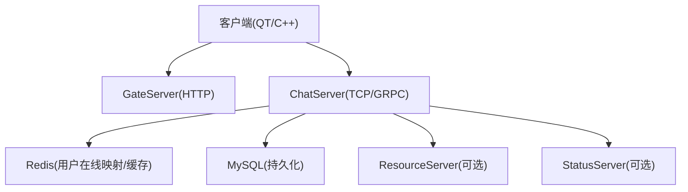
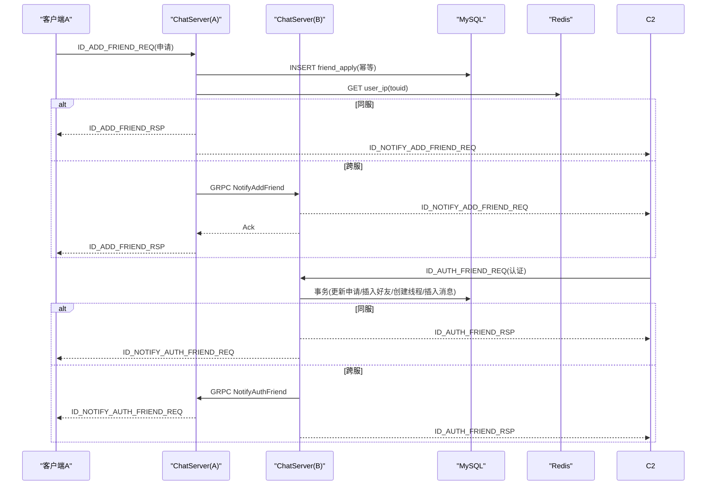
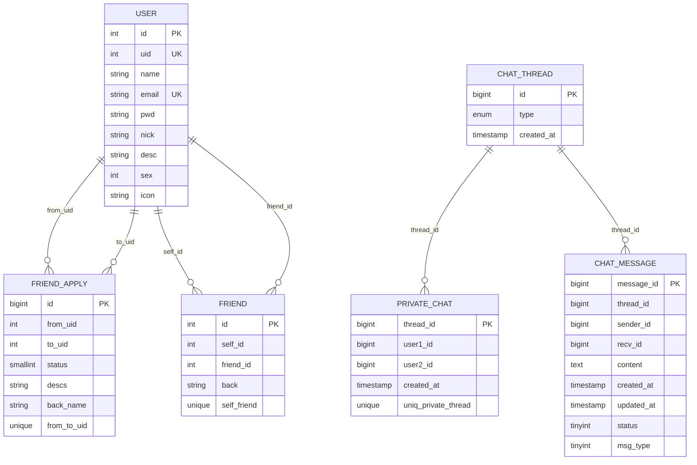
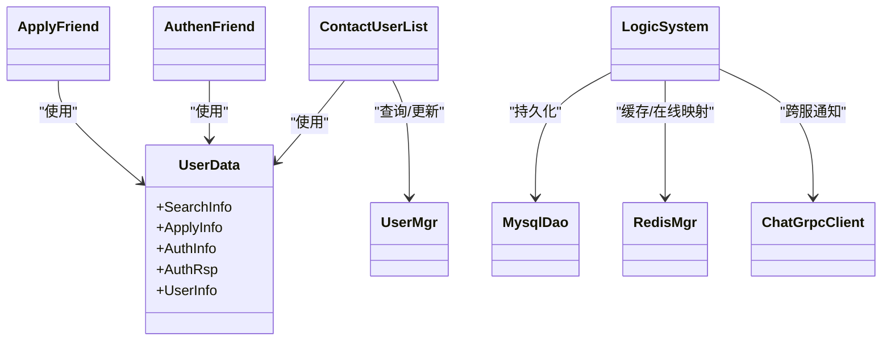
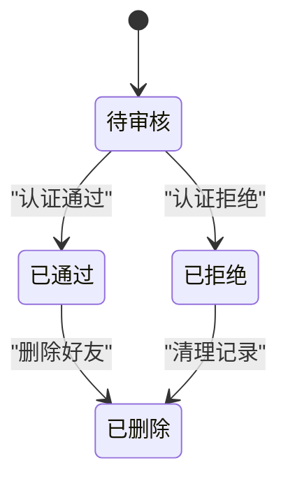
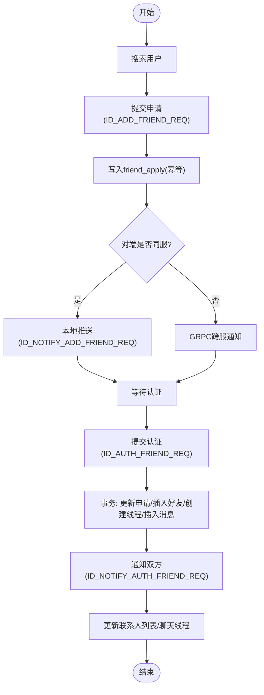

# 好友关系管理

<cite>
**本文引用的文件**   
- [README.md](file://README.md)
- [llfc.sql](file://sql备份/llfc.sql)
- [applyfriend.h](file://client/llfcchat/include/applyfriend.h)
- [authenfriend.h](file://client/llfcchat/include/authenfriend.h)
- [contactuserlist.h](file://client/llfcchat/include/contactuserlist.h)
- [userdata.h](file://client/llfcchat/include/userdata.h)
- [applyfriendpage.cpp](file://client/llfcchat/src/applyfriendpage.cpp)
- [usermgr.cpp](file://client/llfcchat/src/usermgr.cpp)
- [LogicSystem.h](file://server/ChatServer/include/LogicSystem.h)
- [LogicSystem.cpp](file://server/ChatServer/src/LogicSystem.cpp)
- [MysqlDao.cpp（ChatServer）](file://server/ChatServer/src/MysqlDao.cpp)
- [MysqlDao.cpp（ResourceServer）](file://server/ResourceServer/src/MysqlDao.cpp)
- [day28-好友查询和申请.md](file://开发文档/day28-好友查询和申请.md)
- [day37-聊天信息存储方案.md](file://开发文档/day37-聊天信息存储方案.md)
</cite>

## 目录
1. [简介](#简介)
2. [项目结构](#项目结构)
3. [核心组件](#核心组件)
4. [架构总览](#架构总览)
5. [详细组件分析](#详细组件分析)
6. [依赖关系分析](#依赖关系分析)
7. [性能与一致性](#性能与一致性)
8. [故障排查指南](#故障排查指南)
9. [结论](#结论)
10. [附录：数据模型与状态机](#附录数据模型与状态机)

## 简介
本文件面向LLFCChat的“好友关系管理”模块，覆盖好友申请、认证、联系人列表管理等核心功能。内容包含：
- 客户端界面交互流程（搜索、申请、认证、联系人展示）
- 后端服务业务逻辑（请求路由、跨服通知、数据库事务）
- 数据库设计（好友关系表、申请记录表、会话线程表）
- 状态流转与冲突处理（并发安全、死锁避免、幂等性）
- 数据流图与状态机图
- 异常处理与数据一致性保证
- 扩展接口与使用示例

## 项目结构
本项目采用前后端分离与多服务架构：
- 客户端（Qt/C++）：负责UI交互、本地数据缓存、TCP通信
- ChatServer：核心聊天与好友关系逻辑、消息路由、Redis/MySQL访问
- ResourceServer：资源相关操作（含部分DAO实现）
- StatusServer/GateServer/VarifyServer：状态、网关、验证码等服务（与本模块间接相关）

**图表来源**
- [LogicSystem.h](file://server/ChatServer/include/LogicSystem.h)
- [LogicSystem.cpp](file://server/ChatServer/src/LogicSystem.cpp)
- [MysqlDao.cpp（ChatServer）](file://server/ChatServer/src/MysqlDao.cpp)
- [MysqlDao.cpp（ResourceServer）](file://server/ResourceServer/src/MysqlDao.cpp)

**章节来源**
- [README.md](file://README.md)

## 核心组件
- 客户端侧
  - ApplyFriend：好友申请对话框，支持标签输入、确认/取消
  - AuthenFriend：好友认证对话框，支持备注标签、确认/取消
  - ContactUserList：联系人列表控件，支持红点提示、点击跳转、认证响应处理
  - UserMgr：本地用户数据管理器，维护申请列表、好友列表分页加载
  - userdata.h：数据结构定义（SearchInfo、ApplyInfo、AuthInfo、AuthRsp、UserInfo等）
- 服务端侧
  - LogicSystem：消息路由与业务编排（搜索、申请、认证、聊天线程）
  - MysqlDao：数据库访问层（申请写入、认证更新、好友关系插入、会话创建）
  - RedisMgr：用户在线映射与基础信息缓存

**章节来源**
- [applyfriend.h](file://client/llfcchat/include/applyfriend.h)
- [authenfriend.h](file://client/llfcchat/include/authenfriend.h)
- [contactuserlist.h](file://client/llfcchat/include/contactuserlist.h)
- [userdata.h](file://client/llfcchat/include/userdata.h)
- [usermgr.cpp](file://client/llfcchat/src/usermgr.cpp)
- [LogicSystem.h](file://server/ChatServer/include/LogicSystem.h)
- [LogicSystem.cpp](file://server/ChatServer/src/LogicSystem.cpp)
- [MysqlDao.cpp（ChatServer）](file://server/ChatServer/src/MysqlDao.cpp)
- [MysqlDao.cpp（ResourceServer）](file://server/ResourceServer/src/MysqlDao.cpp)

## 架构总览
好友关系管理的端到端流程如下：
- 客户端发起“添加好友”请求到ChatServer
- ChatServer将申请写入MySQL并通知对端（同服直接推送；跨服通过GRPC）
- 对端收到申请后在本地显示，并可进入认证界面
- 认证通过后，服务端执行事务：更新申请状态、插入双向好友关系、创建私聊线程、插入初始消息
- 双方同步联系人列表与聊天线程

**图表来源**
- [LogicSystem.cpp](file://server/ChatServer/src/LogicSystem.cpp)
- [MysqlDao.cpp（ChatServer）](file://server/ChatServer/src/MysqlDao.cpp)
- [MysqlDao.cpp（ResourceServer）](file://server/ResourceServer/src/MysqlDao.cpp)
- [day28-好友查询和申请.md](file://开发文档/day28-好友查询和申请.md)
- [day37-聊天信息存储方案.md](file://开发文档/day37-聊天信息存储方案.md)

## 详细组件分析

### 客户端：好友申请界面（ApplyFriend）
- 功能要点
  - 输入框支持标签快速选择与自定义输入
  - 提交时携带当前用户uid、目标uid、备注名、对方备注名
  - 发送ID_ADD_FRIEND_REQ至服务器
- 关键槽函数
  - SlotApplySure：组装JSON并发送请求
  - SlotApplyCancel：关闭对话框
- 与UserMgr联动
  - 已存在申请则去重（AlreadyApply）
  - 新增申请加入本地列表（AddApplyList）

**章节来源**
- [applyfriend.h](file://client/llfcchat/include/applyfriend.h)
- [day28-好友查询和申请.md](file://开发文档/day28-好友查询和申请.md)
- [usermgr.cpp](file://client/llfcchat/src/usermgr.cpp)

### 客户端：好友认证界面（AuthenFriend）
- 功能要点
  - 显示申请方信息，支持备注标签选择或自定义
  - 提交ID_AUTH_FRIEND_REQ至服务器
- 关键槽函数
  - SlotApplySure：组装认证请求
  - SlotApplyCancel：取消认证
- 与ContactUserList联动
  - 认证通过后，根据AuthRsp将新好友插入联系人列表

**章节来源**
- [authenfriend.h](file://client/llfcchat/include/authenfriend.h)
- [contactuserlist.h](file://client/llfcchat/include/contactuserlist.h)
- [day28-好友查询和申请.md](file://开发文档/day28-好友查询和申请.md)

### 客户端：联系人列表（ContactUserList）
- 功能要点
  - 红点提示未读申请/认证结果
  - 点击条目切换至好友信息页或聊天页
  - 监听认证响应信号，动态插入新好友项
- 关键槽函数
  - slot_auth_rsp：校验是否已是好友，非好友则插入列表

**章节来源**
- [contactuserlist.h](file://client/llfcchat/include/contactuserlist.h)
- [day28-好友查询和申请.md](file://开发文档/day28-好友查询和申请.md)

### 客户端：用户数据管理（UserMgr）
- 功能要点
  - 维护申请列表（GetApplyList/AddApplyList）
  - 检查重复申请（AlreadyApply）
  - 好友列表分页加载（GetChatListPerPage/GetConListPerPage）
- 并发控制
  - 使用互斥锁保护容器读写

**章节来源**
- [usermgr.cpp](file://client/llfcchat/src/usermgr.cpp)

### 服务端：逻辑编排（LogicSystem）
- 功能要点
  - 注册回调：搜索、申请、认证、聊天线程等
  - AddFriendApply：写入申请、查询对端IP、同服直推或跨服GRPC
  - AuthFriendApply：返回认证信息、调用AddFriend事务、通知对端
  - GetFriendApplyInfo/GetFriendList：从MySQL拉取申请/好友列表
- 缓存策略
  - 优先Redis读取用户基础信息，缺失则回源MySQL并写回缓存

**章节来源**
- [LogicSystem.h](file://server/ChatServer/include/LogicSystem.h)
- [LogicSystem.cpp](file://server/ChatServer/src/LogicSystem.cpp)

### 服务端：数据库访问（MysqlDao）
- 申请写入
  - AddFriendApply：INSERT ... ON DUPLICATE KEY UPDATE，确保幂等
- 认证更新
  - AuthFriendApply：UPDATE friend_apply SET status=1
- 好友关系建立（事务）
  - AddFriend：锁定申请记录、更新状态、按固定顺序插入双向好友、创建chat_thread、插入private_chat、插入初始消息（申请备注与系统欢迎语），最后commit

**章节来源**
- [MysqlDao.cpp（ChatServer）](file://server/ChatServer/src/MysqlDao.cpp)
- [MysqlDao.cpp（ResourceServer）](file://server/ResourceServer/src/MysqlDao.cpp)
- [day37-聊天信息存储方案.md](file://开发文档/day37-聊天信息存储方案.md)

### 数据模型（ER图）

**图表来源**
- [llfc.sql](file://sql备份/llfc.sql)

## 依赖关系分析
- 客户端依赖
  - UI组件（ApplyFriend/AuthenFriend/ContactUserList）依赖数据结构（userdata.h）
  - 网络通信依赖TcpMgr（发送/接收消息）
  - 本地数据依赖UserMgr（申请/好友列表）
- 服务端依赖
  - LogicSystem依赖MysqlMgr/MysqlDao（持久化）、RedisMgr（缓存/在线映射）、ConfigMgr（配置）
  - 跨服通信依赖ChatGrpcClient（GRPC）

**图表来源**
- [applyfriend.h](file://client/llfcchat/include/applyfriend.h)
- [authenfriend.h](file://client/llfcchat/include/authenfriend.h)
- [contactuserlist.h](file://client/llfcchat/include/contactuserlist.h)
- [userdata.h](file://client/llfcchat/include/userdata.h)
- [LogicSystem.h](file://server/ChatServer/include/LogicSystem.h)
- [MysqlDao.cpp（ChatServer）](file://server/ChatServer/src/MysqlDao.cpp)

**章节来源**
- [userdata.h](file://client/llfcchat/include/userdata.h)
- [LogicSystem.h](file://server/ChatServer/include/LogicSystem.h)

## 性能与一致性
- 幂等性
  - 申请写入使用ON DUPLICATE KEY UPDATE，避免重复申请导致的数据不一致
- 并发安全
  - 认证事务中使用SELECT FOR UPDATE锁定申请记录，防止并发认证导致的竞争条件
  - 好友关系插入按UID大小顺序执行，避免死锁
- 缓存优化
  - 用户基础信息优先从Redis读取，降低MySQL压力
- 分页加载
  - 联系人列表与聊天线程分页获取，提升UI流畅度

**章节来源**
- [MysqlDao.cpp（ChatServer）](file://server/ChatServer/src/MysqlDao.cpp)
- [usermgr.cpp](file://client/llfcchat/src/usermgr.cpp)
- [LogicSystem.cpp](file://server/ChatServer/src/LogicSystem.cpp)

## 故障排查指南
- 常见问题
  - 申请未到达对端：检查Redis中用户在线映射是否正确；确认跨服GRPC调用是否成功
  - 认证失败：检查friend_apply记录是否存在且status为0；查看事务是否回滚
  - 联系人未更新：检查AuthRsp信号是否触发；确认ContactUserList::slot_auth_rsp逻辑
- 日志定位
  - 服务端打印申请/认证关键参数与错误码
  - 客户端打印请求/响应解析过程与错误码

**章节来源**
- [LogicSystem.cpp](file://server/ChatServer/src/LogicSystem.cpp)
- [MysqlDao.cpp（ChatServer）](file://server/ChatServer/src/MysqlDao.cpp)
- [day28-好友查询和申请.md](file://开发文档/day28-好友查询和申请.md)

## 结论
LLFCChat的好友关系管理模块通过清晰的客户端交互与服务端编排，结合幂等写入、事务保障与缓存优化，实现了稳定可靠的好友申请与认证流程。跨服通知机制保证了分布式环境下的实时性与一致性。建议后续扩展：
- 增加批量操作接口（批量申请/批量认证）
- 完善权限控制（黑名单、隐私设置）
- 增强搜索算法（模糊匹配、索引优化）

[无章节来源：本节为总结]

## 附录：数据模型与状态机

### 好友申请状态机

**图表来源**
- [llfc.sql](file://sql备份/llfc.sql)

### 数据流图（申请与认证）

**图表来源**
- [LogicSystem.cpp](file://server/ChatServer/src/LogicSystem.cpp)
- [MysqlDao.cpp（ChatServer）](file://server/ChatServer/src/MysqlDao.cpp)
- [day28-好友查询和申请.md](file://开发文档/day28-好友查询和申请.md)