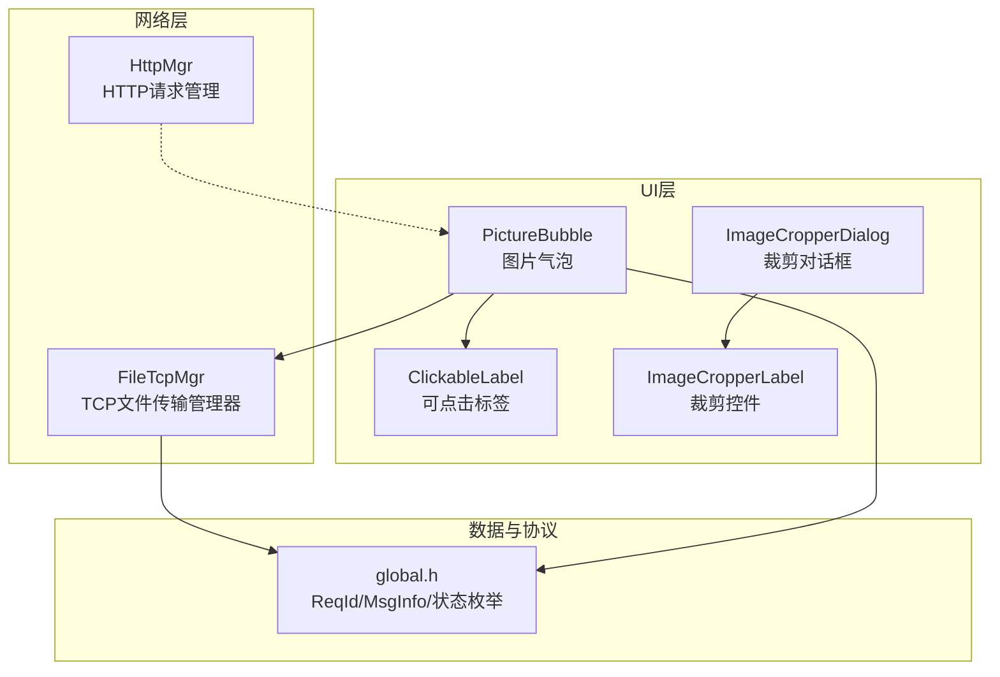
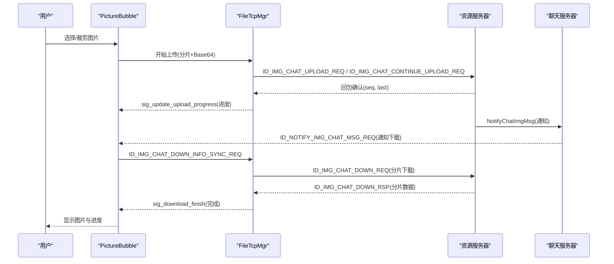
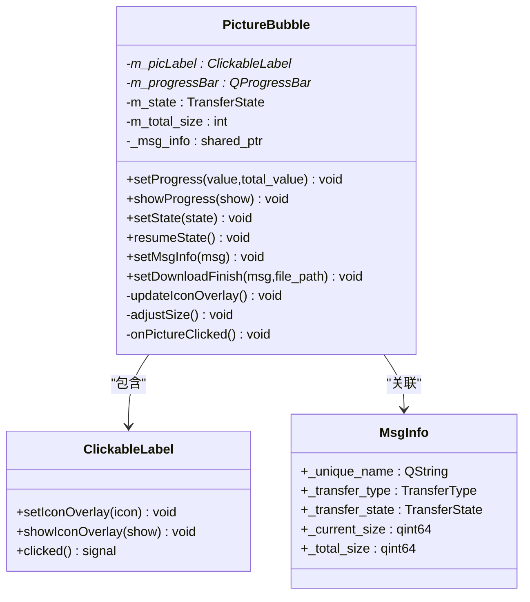
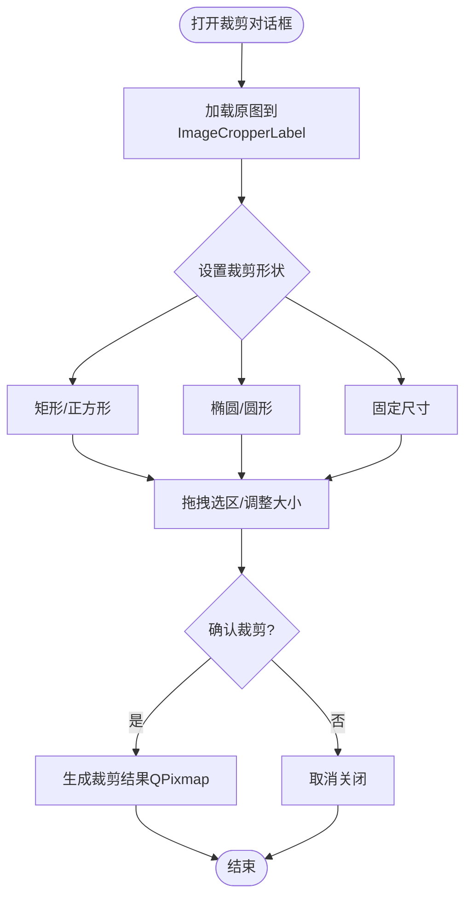
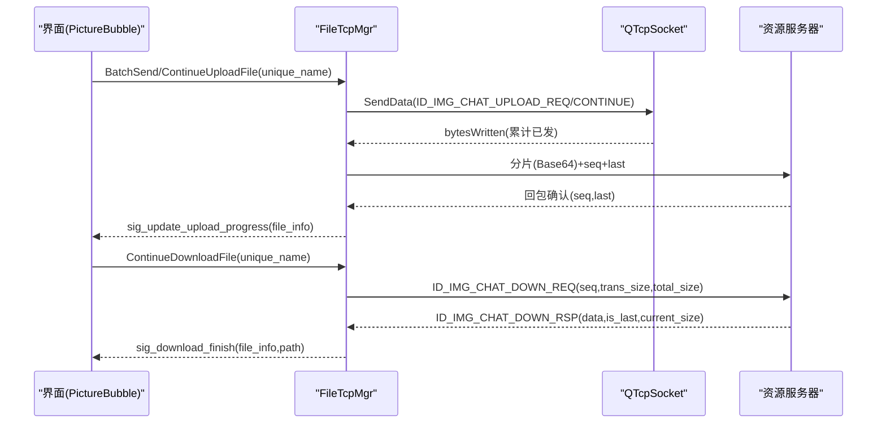
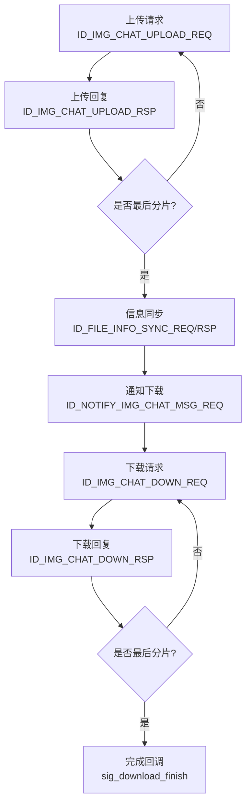
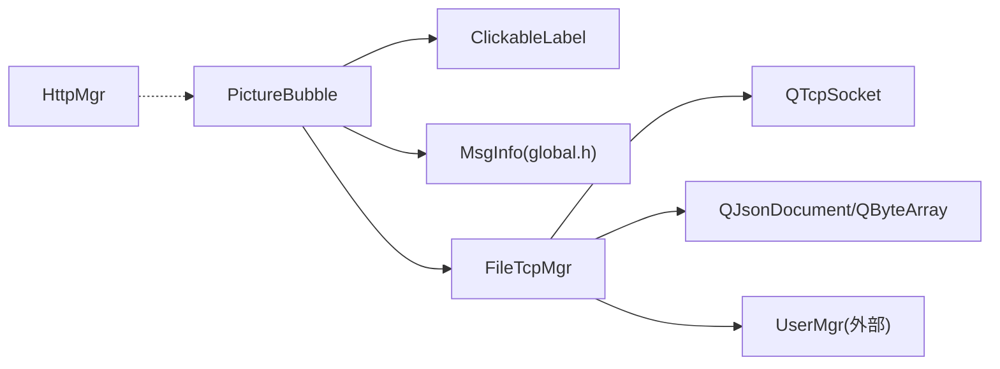

# 图片消息处理

<cite>
**本文引用的文件**   
- [PictureBubble.h](file://client/llfcchat/include/PictureBubble.h)
- [PictureBubble.cpp](file://client/llfcchat/src/PictureBubble.cpp)
- [imagecropperdialog.h](file://client/llfcchat/include/imagecropperdialog.h)
- [imagecropperlabel.h](file://client/llfcchat/include/imagecropperlabel.h)
- [imagecropperlabel.cpp](file://client/llfcchat/src/imagecropperlabel.cpp)
- [filetcpmgr.h](file://client/llfcchat/include/filetcpmgr.h)
- [filetcpmgr.cpp](file://client/llfcchat/src/filetcpmgr.cpp)
- [global.h](file://client/llfcchat/include/global.h)
- [httpmgr.h](file://client/llfcchat/include/httpmgr.h)
- [day38-断点续传.md](file://开发文档/day38-断点续传.md)
- [day40-聊天图片资源续传和进度显示.md](file://开发文档/day40-聊天图片资源续传和进度显示.md)
- [day41-通知客户端异步下载聊天图片.md](file://开发文档/day41-通知客户端异步下载聊天图片.md)
</cite>

## 目录
1. [简介](#简介)
2. [项目结构](#项目结构)
3. [核心组件](#核心组件)
4. [架构总览](#架构总览)
5. [详细组件分析](#详细组件分析)
6. [依赖关系分析](#依赖关系分析)
7. [性能与优化](#性能与优化)
8. [故障排查指南](#故障排查指南)
9. [结论](#结论)
10. [附录](#附录)

## 简介
本技术文档围绕 LLFCChat 的图片消息处理功能，系统性阐述图片上传、下载、压缩、分片传输、断点续传、进度显示、错误处理与缓存策略等关键技术。同时覆盖 PictureBubble 组件的渲染与交互、图片裁剪对话框的实现原理与用户交互设计，以及网络协议、并发控制与内存管理等工程要点，为开发与调优提供完整参考。

## 项目结构
- 客户端 UI 层：图片气泡展示、点击交互、进度条、遮罩图标等由 PictureBubble 与 ClickableLabel 实现。
- 图片裁剪：ImageCropperDialog 与 ImageCropperLabel 提供多种形状裁剪、透明度遮罩、拖拽缩放等能力。
- 网络传输层：FileTcpMgr 负责 TCP 长连接、粘包处理、分片发送/接收、拥塞窗口控制、断点续传与进度回调。
- 全局定义：ReqId、MsgInfo、TransferState、TransferType 等枚举与数据结构贯穿消息与传输状态管理。
- HTTP 模块：HttpMgr 用于通用 HTTP 请求（如头像下载），与图片消息流程解耦。

**图表来源** 
- [PictureBubble.h:1-53](file://client/llfcchat/include/PictureBubble.h#L1-L53)
- [PictureBubble.cpp:1-243](file://client/llfcchat/src/PictureBubble.cpp#L1-L243)
- [imagecropperdialog.h:1-100](file://client/llfcchat/include/imagecropperdialog.h#L1-L100)
- [imagecropperlabel.h:1-167](file://client/llfcchat/include/imagecropperlabel.h#L1-L167)
- [filetcpmgr.h:1-85](file://client/llfcchat/include/filetcpmgr.h#L1-L85)
- [global.h:1-296](file://client/llfcchat/include/global.h#L1-L296)
- [httpmgr.h:1-34](file://client/llfcchat/include/httpmgr.h#L1-L34)

**章节来源**
- [PictureBubble.h:1-53](file://client/llfcchat/include/PictureBubble.h#L1-L53)
- [PictureBubble.cpp:1-243](file://client/llfcchat/src/PictureBubble.cpp#L1-L243)
- [imagecropperdialog.h:1-100](file://client/llfcchat/include/imagecropperdialog.h#L1-L100)
- [imagecropperlabel.h:1-167](file://client/llfcchat/include/imagecropperlabel.h#L1-L167)
- [filetcpmgr.h:1-85](file://client/llfcchat/include/filetcpmgr.h#L1-L85)
- [global.h:1-296](file://client/llfcchat/include/global.h#L1-L296)
- [httpmgr.h:1-34](file://client/llfcchat/include/httpmgr.h#L1-L34)

## 核心组件
- PictureBubble：承载图片缩略图、进度条、状态遮罩图标；支持暂停/继续/重试；根据 MsgInfo 同步传输状态与进度。
- FileTcpMgr：封装 QTcpSocket 收发、粘包解析、Base64 编解码、分片上传/下载、拥塞窗口控制、断点续传、信号驱动界面更新。
- ImageCropperDialog/ImageCropperLabel：提供矩形/椭圆/圆形/固定尺寸等多种裁剪模式，支持透明度遮罩与拖拽缩放。
- global.h：统一 ReqId、MsgInfo、TransferState、TransferType 等关键类型，支撑消息与传输状态流转。
- HttpMgr：独立 HTTP 请求封装，用于头像等非聊天图片资源的下载。

**章节来源**
- [PictureBubble.h:1-53](file://client/llfcchat/include/PictureBubble.h#L1-L53)
- [PictureBubble.cpp:1-243](file://client/llfcchat/src/PictureBubble.cpp#L1-L243)
- [filetcpmgr.h:1-85](file://client/llfcchat/include/filetcpmgr.h#L1-L85)
- [filetcpmgr.cpp:1-1140](file://client/llfcchat/src/filetcpmgr.cpp#L1-L1140)
- [imagecropperdialog.h:1-100](file://client/llfcchat/include/imagecropperdialog.h#L1-L100)
- [imagecropperlabel.h:1-167](file://client/llfcchat/include/imagecropperlabel.h#L1-L167)
- [global.h:1-296](file://client/llfcchat/include/global.h#L1-L296)
- [httpmgr.h:1-34](file://client/llfcchat/include/httpmgr.h#L1-L34)

## 架构总览
图片消息端到端流程概览：
- 发送方：选择图片 → 可选裁剪 → 生成预览缩略图 → 分片上传（Base64）→ 服务器存储并通知接收方。
- 接收方：收到通知 → 本地检查是否存在 → 不存在则发起下载 → 分片下载（Base64）→ 落盘 → 渲染缩略图与进度。
- 传输控制：拥塞窗口、序列号确认、断点续传、进度回调、错误重试。

**图表来源** 
- [filetcpmgr.cpp:521-811](file://client/llfcchat/src/filetcpmgr.cpp#L521-L811)
- [filetcpmgr.cpp:813-896](file://client/llfcchat/src/filetcpmgr.cpp#L813-L896)
- [day41-通知客户端异步下载聊天图片.md:278-352](file://开发文档/day41-通知客户端异步下载聊天图片.md#L278-L352)

## 详细组件分析

### PictureBubble 组件分析
- 渲染与缩放：使用 QProgressBar 显示进度，QPixmap 按固定最大宽高等比缩放，SmoothTransformation 平滑渲染。
- 状态与遮罩：根据 TransferState 切换遮罩图标（暂停/播放/下载），并在不同状态下显隐进度条。
- 交互逻辑：点击触发暂停/继续/重试，通过信号 pauseRequested/resumeRequested/cancelRequested 通知上层。
- 下载完成：setDownloadFinish 将本地路径加载为 QPixmap，更新尺寸与遮罩状态。

**图表来源** 
- [PictureBubble.h:1-53](file://client/llfcchat/include/PictureBubble.h#L1-L53)
- [PictureBubble.cpp:1-243](file://client/llfcchat/src/PictureBubble.cpp#L1-L243)
- [global.h:167-200](file://client/llfcchat/include/global.h#L167-L200)

**章节来源**
- [PictureBubble.cpp:1-243](file://client/llfcchat/src/PictureBubble.cpp#L1-L243)
- [PictureBubble.h:1-53](file://client/llfcchat/include/PictureBubble.h#L1-L53)
- [global.h:167-200](file://client/llfcchat/include/global.h#L167-L200)

### 图片裁剪对话框与控件
- 裁剪形状：矩形、正方形、椭圆、圆形、固定矩形/椭圆等。
- 交互：鼠标拖拽移动选区、四角/边拖拽调整大小、最小尺寸限制、透明度遮罩效果。
- 输出：支持矩形或椭圆输出形状，返回裁剪后的 QPixmap。

**图表来源** 
- [imagecropperlabel.h:1-167](file://client/llfcchat/include/imagecropperlabel.h#L1-L167)
- [imagecropperlabel.cpp:1-715](file://client/llfcchat/src/imagecropperlabel.cpp#L1-L715)
- [imagecropperdialog.h:1-100](file://client/llfcchat/include/imagecropperdialog.h#L1-L100)

**章节来源**
- [imagecropperlabel.h:1-167](file://client/llfcchat/include/imagecropperlabel.h#L1-L167)
- [imagecropperlabel.cpp:1-715](file://client/llfcchat/src/imagecropperlabel.cpp#L1-L715)
- [imagecropperdialog.h:1-100](file://client/llfcchat/include/imagecropperdialog.h#L1-L100)

### 文件传输管理器（FileTcpMgr）
- 粘包处理：读取头部（ID+长度），循环解析缓冲区，确保完整消息体后再分发。
- 发送队列：bytesWritten 回调驱动队列出队，避免阻塞与非阻塞写冲突。
- 分片上传：按 MAX_FILE_LEN 分片，Base64 编码，携带 seq、last、md5、name、uid 等字段。
- 断点续传：维护 _flighting_seqs/_rsp_seqs/_last_confirmed_seq/_max_seq，支持续传请求 ID_IMG_CHAT_CONTINUE_UPLOAD_REQ。
- 下载流程：ID_IMG_CHAT_DOWN_REQ 分片下载，Base64 解码后按 seq 覆盖/追加写入，完成后触发 sig_download_finish。
- 进度回调：sig_update_upload_progress/sig_update_download_progress 驱动 UI 更新。

**图表来源** 
- [filetcpmgr.cpp:925-996](file://client/llfcchat/src/filetcpmgr.cpp#L925-L996)
- [filetcpmgr.cpp:1002-1076](file://client/llfcchat/src/filetcpmgr.cpp#L1002-L1076)
- [filetcpmgr.cpp:1078-1105](file://client/llfcchat/src/filetcpmgr.cpp#L1078-L1105)
- [filetcpmgr.cpp:695-811](file://client/llfcchat/src/filetcpmgr.cpp#L695-L811)

**章节来源**
- [filetcpmgr.cpp:1-1140](file://client/llfcchat/src/filetcpmgr.cpp#L1-1140)
- [filetcpmgr.h:1-85](file://client/llfcchat/include/filetcpmgr.h#L1-L85)
- [global.h:1-296](file://client/llfcchat/include/global.h#L1-L296)

### 网络协议与消息流
- 上传相关：ID_IMG_CHAT_UPLOAD_REQ/RSP、ID_IMG_CHAT_CONTINUE_UPLOAD_REQ/RSP、ID_FILE_INFO_SYNC_REQ/RSP。
- 下载相关：ID_IMG_CHAT_DOWN_INFO_SYNC_REQ/RSP、ID_IMG_CHAT_DOWN_REQ/RSP。
- 通知相关：ID_NOTIFY_IMG_CHAT_MSG_REQ（服务器通知客户端异步下载）。
- 字段说明：name、seq、trans_size、total_size、last、data(Base64)、uid、sender/receiver、message_id、token 等。

**图表来源** 
- [global.h:43-88](file://client/llfcchat/include/global.h#L43-L88)
- [filetcpmgr.cpp:521-811](file://client/llfcchat/src/filetcpmgr.cpp#L521-L811)
- [day41-通知客户端异步下载聊天图片.md:278-352](file://开发文档/day41-通知客户端异步下载聊天图片.md#L278-L352)

**章节来源**
- [global.h:43-88](file://client/llfcchat/include/global.h#L43-L88)
- [filetcpmgr.cpp:521-811](file://client/llfcchat/src/filetcpmgr.cpp#L521-L811)
- [day41-通知客户端异步下载聊天图片.md:278-352](file://开发文档/day41-通知客户端异步下载聊天图片.md#L278-L352)

## 依赖关系分析
- PictureBubble 依赖 ClickableLabel 与 QProgressBar，并通过 MsgInfo 与 FileTcpMgr 协作。
- FileTcpMgr 依赖 QTcpSocket、UserMgr（获取/更新传输信息）、QJsonDocument/QByteArray 进行编解码。
- global.h 中的枚举与结构被多处引用，构成统一的协议与状态模型。
- HttpMgr 独立于聊天图片流程，主要用于头像等资源下载。

**图表来源** 
- [PictureBubble.h:1-53](file://client/llfcchat/include/PictureBubble.h#L1-L53)
- [filetcpmgr.h:1-85](file://client/llfcchat/include/filetcpmgr.h#L1-L85)
- [global.h:1-296](file://client/llfcchat/include/global.h#L1-L296)
- [httpmgr.h:1-34](file://client/llfcchat/include/httpmgr.h#L1-L34)

**章节来源**
- [PictureBubble.h:1-53](file://client/llfcchat/include/PictureBubble.h#L1-L53)
- [filetcpmgr.h:1-85](file://client/llfcchat/include/filetcpmgr.h#L1-L85)
- [global.h:1-296](file://client/llfcchat/include/global.h#L1-L296)
- [httpmgr.h:1-34](file://client/llfcchat/include/httpmgr.h#L1-L34)

## 性能与优化
- 图片压缩与缩放：在 PictureBubble 中按固定最大宽高等比缩放并使用 SmoothTransformation，减少内存占用与渲染开销。
- 分片大小：MAX_FILE_LEN 控制单片大小，平衡网络吞吐与内存占用。
- 拥塞窗口：_cwnd_size 控制并发未确认分片数量，避免拥塞与丢包重传风暴。
- 粘包与缓冲：合理拆分头部与体部，避免频繁创建 QDataStream，提升解析效率。
- 进度刷新：仅在必要时机更新 UI，避免高频重绘导致卡顿。
- 内存管理：及时释放临时 QByteArray/QPixmap，避免大对象常驻内存。
- 并发控制：FileTcpThread 将网络 IO 移至独立线程，主线程专注 UI 响应。

[本节为通用指导，不直接分析具体文件]

## 故障排查指南
- 连接失败/超时：检查 QTcpSocket 错误码（ConnectionRefusedError/HostNotFoundError/SocketTimeoutError），确认服务器地址与端口配置。
- 粘包解析异常：确认 FILE_UPLOAD_HEAD_LEN 与头字段顺序一致，检查缓冲区剩余长度判断逻辑。
- Base64 编解码失败：校验 data 字段是否为合法 Base64，注意 UTF-8 转换。
- 下载不完整：核对 seq 与 is_last 标志，确认 Redis/本地持久化状态一致性。
- 进度不更新：检查 sig_update_upload_progress/sig_update_download_progress 信号是否发出，UI 槽函数是否正确连接。
- 内存泄漏：关注临时 QByteArray/QPixmap 的生命周期，避免重复拷贝大对象。

**章节来源**
- [filetcpmgr.cpp:65-93](file://client/llfcchat/src/filetcpmgr.cpp#L65-L93)
- [filetcpmgr.cpp:16-55](file://client/llfcchat/src/filetcpmgr.cpp#L16-L55)
- [filetcpmgr.cpp:334-433](file://client/llfcchat/src/filetcpmgr.cpp#L334-L433)
- [filetcpmgr.cpp:695-811](file://client/llfcchat/src/filetcpmgr.cpp#L695-L811)

## 结论
LLFCChat 的图片消息处理以 PictureBubble 为核心 UI 组件，结合 FileTcpMgr 的分片传输、断点续传与拥塞控制，实现了稳定高效的图片上传/下载流程。配合 ImageCropperDialog/Label 的灵活裁剪能力，满足多样化用户需求。通过清晰的协议设计与信号驱动机制，系统具备良好的可扩展性与可维护性。建议在生产环境中进一步优化内存管理与进度刷新频率，以提升用户体验与系统稳定性。

[本节为总结性内容，不直接分析具体文件]

## 附录
- 最佳实践
  - 优先使用缩略图渲染，大图按需加载。
  - 分片大小与拥塞窗口需根据网络环境动态调整。
  - 进度更新采用节流策略，避免 UI 卡顿。
  - 错误处理应区分网络错误、协议错误与业务错误，给出明确提示。
- 性能调优建议
  - 批量合并小对象，减少分配次数。
  - 使用 QBuffer/QByteArray 复用，降低内存碎片。
  - 对频繁重绘区域启用双缓冲或延迟更新。

[本节为通用指导，不直接分析具体文件]