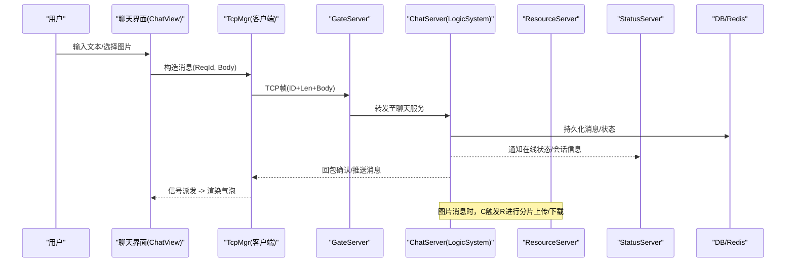
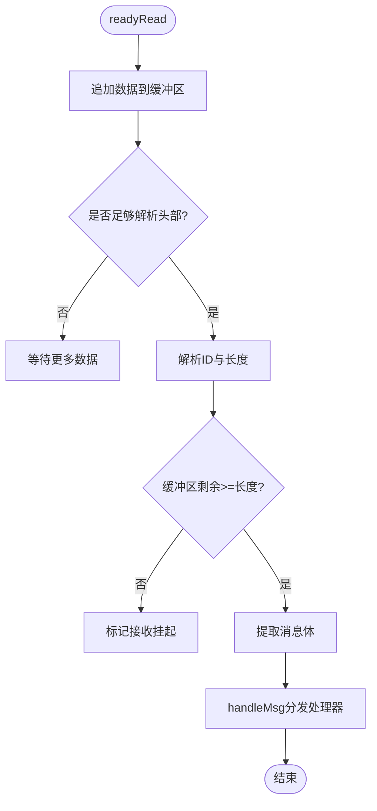
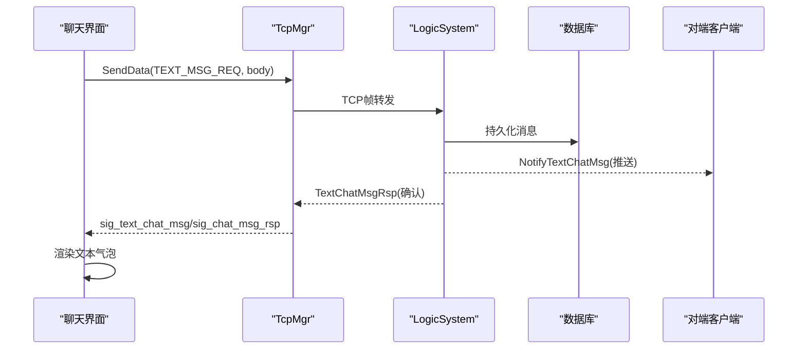
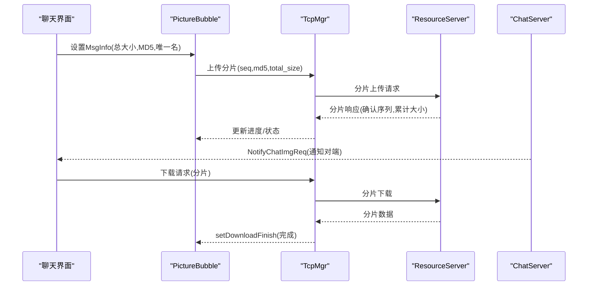
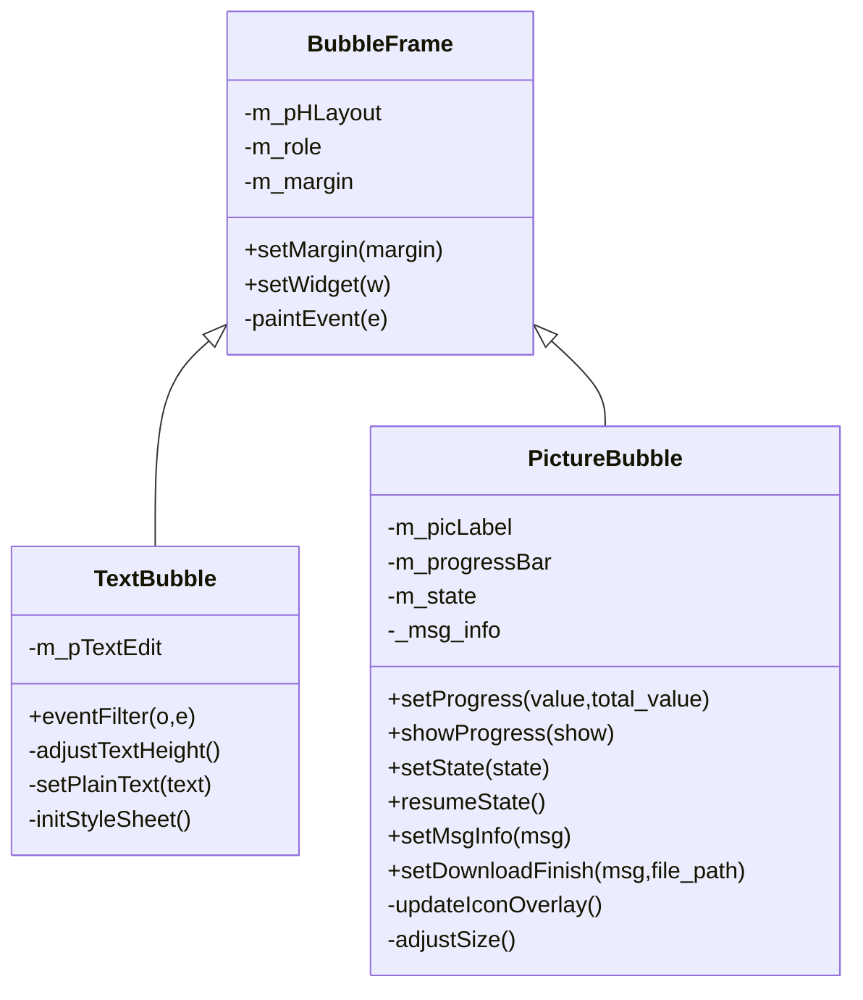
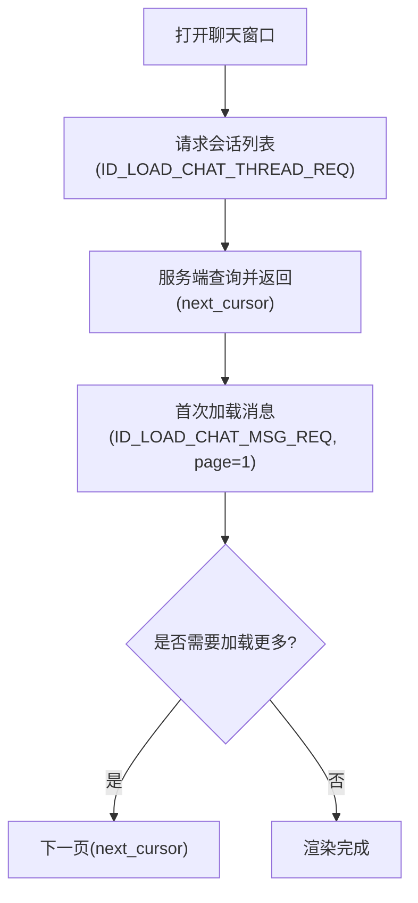
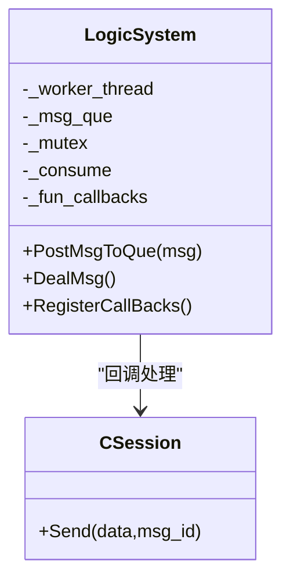
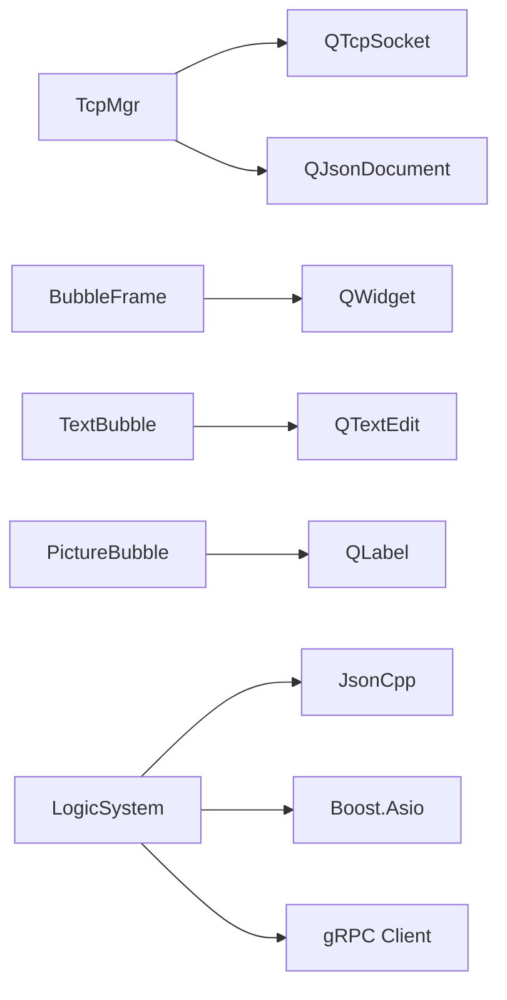

# 实时聊天功能

<cite>
**本文引用的文件**   
- [README.md](file://README.md)
- [global.h](file://client/llfcchat/include/global.h)
- [tcpmgr.h](file://client/llfcchat/include/tcpmgr.h)
- [tcpmgr.cpp](file://client/llfcchat/src/tcpmgr.cpp)
- [ChatView.h](file://client/llfcchat/include/ChatView.h)
- [BubbleFrame.h](file://client/llfcchat/include/BubbleFrame.h)
- [TextBubble.h](file://client/llfcchat/include/TextBubble.h)
- [PictureBubble.h](file://client/llfcchat/include/PictureBubble.h)
- [BubbleFrame.cpp](file://client/llfcchat/src/BubbleFrame.cpp)
- [TextBubble.cpp](file://client/llfcchat/src/TextBubble.cpp)
- [PictureBubble.cpp](file://client/llfcchat/src/PictureBubble.cpp)
- [message.proto](file://server/proto/chat/message.proto)
- [data.h](file://server/ChatServer/include/data.h)
- [MsgNode.h](file://server/ChatServer/include/MsgNode.h)
- [LogicSystem.h](file://server/ChatServer/include/LogicSystem.h)
- [LogicSystem.cpp](file://server/ChatServer/src/LogicSystem.cpp)
</cite>

## 目录
1. [简介](#简介)
2. [项目结构](#项目结构)
3. [核心组件](#核心组件)
4. [架构总览](#架构总览)
5. [详细组件分析](#详细组件分析)
6. [依赖关系分析](#依赖关系分析)
7. [性能考量](#性能考量)
8. [故障排查指南](#故障排查指南)
9. [结论](#结论)
10. [附录](#附录)

## 简介
本技术文档围绕 LLFCChat 的实时聊天能力，系统性梳理文本消息与图片消息的发送、接收、序列化、网络传输与 UI 渲染全流程；深入解析聊天气泡组件的设计模式、消息历史加载、已读状态同步等高级特性；并解释 TCP 长连接管理、消息队列处理、并发控制等核心技术实现。同时给出消息类型定义、协议格式、错误重试机制，以及扩展指南与性能优化建议，帮助开发者快速定位问题与高效迭代。

## 项目结构
LLFCChat 采用客户端（Qt/C++）与服务端（C++/Asio + gRPC）分离的分布式架构：
- 客户端负责 UI 展示、用户交互、TCP 长连接收发、图片上传下载、消息队列与事件分发。
- 服务端包含 ChatServer（聊天逻辑）、GateServer（网关）、ResourceServer（资源服务）、StatusServer（状态服务）、VarifyServer（验证码）等，通过 gRPC 与内部协议协作。
- 协议层使用 protobuf 定义跨进程接口，业务数据在 TCP 上以自定义二进制帧（ID+长度+体）传输。

```mermaid
graph TB
subgraph "客户端"
UI["聊天界面<br/>ChatView / BubbleFrame"]
TCP["TCP管理器<br/>TcpMgr"]
FileMgr["文件传输<br/>FileTcpMgr"]
end
subgraph "服务端"
Gate["GateServer"]
Chat["ChatServer"]
Res["ResourceServer"]
Status["StatusServer"]
Verify["VarifyServer"]
end
UI --> TCP
TCP --> |TCP帧(ID+Len+Body)| Gate
Gate --> Chat
Chat --> Res
Chat --> Status
Chat --> Verify
```

图表来源
- [tcpmgr.h:1-90](file://client/llfcchat/include/tcpmgr.h#L1-L90)
- [message.proto:1-167](file://server/proto/chat/message.proto#L1-L167)

章节来源
- [README.md:1-112](file://README.md#L1-L112)

## 核心组件
- 消息类型与全局常量：统一的消息枚举、传输状态、消息元信息等，位于全局头文件中。
- TCP 管理器：封装连接、粘包处理、发送队列、回调注册与信号派发。
- 气泡组件族：文本气泡、图片气泡、气泡容器，负责 UI 渲染与交互。
- 聊天视图：滚动区域与插入策略，支撑大量消息的高效显示。
- 服务端逻辑系统：消息入队、线程消费、处理器分发、数据库/缓存交互。

章节来源
- [global.h:1-296](file://client/llfcchat/include/global.h#L1-L296)
- [tcpmgr.h:1-90](file://client/llfcchat/include/tcpmgr.h#L1-L90)
- [ChatView.h:1-33](file://client/llfcchat/include/ChatView.h#L1-L33)
- [BubbleFrame.h:1-24](file://client/llfcchat/include/BubbleFrame.h#L1-L24)
- [TextBubble.h:1-24](file://client/llfcchat/include/TextBubble.h#L1-L24)
- [PictureBubble.h:1-53](file://client/llfcchat/include/PictureBubble.h#L1-L53)
- [LogicSystem.h:1-61](file://server/ChatServer/include/LogicSystem.h#L1-L61)

## 架构总览
下图展示了从“用户在输入框发送文本/图片”到“对端收到并渲染”的端到端流程，涵盖客户端序列化、TCP 传输、服务端路由、存储与推送、客户端反序列与 UI 更新。



图表来源
- [tcpmgr.cpp:1-200](file://client/llfcchat/src/tcpmgr.cpp#L1-L200)
- [LogicSystem.cpp:1-200](file://server/ChatServer/src/LogicSystem.cpp#L1-L200)
- [message.proto:1-167](file://server/proto/chat/message.proto#L1-L167)

## 详细组件分析

### 消息类型与协议格式
- 客户端消息类型与传输状态：
  - 消息类型：文本、图片、视频、文件。
  - 传输状态：无、下载中、上传中、暂停、完成、失败。
  - 消息元信息：唯一文件名、总大小、当前大小、序列号、MD5、最后确认序列、最大序列、关联消息ID、会话ID、发送者/接收者等。
- 服务端数据结构：
  - 聊天线程信息与聊天消息结构，支持分页查询与游标翻页。
  - 消息类型枚举与状态字段用于前端渲染与状态同步。
- 协议定义（gRPC）：
  - 登录、好友申请、认证、文本消息通知、图片消息通知、踢人等 RPC 接口。
  - 文本消息携带 unique_id、msg_id、content、chat_time 等字段。
  - 图片消息通知携带 from_uid、to_uid、message_id、file_name、total_size、thread_id 等。

章节来源
- [global.h:1-296](file://client/llfcchat/include/global.h#L1-L296)
- [data.h:1-65](file://server/ChatServer/include/data.h#L1-L65)
- [message.proto:1-167](file://server/proto/chat/message.proto#L1-L167)

### TCP 长连接管理与粘包处理
- 连接生命周期：
  - 建立连接后发出成功信号；错误分支包括拒绝、远端关闭、主机未找到、超时、网络错误等。
  - 断开连接时发出关闭信号，供上层重连或提示。
- 粘包与半包处理：
  - 读取 readyRead 数据追加到缓冲区，循环解析头部（消息ID+长度），再按长度取体，避免粘包/半包问题。
  - 解析完成后调用 handleMsg 分发到对应处理器。
- 发送队列与异步写：
  - 使用 QQueue 维护待发送字节块，bytesWritten 回调驱动分段写入，直到队列清空。
  - 当前块发送进度由 _bytes_sent 跟踪，确保可靠顺序发送。



图表来源
- [tcpmgr.cpp:1-200](file://client/llfcchat/src/tcpmgr.cpp#L1-L200)

章节来源
- [tcpmgr.h:1-90](file://client/llfcchat/include/tcpmgr.h#L1-L90)
- [tcpmgr.cpp:1-200](file://client/llfcchat/src/tcpmgr.cpp#L1-L200)

### 文本消息发送与接收流程
- 客户端侧：
  - 用户输入文本后，构造 ReqId=文本消息请求，序列化 JSON 或二进制体，通过 TcpMgr::SendData 发送。
  - 收到服务器回包或通知后，通过信号 sig_text_chat_msg/sig_chat_msg_rsp 派发至 UI。
- 服务端侧：
  - LogicSystem 将请求入队，后台线程消费并调用 DealChatTextMsg。
  - 持久化消息，必要时通过 gRPC 通知对端，返回确认给发起方。



图表来源
- [tcpmgr.cpp:1-200](file://client/llfcchat/src/tcpmgr.cpp#L1-L200)
- [LogicSystem.cpp:1-200](file://server/ChatServer/src/LogicSystem.cpp#L1-L200)
- [message.proto:1-167](file://server/proto/chat/message.proto#L1-L167)

章节来源
- [tcpmgr.cpp:1-200](file://client/llfcchat/src/tcpmgr.cpp#L1-L200)
- [LogicSystem.cpp:1-200](file://server/ChatServer/src/LogicSystem.cpp#L1-L200)

### 图片消息上传、下载与进度渲染
- 上传流程：
  - 客户端构造图片消息，生成唯一文件名与 MD5，分片上传（seq 序号），服务器返回实际接收大小与确认序列集合。
  - 客户端根据 _rsp_seqs 与 _flighting_seqs 做超时重传与去重。
- 下载流程：
  - 服务器通知图片消息（NotifyChatImgReq/Rsp），客户端发起下载请求，分片获取并落盘。
  - PictureBubble 显示缩略图与进度条，支持暂停/继续/重试。
- UI 渲染：
  - PictureBubble 根据 TransferState 切换图标覆盖与进度可见性，完成时延迟隐藏进度条。



图表来源
- [PictureBubble.cpp:1-243](file://client/llfcchat/src/PictureBubble.cpp#L1-L243)
- [global.h:1-296](file://client/llfcchat/include/global.h#L1-L296)
- [message.proto:1-167](file://server/proto/chat/message.proto#L1-L167)

章节来源
- [PictureBubble.cpp:1-243](file://client/llfcchat/src/PictureBubble.cpp#L1-L243)
- [global.h:1-296](file://client/llfcchat/include/global.h#L1-L296)

### 聊天气泡组件设计模式
- 继承体系：
  - BubbleFrame：气泡容器，绘制左右三角与圆角背景，区分 Self/Other 角色。
  - TextBubble：文本气泡，自适应宽度与高度，隐藏滚动条，透明背景。
  - PictureBubble：图片气泡，缩略图、进度条、状态图标叠加，支持暂停/继续/重试。
- 布局与样式：
  - 使用 QHBoxLayout/QVBoxLayout 组合子控件，QSS 定制外观。
  - 文本气泡通过 QFontMetricsF 计算段落宽度与高度，动态调整固定尺寸。
- 交互：
  - 图片点击触发暂停/继续/重试，发射信号交由上层处理。



图表来源
- [BubbleFrame.h:1-24](file://client/llfcchat/include/BubbleFrame.h#L1-L24)
- [BubbleFrame.cpp:1-73](file://client/llfcchat/src/BubbleFrame.cpp#L1-L73)
- [TextBubble.h:1-24](file://client/llfcchat/include/TextBubble.h#L1-L24)
- [TextBubble.cpp:1-79](file://client/llfcchat/src/TextBubble.cpp#L1-L79)
- [PictureBubble.h:1-53](file://client/llfcchat/include/PictureBubble.h#L1-L53)
- [PictureBubble.cpp:1-243](file://client/llfcchat/src/PictureBubble.cpp#L1-L243)

章节来源
- [BubbleFrame.cpp:1-73](file://client/llfcchat/src/BubbleFrame.cpp#L1-L73)
- [TextBubble.cpp:1-79](file://client/llfcchat/src/TextBubble.cpp#L1-L79)
- [PictureBubble.cpp:1-243](file://client/llfcchat/src/PictureBubble.cpp#L1-L243)

### 聊天视图与消息历史加载
- ChatView：提供尾插、头插、中间插入与全部移除，配合滚动区域与事件过滤器实现平滑滚动与性能优化。
- 历史加载：
  - 客户端通过 ID_LOAD_CHAT_THREAD_REQ/ID_LOAD_CHAT_MSG_REQ 拉取会话列表与消息分页。
  - 服务端 LogicSystem.GetUserThreadsHandler/LoadChatMsg 查询数据库并返回 next_cursor 用于翻页。



图表来源
- [tcpmgr.h:1-90](file://client/llfcchat/include/tcpmgr.h#L1-L90)
- [LogicSystem.cpp:1-200](file://server/ChatServer/src/LogicSystem.cpp#L1-L200)

章节来源
- [ChatView.h:1-33](file://client/llfcchat/include/ChatView.h#L1-L33)
- [LogicSystem.cpp:1-200](file://server/ChatServer/src/LogicSystem.cpp#L1-L200)

### 已读状态同步
- 客户端消息状态枚举包含 UN_READ、READED、SEND_FAILED、UN_UPLOAD。
- 服务端在消息持久化后更新 status，并在通知时对端时携带最新状态。
- UI 根据状态显示发送失败、未上传完成、对方已读等标识。

章节来源
- [global.h:1-296](file://client/llfcchat/include/global.h#L1-L296)
- [data.h:1-65](file://server/ChatServer/include/data.h#L1-L65)

### 服务端并发与消息队列
- LogicSystem 使用单例 + 工作线程模型：
  - 请求通过 PostMsgToQue 入队，条件变量唤醒消费者线程。
  - 消费者线程循环取出消息，查找回调函数并执行，保证顺序处理与高吞吐。
- 心跳与踢人：
  - HeartBeatHandler 维持连接活性；KickUserReq/Rsp 实现多服程踢人逻辑。



图表来源
- [LogicSystem.h:1-61](file://server/ChatServer/include/LogicSystem.h#L1-L61)
- [LogicSystem.cpp:1-200](file://server/ChatServer/src/LogicSystem.cpp#L1-L200)

章节来源
- [LogicSystem.h:1-61](file://server/ChatServer/include/LogicSystem.h#L1-L61)
- [LogicSystem.cpp:1-200](file://server/ChatServer/src/LogicSystem.cpp#L1-L200)

## 依赖关系分析
- 客户端依赖：
  - TcpMgr 依赖 QTcpSocket、QQueue、QByteArray、QJsonDocument 等 Qt 库。
  - 气泡组件依赖 QWidget、QLabel、QProgressBar、QPixmap 等。
- 服务端依赖：
  - LogicSystem 依赖 JsonCpp、Boost.Asio、MySQL/Redis 客户端、gRPC 客户端。
  - MsgNode 封装 Asio 读写缓冲节点。



图表来源
- [tcpmgr.h:1-90](file://client/llfcchat/include/tcpmgr.h#L1-L90)
- [BubbleFrame.h:1-24](file://client/llfcchat/include/BubbleFrame.h#L1-L24)
- [TextBubble.h:1-24](file://client/llfcchat/include/TextBubble.h#L1-L24)
- [PictureBubble.h:1-53](file://client/llfcchat/include/PictureBubble.h#L1-L53)
- [LogicSystem.h:1-61](file://server/ChatServer/include/LogicSystem.h#L1-L61)
- [MsgNode.h:1-48](file://server/ChatServer/include/MsgNode.h#L1-L48)

章节来源
- [tcpmgr.h:1-90](file://client/llfcchat/include/tcpmgr.h#L1-L90)
- [LogicSystem.h:1-61](file://server/ChatServer/include/LogicSystem.h#L1-L61)
- [MsgNode.h:1-48](file://server/ChatServer/include/MsgNode.h#L1-L48)

## 性能考量
- 网络层：
  - 粘包处理避免重复分配与拷贝，合理设置缓冲区大小。
  - 发送队列与 bytesWritten 回调减少阻塞，提升吞吐。
- UI 层：
  - 文本气泡按需计算宽高，避免频繁重绘。
  - 图片气泡缩略图与平滑缩放降低内存占用。
- 服务端：
  - 工作线程解耦 IO 与逻辑，条件变量减少忙轮询。
  - 分页查询与游标翻页减少一次性加载压力。
- 图片传输：
  - 分片上传/下载结合 MD5 校验与断点续传，提高可靠性与用户体验。

[本节为通用指导，不直接分析具体文件]

## 故障排查指南
- 连接问题：
  - 检查错误分支（拒绝、远端关闭、主机未找到、超时、网络错误），确认网络连通性与防火墙配置。
- 粘包/半包：
  - 确认头部解析与长度判断逻辑，打印缓冲区长度与消息体长度，定位丢包或错位。
- 发送失败：
  - 观察 bytesWritten 回调与队列状态，确认 _pending 标志与 _current_block 内容。
- 图片上传/下载异常：
  - 核对 seq、MD5、total_size 一致性，检查服务器分片响应与客户端 _rsp_seqs/_flighting_seqs 集合。
- 服务端处理：
  - 查看 LogicSystem 回调注册与队列消费日志，确认消息 ID 映射与处理器存在。

章节来源
- [tcpmgr.cpp:1-200](file://client/llfcchat/src/tcpmgr.cpp#L1-L200)
- [LogicSystem.cpp:1-200](file://server/ChatServer/src/LogicSystem.cpp#L1-L200)

## 结论
LLFCChat 的实时聊天功能通过清晰的客户端/服务端分层、稳健的 TCP 帧协议与高效的 UI 组件设计，实现了文本与图片消息的可靠传输与流畅渲染。借助消息队列与工作线程，服务端具备高并发处理能力；结合分片传输与断点续传，图片体验更佳。建议在后续迭代中持续优化缓冲区策略、UI 渲染路径与服务端缓存命中，进一步提升整体性能与稳定性。

[本节为总结，不直接分析具体文件]

## 附录
- 开发扩展指南：
  - 新增消息类型：在 global.h 中扩展 ReqId 与 MsgType，在 tcpmgr.cpp 中注册处理器，在 LogicSystem.cpp 中实现回调。
  - 新增 UI 气泡：继承 BubbleFrame，实现 paintEvent 与交互逻辑，接入 ChatView 的插入方法。
  - 图片传输扩展：完善分片协议与进度回调，确保 MD5 校验与断点续传一致。
- 常见问题调试技巧：
  - 启用详细日志，打印消息 ID、长度、缓冲区状态与队列变化。
  - 使用抓包工具验证 TCP 帧结构与顺序。
  - 在服务端增加关键路径耗时统计，定位瓶颈。

[本节为通用指导，不直接分析具体文件]