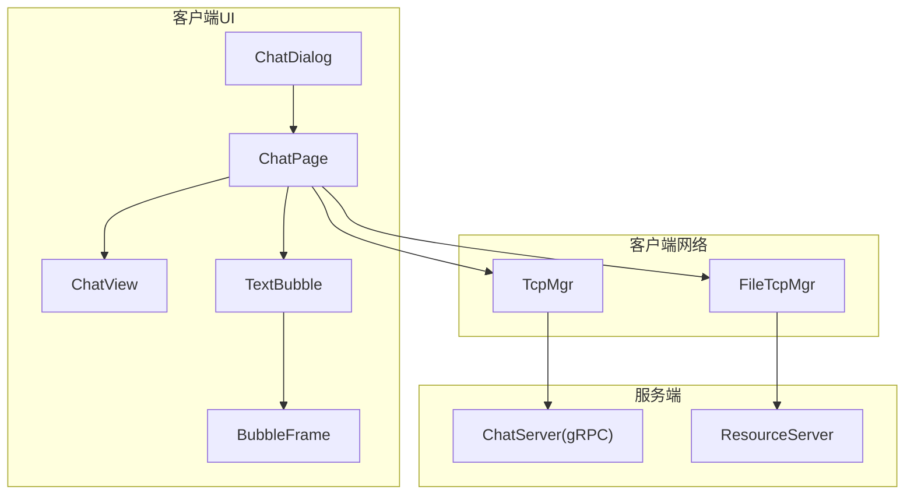
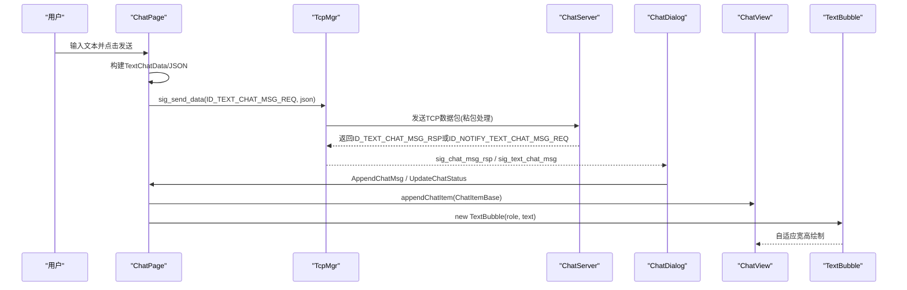
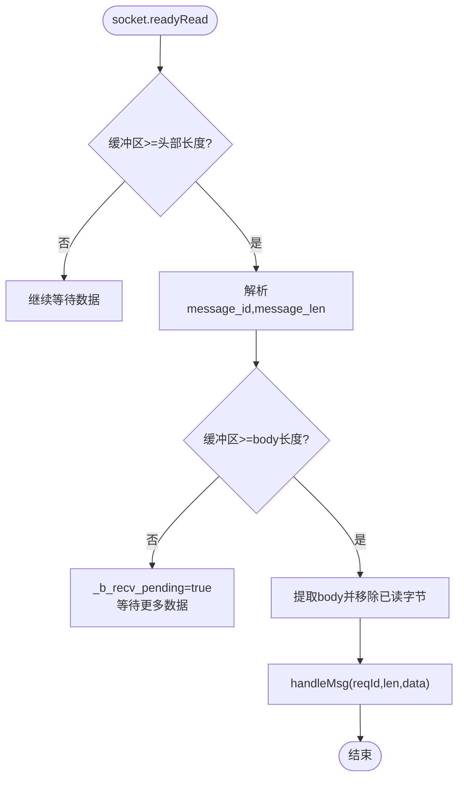
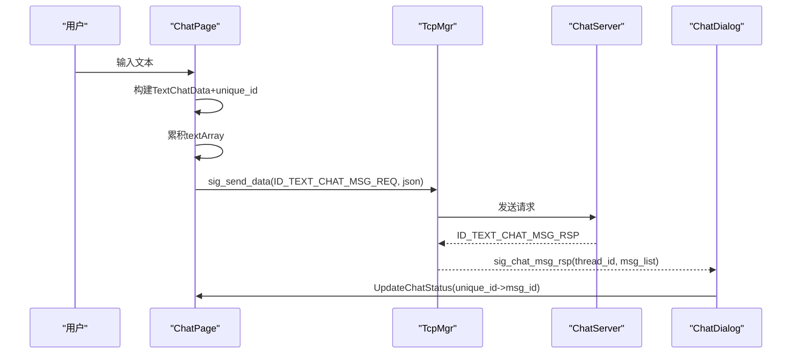
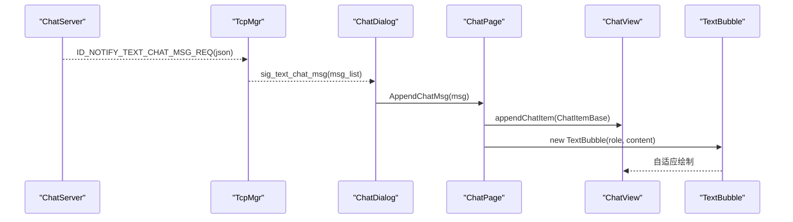
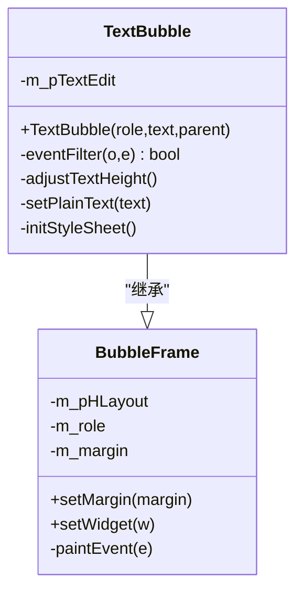
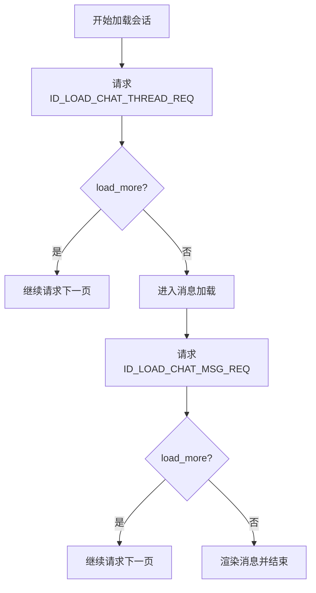
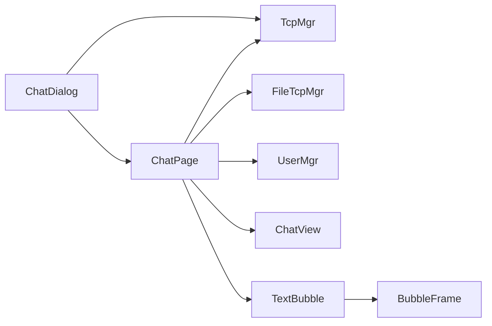

# 文本消息处理

<cite>
**本文引用的文件**   
- [TextBubble.h](file://client/llfcchat/include/TextBubble.h)
- [TextBubble.cpp](file://client/llfcchat/src/TextBubble.cpp)
- [BubbleFrame.h](file://client/llfcchat/include/BubbleFrame.h)
- [BubbleFrame.cpp](file://client/llfcchat/src/BubbleFrame.cpp)
- [ChatView.h](file://client/llfcchat/include/ChatView.h)
- [ChatView.cpp](file://client/llfcchat/src/ChatView.cpp)
- [tcpmgr.h](file://client/llfcchat/include/tcpmgr.h)
- [tcpmgr.cpp](file://client/llfcchat/src/tcpmgr.cpp)
- [global.h](file://client/llfcchat/include/global.h)
- [chatpage.h](file://client/llfcchat/include/chatpage.h)
- [chatpage.cpp](file://client/llfcchat/src/chatpage.cpp)
- [chatdialog.h](file://client/llfcchat/include/chatdialog.h)
- [chatdialog.cpp](file://client/llfcchat/src/chatdialog.cpp)
- [userdata.h](file://client/llfcchat/include/userdata.h)
- [message.proto](file://server/proto/chat/message.proto)
</cite>

## 目录
1. [简介](#简介)
2. [项目结构](#项目结构)
3. [核心组件](#核心组件)
4. [架构总览](#架构总览)
5. [详细组件分析](#详细组件分析)
6. [依赖关系分析](#依赖关系分析)
7. [性能考量](#性能考量)
8. [故障排查指南](#故障排查指南)
9. [结论](#结论)
10. [附录](#附录)

## 简介
本技术文档围绕 LLFCChat 的“文本消息处理”功能，系统性阐述从用户输入到 UI 渲染、网络传输、协议解析、历史加载、已读状态同步与搜索等完整链路。重点覆盖：
- 文本消息发送/接收流程（序列化、TCP 长连接、粘包处理、错误重试）
- TextBubble 气泡组件的设计模式、自适应高度与宽度、富文本支持现状
- TCP 消息协议格式与字段说明
- 聊天历史分页加载、已读状态同步机制
- 开发者扩展指南与性能优化建议

## 项目结构
客户端采用 Qt/C++ 实现，UI 层基于 QWidget/QScrollArea，网络层基于 QTcpSocket，消息协议以 JSON 为主，服务端通过 gRPC 定义部分接口。关键模块：
- UI 层：ChatDialog、ChatPage、ChatView、BubbleFrame、TextBubble
- 数据层：ChatDataBase/TextChatData/ImgChatData、ChatThreadData
- 网络层：TcpMgr（单例）、FileTcpMgr（图片/文件传输）
- 协议定义：proto/chat/message.proto（服务与消息定义）

图表来源
- [chatdialog.cpp:1-195](file://client/llfcchat/src/chatdialog.cpp#L1-L195)
- [chatpage.cpp:1-120](file://client/llfcchat/src/chatpage.cpp#L1-L120)
- [ChatView.cpp:1-60](file://client/llfcchat/src/ChatView.cpp#L1-L60)
- [BubbleFrame.cpp:1-40](file://client/llfcchat/src/BubbleFrame.cpp#L1-L40)
- [TextBubble.cpp:1-40](file://client/llfcchat/src/TextBubble.cpp#L1-L40)
- [tcpmgr.cpp:1-120](file://client/llfcchat/src/tcpmgr.cpp#L1-L120)

章节来源
- [chatdialog.cpp:1-195](file://client/llfcchat/src/chatdialog.cpp#L1-L195)
- [chatpage.cpp:1-120](file://client/llfcchat/src/chatpage.cpp#L1-L120)
- [ChatView.cpp:1-60](file://client/llfcchat/src/ChatView.cpp#L1-L60)
- [BubbleFrame.cpp:1-40](file://client/llfcchat/src/BubbleFrame.cpp#L1-L40)
- [TextBubble.cpp:1-40](file://client/llfcchat/src/TextBubble.cpp#L1-L40)
- [tcpmgr.cpp:1-120](file://client/llfcchat/src/tcpmgr.cpp#L1-L120)

## 核心组件
- TcpMgr：负责 TCP 长连接、粘包/拆包、消息分发、信号转发至 UI
- ChatPage：消息发送入口、本地消息构建、UI 渲染与状态更新
- ChatDialog：会话列表与页面切换、历史加载调度、全局事件过滤
- ChatView：滚动容器与尾插逻辑、滚动条行为控制
- BubbleFrame/TextBubble：气泡基类与文本气泡渲染、自适应尺寸
- 数据结构：ChatDataBase/TextChatData/ImgChatData、ChatThreadData、MsgInfo

章节来源
- [tcpmgr.h:1-90](file://client/llfcchat/include/tcpmgr.h#L1-L90)
- [tcpmgr.cpp:1-120](file://client/llfcchat/src/tcpmgr.cpp#L1-L120)
- [chatpage.h:1-53](file://client/llfcchat/include/chatpage.h#L1-L53)
- [chatpage.cpp:1-120](file://client/llfcchat/src/chatpage.cpp#L1-L120)
- [chatdialog.h:1-98](file://client/llfcchat/include/chatdialog.h#L1-L98)
- [chatdialog.cpp:1-195](file://client/llfcchat/src/chatdialog.cpp#L1-L195)
- [ChatView.h:1-33](file://client/llfcchat/include/ChatView.h#L1-L33)
- [ChatView.cpp:1-60](file://client/llfcchat/src/ChatView.cpp#L1-L60)
- [BubbleFrame.h:1-24](file://client/llfcchat/include/BubbleFrame.h#L1-L24)
- [BubbleFrame.cpp:1-40](file://client/llfcchat/src/BubbleFrame.cpp#L1-L40)
- [TextBubble.h:1-24](file://client/llfcchat/include/TextBubble.h#L1-L24)
- [TextBubble.cpp:1-40](file://client/llfcchat/src/TextBubble.cpp#L1-L40)
- [userdata.h:1-120](file://client/llfcchat/include/userdata.h#L1-L120)

## 架构总览
文本消息端到端流程概览：
- 发送：用户在 ChatPage 输入 -> 构建 TextChatData -> 组装 JSON -> 经 TcpMgr 发送 -> 服务器处理并回推
- 接收：TcpMgr 收到字节流 -> 解析头部与长度 -> 反序列化为 JSON -> 构造 TextChatData -> 信号通知 ChatDialog/ChatPage -> 渲染为 TextBubble

图表来源
- [chatpage.cpp:416-560](file://client/llfcchat/src/chatpage.cpp#L416-L560)
- [tcpmgr.cpp:451-548](file://client/llfcchat/src/tcpmgr.cpp#L451-L548)
- [chatdialog.cpp:281-311](file://client/llfcchat/src/chatdialog.cpp#L281-L311)
- [ChatView.cpp:46-52](file://client/llfcchat/src/ChatView.cpp#L46-L52)
- [TextBubble.cpp:12-26](file://client/llfcchat/src/TextBubble.cpp#L12-L26)

## 详细组件分析

### TCP 长连接与消息协议
- 连接与事件：
  - connected/readyRead/error/disconnected 信号统一接入 TcpMgr
  - readyRead 中循环读取所有可用字节，追加到缓冲区 _buffer
- 粘包/拆包：
  - 头部：两个 quint16，分别为 message_id 与 message_len
  - 当 _buffer 不足头部长度时等待；解析头部后检查 body 是否完整，否则挂起等待
  - 完整后取出 body 并调用 handleMsg 分派
- 发送队列：
  - bytesWritten 回调驱动队列出队，维护 _current_block、_bytes_sent、_pending 状态
- 错误处理：
  - 区分 ConnectionRefused/RemoteHostClosed/HostNotFound/Timeout/NetworkError 等，并发出连接失败信号
- 消息分发：
  - initHandlers 注册 ReqId 对应的 lambda，内部将 QByteArray 转为 QJsonDocument 解析
  - 文本消息相关 ID：ID_TEXT_CHAT_MSG_REQ/RSP、ID_NOTIFY_TEXT_CHAT_MSG_REQ

图表来源
- [tcpmgr.cpp:18-55](file://client/llfcchat/src/tcpmgr.cpp#L18-L55)
- [tcpmgr.cpp:103-129](file://client/llfcchat/src/tcpmgr.cpp#L103-L129)
- [tcpmgr.cpp:182-210](file://client/llfcchat/src/tcpmgr.cpp#L182-L210)

章节来源
- [tcpmgr.cpp:1-120](file://client/llfcchat/src/tcpmgr.cpp#L1-L120)
- [tcpmgr.cpp:182-210](file://client/llfcchat/src/tcpmgr.cpp#L182-L210)
- [tcpmgr.cpp:451-548](file://client/llfcchat/src/tcpmgr.cpp#L451-L548)
- [global.h:43-88](file://client/llfcchat/include/global.h#L43-L88)

### 文本消息发送流程
- 输入与校验：
  - ChatPage::on_send_btn_clicked 获取输入内容，限制单条文本长度不超过阈值
  - 对每条 MsgInfo 判断类型，文本走 TEXT_MSG 分支
- 消息构建：
  - 生成唯一 unique_id（UUID），构造 TextChatData，加入未回复映射 _unrsp_item_map
  - 累计文本数组 textArray，达到阈值或遇到非文本时批量发送
- 网络发送：
  - 组装 JSON（fromuid/touid/thread_id/text_array），emit sig_send_data(ID_TEXT_CHAT_MSG_REQ)
  - 由 TcpMgr 负责序列化与发送
- 本地渲染：
  - 立即创建 TextBubble 并插入 ChatView，状态初始为未送达
- 状态更新：
  - 收到 ID_TEXT_CHAT_MSG_RSP 后，根据 unique_id 查找并更新状态为已送达/已读

图表来源
- [chatpage.cpp:416-560](file://client/llfcchat/src/chatpage.cpp#L416-L560)
- [tcpmgr.cpp:451-499](file://client/llfcchat/src/tcpmgr.cpp#L451-L499)
- [chatdialog.cpp:487-504](file://client/llfcchat/src/chatdialog.cpp#L487-L504)

章节来源
- [chatpage.cpp:416-560](file://client/llfcchat/src/chatpage.cpp#L416-L560)
- [tcpmgr.cpp:451-499](file://client/llfcchat/src/tcpmgr.cpp#L451-L499)
- [chatdialog.cpp:487-504](file://client/llfcchat/src/chatdialog.cpp#L487-L504)

### 文本消息接收与渲染
- 接收路径：
  - ID_NOTIFY_TEXT_CHAT_MSG_REQ：服务器主动推送新消息
  - TcpMgr 解析 JSON，构造 TextChatData 列表，发出 sig_text_chat_msg
- 界面更新：
  - ChatDialog::slot_text_chat_msg 更新线程数据，若当前会话则直接 AppendChatMsg
  - ChatPage::AppendChatMsg 根据发送者角色选择 Self/Other，创建 TextBubble 并插入 ChatView
- 头像与资源：
  - 对方头像优先本地缓存，不存在则触发下载流程（异步）

图表来源
- [tcpmgr.cpp:501-548](file://client/llfcchat/src/tcpmgr.cpp#L501-L548)
- [chatdialog.cpp:281-299](file://client/llfcchat/src/chatdialog.cpp#L281-L299)
- [chatpage.cpp:66-176](file://client/llfcchat/src/chatpage.cpp#L66-L176)
- [ChatView.cpp:46-52](file://client/llfcchat/src/ChatView.cpp#L46-L52)

章节来源
- [tcpmgr.cpp:501-548](file://client/llfcchat/src/tcpmgr.cpp#L501-L548)
- [chatdialog.cpp:281-299](file://client/llfcchat/src/chatdialog.cpp#L281-L299)
- [chatpage.cpp:66-176](file://client/llfcchat/src/chatpage.cpp#L66-L176)

### TextBubble 组件设计
- 继承 BubbleFrame，使用 QTextEdit 显示纯文本
- 自适应宽度：遍历段落计算最大宽度，设置 setMaximumWidth
- 自适应高度：在 PaintEvent 中累加每段布局高度，设置 setFixedHeight
- 样式：透明背景无边框，字体微软雅黑 12pt
- 富文本支持：当前使用 setPlainText，预留 setHtml 注释，可按需开启 HTML 渲染

图表来源
- [BubbleFrame.h:1-24](file://client/llfcchat/include/BubbleFrame.h#L1-L24)
- [BubbleFrame.cpp:1-40](file://client/llfcchat/src/BubbleFrame.cpp#L1-L40)
- [TextBubble.h:1-24](file://client/llfcchat/include/TextBubble.h#L1-L24)
- [TextBubble.cpp:1-79](file://client/llfcchat/src/TextBubble.cpp#L1-L79)

章节来源
- [TextBubble.cpp:12-79](file://client/llfcchat/src/TextBubble.cpp#L12-L79)
- [BubbleFrame.cpp:1-40](file://client/llfcchat/src/BubbleFrame.cpp#L1-L40)

### 聊天历史加载与分页
- 会话列表加载：
  - ChatDialog::loadChatList 发送 ID_LOAD_CHAT_THREAD_REQ，携带 uid 与 last_thread_id
  - 服务器返回 threads 与 load_more、next_last_id，逐批构建 ChatUserWid 条目
- 消息历史加载：
  - ChatDialog::loadChatMsg 发送 ID_LOAD_CHAT_MSG_REQ，携带 thread_id 与 message_id
  - 服务器返回 chat_datas（文本/图片），客户端按类型构建 TextChatData/ImgChatData
  - 图片缺失时创建占位图，后续异步下载替换
- 分页推进：
  - 若 load_more=true，继续请求直到全部加载完成

图表来源
- [chatdialog.cpp:203-243](file://client/llfcchat/src/chatdialog.cpp#L203-L243)
- [chatdialog.cpp:358-410](file://client/llfcchat/src/chatdialog.cpp#L358-L410)
- [chatdialog.cpp:437-485](file://client/llfcchat/src/chatdialog.cpp#L437-L485)
- [tcpmgr.cpp:615-798](file://client/llfcchat/src/tcpmgr.cpp#L615-L798)

章节来源
- [chatdialog.cpp:203-243](file://client/llfcchat/src/chatdialog.cpp#L203-L243)
- [chatdialog.cpp:358-410](file://client/llfcchat/src/chatdialog.cpp#L358-L410)
- [chatdialog.cpp:437-485](file://client/llfcchat/src/chatdialog.cpp#L437-L485)
- [tcpmgr.cpp:615-798](file://client/llfcchat/src/tcpmgr.cpp#L615-L798)

### 已读状态同步
- 发送阶段：
  - 本地先插入未回执消息（状态=0），记录 unique_id 到 _unrsp_item_map
- 回执阶段：
  - 收到 ID_TEXT_CHAT_MSG_RSP，根据 unique_id 定位对应 ChatItemBase，更新状态为已送达/已读
  - 将条目从 _unrsp_item_map 迁移到 _base_item_map，便于后续按 msg_id 管理

章节来源
- [chatpage.cpp:416-560](file://client/llfcchat/src/chatpage.cpp#L416-L560)
- [chatpage.cpp:305-316](file://client/llfcchat/src/chatpage.cpp#L305-L316)
- [tcpmgr.cpp:451-499](file://client/llfcchat/src/tcpmgr.cpp#L451-L499)

### 消息搜索与跳转
- 搜索框交互：
  - ChatDialog 初始化 search_edit，支持前缀图标与清除按钮
  - 输入变化触发 slot_text_changed，切换 SearchMode/ChatMode/ContactMode
- 结果跳转：
  - SearchList 提供 sig_jump_chat_item，ChatDialog 响应后定位并选中对应 ChatUserWid，切换到 ChatPage

章节来源
- [chatdialog.cpp:25-120](file://client/llfcchat/src/chatdialog.cpp#L25-L120)
- [chatdialog.cpp:758-793](file://client/llfcchat/src/chatdialog.cpp#L758-L793)

### 协议与数据结构
- proto/chat/message.proto 定义了聊天服务接口与消息体，包括登录、好友、聊天消息、图片通知等
- 客户端侧 JSON 字段与 proto 字段存在映射关系，例如 fromuid/touid/thread_id/text_array 等
- 客户端数据结构：
  - ChatDataBase/TextChatData/ImgChatData：消息基类与具体类型
  - ChatThreadData：会话级消息管理与未回执映射
  - MsgInfo：文件/图片传输元信息（大小、MD5、进度等）

章节来源
- [message.proto:1-167](file://server/proto/chat/message.proto#L1-L167)
- [userdata.h:144-234](file://client/llfcchat/include/userdata.h#L144-L234)
- [global.h:167-200](file://client/llfcchat/include/global.h#L167-L200)

## 依赖关系分析
- 组件耦合：
  - ChatPage 依赖 TcpMgr、FileTcpMgr、UserMgr 进行网络与资源管理
  - ChatDialog 作为协调器，连接 TcpMgr 信号与 UI 操作
  - ChatView 仅负责滚动与插入，低耦合
  - TextBubble 依赖 BubbleFrame 与 Qt 文本系统
- 外部依赖：
  - QTcpSocket、QJsonDocument、QUuid、QStandardPaths
  - 服务端 gRPC 接口（proto 定义）

图表来源
- [chatpage.cpp:1-120](file://client/llfcchat/src/chatpage.cpp#L1-L120)
- [chatdialog.cpp:1-120](file://client/llfcchat/src/chatdialog.cpp#L1-L120)
- [ChatView.cpp:1-60](file://client/llfcchat/src/ChatView.cpp#L1-L60)
- [TextBubble.cpp:1-40](file://client/llfcchat/src/TextBubble.cpp#L1-L40)
- [BubbleFrame.cpp:1-40](file://client/llfcchat/src/BubbleFrame.cpp#L1-L40)

章节来源
- [chatpage.cpp:1-120](file://client/llfcchat/src/chatpage.cpp#L1-L120)
- [chatdialog.cpp:1-120](file://client/llfcchat/src/chatdialog.cpp#L1-L120)
- [ChatView.cpp:1-60](file://client/llfcchat/src/ChatView.cpp#L1-L60)
- [TextBubble.cpp:1-40](file://client/llfcchat/src/TextBubble.cpp#L1-L40)
- [BubbleFrame.cpp:1-40](file://client/llfcchat/src/BubbleFrame.cpp#L1-L40)

## 性能考量
- 文本渲染：
  - TextBubble 在 PaintEvent 中计算高度，避免频繁重排；建议合并多次调整，减少重绘
- 滚动与插入：
  - ChatView 尾插策略配合 QTimer 延迟复位 isAppended，避免高频滚动抖动
- 网络发送：
  - 文本批量打包（达到阈值再发送），降低小包开销
  - 发送队列与 bytesWritten 驱动，避免阻塞主线程
- 图片/文件：
  - 缺失图片创建占位图，异步下载替换，提升首屏体验
- 建议：
  - 对大段文本可考虑分段渲染或虚拟列表
  - 对大量历史消息可采用分页懒加载与内存池复用

[本节为通用指导，不直接分析具体文件]

## 故障排查指南
- 连接问题：
  - 检查 error 信号分支，确认 ConnectionRefused/HostNotFound/Timeout 等错误码
  - 观察 sig_con_success 与 sig_connection_closed 信号
- 粘包/解析失败：
  - 确认头部长度与 body 长度匹配，检查 _buffer 处理逻辑
  - 打印 QJsonDocument::fromJson 结果，确认 JSON 结构正确
- 消息未渲染：
  - 检查 AppendChatMsg 分支是否命中 TEXT/PIC
  - 确认 ChatView.appendChatItem 被调用且滚动位置正确
- 状态不同步：
  - 核对 unique_id 与 msg_id 映射是否正确迁移
  - 检查 sig_chat_msg_rsp 是否触发 UpdateChatStatus

章节来源
- [tcpmgr.cpp:64-91](file://client/llfcchat/src/tcpmgr.cpp#L64-L91)
- [tcpmgr.cpp:18-55](file://client/llfcchat/src/tcpmgr.cpp#L18-L55)
- [chatpage.cpp:305-316](file://client/llfcchat/src/chatpage.cpp#L305-L316)
- [ChatView.cpp:46-52](file://client/llfcchat/src/ChatView.cpp#L46-L52)

## 结论
LLFCChat 的文本消息处理链路清晰、职责分离明确：UI 层专注渲染与交互，网络层负责可靠传输与协议解析，数据层统一管理会话与消息状态。通过合理的粘包处理、批量发送与异步资源加载，整体具备良好的可扩展性与性能表现。未来可在富文本渲染、消息去重与离线存储等方面进一步增强。

[本节为总结性内容，不直接分析具体文件]

## 附录
- 扩展指南：
  - 新增消息类型：在 ChatPage::AppendChatMsg 增加分支，并在 TcpMgr 的 handlers 中解析对应 JSON
  - 自定义气泡：继承 BubbleFrame，重写 paintEvent/setWidget，保持自适应逻辑
  - 协议扩展：在 proto 中定义新消息，客户端映射 JSON 字段，确保 ReqId 唯一
- 调试技巧：
  - 在 TcpMgr 的 readyRead 与 handleMsg 处打印报文头与 JSON
  - 在 ChatPage 的发送与状态更新处打印 unique_id/msg_id 映射
  - 使用 Qt Creator 断点跟踪信号槽链路

[本节为通用指导，不直接分析具体文件]