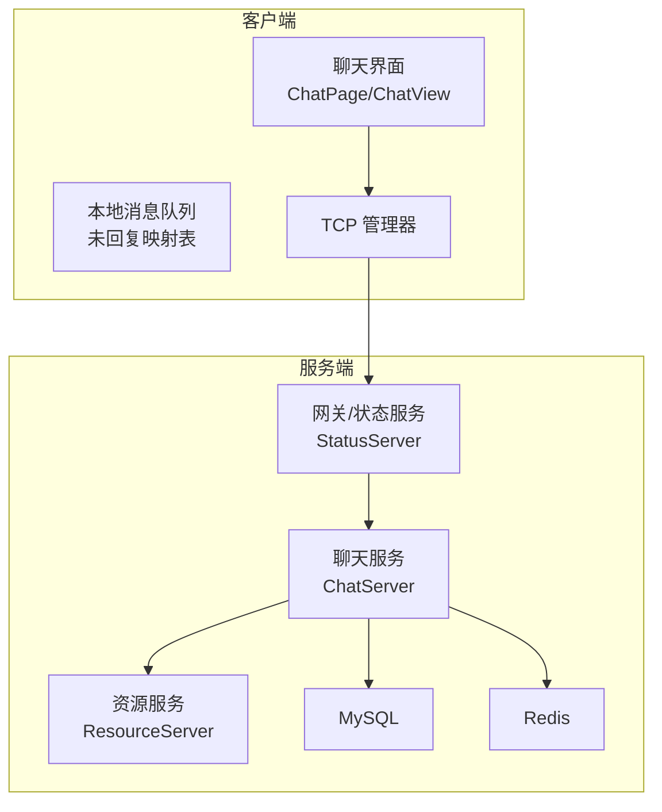
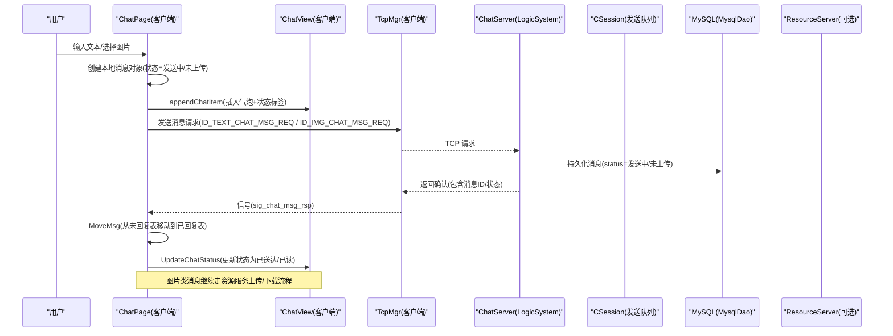
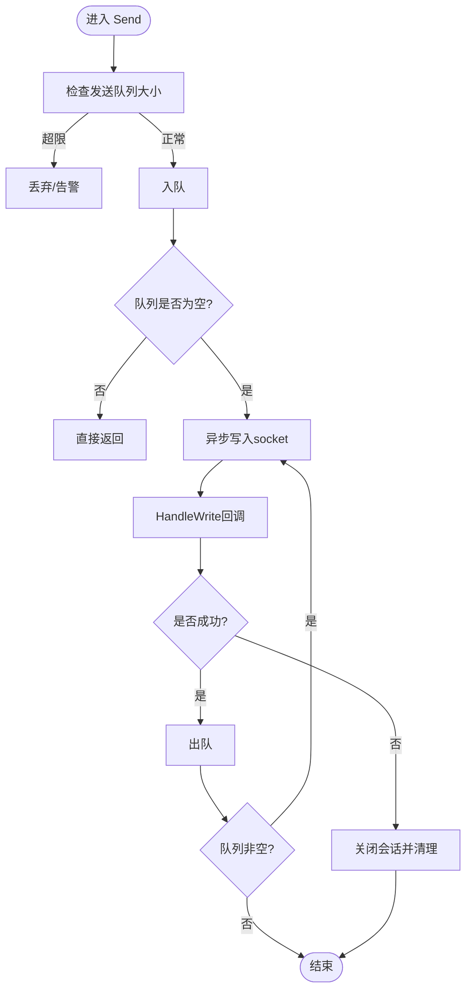
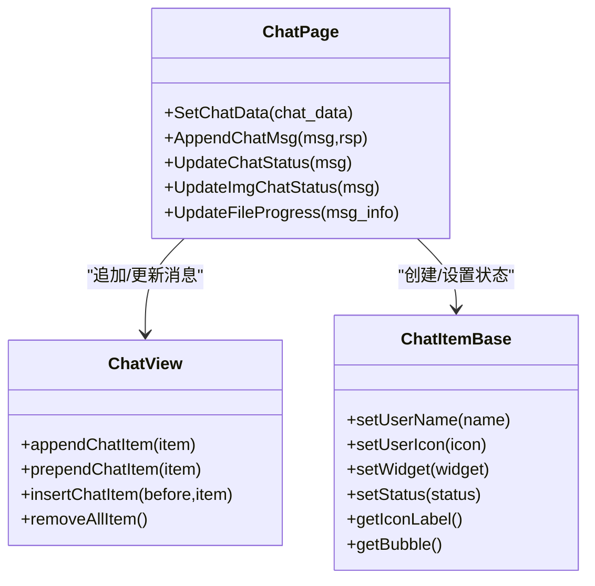
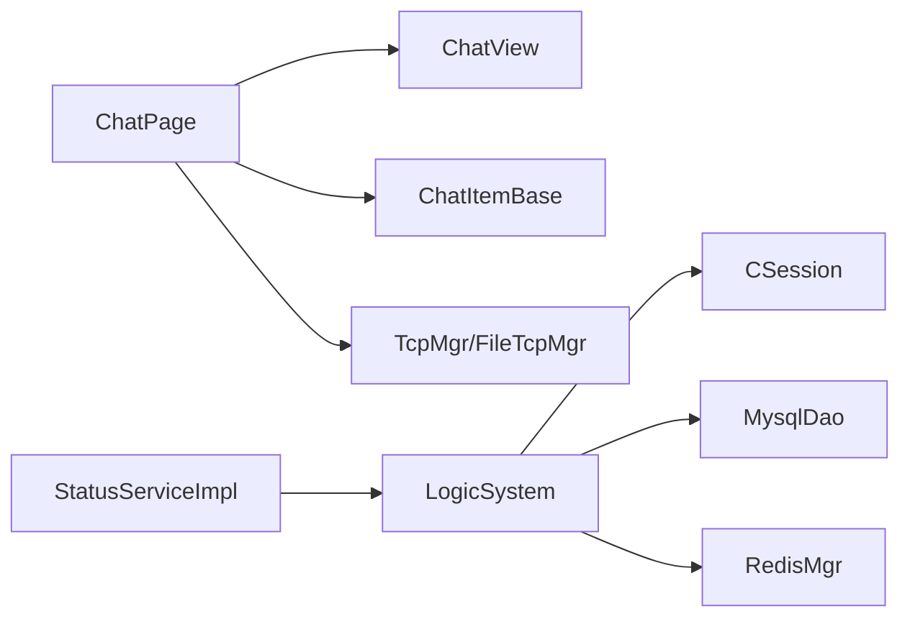

# 消息状态管理

<cite>
**本文引用的文件**
- [global.h](file://client/llfcchat/include/global.h)
- [ChatItemBase.h](file://client/llfcchat/include/ChatItemBase.h)
- [ChatView.h](file://client/llfcchat/include/ChatView.h)
- [ChatView.cpp](file://client/llfcchat/src/ChatView.cpp)
- [chatpage.cpp](file://client/llfcchat/src/chatpage.cpp)
- [data.h](file://server/ChatServer/include/data.h)
- [LogicSystem.cpp](file://server/ChatServer/src/LogicSystem.cpp)
- [CSession.cpp](file://server/ChatServer/src/CSession.cpp)
- [MysqlDao.cpp](file://server/ChatServer/src/MysqlDao.cpp)
- [StatusServiceImpl.h](file://server/StatusServer/include/StatusServiceImpl.h)
- [更新记录.md](file://更新记录.md)
- [day37-聊天信息存储方案.md](file://开发文档/day37-聊天信息存储方案.md)
- [day40-聊天图片资源续传和进度显示.md](file://开发文档/day40-聊天图片资源续传和进度显示.md)
- [day35心跳逻辑.md](file://开发文档/day35心跳逻辑.md)
</cite>

## 目录
1. [简介](#简介)
2. [项目结构](#项目结构)
3. [核心组件](#核心组件)
4. [架构总览](#架构总览)
5. [详细组件分析](#详细组件分析)
6. [依赖关系分析](#依赖关系分析)
7. [性能考虑](#性能考虑)
8. [故障排查指南](#故障排查指南)
9. [结论](#结论)
10. [附录](#附录)

## 简介
本技术文档围绕 LLFCChat 的消息状态管理系统，系统性阐述消息从“发送中”到“已送达/已读”的完整生命周期、状态转换与同步策略、冲突解决机制；并深入解析客户端聊天视图的状态更新、UI 响应式刷新与性能优化；同时覆盖消息持久化、缓存策略与数据一致性保证。文末提供扩展接口、自定义状态类型与监控调试工具的使用指南，以及常见问题定位与解决方案。

## 项目结构
LLFCChat 采用前后端分离的多服务架构：
- 客户端（Qt）负责 UI、本地消息队列、状态展示与网络交互
- ChatServer 处理聊天业务逻辑、消息路由与数据库持久化
- ResourceServer 负责文件/图片上传下载等重资源操作
- StatusServer 提供状态查询与登录路由能力
- VarifyServer 提供验证码等辅助服务

图表来源
- [ChatView.cpp:1-133](file://client/llfcchat/src/ChatView.cpp#L1-L133)
- [chatpage.cpp:1-200](file://client/llfcchat/src/chatpage.cpp#L1-L200)
- [LogicSystem.cpp:1-200](file://server/ChatServer/src/LogicSystem.cpp#L1-L200)
- [StatusServiceImpl.h:1-52](file://server/StatusServer/include/StatusServiceImpl.h#L1-L52)
- [MysqlDao.cpp:938-1104](file://server/ChatServer/src/MysqlDao.cpp#L938-L1104)

章节来源
- [ChatView.cpp:1-133](file://client/llfcchat/src/ChatView.cpp#L1-L133)
- [chatpage.cpp:1-200](file://client/llfcchat/src/chatpage.cpp#L1-L200)
- [LogicSystem.cpp:1-200](file://server/ChatServer/src/LogicSystem.cpp#L1-L200)
- [StatusServiceImpl.h:1-52](file://server/StatusServer/include/StatusServiceImpl.h#L1-L52)
- [MysqlDao.cpp:938-1104](file://server/ChatServer/src/MysqlDao.cpp#L938-L1104)

## 核心组件
- 消息状态枚举与类型定义
  - 客户端全局定义消息状态 MsgStatus 与消息类型 ChatMsgType，用于 UI 渲染与状态机驱动
- 聊天项与气泡
  - ChatItemBase 承载头像、用户名、气泡与状态标签，支持设置状态以驱动 UI 变化
- 聊天视图与滚动优化
  - ChatView 封装 QScrollArea，实现尾插、滚动条隐藏与自动滚到底部
- 聊天页面与状态同步
  - ChatPage 维护“已回复”和“未回复”两套消息集合，通过唯一 ID 映射完成状态更新与 UI 增量刷新
- 服务器会话与发送队列
  - CSession 使用异步写队列与互斥锁保障顺序发送与拥塞控制
- 业务逻辑与回调分发
  - LogicSystem 维护消息回调表，按消息 ID 分派处理函数，统一落库与转发
- 持久化与事务
  - MysqlDao 批量插入消息，关闭自动提交并使用 LAST_INSERT_ID 回填主键，确保一致性

章节来源
- [global.h:257-276](file://client/llfcchat/include/global.h#L257-L276)
- [ChatItemBase.h:1-30](file://client/llfcchat/include/ChatItemBase.h#L1-L30)
- [ChatView.cpp:1-133](file://client/llfcchat/src/ChatView.cpp#L1-L133)
- [chatpage.cpp:1-200](file://client/llfcchat/src/chatpage.cpp#L1-L200)
- [CSession.cpp:187-227](file://server/ChatServer/src/CSession.cpp#L187-L227)
- [LogicSystem.cpp:1-200](file://server/ChatServer/src/LogicSystem.cpp#L1-L200)
- [MysqlDao.cpp:938-1104](file://server/ChatServer/src/MysqlDao.cpp#L938-L1104)

## 架构总览
下图展示了消息从客户端发出到服务端落库、再回推状态至客户端的端到端流程。

图表来源
- [chatpage.cpp:1-200](file://client/llfcchat/src/chatpage.cpp#L1-L200)
- [ChatView.cpp:1-133](file://client/llfcchat/src/ChatView.cpp#L1-L133)
- [LogicSystem.cpp:1-200](file://server/ChatServer/src/LogicSystem.cpp#L1-L200)
- [CSession.cpp:187-227](file://server/ChatServer/src/CSession.cpp#L187-L227)
- [MysqlDao.cpp:938-1104](file://server/ChatServer/src/MysqlDao.cpp#L938-L1104)

## 详细组件分析

### 消息状态与生命周期
- 状态定义
  - 客户端 MsgStatus：UN_READ(对方未读)、SEND_FAILED(发送失败)、READED(对方已读)、UN_UPLOAD(未上传完成)
  - 服务器 ChatMessage.status：与客户端保持一致，用于持久化与跨端同步
- 生命周期阶段
  - 发送中：客户端立即插入本地“未回复”列表，状态为发送中或 UN_UPLOAD（图片/文件）
  - 已送达：服务端收到并落库后，返回确认，客户端将消息移至“已回复”列表，状态更新为已送达
  - 已读：接收方阅读后上报已读状态，服务端广播或点对点通知，发送方 UI 更新为 READED
  - 发送失败：网络异常或服务端拒绝时，状态置为 SEND_FAILED，可触发重试或提示
- 状态转换规则
  - 发送中 → 已送达：收到服务端确认
  - 发送中 → 发送失败：超时/错误码
  - 已送达 → 已读：对端已读回执
  - 任何状态 → 发送失败：连接断开/协议错误

章节来源
- [global.h:257-276](file://client/llfcchat/include/global.h#L257-L276)
- [data.h:41-51](file://server/ChatServer/include/data.h#L41-L51)
- [更新记录.md:198-224](file://更新记录.md#L198-L224)

### 消息队列与发送流程
- 客户端本地队列
  - ChatPage 维护 _unrsp_item_map（未回复）与 _base_item_map（已回复），以 uniqueId/msgId 为键
  - 发送时先插入未回复，收到确认后移动至已回复，并更新 UI
- 服务端发送队列
  - CSession::Send 将消息入队，限制最大长度防止拥塞；HandleWrite 完成后出队并继续异步写
  - 并发安全由互斥锁保护，异常路径关闭会话并清理

图表来源
- [CSession.cpp:187-227](file://server/ChatServer/src/CSession.cpp#L187-L227)

章节来源
- [chatpage.cpp:1-200](file://client/llfcchat/src/chatpage.cpp#L1-L200)
- [CSession.cpp:187-227](file://server/ChatServer/src/CSession.cpp#L187-L227)

### 状态同步与冲突解决
- 同步策略
  - 客户端以 uniqueId 作为幂等键，避免重复渲染与状态错乱
  - 服务端落库成功后返回确认，客户端据此移动消息并更新状态
- 冲突解决
  - 多端同时修改：以服务端最终状态为准，客户端仅做增量更新
  - 断线重连：拉取未确认消息，重新发送或恢复进度（图片/文件）
  - 分布式锁：在会话清理等关键路径使用 Redis 分布式锁，避免竞态

章节来源
- [chatpage.cpp:1-200](file://client/llfcchat/src/chatpage.cpp#L1-L200)
- [day35心跳逻辑.md:318-351](file://开发文档/day35心跳逻辑.md#L318-L351)

### 聊天视图状态更新与 UI 响应式
- ChatView
  - 尾插消息项，滚动条隐藏并在添加后自动滚到底部，减少抖动
- ChatPage
  - AppendChatMsg 根据角色与类型创建气泡，设置状态并加入对应映射
  - UpdateChatStatus/UpdateImgChatStatus 基于 uniqueId 查找并更新状态，必要时替换气泡内容（如图片元信息）
  - UpdateFileProgress 根据 MsgInfo 更新进度条

图表来源
- [ChatItemBase.h:1-30](file://client/llfcchat/include/ChatItemBase.h#L1-L30)
- [ChatView.cpp:1-133](file://client/llfcchat/src/ChatView.cpp#L1-L133)
- [chatpage.cpp:1-200](file://client/llfcchat/src/chatpage.cpp#L1-L200)

章节来源
- [ChatView.cpp:1-133](file://client/llfcchat/src/ChatView.cpp#L1-L133)
- [chatpage.cpp:1-200](file://client/llfcchat/src/chatpage.cpp#L1-L200)

### 持久化存储与数据一致性
- 持久化
  - MysqlDao::AddChatMsg 批量插入 chat_message，关闭自动提交，使用 LAST_INSERT_ID 回填 message_id
  - 字段包含 thread_id、sender_id、recv_id、content、时间戳、status、msg_type
- 一致性
  - 事务内执行，异常回滚；获取自增主键后再提交，保证后续关联查询一致
  - 客户端与服务端状态以服务端为准，客户端仅做增量更新

章节来源
- [MysqlDao.cpp:938-1104](file://server/ChatServer/src/MysqlDao.cpp#L938-L1104)
- [data.h:41-51](file://server/ChatServer/include/data.h#L41-L51)

### 图片/文件传输与进度同步
- 上传流程
  - 客户端发起 ID_IMG_CHAT_UPLOAD_REQ，携带 seq、md5、total_size 等
  - 服务端校验 token，使用 Redis 保存文件信息与进度，异步落盘
  - 客户端通过 FileTcpMgr 信号推送进度，ChatPage 更新 PictureBubble 进度
- 断点续传
  - 基于 seq 与 last_confirmed_seq 实现分片续传，Redis 持久化中间状态

章节来源
- [day40-聊天图片资源续传和进度显示.md:878-932](file://开发文档/day40-聊天图片资源续传和进度显示.md#L878-L932)
- [day38-断点续传.md:1682-1837](file://开发文档/day38-断点续传.md#L1682-L1837)

### 状态管理的扩展接口与自定义状态
- 扩展点
  - 客户端 MsgStatus 可扩展新状态（如“转存中”“审核中”）
  - 服务器 ChatMessage.status 需保持与客户端语义一致
  - LogicSystem 回调注册机制可按消息类型新增处理分支
- 建议
  - 新增状态需在 UI 层增加渲染分支（气泡角标/颜色）
  - 在服务端落库与状态同步链路中补齐该状态的流转逻辑

章节来源
- [global.h:257-276](file://client/llfcchat/include/global.h#L257-L276)
- [data.h:41-51](file://server/ChatServer/include/data.h#L41-L51)
- [LogicSystem.cpp:1-200](file://server/ChatServer/src/LogicSystem.cpp#L1-L200)

### 监控与调试工具
- 日志与告警
  - CSession 发送队列满、异步写失败、读取异常均输出日志
  - LogicSystem 打印消息 ID 与处理器缺失警告
- 指标采集
  - 心跳定时器统计在线会话数并写入 Redis，便于监控面板展示
- 调试建议
  - 针对粘包/半包问题，参考开发文档中的检查清单与优化建议

章节来源
- [CSession.cpp:187-227](file://server/ChatServer/src/CSession.cpp#L187-L227)
- [LogicSystem.cpp:1-200](file://server/ChatServer/src/LogicSystem.cpp#L1-L200)
- [day35心跳逻辑.md:644-688](file://开发文档/day35心跳逻辑.md#L644-L688)
- [day42-Qt粘包引发的血案.md:468-514](file://开发文档/day42-Qt粘包引发的血案.md#L468-L514)

## 依赖关系分析
- 客户端依赖
  - ChatPage 依赖 ChatView 进行 UI 渲染，依赖 TcpMgr/FileTcpMgr 进行网络通信
  - ChatItemBase 被 ChatPage 创建并设置状态，驱动 UI 变化
- 服务端依赖
  - LogicSystem 依赖 CSession 进行 I/O，依赖 MysqlDao 进行持久化，依赖 RedisMgr 进行缓存与分布式锁
  - StatusServiceImpl 提供状态查询与路由能力

图表来源
- [chatpage.cpp:1-200](file://client/llfcchat/src/chatpage.cpp#L1-L200)
- [ChatView.cpp:1-133](file://client/llfcchat/src/ChatView.cpp#L1-L133)
- [ChatItemBase.h:1-30](file://client/llfcchat/include/ChatItemBase.h#L1-L30)
- [LogicSystem.cpp:1-200](file://server/ChatServer/src/LogicSystem.cpp#L1-L200)
- [CSession.cpp:187-227](file://server/ChatServer/src/CSession.cpp#L187-L227)
- [MysqlDao.cpp:938-1104](file://server/ChatServer/src/MysqlDao.cpp#L938-L1104)
- [StatusServiceImpl.h:1-52](file://server/StatusServer/include/StatusServiceImpl.h#L1-L52)

章节来源
- [chatpage.cpp:1-200](file://client/llfcchat/src/chatpage.cpp#L1-L200)
- [ChatView.cpp:1-133](file://client/llfcchat/src/ChatView.cpp#L1-L133)
- [ChatItemBase.h:1-30](file://client/llfcchat/include/ChatItemBase.h#L1-L30)
- [LogicSystem.cpp:1-200](file://server/ChatServer/src/LogicSystem.cpp#L1-L200)
- [CSession.cpp:187-227](file://server/ChatServer/src/CSession.cpp#L187-L227)
- [MysqlDao.cpp:938-1104](file://server/ChatServer/src/MysqlDao.cpp#L938-L1104)
- [StatusServiceImpl.h:1-52](file://server/StatusServer/include/StatusServiceImpl.h#L1-L52)

## 性能考虑
- UI 性能
  - ChatView 使用 QScrollArea 与事件过滤器，避免频繁重绘；仅在添加项时自动滚动
  - 切换聊天页时清空旧 widget，注意内存释放
- 网络与队列
  - CSession 发送队列限流，避免拥塞；异步写减少阻塞
  - 图片/文件分片上传，结合 Redis 记录进度，降低重传成本
- 数据库
  - 批量插入与事务控制减少往返开销；LAST_INSERT_ID 回填提升效率
- 缓存
  - Redis 用于会话、令牌、文件信息等热点数据，降低 DB 压力

[本节为通用指导，不直接分析具体文件]

## 故障排查指南
- 常见问题
  - 发送队列满：检查 MAX_SENDQUE 配置与网络状况，关注 CSession 日志
  - 粘包/半包：参考 Qt 粘包处理清单，确保 while 循环解析与 buffer 管理正确
  - 状态不同步：核对 uniqueId 映射与 MoveMsg 逻辑，确认服务端确认是否到达
  - 图片上传中断：检查 Redis 文件信息与 seq 连续性，确认分片完整性
- 定位步骤
  - 查看 CSession 读写错误日志与 Heartbeat 定时器统计
  - 检查 ChatPage 的 _unrsp_item_map/_base_item_map 映射是否正确
  - 验证 MysqlDao 事务是否提交成功，LAST_INSERT_ID 是否回填

章节来源
- [CSession.cpp:187-227](file://server/ChatServer/src/CSession.cpp#L187-L227)
- [day42-Qt粘包引发的血案.md:468-514](file://开发文档/day42-Qt粘包引发的血案.md#L468-L514)
- [chatpage.cpp:1-200](file://client/llfcchat/src/chatpage.cpp#L1-L200)
- [MysqlDao.cpp:938-1104](file://server/ChatServer/src/MysqlDao.cpp#L938-L1104)

## 结论
LLFCChat 的消息状态管理以“客户端本地双表 + 服务端落库确认”为核心，配合发送队列限流、事务持久化与 Redis 缓存，实现了稳定可靠的状态同步与良好的用户体验。未来可通过 Model/View Delegate 进一步优化 UI 渲染与大数据量下的流畅度，并通过扩展状态枚举与回调机制增强系统灵活性。

[本节为总结性内容，不直接分析具体文件]

## 附录
- 状态扩展建议
  - 在 global.h 的 MsgStatus 中新增状态，并在 ChatPage 的渲染与更新逻辑中补齐分支
  - 在 data.h 的 ChatMessage.status 中保持与客户端一致，确保持久化与同步正确
- 监控与调试
  - 利用 CSession 与 LogicSystem 的日志输出定位问题
  - 借助心跳定时器统计与会话清理逻辑，评估系统健康度

章节来源
- [global.h:257-276](file://client/llfcchat/include/global.h#L257-L276)
- [data.h:41-51](file://server/ChatServer/include/data.h#L41-L51)
- [CSession.cpp:187-227](file://server/ChatServer/src/CSession.cpp#L187-L227)
- [LogicSystem.cpp:1-200](file://server/ChatServer/src/LogicSystem.cpp#L1-L200)