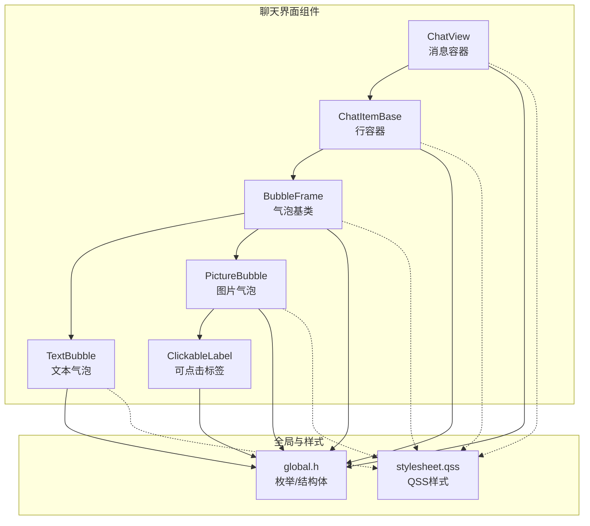
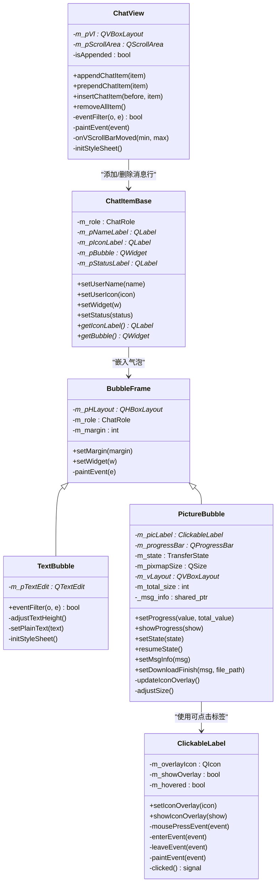
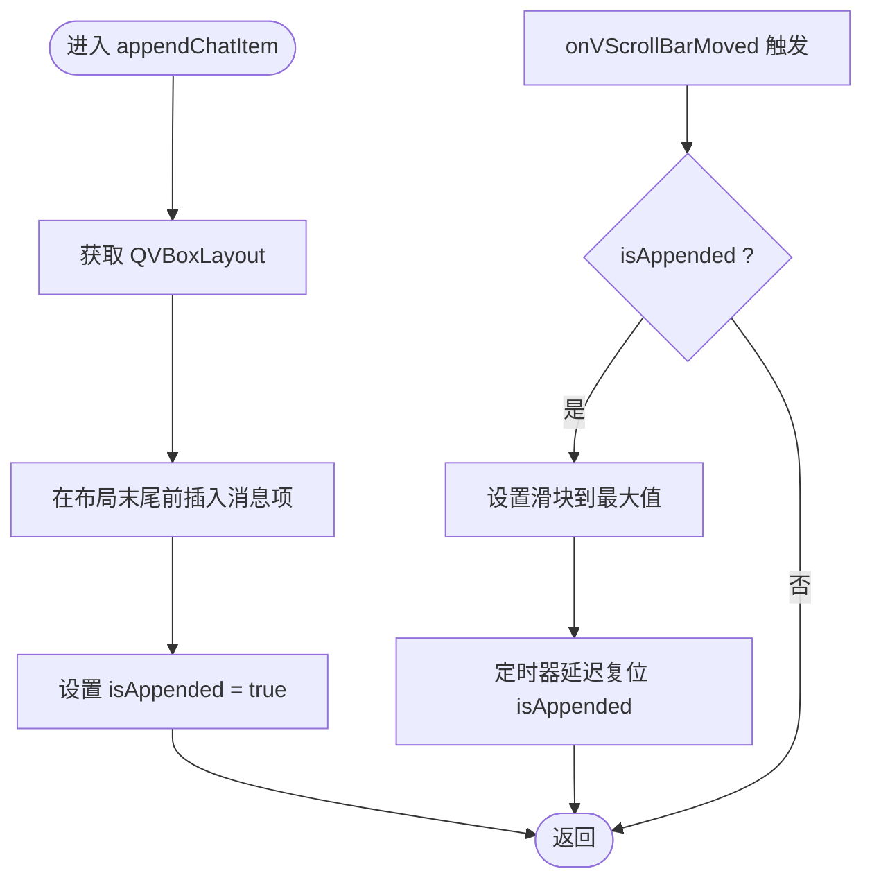
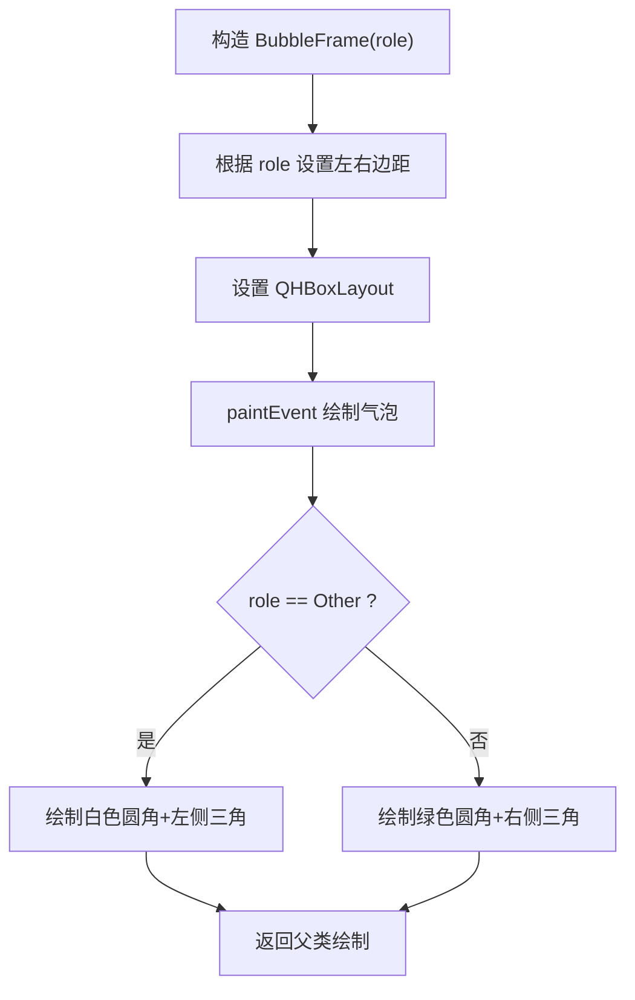
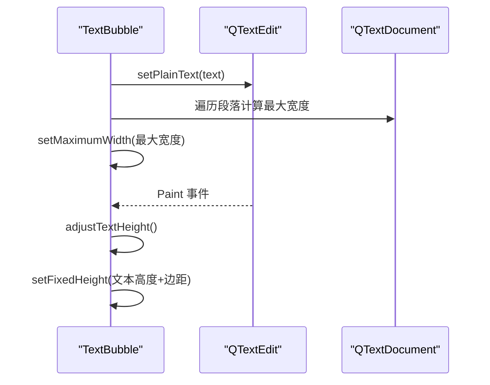
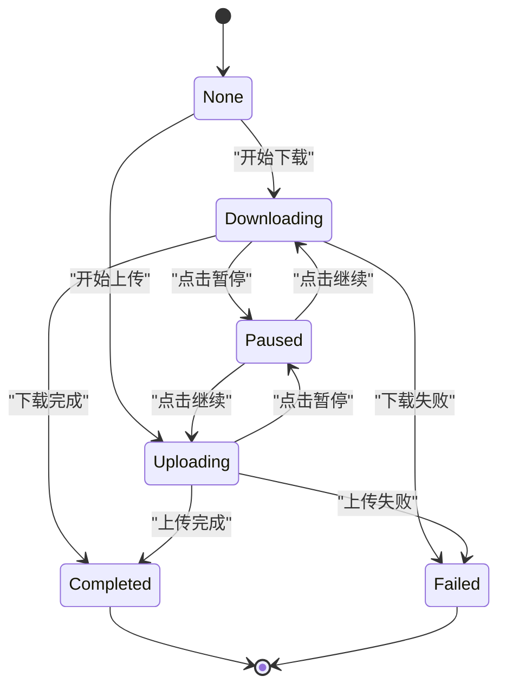
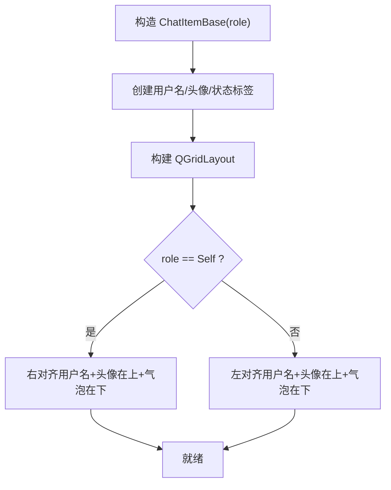
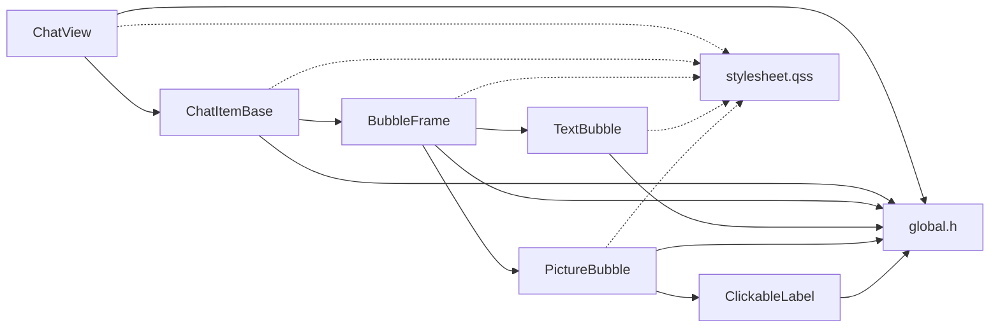

# 聊天界面组件

<cite>
**本文引用的文件**   
- [ChatView.h](file://client/llfcchat/include/ChatView.h)
- [ChatView.cpp](file://client/llfcchat/src/ChatView.cpp)
- [BubbleFrame.h](file://client/llfcchat/include/BubbleFrame.h)
- [BubbleFrame.cpp](file://client/llfcchat/src/BubbleFrame.cpp)
- [TextBubble.h](file://client/llfcchat/include/TextBubble.h)
- [TextBubble.cpp](file://client/llfcchat/src/TextBubble.cpp)
- [PictureBubble.h](file://client/llfcchat/include/PictureBubble.h)
- [PictureBubble.cpp](file://client/llfcchat/src/PictureBubble.cpp)
- [ChatItemBase.h](file://client/llfcchat/include/ChatItemBase.h)
- [ChatItemBase.cpp](file://client/llfcchat/src/ChatItemBase.cpp)
- [global.h](file://client/llfcchat/include/global.h)
- [ClickableLabel.h](file://client/llfcchat/include/ClickableLabel.h)
- [stylesheet.qss](file://client/llfcchat/resources/style/stylesheet.qss)
</cite>

## 目录
1. [简介](#简介)
2. [项目结构](#项目结构)
3. [核心组件](#核心组件)
4. [架构总览](#架构总览)
5. [详细组件分析](#详细组件分析)
6. [依赖关系分析](#依赖关系分析)
7. [性能考量](#性能考量)
8. [故障排查指南](#故障排查指南)
9. [结论](#结论)
10. [附录](#附录)

## 简介
本技术文档围绕 LLFCChat 客户端的聊天界面组件系统，系统性阐述 ChatView 消息容器、BubbleFrame 气泡基类、TextBubble 文本气泡、PictureBubble 图片气泡以及 ChatItemBase 行容器的设计模式与实现细节。重点覆盖：
- ChatView 的消息布局算法、滚动优化与事件处理
- BubbleFrame 的设计模式、气泡样式绘制与主题切换支持
- TextBubble 的动态高度计算与自适应宽度策略
- PictureBubble 的传输状态机、进度展示与交互控制
- ChatItemBase 的用户头像、名称与状态图标布局
- 可扩展的自定义气泡开发指南、事件机制、主题与国际化建议
- UI 性能调优、内存管理与跨平台兼容性要点

## 项目结构
聊天界面相关代码集中在 client/llfcchat 模块下，采用“头文件在 include，实现文件在 src，样式资源在 resources”的分层组织方式。核心文件如下：
- 头文件（include）：定义组件接口与数据结构
- 源文件（src）：实现组件逻辑、绘制与事件处理
- 样式表（resources/style/stylesheet.qss）：统一外观与主题风格

图表来源
- [ChatView.h:1-33](file://client/llfcchat/include/ChatView.h#L1-L33)
- [ChatView.cpp:1-133](file://client/llfcchat/src/ChatView.cpp#L1-L133)
- [BubbleFrame.h:1-24](file://client/llfcchat/include/BubbleFrame.h#L1-L24)
- [BubbleFrame.cpp:1-73](file://client/llfcchat/src/BubbleFrame.cpp#L1-L73)
- [TextBubble.h:1-24](file://client/llfcchat/include/TextBubble.h#L1-L24)
- [TextBubble.cpp:1-79](file://client/llfcchat/src/TextBubble.cpp#L1-L79)
- [PictureBubble.h:1-53](file://client/llfcchat/include/PictureBubble.h#L1-L53)
- [PictureBubble.cpp:1-243](file://client/llfcchat/src/PictureBubble.cpp#L1-L243)
- [ChatItemBase.h:1-30](file://client/llfcchat/include/ChatItemBase.h#L1-L30)
- [ChatItemBase.cpp:1-99](file://client/llfcchat/src/ChatItemBase.cpp#L1-L99)
- [global.h:1-296](file://client/llfcchat/include/global.h#L1-L296)
- [ClickableLabel.h:1-29](file://client/llfcchat/include/ClickableLabel.h#L1-L29)
- [stylesheet.qss:1-815](file://client/llfcchat/resources/style/stylesheet.qss#L1-L815)

章节来源
- [ChatView.h:1-33](file://client/llfcchat/include/ChatView.h#L1-L33)
- [ChatView.cpp:1-133](file://client/llfcchat/src/ChatView.cpp#L1-L133)
- [BubbleFrame.h:1-24](file://client/llfcchat/include/BubbleFrame.h#L1-L24)
- [BubbleFrame.cpp:1-73](file://client/llfcchat/src/BubbleFrame.cpp#L1-L73)
- [TextBubble.h:1-24](file://client/llfcchat/include/TextBubble.h#L1-L24)
- [TextBubble.cpp:1-79](file://client/llfcchat/src/TextBubble.cpp#L1-L79)
- [PictureBubble.h:1-53](file://client/llfcchat/include/PictureBubble.h#L1-L53)
- [PictureBubble.cpp:1-243](file://client/llfcchat/src/PictureBubble.cpp#L1-L243)
- [ChatItemBase.h:1-30](file://client/llfcchat/include/ChatItemBase.h#L1-L30)
- [ChatItemBase.cpp:1-99](file://client/llfcchat/src/ChatItemBase.cpp#L1-L99)
- [global.h:1-296](file://client/llfcchat/include/global.h#L1-L296)
- [ClickableLabel.h:1-29](file://client/llfcchat/include/ClickableLabel.h#L1-L29)
- [stylesheet.qss:1-815](file://client/llfcchat/resources/style/stylesheet.qss#L1-L815)

## 核心组件
- ChatView：消息列表容器，负责插入消息项、滚动区域管理、滚动条隐藏与自动滚到底部等。
- BubbleFrame：气泡基类，根据角色（自己/对方）设置左右边距并绘制圆角矩形与三角箭头。
- TextBubble：文本气泡，基于 QTextEdit 实现只读文本显示，动态计算最大宽度与固定高度。
- PictureBubble：图片气泡，封装图片预览、进度条、状态图标遮罩与暂停/继续/重试交互。
- ChatItemBase：消息行容器，包含用户头像、用户名、状态图标与气泡内容，按角色调整布局方向。
- ClickableLabel：可点击标签，支持鼠标事件与图标遮罩显示，用于图片气泡的交互。
- global.h：集中定义消息类型、传输类型/状态、消息信息结构体等关键数据模型。

章节来源
- [ChatView.h:1-33](file://client/llfcchat/include/ChatView.h#L1-L33)
- [ChatView.cpp:1-133](file://client/llfcchat/src/ChatView.cpp#L1-L133)
- [BubbleFrame.h:1-24](file://client/llfcchat/include/BubbleFrame.h#L1-L24)
- [BubbleFrame.cpp:1-73](file://client/llfcchat/src/BubbleFrame.cpp#L1-L73)
- [TextBubble.h:1-24](file://client/llfcchat/include/TextBubble.h#L1-L24)
- [TextBubble.cpp:1-79](file://client/llfcchat/src/TextBubble.cpp#L1-L79)
- [PictureBubble.h:1-53](file://client/llfcchat/include/PictureBubble.h#L1-L53)
- [PictureBubble.cpp:1-243](file://client/llfcchat/src/PictureBubble.cpp#L1-L243)
- [ChatItemBase.h:1-30](file://client/llfcchat/include/ChatItemBase.h#L1-L30)
- [ChatItemBase.cpp:1-99](file://client/llfcchat/src/ChatItemBase.cpp#L1-L99)
- [ClickableLabel.h:1-29](file://client/llfcchat/include/ClickableLabel.h#L1-L29)
- [global.h:1-296](file://client/llfcchat/include/global.h#L1-L296)

## 架构总览
聊天界面的渲染与交互由 ChatView 作为入口，内部维护一个 QScrollArea 承载消息行容器 ChatItemBase；每个 ChatItemBase 内嵌一个 BubbleFrame 子类（TextBubble 或 PictureBubble），通过 setWidget 注入具体气泡内容。样式通过 QSS 统一管理，便于主题切换。

图表来源
- [ChatView.h:1-33](file://client/llfcchat/include/ChatView.h#L1-L33)
- [ChatView.cpp:1-133](file://client/llfcchat/src/ChatView.cpp#L1-L133)
- [ChatItemBase.h:1-30](file://client/llfcchat/include/ChatItemBase.h#L1-L30)
- [ChatItemBase.cpp:1-99](file://client/llfcchat/src/ChatItemBase.cpp#L1-L99)
- [BubbleFrame.h:1-24](file://client/llfcchat/include/BubbleFrame.h#L1-L24)
- [BubbleFrame.cpp:1-73](file://client/llfcchat/src/BubbleFrame.cpp#L1-L73)
- [TextBubble.h:1-24](file://client/llfcchat/include/TextBubble.h#L1-L24)
- [TextBubble.cpp:1-79](file://client/llfcchat/src/TextBubble.cpp#L1-L79)
- [PictureBubble.h:1-53](file://client/llfcchat/include/PictureBubble.h#L1-L53)
- [PictureBubble.cpp:1-243](file://client/llfcchat/src/PictureBubble.cpp#L1-L243)
- [ClickableLabel.h:1-29](file://client/llfcchat/include/ClickableLabel.h#L1-L29)

## 详细组件分析

### ChatView：消息容器与滚动优化
- 功能要点
  - 使用 QScrollArea 作为滚动容器，内部放置一个 QWidget 承载 QVBoxLayout，并在末尾保留一个占位控件以维持布局稳定性。
  - 提供 append/prepend/insert/removeAll 等接口用于消息项的动态增删。
  - 通过 eventFilter 监听 ScrollArea 的 Enter/Leave 事件，控制垂直滚动条的显隐。
  - onVScrollBarMoved 回调中，当检测到 isAppended 标志时，将滚动条滑块移动到最大值，实现新消息追加后自动滚到底部；并使用 QTimer 延迟复位标志，避免频繁触发。
  - paintEvent 委托给默认样式绘制，保证背景与边框一致。
- 滚动优化
  - 隐藏原生滚动条，仅在必要时显示，减少视觉干扰。
  - 通过 rangeChanged 信号与滑块位置设置，确保追加消息时的滚动行为稳定。
- 扩展点
  - 可在 initStyleSheet 中定制滚动条样式与背景色。
  - 可结合虚拟滚动（如 QListView/QTableView）进一步优化大数据量场景下的性能。

图表来源
- [ChatView.cpp:46-120](file://client/llfcchat/src/ChatView.cpp#L46-L120)

章节来源
- [ChatView.h:1-33](file://client/llfcchat/include/ChatView.h#L1-L33)
- [ChatView.cpp:1-133](file://client/llfcchat/src/ChatView.cpp#L1-L133)

### BubbleFrame：气泡基类与绘制
- 设计模式
  - 基于 QFrame 派生，使用 QHBoxLayout 管理内部子控件，并通过 setWidget 注入实际气泡内容（文本或图片）。
  - 根据 ChatRole（Self/Other）设置不同的左右边距，使三角箭头位于正确一侧。
- 绘制逻辑
  - paintEvent 中根据角色选择背景颜色，绘制圆角矩形与三角箭头，形成典型聊天气泡外观。
- 主题支持
  - 可通过 QSS 替换背景色、边框与阴影，实现多主题切换。

图表来源
- [BubbleFrame.cpp:5-72](file://client/llfcchat/src/BubbleFrame.cpp#L5-L72)

章节来源
- [BubbleFrame.h:1-24](file://client/llfcchat/include/BubbleFrame.h#L1-L24)
- [BubbleFrame.cpp:1-73](file://client/llfcchat/src/BubbleFrame.cpp#L1-L73)

### TextBubble：文本气泡与自适应布局
- 文本显示
  - 使用只读的 QTextEdit，关闭水平/垂直滚动条，确保文本在气泡内完整显示。
  - 通过 setPlainText 遍历文档段落，计算最宽段落的像素宽度，设置气泡的最大宽度。
- 高度计算
  - 在 Paint 事件中过滤，调用 adjustTextHeight 累加每段的 boundingRect 高度，得到文本总高度，加上文档边距与布局上下边距，设置固定高度。
- 样式
  - 设置透明背景与无边框，使文本内容与气泡背景融合。

图表来源
- [TextBubble.cpp:12-79](file://client/llfcchat/src/TextBubble.cpp#L12-L79)

章节来源
- [TextBubble.h:1-24](file://client/llfcchat/include/TextBubble.h#L1-L24)
- [TextBubble.cpp:1-79](file://client/llfcchat/src/TextBubble.cpp#L1-L79)

### PictureBubble：图片气泡与传输状态机
- 结构与交互
  - 使用 ClickableLabel 显示缩略图，叠加状态图标（暂停/播放/下载）遮罩。
  - QProgressBar 显示上传/下载进度，根据状态显示/隐藏。
  - 点击图标触发暂停/继续/重试等操作，通过信号向外部传递请求。
- 状态机
  - TransferState：None、Downloading、Uploading、Paused、Completed、Failed。
  - setState 根据状态控制进度条可见性、图标遮罩更新与完成后的延迟隐藏。
  - resumeState 根据 _transfer_type 恢复 Downloading/Uploading 状态。
- 尺寸与布局
  - adjustSize 根据图片尺寸与进度条可见性计算固定宽高。
  - setDownloadFinish 完成后加载本地文件路径，更新缩略图与尺寸。

图表来源
- [PictureBubble.cpp:122-149](file://client/llfcchat/src/PictureBubble.cpp#L122-L149)
- [global.h:158-165](file://client/llfcchat/include/global.h#L158-L165)

章节来源
- [PictureBubble.h:1-53](file://client/llfcchat/include/PictureBubble.h#L1-L53)
- [PictureBubble.cpp:1-243](file://client/llfcchat/src/PictureBubble.cpp#L1-L243)
- [global.h:152-165](file://client/llfcchat/include/global.h#L152-L165)

### ChatItemBase：消息行容器布局
- 布局策略
  - 使用 QGridLayout 按角色（Self/Other）调整列顺序与对齐方式，实现左右分布。
  - 包含用户名标签、头像标签、状态图标与气泡容器。
- 状态图标
  - setStatus 根据 MsgStatus（未读、发送失败、已读、未上传完成）设置不同图标。
- 气泡替换
  - setWidget 替换内部气泡容器，便于动态注入 TextBubble 或 PictureBubble。

图表来源
- [ChatItemBase.cpp:5-54](file://client/llfcchat/src/ChatItemBase.cpp#L5-L54)

章节来源
- [ChatItemBase.h:1-30](file://client/llfcchat/include/ChatItemBase.h#L1-L30)
- [ChatItemBase.cpp:1-99](file://client/llfcchat/src/ChatItemBase.cpp#L1-L99)
- [global.h:257-262](file://client/llfcchat/include/global.h#L257-L262)

### ClickableLabel：可点击标签与遮罩图标
- 功能要点
  - 重写 mousePressEvent、enterEvent、leaveEvent、paintEvent，支持点击与悬停效果。
  - setIconOverlay 设置遮罩图标，showIconOverlay 控制显示/隐藏。
- 用途
  - 在 PictureBubble 中用于显示暂停/继续/重试等状态图标，提升交互体验。

章节来源
- [ClickableLabel.h:1-29](file://client/llfcchat/include/ClickableLabel.h#L1-L29)
- [PictureBubble.cpp:219-242](file://client/llfcchat/src/PictureBubble.cpp#L219-L242)

## 依赖关系分析
- 组件耦合
  - ChatView 依赖 ChatItemBase 进行消息行管理。
  - ChatItemBase 依赖 BubbleFrame 及其子类（TextBubble、PictureBubble）。
  - PictureBubble 依赖 ClickableLabel 与 QProgressBar。
  - 所有组件共享 global.h 中的枚举与结构体（ChatRole、MsgType、TransferState、MsgInfo 等）。
- 样式依赖
  - 通过 stylesheet.qss 统一控制滚动条、按钮、标签等外观，支持主题切换。

图表来源
- [ChatView.h:1-33](file://client/llfcchat/include/ChatView.h#L1-L33)
- [ChatItemBase.h:1-30](file://client/llfcchat/include/ChatItemBase.h#L1-L30)
- [BubbleFrame.h:1-24](file://client/llfcchat/include/BubbleFrame.h#L1-L24)
- [TextBubble.h:1-24](file://client/llfcchat/include/TextBubble.h#L1-L24)
- [PictureBubble.h:1-53](file://client/llfcchat/include/PictureBubble.h#L1-L53)
- [ClickableLabel.h:1-29](file://client/llfcchat/include/ClickableLabel.h#L1-L29)
- [global.h:1-296](file://client/llfcchat/include/global.h#L1-L296)
- [stylesheet.qss:1-815](file://client/llfcchat/resources/style/stylesheet.qss#L1-L815)

章节来源
- [global.h:1-296](file://client/llfcchat/include/global.h#L1-L296)
- [stylesheet.qss:1-815](file://client/llfcchat/resources/style/stylesheet.qss#L1-L815)

## 性能考量
- 滚动与渲染
  - ChatView 使用 QScrollArea 与 QVBoxLayout，适合中小规模消息列表；若消息量极大，建议引入虚拟滚动（如 QListView/QTableView）以减少 DOM 节点数量。
  - 通过隐藏滚动条与按需显示，降低重绘开销。
- 文本布局
  - TextBubble 在每次 Paint 事件中计算高度，可能带来一定开销；可考虑缓存文本布局结果或使用只读文档的增量更新。
- 图片与进度
  - PictureBubble 的进度条与遮罩图标更新频率较高，建议使用节流或合并更新，避免频繁重绘。
- 内存管理
  - removeAllItem 中逐个取走并删除 widget 与 layout item，注意避免重复释放；对于大量消息，可考虑对象池复用。
- 主题切换
  - 通过 repolish 函数或 QSS 重新应用样式，避免重建整个界面。

[本节为通用性能指导，不直接分析具体文件]

## 故障排查指南
- 滚动条不自动滚到底
  - 检查 isAppended 标志是否在 appendChatItem 后设置为 true，并在 onVScrollBarMoved 中正确移动滑块。
  - 确认 QTimer::singleShot 是否成功复位标志。
- 文本气泡高度不正确
  - 确认 adjustTextHeight 是否在 Paint 事件中调用，且 documentMargin 与布局边距计算正确。
- 图片气泡状态异常
  - 检查 setState 是否正确更新进度条可见性与遮罩图标。
  - 确认 resumeState 根据 _transfer_type 恢复正确的状态。
- 样式未生效
  - 检查 stylesheet.qss 中对应 objectName 的样式规则是否匹配。
  - 确认 repolish 或 setStyleSheet 调用时机。

章节来源
- [ChatView.cpp:108-120](file://client/llfcchat/src/ChatView.cpp#L108-L120)
- [TextBubble.cpp:28-73](file://client/llfcchat/src/TextBubble.cpp#L28-L73)
- [PictureBubble.cpp:122-149](file://client/llfcchat/src/PictureBubble.cpp#L122-L149)
- [stylesheet.qss:132-152](file://client/llfcchat/resources/style/stylesheet.qss#L132-L152)

## 结论
LLFCChat 聊天界面组件系统以 ChatView 为核心，结合 BubbleFrame 基类与多种气泡实现，提供了灵活的消息展示与交互能力。通过 QSS 样式系统与全局数据模型，实现了良好的主题支持与扩展性。针对大规模消息场景，建议引入虚拟滚动与缓存策略以提升性能。整体架构清晰、职责分明，便于二次开发与功能扩展。

[本节为总结性内容，不直接分析具体文件]

## 附录
- 自定义气泡开发指南
  - 继承 BubbleFrame，实现必要的布局与绘制逻辑。
  - 通过 setWidget 注入自定义内容，并确保尺寸计算准确。
  - 如需交互，参考 ClickableLabel 的实现，重写鼠标事件与遮罩图标显示。
- 事件处理机制
  - 使用 Qt 的信号槽机制与 eventFilter 捕获特定事件，解耦业务逻辑。
- 主题切换与国际化
  - 通过 stylesheet.qss 集中管理样式，配合 repolish 函数刷新界面。
  - 国际化建议：将文本字符串抽离至资源文件，运行时根据语言包切换。
- 跨平台兼容性
  - 字体与图标在不同平台可能存在差异，建议使用相对路径与标准图标。
  - 滚动条样式与行为在各平台略有不同，需测试适配。

[本节为通用指导，不直接分析具体文件]