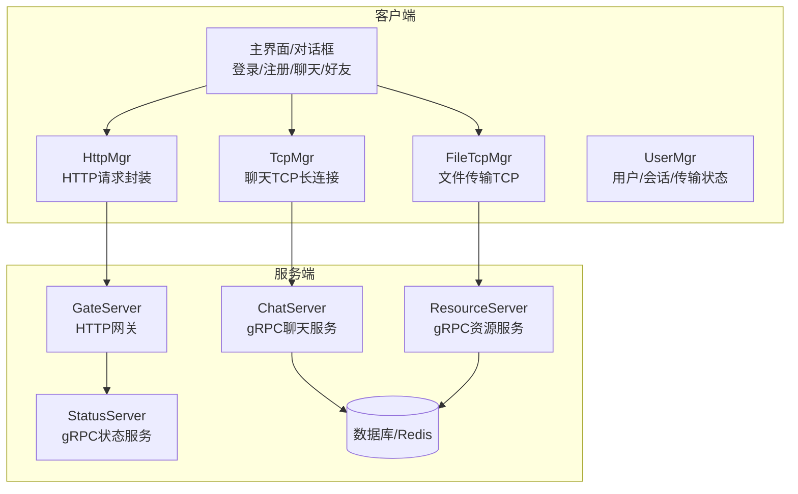
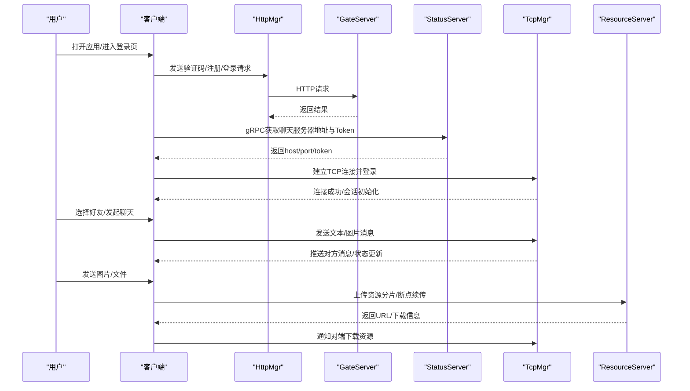
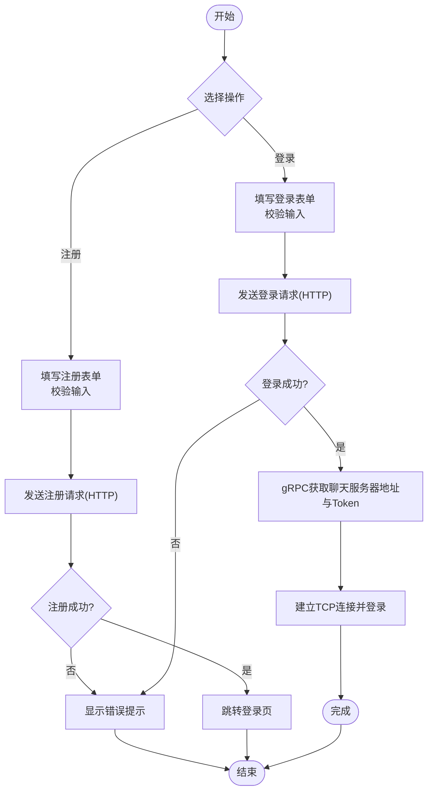
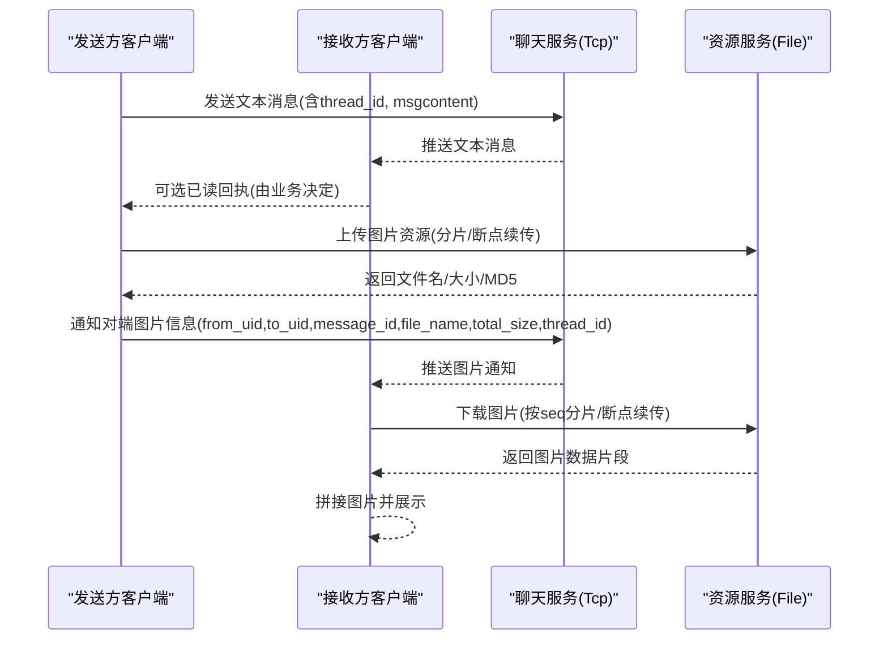
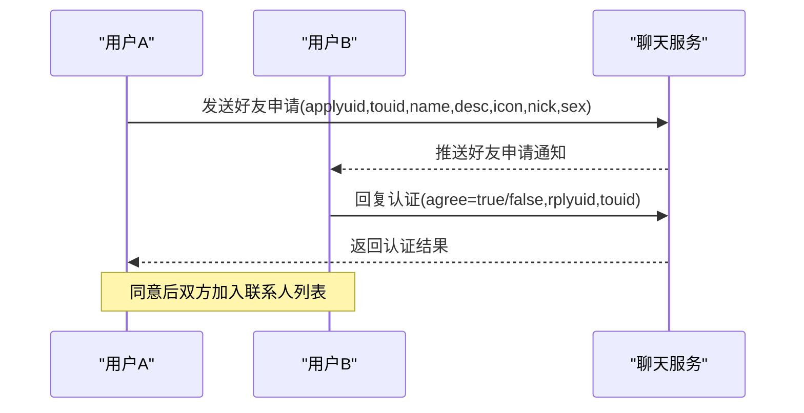
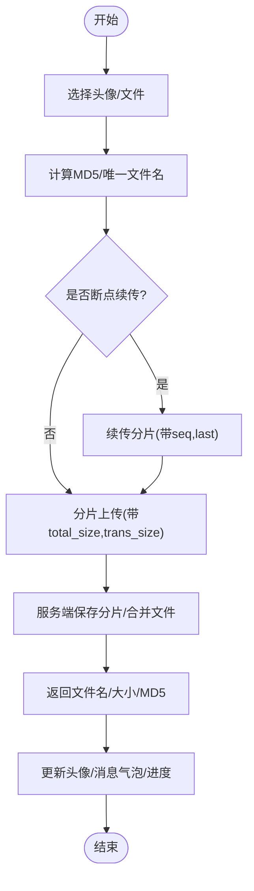
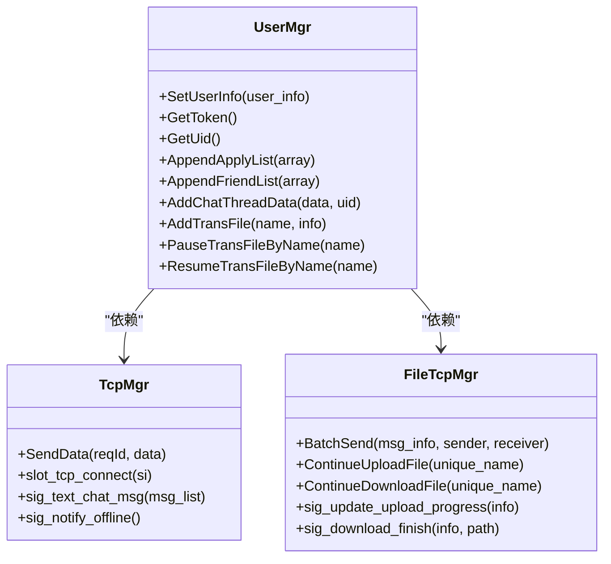
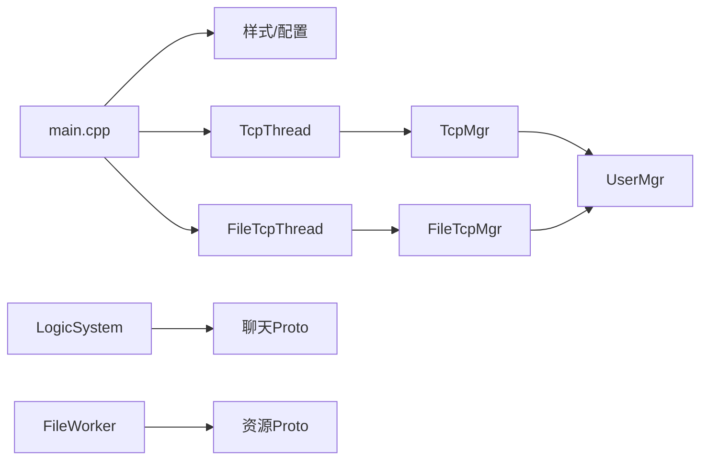

# 核心功能特性

<cite>
**本文引用的文件**   
- [README.md](file://README.md)
- [main.cpp](file://client/llfcchat/src/main.cpp)
- [global.h](file://client/llfcchat/include/global.h)
- [httpmgr.h](file://client/llfcchat/include/httpmgr.h)
- [tcpmgr.h](file://client/llfcchat/include/tcpmgr.h)
- [filetcpmgr.h](file://client/llfcchat/include/filetcpmgr.h)
- [usermgr.h](file://client/llfcchat/include/usermgr.h)
- [logindialog.h](file://client/llfcchat/include/logindialog.h)
- [registerdialog.h](file://client/llfcchat/include/registerdialog.h)
- [chatdialog.h](file://client/llfcchat/include/chatdialog.h)
- [chatpage.h](file://client/llfcchat/include/chatpage.h)
- [applyfriend.h](file://client/llfcchat/include/applyfriend.h)
- [authenfriend.h](file://client/llfcchat/include/authenfriend.h)
- [message.proto（聊天）](file://server/proto/chat/message.proto)
- [message.proto（控制）](file://server/proto/control/message.proto)
- [message.proto（资源）](file://server/proto/resource/message.proto)
- [LogicSystem.h](file://server/ChatServer/include/LogicSystem.h)
- [FileWorker.h](file://server/ResourceServer/include/FileWorker.h)
</cite>

## 目录
1. [简介](#简介)
2. [项目结构](#项目结构)
3. [核心组件](#核心组件)
4. [架构总览](#架构总览)
5. [详细组件分析](#详细组件分析)
6. [依赖关系分析](#依赖关系分析)
7. [性能考量](#性能考量)
8. [故障排查指南](#故障排查指南)
9. [结论](#结论)
10. [附录：使用示例与界面说明](#附录使用示例与界面说明)

## 简介
本文件面向LLFCChat即时通讯系统的核心功能特性，覆盖用户认证（注册、登录、密码重置）、实时聊天（文本消息、图片消息、文件传输）、好友关系管理（申请、认证、联系人列表）、资源管理（头像上传、文件存储、断点续传），以及多设备登录支持、消息已读状态同步、在线状态管理等高级能力。文档既提供用户视角的功能说明与操作流程，也给出开发者视角的实现要点与关键数据结构，帮助快速理解与二次开发。

## 项目结构
系统采用“客户端 + 多后端服务”的分布式架构：
- 客户端（Qt/C++）：负责UI交互、HTTP鉴权、TCP长连接、文件传输、本地数据管理与状态维护。
- GateServer：HTTP网关，处理验证码、注册、登录等HTTP请求。
- StatusServer：状态服务，提供获取聊天服务器地址与Token、登录校验等gRPC能力。
- ChatServer：聊天服务，处理好友申请、认证、文本/图片消息、心跳、踢人等逻辑。
- ResourceServer：资源服务，处理头像、图片、文件的上传下载与断点续传。
- Proto定义：统一的消息协议，涵盖验证、状态、聊天、资源四类接口。

图表来源
- [main.cpp:1-44](file://client/llfcchat/src/main.cpp#L1-L44)
- [httpmgr.h:1-34](file://client/llfcchat/include/httpmgr.h#L1-L34)
- [tcpmgr.h:1-90](file://client/llfcchat/include/tcpmgr.h#L1-L90)
- [filetcpmgr.h:1-85](file://client/llfcchat/include/filetcpmgr.h#L1-L85)
- [usermgr.h:1-116](file://client/llfcchat/include/usermgr.h#L1-L116)
- [message.proto（聊天）:1-167](file://server/proto/chat/message.proto#L1-L167)
- [message.proto（控制）:1-143](file://server/proto/control/message.proto#L1-L143)
- [message.proto（资源）:1-169](file://server/proto/resource/message.proto#L1-L169)

章节来源
- [README.md:1-112](file://README.md#L1-L112)
- [main.cpp:1-44](file://client/llfcchat/src/main.cpp#L1-L44)

## 核心组件
- 网络层
  - HttpMgr：封装HTTP请求，用于验证码、注册、登录等流程。
  - TcpMgr：封装聊天TCP长连接，处理粘包、消息分发、心跳、离线通知等。
  - FileTcpMgr：独立文件传输线程与Socket，实现分片、拥塞控制、断点续传。
- 业务层
  - UserMgr：单例用户管理器，维护当前用户信息、好友/申请列表、聊天会话映射、上传/下载任务状态、标签重置队列等。
  - 各对话框：LoginDialog、RegisterDialog、ChatDialog、ApplyFriend、AuthenFriend、ChatPage等，承载具体业务流程与UI交互。
- 协议层
  - Proto定义：统一消息ID与数据结构，贯穿客户端与服务端。

章节来源
- [httpmgr.h:1-34](file://client/llfcchat/include/httpmgr.h#L1-L34)
- [tcpmgr.h:1-90](file://client/llfcchat/include/tcpmgr.h#L1-L90)
- [filetcpmgr.h:1-85](file://client/llfcchat/include/filetcpmgr.h#L1-L85)
- [usermgr.h:1-116](file://client/llfcchat/include/usermgr.h#L1-L116)
- [message.proto（聊天）:1-167](file://server/proto/chat/message.proto#L1-L167)
- [message.proto（控制）:1-143](file://server/proto/control/message.proto#L1-L143)
- [message.proto（资源）:1-169](file://server/proto/resource/message.proto#L1-L169)

## 架构总览
系统通过HTTP完成身份前置校验，随后建立TCP长连接到聊天服务；大文件与图片等资源通过独立的文件传输通道进行高效传输。状态服务负责路由与鉴权，资源服务负责持久化与并发IO。

图表来源
- [httpmgr.h:1-34](file://client/llfcchat/include/httpmgr.h#L1-L34)
- [tcpmgr.h:1-90](file://client/llfcchat/include/tcpmgr.h#L1-L90)
- [filetcpmgr.h:1-85](file://client/llfcchat/include/filetcpmgr.h#L1-L85)
- [message.proto（控制）:1-143](file://server/proto/control/message.proto#L1-L143)
- [message.proto（聊天）:1-167](file://server/proto/chat/message.proto#L1-L167)
- [message.proto（资源）:1-169](file://server/proto/resource/message.proto#L1-L169)

## 详细组件分析

### 用户认证系统（注册、登录、密码重置）
- 业务流程
  - 注册：输入邮箱/用户名/密码/验证码，调用HTTP接口完成注册，成功后跳转登录。
  - 登录：输入账号密码，HTTP校验通过后，向状态服务获取聊天服务器地址与Token，建立TCP长连接并登录。
  - 密码重置：通过邮箱验证码重置密码，成功后提示重新登录。
- 界面与交互
  - RegisterDialog：验证码倒计时、表单校验、错误提示。
  - LoginDialog：表单校验、失败提示、连接状态反馈。
  - ResetDialog：验证码获取与提交。
- 技术要点
  - HttpMgr统一封装HTTP请求与回调，按模块区分信号。
  - TcpMgr在登录成功后建立TCP连接，处理粘包与消息分发。
  - 全局配置从config.ini读取GateServer地址前缀。

图表来源
- [registerdialog.h:1-55](file://client/llfcchat/include/registerdialog.h#L1-L55)
- [logindialog.h:1-47](file://client/llfcchat/include/logindialog.h#L1-L47)
- [httpmgr.h:1-34](file://client/llfcchat/include/httpmgr.h#L1-L34)
- [message.proto（控制）:1-143](file://server/proto/control/message.proto#L1-L143)
- [message.proto（聊天）:1-167](file://server/proto/chat/message.proto#L1-L167)

章节来源
- [registerdialog.h:1-55](file://client/llfcchat/include/registerdialog.h#L1-L55)
- [logindialog.h:1-47](file://client/llfcchat/include/logindialog.h#L1-L47)
- [httpmgr.h:1-34](file://client/llfcchat/include/httpmgr.h#L1-L34)
- [main.cpp:1-44](file://client/llfcchat/src/main.cpp#L1-L44)

### 实时聊天功能（文本消息、图片消息、文件传输）
- 业务流程
  - 文本消息：发送方通过TcpMgr发送文本消息，服务端转发给接收方；接收方收到后展示并可选已读回执。
  - 图片消息：发送方先上传图片资源到ResourceServer，获得文件名与大小等信息，再通过聊天服务通知接收方；接收方根据信息下载图片。
  - 文件传输：通过FileTcpMgr进行分片传输，支持暂停/继续、进度显示、断点续传。
- 界面与交互
  - ChatDialog：聊天列表、搜索、侧边栏切换、加载更多、消息气泡渲染。
  - ChatPage：消息气泡、发送/接收按钮、文件进度条、头像加载。
- 技术要点
  - 消息类型与状态：MsgType、TransferState、MsgStatus等枚举统一管理。
  - 消息体结构：TextChatData、ImgChatData、MsgInfo等描述消息内容与传输状态。
  - 粘包处理：TcpMgr内部维护缓冲区与长度字段解析。
  - 异步下载：图片/文件下载完成后回调更新UI。

图表来源
- [chatdialog.h:1-98](file://client/llfcchat/include/chatdialog.h#L1-L98)
- [chatpage.h:1-53](file://client/llfcchat/include/chatpage.h#L1-L53)
- [tcpmgr.h:1-90](file://client/llfcchat/include/tcpmgr.h#L1-L90)
- [filetcpmgr.h:1-85](file://client/llfcchat/include/filetcpmgr.h#L1-L85)
- [message.proto（聊天）:1-167](file://server/proto/chat/message.proto#L1-L167)
- [message.proto（资源）:1-169](file://server/proto/resource/message.proto#L1-L169)

章节来源
- [chatdialog.h:1-98](file://client/llfcchat/include/chatdialog.h#L1-L98)
- [chatpage.h:1-53](file://client/llfcchat/include/chatpage.h#L1-L53)
- [tcpmgr.h:1-90](file://client/llfcchat/include/tcpmgr.h#L1-L90)
- [filetcpmgr.h:1-85](file://client/llfcchat/include/filetcpmgr.h#L1-L85)
- [global.h:1-296](file://client/llfcchat/include/global.h#L1-L296)

### 好友关系管理（申请、认证、联系人列表）
- 业务流程
  - 申请好友：输入目标用户ID/昵称，添加标签，发送申请。
  - 认证好友：被申请方收到申请，可选择同意/拒绝，并可附带历史消息或标签。
  - 联系人列表：认证成功后，双方互见联系人，支持分页加载与搜索。
- 界面与交互
  - ApplyFriend：标签输入、提示框、确认/取消。
  - AuthenFriend：标签编辑、历史记录展示、同意/拒绝。
  - ChatDialog：联系人列表、好友申请列表、点击跳转聊天。
- 技术要点
  - Proto中AddFriendReq/RplyFriendReq/AuthFriendReq等定义申请与认证流程。
  - UserMgr维护申请列表、好友列表、uid与thread_id映射。

图表来源
- [applyfriend.h:1-59](file://client/llfcchat/include/applyfriend.h#L1-L59)
- [authenfriend.h:1-64](file://client/llfcchat/include/authenfriend.h#L1-L64)
- [chatdialog.h:1-98](file://client/llfcchat/include/chatdialog.h#L1-L98)
- [message.proto（聊天）:1-167](file://server/proto/chat/message.proto#L1-L167)

章节来源
- [applyfriend.h:1-59](file://client/llfcchat/include/applyfriend.h#L1-L59)
- [authenfriend.h:1-64](file://client/llfcchat/include/authenfriend.h#L1-L64)
- [usermgr.h:1-116](file://client/llfcchat/include/usermgr.h#L1-L116)
- [message.proto（聊天）:1-167](file://server/proto/chat/message.proto#L1-L167)

### 资源管理（头像上传、文件存储、断点续传）
- 业务流程
  - 头像上传：客户端将头像分片上传至ResourceServer，成功后更新用户头像并刷新UI。
  - 文件存储：图片/文件上传后生成唯一文件名与MD5，供聊天消息引用。
  - 断点续传：基于seq与last标志位，记录已传输片段，支持暂停/继续。
- 界面与交互
  - ChatPage：图片缩略图、进度条、暂停/继续按钮。
  - UserMgr：维护上传/下载任务状态、路径与Label映射，避免重复绘制。
- 技术要点
  - FileWorker/DownloadWorker在服务端处理分片写入与并发下载。
  - 客户端FileTcpMgr实现拥塞窗口控制、批量发送、续传逻辑。

图表来源
- [filetcpmgr.h:1-85](file://client/llfcchat/include/filetcpmgr.h#L1-L85)
- [FileWorker.h:1-90](file://server/ResourceServer/include/FileWorker.h#L1-L90)
- [global.h:1-296](file://client/llfcchat/include/global.h#L1-L296)

章节来源
- [filetcpmgr.h:1-85](file://client/llfcchat/include/filetcpmgr.h#L1-L85)
- [FileWorker.h:1-90](file://server/ResourceServer/include/FileWorker.h#L1-L90)
- [global.h:1-296](file://client/llfcchat/include/global.h#L1-L296)

### 多设备登录支持、消息已读状态同步、在线状态管理
- 多设备登录
  - 状态服务返回Token，客户端携带Token登录聊天服务；服务端可维护同一用户的多连接与会话映射。
  - 若需限制单设备，可通过KickUser机制踢出旧连接。
- 消息已读状态同步
  - 客户端在消息展示后上报已读状态，服务端广播或回写；UI根据MsgStatus显示未读/已读。
- 在线状态管理
  - 心跳机制：客户端定时发送心跳，服务端检测超时下线；异常断开触发离线通知。

图表来源
- [usermgr.h:1-116](file://client/llfcchat/include/usermgr.h#L1-L116)
- [tcpmgr.h:1-90](file://client/llfcchat/include/tcpmgr.h#L1-L90)
- [filetcpmgr.h:1-85](file://client/llfcchat/include/filetcpmgr.h#L1-L85)
- [message.proto（聊天）:1-167](file://server/proto/chat/message.proto#L1-L167)

章节来源
- [usermgr.h:1-116](file://client/llfcchat/include/usermgr.h#L1-L116)
- [tcpmgr.h:1-90](file://client/llfcchat/include/tcpmgr.h#L1-L90)
- [filetcpmgr.h:1-85](file://client/llfcchat/include/filetcpmgr.h#L1-L85)
- [message.proto（聊天）:1-167](file://server/proto/chat/message.proto#L1-L167)

## 依赖关系分析
- 客户端内部依赖
  - main.cpp启动样式与配置，创建TcpThread与FileTcpThread，显示MainWindow。
  - HttpMgr/TcpMgr/FileTcpMgr为网络层核心，UserMgr为业务状态中枢。
  - 各对话框依赖UserMgr与网络层，通过信号槽通信。
- 服务端依赖
  - LogicSystem集中处理聊天相关逻辑，注册回调函数，处理心跳、好友、聊天消息等。
  - FileWorker/DownloadWorker处理文件上传下载任务队列。

图表来源
- [main.cpp:1-44](file://client/llfcchat/src/main.cpp#L1-L44)
- [tcpmgr.h:1-90](file://client/llfcchat/include/tcpmgr.h#L1-L90)
- [filetcpmgr.h:1-85](file://client/llfcchat/include/filetcpmgr.h#L1-L85)
- [usermgr.h:1-116](file://client/llfcchat/include/usermgr.h#L1-L116)
- [LogicSystem.h:1-61](file://server/ChatServer/include/LogicSystem.h#L1-L61)
- [FileWorker.h:1-90](file://server/ResourceServer/include/FileWorker.h#L1-L90)

章节来源
- [main.cpp:1-44](file://client/llfcchat/src/main.cpp#L1-L44)
- [LogicSystem.h:1-61](file://server/ChatServer/include/LogicSystem.h#L1-L61)
- [FileWorker.h:1-90](file://server/ResourceServer/include/FileWorker.h#L1-L90)

## 性能考量
- 网络层
  - TcpMgr维护发送队列与粘包处理，减少频繁I/O；心跳保活降低无效连接占用。
  - FileTcpMgr实现拥塞窗口控制与批量发送，提升吞吐；断点续传避免重复传输。
- 资源层
  - 服务端使用工作线程与任务队列处理文件IO，避免阻塞主循环。
  - 客户端缓存头像与缩略图，减少重复下载与绘制开销。
- 数据层
  - 分页加载聊天列表与消息，降低内存压力；按需加载资源，提升首屏速度。

## 故障排查指南
- 常见问题
  - 登录失败：检查HTTP响应码与错误码，确认GateServer可达；查看TcpMgr连接状态。
  - 消息丢失：核对消息ID与thread_id；检查粘包解析与缓冲区状态。
  - 文件传输中断：确认seq与last标志位；检查断点续传状态与MD5一致性。
  - 头像不更新：检查UserMgr的路径到Label映射与重置逻辑。
- 定位方法
  - 启用调试日志，观察各模块信号槽触发顺序。
  - 使用抓包工具验证Proto序列化与网络报文。
  - 检查服务端日志与数据库/Redis状态。

章节来源
- [tcpmgr.h:1-90](file://client/llfcchat/include/tcpmgr.h#L1-L90)
- [filetcpmgr.h:1-85](file://client/llfcchat/include/filetcpmgr.h#L1-L85)
- [usermgr.h:1-116](file://client/llfcchat/include/usermgr.h#L1-L116)
- [global.h:1-296](file://client/llfcchat/include/global.h#L1-L296)

## 结论
LLFCChat通过清晰的模块化设计与统一的Proto协议，实现了稳定可靠的即时通讯能力。客户端以Qt为核心，结合HTTP与TCP双通道，满足文本、图片、文件等多媒体场景；服务端采用分布式架构，职责分离明确，便于扩展与维护。建议在生产环境完善监控与告警，优化资源缓存策略，并持续迭代用户体验与安全性。

## 附录：使用示例与界面说明
- 用户注册
  - 打开注册界面，填写邮箱、用户名、密码与验证码，点击确认；成功后跳转登录。
- 用户登录
  - 输入账号密码，点击登录；成功后自动连接聊天服务器并进入主界面。
- 发送文本消息
  - 选择联系人，输入内容，点击发送；对方收到后展示气泡。
- 发送图片/文件
  - 选择文件，上传后显示进度；完成后对端收到通知并下载展示。
- 好友申请与认证
  - 输入目标用户ID，添加标签并提交；对方收到后可同意或拒绝。
- 头像设置
  - 选择头像图片，上传成功后刷新个人主页与聊天列表头像。

章节来源
- [registerdialog.h:1-55](file://client/llfcchat/include/registerdialog.h#L1-L55)
- [logindialog.h:1-47](file://client/llfcchat/include/logindialog.h#L1-L47)
- [chatdialog.h:1-98](file://client/llfcchat/include/chatdialog.h#L1-L98)
- [chatpage.h:1-53](file://client/llfcchat/include/chatpage.h#L1-L53)
- [applyfriend.h:1-59](file://client/llfcchat/include/applyfriend.h#L1-L59)
- [authenfriend.h:1-64](file://client/llfcchat/include/authenfriend.h#L1-L64)