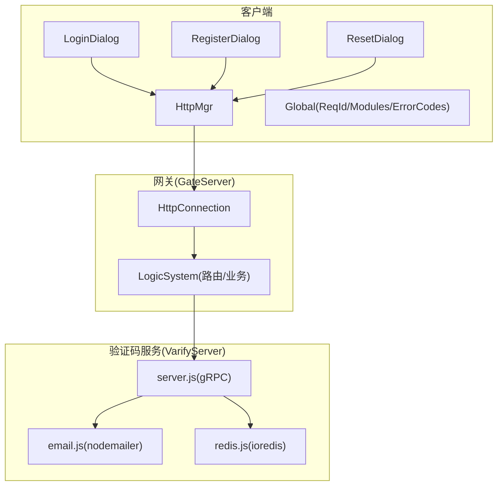
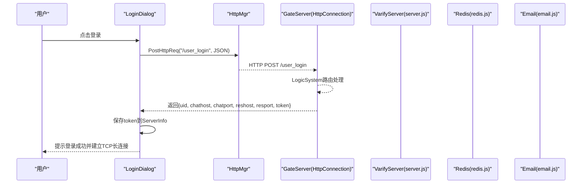
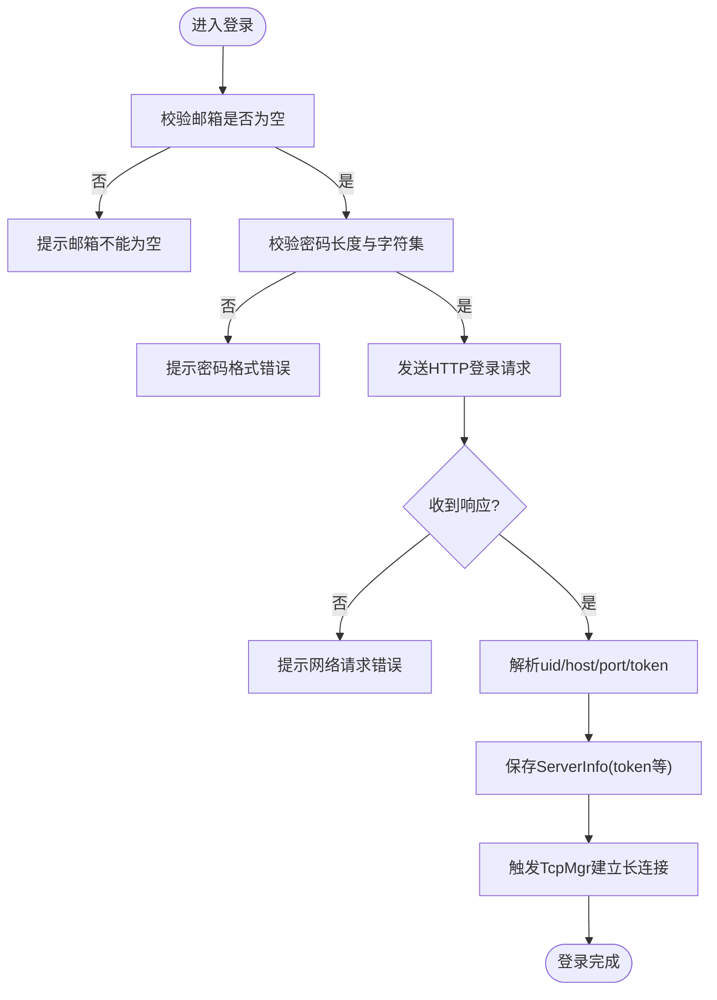
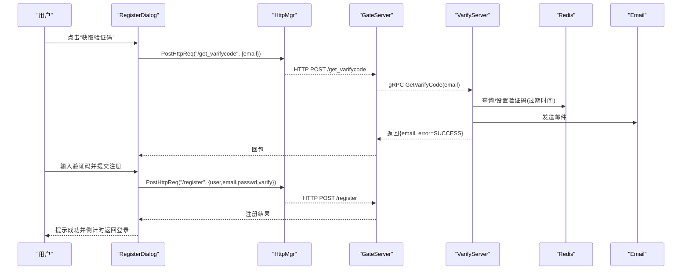
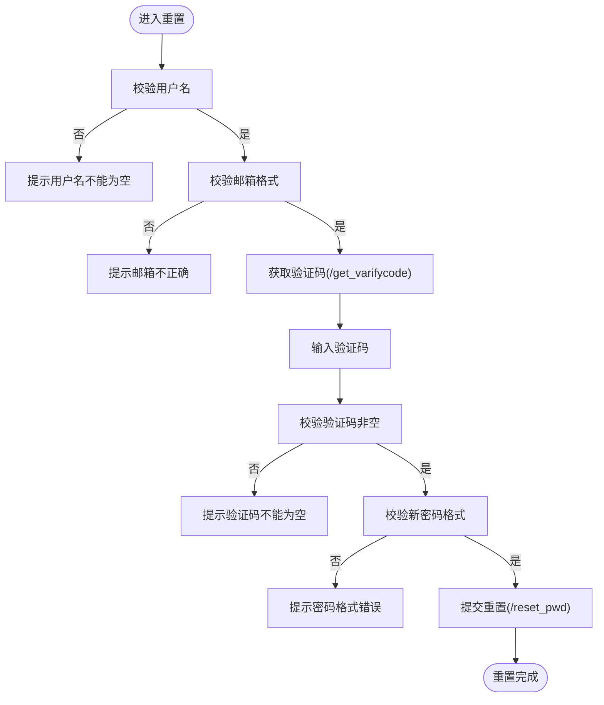
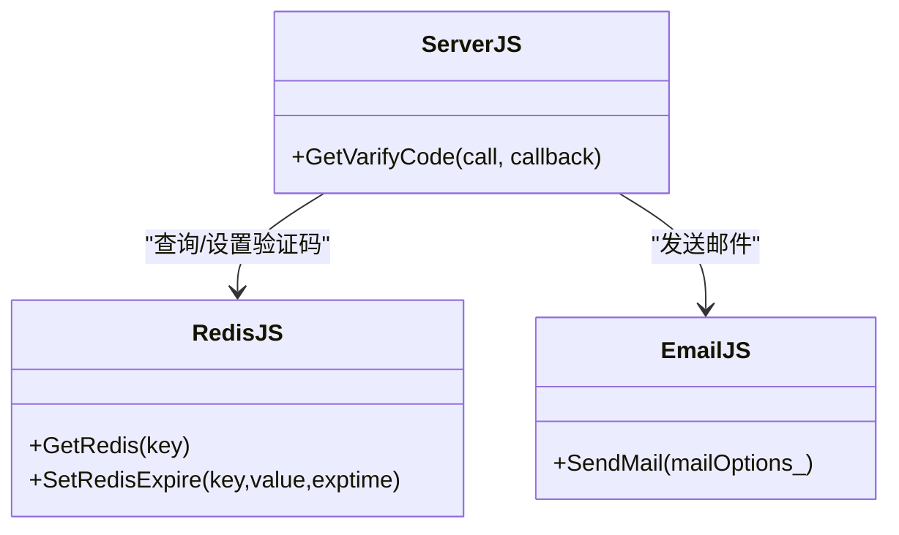
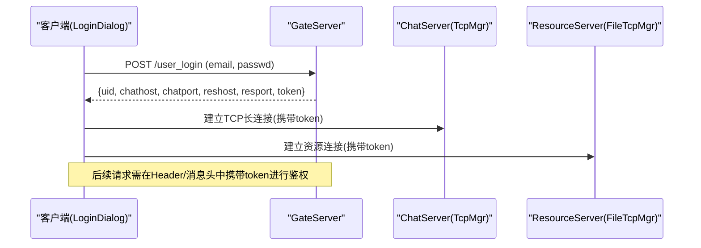
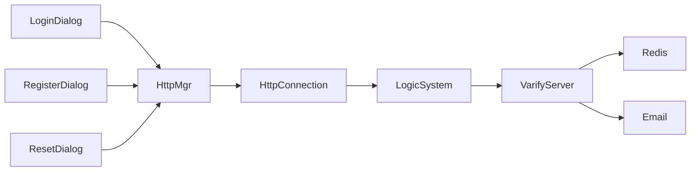

# 用户认证系统

<cite>
**本文引用的文件**   
- [logindialog.h](file://client/llfcchat/include/logindialog.h)
- [registerdialog.h](file://client/llfcchat/include/registerdialog.h)
- [resetdialog.h](file://client/llfcchat/include/resetdialog.h)
- [httpmgr.h](file://client/llfcchat/include/httpmgr.h)
- [global.h](file://client/llfcchat/include/global.h)
- [logindialog.cpp](file://client/llfcchat/src/logindialog.cpp)
- [registerdialog.cpp](file://client/llfcchat/src/registerdialog.cpp)
- [resetdialog.cpp](file://client/llfcchat/src/resetdialog.cpp)
- [config.ini](file://client/llfcchat/config/config.ini)
- [HttpConnection.cpp](file://server/GateServer/src/HttpConnection.cpp)
- [server.js](file://server/VarifyServer/server.js)
- [email.js](file://server/VarifyServer/email.js)
- [redis.js](file://server/VarifyServer/redis.js)
</cite>

## 目录
1. [简介](#简介)
2. [项目结构](#项目结构)
3. [核心组件](#核心组件)
4. [架构总览](#架构总览)
5. [详细组件分析](#详细组件分析)
6. [依赖关系分析](#依赖关系分析)
7. [性能考虑](#性能考虑)
8. [故障排查指南](#故障排查指南)
9. [结论](#结论)
10. [附录：API与集成示例](#附录api与集成示例)

## 简介
本文件面向LLFCChat的用户认证子系统，覆盖注册、登录、密码重置三大核心流程；重点说明邮箱验证码验证机制、JWT令牌管理（客户端侧）、会话状态维护、以及客户端界面（LoginDialog、RegisterDialog、ResetDialog）与后端GateServer和验证码服务（VarifyServer）的通信协议。文档同时提供业务流程图、API接口说明、错误处理策略与安全建议，并给出用户操作指南与开发者集成示例，帮助快速上手与问题定位。

## 项目结构
认证相关代码主要分布在以下模块：
- 客户端UI层：登录、注册、重置三个对话框类及其实现
- 客户端网络层：HTTP管理器封装HTTP请求与回调分发
- 全局常量与枚举：请求ID、错误码、模块标识、数据结构等
- GateServer：HTTP网关，负责路由解析与转发到业务逻辑
- VarifyServer：基于gRPC的验证码服务，使用Redis缓存验证码并发送邮件

**图表来源** 
- [logindialog.h:11-44](file://client/llfcchat/include/logindialog.h#L11-L44)
- [registerdialog.h:16-52](file://client/llfcchat/include/registerdialog.h#L16-L52)
- [resetdialog.h:11-41](file://client/llfcchat/include/resetdialog.h#L11-L41)
- [httpmgr.h:11-31](file://client/llfcchat/include/httpmgr.h#L11-L31)
- [global.h:43-101](file://client/llfcchat/include/global.h#L43-L101)
- [HttpConnection.cpp:133-194](file://server/GateServer/src/HttpConnection.cpp#L133-L194)
- [server.js:15-64](file://server/VarifyServer/server.js#L15-L64)
- [email.js:22-35](file://server/VarifyServer/email.js#L22-L35)
- [redis.js:41-98](file://server/VarifyServer/redis.js#L41-L98)

**章节来源**
- [logindialog.h:11-44](file://client/llfcchat/include/logindialog.h#L11-L44)
- [registerdialog.h:16-52](file://client/llfcchat/include/registerdialog.h#L16-L52)
- [resetdialog.h:11-41](file://client/llfcchat/include/resetdialog.h#L11-L41)
- [httpmgr.h:11-31](file://client/llfcchat/include/httpmgr.h#L11-L31)
- [global.h:43-101](file://client/llfcchat/include/global.h#L43-L101)
- [HttpConnection.cpp:133-194](file://server/GateServer/src/HttpConnection.cpp#L133-L194)
- [server.js:15-64](file://server/VarifyServer/server.js#L15-L64)
- [email.js:22-35](file://server/VarifyServer/email.js#L22-L35)
- [redis.js:41-98](file://server/VarifyServer/redis.js#L41-L98)

## 核心组件
- LoginDialog：处理用户登录输入校验、发起HTTP登录请求、接收响应后建立TCP长连接（携带token），并提示跳转注册/重置。
- RegisterDialog：处理注册表单校验、获取邮箱验证码、提交注册请求，成功后倒计时返回登录。
- ResetDialog：处理重置密码流程，包括邮箱校验、获取验证码、提交新密码。
- HttpMgr：统一封装HTTP POST请求，按ReqId与Modules分发回调信号给对应对话框。
- Global：定义ReqId、ErrorCodes、Modules、TipErr等枚举与全局配置（如gate_url_prefix）。
- GateServer(HttpConnection)：解析HTTP请求，路由到LogicSystem处理具体业务。
- VarifyServer(server.js)：gRPC服务，生成或复用验证码，存入Redis并发送邮件。

**章节来源**
- [logindialog.cpp:175-195](file://client/llfcchat/src/logindialog.cpp#L175-L195)
- [registerdialog.cpp:98-111](file://client/llfcchat/src/registerdialog.cpp#L98-L111)
- [resetdialog.cpp:50-64](file://client/llfcchat/src/resetdialog.cpp#L50-L64)
- [httpmgr.h:17-31](file://client/llfcchat/include/httpmgr.h#L17-L31)
- [global.h:43-101](file://client/llfcchat/include/global.h#L43-L101)
- [HttpConnection.cpp:133-194](file://server/GateServer/src/HttpConnection.cpp#L133-L194)
- [server.js:15-64](file://server/VarifyServer/server.js#L15-L64)

## 架构总览
认证子系统采用“前端Qt对话框 + HTTP网关 + gRPC验证码服务”的分层设计。客户端通过HttpMgr向GateServer发送JSON请求；GateServer根据路径路由至业务逻辑；验证码流程由GateServer调用VarifyServer的gRPC接口完成。登录成功后，客户端获得JWT token，用于后续聊天服务器（ChatServer）的鉴权与资源服务器（ResourceServer）访问。

**图表来源** 
- [logindialog.cpp:175-195](file://client/llfcchat/src/logindialog.cpp#L175-L195)
- [logindialog.cpp:77-110](file://client/llfcchat/src/logindialog.cpp#L77-L110)
- [HttpConnection.cpp:133-194](file://server/GateServer/src/HttpConnection.cpp#L133-L194)

**章节来源**
- [logindialog.cpp:77-110](file://client/llfcchat/src/logindialog.cpp#L77-L110)
- [logindialog.cpp:175-195](file://client/llfcchat/src/logindialog.cpp#L175-L195)
- [HttpConnection.cpp:133-194](file://server/GateServer/src/HttpConnection.cpp#L133-L194)

## 详细组件分析

### 登录流程（LoginDialog）
- 输入校验：邮箱非空、密码长度与字符集限制。
- 发起HTTP登录：POST到GateServer的/user_login，载荷包含email与xor加密后的passwd。
- 响应处理：解析返回的uid、chathost/chatport、reshost/resport、token，构造ServerInfo并通过信号触发TcpMgr建立长连接。
- 错误提示：网络错误、参数错误时显示提示信息。

**图表来源** 
- [logindialog.cpp:131-166](file://client/llfcchat/src/logindialog.cpp#L131-L166)
- [logindialog.cpp:175-195](file://client/llfcchat/src/logindialog.cpp#L175-L195)
- [logindialog.cpp:77-110](file://client/llfcchat/src/logindialog.cpp#L77-L110)

**章节来源**
- [logindialog.cpp:131-166](file://client/llfcchat/src/logindialog.cpp#L131-L166)
- [logindialog.cpp:175-195](file://client/llfcchat/src/logindialog.cpp#L175-L195)
- [logindialog.cpp:77-110](file://client/llfcchat/src/logindialog.cpp#L77-L110)

### 注册流程（RegisterDialog）
- 输入校验：用户名非空、邮箱正则匹配、密码长度与字符集、确认密码一致。
- 获取验证码：点击“获取验证码”，校验邮箱后POST到/get_varifycode。
- 提交注册：填写验证码后提交注册请求（由handlers映射处理）。
- 成功反馈：倒计时提示返回登录。

**图表来源** 
- [registerdialog.cpp:98-111](file://client/llfcchat/src/registerdialog.cpp#L98-L111)
- [registerdialog.cpp:113-139](file://client/llfcchat/src/registerdialog.cpp#L113-L139)
- [server.js:15-64](file://server/VarifyServer/server.js#L15-L64)
- [redis.js:41-98](file://server/VarifyServer/redis.js#L41-L98)
- [email.js:22-35](file://server/VarifyServer/email.js#L22-L35)

**章节来源**
- [registerdialog.cpp:98-111](file://client/llfcchat/src/registerdialog.cpp#L98-L111)
- [registerdialog.cpp:113-139](file://client/llfcchat/src/registerdialog.cpp#L113-L139)
- [server.js:15-64](file://server/VarifyServer/server.js#L15-L64)
- [redis.js:41-98](file://server/VarifyServer/redis.js#L41-L98)
- [email.js:22-35](file://server/VarifyServer/email.js#L22-L35)

### 密码重置流程（ResetDialog）
- 输入校验：用户名、邮箱、验证码、新密码格式。
- 获取验证码：同注册流程，POST到/get_varifycode。
- 提交重置：POST到/reset_pwd，携带email、varify、newpasswd。
- 成功反馈：提示重置成功并可返回登录。

**图表来源** 
- [resetdialog.cpp:50-64](file://client/llfcchat/src/resetdialog.cpp#L50-L64)
- [resetdialog.cpp:94-130](file://client/llfcchat/src/resetdialog.cpp#L94-L130)
- [resetdialog.cpp:151-161](file://client/llfcchat/src/resetdialog.cpp#L151-L161)

**章节来源**
- [resetdialog.cpp:50-64](file://client/llfcchat/src/resetdialog.cpp#L50-L64)
- [resetdialog.cpp:94-130](file://client/llfcchat/src/resetdialog.cpp#L94-L130)
- [resetdialog.cpp:151-161](file://client/llfcchat/src/resetdialog.cpp#L151-L161)

### 邮箱验证码机制（VarifyServer）
- 生成或复用验证码：优先从Redis读取已存在的验证码，不存在则生成短码（UUID前缀截取），设置过期时间（例如600秒）。
- 邮件发送：通过nodemailer配置SMTP发送验证码邮件。
- Redis交互：GetRedis/SetRedisExpire等操作确保验证码唯一性与时效性。

**图表来源** 
- [server.js:15-64](file://server/VarifyServer/server.js#L15-L64)
- [email.js:22-35](file://server/VarifyServer/email.js#L22-L35)
- [redis.js:41-98](file://server/VarifyServer/redis.js#L41-L98)

**章节来源**
- [server.js:15-64](file://server/VarifyServer/server.js#L15-L64)
- [email.js:22-35](file://server/VarifyServer/email.js#L22-L35)
- [redis.js:41-98](file://server/VarifyServer/redis.js#L41-L98)

### JWT令牌管理与会话状态
- 登录成功后，GateServer返回token字段，客户端将其保存在ServerInfo中，并在后续与聊天服务器和资源服务器的通信中使用。
- 客户端在登录成功后通过TcpMgr建立长连接，维持会话状态；token作为鉴权凭据。
- 安全建议：token应妥善存储（避免明文持久化），传输使用HTTPS/TLS，服务端需校验签名与有效期。

**图表来源** 
- [logindialog.cpp:77-110](file://client/llfcchat/src/logindialog.cpp#L77-L110)
- [logindialog.cpp:175-195](file://client/llfcchat/src/logindialog.cpp#L175-L195)
- [global.h:122-136](file://client/llfcchat/include/global.h#L122-L136)

**章节来源**
- [logindialog.cpp:77-110](file://client/llfcchat/src/logindialog.cpp#L77-L110)
- [logindialog.cpp:175-195](file://client/llfcchat/src/logindialog.cpp#L175-L195)
- [global.h:122-136](file://client/llfcchat/include/global.h#L122-L136)

## 依赖关系分析
- 客户端内部依赖：
  - LoginDialog/RegisterDialog/ResetDialog均依赖HttpMgr进行HTTP请求，依赖Global中的ReqId/Modules/ErrorCodes进行回调分发。
  - LoginDialog还依赖TcpMgr/FileTcpMgr建立长连接。
- 服务端依赖：
  - GateServer的HttpConnection负责HTTP解析与路由，调用LogicSystem处理业务。
  - VarifyServer依赖Redis与邮件服务。

**图表来源** 
- [logindialog.h:11-44](file://client/llfcchat/include/logindialog.h#L11-L44)
- [registerdialog.h:16-52](file://client/llfcchat/include/registerdialog.h#L16-L52)
- [resetdialog.h:11-41](file://client/llfcchat/include/resetdialog.h#L11-L41)
- [httpmgr.h:11-31](file://client/llfcchat/include/httpmgr.h#L11-L31)
- [HttpConnection.cpp:133-194](file://server/GateServer/src/HttpConnection.cpp#L133-L194)
- [server.js:15-64](file://server/VarifyServer/server.js#L15-L64)

**章节来源**
- [logindialog.h:11-44](file://client/llfcchat/include/logindialog.h#L11-L44)
- [registerdialog.h:16-52](file://client/llfcchat/include/registerdialog.h#L16-L52)
- [resetdialog.h:11-41](file://client/llfcchat/include/resetdialog.h#L11-L41)
- [httpmgr.h:11-31](file://client/llfcchat/include/httpmgr.h#L11-L31)
- [HttpConnection.cpp:133-194](file://server/GateServer/src/HttpConnection.cpp#L133-L194)
- [server.js:15-64](file://server/VarifyServer/server.js#L15-L64)

## 性能考虑
- HTTP请求合并与重试：HttpMgr可考虑对相同请求去重与失败重试，提升用户体验。
- 验证码缓存：VarifyServer使用Redis缓存验证码，减少重复生成与邮件发送压力。
- 连接池与超时：GateServer与VarifyServer的连接与超时配置需合理设置，避免资源耗尽。
- 前端UI线程：Qt事件循环应避免阻塞，异步处理网络请求与回调。

[本节为通用指导，不直接分析具体文件]

## 故障排查指南
- 网络请求错误：检查HttpMgr的sig_http_finish与模块信号是否正确连接；确认GateServer端口与URL前缀配置。
- JSON解析错误：检查后端返回体结构与字段名是否与客户端期望一致。
- 验证码未收到：检查VarifyServer的Redis连接与邮件SMTP配置；查看日志输出。
- 登录失败：核对密码加密方式（xorString）与服务端解密一致性；检查token有效性。

**章节来源**
- [httpmgr.h:23-31](file://client/llfcchat/include/httpmgr.h#L23-L31)
- [registerdialog.cpp:113-139](file://client/llfcchat/src/registerdialog.cpp#L113-L139)
- [resetdialog.cpp:66-92](file://client/llfcchat/src/resetdialog.cpp#L66-L92)
- [server.js:56-62](file://server/VarifyServer/server.js#L56-L62)
- [redis.js:16-28](file://server/VarifyServer/redis.js#L16-L28)
- [email.js:22-35](file://server/VarifyServer/email.js#L22-L35)

## 结论
LLFCChat认证子系统以清晰的职责划分与模块化设计实现了注册、登录、重置的核心功能。通过GateServer与VarifyServer的协作，结合Redis与邮件服务，保证了验证码流程的安全与高效。客户端侧通过HttpMgr与TcpMgr/Fi leTcpMgr完成HTTP与长连接的统一管理，配合JWT令牌实现跨服务鉴权。建议在后续迭代中加强安全性（HTTPS、Token刷新、限流防刷）与可观测性（日志与监控）。

[本节为总结，不直接分析具体文件]

## 附录：API与集成示例

### API接口说明
- 获取验证码
  - 方法：POST
  - 路径：/get_varifycode
  - 请求体：{ "email": "用户邮箱" }
  - 响应体：{ "email": "用户邮箱", "error": 0 } （error=0表示成功）
  - 说明：GateServer转发至VarifyServer，生成或复用验证码并发送邮件。

- 注册用户
  - 方法：POST
  - 路径：/register
  - 请求体：{ "user": "用户名", "email": "邮箱", "passwd": "密码", "varify": "验证码" }
  - 响应体：{ "error": 0 } （成功）

- 重置密码
  - 方法：POST
  - 路径：/reset_pwd
  - 请求体：{ "email": "邮箱", "varify": "验证码", "newpasswd": "新密码" }
  - 响应体：{ "error": 0 } （成功）

- 用户登录
  - 方法：POST
  - 路径：/user_login
  - 请求体：{ "email": "邮箱", "passwd": "xor加密后的密码" }
  - 响应体：{ "uid": 用户ID, "chathost": "聊天主机", "chatport": "聊天端口", "reshost": "资源主机", "resport": "资源端口", "token": "JWT令牌" }

**章节来源**
- [registerdialog.cpp:98-111](file://client/llfcchat/src/registerdialog.cpp#L98-L111)
- [resetdialog.cpp:50-64](file://client/llfcchat/src/resetdialog.cpp#L50-L64)
- [logindialog.cpp:175-195](file://client/llfcchat/src/logindialog.cpp#L175-L195)
- [global.h:43-88](file://client/llfcchat/include/global.h#L43-L88)

### 客户端集成示例（步骤）
- 初始化HttpMgr并连接模块信号：
  - 登录：连接sig_login_mod_finish
  - 注册：连接sig_reg_mod_finish
  - 重置：连接sig_reset_mod_finish
- 发起请求：
  - 使用PostHttpReq(url, json, req_id, modules)
- 处理回调：
  - 根据ReqId解析JSON并更新UI或触发下一步动作（如建立TCP连接）

**章节来源**
- [httpmgr.h:17-31](file://client/llfcchat/include/httpmgr.h#L17-L31)
- [logindialog.cpp:77-110](file://client/llfcchat/src/logindialog.cpp#L77-L110)
- [registerdialog.cpp:113-139](file://client/llfcchat/src/registerdialog.cpp#L113-L139)
- [resetdialog.cpp:66-92](file://client/llfcchat/src/resetdialog.cpp#L66-L92)

### 用户操作指南
- 注册：
  - 输入用户名、邮箱、密码与确认密码，点击“获取验证码”，输入收到的验证码后提交注册。
- 登录：
  - 输入邮箱与密码，点击登录；成功后自动建立长连接。
- 重置密码：
  - 输入用户名与邮箱，点击“获取验证码”，输入验证码与新密码后提交重置。

[本节为用户操作说明，不直接分析具体文件]

### 常见问题与解决方案
- 无法获取验证码：
  - 检查GateServer与VarifyServer连通性；确认Redis与SMTP配置正确。
- 登录失败：
  - 核对密码加密方式与服务端解密一致性；检查网络请求是否被拦截。
- 页面提示“json解析错误”：
  - 检查后端返回JSON结构是否符合预期；确认字段名称与类型。

**章节来源**
- [registerdialog.cpp:113-139](file://client/llfcchat/src/registerdialog.cpp#L113-L139)
- [resetdialog.cpp:66-92](file://client/llfcchat/src/resetdialog.cpp#L66-L92)
- [server.js:56-62](file://server/VarifyServer/server.js#L56-L62)
- [redis.js:16-28](file://server/VarifyServer/redis.js#L16-L28)
- [email.js:22-35](file://server/VarifyServer/email.js#L22-L35)