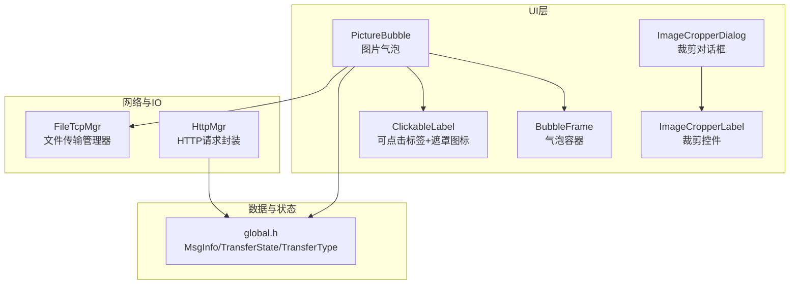
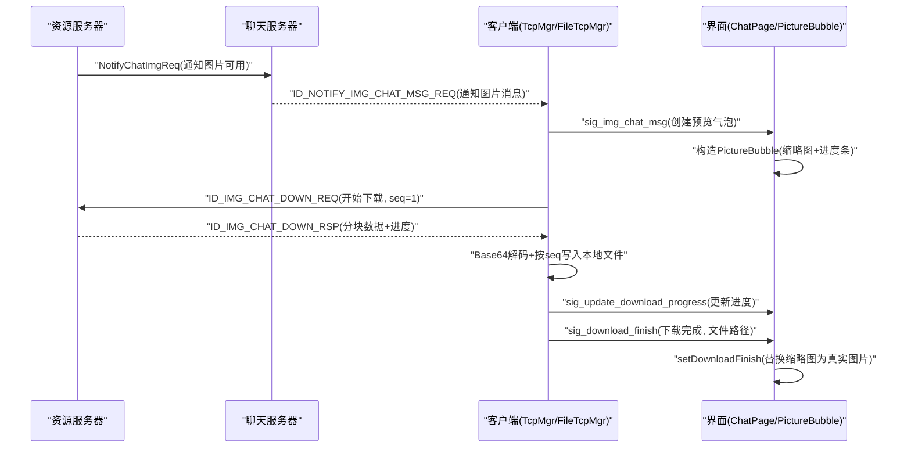
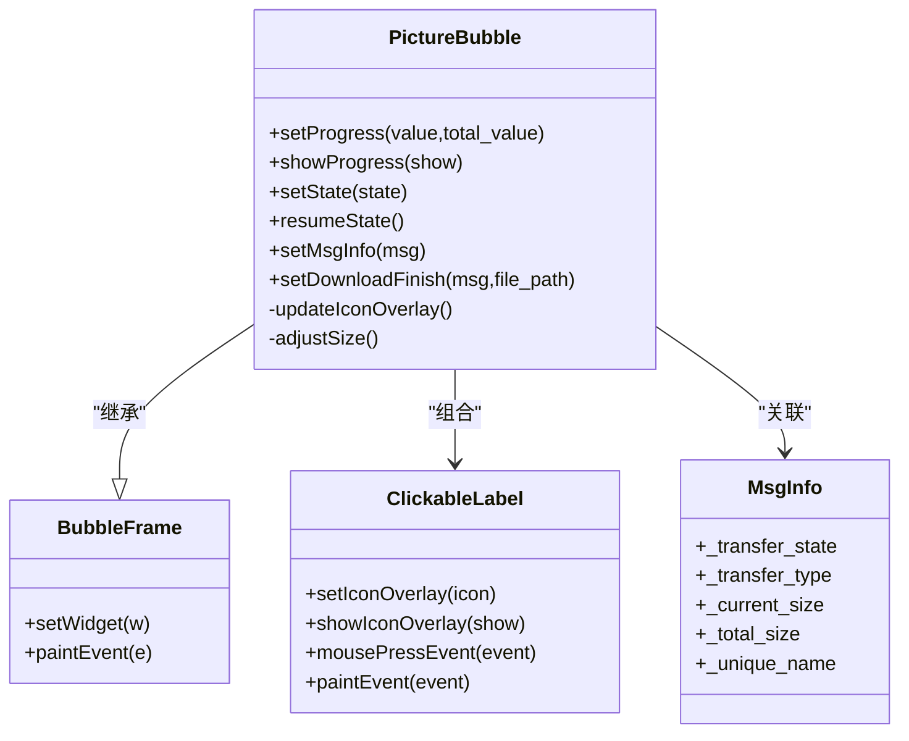
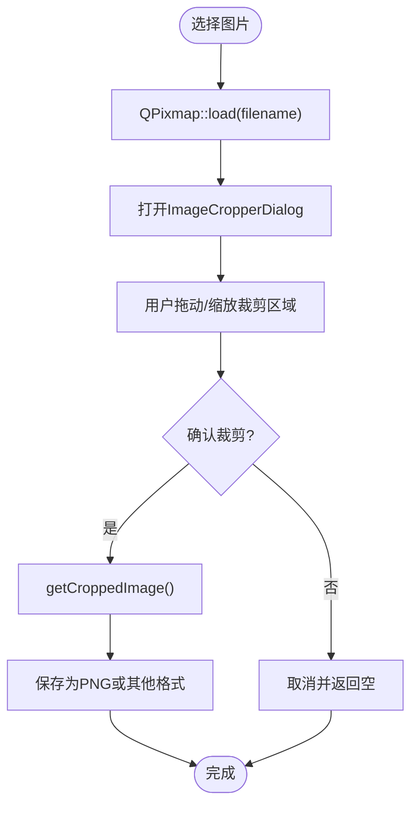
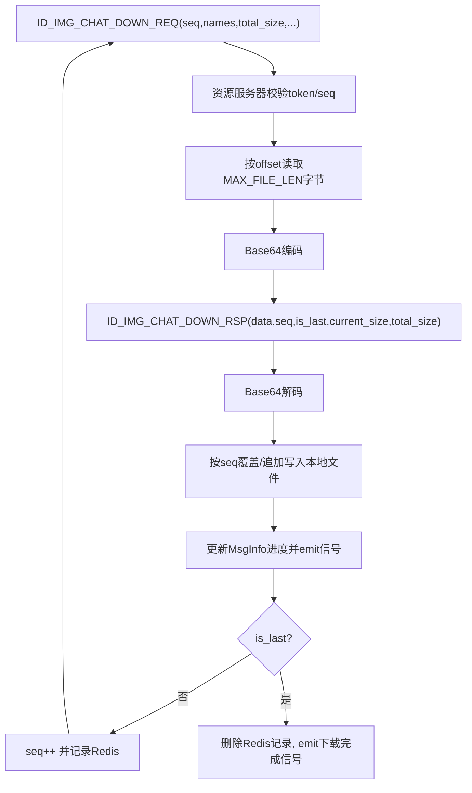
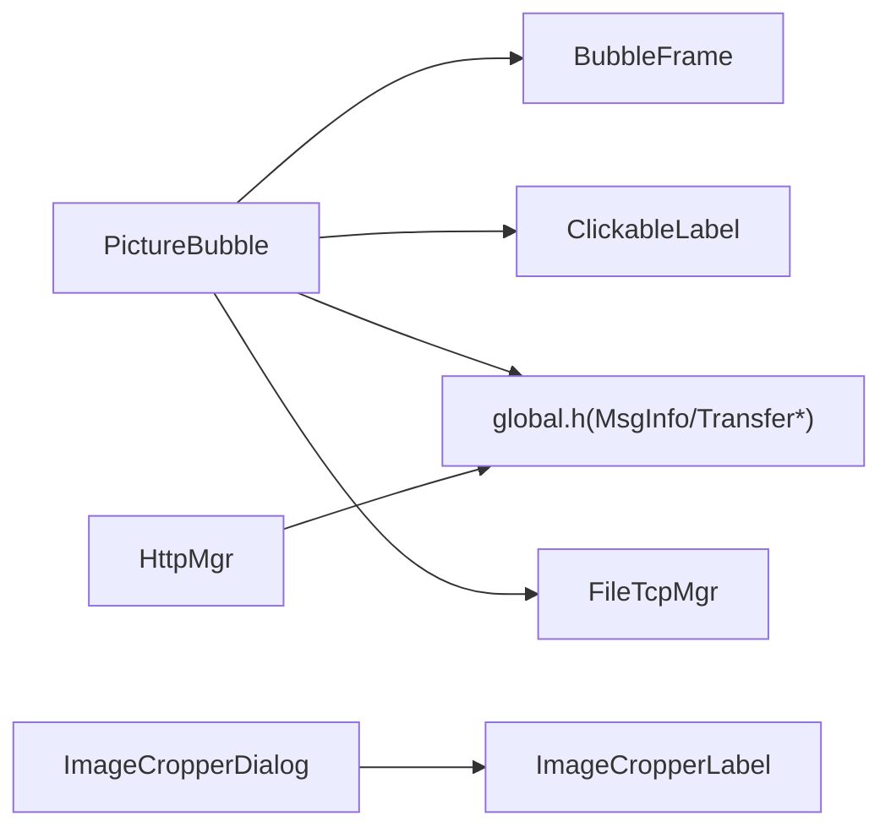

# 图片处理

<cite>
**本文引用的文件**   
- [PictureBubble.h](file://client/llfcchat/include/PictureBubble.h)
- [PictureBubble.cpp](file://client/llfcchat/src/PictureBubble.cpp)
- [BubbleFrame.h](file://client/llfcchat/include/BubbleFrame.h)
- [BubbleFrame.cpp](file://client/llfcchat/src/BubbleFrame.cpp)
- [ClickableLabel.h](file://client/llfcchat/include/ClickableLabel.h)
- [ClickableLabel.cpp](file://client/llfcchat/src/ClickableLabel.cpp)
- [global.h](file://client/llfcchat/include/global.h)
- [imagecropperdialog.h](file://client/llfcchat/include/imagecropperdialog.h)
- [imagecropperlabel.h](file://client/llfcchat/include/imagecropperlabel.h)
- [filetcpmgr.h](file://client/llfcchat/include/filetcpmgr.h)
- [httpmgr.h](file://client/llfcchat/include/httpmgr.h)
- [day41-通知客户端异步下载聊天图片.md](file://开发文档/day41-通知客户端异步下载聊天图片.md)
- [day42-用户加载聊天资源.md](file://开发文档/day42-用户加载聊天资源.md)
- [day40-聊天图片资源续传和进度显示.md](file://开发文档/day40-聊天图片资源续传和进度显示.md)
</cite>

## 目录
1. [简介](#简介)
2. [项目结构](#项目结构)
3. [核心组件](#核心组件)
4. [架构总览](#架构总览)
5. [详细组件分析](#详细组件分析)
6. [依赖关系分析](#依赖关系分析)
7. [性能与内存优化](#性能与内存优化)
8. [故障排查指南](#故障排查指南)
9. [结论](#结论)
10. [附录：API与交互说明](#附录api与交互说明)

## 简介
本技术文档围绕 LLFCChat 的图片处理功能，系统性阐述图片气泡显示、缩放适配、懒加载、断点续传、压缩与缓存、预览与手势交互等关键实现。重点解析 PictureBubble 组件的设计模式、图像处理算法、内存优化策略，并给出 API 接口、性能指标、兼容性说明以及最佳实践建议，帮助开发者快速理解与扩展该模块。

## 项目结构
图片处理相关代码主要位于客户端 Qt 工程中，涉及 UI 渲染（气泡、标签）、传输管理（TCP/HTTP）、裁剪工具与全局类型定义等。

图表来源
- [PictureBubble.h:1-53](file://client/llfcchat/include/PictureBubble.h#L1-L53)
- [BubbleFrame.h:1-24](file://client/llfcchat/include/BubbleFrame.h#L1-L24)
- [ClickableLabel.h:1-29](file://client/llfcchat/include/ClickableLabel.h#L1-L29)
- [imagecropperdialog.h:1-100](file://client/llfcchat/include/imagecropperdialog.h#L1-L100)
- [imagecropperlabel.h:1-167](file://client/llfcchat/include/imagecropperlabel.h#L1-L167)
- [global.h:1-296](file://client/llfcchat/include/global.h#L1-L296)
- [filetcpmgr.h:1-85](file://client/llfcchat/include/filetcpmgr.h#L1-L85)
- [httpmgr.h:1-34](file://client/llfcchat/include/httpmgr.h#L1-L34)

章节来源
- [PictureBubble.h:1-53](file://client/llfcchat/include/PictureBubble.h#L1-L53)
- [BubbleFrame.h:1-24](file://client/llfcchat/include/BubbleFrame.h#L1-L24)
- [ClickableLabel.h:1-29](file://client/llfcchat/include/ClickableLabel.h#L1-L29)
- [imagecropperdialog.h:1-100](file://client/llfcchat/include/imagecropperdialog.h#L1-L100)
- [imagecropperlabel.h:1-167](file://client/llfcchat/include/imagecropperlabel.h#L1-L167)
- [global.h:1-296](file://client/llfcchat/include/global.h#L1-L296)
- [filetcpmgr.h:1-85](file://client/llfcchat/include/filetcpmgr.h#L1-L85)
- [httpmgr.h:1-34](file://client/llfcchat/include/httpmgr.h#L1-L34)

## 核心组件
- PictureBubble：图片消息气泡，负责缩略图展示、进度条、状态切换、点击交互（暂停/继续/重试）及尺寸自适应。
- BubbleFrame：气泡容器，绘制左右角色差异的气泡背景与三角箭头。
- ClickableLabel：可点击标签，支持鼠标事件与遮罩图标叠加（播放/暂停/下载）。
- ImageCropperDialog/ImageCropperLabel：头像/图片裁剪工具，支持矩形、圆形等多种裁剪形状与透明度效果。
- global.h：统一枚举与数据结构（MsgInfo、TransferState、TransferType、ChatRole 等），贯穿图片消息生命周期。
- FileTcpMgr：文件传输管理器，提供断点续传、批量发送、进度回调、下载完成信号等能力。
- HttpMgr：HTTP 请求封装，用于登录、注册等 HTTP 交互。

章节来源
- [PictureBubble.cpp:1-243](file://client/llfcchat/src/PictureBubble.cpp#L1-L243)
- [BubbleFrame.cpp:1-73](file://client/llfcchat/src/BubbleFrame.cpp#L1-L73)
- [ClickableLabel.cpp:1-74](file://client/llfcchat/src/ClickableLabel.cpp#L1-L74)
- [imagecropperdialog.h:1-100](file://client/llfcchat/include/imagecropperdialog.h#L1-L100)
- [imagecropperlabel.h:1-167](file://client/llfcchat/include/imagecropperlabel.h#L1-L167)
- [global.h:1-296](file://client/llfcchat/include/global.h#L1-L296)
- [filetcpmgr.h:1-85](file://client/llfcchat/include/filetcpmgr.h#L1-L85)
- [httpmgr.h:1-34](file://client/llfcchat/include/httpmgr.h#L1-L34)

## 架构总览
图片消息从服务器到客户端的完整流程包括：服务器通知、客户端创建预览气泡、发起下载、分块接收与写入本地、更新进度与状态、完成后替换为真实图片。

图表来源
- [day41-通知客户端异步下载聊天图片.md:278-352](file://开发文档/day41-通知客户端异步下载聊天图片.md#L278-L352)
- [day41-通知客户端异步下载聊天图片.md:496-569](file://开发文档/day41-通知客户端异步下载聊天图片.md#L496-L569)
- [day41-通知客户端异步下载聊天图片.md:718-800](file://开发文档/day41-通知客户端异步下载聊天图片.md#L718-L800)
- [PictureBubble.cpp:176-187](file://client/llfcchat/src/PictureBubble.cpp#L176-L187)

## 详细组件分析

### PictureBubble 组件
- 设计要点
  - 继承自 BubbleFrame，使用 QVBoxLayout 承载图片标签与进度条。
  - 使用 ClickableLabel 作为图片载体，支持遮罩图标与点击事件。
  - 通过 setProgress/setState/updateIconOverlay 控制进度与状态图标。
  - adjustSize 根据图片尺寸与进度条可见性动态计算气泡固定尺寸。
- 图像处理与缩放
  - 缩略图生成：使用 QPixmap::scaled 保持纵横比并使用平滑变换，限制最大宽高常量。
  - 下载完成后替换为真实图片，再次缩放并设置固定大小。
- 状态机
  - TransferState：None/Downloading/Uploading/Paused/Completed/Failed。
  - 不同状态决定进度条显隐与遮罩图标（暂停/播放/下载）。
- 交互逻辑
  - 点击触发 onPictureClicked：下载/上传中→暂停；暂停→继续；失败→重试；其他状态可扩展查看大图。
  - 通过信号 pauseRequested/resumeRequested/cancelRequested 与上层通信。

图表来源
- [PictureBubble.h:1-53](file://client/llfcchat/include/PictureBubble.h#L1-L53)
- [BubbleFrame.h:1-24](file://client/llfcchat/include/BubbleFrame.h#L1-L24)
- [ClickableLabel.h:1-29](file://client/llfcchat/include/ClickableLabel.h#L1-L29)
- [global.h:167-199](file://client/llfcchat/include/global.h#L167-L199)

章节来源
- [PictureBubble.cpp:1-243](file://client/llfcchat/src/PictureBubble.cpp#L1-L243)
- [BubbleFrame.cpp:1-73](file://client/llfcchat/src/BubbleFrame.cpp#L1-L73)
- [ClickableLabel.cpp:1-74](file://client/llfcchat/src/ClickableLabel.cpp#L1-L74)
- [global.h:158-199](file://client/llfcchat/include/global.h#L158-L199)

### 图片裁剪工具（头像编辑）
- ImageCropperDialog：模态对话框，封装 ImageCropperLabel，支持选择裁剪形状（矩形/正方形/椭圆/圆形/固定尺寸等），返回裁剪后的 QPixmap。
- ImageCropperLabel：基于 QLabel 的自定义绘制，支持拖拽、缩放、透明度遮罩、最小尺寸约束等。
- 典型用法：选择图片→打开裁剪对话框→确认裁剪→保存为 PNG 或按需格式。

图表来源
- [imagecropperdialog.h:21-95](file://client/llfcchat/include/imagecropperdialog.h#L21-L95)
- [imagecropperlabel.h:38-167](file://client/llfcchat/include/imagecropperlabel.h#L38-L167)

章节来源
- [imagecropperdialog.h:1-100](file://client/llfcchat/include/imagecropperdialog.h#L1-L100)
- [imagecropperlabel.h:1-167](file://client/llfcchat/include/imagecropperlabel.h#L1-L167)

### 传输管理与断点续传
- FileTcpMgr：维护 TCP 连接、发送队列、拥塞窗口、消息处理器映射；提供 ContinueUpload/ContinueDownload、BatchSend、CopyFile 等方法；发出进度与完成信号。
- 断点续传机制：
  - 服务端按 seq 分块读取文件，Base64 编码后回传；客户端按 seq 覆盖/追加写入本地文件。
  - Redis 存储下载信息（名称、序列号、已传大小、总大小），支持中断恢复。
  - 首次包校验 token，后续包验证 seq 一致性。
- 进度更新：
  - 客户端收到 ID_IMG_CHAT_DOWN_RSP 后更新 _current_size/_rsp_size/_total_size，并通过信号通知 UI 刷新进度。

图表来源
- [day41-通知客户端异步下载聊天图片.md:496-569](file://开发文档/day41-通知客户端异步下载聊天图片.md#L496-L569)
- [day41-通知客户端异步下载聊天图片.md:718-800](file://开发文档/day41-通知客户端异步下载聊天图片.md#L718-L800)
- [filetcpmgr.h:26-85](file://client/llfcchat/include/filetcpmgr.h#L26-L85)

章节来源
- [filetcpmgr.h:1-85](file://client/llfcchat/include/filetcpmgr.h#L1-L85)
- [day41-通知客户端异步下载聊天图片.md:496-569](file://开发文档/day41-通知客户端异步下载聊天图片.md#L496-L569)
- [day41-通知客户端异步下载聊天图片.md:718-800](file://开发文档/day41-通知客户端异步下载聊天图片.md#L718-L800)

## 依赖关系分析
- UI 层依赖：
  - PictureBubble 依赖 BubbleFrame（气泡容器）与 ClickableLabel（可点击标签）。
  - 状态与数据依赖 global.h 中的 MsgInfo、TransferState、TransferType、ChatRole。
- 网络层依赖：
  - FileTcpMgr 负责图片下载/上传的 TCP 通信与进度回调。
  - HttpMgr 负责 HTTP 请求（如登录），与图片功能间接相关。
- 工具依赖：
  - ImageCropperDialog/Label 提供图片裁剪能力，常用于头像编辑。

图表来源
- [PictureBubble.h:1-53](file://client/llfcchat/include/PictureBubble.h#L1-L53)
- [BubbleFrame.h:1-24](file://client/llfcchat/include/BubbleFrame.h#L1-L24)
- [ClickableLabel.h:1-29](file://client/llfcchat/include/ClickableLabel.h#L1-L29)
- [global.h:1-296](file://client/llfcchat/include/global.h#L1-L296)
- [filetcpmgr.h:1-85](file://client/llfcchat/include/filetcpmgr.h#L1-L85)
- [httpmgr.h:1-34](file://client/llfcchat/include/httpmgr.h#L1-L34)
- [imagecropperdialog.h:1-100](file://client/llfcchat/include/imagecropperdialog.h#L1-L100)
- [imagecropperlabel.h:1-167](file://client/llfcchat/include/imagecropperlabel.h#L1-L167)

章节来源
- [PictureBubble.h:1-53](file://client/llfcchat/include/PictureBubble.h#L1-L53)
- [BubbleFrame.h:1-24](file://client/llfcchat/include/BubbleFrame.h#L1-L24)
- [ClickableLabel.h:1-29](file://client/llfcchat/include/ClickableLabel.h#L1-L29)
- [global.h:1-296](file://client/llfcchat/include/global.h#L1-L296)
- [filetcpmgr.h:1-85](file://client/llfcchat/include/filetcpmgr.h#L1-L85)
- [httpmgr.h:1-34](file://client/llfcchat/include/httpmgr.h#L1-L34)
- [imagecropperdialog.h:1-100](file://client/llfcchat/include/imagecropperdialog.h#L1-L100)
- [imagecropperlabel.h:1-167](file://client/llfcchat/include/imagecropperlabel.h#L1-L167)

## 性能与内存优化
- 缩略图与缩放
  - 使用 KeepAspectRatio 与 SmoothTransformation 保证视觉质量，同时限制最大宽高常量以减少内存占用。
  - 下载完成后替换为真实图片，避免长时间持有大尺寸原图在 UI 线程。
- 懒加载与预加载
  - 收到通知后立即创建预览气泡（占位图），提升首屏响应速度。
  - 下载过程中逐步更新进度，减少卡顿。
- 断点续传与并发控制
  - 分块传输（MAX_FILE_LEN）降低单次内存峰值；Redis 持久化下载状态，支持中断恢复。
  - 拥塞窗口与发送队列控制网络吞吐，避免阻塞 UI。
- 资源回收
  - 下载完成后清理 Redis 记录，释放临时缓冲区；UI 层及时隐藏进度条，减少重绘开销。
- 兼容性与格式支持
  - QPixmap 支持常见图像格式（png/jpg/bmp/webp 等，需插件支持 WebP）。
  - 头像保存默认 PNG 以保障无损与高质量。

章节来源
- [PictureBubble.cpp:24-30](file://client/llfcchat/src/PictureBubble.cpp#L24-L30)
- [PictureBubble.cpp:176-187](file://client/llfcchat/src/PictureBubble.cpp#L176-L187)
- [day41-通知客户端异步下载聊天图片.md:718-800](file://开发文档/day41-通知客户端异步下载聊天图片.md#L718-L800)
- [day40-聊天图片资源续传和进度显示.md:246-309](file://开发文档/day40-聊天图片资源续传和进度显示.md#L246-L309)

## 故障排查指南
- 常见问题
  - 图片无法加载：检查路径与权限，确认 QPixmap::load 成功；若为 WebP，确保插件部署。
  - 进度不更新：检查 ID_IMG_CHAT_DOWN_RSP 是否到达，确认 Base64 解码与文件写入逻辑。
  - 断点续传失败：核对 Redis 中的 seq 与 total_size，确保服务端与客户端一致。
  - 气泡尺寸异常：检查 adjustSize 中 margin 与 spacing 计算，确认进度条显隐状态。
- 调试建议
  - 打印 MsgInfo 的 _current_size/_total_size/_transfer_state，定位状态不一致问题。
  - 观察 FileTcpMgr 的信号 sig_update_download_progress/sig_download_finish 是否触发。
  - 对网络层增加日志，确认 Token 校验与 seq 合法性。

章节来源
- [PictureBubble.cpp:82-92](file://client/llfcchat/src/PictureBubble.cpp#L82-L92)
- [PictureBubble.cpp:122-149](file://client/llfcchat/src/PictureBubble.cpp#L122-L149)
- [day41-通知客户端异步下载聊天图片.md:718-800](file://开发文档/day41-通知客户端异步下载聊天图片.md#L718-L800)

## 结论
LLFCChat 的图片处理模块以 PictureBubble 为核心，结合 ClickableLabel 与 BubbleFrame 构建出高内聚、低耦合的 UI 组件；通过 FileTcpMgr 实现可靠的断点续传与进度反馈；借助 global.h 的数据模型统一管理图片消息生命周期。整体方案兼顾性能与用户体验，适合进一步扩展全屏预览、手势操作与更多图片格式支持。

## 附录：API与交互说明
- PictureBubble 公开接口
  - setProgress(value, total_value)：设置当前与总大小，计算百分比并更新进度条。
  - showProgress(show)：控制进度条显示/隐藏，并调整气泡尺寸。
  - setState(state)：设置传输状态，驱动进度条显隐与遮罩图标更新。
  - resumeState()：根据传输类型恢复下载/上传状态。
  - setMsgInfo(msg)：绑定 MsgInfo，初始化进度与状态。
  - setDownloadFinish(msg, file_path)：下载完成后替换缩略图为真实图片。
  - 信号：pauseRequested/resumeRequested/cancelRequested，供上层控制传输。
- 裁剪工具 API
  - ImageCropperDialog::getCroppedImage(filename, windowWidth, windowHeight, CropperShape, crooperSize)：返回裁剪后的 QPixmap。
  - ImageCropperLabel 方法：setOriginalImage、setOutputShape、getCroppedImage、setCropper 等。
- 传输管理 API（FileTcpMgr）
  - SendData/CloseConnection：发送数据与关闭连接。
  - SendDownloadInfo/ContinueDownloadFile/ContinueUploadFile：启动/恢复下载或上传。
  - BatchSend/CopyFile：批量发送与文件复制。
  - 信号：sig_update_download_progress/sig_download_finish 等。
- 用户交互设计
  - 点击气泡：进行中→暂停；暂停→继续；失败→重试；其他状态可扩展查看大图或全屏查看。
  - 进度条：实时显示下载/上传百分比，完成后延迟隐藏。
  - 遮罩图标：根据状态显示暂停/播放/下载图标，增强可视化反馈。

章节来源
- [PictureBubble.h:16-30](file://client/llfcchat/include/PictureBubble.h#L16-L30)
- [PictureBubble.cpp:82-149](file://client/llfcchat/src/PictureBubble.cpp#L82-L149)
- [PictureBubble.cpp:176-187](file://client/llfcchat/src/PictureBubble.cpp#L176-L187)
- [imagecropperdialog.h:76-95](file://client/llfcchat/include/imagecropperdialog.h#L76-L95)
- [imagecropperlabel.h:41-94](file://client/llfcchat/include/imagecropperlabel.h#L41-L94)
- [filetcpmgr.h:33-82](file://client/llfcchat/include/filetcpmgr.h#L33-L82)