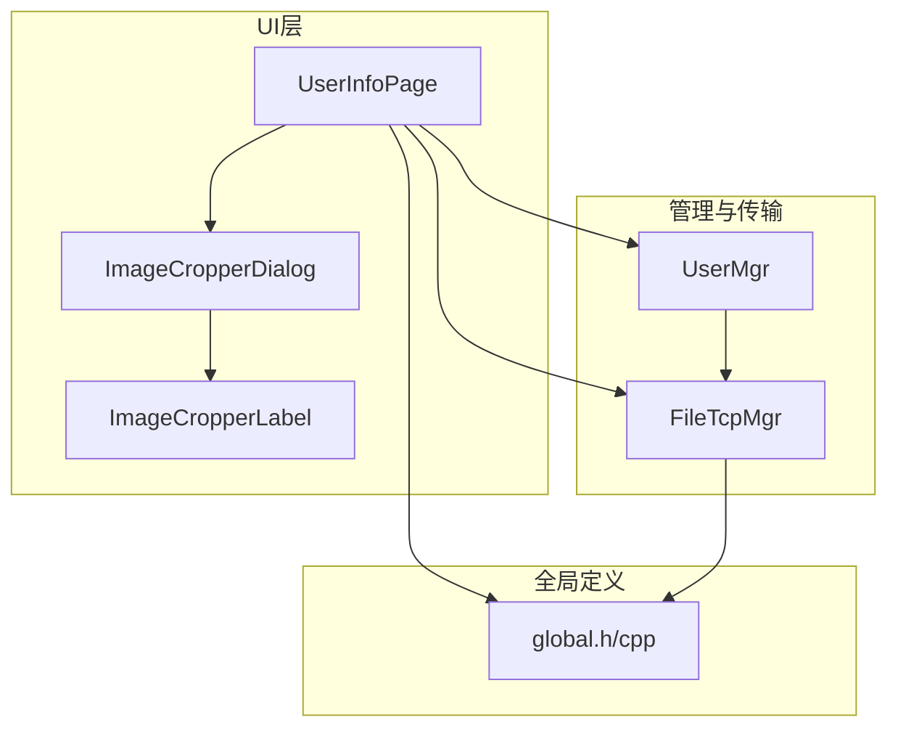
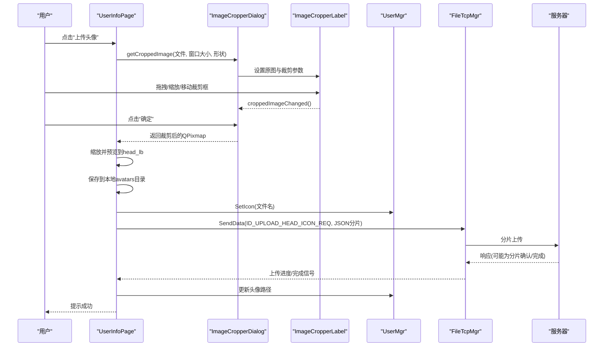
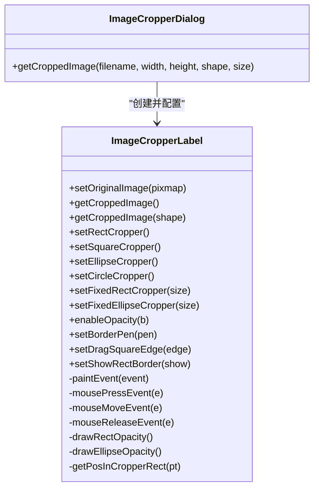
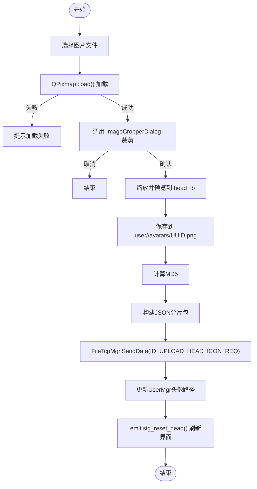
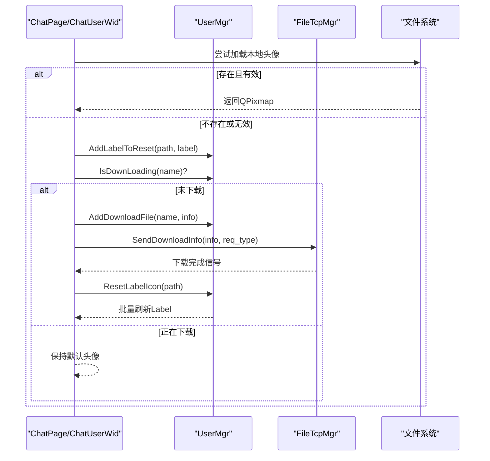
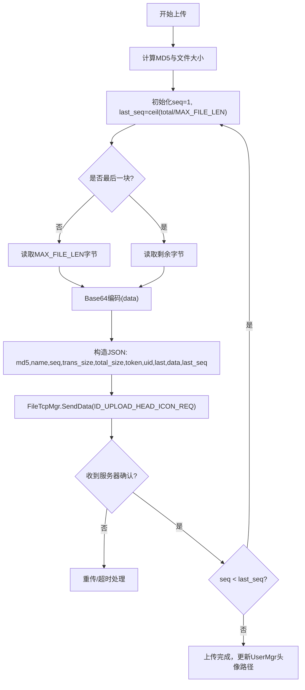
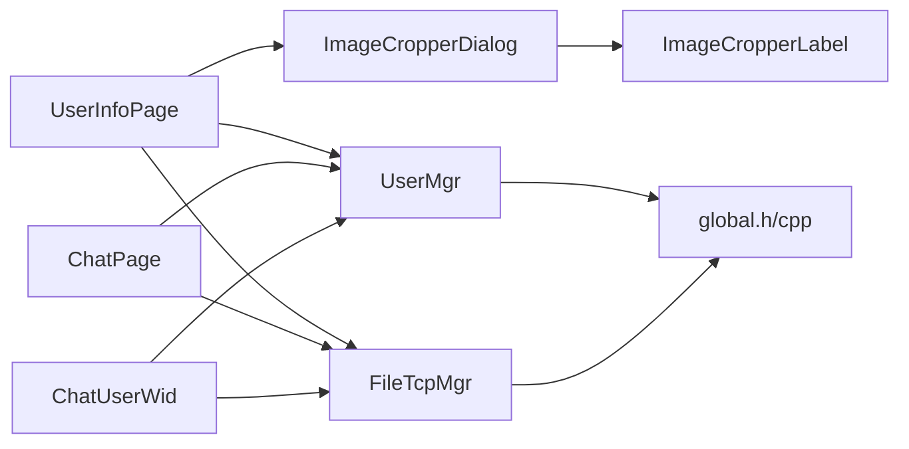

# 头像管理

<cite>
**本文引用的文件**   
- [imagecropperlabel.h](file://client/llfcchat/include/imagecropperlabel.h)
- [imagecropperlabel.cpp](file://client/llfcchat/src/imagecropperlabel.cpp)
- [imagecropperdialog.h](file://client/llfcchat/include/imagecropperdialog.h)
- [userinfopage.cpp](file://client/llfcchat/src/userinfopage.cpp)
- [global.h](file://client/llfcchat/include/global.h)
- [global.cpp](file://client/llfcchat/src/global.cpp)
- [usermgr.h](file://client/llfcchat/include/usermgr.h)
- [usermgr.cpp](file://client/llfcchat/src/usermgr.cpp)
- [filetcpmgr.h](file://client/llfcchat/include/filetcpmgr.h)
- [chatpage.cpp](file://client/llfcchat/src/chatpage.cpp)
- [chatuserwid.cpp](file://client/llfcchat/src/chatuserwid.cpp)
</cite>

## 目录
1. [简介](#简介)
2. [项目结构](#项目结构)
3. [核心组件](#核心组件)
4. [架构总览](#架构总览)
5. [详细组件分析](#详细组件分析)
6. [依赖关系分析](#依赖关系分析)
7. [性能考虑](#性能考虑)
8. [故障排查指南](#故障排查指南)
9. [结论](#结论)
10. [附录：API与配置](#附录api与配置)

## 简介
本技术文档围绕 LLFCChat 客户端的头像管理功能，系统阐述头像上传、裁剪、预览、本地存储、网络传输与缓存同步等完整流程。重点解析 ImageCropperDialog/ImageCropperLabel 对话框与裁剪实现、图片格式转换策略、断点续传与批量更新机制、错误处理与用户体验优化方案，并提供面向开发者的集成示例与最佳实践。

## 项目结构
头像相关能力主要分布在客户端 UI 层（用户信息页）、图像裁剪组件、用户状态与文件传输管理器以及全局常量定义中：
- 图像裁剪：ImageCropperLabel（交互与绘制）+ ImageCropperDialog（模态对话框封装）
- 用户界面：UserInfoPage（选择图片、调用裁剪、保存与触发上传）
- 数据与传输：UserMgr（头像路径与下载队列）、FileTcpMgr（TCP 分片上传/下载）
- 全局常量：ReqId、MsgInfo、DownloadInfo、MAX_FILE_LEN 等

图表来源 
- [imagecropperdialog.h](file://client/llfcchat/include/imagecropperdialog.h)
- [imagecropperlabel.h](file://client/llfcchat/include/imagecropperlabel.h)
- [userinfopage.cpp](file://client/llfcchat/src/userinfopage.cpp)
- [usermgr.h](file://client/llfcchat/include/usermgr.h)
- [filetcpmgr.h](file://client/llfcchat/include/filetcpmgr.h)
- [global.h](file://client/llfcchat/include/global.h)

章节来源
- [imagecropperlabel.h:1-167](file://client/llfcchat/include/imagecropperlabel.h#L1-L167)
- [imagecropperdialog.h:1-100](file://client/llfcchat/include/imagecropperdialog.h#L1-L100)
- [userinfopage.cpp:127-270](file://client/llfcchat/src/userinfopage.cpp#L127-L270)
- [global.h:43-88](file://client/llfcchat/include/global.h#L43-L88)

## 核心组件
- ImageCropperLabel：自定义 QLabel，支持矩形/椭圆/圆形/固定尺寸等多种裁剪形状，提供拖拽缩放、移动、透明度遮罩、最小尺寸限制、输出形状（矩形或椭圆）等能力。
- ImageCropperDialog：模态对话框封装，负责加载原图、创建裁剪控件、用户确认/取消后返回裁剪结果 QPixmap。
- UserInfoPage：头像上传入口，包含选择图片、调用裁剪、缩放预览、本地保存、计算 MD5、构造上传包并发送。
- UserMgr：维护当前用户头像路径、下载任务去重与批量刷新 Label 图标、上传/下载文件元信息映射。
- FileTcpMgr：基于 TCP 的分片上传/下载，支持断点续传、拥塞窗口控制、进度回调与完成通知。
- global.h/cpp：定义 ReqId（含 ID_UPLOAD_HEAD_ICON_REQ/RSP）、MsgInfo、DownloadInfo、MAX_FILE_LEN、唯一文件名生成与哈希计算工具。

章节来源
- [imagecropperlabel.cpp:1-715](file://client/llfcchat/src/imagecropperlabel.cpp#L1-L715)
- [imagecropperdialog.h:1-100](file://client/llfcchat/include/imagecropperdialog.h#L1-L100)
- [userinfopage.cpp:127-270](file://client/llfcchat/src/userinfopage.cpp#L127-L270)
- [usermgr.cpp:369-566](file://client/llfcchat/src/usermgr.cpp#L369-L566)
- [filetcpmgr.h:1-85](file://client/llfcchat/include/filetcpmgr.h#L1-L85)
- [global.h:15-25](file://client/llfcchat/include/global.h#L15-L25)
- [global.cpp:41-63](file://client/llfcchat/src/global.cpp#L41-L63)

## 架构总览
头像管理的端到端流程如下：
- 用户在 UserInfoPage 中选择图片，调用 ImageCropperDialog 进行裁剪；
- 裁剪完成后缩放至目标尺寸，保存到本地 avatars 目录（按用户 UID 隔离），生成唯一文件名；
- 计算文件 MD5，构造 JSON 分片消息（含 md5、name、seq、trans_size、total_size、token、uid、last、data、last_seq），通过 FileTcpMgr 以 ID_UPLOAD_HEAD_ICON_REQ 发送；
- 服务端处理后回发 ID_UPLOAD_HEAD_ICON_RSP，客户端更新 UserMgr 中的头像路径；
- 其他界面（聊天列表、侧边栏、好友列表）根据头像路径优先读取本地文件，若缺失则发起下载请求并通过 UserMgr 批量刷新对应 Label。

图表来源 
- [userinfopage.cpp:127-270](file://client/llfcchat/src/userinfopage.cpp#L127-L270)
- [imagecropperdialog.h:1-100](file://client/llfcchat/include/imagecropperdialog.h#L1-L100)
- [imagecropperlabel.cpp:154-181](file://client/llfcchat/src/imagecropperlabel.cpp#L154-L181)
- [global.h:70-71](file://client/llfcchat/include/global.h#L70-L71)
- [filetcpmgr.h:33-38](file://client/llfcchat/include/filetcpmgr.h#L33-L38)

## 详细组件分析

### 图像裁剪组件（ImageCropperLabel / ImageCropperDialog）
- 设计模式
  - ImageCropperLabel 继承自 QLabel，采用事件驱动（鼠标按下/移动/释放）与绘制回调（paintEvent）实现交互与渲染。
  - ImageCropperDialog 使用私有类 ImageCropperDialogPrivate 封装 QDialog，通过 exec() 阻塞等待用户操作，再以引用方式返回裁剪结果。
- 裁剪算法与交互
  - 支持多种 CropperShape：矩形、正方形、椭圆、圆形、固定矩形、固定椭圆。
  - 支持 OutputShape：矩形或椭圆（通过 mask 生成椭圆透明区域）。
  - 拖动与缩放：根据鼠标位置判断处于裁剪框内部、边缘或角点，结合最小尺寸约束与边界检查进行移动/缩放。
  - 透明度遮罩：对非裁剪区域填充半透明黑色，突出选中区域。
  - 输出图像：根据 scaledRate 将屏幕坐标换算为原图像素坐标，调用 originalImage.copy(...) 获取裁剪区域，再按输出形状应用 mask。
- 性能与体验
  - 使用平滑缩放 Qt::SmoothTransformation 与 KeepAspectRatio 保证显示质量。
  - 仅对可见区域绘制遮罩与边框，减少不必要的重绘开销。
  - 可配置最小拖拽方块尺寸与边框样式，提升易用性。

图表来源 
- [imagecropperlabel.h:38-164](file://client/llfcchat/include/imagecropperlabel.h#L38-L164)
- [imagecropperdialog.h:74-95](file://client/llfcchat/include/imagecropperdialog.h#L74-L95)

章节来源
- [imagecropperlabel.cpp:154-181](file://client/llfcchat/src/imagecropperlabel.cpp#L154-L181)
- [imagecropperlabel.cpp:184-222](file://client/llfcchat/src/imagecropperlabel.cpp#L184-L222)
- [imagecropperlabel.cpp:426-713](file://client/llfcchat/src/imagecropperlabel.cpp#L426-L713)
- [imagecropperdialog.h:21-66](file://client/llfcchat/include/imagecropperdialog.h#L21-L66)

### 头像上传与本地存储（UserInfoPage）
- 选择图片：支持 PNG/JPG/JPEG/BMP/WebP（依赖 Qt WebP 插件）。
- 调用裁剪：使用 ImageCropperDialog 弹出圆形裁剪框，用户确认后得到 QPixmap。
- 预览与缩放：将裁剪结果缩放到 head_lb 尺寸并保持比例，启用 setScaledContents(true)。
- 本地存储：在 AppDataLocation 下按用户 UID 建立 user/<uid>/avatars 目录，生成唯一文件名（UUID.png），保存为 PNG 无损格式。
- 上传准备：计算文件 MD5，构造分片 JSON（md5、name、seq、trans_size、total_size、token、uid、last、data、last_seq），通过 FileTcpMgr 发送 ID_UPLOAD_HEAD_ICON_REQ。
- 状态更新：上传成功后更新 UserMgr 中的头像路径，并触发界面刷新信号。

图表来源 
- [userinfopage.cpp:127-270](file://client/llfcchat/src/userinfopage.cpp#L127-L270)
- [global.cpp:41-44](file://client/llfcchat/src/global.cpp#L41-L44)

章节来源
- [userinfopage.cpp:127-270](file://client/llfcchat/src/userinfopage.cpp#L127-L270)
- [global.cpp:41-63](file://client/llfcchat/src/global.cpp#L41-L63)

### 头像下载与缓存同步（UserMgr / ChatPage / ChatUserWid）
- 加载策略：优先从本地 avatars 目录读取，若不存在或加载失败，则进入下载流程。
- 下载去重：UserMgr 维护 _name_to_download_info，避免重复下载同一文件。
- 批量刷新：UserMgr 维护 _path_to_reset_labels，当某路径文件可用时，批量更新所有使用该路径的 QLabel。
- 默认占位：下载前显示默认头像（:/res/head_1.jpg），确保界面不空白。
- 下载触发：构造 DownloadInfo（name、current_size、seq、total_size、client_path），通过 FileTcpMgr.SendDownloadInfo(req_type) 发起请求。

图表来源 
- [chatpage.cpp:276-303](file://client/llfcchat/src/chatpage.cpp#L276-L303)
- [chatuserwid.cpp:80-107](file://client/llfcchat/src/chatuserwid.cpp#L80-L107)
- [usermgr.cpp:426-459](file://client/llfcchat/src/usermgr.cpp#L426-L459)

章节来源
- [chatpage.cpp:276-303](file://client/llfcchat/src/chatpage.cpp#L276-L303)
- [chatuserwid.cpp:80-107](file://client/llfcchat/src/chatuserwid.cpp#L80-L107)
- [usermgr.cpp:426-459](file://client/llfcchat/src/usermgr.cpp#L426-L459)

### 网络传输与断点续传（FileTcpMgr / global）
- 分片上传：按 MAX_FILE_LEN（32KB）切分文件，逐片发送 JSON（含 seq、trans_size、total_size、last、data、last_seq）。
- 拥塞控制：维护拥塞窗口 _cwnd_size，限制并发发送包数量。
- 进度与续传：通过 MsgInfo 记录 _seq、_max_seq、_rsp_seqs、_flighting_seqs、_last_confirmed_seq，支持暂停/恢复与断点续传。
- 下载同步：接收端按 seq 组装分片，校验 total_size 与 md5，完成后写入 client_path。

图表来源 
- [global.h:15-25](file://client/llfcchat/include/global.h#L15-L25)
- [global.h:167-199](file://client/llfcchat/include/global.h#L167-L199)
- [filetcpmgr.h:33-38](file://client/llfcchat/include/filetcpmgr.h#L33-L38)

章节来源
- [global.h:15-25](file://client/llfcchat/include/global.h#L15-L25)
- [global.h:167-199](file://client/llfcchat/include/global.h#L167-L199)
- [filetcpmgr.h:33-38](file://client/llfcchat/include/filetcpmgr.h#L33-L38)

## 依赖关系分析
- UI 层依赖裁剪组件与全局工具函数（唯一文件名、哈希计算）。
- 用户信息管理（UserMgr）集中管理头像路径、下载任务与批量刷新逻辑。
- 文件传输（FileTcpMgr）依赖全局常量与数据结构（ReqId、MsgInfo、DownloadInfo、MAX_FILE_LEN）。
- 各界面（ChatPage、ChatUserWid、UserInfoPage）统一通过 UserMgr 与 FileTcpMgr 协调头像加载与下载。

图表来源 
- [userinfopage.cpp:127-270](file://client/llfcchat/src/userinfopage.cpp#L127-L270)
- [chatpage.cpp:276-303](file://client/llfcchat/src/chatpage.cpp#L276-L303)
- [chatuserwid.cpp:80-107](file://client/llfcchat/src/chatuserwid.cpp#L80-L107)
- [global.h:43-88](file://client/llfcchat/include/global.h#L43-L88)

章节来源
- [userinfopage.cpp:127-270](file://client/llfcchat/src/userinfopage.cpp#L127-L270)
- [chatpage.cpp:276-303](file://client/llfcchat/src/chatpage.cpp#L276-L303)
- [chatuserwid.cpp:80-107](file://client/llfcchat/src/chatuserwid.cpp#L80-L107)
- [global.h:43-88](file://client/llfcchat/include/global.h#L43-L88)

## 性能考虑
- 图像缩放与渲染
  - 使用 KeepAspectRatio 与 SmoothTransformation 保证缩放质量，避免多次缩放导致的失真。
  - 仅在必要时重绘裁剪框与遮罩，减少 paintEvent 压力。
- 本地存储
  - 按用户 UID 隔离目录，避免冲突；PNG 无损保存，便于后续复用。
  - 首次加载失败时自动创建目录，提升鲁棒性。
- 网络传输
  - 分片大小 MAX_FILE_LEN=32KB，平衡内存占用与网络效率。
  - 拥塞窗口控制与序列确认机制降低丢包与重传成本。
  - Base64 编码可选，注意带宽与 CPU 开销权衡。
- 缓存与批量刷新
  - UserMgr 维护下载任务去重与 Label 批量刷新，避免重复请求与频繁 UI 更新。
  - 默认占位头像确保界面流畅。

[本节为通用指导，无需特定文件来源]

## 故障排查指南
- 图片加载失败
  - 现象：QPixmap::load() 失败，提示需部署 WebP 插件。
  - 排查：确认 Qt WebP 插件已安装并正确加载；检查文件路径与权限。
- 保存失败
  - 现象：PNG 保存失败。
  - 排查：检查 avatars 目录是否存在与可写权限；磁盘空间是否充足。
- 上传中断
  - 现象：分片上传未完成或卡住。
  - 排查：检查 FileTcpMgr 拥塞窗口与网络状态；确认服务器响应与 last_seq 计算是否正确。
- 头像未刷新
  - 现象：界面仍显示默认头像。
  - 排查：确认 UserMgr::ResetLabelIcon(path) 被调用；检查 _path_to_reset_labels 映射是否包含对应 Label。

章节来源
- [userinfopage.cpp:127-270](file://client/llfcchat/src/userinfopage.cpp#L127-L270)
- [usermgr.cpp:426-459](file://client/llfcchat/src/usermgr.cpp#L426-L459)

## 结论
LLFCChat 的头像管理模块通过清晰的职责划分与模块化设计，实现了从裁剪、预览、本地存储到网络上传与缓存同步的完整闭环。ImageCropperLabel/Dlg 提供了灵活的裁剪体验，UserMgr 与 FileTcpMgr 协同保障高效可靠的传输与缓存。建议在生产环境中进一步引入图片压缩与格式自适应（如 WebP），以提升带宽与存储效率。

[本节为总结性内容，无需特定文件来源]

## 附录：API与配置
- 上传接口标识
  - 请求 ID：ID_UPLOAD_HEAD_ICON_REQ
  - 响应 ID：ID_UPLOAD_HEAD_ICON_RSP
- 上传数据包字段
  - md5：文件 MD5
  - name：文件名（UUID.png）
  - seq：分片序号
  - trans_size：累计传输字节数
  - total_size：文件总大小
  - token：鉴权令牌
  - uid：用户 ID
  - last：是否最后一块
  - data：Base64 编码的分片数据
  - last_seq：最后一个分片序号
- 下载数据结构
  - DownloadInfo：name、total_size、current_size、seq、client_path
- 全局常量
  - MAX_FILE_LEN：32KB
  - MAX_CWND_SIZE：拥塞窗口上限
  - heads：默认头像资源路径集合

章节来源
- [global.h:70-71](file://client/llfcchat/include/global.h#L70-L71)
- [global.h:15-25](file://client/llfcchat/include/global.h#L15-L25)
- [global.h:284-290](file://client/llfcchat/include/global.h#L284-L290)
- [global.h:236-242](file://client/llfcchat/include/global.h#L236-L242)