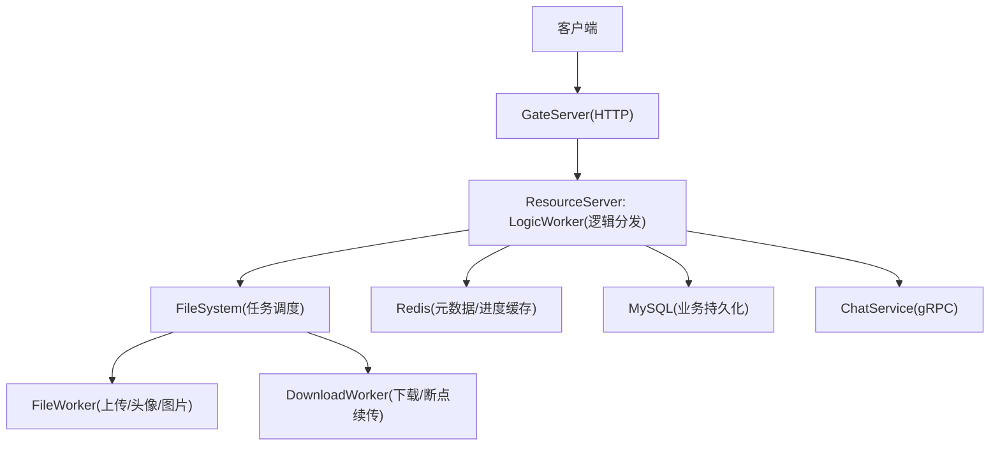
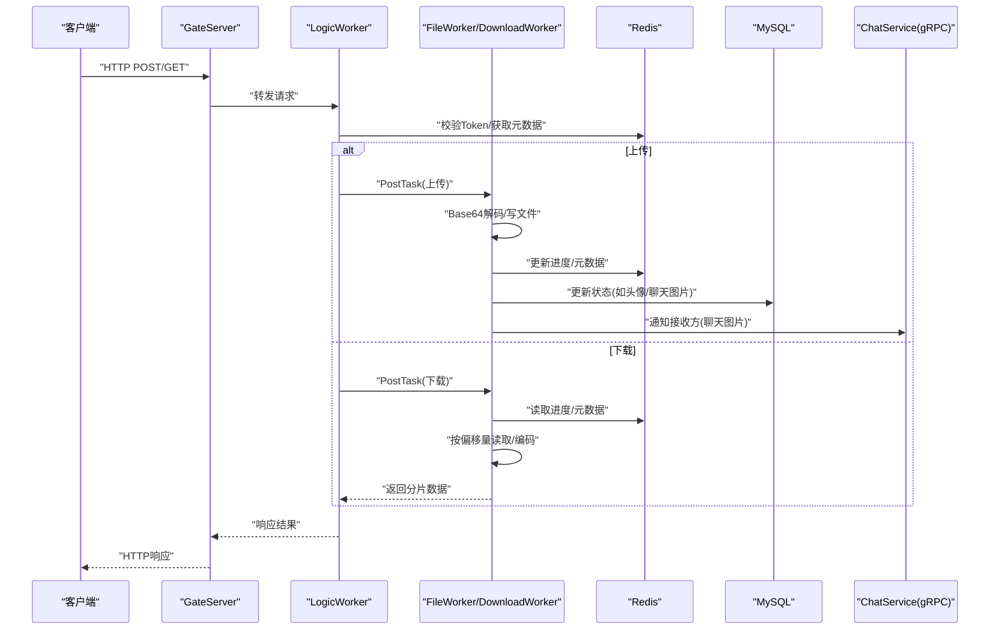
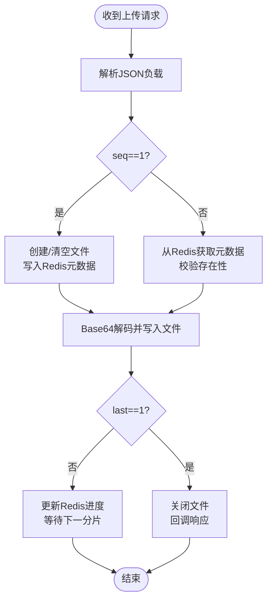
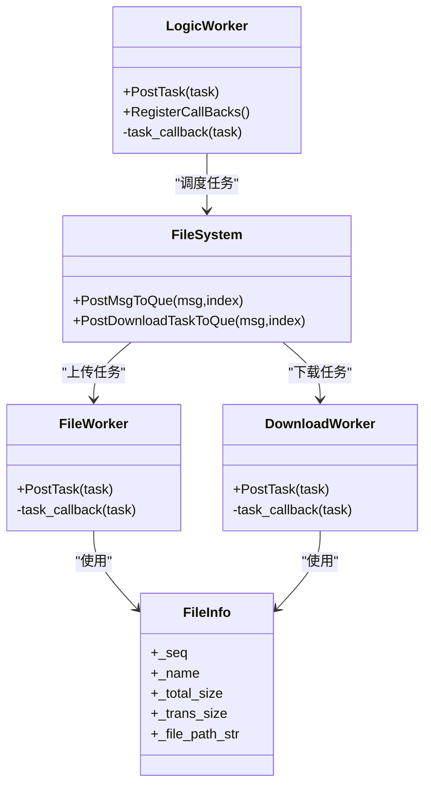

# 存储API接口

<cite>
**本文引用的文件**
- [server/proto/resource/message.proto](file://server/proto/resource/message.proto)
- [server/ResourceServer/include/FileInfo.h](file://server/ResourceServer/include/FileInfo.h)
- [server/ResourceServer/include/FileWorker.h](file://server/ResourceServer/include/FileWorker.h)
- [server/ResourceServer/include/FileSystem.h](file://server/ResourceServer/include/FileSystem.h)
- [server/ResourceServer/include/LogicWorker.h](file://server/ResourceServer/include/LogicWorker.h)
- [server/ResourceServer/include/const.h](file://server/ResourceServer/include/const.h)
- [server/ResourceServer/src/FileWorker.cpp](file://server/ResourceServer/src/FileWorker.cpp)
- [server/ResourceServer/src/LogicWorker.cpp](file://server/ResourceServer/src/LogicWorker.cpp)
- [server/ResourceServer/src/FileSystem.cpp](file://server/ResourceServer/src/FileSystem.cpp)
- [server/GateServer/include/HttpConnection.h](file://server/GateServer/include/HttpConnection.h)
- [server/GateServer/src/HttpConnection.cpp](file://server/GateServer/src/HttpConnection.cpp)
</cite>

## 目录
1. [简介](#简介)
2. [项目结构](#项目结构)
3. [核心组件](#核心组件)
4. [架构总览](#架构总览)
5. [详细组件分析](#详细组件分析)
6. [依赖分析](#依赖分析)
7. [性能考虑](#性能考虑)
8. [故障排查指南](#故障排查指南)
9. [结论](#结论)
10. [附录](#附录)

## 简介
本文件为LLFCChat存储API接口的全面文档，覆盖以下能力：
- HTTP协议规范（GateServer）与gRPC服务定义（ResourceServer、StatusServer等）
- 文件上传、下载、删除、查询等核心接口的请求参数、响应结构与错误码约定
- 认证授权机制、权限控制、访问限制等安全策略
- 文件分片上传、断点续传、进度回调等高级功能的接口设计
- 完整的请求示例、响应示例、错误处理示例
- API版本管理、向后兼容性、迁移指南
- SDK集成指南、调试工具使用、性能测试方法

说明：
- 本项目中存储相关能力主要基于自定义二进制协议（消息ID+JSON负载）在ResourceServer实现；HTTP层在GateServer提供通用路由转发。
- gRPC用于跨服务通信（如状态服务、聊天服务），资源服务内部通过消息ID进行逻辑分发。

## 项目结构
- GateServer：HTTP接入层，解析GET/POST请求，统一转交至LogicSystem处理。
- ResourceServer：存储核心服务，包含逻辑分发（LogicWorker）、文件IO（FileWorker/DownloadWorker）、文件系统调度（FileSystem）。
- Proto定义：chat/status/resource三个命名空间的gRPC消息与服务。

图表来源
- [server/GateServer/src/HttpConnection.cpp:132-194](file://server/GateServer/src/HttpConnection.cpp#L132-L194)
- [server/ResourceServer/src/LogicWorker.cpp:58-753](file://server/ResourceServer/src/LogicWorker.cpp#L58-L753)
- [server/ResourceServer/src/FileSystem.cpp:19-28](file://server/ResourceServer/src/FileSystem.cpp#L19-L28)
- [server/ResourceServer/src/FileWorker.cpp:49-458](file://server/ResourceServer/src/FileWorker.cpp#L49-L458)

章节来源
- [server/GateServer/include/HttpConnection.h:1-36](file://server/GateServer/include/HttpConnection.h#L1-L36)
- [server/GateServer/src/HttpConnection.cpp:1-225](file://server/GateServer/src/HttpConnection.cpp#L1-L225)
- [server/ResourceServer/include/LogicWorker.h:1-38](file://server/ResourceServer/include/LogicWorker.h#L1-L38)
- [server/ResourceServer/include/FileSystem.h:1-21](file://server/ResourceServer/include/FileSystem.h#L1-L21)
- [server/ResourceServer/include/FileWorker.h:1-90](file://server/ResourceServer/include/FileWorker.h#L1-L90)

## 核心组件
- 消息ID与错误码
  - 消息ID：用于二进制协议的消息路由，涵盖上传、下载、头像、聊天图片、信息同步等。
  - 错误码：统一的错误码枚举，涵盖JSON解析、RPC失败、Token无效、文件读写、Redis读取等。
- 工作线程模型
  - LogicWorker：接收并分发逻辑任务，注册各消息ID的回调处理器。
  - FileWorker：处理上传类任务（普通文件、头像、聊天图片、信息同步、续传）。
  - DownloadWorker：处理下载类任务（支持断点续传、进度更新、完成清理）。
- 文件系统调度
  - FileSystem：维护多个FileWorker与DownloadWorker实例，按哈希选择具体worker执行。

章节来源
- [server/ResourceServer/include/const.h:5-117](file://server/ResourceServer/include/const.h#L5-L117)
- [server/ResourceServer/include/LogicWorker.h:1-38](file://server/ResourceServer/include/LogicWorker.h#L1-L38)
- [server/ResourceServer/include/FileWorker.h:1-90](file://server/ResourceServer/include/FileWorker.h#L1-L90)
- [server/ResourceServer/include/FileSystem.h:1-21](file://server/ResourceServer/include/FileSystem.h#L1-L21)

## 架构总览
- 接入层：GateServer负责HTTP请求解析与路由转发。
- 逻辑层：LogicWorker根据消息ID将请求分发到对应处理器，校验token、构造路径、落盘或读取。
- IO层：FileWorker/DownloadWorker负责文件读写、Base64编解码、Redis元数据与进度管理。
- 外部依赖：Redis用于会话、令牌、文件元数据与下载进度；MySQL用于用户信息与聊天消息；gRPC用于跨服务通知（如聊天图片上传完成后通知接收方）。

图表来源
- [server/GateServer/src/HttpConnection.cpp:132-194](file://server/GateServer/src/HttpConnection.cpp#L132-L194)
- [server/ResourceServer/src/LogicWorker.cpp:78-372](file://server/ResourceServer/src/LogicWorker.cpp#L78-L372)
- [server/ResourceServer/src/FileWorker.cpp:49-458](file://server/ResourceServer/src/FileWorker.cpp#L49-L458)

## 详细组件分析

### 文件上传接口（普通文件）
- 协议：自定义二进制协议（消息ID=ID_UPLOAD_FILE_REQ/ID_UPLOAD_FILE_RSP）
- 请求字段（JSON负载）
  - md5: 文件标识
  - seq: 分片序号（从1开始）
  - name: 文件名
  - total_size: 总大小
  - trans_size: 已传输大小
  - last: 是否最后一个分片
  - data: Base64编码的分片数据
  - uid: 用户ID
- 响应字段（JSON负载）
  - error: 错误码
  - total_size/name/seq/trans_size/last/md5/uid: 回显字段
- 行为要点
  - 首包(seq==1)时创建或清空目标文件，后续分片追加写入
  - 路径由配置项GetFileOutPath与uid/name拼接生成
  - 首包时将文件元信息写入Redis，后续分片更新进度
  - 最后分片写入后回调上层，返回成功

图表来源
- [server/ResourceServer/src/LogicWorker.cpp:78-162](file://server/ResourceServer/src/LogicWorker.cpp#L78-L162)
- [server/ResourceServer/src/FileWorker.cpp:51-112](file://server/ResourceServer/src/FileWorker.cpp#L51-L112)

章节来源
- [server/ResourceServer/include/const.h:72-95](file://server/ResourceServer/include/const.h#L72-L95)
- [server/ResourceServer/src/LogicWorker.cpp:78-162](file://server/ResourceServer/src/LogicWorker.cpp#L78-L162)
- [server/ResourceServer/src/FileWorker.cpp:51-112](file://server/ResourceServer/src/FileWorker.cpp#L51-L112)

### 头像上传接口
- 协议：消息ID=ID_UPLOAD_HEAD_ICON_REQ/ID_UPLOAD_HEAD_ICON_RSP
- 请求字段
  - md5/seq/name/total_size/trans_size/last/data/uid/token/last_seq
- 响应字段
  - error/total_size/seq/name/trans_size/last/md5/uid/last_seq
- 安全校验
  - 首包校验token是否与Redis中该uid对应的token一致
- 行为要点
  - 首包创建文件，后续追加写入
  - 最后分片写入后更新数据库头像路径，并将用户信息写入Redis缓存

章节来源
- [server/ResourceServer/src/LogicWorker.cpp:197-309](file://server/ResourceServer/src/LogicWorker.cpp#L197-L309)
- [server/ResourceServer/src/FileWorker.cpp:115-196](file://server/ResourceServer/src/FileWorker.cpp#L115-L196)

### 聊天图片上传接口
- 协议：消息ID=ID_IMG_CHAT_UPLOAD_REQ/ID_IMG_CHAT_UPLOAD_RSP
- 请求字段
  - md5/seq/name/total_size(trans_size)/last/data/uid/sender/receiver/message_id
- 响应字段
  - error/total_size/seq/name/trans_size/last/md5/uid/sender/receiver
- 行为要点
  - 首包创建文件，后续追加写入
  - 最后分片写入后更新数据库上传状态
  - 若接收者在线（Redis中存在IP映射），通过gRPC通知ChatServer推送图片消息

章节来源
- [server/ResourceServer/src/LogicWorker.cpp:374-464](file://server/ResourceServer/src/LogicWorker.cpp#L374-L464)
- [server/ResourceServer/src/FileWorker.cpp:199-283](file://server/ResourceServer/src/FileWorker.cpp#L199-L283)
- [server/proto/resource/message.proto:138-165](file://server/proto/resource/message.proto#L138-L165)

### 文件信息同步接口
- 协议：消息ID=ID_FILE_INFO_SYNC_REQ/ID_FILE_INFO_SYNC_RSP
- 用途：用于特定场景的文件信息同步（例如聊天图片资源的同步流程）
- 请求字段
  - md5/seq/name/total_size/trans_size/last/data/uid/message_id/sender/receiver
- 响应字段
  - error/seq/name/last/md5/uid/sender/receiver
- 行为要点
  - 首包创建文件，后续追加写入
  - 最后分片写入后更新数据库状态并通知接收方（同聊天图片上传）

章节来源
- [server/ResourceServer/src/LogicWorker.cpp:467-555](file://server/ResourceServer/src/LogicWorker.cpp#L467-L555)
- [server/ResourceServer/src/FileWorker.cpp:286-369](file://server/ResourceServer/src/FileWorker.cpp#L286-L369)

### 聊天图片续传接口
- 协议：消息ID=ID_IMG_CHAT_CONTINUE_UPLOAD_REQ/ID_IMG_CHAT_CONTINUE_UPLOAD_RSP
- 用途：断点续传聊天图片资源
- 请求字段
  - md5/seq/name/total_size/trans_size/last/data/uid/message_id/sender/receiver
- 响应字段
  - error/total_size/seq/name/trans_size/last/md5/uid/sender/receiver
- 行为要点
  - 首包创建文件，后续追加写入
  - 最后分片写入后更新数据库状态并通知接收方

章节来源
- [server/ResourceServer/src/LogicWorker.cpp:559-647](file://server/ResourceServer/src/LogicWorker.cpp#L559-L647)
- [server/ResourceServer/src/FileWorker.cpp:372-456](file://server/ResourceServer/src/FileWorker.cpp#L372-L456)

### 聊天图片下载信息同步接口
- 协议：消息ID=ID_IMG_CHAT_DOWN_INFO_SYNC_REQ/ID_IMG_CHAT_DOWN_INFO_SYNC_RSP
- 用途：获取聊天图片下载的元数据（文件大小、路径、消息信息等）
- 请求字段
  - message_id
- 响应字段
  - error/message_id/thread_id/sender_id/recv_id/name/msg_type/status/total_size
- 行为要点
  - 根据message_id查询MySQL获取聊天消息
  - 计算资源文件路径并获取文件大小

章节来源
- [server/ResourceServer/src/LogicWorker.cpp:649-682](file://server/ResourceServer/src/LogicWorker.cpp#L649-L682)

### 聊天图片下载接口（断点续传）
- 协议：消息ID=ID_IMG_CHAT_DOWN_REQ/ID_IMG_CHAT_DOWN_RSP
- 请求字段
  - seq/name/total_size/trans_size/file_path(message_id)/sender_id/receiver_id/token/uid
- 响应字段
  - error/name/sender_id/receiver_id
- 行为要点
  - 首包校验token
  - 首次下载：创建FileInfo并写入Redis，记录total_size、trans_size、seq
  - 续传下载：从Redis读取历史进度，校验seq与offset合法性
  - 每次读取MAX_FILE_LEN字节，Base64编码后返回，并更新is_last、current_size
  - 下载完成：删除Redis中的下载进度

章节来源
- [server/ResourceServer/src/LogicWorker.cpp:684-751](file://server/ResourceServer/src/LogicWorker.cpp#L684-L751)
- [server/ResourceServer/src/FileWorker.cpp:528-662](file://server/ResourceServer/src/FileWorker.cpp#L528-L662)
- [server/ResourceServer/include/FileInfo.h:1-26](file://server/ResourceServer/include/FileInfo.h#L1-L26)

### 通用文件下载接口
- 协议：消息ID=ID_DOWN_LOAD_FILE_REQ/ID_DOWN_LOAD_FILE_RSP
- 请求字段
  - seq/name/uid/token/client_path/req_type
- 响应字段
  - client_path/name/req_type/error
- 行为要点
  - 首包校验token
  - 按seq分片读取文件，Base64编码返回，支持断点续传

章节来源
- [server/ResourceServer/src/LogicWorker.cpp:311-372](file://server/ResourceServer/src/LogicWorker.cpp#L311-L372)
- [server/ResourceServer/src/FileWorker.cpp:528-662](file://server/ResourceServer/src/FileWorker.cpp#L528-L662)

### HTTP接口规范（GateServer）
- 路由处理
  - GET：解析URL与查询参数，调用LogicSystem::HandleGet
  - POST：解析target路径，调用LogicSystem::HandlePost
- 超时与跨域
  - 连接超时60秒
  - 允许所有来源（生产环境建议限制）
- 错误处理
  - 未找到路由返回404与“url not found”

章节来源
- [server/GateServer/include/HttpConnection.h:1-36](file://server/GateServer/include/HttpConnection.h#L1-L36)
- [server/GateServer/src/HttpConnection.cpp:96-194](file://server/GateServer/src/HttpConnection.cpp#L96-L194)

### gRPC服务定义（resource命名空间）
- StatusService
  - GetChatServer：获取聊天服务器地址与token
  - Login：用户登录获取token
- ChatService
  - NotifyAddFriend/RplyAddFriend/SendChatMsg/NotifyAuthFriend/NotifyTextChatMsg/KickUser
  - NotifyChatImgMsg：通知聊天图片消息（含from_uid/to_uid/message_id/file_name/total_size/thread_id）

章节来源
- [server/proto/resource/message.proto:1-169](file://server/proto/resource/message.proto#L1-L169)

## 依赖分析
- 组件耦合
  - LogicWorker依赖RedisMgr/MysqlMgr/ConfigMgr/ChatServerGrpcClient
  - FileWorker/DownloadWorker依赖base64、boost::filesystem、RedisMgr
  - FileSystem聚合多个FileWorker/DownloadWorker实例，按哈希分配任务
- 外部依赖
  - Redis：用户会话、Token、文件元数据、下载进度
  - MySQL：用户信息、聊天消息
  - gRPC：跨服务通知（聊天图片）

图表来源
- [server/ResourceServer/include/LogicWorker.h:1-38](file://server/ResourceServer/include/LogicWorker.h#L1-L38)
- [server/ResourceServer/include/FileWorker.h:1-90](file://server/ResourceServer/include/FileWorker.h#L1-L90)
- [server/ResourceServer/include/FileSystem.h:1-21](file://server/ResourceServer/include/FileSystem.h#L1-L21)
- [server/ResourceServer/include/FileInfo.h:1-26](file://server/ResourceServer/include/FileInfo.h#L1-L26)

章节来源
- [server/ResourceServer/src/FileSystem.cpp:1-29](file://server/ResourceServer/src/FileSystem.cpp#L1-L29)
- [server/ResourceServer/src/LogicWorker.cpp:1-765](file://server/ResourceServer/src/LogicWorker.cpp#L1-L765)
- [server/ResourceServer/src/FileWorker.cpp:1-663](file://server/ResourceServer/src/FileWorker.cpp#L1-L663)

## 性能考虑
- 并发模型
  - LogicWorker/FileWorker/DownloadWorker均使用独立工作线程与队列，避免阻塞I/O
  - FileSystem按名称哈希选择worker，提升并行度与负载均衡
- I/O优化
  - 分片大小MAX_FILE_LEN固定，减少内存占用与网络抖动影响
  - Base64编解码仅在必要环节进行，降低CPU开销
- 缓存与持久化
  - Redis用于元数据与进度缓存，降低磁盘与DB压力
  - MySQL仅用于关键业务状态（如头像路径、聊天消息）
- 建议
  - 合理调整FILE_WORKER_COUNT/DOWN_LOAD_WORKER_COUNT以匹配硬件资源
  - 监控Redis命中率与延迟，必要时增加副本或扩容
  - 对大文件下载启用多连接分片并行（客户端侧）

[本节为通用指导，不直接分析具体文件]

## 故障排查指南
- 常见错误码
  - TokenInvalid/UidInvalid：认证失败，检查Redis中token与uid映射
  - FileNotExists：文件不存在，检查路径与权限
  - FileWritePermissionFailed/FileReadPermissionFailed：权限问题，检查文件系统权限
  - FileSeqInvalid/FileOffsetInvalid：序列号或偏移异常，检查客户端seq与服务器进度一致性
  - RedisReadErr：Redis读取失败，检查Redis连通性与键是否存在
- 排查步骤
  - 确认请求消息ID与字段完整
  - 检查Redis中对应key（如utoken_{uid}、ubaseinfo_{uid}、下载进度key）
  - 查看日志输出（如“无法打开文件进行写入/读取”、“偏移量超出文件大小”）
  - 验证gRPC通知是否成功（聊天图片上传后接收方是否收到）

章节来源
- [server/ResourceServer/include/const.h:5-29](file://server/ResourceServer/include/const.h#L5-L29)
- [server/ResourceServer/src/FileWorker.cpp:528-662](file://server/ResourceServer/src/FileWorker.cpp#L528-L662)

## 结论
LLFCChat存储API以高内聚低耦合的工作线程模型为核心，结合Redis与MySQL实现高效可靠的文件上传与下载。通过消息ID路由与Base64分片传输，支持断点续传与进度回调。HTTP层提供统一接入，gRPC用于跨服务通知。建议在部署时关注并发参数、缓存命中率与权限配置，以确保稳定与高性能。

[本节为总结，不直接分析具体文件]

## 附录

### 接口规范与示例

- 文件上传（普通文件）
  - 请求（JSON负载）
    - md5, seq, name, total_size, trans_size, last, data, uid
  - 响应（JSON负载）
    - error, total_size, seq, name, trans_size, last, md5, uid
  - 示例
    - 请求：{ "md5":"abc", "seq":1, "name":"doc.pdf", "total_size":1000, "trans_size":0, "last":0, "data":"BASE64...", "uid":123 }
    - 响应：{ "error":0, "total_size":"1000", "seq":"1", "name":"doc.pdf", "trans_size":"0", "last":"0", "md5":"abc", "uid":"123" }

- 头像上传
  - 请求（JSON负载）
    - md5, seq, name, total_size, trans_size, last, data, uid, token, last_seq
  - 响应（JSON负载）
    - error, total_size, seq, name, trans_size, last, md5, uid, last_seq
  - 示例
    - 请求：{ "md5":"img1", "seq":1, "name":"avatar.png", "total_size":500, "trans_size":0, "last":1, "data":"BASE64...", "uid":456, "token":"TOKEN", "last_seq":1 }
    - 响应：{ "error":0, "total_size":"500", "seq":"1", "name":"avatar.png", "trans_size":"500", "last":"1", "md5":"img1", "uid":"456", "last_seq":"1" }

- 聊天图片上传
  - 请求（JSON负载）
    - md5, seq, name, total_size, trans_size, last, data, uid, sender, receiver, message_id
  - 响应（JSON负载）
    - error, total_size, seq, name, trans_size, last, md5, uid, sender, receiver
  - 示例
    - 请求：{ "md5":"pic1", "seq":1, "name":"photo.jpg", "total_size":2000, "trans_size":0, "last":1, "data":"BASE64...", "uid":789, "sender":100, "receiver":200, "message_id":5001 }
    - 响应：{ "error":0, "total_size":"2000", "seq":"1", "name":"photo.jpg", "trans_size":"2000", "last":"1", "md5":"pic1", "uid":"789", "sender":"100", "receiver":"200" }

- 聊天图片下载信息同步
  - 请求（JSON负载）
    - message_id
  - 响应（JSON负载）
    - error, message_id, thread_id, sender_id, recv_id, name, msg_type, status, total_size
  - 示例
    - 请求：{ "message_id":5001 }
    - 响应：{ "error":0, "message_id":"5001", "thread_id":"1", "sender_id":"100", "recv_id":"200", "name":"photo.jpg", "msg_type":"image", "status":"uploaded", "total_size":"2000" }

- 聊天图片下载（断点续传）
  - 请求（JSON负载）
    - seq, name, total_size, trans_size, file_path, sender_id, receiver_id, token, uid
  - 响应（JSON负载）
    - error, name, sender_id, receiver_id
  - 示例
    - 请求：{ "seq":1, "name":"photo.jpg", "total_size":"2000", "trans_size":"0", "file_path":"/path/photo.jpg", "sender_id":"100", "receiver_id":"200", "token":"TOKEN", "uid":"789" }
    - 响应：{ "error":0, "name":"photo.jpg", "sender_id":"100", "receiver_id":"200" }

- 通用文件下载
  - 请求（JSON负载）
    - seq, name, uid, token, client_path, req_type
  - 响应（JSON负载）
    - client_path, name, req_type, error
  - 示例
    - 请求：{ "seq":1, "name":"doc.pdf", "uid":123, "token":"TOKEN", "client_path":"/local/doc.pdf", "req_type":"download" }
    - 响应：{ "client_path":"/local/doc.pdf", "name":"doc.pdf", "req_type":"download", "error":0 }

- 错误处理示例
  - Token无效：{ "error":1010 }
  - 文件不存在：{ "error":1012 }
  - 权限不足：{ "error":1015 }
  - 序列号无效：{ "error":1017 }
  - 偏移量无效：{ "error":1018 }
  - Redis读取失败：{ "error":1020 }

### 安全策略与权限控制
- 认证授权
  - 使用Redis中utoken_{uid}存储用户token，首包校验token与uid一致性
  - 头像与下载接口要求携带token，防止越权访问
- 访问限制
  - GateServer设置CORS为*（生产环境应限制来源）
  - 连接超时60秒，防止资源泄露
- 建议
  - 引入HTTPS与签名校验
  - 限制上传文件大小与类型
  - 审计敏感操作（头像修改、下载记录）

章节来源
- [server/ResourceServer/src/LogicWorker.cpp:234-254](file://server/ResourceServer/src/LogicWorker.cpp#L234-L254)
- [server/GateServer/src/HttpConnection.cpp:138-140](file://server/GateServer/src/HttpConnection.cpp#L138-L140)

### API版本管理与迁移指南
- 版本管理
  - 当前未显式版本号，建议通过URL前缀或Header区分版本（如/v1/）
- 向后兼容
  - 新增字段需默认值，旧客户端忽略未知字段
  - 废弃字段保留一段时间并提供迁移提示
- 迁移指南
  - 逐步替换Redis键名与结构，保持双写过渡期
  - 客户端侧兼容新旧响应格式，优先使用新字段

[本节为通用指导，不直接分析具体文件]

### SDK集成指南
- 客户端实现要点
  - 建立与GateServer的HTTP连接，封装POST/GET请求
  - 构建JSON负载并按seq分片发送，处理last标志
  - 下载端维护seq与trans_size，实现断点续传
  - 校验error字段，处理错误码并重试
- 调试工具
  - 使用curl或Postman模拟请求，验证JSON负载与响应
  - 开启服务端日志，观察“无法打开文件”、“偏移量超出文件大小”等提示
- 性能测试
  - 使用多线程并发上传/下载，统计吞吐与延迟
  - 监控Redis命中率与MySQL慢查询

[本节为通用指导，不直接分析具体文件]