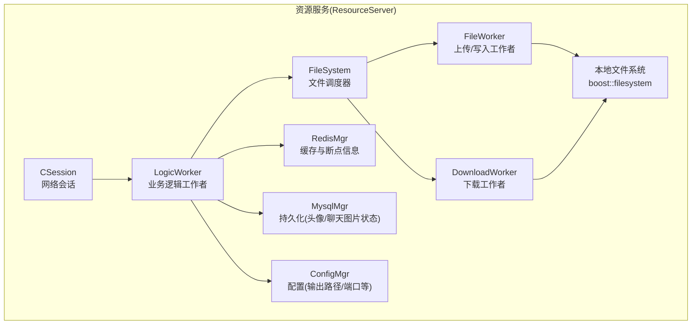
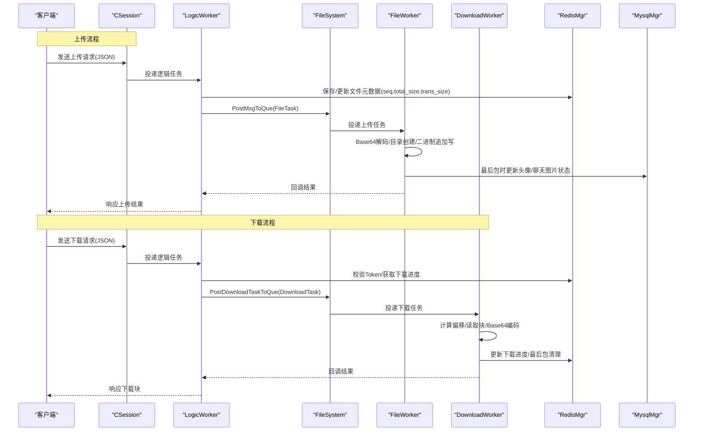
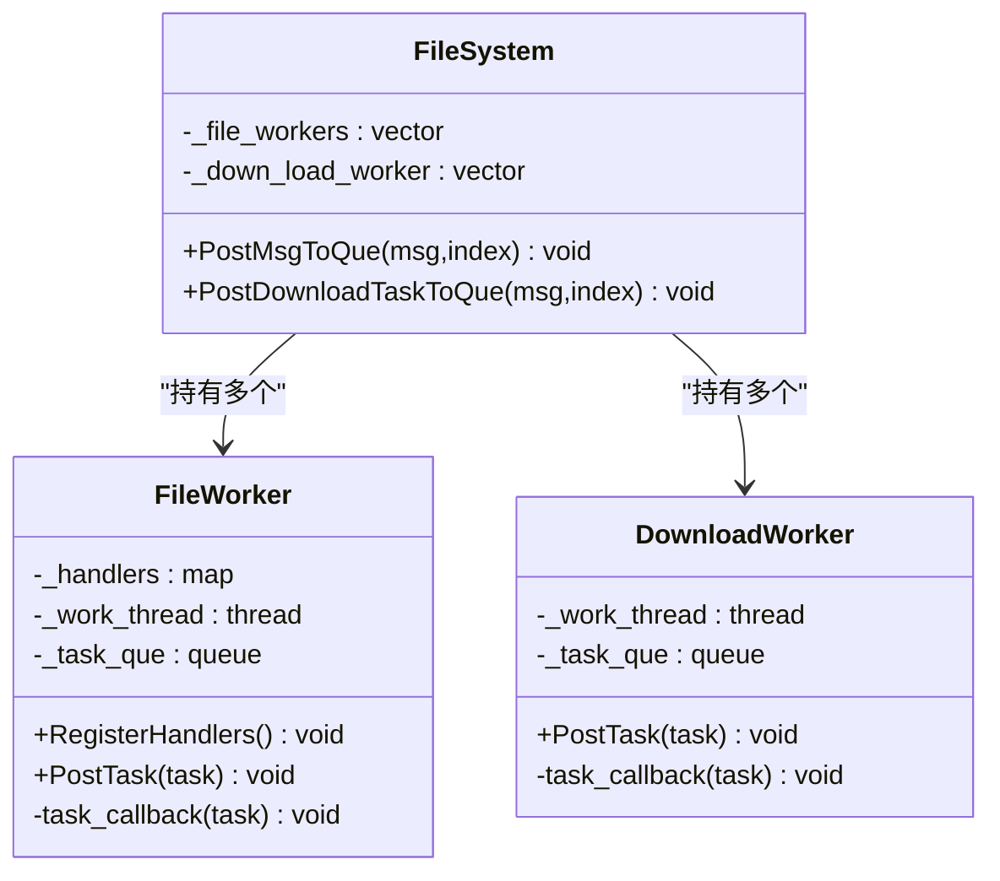
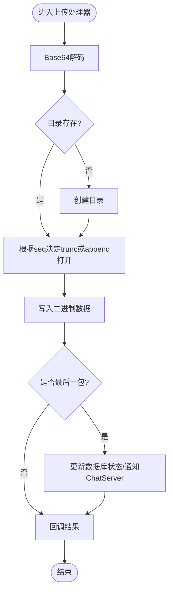
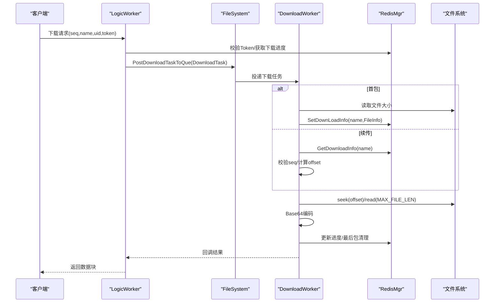
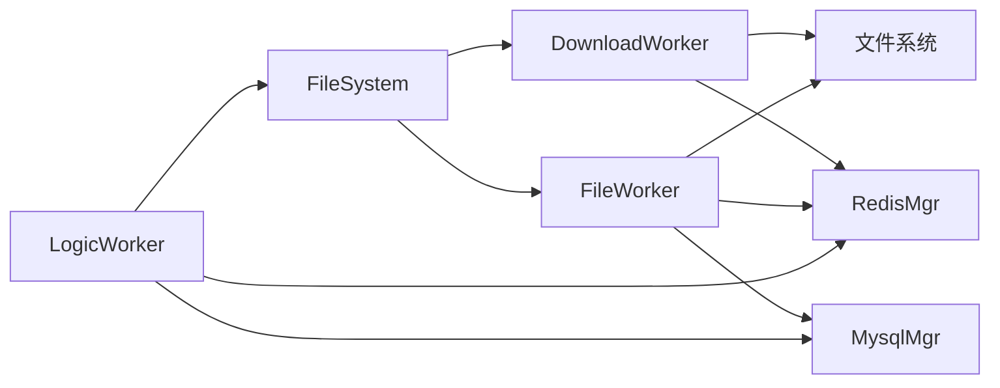

# 存储系统

<cite>
**本文引用的文件**   
- [FileSystem.h](file://server/ResourceServer/include/FileSystem.h)
- [FileSystem.cpp](file://server/ResourceServer/src/FileSystem.cpp)
- [FileWorker.h](file://server/ResourceServer/include/FileWorker.h)
- [FileWorker.cpp](file://server/ResourceServer/src/FileWorker.cpp)
- [FileInfo.h](file://server/ResourceServer/include/FileInfo.h)
- [LogicWorker.h](file://server/ResourceServer/include/LogicWorker.h)
- [LogicWorker.cpp](file://server/ResourceServer/src/LogicWorker.cpp)
- [LogicSystem.h](file://server/ResourceServer/include/LogicSystem.h)
- [MysqlMgr.h](file://server/ResourceServer/include/MysqlMgr.h)
- [RedisMgr.h](file://server/ResourceServer/include/RedisMgr.h)
- [CSession.h](file://server/ResourceServer/include/CSession.h)
- [const.h](file://server/ResourceServer/include/const.h)
- [config.ini](file://server/ResourceServer/config/config.ini)
</cite>

## 目录
1. [简介](#简介)
2. [项目结构](#项目结构)
3. [核心组件](#核心组件)
4. [架构总览](#架构总览)
5. [详细组件分析](#详细组件分析)
6. [依赖关系分析](#依赖关系分析)
7. [性能考量](#性能考量)
8. [故障排查指南](#故障排查指南)
9. [结论](#结论)
10. [附录](#附录)

## 简介
本技术文档围绕 ResourceServer 中的存储子系统，系统化阐述文件系统抽象层、文件元数据管理、存储路径规划、上传与下载流程、权限与安全控制、索引与查找机制、错误处理策略，以及面向企业级扩展的分布式与缓存集成方案。读者可据此理解 FileSystem 类对文件操作的封装、工作线程模型、断点续传实现、以及与 Redis/MySQL 的协同方式，并获取性能调优与故障定位的实践建议。

## 项目结构
ResourceServer 的存储相关代码集中在 include 与 src 两个目录：
- include: 定义核心接口与数据结构（如 FileSystem、FileWorker、DownloadWorker、FileInfo、LogicWorker、LogicSystem、MysqlMgr、RedisMgr、CSession、常量与消息ID等）
- src: 实现具体逻辑（任务分发、IO 读写、断点续传、回调与状态同步等）

图表来源 
- [CSession.h:1-64](file://server/ResourceServer/include/CSession.h#L1-L64)
- [LogicWorker.cpp:1-765](file://server/ResourceServer/src/LogicWorker.cpp#L1-L765)
- [FileSystem.cpp:1-29](file://server/ResourceServer/src/FileSystem.cpp#L1-L29)
- [FileWorker.cpp:1-663](file://server/ResourceServer/src/FileWorker.cpp#L1-L663)
- [RedisMgr.h:1-313](file://server/ResourceServer/include/RedisMgr.h#L1-L313)
- [MysqlMgr.h:1-44](file://server/ResourceServer/include/MysqlMgr.h#L1-L44)
- [config.ini:1-27](file://server/ResourceServer/config/config.ini#L1-L27)

章节来源
- [CSession.h:1-64](file://server/ResourceServer/include/CSession.h#L1-L64)
- [config.ini:1-27](file://server/ResourceServer/config/config.ini#L1-L27)

## 核心组件
- FileSystem：单例调度器，维护多组 FileWorker 与 DownloadWorker，按哈希分片将任务投递到对应工作者线程，实现并发与隔离。
- FileWorker：上传与写入工作者，基于消息 ID 路由处理器，完成 Base64 解码、目录创建、二进制追加写、最后包后回调与状态更新。
- DownloadWorker：下载工作者，支持断点续传，读取指定偏移块、Base64 编码返回，并在 Redis 中维护下载进度。
- FileInfo：文件元数据模型，包含序列号、文件名、总大小、已传输大小、文件路径等，用于上传/下载进度跟踪。
- LogicWorker：业务逻辑工作者，解析请求、校验 Token、计算目标路径、维护文件元数据（Redis），并将任务投递给 FileSystem。
- MysqlMgr：数据库访问封装，提供用户信息、聊天消息、头像与图片上传状态更新等能力。
- RedisMgr：连接池与缓存操作封装，提供键值存取、列表、哈希、分布式锁、文件元数据与下载进度存取。
- CSession：网络会话封装，负责异步收发、队列与锁保护，向上层暴露统一发送接口。

章节来源
- [FileSystem.h:1-21](file://server/ResourceServer/include/FileSystem.h#L1-L21)
- [FileSystem.cpp:1-29](file://server/ResourceServer/src/FileSystem.cpp#L1-L29)
- [FileWorker.h:1-90](file://server/ResourceServer/include/FileWorker.h#L1-L90)
- [FileWorker.cpp:1-663](file://server/ResourceServer/src/FileWorker.cpp#L1-L663)
- [FileInfo.h:1-26](file://server/ResourceServer/include/FileInfo.h#L1-L26)
- [LogicWorker.h:1-38](file://server/ResourceServer/include/LogicWorker.h#L1-L38)
- [LogicWorker.cpp:1-765](file://server/ResourceServer/src/LogicWorker.cpp#L1-L765)
- [MysqlMgr.h:1-44](file://server/ResourceServer/include/MysqlMgr.h#L1-L44)
- [RedisMgr.h:1-313](file://server/ResourceServer/include/RedisMgr.h#L1-L313)
- [CSession.h:1-64](file://server/ResourceServer/include/CSession.h#L1-L64)

## 架构总览
ResourceServer 采用“网络会话 -> 逻辑工作者 -> 文件调度器 -> IO工作者”的分层架构。请求进入后由 LogicWorker 解析与鉴权，再根据消息类型选择上传或下载路径；上传通过 FileWorker 落盘，下载通过 DownloadWorker 分块读取；中间态与进度通过 Redis 缓存，关键状态与用户信息通过 MySQL 持久化。

图表来源 
- [LogicWorker.cpp:78-162](file://server/ResourceServer/src/LogicWorker.cpp#L78-L162)
- [FileSystem.cpp:9-17](file://server/ResourceServer/src/FileSystem.cpp#L9-L17)
- [FileWorker.cpp:51-112](file://server/ResourceServer/src/FileWorker.cpp#L51-L112)
- [FileWorker.cpp:528-663](file://server/ResourceServer/src/FileWorker.cpp#L528-L663)
- [RedisMgr.h:303-311](file://server/ResourceServer/include/RedisMgr.h#L303-L311)
- [MysqlMgr.h:35-38](file://server/ResourceServer/include/MysqlMgr.h#L35-L38)

## 详细组件分析

### FileSystem 类：文件操作封装与并发调度
- 职责：维护 FileWorker 与 DownloadWorker 向量，按 index 分片投递任务，屏蔽底层线程细节。
- 设计要点：
  - 单例模式确保全局唯一实例。
  - 初始化时创建固定数量的工作者（FILE_WORKER_COUNT/DOWN_LOAD_WORKER_COUNT）。
  - 对外仅暴露 PostMsgToQue 与 PostDownloadTaskToQue 两个入口。
- 安全与权限：不直接操作文件系统，所有 IO 在 FileWorker/DownloadWorker 中进行，便于集中权限检查与错误处理。

图表来源 
- [FileSystem.h:7-18](file://server/ResourceServer/include/FileSystem.h#L7-L18)
- [FileSystem.cpp:19-28](file://server/ResourceServer/src/FileSystem.cpp#L19-L28)
- [FileWorker.h:58-73](file://server/ResourceServer/include/FileWorker.h#L58-L73)
- [FileWorker.h:76-88](file://server/ResourceServer/include/FileWorker.h#L76-L88)

章节来源
- [FileSystem.h:1-21](file://server/ResourceServer/include/FileSystem.h#L1-L21)
- [FileSystem.cpp:1-29](file://server/ResourceServer/src/FileSystem.cpp#L1-L29)

### FileWorker：上传与写入处理器
- 消息路由：通过 _handlers 映射 MSG_IDS 到具体处理函数，支持多种上传场景（普通文件、头像、聊天图片、文件信息同步、续传聊天图片）。
- 上传流程关键点：
  - Base64 解码。
  - 自动创建目录（不存在则创建）。
  - 首包使用 trunc 打开，后续包使用 append 追加。
  - 写入失败返回权限错误码。
  - 最后包触发回调与状态更新（头像更新用户信息、聊天图片更新上传状态并通过 gRPC 通知 ChatServer）。
- 错误处理：目录创建失败、文件打开失败、写入失败均返回相应错误码并调用回调。

图表来源 
- [FileWorker.cpp:51-112](file://server/ResourceServer/src/FileWorker.cpp#L51-L112)
- [FileWorker.cpp:199-283](file://server/ResourceServer/src/FileWorker.cpp#L199-L283)
- [FileWorker.cpp:372-456](file://server/ResourceServer/src/FileWorker.cpp#L372-L456)

章节来源
- [FileWorker.cpp:1-663](file://server/ResourceServer/src/FileWorker.cpp#L1-L663)

### DownloadWorker：下载与断点续传
- 断点续传机制：
  - 首包：读取文件大小，构造 FileInfo 并写入 Redis（覆盖旧数据，设置过期时间）。
  - 非首包：从 Redis 获取历史进度，校验 seq 一致性，计算偏移量并读取指定块。
  - 每包返回 total_size、current_size、is_last 等字段，客户端据此推进进度。
  - 最后包：删除 Redis 中的下载进度，表示下载完成。
- 错误处理：文件不存在、读取失败、偏移越界、Redis 读取失败等均返回对应错误码。

图表来源 
- [FileWorker.cpp:528-663](file://server/ResourceServer/src/FileWorker.cpp#L528-L663)
- [RedisMgr.h:303-311](file://server/ResourceServer/include/RedisMgr.h#L303-L311)

章节来源
- [FileWorker.cpp:483-663](file://server/ResourceServer/src/FileWorker.cpp#L483-L663)

### FileInfo 数据结构与版本控制
- 字段说明：
  - _seq：当前分片序号（用于断点续传与顺序控制）
  - _name：文件名
  - _total_size：总大小
  - _trans_size：已传输大小
  - _file_path_str：服务器端完整路径
- 版本控制：通过 Redis 中的 FileInfo 记录 seq 与 trans_size，实现跨进程/重启后的续传恢复。

章节来源
- [FileInfo.h:1-26](file://server/ResourceServer/include/FileInfo.h#L1-L26)
- [FileWorker.cpp:555-600](file://server/ResourceServer/src/FileWorker.cpp#L555-L600)

### LogicWorker：业务编排与路由
- 功能：
  - 解析 JSON 请求，提取参数（md5/name/seq/size/token/uid 等）。
  - 校验 Token（头像与下载首包）。
  - 计算目标路径（基于 ConfigMgr 的输出路径与 uid）。
  - 维护文件元数据（Redis），并投递任务至 FileSystem。
  - 针对聊天图片上传/同步/下载，进行数据库状态更新与 gRPC 通知。
- 错误处理：Token 无效、文件不存在、Redis 写入失败等返回相应错误码。

章节来源
- [LogicWorker.cpp:78-162](file://server/ResourceServer/src/LogicWorker.cpp#L78-L162)
- [LogicWorker.cpp:197-309](file://server/ResourceServer/src/LogicWorker.cpp#L197-L309)
- [LogicWorker.cpp:311-372](file://server/ResourceServer/src/LogicWorker.cpp#L311-L372)
- [LogicWorker.cpp:374-464](file://server/ResourceServer/src/LogicWorker.cpp#L374-L464)
- [LogicWorker.cpp:467-555](file://server/ResourceServer/src/LogicWorker.cpp#L467-L555)
- [LogicWorker.cpp:559-647](file://server/ResourceServer/src/LogicWorker.cpp#L559-L647)
- [LogicWorker.cpp:649-682](file://server/ResourceServer/src/LogicWorker.cpp#L649-L682)
- [LogicWorker.cpp:684-751](file://server/ResourceServer/src/LogicWorker.cpp#L684-L751)

### 存储路径规划与权限控制
- 路径规划：
  - 基础路径来自配置文件（Output.Path/Static.Path）。
  - 实际文件路径为 base / uid / name，保证用户隔离。
- 权限控制：
  - 上传/下载首包校验 Token（USERTOKENPREFIX + uid）。
  - 文件 IO 失败返回权限错误码（FileWritePermissionFailed/FileReadPermissionFailed）。
  - 目录不存在时自动创建，失败返回 FileNotExists。

章节来源
- [config.ini:15-18](file://server/ResourceServer/config/config.ini#L15-L18)
- [LogicWorker.cpp:339-359](file://server/ResourceServer/src/LogicWorker.cpp#L339-L359)
- [FileWorker.cpp:66-74](file://server/ResourceServer/src/FileWorker.cpp#L66-L74)
- [const.h:5-29](file://server/ResourceServer/include/const.h#L5-L29)

### 文件索引机制与查找算法
- 内存索引：LogicSystem 提供 AddMD5File/GetFileInfo 接口，以 md5 为键维护 FileInfo 映射（当前未广泛使用，主要依赖 Redis）。
- 缓存索引：Redis 中以 name/md5 为键存储 FileInfo，支持快速查询与续传恢复。
- 查找算法：哈希表 O(1) 平均复杂度；下载续传通过 seq+offset 计算偏移，避免全量扫描。

章节来源
- [LogicSystem.h:25-31](file://server/ResourceServer/include/LogicSystem.h#L25-L31)
- [RedisMgr.h:303-311](file://server/ResourceServer/include/RedisMgr.h#L303-L311)

### 错误处理机制
- 错误码：统一在 const.h 中定义（Success、FileNotExists、FileWritePermissionFailed、FileReadPermissionFailed、FileSeqInvalid、FileOffsetInvalid、FileReadFailed、RedisReadErr 等）。
- 处理策略：
  - 每个 IO 操作失败立即返回错误码并调用回调。
  - 网络层通过 CSession 统一发送响应。
  - 业务层在 LogicWorker 中对 Token、文件存在性等进行前置校验。

章节来源
- [const.h:5-29](file://server/ResourceServer/include/const.h#L5-L29)
- [FileWorker.cpp:89-101](file://server/ResourceServer/src/FileWorker.cpp#L89-L101)
- [FileWorker.cpp:540-553](file://server/ResourceServer/src/FileWorker.cpp#L540-L553)
- [LogicWorker.cpp:339-359](file://server/ResourceServer/src/LogicWorker.cpp#L339-L359)

## 依赖关系分析
- 模块耦合：
  - LogicWorker 依赖 FileSystem、RedisMgr、MysqlMgr、ConfigMgr。
  - FileWorker/DownloadWorker 依赖 boost::filesystem、RedisMgr、MysqlMgr。
  - FileSystem 依赖 FileWorker/DownloadWorker。
- 外部依赖：
  - Redis：连接池、键值存取、分布式锁、文件元数据与进度缓存。
  - MySQL：用户信息、聊天消息、头像与图片上传状态。
  - gRPC：与 ChatServer 通信（通知聊天图片消息）。

图表来源 
- [LogicWorker.cpp:1-11](file://server/ResourceServer/src/LogicWorker.cpp#L1-L11)
- [FileSystem.cpp:1-29](file://server/ResourceServer/src/FileSystem.cpp#L1-L29)
- [FileWorker.cpp:1-11](file://server/ResourceServer/src/FileWorker.cpp#L1-L11)
- [RedisMgr.h:1-10](file://server/ResourceServer/include/RedisMgr.h#L1-L10)
- [MysqlMgr.h:1-8](file://server/ResourceServer/include/MysqlMgr.h#L1-L8)

章节来源
- [LogicWorker.cpp:1-11](file://server/ResourceServer/src/LogicWorker.cpp#L1-L11)
- [FileSystem.cpp:1-29](file://server/ResourceServer/src/FileSystem.cpp#L1-L29)
- [FileWorker.cpp:1-11](file://server/ResourceServer/src/FileWorker.cpp#L1-L11)

## 性能考量
- 并发模型：
  - 多工作者线程（FILE_WORKER_COUNT/DOWN_LOAD_WORKER_COUNT）并行处理上传/下载，降低阻塞。
  - 任务队列+条件变量唤醒，减少忙轮询。
- IO 优化：
  - 二进制流式写入/读取，避免大对象拷贝。
  - 分块大小 MAX_FILE_LEN=32KB，平衡网络与磁盘开销。
- 缓存策略：
  - Redis 缓存文件元数据与下载进度，减少磁盘与数据库压力。
  - 连接池与心跳检测提升 Redis 可用性。
- 可扩展性：
  - 通过增加工作者数量提升吞吐。
  - 可按 name 哈希均匀分布任务，避免热点。

[本节为通用指导，无需特定文件引用]

## 故障排查指南
- 常见问题定位：
  - 上传失败：检查目录创建、文件打开、写入权限错误码；确认 Base64 解码成功。
  - 下载失败：检查文件是否存在、Redis 中是否有下载进度、seq 是否匹配、偏移是否越界。
  - Token 无效：确认登录态与 Redis 中 token 是否正确。
  - 聊天图片未推送：检查接收者在线状态（USERIPPREFIX）、gRPC 通知是否成功。
- 日志与调试：
  - 关注 FileWorker/DownloadWorker 的错误输出与回调结果。
  - 检查 Redis 键空间（ubaseinfo_*、uip_*、utoken_*）与下载进度键。
- 恢复策略：
  - 断点续传：利用 Redis 中的 seq/trans_size 继续下载。
  - 头像/图片状态：最后包完成后更新数据库状态，必要时重放最后包。

章节来源
- [FileWorker.cpp:89-101](file://server/ResourceServer/src/FileWorker.cpp#L89-L101)
- [FileWorker.cpp:540-553](file://server/ResourceServer/src/FileWorker.cpp#L540-L553)
- [LogicWorker.cpp:339-359](file://server/ResourceServer/src/LogicWorker.cpp#L339-L359)
- [const.h:5-29](file://server/ResourceServer/include/const.h#L5-L29)

## 结论
ResourceServer 的存储子系统通过清晰的分层与模块化设计，实现了高并发、可靠、可扩展的文件上传与下载能力。借助 Redis 缓存与 MySQL 持久化，系统支持断点续传、权限校验、状态同步等企业级特性。开发者可根据业务需求调整工作者数量、分块大小与缓存策略，以获得更优的性能与稳定性。

[本节为总结，无需特定文件引用]

## 附录
- 存储 API 接口概览（基于消息 ID）：
  - 上传文件：ID_UPLOAD_FILE_REQ/RSP
  - 上传头像：ID_UPLOAD_HEAD_ICON_REQ/RSP
  - 下载文件：ID_DOWN_LOAD_FILE_REQ/RSP
  - 聊天图片上传：ID_IMG_CHAT_UPLOAD_REQ/RSP
  - 聊天图片续传：ID_IMG_CHAT_CONTINUE_UPLOAD_REQ/RSP
  - 文件信息同步：ID_FILE_INFO_SYNC_REQ/RSP
  - 聊天图片下载信息同步：ID_IMG_CHAT_DOWN_INFO_SYNC_REQ/RSP
  - 聊天图片下载：ID_IMG_CHAT_DOWN_REQ/RSP
- 配置项：
  - SelfServer：服务名、监听地址与端口
  - Mysql/Redis：连接信息与认证
  - Output/Static：文件输出与静态资源路径
  - chatserver1/2：ChatServer gRPC 节点

章节来源
- [const.h:72-95](file://server/ResourceServer/include/const.h#L72-L95)
- [config.ini:1-27](file://server/ResourceServer/config/config.ini#L1-L27)