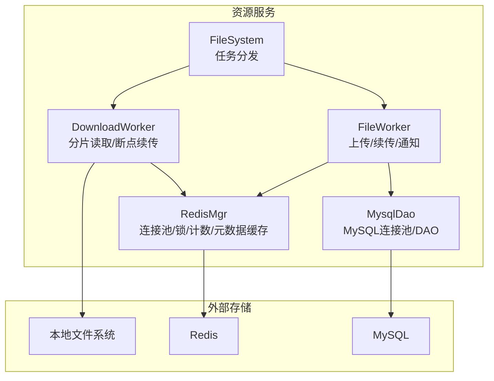
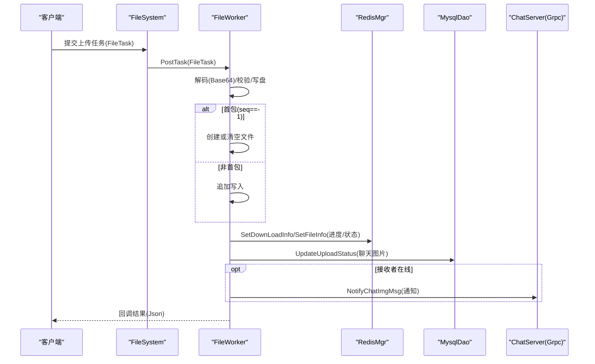
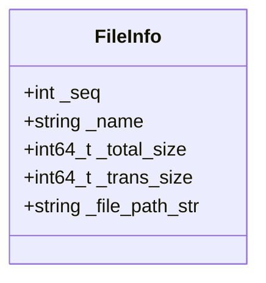
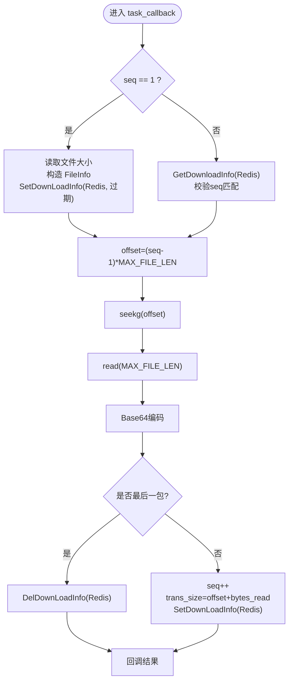
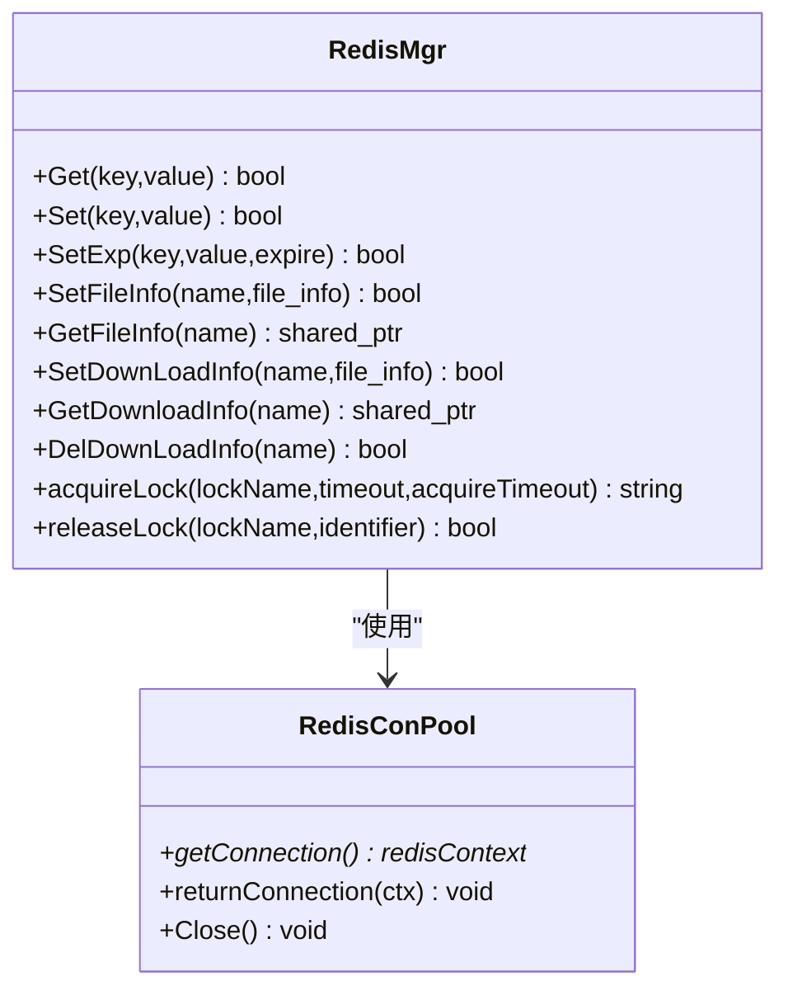
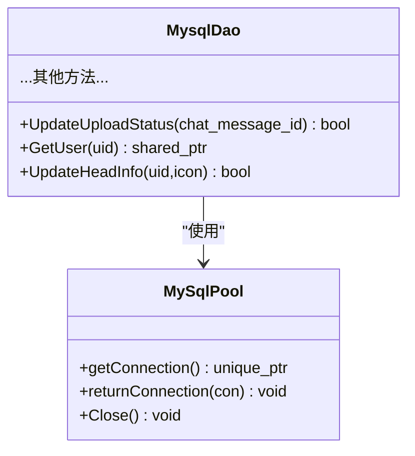
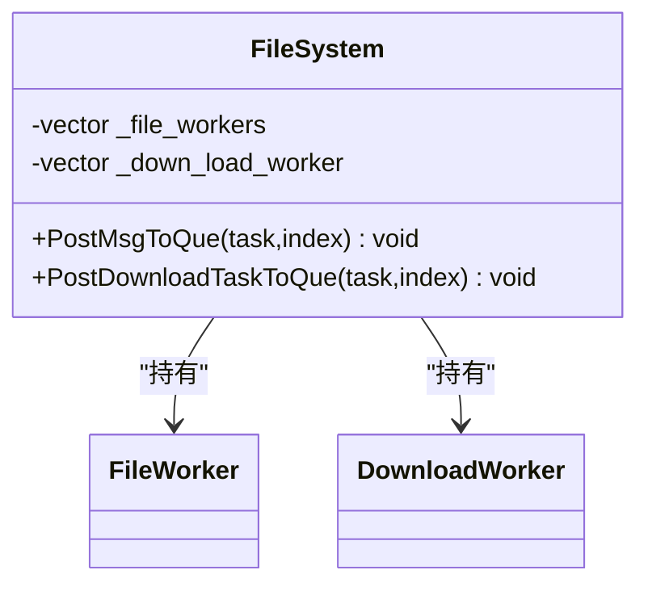
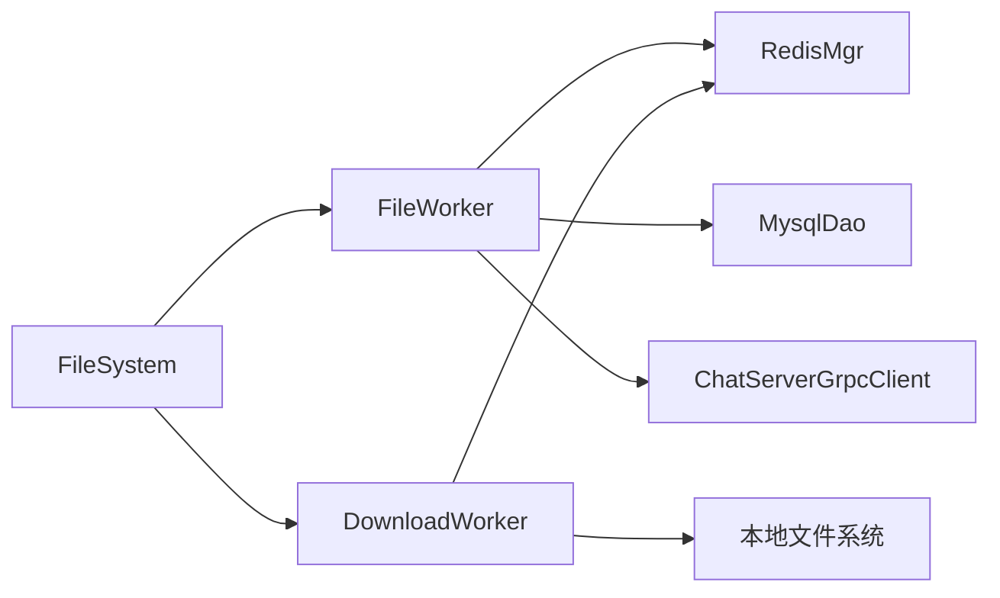
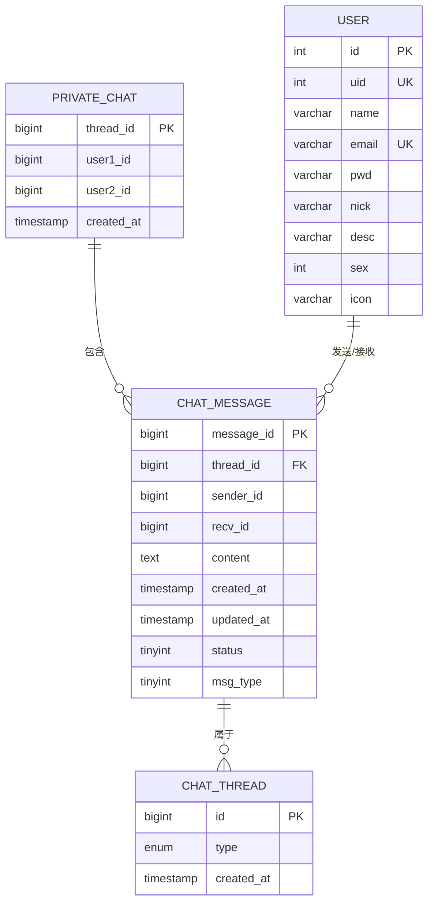

# 文件元数据管理

<cite>
**本文引用的文件**
- [FileInfo.h](file://server/ResourceServer/include/FileInfo.h)
- [FileSystem.h](file://server/ResourceServer/include/FileSystem.h)
- [FileWorker.h](file://server/ResourceServer/include/FileWorker.h)
- [RedisMgr.h](file://server/ResourceServer/include/RedisMgr.h)
- [MysqlDao.h](file://server/ResourceServer/include/MysqlDao.h)
- [const.h](file://server/ResourceServer/include/const.h)
- [FileInfo.cpp](file://server/ResourceServer/src/FileInfo.cpp)
- [FileSystem.cpp](file://server/ResourceServer/src/FileSystem.cpp)
- [FileWorker.cpp](file://server/ResourceServer/src/FileWorker.cpp)
- [RedisMgr.cpp](file://server/ResourceServer/src/RedisMgr.cpp)
- [MysqlDao.cpp](file://server/ResourceServer/src/MysqlDao.cpp)
- [llfc.sql](file://sql备份/llfc.sql)
</cite>

## 目录
1. [简介](#简介)
2. [项目结构](#项目结构)
3. [核心组件](#核心组件)
4. [架构总览](#架构总览)
5. [详细组件分析](#详细组件分析)
6. [依赖关系分析](#依赖关系分析)
7. [性能考量](#性能考量)
8. [故障排查指南](#故障排查指南)
9. [结论](#结论)
10. [附录](#附录)

## 简介
本技术文档围绕 LLFCChat 资源服务中的“文件元数据管理”展开，聚焦以下目标：
- 详解 FileInfo 数据结构的设计理念与字段定义（文件标识、大小、类型、创建/修改时间等）
- 说明文件版本控制机制、哈希值计算与完整性校验策略（设计建议与扩展点）
- 阐述文件索引构建算法、查找优化策略、缓存机制（基于 Redis 的下载进度与上传状态）
- 覆盖文件生命周期管理、垃圾回收策略、存储空间优化等企业级能力
- 给出元数据持久化方案、数据库表结构设计、查询接口规范
- 提供分布式环境下的元数据同步、冲突解决、一致性保证要点
- 面向开发者的元数据操作 API、扩展开发指南与故障排查方法

## 项目结构
资源服务中文件元数据相关代码主要位于 ResourceServer 模块，关键文件包括：
- 数据结构与常量：FileInfo.h、const.h
- 文件系统与工作者：FileSystem.h/.cpp、FileWorker.h/.cpp
- 缓存与持久化：RedisMgr.h/.cpp、MysqlDao.h/.cpp
- 数据库脚本：llfc.sql（聊天消息、会话线程、用户信息等）

**图表来源**
- [FileSystem.h:1-21](file://server/ResourceServer/include/FileSystem.h#L1-L21)
- [FileWorker.h:1-90](file://server/ResourceServer/include/FileWorker.h#L1-L90)
- [RedisMgr.h:1-313](file://server/ResourceServer/include/RedisMgr.h#L1-L313)
- [MysqlDao.h:1-273](file://server/ResourceServer/include/MysqlDao.h#L1-L273)

**章节来源**
- [FileSystem.h:1-21](file://server/ResourceServer/include/FileSystem.h#L1-L21)
- [FileWorker.h:1-90](file://server/ResourceServer/include/FileWorker.h#L1-L90)
- [RedisMgr.h:1-313](file://server/ResourceServer/include/RedisMgr.h#L1-L313)
- [MysqlDao.h:1-273](file://server/ResourceServer/include/MysqlDao.h#L1-L273)

## 核心组件
- FileInfo：文件元数据载体，包含序列号、文件名、总大小、已传输大小、文件路径等。用于上传/下载过程中的进度跟踪与断点续传。
- FileSystem：单例式文件管理器，维护多个 FileWorker 与 DownloadWorker，按索引将任务投递到对应工作线程。
- FileWorker：处理上传、头像上传、聊天图片上传、文件信息同步、续传等请求；通过回调返回结果并触发后续业务逻辑（如更新数据库、通知 ChatServer）。
- DownloadWorker：实现分片读取、偏移量定位、Base64 编码、断点续传进度在 Redis 中的持久化与清理。
- RedisMgr：封装 Redis 连接池、基础命令、分布式锁、计数统计以及文件元数据的序列化/反序列化存取。
- MysqlDao：封装 MySQL 连接池、事务、常用 DAO 方法（含 UpdateUploadStatus 等），支撑聊天消息状态与用户头像更新。

**章节来源**
- [FileInfo.h:1-26](file://server/ResourceServer/include/FileInfo.h#L1-L26)
- [FileSystem.h:1-21](file://server/ResourceServer/include/FileSystem.h#L1-L21)
- [FileWorker.h:1-90](file://server/ResourceServer/include/FileWorker.h#L1-L90)
- [RedisMgr.h:1-313](file://server/ResourceServer/include/RedisMgr.h#L1-L313)
- [MysqlDao.h:1-273](file://server/ResourceServer/include/MysqlDao.h#L1-L273)

## 架构总览
资源服务采用“任务队列 + 工作者线程”的并发模型，结合 Redis 做元数据缓存与分布式锁，MySQL 做持久化。上传流程由 FileWorker 统一处理，下载流程由 DownloadWorker 负责分片读取与断点续传。

**图表来源**
- [FileWorker.cpp:1-663](file://server/ResourceServer/src/FileWorker.cpp#L1-L663)
- [RedisMgr.cpp:1-602](file://server/ResourceServer/src/RedisMgr.cpp#L1-L602)
- [MysqlDao.cpp:1-800](file://server/ResourceServer/src/MysqlDao.cpp#L1-L800)

## 详细组件分析

### FileInfo 数据结构与语义
- 字段说明
  - _seq：分片序号，用于断点续传与顺序校验
  - _name：文件名（作为键名的一部分）
  - _total_size：文件总字节数
  - _trans_size：已传输字节数
  - _file_path_str：文件完整路径
- 设计理念
  - 轻量、无继承、纯 POD 风格，便于 JSON 序列化/反序列化
  - 与 Redis 键空间配合，形成“上传/下载”两类元数据视图
- 复杂度
  - 构造/拷贝 O(1)，JSON 序列化/反序列化 O(N)（N 为字段数量）

**图表来源**
- [FileInfo.h:1-26](file://server/ResourceServer/include/FileInfo.h#L1-L26)

**章节来源**
- [FileInfo.h:1-26](file://server/ResourceServer/include/FileInfo.h#L1-L26)

### 文件工作者与下载工作者
- FileWorker
  - 注册多种处理器：普通文件上传、头像上传、聊天图片上传、文件信息同步、续传聊天图片上传
  - 使用 Base64 编解码，按 seq 判断首包/续包，确保目录存在后写入磁盘
  - 完成时调用 MysqlDao.UpdateUploadStatus，并通过 Grpc 通知 ChatServer
- DownloadWorker
  - 首包：获取文件大小，初始化 FileInfo，立即写入 Redis（设置过期时间）
  - 续传：从 Redis 恢复 FileInfo，校验 seq，计算 offset = (seq-1)*MAX_FILE_LEN，定位读取
  - 最后包：删除 Redis 中的下载进度，避免内存泄漏

**图表来源**
- [FileWorker.cpp:483-663](file://server/ResourceServer/src/FileWorker.cpp#L483-L663)
- [RedisMgr.cpp:499-602](file://server/ResourceServer/src/RedisMgr.cpp#L499-L602)

**章节来源**
- [FileWorker.cpp:1-663](file://server/ResourceServer/src/FileWorker.cpp#L1-L663)
- [RedisMgr.cpp:1-602](file://server/ResourceServer/src/RedisMgr.cpp#L1-L602)

### Redis 元数据缓存与分布式锁
- 键空间设计
  - file_upload_{name}：上传进度（SET EX 1h）
  - file_download_{name}：下载进度（SET EX 1h）
- 功能
  - SetFileInfo / GetFileInfo：上传元数据存取
  - SetDownLoadInfo / GetDownloadInfo / DelDownLoadInfo：下载元数据存取
  - acquireLock / releaseLock：分布式锁（用于计数、限流等）
  - IncreaseCount / DecreaseCount / InitCount / DelCount：服务器登录计数
- 连接池与健康检查
  - RedisConPool 维护连接池，后台线程定期 PING，失败自动重连

**图表来源**
- [RedisMgr.h:1-313](file://server/ResourceServer/include/RedisMgr.h#L1-L313)
- [RedisMgr.cpp:1-602](file://server/ResourceServer/src/RedisMgr.cpp#L1-L602)

**章节来源**
- [RedisMgr.h:1-313](file://server/ResourceServer/include/RedisMgr.h#L1-L313)
- [RedisMgr.cpp:1-602](file://server/ResourceServer/src/RedisMgr.cpp#L1-L602)

### MySQL 持久化与聊天消息状态
- 连接池与保活
  - MySqlPool 维护连接池，后台线程检测空闲连接健康度，异常自动重连
- DAO 方法
  - UpdateUploadStatus：聊天图片上传完成后更新消息状态
  - GetUser/UpdateHeadInfo：用户信息查询与头像更新
  - 其他聊天与好友相关方法（不在本文重点）
- 事务与一致性
  - 多步操作使用事务，失败回滚，保证数据一致性

**图表来源**
- [MysqlDao.h:1-273](file://server/ResourceServer/include/MysqlDao.h#L1-L273)
- [MysqlDao.cpp:1-800](file://server/ResourceServer/src/MysqlDao.cpp#L1-L800)

**章节来源**
- [MysqlDao.h:1-273](file://server/ResourceServer/include/MysqlDao.h#L1-L273)
- [MysqlDao.cpp:1-800](file://server/ResourceServer/src/MysqlDao.cpp#L1-L800)

### 文件系统与任务分发
- FileSystem 单例
  - 维护 FILE_WORKER_COUNT 个 FileWorker 与 DOWN_LOAD_WORKER_COUNT 个 DownloadWorker
  - PostMsgToQue / PostDownloadTaskToQue 根据 index 选择具体 Worker 投递任务
- 作用
  - 解耦网络层与 IO 层，提升吞吐与稳定性

**图表来源**
- [FileSystem.h:1-21](file://server/ResourceServer/include/FileSystem.h#L1-L21)
- [FileSystem.cpp:1-29](file://server/ResourceServer/src/FileSystem.cpp#L1-L29)

**章节来源**
- [FileSystem.h:1-21](file://server/ResourceServer/include/FileSystem.h#L1-L21)
- [FileSystem.cpp:1-29](file://server/ResourceServer/src/FileSystem.cpp#L1-L29)

### 错误码与常量
- ErrorCodes：涵盖文件不存在、权限不足、序列号无效、偏移量无效、Redis 读取错误等
- MSG_IDS：定义上传、下载、同步、通知等消息 ID
- 常量：MAX_FILE_LEN（分片大小）、WORKER_COUNT、前缀常量（USERIPPREFIX、USER_BASE_INFO 等）

**章节来源**
- [const.h:1-117](file://server/ResourceServer/include/const.h#L1-L117)

## 依赖关系分析
- 组件耦合
  - FileWorker 依赖 RedisMgr（元数据缓存）、MysqlDao（状态持久化）、Grpc（通知 ChatServer）
  - DownloadWorker 依赖 RedisMgr（断点续传状态）、文件系统（分片读取）
  - FileSystem 聚合多个 Worker，降低网络层与 IO 层的耦合
- 外部依赖
  - Redis：元数据缓存、分布式锁、计数
  - MySQL：聊天消息状态、用户信息
  - 本地文件系统：实际文件存储

**图表来源**
- [FileWorker.cpp:1-663](file://server/ResourceServer/src/FileWorker.cpp#L1-L663)
- [RedisMgr.cpp:1-602](file://server/ResourceServer/src/RedisMgr.cpp#L1-L602)
- [MysqlDao.cpp:1-800](file://server/ResourceServer/src/MysqlDao.cpp#L1-L800)

**章节来源**
- [FileWorker.cpp:1-663](file://server/ResourceServer/src/FileWorker.cpp#L1-L663)
- [RedisMgr.cpp:1-602](file://server/ResourceServer/src/RedisMgr.cpp#L1-L602)
- [MysqlDao.cpp:1-800](file://server/ResourceServer/src/MysqlDao.cpp#L1-L800)

## 性能考量
- 并发模型
  - 多 Worker 并行处理上传/下载任务，避免阻塞网络 I/O
- 分片大小
  - MAX_FILE_LEN 决定单次读取/发送大小，影响网络与内存占用
- 缓存策略
  - Redis 设置过期时间，避免长期占用内存；下载完成后主动清理
- 数据库访问
  - 连接池复用连接，后台健康检查减少连接失效
- 序列化开销
  - FileInfo JSON 序列化/反序列化在高频场景下需关注 CPU 开销

[本节为通用指导，不直接分析具体文件]

## 故障排查指南
- 常见问题定位
  - 文件不存在：检查 file_path_str 与目录创建逻辑
  - 权限不足：确认读写权限，查看错误码 FileWritePermissionFailed/FileReadPermissionFailed
  - 序列号不匹配：检查 seq 与 Redis 中保存的 seq 是否一致
  - 偏移量越界：校验 offset < total_size
  - Redis 读取失败：检查连接池与 AUTH 配置
- 日志与调试
  - 关注 FileWorker/DownloadWorker 的打印输出
  - 检查 Redis 键是否存在且未过期
  - 检查 MySQL 连接池健康与事务回滚情况

**章节来源**
- [FileWorker.cpp:1-663](file://server/ResourceServer/src/FileWorker.cpp#L1-L663)
- [RedisMgr.cpp:1-602](file://server/ResourceServer/src/RedisMgr.cpp#L1-L602)
- [MysqlDao.cpp:1-800](file://server/ResourceServer/src/MysqlDao.cpp#L1-L800)
- [const.h:1-117](file://server/ResourceServer/include/const.h#L1-L117)

## 结论
LLFCChat 的资源服务通过清晰的数据结构与分层架构，实现了可靠的文件上传/下载与元数据管理。借助 Redis 的缓存与分布式锁、MySQL 的事务与持久化，系统在并发与一致性方面具备良好表现。未来可在哈希校验、版本控制、垃圾回收等方面进一步增强，以满足企业级需求。

[本节为总结性内容，不直接分析具体文件]

## 附录

### 元数据持久化方案与数据库表结构
- 聊天消息表 chat_message
  - message_id、thread_id、sender_id、recv_id、content、created_at、updated_at、status、msg_type
- 会话线程表 chat_thread
  - id、type、created_at
- 用户表 user
  - uid、name、email、pwd、nick、desc、sex、icon
- 私有会话 private_chat
  - thread_id、user1_id、user2_id、created_at

**图表来源**
- [llfc.sql:24-37](file://sql备份/llfc.sql#L24-L37)
- [llfc.sql:150-155](file://sql备份/llfc.sql#L150-L155)
- [llfc.sql:467-481](file://sql备份/llfc.sql#L467-L481)
- [llfc.sql:409-418](file://sql备份/llfc.sql#L409-L418)

**章节来源**
- [llfc.sql:1-756](file://sql备份/llfc.sql#L1-L756)

### 元数据操作 API 参考
- 上传/续传
  - ID_UPLOAD_FILE_REQ / ID_IMG_CHAT_UPLOAD_REQ / ID_IMG_CHAT_CONTINUE_UPLOAD_REQ
  - 行为：Base64 解码、按 seq 写入、更新 Redis 进度、必要时更新 MySQL 状态、通知 ChatServer
- 下载
  - ID_DOWN_LOAD_FILE_REQ / ID_IMG_CHAT_DOWN_REQ
  - 行为：首包获取大小并初始化 Redis，后续按 seq 读取分片，最后清理 Redis
- 同步
  - ID_FILE_INFO_SYNC_REQ / ID_IMG_CHAT_DOWN_INFO_SYNC_REQ
  - 行为：同步文件信息或下载进度

**章节来源**
- [const.h:72-95](file://server/ResourceServer/include/const.h#L72-L95)
- [FileWorker.cpp:1-663](file://server/ResourceServer/src/FileWorker.cpp#L1-L663)

### 分布式环境下的元数据同步与一致性
- 元数据同步
  - 使用 Redis 键（file_upload_*/file_download_*）承载临时元数据，设置过期时间避免脏数据
- 冲突解决
  - 通过分布式锁（acquireLock/releaseLock）保护临界区（如计数、限流）
- 一致性保证
  - MySQL 事务保证状态变更原子性
  - 下载完成后主动清理 Redis，避免状态不一致

**章节来源**
- [RedisMgr.cpp:398-429](file://server/ResourceServer/src/RedisMgr.cpp#L398-L429)
- [MysqlDao.cpp:260-463](file://server/ResourceServer/src/MysqlDao.cpp#L260-L463)

### 扩展开发指南
- 新增文件类型处理
  - 在 FileWorker::RegisterHandlers 中增加新的 MSG_IDS 处理器
- 增强完整性校验
  - 在写入完成后计算哈希（如 SHA-256），与客户端提供的期望值比对
- 垃圾回收策略
  - 定时扫描 Redis 中过期的 file_upload_/file_download_ 键，清理残留元数据
- 存储空间优化
  - 引入分片命名规则（按日期/用户/哈希），避免单目录过大

[本节为扩展建议，不直接分析具体文件]