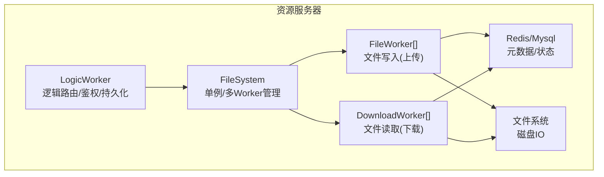
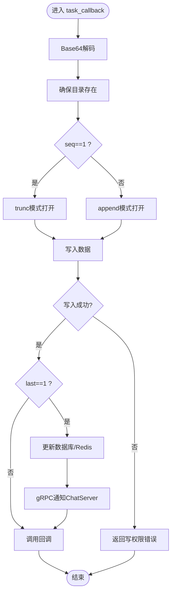
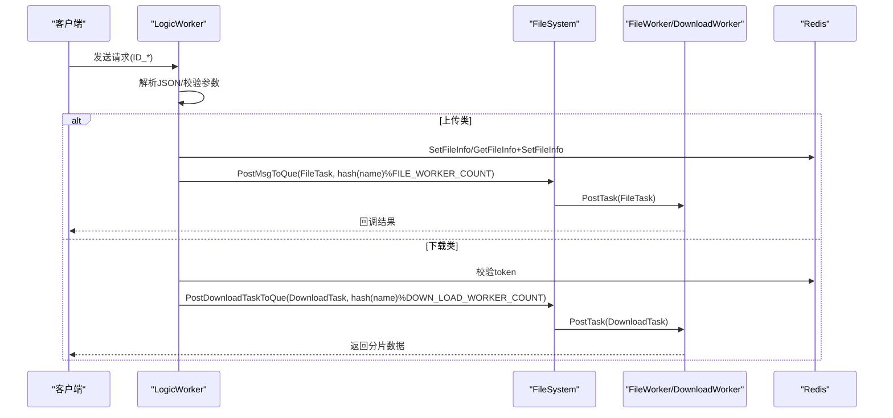
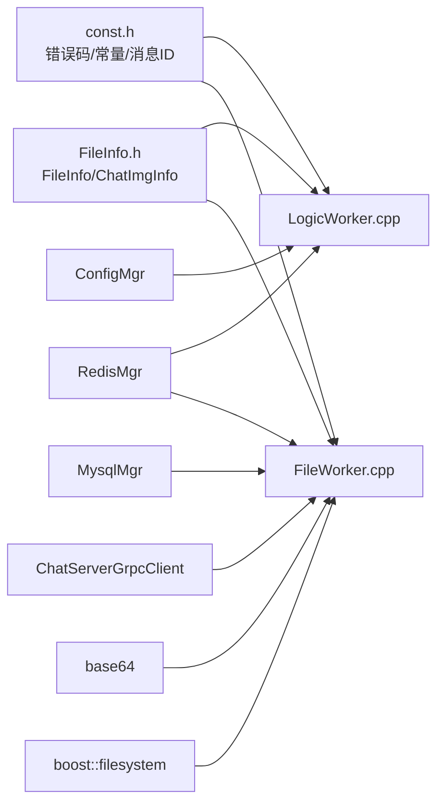

# 文件工作线程

<cite>
**本文引用的文件**   
- [FileWorker.h](file://server/ResourceServer/include/FileWorker.h)
- [FileWorker.cpp](file://server/ResourceServer/src/FileWorker.cpp)
- [LogicWorker.h](file://server/ResourceServer/include/LogicWorker.h)
- [LogicWorker.cpp](file://server/ResourceServer/src/LogicWorker.cpp)
- [FileSystem.h](file://server/ResourceServer/include/FileSystem.h)
- [FileSystem.cpp](file://server/ResourceServer/src/FileSystem.cpp)
- [FileInfo.h](file://server/ResourceServer/include/FileInfo.h)
- [const.h](file://server/ResourceServer/include/const.h)
</cite>

## 目录
1. [引言](#引言)
2. [项目结构](#项目结构)
3. [核心组件](#核心组件)
4. [架构总览](#架构总览)
5. [详细组件分析](#详细组件分析)
6. [依赖关系分析](#依赖关系分析)
7. [性能与并发优化](#性能与并发优化)
8. [故障排查指南](#故障排查指南)
9. [结论](#结论)
10. [附录](#附录)

## 引言
本技术文档聚焦于资源服务器中的“文件工作线程系统”，围绕 FileWorker、DownloadWorker 与 LogicWorker 的线程模型、任务分发、负载均衡、断点续传、并发控制与错误处理进行深入解析。文档同时给出架构图、类图、时序图与流程图，帮助开发者快速理解并扩展该子系统。

## 项目结构
资源服务器中负责文件上传/下载的核心代码位于 ResourceServer 模块：
- 逻辑层：LogicWorker 负责消息路由、鉴权、状态持久化（Redis/Mysql）与任务派发
- 文件IO层：FileWorker 负责文件写入（含头像、聊天图片、通用文件），支持分片与最后包回调
- 下载层：DownloadWorker 负责按块读取、Base64编码、断点续传进度维护（Redis）
- 调度层：FileSystem 作为单例，维护多个 FileWorker 与 DownloadWorker 实例，实现基于哈希的负载均衡



图表来源
- [FileSystem.h:7-18](file://server/ResourceServer/include/FileSystem.h#L7-L18)
- [FileSystem.cpp:19-28](file://server/ResourceServer/src/FileSystem.cpp#L19-L28)
- [FileWorker.h:58-73](file://server/ResourceServer/include/FileWorker.h#L58-L73)
- [FileWorker.h:76-88](file://server/ResourceServer/include/FileWorker.h#L76-L88)
- [LogicWorker.h:21-36](file://server/ResourceServer/include/LogicWorker.h#L21-L36)

章节来源
- [FileSystem.h:7-18](file://server/ResourceServer/include/FileSystem.h#L7-L18)
- [FileSystem.cpp:19-28](file://server/ResourceServer/src/FileSystem.cpp#L19-L28)
- [const.h:64-69](file://server/ResourceServer/include/const.h#L64-L69)

## 核心组件
- FileWorker：单线程工作器，内部维护一个任务队列与条件变量，通过 PostTask 投递函数对象，循环取出执行；提供多种上传处理器注册机制
- DownloadWorker：单线程工作器，按序列号分块读取文件，维护断点续传信息到 Redis，返回 Base64 编码的分片数据
- LogicWorker：单线程工作器，注册消息回调，完成鉴权、参数校验、Redis/Mysql 状态更新后，将任务派发到 FileSystem 对应的 Worker
- FileSystem：单例，持有 FILE_WORKER_COUNT 个 FileWorker 与 DOWN_LOAD_WORKER_COUNT 个 DownloadWorker，使用文件名哈希取模进行负载均衡

章节来源
- [FileWorker.h:58-73](file://server/ResourceServer/include/FileWorker.h#L58-L73)
- [FileWorker.h:76-88](file://server/ResourceServer/include/FileWorker.h#L76-L88)
- [LogicWorker.h:21-36](file://server/ResourceServer/include/LogicWorker.h#L21-L36)
- [FileSystem.h:7-18](file://server/ResourceServer/include/FileSystem.h#L7-L18)

## 架构总览
整体采用“逻辑层 + IO层”分离设计：
- 逻辑层（LogicWorker）解耦业务处理与IO操作，统一入口，便于鉴权、限流、审计
- IO层（FileWorker/DownloadWorker）专注文件读写，保证线程安全与顺序性
- 调度层（FileSystem）通过哈希负载均衡，避免热点文件争用同一Worker

```mermaid
classDiagram
class FileSystem {
-vector<FileWorker*> _file_workers
-vector<DownloadWorker*> _down_load_worker
+PostMsgToQue(msg, index)
+PostDownloadTaskToQue(task, index)
}
class FileWorker {
-thread _work_thread
-queue<function<void()>> _task_que
-mutex _mtx
-condition_variable _cv
-atomic<bool> _b_stop
+PostTask(task)
-task_callback(task)
}
class DownloadWorker {
-thread _work_thread
-queue<shared_ptr<DownloadTask>> _task_que
-mutex _mtx
-condition_variable _cv
-atomic<bool> _b_stop
+PostTask(task)
-task_callback(task)
}
class LogicWorker {
-thread _work_thread
-queue<shared_ptr<LogicNode>> _task_que
-mutex _mtx
-condition_variable _cv
-unordered_map<short, FunCallBack> _fun_callbacks
+PostTask(task)
-task_callback(task)
}
FileSystem --> FileWorker : "管理多个实例"
FileSystem --> DownloadWorker : "管理多个实例"
LogicWorker --> FileSystem : "派发任务"
```

图表来源
- [FileSystem.h:7-18](file://server/ResourceServer/include/FileSystem.h#L7-L18)
- [FileWorker.h:58-73](file://server/ResourceServer/include/FileWorker.h#L58-L73)
- [FileWorker.h:76-88](file://server/ResourceServer/include/FileWorker.h#L76-L88)
- [LogicWorker.h:21-36](file://server/ResourceServer/include/LogicWorker.h#L21-L36)

## 详细组件分析

### FileWorker：上传任务处理
- 线程模型：构造时启动单线程，循环等待条件变量唤醒；析构时设置停止标志并 join
- 任务队列：std::queue<std::function<void()>>，PostTask 以闭包形式入队，避免直接传递复杂对象
- 处理器注册：RegisterHandlers 将不同 MSG_IDS 映射到具体处理 lambda，如 ID_UPLOAD_FILE_REQ、ID_UPLOAD_HEAD_ICON_REQ、ID_IMG_CHAT_UPLOAD_REQ、ID_FILE_INFO_SYNC_REQ、ID_IMG_CHAT_CONTINUE_UPLOAD_REQ
- 上传流程要点：
  - Base64 解码
  - 自动创建目录（不存在则创建）
  - 首包 trunc 打开，后续包 append 追加
  - 写失败或权限不足返回对应错误码
  - 最后一个包触发回调，必要时更新数据库/Redis，并通过 gRPC 通知 ChatServer



图表来源
- [FileWorker.cpp:49-112](file://server/ResourceServer/src/FileWorker.cpp#L49-L112)
- [FileWorker.cpp:115-196](file://server/ResourceServer/src/FileWorker.cpp#L115-L196)
- [FileWorker.cpp:199-283](file://server/ResourceServer/src/FileWorker.cpp#L199-L283)
- [FileWorker.cpp:286-369](file://server/ResourceServer/src/FileWorker.cpp#L286-L369)
- [FileWorker.cpp:372-456](file://server/ResourceServer/src/FileWorker.cpp#L372-L456)

章节来源
- [FileWorker.cpp:12-47](file://server/ResourceServer/src/FileWorker.cpp#L12-L47)
- [FileWorker.cpp:460-481](file://server/ResourceServer/src/FileWorker.cpp#L460-L481)
- [FileWorker.cpp:49-112](file://server/ResourceServer/src/FileWorker.cpp#L49-L112)

### DownloadWorker：下载与断点续传
- 线程模型：与 FileWorker 一致的单线程队列模型
- 断点续传：
  - 首包：获取文件大小，初始化 FileInfo，写入 Redis 覆盖旧状态
  - 续传包：从 Redis 读取历史状态，校验 seq 一致性
  - 计算偏移量 offset = (seq-1)*MAX_FILE_LEN，定位读取 MAX_FILE_LEN 字节
  - Base64 编码后返回客户端
  - 若为最后一包，删除 Redis 中的下载状态；否则更新 seq 与 trans_size
- 错误处理：文件不存在、读权限不足、Redis 读取失败、序列号不匹配、偏移越界等均有明确错误码

```mermaid
sequenceDiagram
participant Client as "客户端"
participant LW as "LogicWorker"
participant FS as "FileSystem"
participant DW as "DownloadWorker"
participant Redis as "Redis"
participant Disk as "文件系统"
Client->>LW : 发送下载请求(ID_DOWN_LOAD_FILE_REQ)
LW->>LW : 校验token/参数
LW->>FS : PostDownloadTaskToQue(task, hash(name)%N)
FS->>DW : PostTask(task)
DW->>Disk : 检查文件存在/打开
alt seq==1
DW->>Disk : seek到末尾获取total_size
DW->>Redis : SetDownLoadInfo(name, FileInfo)
else 续传
DW->>Redis : GetDownloadInfo(name)
DW->>DW : 校验seq一致性
end
DW->>Disk : seek(offset), read(MAX_FILE_LEN)
DW->>DW : Base64编码
DW-->>Client : 返回data/seq/total_size/current_size/is_last
opt 最后一包
DW->>Redis : DelDownLoadInfo(name)
else 非最后一包
DW->>Redis : SetDownLoadInfo(name, updated FileInfo)
end
```

图表来源
- [FileWorker.cpp:528-662](file://server/ResourceServer/src/FileWorker.cpp#L528-L662)
- [LogicWorker.cpp:311-372](file://server/ResourceServer/src/LogicWorker.cpp#L311-L372)

章节来源
- [FileWorker.cpp:483-516](file://server/ResourceServer/src/FileWorker.cpp#L483-L516)
- [FileWorker.cpp:518-526](file://server/ResourceServer/src/FileWorker.cpp#L518-L526)
- [FileWorker.cpp:528-662](file://server/ResourceServer/src/FileWorker.cpp#L528-L662)

### LogicWorker：消息路由与任务派发
- 线程模型：单线程队列模型，循环等待条件变量
- 回调注册：RegisterCallBacks 将不同 MSG_IDS 绑定到处理函数，包含：
  - 测试消息回显
  - 通用文件上传（ID_UPLOAD_FILE_REQ）
  - 头像上传（ID_UPLOAD_HEAD_ICON_REQ）
  - 下载文件（ID_DOWN_LOAD_FILE_REQ）
  - 聊天图片上传/同步/续传（ID_IMG_CHAT_UPLOAD_REQ / ID_FILE_INFO_SYNC_REQ / ID_IMG_CHAT_CONTINUE_UPLOAD_REQ）
  - 聊天图片下载信息同步与下载（ID_IMG_CHAT_DOWN_INFO_SYNC_REQ / ID_IMG_CHAT_DOWN_REQ）
- 负载均衡：对文件名 name 做 std::hash，再 % FILE_WORKER_COUNT 或 % DOWN_LOAD_WORKER_COUNT，选择目标 Worker
- 状态持久化：首包时写入 Redis（SetFileInfo），续传时读取并更新（GetFileInfo/SetFileInfo）
- 鉴权：部分接口在 seq==1 时校验 token（USERTOKENPREFIX）



图表来源
- [LogicWorker.cpp:58-76](file://server/ResourceServer/src/LogicWorker.cpp#L58-L76)
- [LogicWorker.cpp:78-162](file://server/ResourceServer/src/LogicWorker.cpp#L78-L162)
- [LogicWorker.cpp:197-309](file://server/ResourceServer/src/LogicWorker.cpp#L197-L309)
- [LogicWorker.cpp:311-372](file://server/ResourceServer/src/LogicWorker.cpp#L311-L372)
- [LogicWorker.cpp:374-464](file://server/ResourceServer/src/LogicWorker.cpp#L374-L464)
- [LogicWorker.cpp:467-555](file://server/ResourceServer/src/LogicWorker.cpp#L467-L555)
- [LogicWorker.cpp:559-647](file://server/ResourceServer/src/LogicWorker.cpp#L559-L647)
- [LogicWorker.cpp:649-682](file://server/ResourceServer/src/LogicWorker.cpp#L649-L682)
- [LogicWorker.cpp:684-751](file://server/ResourceServer/src/LogicWorker.cpp#L684-L751)

章节来源
- [LogicWorker.cpp:12-42](file://server/ResourceServer/src/LogicWorker.cpp#L12-L42)
- [LogicWorker.cpp:51-56](file://server/ResourceServer/src/LogicWorker.cpp#L51-L56)
- [LogicWorker.cpp:755-764](file://server/ResourceServer/src/LogicWorker.cpp#L755-L764)

### FileSystem：单例与负载均衡
- 单例模式：Singleton<FileSystem>，全局唯一实例
- Worker池：构造时创建 FILE_WORKER_COUNT 个 FileWorker 与 DOWN_LOAD_WORKER_COUNT 个 DownloadWorker
- 负载均衡：PostMsgToQue/PostDownloadTaskToQue 根据 index（由上层 hash(name)%N 计算）选择具体 Worker

章节来源
- [FileSystem.h:7-18](file://server/ResourceServer/include/FileSystem.h#L7-L18)
- [FileSystem.cpp:19-28](file://server/ResourceServer/src/FileSystem.cpp#L19-L28)

## 依赖关系分析
- 常量与错误码：const.h 定义了 ErrorCodes、MSG_IDS、线程池大小、最大分片大小等
- 数据结构：FileInfo.h 定义 FileInfo/ChatImgInfo，用于上传/下载状态与聊天图片元数据
- 外部依赖：RedisMgr、MysqlMgr、ChatServerGrpcClient、ConfigMgr、base64、boost::filesystem



图表来源
- [const.h:5-29](file://server/ResourceServer/include/const.h#L5-L29)
- [const.h:64-69](file://server/ResourceServer/include/const.h#L64-L69)
- [const.h:72-95](file://server/ResourceServer/include/const.h#L72-L95)
- [const.h:114](file://server/ResourceServer/include/const.h#L114)
- [FileInfo.h:4-15](file://server/ResourceServer/include/FileInfo.h#L4-L15)

章节来源
- [const.h:5-29](file://server/ResourceServer/include/const.h#L5-L29)
- [const.h:64-69](file://server/ResourceServer/include/const.h#L64-L69)
- [const.h:72-95](file://server/ResourceServer/include/const.h#L72-L95)
- [FileInfo.h:4-15](file://server/ResourceServer/include/FileInfo.h#L4-L15)

## 性能与并发优化
- 线程模型
  - 每个 Worker 单线程串行消费队列，避免锁竞争，提升缓存局部性
  - 通过条件变量减少忙轮询，降低CPU占用
- 负载均衡
  - 基于文件名哈希取模，尽量分散相同文件的并发访问到不同 Worker
  - 建议根据热点文件分布调整 FILE_WORKER_COUNT/DOWN_LOAD_WORKER_COUNT
- I/O 优化
  - 上传首包 trunc、后续包 append，减少重复写入开销
  - 下载固定分片大小 MAX_FILE_LEN=32KB，平衡网络与内存占用
  - Base64 编解码仅在传输层使用，避免频繁大对象拷贝
- 状态管理
  - 上传/下载状态存 Redis，避免磁盘状态不一致；注意过期策略与幂等性
- 可扩展性
  - 可引入优先级队列（高优先用户/小文件优先）
  - 可增加超时与重试机制，提升鲁棒性
- 监控与统计
  - 建议在 PostTask/task_callback 埋点，统计队列长度、处理耗时、错误率
  - 暴露指标：活跃Worker数、队列积压、I/O吞吐、Redis命中率

[本节为通用指导，不直接分析具体文件]

## 故障排查指南
- 常见错误码
  - FileNotExists：文件不存在
  - FileWritePermissionFailed/FileReadPermissionFailed：权限不足
  - FileSeqInvalid/FileOffsetInvalid：序列号或偏移异常
  - RedisReadErr：Redis读取失败
  - TokenInvalid/UidInvalid：鉴权失败
- 排查步骤
  - 确认路径与权限：检查 ConfigMgr 配置的文件输出路径与进程权限
  - 检查 Redis 状态：查看 SetFileInfo/GetFileInfo/SetDownLoadInfo/GetDownloadInfo 是否成功
  - 核对 seq 与 total_size：确保客户端与服务端序列号一致，避免错位
  - 观察日志：关注“无法打开文件”“写入失败”“读取失败”等关键日志
  - 网络与gRPC：上传完成后是否成功通知 ChatServer（NotifyChatImgMsg）

章节来源
- [const.h:5-29](file://server/ResourceServer/include/const.h#L5-L29)
- [FileWorker.cpp:89-102](file://server/ResourceServer/src/FileWorker.cpp#L89-L102)
- [FileWorker.cpp:540-553](file://server/ResourceServer/src/FileWorker.cpp#L540-L553)
- [FileWorker.cpp:576-610](file://server/ResourceServer/src/FileWorker.cpp#L576-L610)

## 结论
该文件工作线程系统通过清晰的职责分层与单线程队列模型，实现了高内聚、低耦合的文件上传/下载能力。借助 Redis 的状态管理与哈希负载均衡，系统在并发场景下具备较好的稳定性与可扩展性。未来可在优先级调度、超时重试、指标监控等方面进一步增强。

[本节为总结，不直接分析具体文件]

## 附录

### 线程池配置与调优建议
- FILE_WORKER_COUNT/DOWN_LOAD_WORKER_COUNT：建议等于或略大于CPU核数，结合QPS与I/O延迟评估
- MAX_FILE_LEN：32KB 适合一般网络环境，可根据带宽与RTT调整
- Redis过期策略：下载状态需合理设置TTL，避免僵尸状态

章节来源
- [const.h:64-69](file://server/ResourceServer/include/const.h#L64-L69)
- [const.h:114](file://server/ResourceServer/include/const.h#L114)

### 自定义任务类型开发指南
- 新增上传处理器
  - 在 FileWorker::RegisterHandlers 中注册新的 MSG_IDS 与处理lambda
  - 遵循首包/续包/最后包的统一处理范式
- 新增下载处理器
  - 在 LogicWorker::RegisterCallBacks 中注册新消息ID
  - 复用 DownloadWorker 的分片读取与断点续传逻辑
- 注意事项
  - 保持回调签名一致，确保异步结果正确返回
  - 严格校验参数与权限，防止非法访问

章节来源
- [FileWorker.cpp:49-112](file://server/ResourceServer/src/FileWorker.cpp#L49-L112)
- [LogicWorker.cpp:78-162](file://server/ResourceServer/src/LogicWorker.cpp#L78-L162)