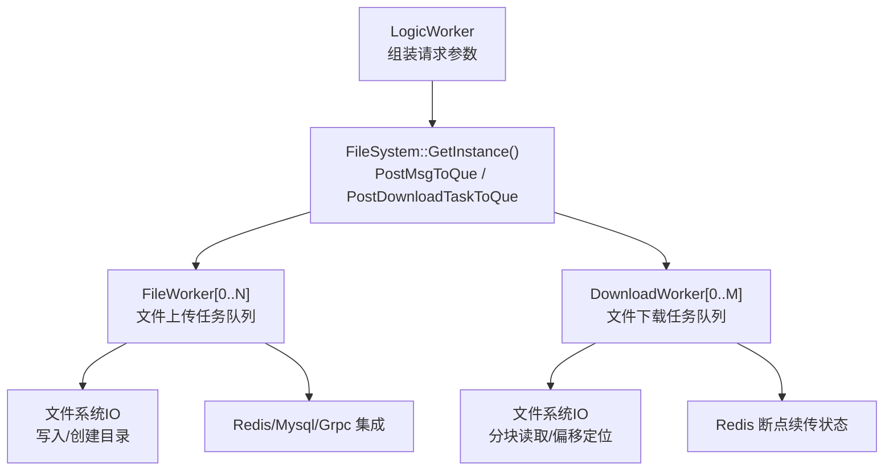
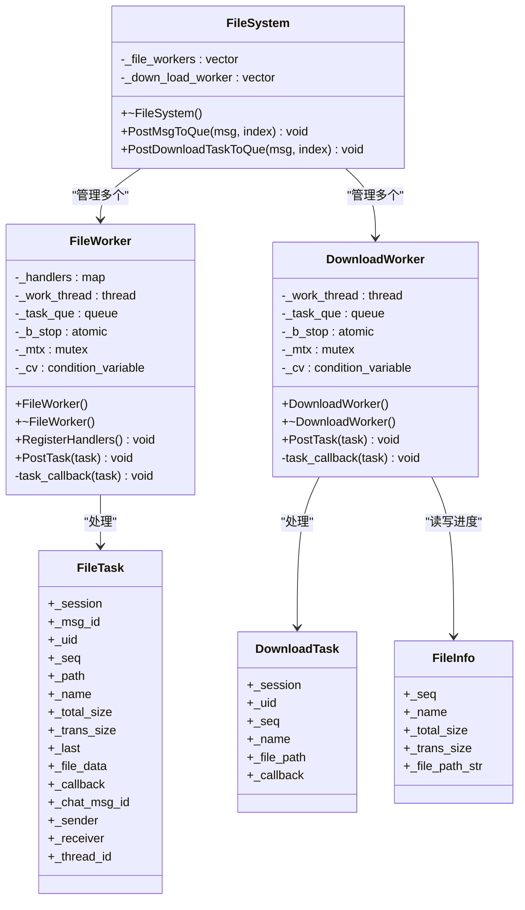
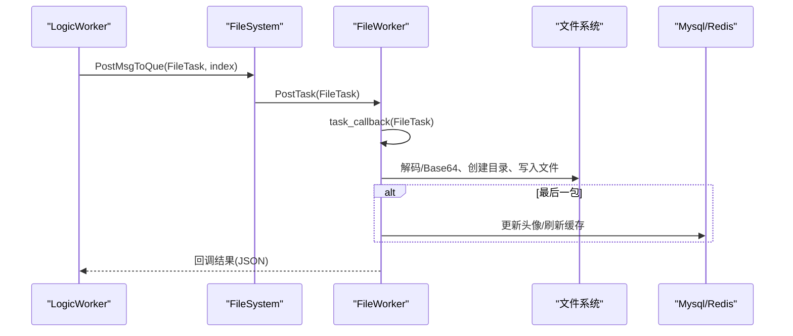
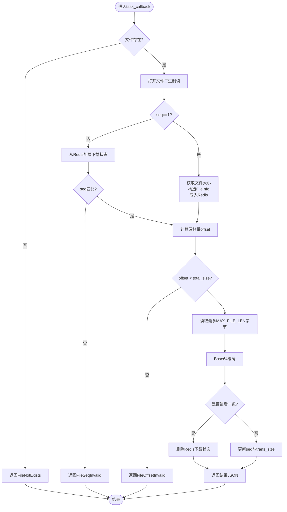
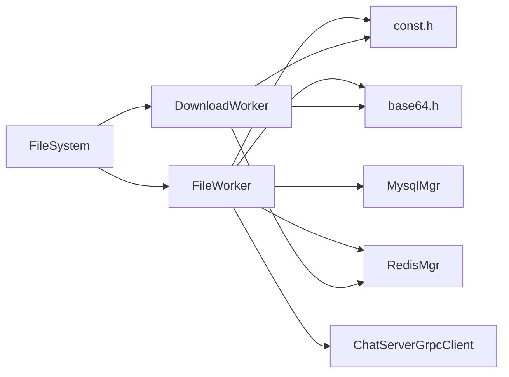

# 文件系统抽象层

<cite>
**本文引用的文件**   
- [FileSystem.h](file://server/ResourceServer/include/FileSystem.h)
- [FileSystem.cpp](file://server/ResourceServer/src/FileSystem.cpp)
- [FileWorker.h](file://server/ResourceServer/include/FileWorker.h)
- [FileWorker.cpp](file://server/ResourceServer/src/FileWorker.cpp)
- [const.h](file://server/ResourceServer/include/const.h)
- [FileInfo.h](file://server/ResourceServer/include/FileInfo.h)
- [base64.h](file://server/ResourceServer/include/base64.h)
- [singleton.h](file://client/llfcchat/include/singleton.h)
- [LogicWorker.cpp](file://server/ResourceServer/src/LogicWorker.cpp)
- [RedisMgr.cpp](file://server/ResourceServer/src/RedisMgr.cpp)
</cite>

## 目录
1. [引言](#引言)
2. [项目结构](#项目结构)
3. [核心组件](#核心组件)
4. [架构总览](#架构总览)
5. [详细组件分析](#详细组件分析)
6. [依赖关系分析](#依赖关系分析)
7. [性能与内存管理](#性能与内存管理)
8. [故障排查指南](#故障排查指南)
9. [结论](#结论)
10. [附录：扩展开发指南与最佳实践](#附录扩展开发指南与最佳实践)

## 引言
本技术文档聚焦于LLFCChat资源服务端的“文件系统抽象层”，围绕FileSystem单例、文件工作线程池(FileWorker)与下载工作线程池(DownloadWorker)的设计与实现进行深入剖析。重点说明PostMsgToQue与PostDownloadTaskToQue的异步任务处理机制，包括任务队列管理、线程安全保证、负载均衡策略；并覆盖文件操作封装接口、权限控制、安全访问验证、路径规划与命名规范、断点续传、错误处理与异常恢复等关键能力。面向开发者提供扩展与优化建议。

## 项目结构
文件系统抽象层位于ResourceServer模块中，核心由以下文件组成：
- FileSystem：单例入口，维护文件工作者与下载工作者数组，负责将任务分发到具体worker。
- FileWorker：文件上传类任务的处理器，基于消息ID路由到不同业务回调（普通文件、头像、聊天图片、信息同步、续传）。
- DownloadWorker：文件下载类任务的处理器，支持断点续传与分块读取、Base64编码返回。
- const.h：定义错误码、消息ID、常量（如WORKER_COUNT、MAX_FILE_LEN等）。
- FileInfo.h：下载进度与元数据模型。
- base64.h：Base64编解码工具。
- singleton.h：通用单例模板（客户端侧实现，服务端通过自身单例模式使用）。
- LogicWorker.cpp：逻辑层组装请求参数并投递到FileSystem队列。
- RedisMgr.cpp：Redis存取辅助（上传/下载状态、用户信息等）。

图表来源
- [FileSystem.cpp:19-28](file://server/ResourceServer/src/FileSystem.cpp#L19-L28)
- [FileWorker.cpp:12-40](file://server/ResourceServer/src/FileWorker.cpp#L12-L40)
- [FileWorker.cpp:483-509](file://server/ResourceServer/src/FileWorker.cpp#L483-L509)
- [LogicWorker.cpp:157-162](file://server/ResourceServer/src/LogicWorker.cpp#L157-L162)

章节来源
- [FileSystem.h:7-18](file://server/ResourceServer/include/FileSystem.h#L7-L18)
- [FileSystem.cpp:19-28](file://server/ResourceServer/src/FileSystem.cpp#L19-L28)
- [FileWorker.h:58-88](file://server/ResourceServer/include/FileWorker.h#L58-L88)
- [const.h:63-69](file://server/ResourceServer/include/const.h#L63-L69)

## 核心组件
- FileSystem单例
  - 职责：统一对外暴露文件与下载任务投递接口；内部维护固定数量的FileWorker与DownloadWorker实例，按索引进行任务分发。
  - 关键点：构造函数初始化工作者数量；PostMsgToQue与PostDownloadTaskToQue分别向对应worker投递任务。
- FileWorker
  - 职责：接收FileTask，根据msg_id路由到具体处理函数；每个worker拥有独立的工作线程、任务队列、条件变量与互斥锁。
  - 关键点：RegisterHandlers注册多种上传场景；PostTask以闭包形式入队；task_callback按ID查找并执行回调。
- DownloadWorker
  - 职责：接收DownloadTask，按seq分块读取文件，Base64编码后返回；维护断点续传状态于Redis。
  - 关键点：PostTask入队；task_callback计算偏移量、校验序列号、更新进度、最后包清理状态。
- 数据结构
  - FileTask：包含会话、消息ID、用户ID、路径、文件名、分片序号、总大小、已传输大小、是否最后一包、数据体、回调、聊天消息ID、发送者/接收者等。
  - DownloadTask：包含会话、用户ID、文件名、分片序号、文件路径、回调。
  - FileInfo：下载进度与元数据（名称、总大小、已传输大小、当前序列号、文件路径字符串）。

章节来源
- [FileSystem.h:7-18](file://server/ResourceServer/include/FileSystem.h#L7-L18)
- [FileWorker.h:14-56](file://server/ResourceServer/include/FileWorker.h#L14-L56)
- [FileWorker.h:58-88](file://server/ResourceServer/include/FileWorker.h#L58-L88)
- [FileInfo.h:4-25](file://server/ResourceServer/include/FileInfo.h#L4-L25)

## 架构总览
文件系统抽象层采用“单例+多工作者”的并发模型：
- 单例FileSystem集中管理工作者集合，避免全局状态分散。
- FileWorker与DownloadWorker各自持有独立线程与队列，解耦I/O与业务逻辑。
- 通过消息ID路由机制，FileWorker可灵活扩展新的上传处理逻辑。
- 下载流程借助Redis持久化断点信息，确保中断后可恢复。

图表来源
- [FileSystem.h:7-18](file://server/ResourceServer/include/FileSystem.h#L7-L18)
- [FileWorker.h:58-88](file://server/ResourceServer/include/FileWorker.h#L58-L88)
- [FileWorker.h:14-56](file://server/ResourceServer/include/FileWorker.h#L14-L56)
- [FileInfo.h:4-25](file://server/ResourceServer/include/FileInfo.h#L4-L25)

## 详细组件分析

### FileSystem单例设计模式与实现原理
- 设计模式：继承自Singleton模板的单例类，保证全局唯一实例；构造时初始化固定数量的FileWorker与DownloadWorker。
- 线程安全：单例获取在客户端侧使用call_once保证线程安全；服务端通过静态或全局单例方式获取实例。
- 任务分发：PostMsgToQue与PostDownloadTaskToQue通过index选择具体worker，实现简单负载均衡。

章节来源
- [FileSystem.h:7-18](file://server/ResourceServer/include/FileSystem.h#L7-L18)
- [FileSystem.cpp:19-28](file://server/ResourceServer/src/FileSystem.cpp#L19-L28)
- [singleton.h:18-34](file://client/llfcchat/include/singleton.h#L18-L34)

### FileWorker架构与任务处理机制
- 线程模型：每个FileWorker启动一个工作线程，循环等待条件变量唤醒；互斥锁保护任务队列。
- 任务入队：PostTask将task包装为闭包入队，并通知工作线程。
- 路由机制：RegisterHandlers注册多种MSG_IDS对应的处理函数，task_callback根据msg_id查找并调用。
- 典型处理流程（以头像上传为例）：
  - Base64解码数据
  - 解析路径并创建目录（不存在则创建）
  - 首包trunc打开文件，后续包append追加
  - 写入失败返回权限错误
  - 最后一包完成后更新数据库头像字段并刷新Redis缓存

图表来源
- [FileWorker.cpp:49-112](file://server/ResourceServer/src/FileWorker.cpp#L49-L112)
- [FileWorker.cpp:115-196](file://server/ResourceServer/src/FileWorker.cpp#L115-L196)
- [FileWorker.cpp:460-481](file://server/ResourceServer/src/FileWorker.cpp#L460-L481)

章节来源
- [FileWorker.cpp:12-40](file://server/ResourceServer/src/FileWorker.cpp#L12-L40)
- [FileWorker.cpp:49-112](file://server/ResourceServer/src/FileWorker.cpp#L49-L112)
- [FileWorker.cpp:460-481](file://server/ResourceServer/src/FileWorker.cpp#L460-L481)

### DownloadWorker架构与断点续传
- 线程模型：与FileWorker一致，独立线程处理下载任务队列。
- 断点续传流程：
  - 首包：获取文件大小，构造FileInfo并写入Redis（设置过期时间）
  - 非首包：从Redis读取历史进度，校验seq一致性
  - 计算偏移量offset=(seq-1)*MAX_FILE_LEN，定位读取
  - 读取数据Base64编码，返回给客户端
  - 若为最后一包：删除Redis中的下载状态；否则更新seq与trans_size

图表来源
- [FileWorker.cpp:528-662](file://server/ResourceServer/src/FileWorker.cpp#L528-L662)
- [RedisMgr.cpp:514-531](file://server/ResourceServer/src/RedisMgr.cpp#L514-L531)

章节来源
- [FileWorker.cpp:483-509](file://server/ResourceServer/src/FileWorker.cpp#L483-L509)
- [FileWorker.cpp:528-662](file://server/ResourceServer/src/FileWorker.cpp#L528-L662)
- [RedisMgr.cpp:514-531](file://server/ResourceServer/src/RedisMgr.cpp#L514-L531)

### PostMsgToQue与PostDownloadTaskToQue的异步任务处理机制
- 任务队列管理：
  - FileWorker使用queue<std::function<void()>>存储待执行任务；DownloadWorker使用queue<std::shared_ptr<DownloadTask>>。
  - 入队时使用互斥锁保护，出队时在工作线程内无锁消费。
- 线程安全保证：
  - 互斥锁+条件变量组合，避免竞态与虚假唤醒。
  - 原子标志_b_stop用于优雅退出。
- 负载均衡策略：
  - FileSystem通过index选择worker，通常由上游（如LogicWorker）根据会话或哈希分配index，实现简单轮询或一致性哈希。
- 回调机制：
  - 任务携带std::function回调，处理完成后异步回传结果，避免阻塞上游。

章节来源
- [FileSystem.cpp:9-17](file://server/ResourceServer/src/FileSystem.cpp#L9-L17)
- [FileWorker.cpp:460-481](file://server/ResourceServer/src/FileWorker.cpp#L460-L481)
- [FileWorker.cpp:518-526](file://server/ResourceServer/src/FileWorker.cpp#L518-L526)

### 文件操作封装接口与安全访问验证
- 文件路径规划算法：
  - 使用boost::filesystem解析路径，自动创建父目录；文件名取自完整路径的filename部分。
- 权限控制机制：
  - 写权限不足返回FileWritePermissionFailed；读权限不足返回FileReadPermissionFailed。
- 安全访问验证：
  - 下载前检查文件是否存在；断点续传校验seq一致性；Redis状态过期时拒绝续传。
- 错误码体系：
  - const.h定义统一错误码，涵盖文件、Redis、RPC、消息ID等异常场景。

章节来源
- [FileWorker.cpp:67-112](file://server/ResourceServer/src/FileWorker.cpp#L67-L112)
- [FileWorker.cpp:540-553](file://server/ResourceServer/src/FileWorker.cpp#L540-L553)
- [const.h:5-29](file://server/ResourceServer/include/const.h#L5-L29)

### 存储目录结构与文件命名规范
- 目录结构：
  - 依据传入的file_path_str动态创建父目录，无需硬编码根路径。
- 命名规范：
  - 文件名取自完整路径的filename部分，保留扩展名；上传与下载均使用该名称作为标识。
- 配置管理：
  - ConfigMgr提供GetFileOutPath等方法，可用于统一输出路径管理（当前实现未直接耦合）。

章节来源
- [FileWorker.cpp:59-74](file://server/ResourceServer/src/FileWorker.cpp#L59-L74)
- [ConfigMgr.h:77-79](file://server/ResourceServer/include/ConfigMgr.h#L77-L79)

## 依赖关系分析
- 外部依赖：
  - boost::filesystem：路径与目录操作
  - jsoncpp：JSON序列化/反序列化
  - base64：数据编解码
  - MysqlMgr/RedisMgr：持久化与缓存
  - ChatServerGrpcClient：跨服务通知
- 内部依赖：
  - FileSystem依赖FileWorker与DownloadWorker
  - FileWorker依赖const.h（错误码、消息ID）、base64.h、MysqlMgr、RedisMgr、ChatServerGrpcClient
  - DownloadWorker依赖const.h、base64.h、RedisMgr

图表来源
- [FileSystem.h:7-18](file://server/ResourceServer/include/FileSystem.h#L7-L18)
- [FileWorker.cpp:1-10](file://server/ResourceServer/src/FileWorker.cpp#L1-L10)
- [const.h:5-29](file://server/ResourceServer/include/const.h#L5-L29)

章节来源
- [FileSystem.h:7-18](file://server/ResourceServer/include/FileSystem.h#L7-L18)
- [FileWorker.cpp:1-10](file://server/ResourceServer/src/FileWorker.cpp#L1-L10)

## 性能与内存管理
- 并发模型：
  - 每类worker固定数量线程（FILE_WORKER_COUNT/DOWN_LOAD_WORKER_COUNT），避免过多线程上下文切换。
- I/O优化：
  - 分块读写（MAX_FILE_LEN=32KB），减少单次I/O压力；二进制流直接写入/读取，避免额外拷贝。
- 内存管理：
  - 使用std::shared_ptr管理任务对象生命周期；回调函数捕获task指针，处理完成后自动释放。
- 缓存策略：
  - Redis存储上传/下载状态，设置过期时间防止脏数据累积。
- 潜在瓶颈：
  - 大量小文件频繁创建目录可能带来系统调用开销；可考虑批量创建或预分配策略。
  - Base64编解码CPU开销较大，可评估是否改用二进制协议或压缩传输。

章节来源
- [const.h:63-69](file://server/ResourceServer/include/const.h#L63-L69)
- [const.h:114](file://server/ResourceServer/include/const.h#L114)
- [FileWorker.cpp:528-662](file://server/ResourceServer/src/FileWorker.cpp#L528-L662)

## 故障排查指南
- 常见问题定位：
  - 文件不存在：检查file_path_str是否正确，确认目录创建成功。
  - 权限不足：检查进程对目标目录的读写权限。
  - 断点续传失败：确认Redis中下载状态是否存在且seq匹配。
  - 回调未触发：检查任务是否成功入队，工作线程是否正常运行。
- 日志与调试：
  - 关注cerr输出的错误信息；可通过增加日志级别定位问题。
- 恢复策略：
  - 断点续传：利用Redis状态恢复下载；上传失败可从下一分片继续。
  - 服务重启：Redis过期键自动清理，避免状态不一致。

章节来源
- [FileWorker.cpp:67-112](file://server/ResourceServer/src/FileWorker.cpp#L67-L112)
- [FileWorker.cpp:540-553](file://server/ResourceServer/src/FileWorker.cpp#L540-L553)
- [RedisMgr.cpp:514-531](file://server/ResourceServer/src/RedisMgr.cpp#L514-L531)

## 结论
文件系统抽象层通过单例与多工作者模式实现了高并发、可扩展的文件处理能力。FileWorker与DownloadWorker职责清晰，结合Redis断点续传与统一错误码体系，提供了健壮的文件上传下载解决方案。未来可进一步优化目录创建策略、引入更高效的序列化协议，并增强监控与指标采集能力。

## 附录：扩展开发指南与最佳实践
- 新增上传类型：
  - 在FileWorker::RegisterHandlers中注册新的MSG_IDS处理函数，遵循现有路径解析与写入流程。
- 负载均衡策略：
  - 在LogicWorker中根据会话或哈希算法选择index，实现更精细的任务分布。
- 性能调优：
  - 调整FILE_WORKER_COUNT与DOWN_LOAD_WORKER_COUNT以适应负载变化；评估MAX_FILE_LEN对吞吐量的影响。
- 安全加固：
  - 增加路径白名单校验，防止非法路径访问；对Base64数据进行长度限制。
- 监控与可观测性：
  - 记录任务队列长度、处理耗时、错误率等指标，便于容量规划与故障诊断。

章节来源
- [FileWorker.cpp:49-112](file://server/ResourceServer/src/FileWorker.cpp#L49-L112)
- [const.h:72-95](file://server/ResourceServer/include/const.h#L72-L95)