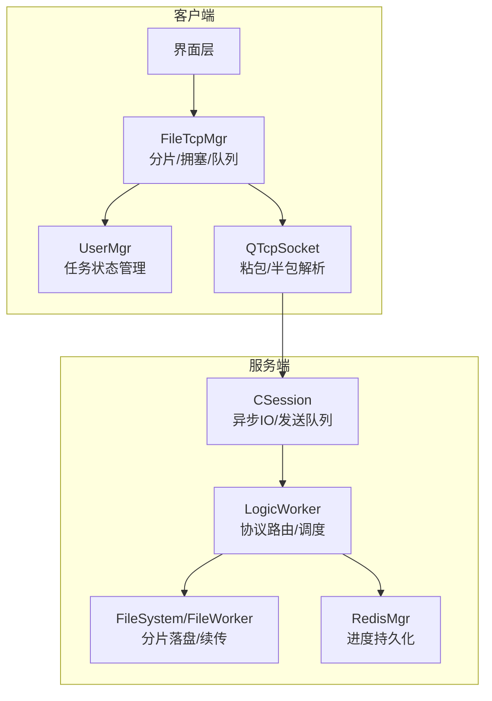
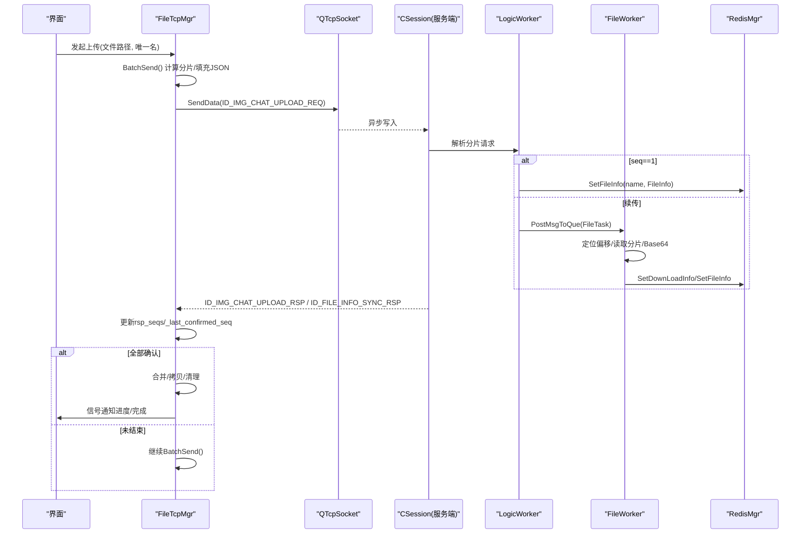
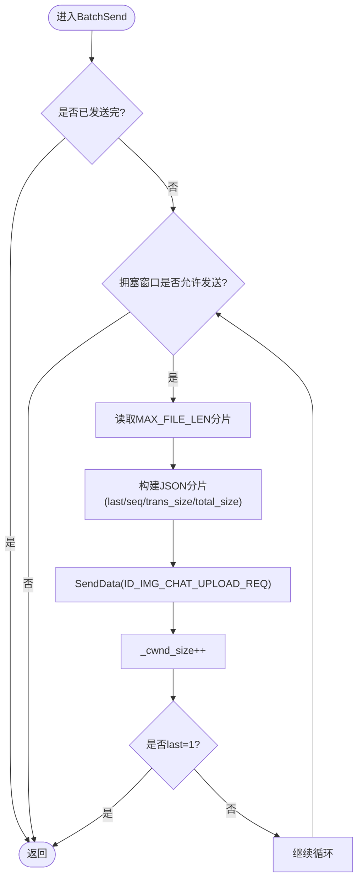
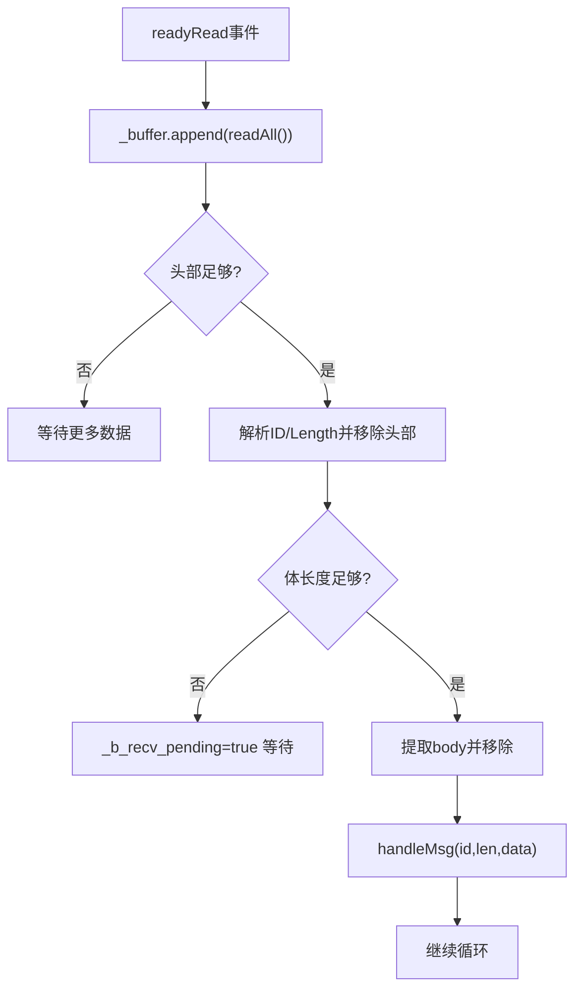
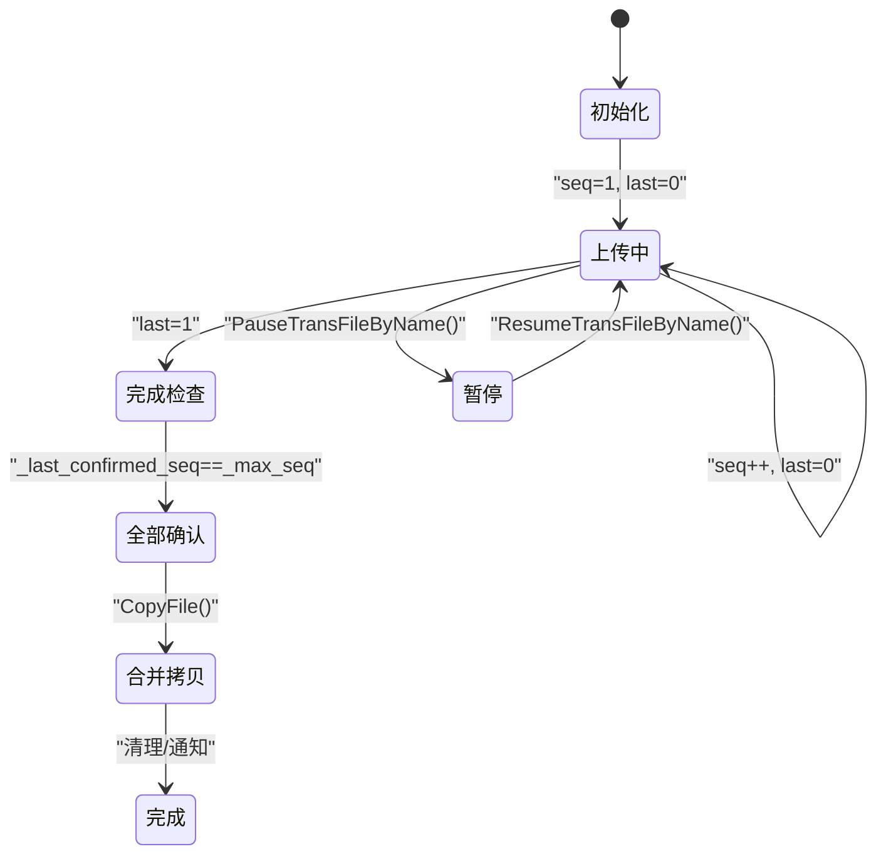
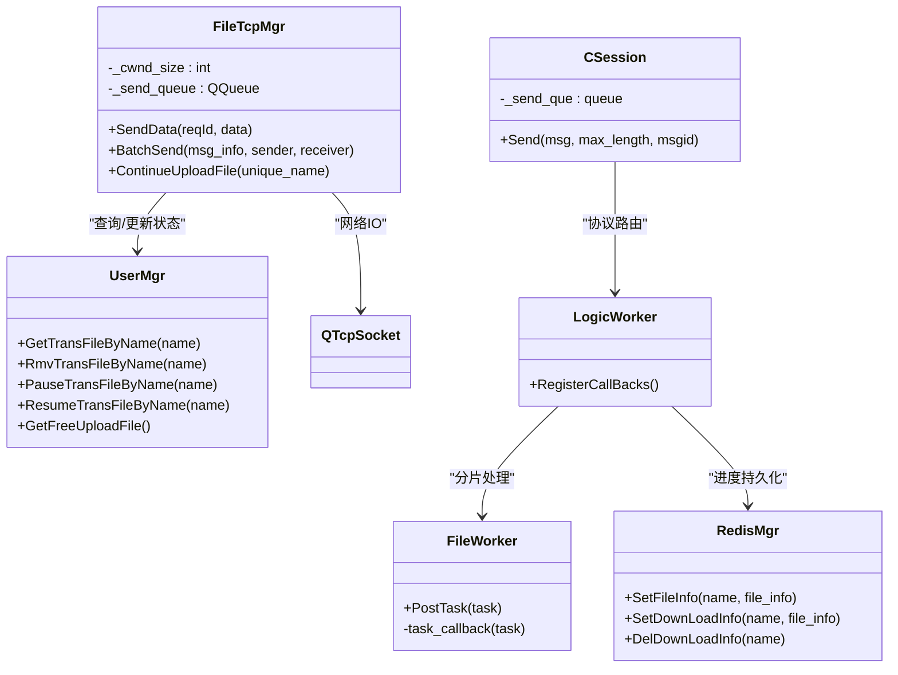

# 分片上传系统

<cite>
**本文引用的文件**   
- [filetcpmgr.h](file://client/llfcchat/include/filetcpmgr.h)
- [filetcpmgr.cpp](file://client/llfcchat/src/filetcpmgr.cpp)
- [global.h](file://client/llfcchat/include/global.h)
- [userdata.h](file://client/llfcchat/include/userdata.h)
- [CSession.cpp](file://server/ResourceServer/src/CSession.cpp)
- [RedisMgr.cpp](file://server/ResourceServer/src/RedisMgr.cpp)
- [LogicWorker.cpp](file://server/ResourceServer/src/LogicWorker.cpp)
- [FileWorker.cpp](file://server/ResourceServer/src/FileWorker.cpp)
- [day38-断点续传.md](file://开发文档/day38-断点续传.md)
- [更新记录.md](file://更新记录.md)
</cite>

## 目录
1. [简介](#简介)
2. [项目结构](#项目结构)
3. [核心组件](#核心组件)
4. [架构总览](#架构总览)
5. [详细组件分析](#详细组件分析)
6. [依赖关系分析](#依赖关系分析)
7. [性能考量](#性能考量)
8. [故障排查指南](#故障排查指南)
9. [结论](#结论)
10. [附录](#附录)

## 简介
本技术文档面向LLFCChat的分片上传子系统，系统性阐述文件分片算法、分片大小策略、并发与拥塞控制、BatchSend工作原理、消息队列管理、顺序保证与完整性校验、分片缓存与I/O优化、状态机设计、错误处理方案，并提供集成示例与性能调优建议。读者可据此快速理解并扩展该模块。

## 项目结构
分片上传涉及客户端与服务端两端的协作：
- 客户端侧：FileTcpMgr负责TCP连接、粘包/半包解析、发送队列、拥塞窗口控制、批量分片发送与续传；UserMgr维护传输任务状态（序列号、已确认序列、飞行中集合等）。
- 服务端侧：ResourceServer的CSession负责异步IO与发送队列；LogicWorker/FileSystem/FileWorker负责分片写入、断点续传、Redis持久化；RedisMgr用于存储上传/下载进度信息。

**图示来源** 
- [filetcpmgr.cpp:1-143](file://client/llfcchat/src/filetcpmgr.cpp#L1-L143)
- [CSession.cpp:49-92](file://server/ResourceServer/src/CSession.cpp#L49-L92)
- [LogicWorker.cpp:532-570](file://server/ResourceServer/src/LogicWorker.cpp#L532-L570)
- [FileWorker.cpp:552-633](file://server/ResourceServer/src/FileWorker.cpp#L552-L633)
- [RedisMgr.cpp:498-536](file://server/ResourceServer/src/RedisMgr.cpp#L498-L536)

**章节来源**
- [filetcpmgr.h:1-85](file://client/llfcchat/include/filetcpmgr.h#L1-L85)
- [filetcpmgr.cpp:1-143](file://client/llfcchat/src/filetcpmgr.cpp#L1-L143)
- [CSession.cpp:49-92](file://server/ResourceServer/src/CSession.cpp#L49-L92)

## 核心组件
- FileTcpMgr：封装TCP收发、粘包/半包处理、发送队列、拥塞窗口_cwnd_size、批量分片发送BatchSend、续传ContinueUploadFile、下载流程。
- UserMgr：维护MsgInfo（文件名、MD5、总大小、当前序列、已确认序列、飞行中集合、响应集合、传输状态等），提供暂停/恢复/查询接口。
- CSession：服务端会话，维护发送队列与异步写，避免阻塞。
- LogicWorker：服务端协议路由，将上传/续传请求分发到文件系统工作流，并维护Redis中的断点信息。
- FileWorker：按分片偏移读取文件、Base64编码、判断是否最后分片、更新Redis进度。
- RedisMgr：以键值形式保存上传/下载进度（seq、trans_size、total_size等），支持过期时间。

**章节来源**
- [filetcpmgr.h:26-85](file://client/llfcchat/include/filetcpmgr.h#L26-L85)
- [filetcpmgr.cpp:925-996](file://client/llfcchat/src/filetcpmgr.cpp#L925-L996)
- [usermgr.cpp:474-564](file://client/llfcchat/src/usermgr.cpp#L474-L564)
- [CSession.cpp:49-92](file://server/ResourceServer/src/CSession.cpp#L49-L92)
- [LogicWorker.cpp:532-570](file://server/ResourceServer/src/LogicWorker.cpp#L532-L570)
- [FileWorker.cpp:552-633](file://server/ResourceServer/src/FileWorker.cpp#L552-L633)
- [RedisMgr.cpp:498-536](file://server/ResourceServer/src/RedisMgr.cpp#L498-L536)

## 架构总览
分片上传端到端流程如下：
- 客户端计算文件MD5与分片总数，初始化MsgInfo，设置初始_seq=1。
- BatchSend根据拥塞窗口_cwnd_size循环读取MAX_FILE_LEN字节，构造JSON分片（含md5/name/seq/trans_size/total_size/last/data/last_seq/uid等），通过SendData进入发送队列。
- 服务端CSession接收后交由LogicWorker解析，首次分片创建FileInfo并持久化至Redis；后续分片直接落盘并更新Redis。
- 客户端收到ID_IMG_CHAT_UPLOAD_RSP或ID_FILE_INFO_SYNC_RSP后，更新flighting_seqs/rsp_seqs，推进_last_confirmed_seq，若达到_max_seq则完成合并与拷贝，触发下一个待传任务。

**图示来源** 
- [filetcpmgr.cpp:925-996](file://client/llfcchat/src/filetcpmgr.cpp#L925-L996)
- [filetcpmgr.cpp:1002-1076](file://client/llfcchat/src/filetcpmgr.cpp#L1002-L1076)
- [LogicWorker.cpp:532-570](file://server/ResourceServer/src/LogicWorker.cpp#L532-L570)
- [FileWorker.cpp:552-633](file://server/ResourceServer/src/FileWorker.cpp#L552-L633)
- [RedisMgr.cpp:498-536](file://server/ResourceServer/src/RedisMgr.cpp#L498-L536)

## 详细组件分析

### 分片算法与分片大小策略
- 分片大小：固定为MAX_FILE_LEN（常量定义见全局头文件），每次读取固定长度，最后一个分片可能小于该值。
- 分片序号：从1开始递增，_max_seq由(total_size + MAX_FILE_LEN - 1) / MAX_FILE_LEN计算得出。
- 最后分片标记：当buffer.size() + (seq-1)*MAX_FILE_LEN >= total_size时，last=1，否则last=0。
- 分片内容：数据体采用Base64编码，便于JSON传输。

复杂度与特性：
- 时间复杂度：O(N)，N为分片数；每次分片读取固定长度，网络与磁盘I/O线性。
- 空间复杂度：O(MAX_FILE_LEN)内存缓冲，配合Base64放大系数约1.33倍。

**章节来源**
- [global.h:167-175](file://client/llfcchat/include/global.h#L167-L175)
- [filetcpmgr.cpp:925-996](file://client/llfcchat/src/filetcpmgr.cpp#L925-L996)
- [filetcpmgr.cpp:1002-1076](file://client/llfcchat/src/filetcpmgr.cpp#L1002-L1076)

### 并发上传控制与BatchSend工作原理
- 拥塞窗口：_cwnd_size表示“正在飞行”的分片数量，限制同时未确认的分片上限。
- 发送循环：for (; MAX_CWND_SIZE - _cwnd_size > 0; )，每次循环递增_seq，插入_flighting_seqs，读取分片并发送，完成后_cwnd_size++。
- 完成条件：遇到last=1即break，避免多余读取。
- 回包处理：收到ID_IMG_CHAT_UPLOAD_RSP或ID_FILE_INFO_SYNC_RSP时_cwnd_size--，并更新rsp_seqs与_last_confirmed_seq。

**图示来源** 
- [filetcpmgr.cpp:925-996](file://client/llfcchat/src/filetcpmgr.cpp#L925-L996)

**章节来源**
- [filetcpmgr.cpp:925-996](file://client/llfcchat/src/filetcpmgr.cpp#L925-L996)
- [更新记录.md:226-292](file://更新记录.md#L226-L292)

### 消息队列管理与粘包/半包处理
- 客户端发送队列：QQueue<QByteArray>_send_queue，bytesWritten回调驱动出队与重发。
- 接收解析：readyRead中循环读取，先解析头部（消息ID+长度），再按长度读取体，使用remove避免mid拷贝开销。
- 粘包/半包：通过_buffer.size()与_message_len比较，不足则等待更多数据；解析头部后移除已读部分，避免重复分配。

**图示来源** 
- [filetcpmgr.cpp:16-55](file://client/llfcchat/src/filetcpmgr.cpp#L16-L55)

**章节来源**
- [filetcpmgr.cpp:16-55](file://client/llfcchat/src/filetcpmgr.cpp#L16-L55)
- [filetcpmgr.cpp:186-221](file://client/llfcchat/src/filetcpmgr.cpp#L186-L221)

### 分片合并机制、顺序保证与完整性验证
- 顺序保证：基于_seq严格递增，服务端按seq写入对应偏移；客户端通过flighting_seqs与rsp_seqs跟踪未确认与已确认序列。
- 完整性验证：
  - 客户端：当_last_confirmed_seq == _max_seq时认为全部确认，执行合并与拷贝。
  - 服务端：FileWorker在续传时校验seq一致性，防止乱序或越界。
- 合并策略：客户端在全部确认后，将临时文件拷贝到用户资源目录（如chatimg/uid/文件名），确保最终一致性。

**图示来源** 
- [filetcpmgr.cpp:435-519](file://client/llfcchat/src/filetcpmgr.cpp#L435-L519)
- [filetcpmgr.cpp:521-608](file://client/llfcchat/src/filetcpmgr.cpp#L521-L608)
- [FileWorker.cpp:552-633](file://server/ResourceServer/src/FileWorker.cpp#L552-L633)

**章节来源**
- [filetcpmgr.cpp:435-519](file://client/llfcchat/src/filetcpmgr.cpp#L435-L519)
- [filetcpmgr.cpp:521-608](file://client/llfcchat/src/filetcpmgr.cpp#L521-L608)
- [FileWorker.cpp:552-633](file://server/ResourceServer/src/FileWorker.cpp#L552-L633)

### 分片缓存策略、内存优化与磁盘I/O优化
- 内存优化：
  - 接收缓冲区使用remove而非mid，减少拷贝。
  - Base64编码仅在必要时进行，避免额外大对象频繁分配。
- 磁盘I/O优化：
  - 客户端按固定分片大小seek读取，避免全量加载。
  - 服务端FileWorker按offset定位读取，减少随机I/O。
- 缓存策略：
  - 服务端Redis持久化上传/下载进度（seq、trans_size、total_size），支持过期时间，避免长时间占用内存。
  - 客户端UserMgr维护_msg_info映射，支持暂停/恢复与多任务并发。

**章节来源**
- [filetcpmgr.cpp:16-55](file://client/llfcchat/src/filetcpmgr.cpp#L16-L55)
- [FileWorker.cpp:552-633](file://server/ResourceServer/src/FileWorker.cpp#L552-L633)
- [RedisMgr.cpp:498-536](file://server/ResourceServer/src/RedisMgr.cpp#L498-L536)
- [usermgr.cpp:474-564](file://client/llfcchat/src/usermgr.cpp#L474-L564)

### 续传与断点恢复
- 客户端续传：slot_continue_upload_file将_seq重置为_last_confirmed_seq，重新组织分片发送，使用ID_IMG_CHAT_CONTINUE_UPLOAD_REQ。
- 服务端续传：LogicWorker解析续传请求，FileWorker从Redis获取FileInfo，校验seq一致后按offset读取并续写。
- 进度同步：ID_FILE_INFO_SYNC_RSP携带最新seq与trans_size，客户端更新本地状态并继续发送。

**章节来源**
- [filetcpmgr.cpp:1002-1076](file://client/llfcchat/src/filetcpmgr.cpp#L1002-L1076)
- [LogicWorker.cpp:532-570](file://server/ResourceServer/src/LogicWorker.cpp#L532-L570)
- [FileWorker.cpp:552-633](file://server/ResourceServer/src/FileWorker.cpp#L552-L633)
- [day38-断点续传.md:479-631](file://开发文档/day38-断点续传.md#L479-L631)

### 错误处理方案
- 网络错误：QTcpSocket::error分支处理连接拒绝、远程关闭、主机未找到、超时等，触发sig_con_success(false)。
- 解析错误：JSON解析失败时记录日志并忽略，避免崩溃。
- 文件错误：打开文件失败时输出警告并返回；写入失败时记录期望与实际字节数差异。
- 服务异常：服务端Redis读写失败时返回错误码，客户端根据错误码提示或重试。

**章节来源**
- [filetcpmgr.cpp:65-93](file://client/llfcchat/src/filetcpmgr.cpp#L65-L93)
- [filetcpmgr.cpp:246-332](file://client/llfcchat/src/filetcpmgr.cpp#L246-L332)
- [filetcpmgr.cpp:334-433](file://client/llfcchat/src/filetcpmgr.cpp#L334-L433)
- [LogicWorker.cpp:532-570](file://server/ResourceServer/src/LogicWorker.cpp#L532-L570)

## 依赖关系分析
- 客户端依赖：
  - FileTcpMgr依赖UserMgr获取/更新传输状态，依赖QTcpSocket进行网络通信。
  - MsgInfo定义于global.h，包含分片计数与状态字段。
- 服务端依赖：
  - CSession依赖Boost.Asio进行异步IO。
  - LogicWorker依赖RedisMgr进行进度持久化，依赖FileWorker进行分片读取与写入。
  - FileWorker依赖文件系统API进行偏移读取与Base64编码。

**图示来源** 
- [filetcpmgr.h:26-85](file://client/llfcchat/include/filetcpmgr.h#L26-L85)
- [usermgr.cpp:474-564](file://client/llfcchat/src/usermgr.cpp#L474-L564)
- [CSession.cpp:49-92](file://server/ResourceServer/src/CSession.cpp#L49-L92)
- [LogicWorker.cpp:532-570](file://server/ResourceServer/src/LogicWorker.cpp#L532-L570)
- [FileWorker.cpp:552-633](file://server/ResourceServer/src/FileWorker.cpp#L552-L633)
- [RedisMgr.cpp:498-536](file://server/ResourceServer/src/RedisMgr.cpp#L498-L536)

**章节来源**
- [filetcpmgr.h:26-85](file://client/llfcchat/include/filetcpmgr.h#L26-L85)
- [usermgr.cpp:474-564](file://client/llfcchat/src/usermgr.cpp#L474-L564)
- [CSession.cpp:49-92](file://server/ResourceServer/src/CSession.cpp#L49-L92)
- [LogicWorker.cpp:532-570](file://server/ResourceServer/src/LogicWorker.cpp#L532-L570)
- [FileWorker.cpp:552-633](file://server/ResourceServer/src/FileWorker.cpp#L552-L633)
- [RedisMgr.cpp:498-536](file://server/ResourceServer/src/RedisMgr.cpp#L498-L536)

## 性能考量
- 分片大小选择：MAX_FILE_LEN需权衡网络MTU与CPU开销，过大导致Base64放大与内存压力，过小增加握手与序列化开销。
- 拥塞窗口调优：MAX_CWND_SIZE影响吞吐与延迟，可根据带宽与RTT动态调整。
- I/O优化：避免频繁小文件操作，尽量顺序读写；使用reserve预分配缓冲区；减少mid调用，优先remove。
- 序列化优化：Base64编码仅在必要路径进行；JSON对象复用可减少分配。
- 并发模型：服务端Asio IOServicePool提升并发能力；客户端线程隔离FileTcpThread避免阻塞UI。

[本节为通用指导，不直接分析具体文件]

## 故障排查指南
- 常见问题：
  - 粘包/半包：检查readyRead循环与_buffer管理，确保头部与体长度匹配。
  - 分片丢失：核对flighting_seqs与rsp_seqs，确认_cwnd_size增减逻辑。
  - 续传失败：检查Redis中FileInfo是否存在且seq一致。
  - 文件损坏：对比total_size与trans_size，确认last标记正确。
- 调试建议：
  - 打印关键变量：seq、trans_size、total_size、last、_cwnd_size。
  - 观察网络层：抓包确认分片顺序与ACK。
  - 检查服务端日志：Redis存取与FileWorker读取偏移。

**章节来源**
- [filetcpmgr.cpp:16-55](file://client/llfcchat/src/filetcpmgr.cpp#L16-L55)
- [filetcpmgr.cpp:435-519](file://client/llfcchat/src/filetcpmgr.cpp#L435-L519)
- [FileWorker.cpp:552-633](file://server/ResourceServer/src/FileWorker.cpp#L552-L633)

## 结论
LLFCChat分片上传系统通过固定分片大小、拥塞窗口控制、严格的序列号与确认机制，实现了高可靠、可中断续传的文件传输。客户端与服务端职责清晰，Redis提供跨进程进度持久化，整体架构具备良好的可扩展性与性能潜力。开发者可在此基础上进一步优化分片大小、拥塞算法与I/O路径，以满足不同场景需求。

[本节为总结性内容，不直接分析具体文件]

## 附录
- 集成示例要点：
  - 初始化MsgInfo并设置transfer_type与transfer_state。
  - 调用BatchSend启动上传，监听sig_update_upload_progress更新UI。
  - 处理ID_IMG_CHAT_UPLOAD_RSP与ID_FILE_INFO_SYNC_RSP推进状态。
  - 实现暂停/恢复逻辑，调用PauseTransFileByName与ResumeTransFileByName。
- 配置项参考：
  - MAX_FILE_LEN：分片大小（字节）
  - MAX_CWND_SIZE：最大并发分片数
  - Redis过期时间：上传/下载进度键的生存周期

[本节为补充说明，不直接分析具体文件]