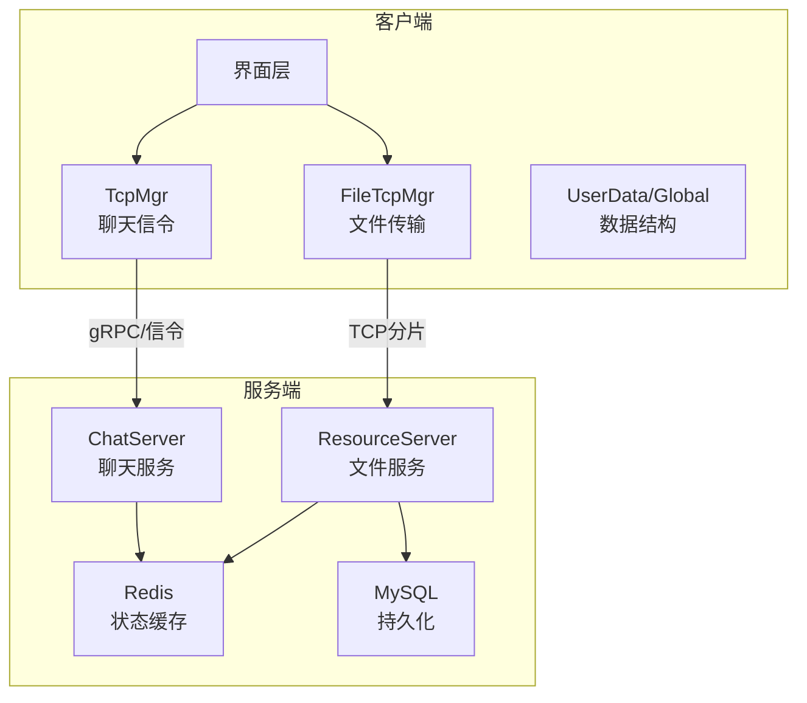
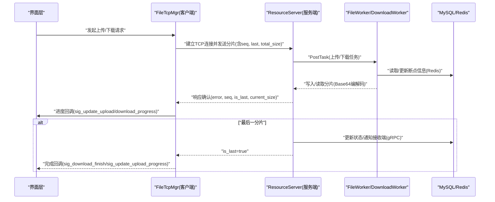
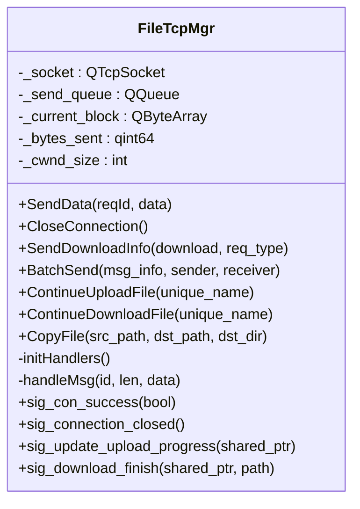
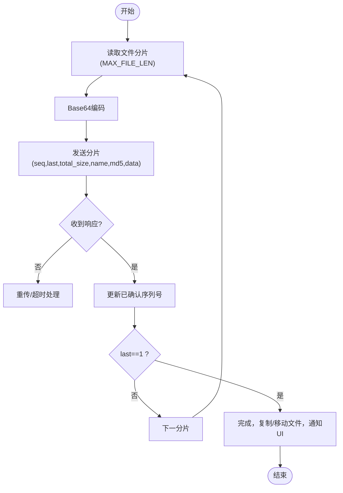
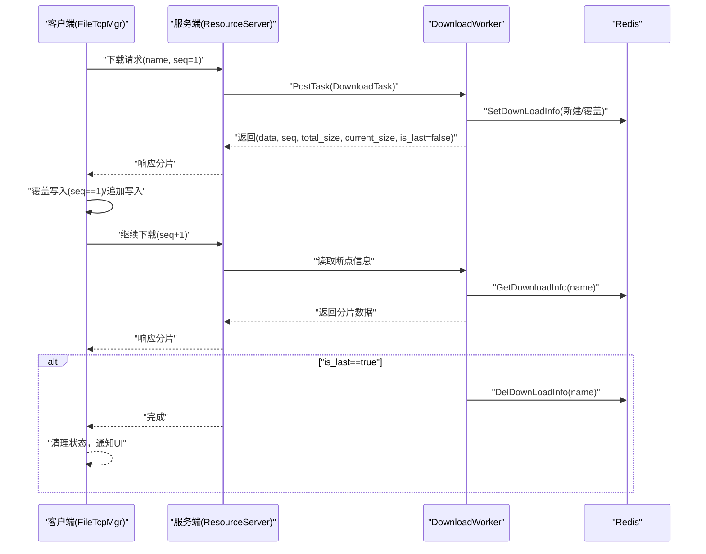
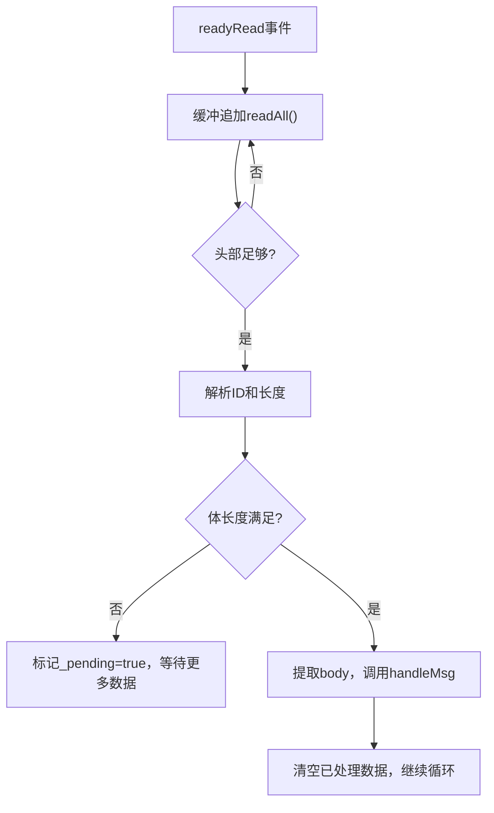
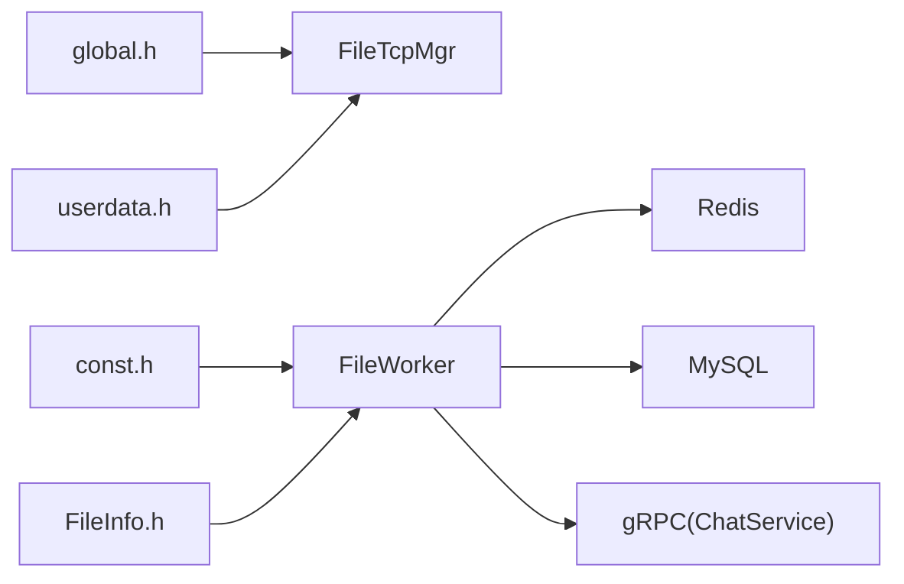

# 文件传输

<cite>
**本文引用的文件**   
- [filetcpmgr.h](file://client/llfcchat/include/filetcpmgr.h)
- [filetcpmgr.cpp](file://client/llfcchat/src/filetcpmgr.cpp)
- [tcpmgr.h](file://client/llfcchat/include/tcpmgr.h)
- [tcpmgr.cpp](file://client/llfcchat/src/tcpmgr.cpp)
- [global.h](file://client/llfcchat/include/global.h)
- [userdata.h](file://client/llfcchat/include/userdata.h)
- [FileWorker.h](file://server/ResourceServer/include/FileWorker.h)
- [FileWorker.cpp](file://server/ResourceServer/src/FileWorker.cpp)
- [FileInfo.h](file://server/ResourceServer/include/FileInfo.h)
- [const.h](file://server/ResourceServer/include/const.h)
- [message.proto（资源服务）](file://server/proto/resource/message.proto)
- [message.proto（聊天服务）](file://server/proto/chat/message.proto)
</cite>

## 目录
1. [简介](#简介)
2. [项目结构](#项目结构)
3. [核心组件](#核心组件)
4. [架构总览](#架构总览)
5. [详细组件分析](#详细组件分析)
6. [依赖关系分析](#依赖关系分析)
7. [性能与优化](#性能与优化)
8. [故障排查指南](#故障排查指南)
9. [结论](#结论)
10. [附录：协议与API规范](#附录协议与api规范)

## 简介
本技术文档围绕 LLFCChat 的文件传输子系统，系统性阐述断点续传、分片上传、进度跟踪、并发控制、拥塞窗口、消息队列、错误恢复与重试等关键实现。重点解析客户端 FileTcpMgr 单例设计、TCP 连接管理、消息分发机制；以及服务端 ResourceServer 的 FileWorker/DownloadWorker 工作线程模型、Redis 状态持久化、Base64 编解码、分片读写策略。同时提供完整的 API 接口说明、错误码定义、调试技巧与常见问题定位方法，帮助开发者快速集成与排障。

## 项目结构
- 客户端（Qt/C++）
  - TCP 通用管理器 TcpMgr：负责聊天信令与基础消息收发
  - 文件传输管理器 FileTcpMgr：基于 QTcpSocket 的分片上传/下载、断点续传、进度回调
  - 全局常量与数据结构 global.h：消息 ID、错误码、传输状态、分片大小等
  - 用户数据与消息类型 userdata.h：MsgInfo、ImgChatData、ChatThreadData 等
- 服务端（C++ Asio + gRPC + Redis + MySQL）
  - ResourceServer：文件存储、分片读写、断点续传、头像/图片上传、下载分片读取
  - ChatServer：聊天信令、消息通知（通过 gRPC 通知接收端）
  - Proto：gRPC 接口定义（NotifyChatImgMsg 等）

**图表来源** 
- [filetcpmgr.h:26-82](file://client/llfcchat/include/filetcpmgr.h#L26-L82)
- [tcpmgr.h:22-87](file://client/llfcchat/include/tcpmgr.h#L22-L87)
- [FileWorker.h:58-88](file://server/ResourceServer/include/FileWorker.h#L58-L88)
- [const.h:72-95](file://server/ResourceServer/include/const.h#L72-L95)

**章节来源**
- [filetcpmgr.h:26-82](file://client/llfcchat/include/filetcpmgr.h#L26-L82)
- [tcpmgr.h:22-87](file://client/llfcchat/include/tcpmgr.h#L22-L87)
- [global.h:15-24](file://client/llfcchat/include/global.h#L15-L24)
- [global.h:43-88](file://client/llfcchat/include/global.h#L43-L88)
- [const.h:72-95](file://server/ResourceServer/include/const.h#L72-L95)

## 核心组件
- FileTcpMgr（客户端）
  - 单例模式，封装 QTcpSocket 生命周期、粘包处理、发送队列、拥塞窗口控制
  - 支持上传头像、聊天图片、普通文件；支持下载分片与断点续传
  - 信号槽驱动：连接成功、断开、进度更新、完成回调
- TcpMgr（客户端）
  - 统一聊天信令通道，处理登录、好友、聊天消息、心跳等
- FileWorker / DownloadWorker（服务端）
  - 独立工作线程，任务队列+条件变量调度
  - 上传：Base64 解码、按 seq 覆盖或追加写入、最后分片后更新数据库并通知接收方
  - 下载：从 Redis 获取断点信息，按偏移量读取分片，Base64 编码返回，更新 Redis 进度

**章节来源**
- [filetcpmgr.h:26-82](file://client/llfcchat/include/filetcpmgr.h#L26-L82)
- [filetcpmgr.cpp:175-221](file://client/llfcchat/src/filetcpmgr.cpp#L175-L221)
- [tcpmgr.h:22-87](file://client/llfcchat/include/tcpmgr.h#L22-L87)
- [FileWorker.h:58-88](file://server/ResourceServer/include/FileWorker.h#L58-L88)
- [FileWorker.cpp:49-112](file://server/ResourceServer/src/FileWorker.cpp#L49-L112)

## 架构总览
文件传输采用“客户端直连资源服务器”的分片流式传输方案，结合 Redis 做断点续传状态持久化，gRPC 用于聊天侧的消息通知。

**图表来源** 
- [filetcpmgr.cpp:243-332](file://client/llfcchat/src/filetcpmgr.cpp#L243-L332)
- [filetcpmgr.cpp:334-433](file://client/llfcchat/src/filetcpmgr.cpp#L334-L433)
- [FileWorker.cpp:51-112](file://server/ResourceServer/src/FileWorker.cpp#L51-L112)
- [FileWorker.cpp:528-662](file://server/ResourceServer/src/FileWorker.cpp#L528-L662)

## 详细组件分析

### FileTcpMgr 类图与职责
- 继承 QObject、Singleton<FileTcpMgr>，使用 enable_shared_from_this
- 成员包括 QTcpSocket、发送队列、当前块、已发送字节数、拥塞窗口、处理器映射
- 信号：连接成功/失败、断开、进度更新、完成回调
- 主要方法：SendData、CloseConnection、SendDownloadInfo、BatchSend、ContinueUpload/DownloadFile、CopyFile

**图表来源** 
- [filetcpmgr.h:26-82](file://client/llfcchat/include/filetcpmgr.h#L26-L82)

**章节来源**
- [filetcpmgr.h:26-82](file://client/llfcchat/include/filetcpmgr.h#L26-L82)
- [filetcpmgr.cpp:175-221](file://client/llfcchat/src/filetcpmgr.cpp#L175-L221)

### 上传流程（头像/聊天图片/普通文件）
- 客户端将文件按 MAX_FILE_LEN 分片，逐片 Base64 编码，携带 seq、last、total_size、name、md5 等字段
- 服务端 FileWorker 根据 seq=1 覆盖写，后续追加写；last=1 时完成，更新数据库并通知接收端
- 客户端收到响应后更新 _rsp_seqs/_flighting_seqs/_last_confirmed_seq，计算进度并触发 UI 更新

**图表来源** 
- [filetcpmgr.cpp:243-332](file://client/llfcchat/src/filetcpmgr.cpp#L243-L332)
- [FileWorker.cpp:51-112](file://server/ResourceServer/src/FileWorker.cpp#L51-L112)

**章节来源**
- [filetcpmgr.cpp:243-332](file://client/llfcchat/src/filetcpmgr.cpp#L243-L332)
- [FileWorker.cpp:51-112](file://server/ResourceServer/src/FileWorker.cpp#L51-L112)

### 下载流程（断点续传）
- 客户端首次下载：请求 seq=1，服务端返回 total_size、current_size、is_last=false
- 后续分片：客户端携带上次 seq 继续请求，服务端从 Redis 读取断点信息，按偏移量读取分片并 Base64 编码返回
- 客户端按 seq 决定覆盖/追加写入，更新 current_size，直到 is_last=true 完成

**图表来源** 
- [filetcpmgr.cpp:334-433](file://client/llfcchat/src/filetcpmgr.cpp#L334-L433)
- [FileWorker.cpp:528-662](file://server/ResourceServer/src/FileWorker.cpp#L528-L662)

**章节来源**
- [filetcpmgr.cpp:334-433](file://client/llfcchat/src/filetcpmgr.cpp#L334-L433)
- [FileWorker.cpp:528-662](file://server/ResourceServer/src/FileWorker.cpp#L528-L662)

### 消息队列与粘包处理
- 接收：readyRead 将所有数据追加到缓冲区，循环解析头部（ID+长度），再解析体，避免粘包/半包
- 发送：bytesWritten 回调累计已发送字节，未发完则继续 write；队列为空则重置 pending 标志

**图表来源** 
- [tcpmgr.cpp:18-55](file://client/llfcchat/src/tcpmgr.cpp#L18-L55)
- [filetcpmgr.cpp:16-55](file://client/llfcchat/src/filetcpmgr.cpp#L16-L55)

**章节来源**
- [tcpmgr.cpp:18-55](file://client/llfcchat/src/tcpmgr.cpp#L18-L55)
- [filetcpmgr.cpp:16-55](file://client/llfcchat/src/filetcpmgr.cpp#L16-L55)

### 拥塞窗口与并发控制
- 客户端维护 _cwnd_size 控制并发分片数量，MAX_CWND_SIZE 限制最大并发
- 每收到一个响应，_cwnd_size--，若仍小于上限且仍有待发送分片，则继续 BatchSend

**章节来源**
- [global.h:22-24](file://client/llfcchat/include/global.h#L22-L24)
- [filetcpmgr.cpp:521-608](file://client/llfcchat/src/filetcpmgr.cpp#L521-L608)

### 错误恢复与重试机制
- 网络错误分类处理：连接拒绝、远程关闭、主机未找到、超时等
- 分片级 ACK：通过 _rsp_seqs/_flighting_seqs 追踪已确认与飞行中分片，支持超时重传扩展
- 断点续传：Redis 保存 seq 与 trans_size，异常中断后可从断点恢复

**章节来源**
- [tcpmgr.cpp:64-91](file://client/llfcchat/src/tcpmgr.cpp#L64-L91)
- [filetcpmgr.cpp:435-519](file://client/llfcchat/src/filetcpmgr.cpp#L435-L519)
- [FileWorker.cpp:576-600](file://server/ResourceServer/src/FileWorker.cpp#L576-L600)

## 依赖关系分析
- 客户端依赖
  - global.h：ReqId、ErrorCodes、MsgType、TransferState、MAX_FILE_LEN、MAX_CWND_SIZE
  - userdata.h：MsgInfo、ImgChatData、ChatThreadData
  - Qt：QTcpSocket、QQueue、QByteArray、QJsonDocument
- 服务端依赖
  - const.h：MSG_IDS、ErrorCodes、MAX_FILE_LEN、工作线程数量
  - FileInfo.h：FileInfo、ChatImgInfo
  - FileWorker.h/.cpp：FileTask、DownloadTask、FileWorker、DownloadWorker
  - Redis/MySQL：断点状态、用户信息、上传状态更新
  - gRPC：NotifyChatImgMsg 通知接收端

**图表来源** 
- [global.h:43-88](file://client/llfcchat/include/global.h#L43-L88)
- [const.h:72-95](file://server/ResourceServer/include/const.h#L72-L95)
- [FileWorker.h:58-88](file://server/ResourceServer/include/FileWorker.h#L58-L88)

**章节来源**
- [global.h:43-88](file://client/llfcchat/include/global.h#L43-L88)
- [const.h:72-95](file://server/ResourceServer/include/const.h#L72-L95)
- [FileWorker.h:58-88](file://server/ResourceServer/include/FileWorker.h#L58-L88)

## 性能与优化
- 分片大小：MAX_FILE_LEN=32KB，平衡内存占用与网络效率
- 并发控制：MAX_CWND_SIZE=5，避免拥塞与内存峰值
- 流式处理：边读边写，减少大文件内存拷贝
- Base64 编解码：仅在应用层使用，便于 JSON 传输；可考虑二进制协议优化
- 断点续传：Redis 持久化，降低重复传输成本
- I/O 异步：QTcpSocket 非阻塞 I/O，配合 bytesWritten 回调提升吞吐

[本节为通用性能建议，不直接分析具体文件]

## 故障排查指南
- 连接问题
  - 检查 host/port 配置，查看 error 信号分类（连接拒绝、主机未找到、超时）
- 粘包/半包
  - 确认头部解析逻辑（ID+长度），确保缓冲区处理正确
- 上传失败
  - 检查 Base64 解码结果、文件路径权限、磁盘空间
  - 关注 last 分片是否到达，数据库状态是否更新
- 下载失败
  - 检查 Redis 断点信息是否存在，seq 是否匹配
  - 确认文件偏移量未超出文件大小
- 进度不更新
  - 检查 _rsp_seqs/_flighting_seqs 更新逻辑，确认 _last_confirmed_seq 计算正确
  - 确认信号 sig_update_upload/download_progress 已连接 UI

**章节来源**
- [tcpmgr.cpp:64-91](file://client/llfcchat/src/tcpmgr.cpp#L64-L91)
- [filetcpmgr.cpp:435-519](file://client/llfcchat/src/filetcpmgr.cpp#L435-L519)
- [FileWorker.cpp:576-600](file://server/ResourceServer/src/FileWorker.cpp#L576-L600)

## 结论
LLFCChat 文件传输系统通过客户端 FileTcpMgr 与服务端 FileWorker/DownloadWorker 的协作，实现了稳定高效的分片上传/下载、断点续传、进度跟踪与错误恢复。结合 Redis 状态持久化与 gRPC 通知机制，系统在可靠性与性能之间取得良好平衡。开发者可依据本文档进行集成、调优与排障。

[本节为总结性内容，不直接分析具体文件]

## 附录：协议与API规范

### 消息 ID 与错误码
- 客户端 ReqId（部分）
  - ID_UPLOAD_HEAD_ICON_REQ/RSP：头像上传
  - ID_IMG_CHAT_UPLOAD_REQ/RSP：聊天图片上传
  - ID_IMG_CHAT_CONTINUE_UPLOAD_REQ/RSP：续传聊天图片
  - ID_IMG_CHAT_DOWN_REQ/RSP：聊天图片下载
  - ID_FILE_INFO_SYNC_REQ/RSP：文件信息同步
- 服务端 MSG_IDS（部分）
  - ID_UPLOAD_FILE_REQ/RSP：文件上传
  - ID_DOWN_LOAD_FILE_REQ/RSP：文件下载
  - ID_IMG_CHAT_*：图片相关
- 错误码
  - SUCCESS/ERR_JSON/ERR_NETWORK（客户端）
  - Success/Error_Json/RPCFailed/...（服务端）

**章节来源**
- [global.h:43-88](file://client/llfcchat/include/global.h#L43-L88)
- [const.h:5-29](file://server/ResourceServer/include/const.h#L5-L29)
- [const.h:72-95](file://server/ResourceServer/include/const.h#L72-L95)

### 分片协议字段
- 上传分片
  - name：文件名
  - seq：分片序号
  - last：是否最后一个分片
  - total_size：总大小
  - trans_size：已传输大小
  - md5：文件哈希
  - data：Base64 编码的分片数据
- 下载分片
  - seq：分片序号
  - total_size：总大小
  - current_size：当前已传输大小
  - is_last：是否最后一个分片
  - data：Base64 编码的分片数据

**章节来源**
- [filetcpmgr.cpp:243-332](file://client/llfcchat/src/filetcpmgr.cpp#L243-L332)
- [filetcpmgr.cpp:334-433](file://client/llfcchat/src/filetcpmgr.cpp#L334-L433)
- [FileWorker.cpp:528-662](file://server/ResourceServer/src/FileWorker.cpp#L528-L662)

### gRPC 通知接口
- NotifyChatImgMsg：通知接收端图片可用，包含 from_uid、to_uid、message_id、file_name、total_size、thread_id

**章节来源**
- [message.proto（聊天服务）:138-156](file://server/proto/chat/message.proto#L138-L156)
- [message.proto（资源服务）:138-156](file://server/proto/resource/message.proto#L138-L156)

### 客户端 API 示例（调用路径）
- 上传头像
  - FileTcpMgr::SendDownloadInfo -> handleMsg(ID_UPLOAD_HEAD_ICON_RSP) -> 组织分片 -> SendData
- 下载文件
  - FileTcpMgr::SendDownloadInfo -> handleMsg(ID_DOWN_LOAD_FILE_RSP) -> Base64 解码 -> 写入文件 -> 继续请求
- 聊天图片上传/续传
  - handleMsg(ID_IMG_CHAT_UPLOAD_RSP / ID_IMG_CHAT_CONTINUE_UPLOAD_RSP) -> 更新序列号 -> 批量发送

**章节来源**
- [filetcpmgr.cpp:243-332](file://client/llfcchat/src/filetcpmgr.cpp#L243-L332)
- [filetcpmgr.cpp:334-433](file://client/llfcchat/src/filetcpmgr.cpp#L334-L433)
- [filetcpmgr.cpp:521-608](file://client/llfcchat/src/filetcpmgr.cpp#L521-L608)