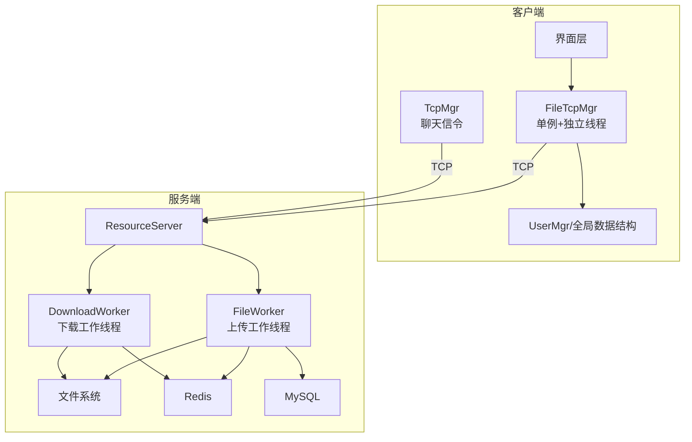
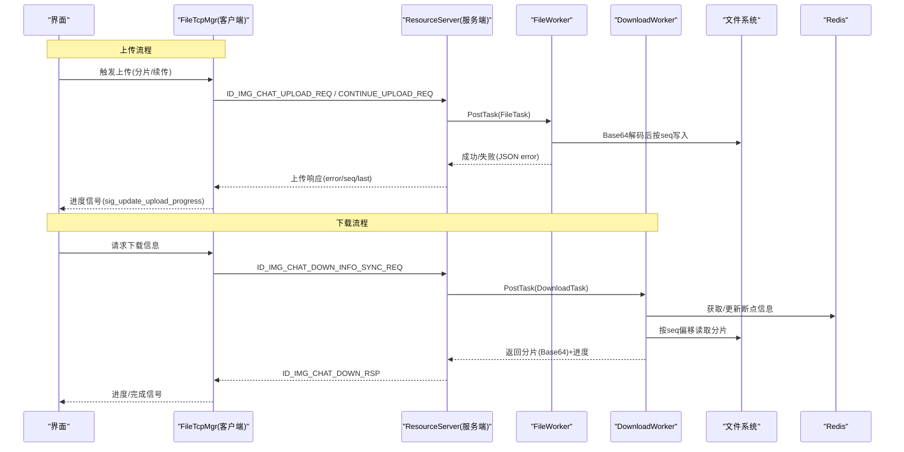
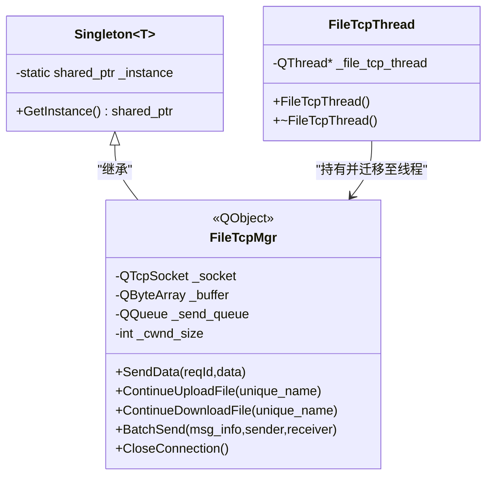
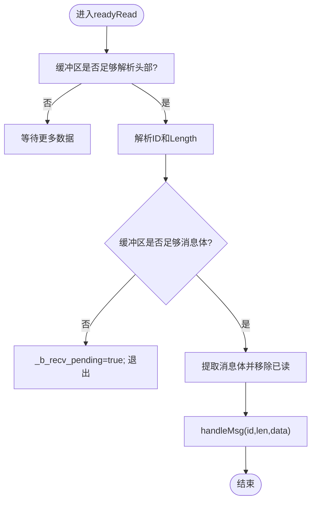
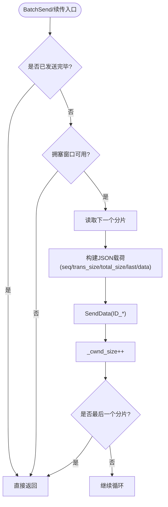
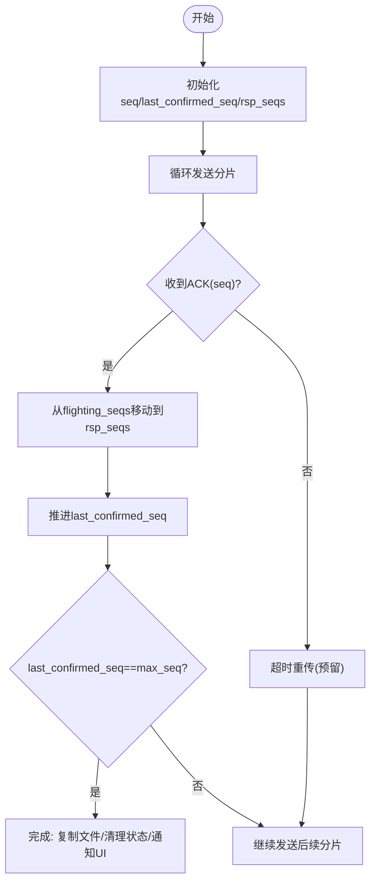
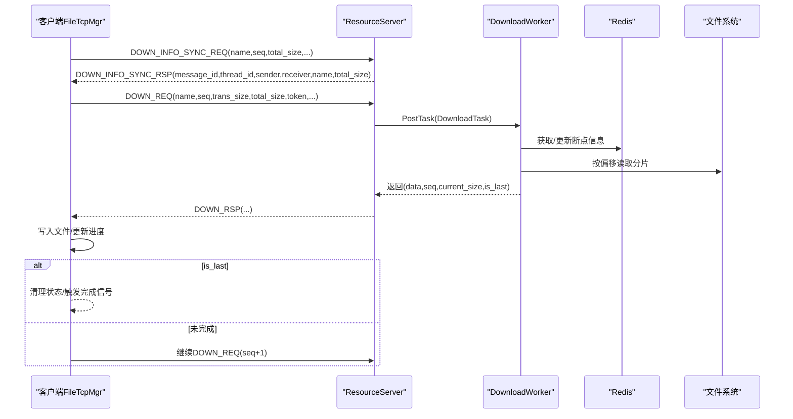
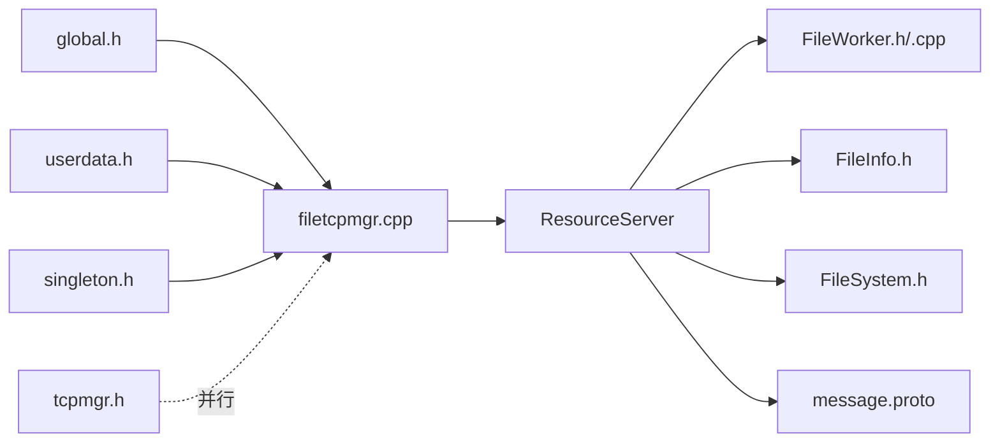

# 文件传输架构设计

<cite>
**本文引用的文件**   
- [filetcpmgr.h](file://client/llfcchat/include/filetcpmgr.h)
- [filetcpmgr.cpp](file://client/llfcchat/src/filetcpmgr.cpp)
- [singleton.h](file://client/llfcchat/include/singleton.h)
- [tcpmgr.h](file://client/llfcchat/include/tcpmgr.h)
- [global.h](file://client/llfcchat/include/global.h)
- [userdata.h](file://client/llfcchat/include/userdata.h)
- [FileWorker.h](file://server/ResourceServer/include/FileWorker.h)
- [FileWorker.cpp](file://server/ResourceServer/src/FileWorker.cpp)
- [FileInfo.h](file://server/ResourceServer/include/FileInfo.h)
- [FileSystem.h](file://server/ResourceServer/include/FileSystem.h)
- [message.proto](file://server/proto/resource/message.proto)
</cite>

## 目录
1. [简介](#简介)
2. [项目结构](#项目结构)
3. [核心组件](#核心组件)
4. [架构总览](#架构总览)
5. [详细组件分析](#详细组件分析)
6. [依赖关系分析](#依赖关系分析)
7. [性能考量](#性能考量)
8. [故障排查指南](#故障排查指南)
9. [结论](#结论)
10. [附录](#附录)

## 简介
本技术文档围绕 LLFCChat 的文件传输子系统，系统性阐述客户端 FileTcpMgr 的单例与多线程设计、TCP 连接管理与粘包处理、消息队列与拥塞控制、分片上传与断点续传、内存与 I/O 优化、完整性校验与错误恢复等关键机制。同时给出架构图与数据流图，帮助开发者快速理解整体设计与实现要点。

## 项目结构
- 客户端（Qt/C++）
  - 文件传输管理器：FileTcpMgr（单例、独立线程、TCP 收发、消息路由、进度回调）
  - 通用 TCP 管理器：TcpMgr（聊天信令通道，非本文件传输主路径）
  - 全局常量与数据结构：ReqId、MsgInfo、TransferType/State、DownloadInfo 等
  - 用户数据模型：ChatDataBase/ImgChatData/TextChatData 等
- 服务端（C++/Asio + JSON + Redis/Mysql）
  - 资源服务（ResourceServer）：FileWorker/DownloadWorker 工作线程池、任务分发、文件读写、Redis 状态持久化
  - 协议定义：resource/message.proto（图片通知、登录/状态等）

图表来源
- [filetcpmgr.h:26-82](file://client/llfcchat/include/filetcpmgr.h#L26-L82)
- [filetcpmgr.cpp:10-143](file://client/llfcchat/src/filetcpmgr.cpp#L10-L143)
- [FileWorker.h:58-88](file://server/ResourceServer/include/FileWorker.h#L58-L88)
- [FileWorker.cpp:12-47](file://server/ResourceServer/src/FileWorker.cpp#L12-L47)

章节来源
- [filetcpmgr.h:1-85](file://client/llfcchat/include/filetcpmgr.h#L1-L85)
- [filetcpmgr.cpp:1-143](file://client/llfcchat/src/filetcpmgr.cpp#L1-L143)
- [FileWorker.h:1-90](file://server/ResourceServer/include/FileWorker.h#L1-L90)
- [FileWorker.cpp:1-120](file://server/ResourceServer/src/FileWorker.cpp#L1-L120)

## 核心组件
- FileTcpMgr（客户端）
  - 单例模式：通过模板 Singleton<T> 提供全局唯一实例，线程安全初始化
  - 独立线程：FileTcpThread 将 FileTcpMgr 迁移到独立 QThread，避免阻塞 UI
  - TCP 管理：QTcpSocket 事件驱动，readyRead 粘包解析，bytesWritten 异步发送
  - 消息路由：_handlers 映射 ReqId 到处理函数，handleMsg 统一分发
  - 发送队列：QQueue 缓冲待发包，_pending/_current_block/_bytes_sent 控制半包发送
  - 拥塞控制：_cwnd_size 与 MAX_CWND_SIZE 限制并发分片数
  - 断点续传：基于 seq/last_confirmed_seq/flighting_seqs/rsp_seqs 的可靠重传与去重
  - 进度回调：sig_update_upload/download_progress、sig_download_finish 等信号
- 服务器端 FileWorker/DownloadWorker
  - 工作线程：std::thread + queue + condition_variable 实现任务队列
  - 上传处理：Base64 解码、按 seq 覆盖/追加写入、last 标记完成、更新数据库并通知
  - 下载处理：从 Redis 获取断点信息、按偏移读取、Base64 编码返回、更新进度或清理
  - 可靠性：序列号校验、偏移越界检查、错误码回传、异常路径保护

章节来源
- [singleton.h:18-44](file://client/llfcchat/include/singleton.h#L18-L44)
- [filetcpmgr.h:26-82](file://client/llfcchat/include/filetcpmgr.h#L26-L82)
- [filetcpmgr.cpp:10-143](file://client/llfcchat/src/filetcpmgr.cpp#L10-L143)
- [FileWorker.h:58-88](file://server/ResourceServer/include/FileWorker.h#L58-L88)
- [FileWorker.cpp:12-47](file://server/ResourceServer/src/FileWorker.cpp#L12-L47)

## 架构总览
下图展示客户端与服务端的交互流程，包括上传与下载两条主线，以及断点续传与进度反馈。

图表来源
- [filetcpmgr.cpp:243-896](file://client/llfcchat/src/filetcpmgr.cpp#L243-L896)
- [FileWorker.cpp:199-456](file://server/ResourceServer/src/FileWorker.cpp#L199-L456)
- [FileWorker.cpp:528-662](file://server/ResourceServer/src/FileWorker.cpp#L528-L662)

## 详细组件分析

### FileTcpMgr 单例与多线程
- 单例实现
  - 使用 Singleton<T> 模板类，内部采用 std::once_flag 保证线程安全的懒加载构造
  - 外部通过 GetInstance() 获取 shared_ptr<FileTcpMgr>
- 独立线程
  - FileTcpThread 创建 QThread 并将 FileTcpMgr moveToThread，所有 socket 事件与业务逻辑在子线程执行
  - 信号槽跨线程通信，UI 在主线程接收进度与完成信号
- 生命周期
  - 构造时注册元类型、绑定 socket 事件、初始化 handlers
  - 析构时关闭 socket 并释放资源

图表来源
- [singleton.h:18-44](file://client/llfcchat/include/singleton.h#L18-L44)
- [filetcpmgr.h:26-82](file://client/llfcchat/include/filetcpmgr.h#L26-L82)
- [filetcpmgr.cpp:1128-1140](file://client/llfcchat/src/filetcpmgr.cpp#L1128-L1140)

章节来源
- [singleton.h:1-46](file://client/llfcchat/include/singleton.h#L1-L46)
- [filetcpmgr.h:1-85](file://client/llfcchat/include/filetcpmgr.h#L1-L85)
- [filetcpmgr.cpp:1128-1140](file://client/llfcchat/src/filetcpmgr.cpp#L1128-L1140)

### TCP 连接与粘包处理
- 连接建立
  - slot_tcp_connect 设置 host/port 并 connectToHost
  - connected 信号触发 sig_con_success(true)
- 接收解析
  - readyRead 中循环读取，先解析固定长度头部（ID+Length），再按 Length 取体
  - 使用 QDataStream 解析，维护 _b_recv_pending 标志处理半包
- 发送控制
  - bytesWritten 回调累计 _bytes_sent，未发完继续写剩余部分
  - 队列为空则重置 _pending/_current_block/_bytes_sent；否则出队下一块继续写

图表来源
- [filetcpmgr.cpp:16-55](file://client/llfcchat/src/filetcpmgr.cpp#L16-L55)
- [filetcpmgr.cpp:106-133](file://client/llfcchat/src/filetcpmgr.cpp#L106-L133)

章节来源
- [filetcpmgr.cpp:16-133](file://client/llfcchat/src/filetcpmgr.cpp#L16-L133)

### 消息队列与拥塞控制
- 发送队列
  - SendData 将带头部的 block 入队或直接写出（若空闲）
  - _pending 防止并发写冲突
- 拥塞窗口
  - _cwnd_size 记录当前“飞行中”的分片数量
  - BatchSend/续传仅在 MAX_CWND_SIZE - _cwnd_size > 0 时继续发送
  - 收到响应后 _cwnd_size--，维持窗口稳定

图表来源
- [filetcpmgr.cpp:925-996](file://client/llfcchat/src/filetcpmgr.cpp#L925-L996)
- [filetcpmgr.cpp:1002-1076](file://client/llfcchat/src/filetcpmgr.cpp#L1002-L1076)

章节来源
- [filetcpmgr.cpp:186-221](file://client/llfcchat/src/filetcpmgr.cpp#L186-L221)
- [filetcpmgr.cpp:925-996](file://client/llfcchat/src/filetcpmgr.cpp#L925-L996)
- [filetcpmgr.cpp:1002-1076](file://client/llfcchat/src/filetcpmgr.cpp#L1002-L1076)

### 分片上传算法与断点续传
- 分片策略
  - 固定分片大小 MAX_FILE_LEN，seq 自增，last 标记末包
  - 首次上传使用 ID_IMG_CHAT_UPLOAD_REQ，续传使用 ID_IMG_CHAT_CONTINUE_UPLOAD_REQ
- 断点续传
  - 客户端维护 last_confirmed_seq、rsp_seqs、flighting_seqs
  - 收到服务器确认后将 flighting_seqs 中的 seq 移至 rsp_seqs，推进 last_confirmed_seq
  - 当 last_confirmed_seq == max_seq 视为完成，移动文件并清理状态
- 进度与回调
  - 每次确认更新 _rsp_size 并通过 sig_update_upload_progress 通知界面

图表来源
- [filetcpmgr.cpp:435-519](file://client/llfcchat/src/filetcpmgr.cpp#L435-L519)
- [filetcpmgr.cpp:521-608](file://client/llfcchat/src/filetcpmgr.cpp#L521-L608)
- [filetcpmgr.cpp:610-693](file://client/llfcchat/src/filetcpmgr.cpp#L610-L693)

章节来源
- [filetcpmgr.cpp:435-693](file://client/llfcchat/src/filetcpmgr.cpp#L435-L693)

### 下载流程与断点续传
- 下载信息同步
  - 客户端发起 ID_IMG_CHAT_DOWN_INFO_SYNC_REQ，服务端返回 message_id/thread_id/sender/receiver/name/total_size 等
  - 客户端根据 sender_id 生成本地存储路径，必要时创建目录
- 分片下载
  - 客户端携带 seq/trans_size/total_size/token 等字段发起 ID_IMG_CHAT_DOWN_REQ
  - 服务端 DownloadWorker 从 Redis 读取断点信息，按偏移读取分片，Base64 编码后返回
  - 客户端按 seq 决定覆盖/追加写入，更新 current_size/total_size，is_last 判断完成
- 完成与清理
  - is_last 为真时删除 Redis 中的下载信息，触发 sig_download_finish

图表来源
- [filetcpmgr.cpp:813-894](file://client/llfcchat/src/filetcpmgr.cpp#L813-L894)
- [filetcpmgr.cpp:695-811](file://client/llfcchat/src/filetcpmgr.cpp#L695-L811)
- [FileWorker.cpp:528-662](file://server/ResourceServer/src/FileWorker.cpp#L528-L662)

章节来源
- [filetcpmgr.cpp:695-894](file://client/llfcchat/src/filetcpmgr.cpp#L695-L894)
- [FileWorker.cpp:528-662](file://server/ResourceServer/src/FileWorker.cpp#L528-L662)

### 头像上传与特殊流程
- 头像上传
  - 使用 ID_UPLOAD_HEAD_ICON_REQ/RSP，服务端写入用户头像并更新 MySQL/Redis
  - 客户端根据 trans_size/total_size 判断是否完成，完成后刷新 UI
- 特点
  - 头像上传成功后会更新用户信息缓存，便于其他模块读取最新头像

章节来源
- [filetcpmgr.cpp:246-332](file://client/llfcchat/src/filetcpmgr.cpp#L246-L332)
- [FileWorker.cpp:115-196](file://server/ResourceServer/src/FileWorker.cpp#L115-L196)

### 错误处理与重试机制
- 网络错误
  - QTcpSocket::error 分支处理连接拒绝、远程关闭、主机未找到、超时等，发出 sig_con_success(false) 或断开信号
- 解析错误
  - JSON 解析失败时记录错误码 ERR_JSON，跳过处理
- 文件 I/O 错误
  - 打开/写入失败时返回错误码，调用方需根据错误码提示用户或重试
- 重试策略
  - 当前代码对超时重传预留了 flighting_seqs 集合，可在未来扩展定时器触发重传

章节来源
- [filetcpmgr.cpp:65-93](file://client/llfcchat/src/filetcpmgr.cpp#L65-L93)
- [filetcpmgr.cpp:246-332](file://client/llfcchat/src/filetcpmgr.cpp#L246-L332)
- [FileWorker.cpp:528-662](file://server/ResourceServer/src/FileWorker.cpp#L528-L662)

## 依赖关系分析
- 客户端依赖
  - global.h：ReqId、ErrorCodes、MsgInfo、TransferType/State、DownloadInfo 等
  - userdata.h：ChatDataBase/ImgChatData/TextChatData 等聊天数据结构
  - singleton.h：单例模板
  - tcpmgr.h：通用 TCP 管理器（与 FileTcpMgr 并行存在）
- 服务端依赖
  - FileWorker.h/cpp：上传/下载工作线程与任务队列
  - FileInfo.h：下载断点信息结构
  - FileSystem.h：单例式文件服务入口，管理多个 Worker
  - message.proto：资源服务相关协议定义

图表来源
- [global.h:43-88](file://client/llfcchat/include/global.h#L43-L88)
- [userdata.h:144-234](file://client/llfcchat/include/userdata.h#L144-L234)
- [FileWorker.h:58-88](file://server/ResourceServer/include/FileWorker.h#L58-L88)
- [message.proto:138-165](file://server/proto/resource/message.proto#L138-L165)

章节来源
- [global.h:1-296](file://client/llfcchat/include/global.h#L1-L296)
- [userdata.h:1-288](file://client/llfcchat/include/userdata.h#L1-L288)
- [FileWorker.h:1-90](file://server/ResourceServer/include/FileWorker.h#L1-L90)
- [message.proto:1-169](file://server/proto/resource/message.proto#L1-L169)

## 性能考量
- 分片大小
  - MAX_FILE_LEN=32KB，平衡网络吞吐与内存占用，适合大多数场景
- 拥塞控制
  - MAX_CWND_SIZE=5，限制并发分片，避免突发流量导致丢包
- 异步 I/O
  - Qt 事件循环与 Asio IOServicePool 结合，减少阻塞
- 序列化开销
  - Base64 编解码带来约 33% 额外开销，建议在高带宽场景考虑二进制协议
- 磁盘 I/O
  - 首包覆盖、后续追加写入，减少随机写；大文件注意顺序 I/O 提升性能

[本节为通用指导，不直接分析具体文件]

## 故障排查指南
- 连接问题
  - 检查 QTcpSocket::error 分支日志，确认主机名、端口、防火墙策略
- 粘包/半包
  - 确认 FILE_UPLOAD_HEAD_LEN 与解析逻辑一致，检查 _b_recv_pending 标志
- 上传失败
  - 检查 JSON 字段 error 与 seq/last 是否正确，确认服务端权限与路径
- 下载中断
  - 核对 Redis 中下载信息是否存在且 seq 匹配，检查偏移量是否越界
- 进度不更新
  - 确认信号槽连接是否正常，检查 _cwnd_size 与 MAX_CWND_SIZE 的关系

章节来源
- [filetcpmgr.cpp:65-93](file://client/llfcchat/src/filetcpmgr.cpp#L65-L93)
- [filetcpmgr.cpp:246-332](file://client/llfcchat/src/filetcpmgr.cpp#L246-L332)
- [FileWorker.cpp:528-662](file://server/ResourceServer/src/FileWorker.cpp#L528-L662)

## 结论
LLFCChat 的文件传输架构以 FileTcpMgr 为核心，结合单例与独立线程实现高内聚、低耦合的传输管理；通过分片、拥塞控制与断点续传保障可靠性与效率；服务端采用工作线程池与 Redis 状态持久化，形成稳健的上传/下载闭环。建议在后续迭代中完善超时重传、完整性校验（如 MD5/SHA）、以及更细粒度的拥塞控制策略，进一步提升鲁棒性与吞吐。

[本节为总结性内容，不直接分析具体文件]

## 附录
- 关键常量与枚举
  - FILE_UPLOAD_HEAD_LEN、FILE_UPLOAD_ID_LEN、FILE_UPLOAD_LEN_LEN、MAX_FILE_LEN、MAX_CWND_SIZE
  - ReqId：ID_IMG_CHAT_UPLOAD_REQ/RSP、ID_IMG_CHAT_CONTINUE_UPLOAD_REQ/RSP、ID_IMG_CHAT_DOWN_REQ/RSP、ID_IMG_CHAT_DOWN_INFO_SYNC_REQ/RSP 等
  - ErrorCodes：SUCCESS、ERR_JSON、ERR_NETWORK
- 数据结构
  - MsgInfo：包含 total_size/current_size/seq/md5/rsp_seqs/flighting_seqs/last_confirmed_seq/max_seq 等
  - DownloadInfo：name/total_size/current_size/seq/client_path

章节来源
- [global.h:15-24](file://client/llfcchat/include/global.h#L15-L24)
- [global.h:43-88](file://client/llfcchat/include/global.h#L43-L88)
- [global.h:167-197](file://client/llfcchat/include/global.h#L167-L197)
- [global.h:284-290](file://client/llfcchat/include/global.h#L284-L290)