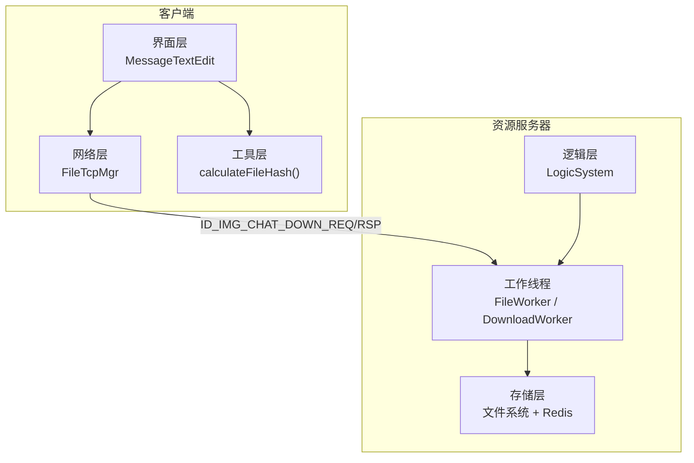
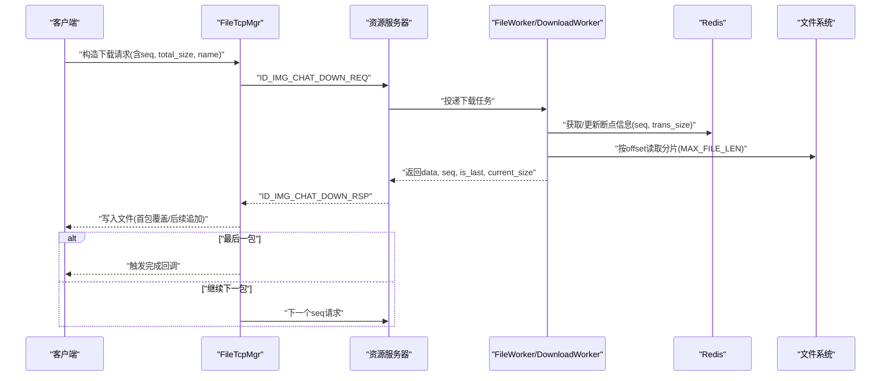
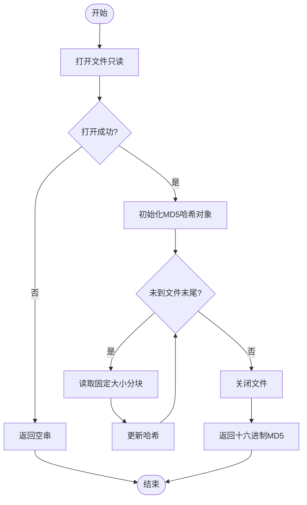
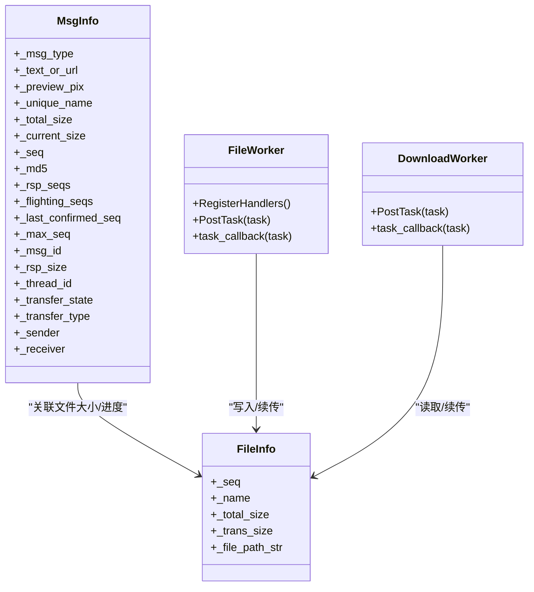
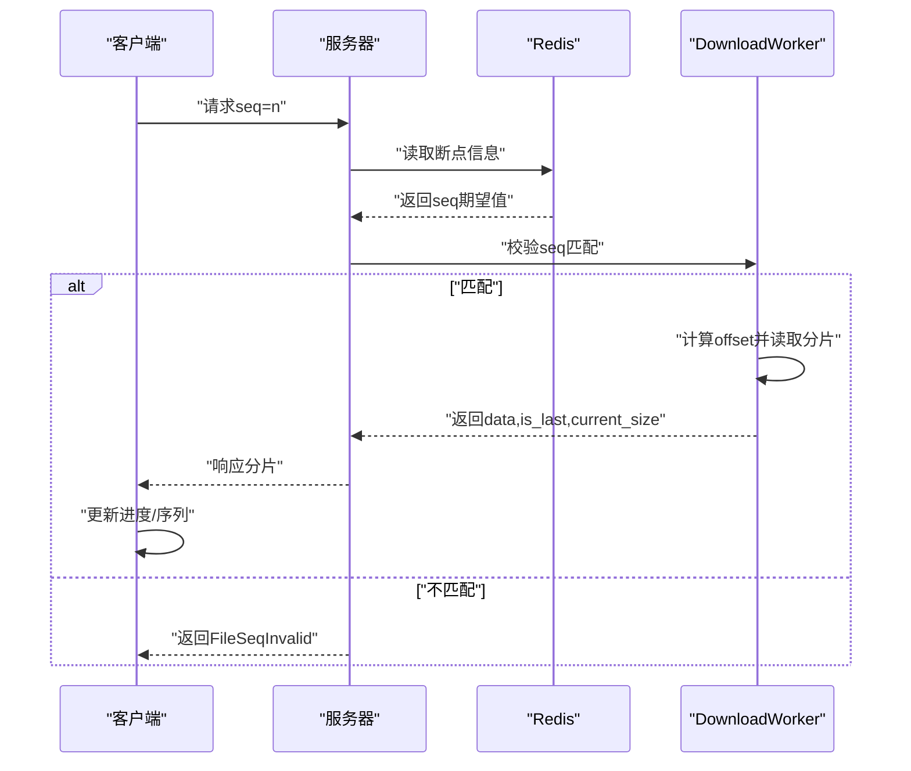
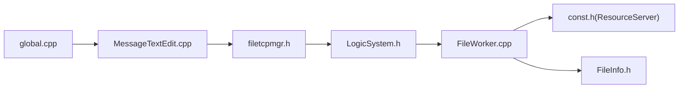

# 文件完整性校验

<cite>
**本文引用的文件**   
- [global.cpp](file://client/llfcchat/src/global.cpp)
- [MessageTextEdit.cpp](file://client/llfcchat/src/MessageTextEdit.cpp)
- [filetcpmgr.h](file://client/llfcchat/include/filetcpmgr.h)
- [global.h](file://client/llfcchat/include/global.h)
- [FileInfo.h](file://server/ResourceServer/include/FileInfo.h)
- [FileWorker.cpp](file://server/ResourceServer/src/FileWorker.cpp)
- [LogicSystem.h](file://server/ResourceServer/include/LogicSystem.h)
- [const.h（ResourceServer）](file://server/ResourceServer/include/const.h)
- [day38-断点续传.md](file://开发文档/day38-断点续传.md)
- [day41-通知客户端异步下载聊天图片.md](file://开发文档/day41-通知客户端异步下载聊天图片.md)
</cite>

## 目录
1. [简介](#简介)
2. [项目结构](#项目结构)
3. [核心组件](#核心组件)
4. [架构总览](#架构总览)
5. [详细组件分析](#详细组件分析)
6. [依赖关系分析](#依赖关系分析)
7. [性能考量](#性能考量)
8. [故障排查指南](#故障排查指南)
9. [结论](#结论)
10. [附录](#附录)

## 简介
本技术文档围绕 LLFCChat 的文件完整性校验系统，系统性阐述 MD5/SHA256 哈希算法应用、分片校验机制、端到端数据一致性保证、文件指纹生成与比对、损坏检测与修复策略、校验失败处理与自动重传机制、数据恢复方案，以及并行校验与缓存等性能优化策略。文档同时给出完整的校验流程、错误码定义、异常处理最佳实践，并提供自定义校验算法集成指南，帮助开发者快速扩展与落地。

## 项目结构
LLFCChat 采用客户端-服务器分离的架构：
- 客户端（Qt/C++）负责 UI、用户交互、文件选择与本地哈希计算、TCP 传输控制、进度展示与断点续传。
- 资源服务器（C++/Boost.Asio + Redis/Mysql）负责文件分片写入、断点续传状态管理、下载分片读取与返回、上传完成后的消息同步与通知。

图表来源 
- [MessageTextEdit.cpp:157-192](file://client/llfcchat/src/MessageTextEdit.cpp#L157-L192)
- [global.cpp:46-63](file://client/llfcchat/src/global.cpp#L46-L63)
- [filetcpmgr.h:26-82](file://client/llfcchat/include/filetcpmgr.h#L26-L82)
- [FileWorker.cpp:51-112](file://server/ResourceServer/src/FileWorker.cpp#L51-L112)
- [FileWorker.cpp:528-662](file://server/ResourceServer/src/FileWorker.cpp#L528-L662)
- [LogicSystem.h:25-26](file://server/ResourceServer/include/LogicSystem.h#L25-L26)

章节来源
- [MessageTextEdit.cpp:157-192](file://client/llfcchat/src/MessageTextEdit.cpp#L157-L192)
- [global.cpp:46-63](file://client/llfcchat/src/global.cpp#L46-L63)
- [filetcpmgr.h:26-82](file://client/llfcchat/include/filetcpmgr.h#L26-L82)
- [FileWorker.cpp:51-112](file://server/ResourceServer/src/FileWorker.cpp#L51-L112)
- [FileWorker.cpp:528-662](file://server/ResourceServer/src/FileWorker.cpp#L528-L662)
- [LogicSystem.h:25-26](file://server/ResourceServer/include/LogicSystem.h#L25-L26)

## 核心组件
- 客户端哈希计算：基于 QCryptographicHash 实现 MD5 分块计算，避免大文件内存占用过高。
- 客户端消息封装：MsgInfo 承载文件元信息（唯一名、总大小、当前序列号、MD5、传输状态等）。
- 客户端网络传输：FileTcpMgr 管理 TCP 连接、发送队列、拥塞窗口、断点续传请求构造与响应处理。
- 服务器文件写入：FileWorker 接收分片并顺序写入磁盘，支持首包创建与后续追加。
- 服务器下载服务：DownloadWorker 按 seq 偏移读取分片，维护 Redis 中的断点续传状态。
- 服务器逻辑索引：LogicSystem 维护 md5 -> FileInfo 映射，用于去重与续传定位。

章节来源
- [global.cpp:46-63](file://client/llfcchat/src/global.cpp#L46-L63)
- [global.h:167-197](file://client/llfcchat/include/global.h#L167-L197)
- [filetcpmgr.h:26-82](file://client/llfcchat/include/filetcpmgr.h#L26-L82)
- [FileWorker.cpp:51-112](file://server/ResourceServer/src/FileWorker.cpp#L51-L112)
- [FileWorker.cpp:528-662](file://server/ResourceServer/src/FileWorker.cpp#L528-L662)
- [FileInfo.h:4-15](file://server/ResourceServer/include/FileInfo.h#L4-L15)
- [LogicSystem.h:25-26](file://server/ResourceServer/include/LogicSystem.h#L25-L26)

## 架构总览
下图展示了从客户端发起文件下载/上传到服务器落盘/读取的完整链路，包含断点续传与完整性校验的关键节点。

图表来源 
- [filetcpmgr.h:26-82](file://client/llfcchat/include/filetcpmgr.h#L26-L82)
- [FileWorker.cpp:528-662](file://server/ResourceServer/src/FileWorker.cpp#L528-L662)
- [day41-通知客户端异步下载聊天图片.md:718-836](file://开发文档/day41-通知客户端异步下载聊天图片.md#L718-L836)

## 详细组件分析

### 客户端哈希与指纹生成
- 使用 QCryptographicHash::Md5 对文件进行分块读取（默认 1MB），逐块更新哈希，最终输出十六进制字符串作为文件指纹。
- 在插入图片/文件时调用 calculateFileHash，若为空则提示“无法计算文件MD5”。

图表来源 
- [global.cpp:46-63](file://client/llfcchat/src/global.cpp#L46-L63)
- [MessageTextEdit.cpp:174-182](file://client/llfcchat/src/MessageTextEdit.cpp#L174-L182)

章节来源
- [global.cpp:46-63](file://client/llfcchat/src/global.cpp#L46-L63)
- [MessageTextEdit.cpp:174-182](file://client/llfcchat/src/MessageTextEdit.cpp#L174-L182)

### 分片传输与断点续传
- 客户端将文件按 MAX_FILE_LEN（32KB）切分为多个分片，每个分片携带 seq、trans_size、total_size、last 标志。
- 服务器端通过 Redis 记录下载/上传进度（seq、trans_size、total_size），确保中断后能正确续传。
- 下载路径：服务器根据 seq 计算 offset，定位文件位置读取分片；上传路径：首包 trunc，后续包 append。

图表来源 
- [global.h:167-197](file://client/llfcchat/include/global.h#L167-L197)
- [FileInfo.h:4-15](file://server/ResourceServer/include/FileInfo.h#L4-L15)
- [FileWorker.cpp:51-112](file://server/ResourceServer/src/FileWorker.cpp#L51-L112)
- [FileWorker.cpp:528-662](file://server/ResourceServer/src/FileWorker.cpp#L528-L662)

章节来源
- [global.h:167-197](file://client/llfcchat/include/global.h#L167-L197)
- [FileInfo.h:4-15](file://server/ResourceServer/include/FileInfo.h#L4-L15)
- [FileWorker.cpp:51-112](file://server/ResourceServer/src/FileWorker.cpp#L51-L112)
- [FileWorker.cpp:528-662](file://server/ResourceServer/src/FileWorker.cpp#L528-L662)

### 端到端数据一致性保证
- 客户端侧：每次收到响应后更新 _current_size/_rsp_size/_seq，并在 last=true 时触发完成回调。
- 服务器侧：DownloadWorker 校验 seq 与 Redis 中记录的期望值一致，否则返回 FileSeqInvalid；计算 offset 越界时返回 FileOffsetInvalid。
- 完成判定：is_last=true 且 current_size=total_size，服务端清理 Redis 中的断点信息。

图表来源 
- [FileWorker.cpp:576-600](file://server/ResourceServer/src/FileWorker.cpp#L576-L600)
- [FileWorker.cpp:602-610](file://server/ResourceServer/src/FileWorker.cpp#L602-L610)
- [day41-通知客户端异步下载聊天图片.md:718-836](file://开发文档/day41-通知客户端异步下载聊天图片.md#L718-L836)

章节来源
- [FileWorker.cpp:576-600](file://server/ResourceServer/src/FileWorker.cpp#L576-L600)
- [FileWorker.cpp:602-610](file://server/ResourceServer/src/FileWorker.cpp#L602-L610)
- [day41-通知客户端异步下载聊天图片.md:718-836](file://开发文档/day41-通知客户端异步下载聊天图片.md#L718-L836)

### 损坏检测与修复策略
- 损坏检测：
  - 客户端：MD5 指纹不一致即认为损坏；下载完成后建议再次计算 MD5 并与原始指纹比对。
  - 服务器：seq 不匹配、offset 越界、读取失败均视为异常，返回相应错误码。
- 修复策略：
  - 自动重传：客户端维护 _flighting_seqs 集合，超时未确认的分片可触发重传。
  - 断点续传：利用 Redis 保存的 seq/trans_size 从上次中断处继续。
  - 全量校验：必要时重新下载整个文件并替换旧文件。

章节来源
- [global.h:167-197](file://client/llfcchat/include/global.h#L167-L197)
- [FileWorker.cpp:576-600](file://server/ResourceServer/src/FileWorker.cpp#L576-L600)
- [day38-断点续传.md:2897-3084](file://开发文档/day38-断点续传.md#L2897-L3084)

### 校验失败处理与自动重传机制
- 客户端：
  - 解析 JSON 失败或网络错误时，进入重试逻辑；对 _flighting_seqs 中的序号进行超时重发。
  - 暂停/恢复：UserMgr 维护 TransferState，FileTcpMgr 提供 ContinueUploadFile/ContinueDownloadFile。
- 服务器：
  - 返回明确错误码（如 FileSeqInvalid、FileOffsetInvalid、FileReadFailed），客户端据此决定重试或回退。

章节来源
- [filetcpmgr.h:26-82](file://client/llfcchat/include/filetcpmgr.h#L26-L82)
- [day41-通知客户端异步下载聊天图片.md:956-1020](file://开发文档/day41-通知客户端异步下载聊天图片.md#L956-L1020)
- [day38-断点续传.md:2897-3084](file://开发文档/day38-断点续传.md#L2897-L3084)

### 数据恢复方案
- 断点恢复：服务器端 Redis 持久化 seq/trans_size，客户端重启后从 last_confirmed_seq+1 继续。
- 文件重建：若部分分片损坏，仅重传该分片；若整体损坏，删除旧文件并重新下载。
- 日志与审计：关键步骤记录日志（如“[续传] 文件: ..., seq: ...”），便于问题定位。

章节来源
- [FileWorker.cpp:576-600](file://server/ResourceServer/src/FileWorker.cpp#L576-L600)
- [day41-通知客户端异步下载聊天图片.md:718-836](file://开发文档/day41-通知客户端异步下载聊天图片.md#L718-L836)

### 性能优化策略
- 并行校验：
  - 客户端可对多文件并发计算 MD5（注意 I/O 竞争）。
  - 服务器端使用多 Worker（FILE_WORKER_COUNT/DOWN_LOAD_WORKER_COUNT）并行处理上传/下载。
- 缓存机制：
  - Redis 缓存断点信息与用户基础信息，减少重复查询。
  - 客户端可缓存已计算的 MD5 结果，避免重复计算。
- 传输优化：
  - 合理设置 MAX_FILE_LEN（32KB）与拥塞窗口（MAX_CWND_SIZE=5）平衡吞吐与延迟。
  - Base64 编码仅在必要场景使用，避免额外开销。

章节来源
- [global.h:22-24](file://client/llfcchat/include/global.h#L22-L24)
- [const.h（ResourceServer）:64-69](file://server/ResourceServer/include/const.h#L64-L69)
- [FileWorker.cpp:528-662](file://server/ResourceServer/src/FileWorker.cpp#L528-L662)

### 自定义校验算法集成指南
- 目标：在不破坏现有流程的前提下，支持 SHA256 或其他哈希算法。
- 步骤：
  1. 扩展 calculateFileHash(filePath, algorithm) 接口，支持传入算法类型。
  2. 在 MessageTextEdit 插入文件时，允许选择算法并生成指纹。
  3. 服务器端增加算法字段（如 hash_algo），并在 LogicSystem 中维护 md5/sha256 -> FileInfo 映射。
  4. 客户端与服务端协议扩展：新增 hash_algo 字段，保持向后兼容。
  5. 校验阶段：优先使用相同算法指纹比对，若不一致再降级为分片级校验。

章节来源
- [global.cpp:46-63](file://client/llfcchat/src/global.cpp#L46-L63)
- [MessageTextEdit.cpp:174-182](file://client/llfcchat/src/MessageTextEdit.cpp#L174-L182)
- [LogicSystem.h:25-26](file://server/ResourceServer/include/LogicSystem.h#L25-L26)

## 依赖关系分析
- 客户端依赖：
  - global.cpp 提供 calculateFileHash 与工具函数。
  - filetcpmgr.h 定义网络传输与状态管理。
  - global.h 定义 MsgInfo、ReqId、ErrorCodes 等核心数据结构。
- 服务器依赖：
  - FileWorker.cpp 实现上传/下载处理器与断点续传逻辑。
  - FileInfo.h 定义文件元信息。
  - LogicSystem.h 维护 md5 索引。
  - const.h（ResourceServer）定义错误码与工作线程数量。

图表来源 
- [global.cpp:46-63](file://client/llfcchat/src/global.cpp#L46-L63)
- [MessageTextEdit.cpp:174-182](file://client/llfcchat/src/MessageTextEdit.cpp#L174-L182)
- [filetcpmgr.h:26-82](file://client/llfcchat/include/filetcpmgr.h#L26-L82)
- [LogicSystem.h:25-26](file://server/ResourceServer/include/LogicSystem.h#L25-L26)
- [FileWorker.cpp:51-112](file://server/ResourceServer/src/FileWorker.cpp#L51-L112)
- [const.h（ResourceServer）:5-29](file://server/ResourceServer/include/const.h#L5-L29)
- [FileInfo.h:4-15](file://server/ResourceServer/include/FileInfo.h#L4-L15)

章节来源
- [global.cpp:46-63](file://client/llfcchat/src/global.cpp#L46-L63)
- [MessageTextEdit.cpp:174-182](file://client/llfcchat/src/MessageTextEdit.cpp#L174-L182)
- [filetcpmgr.h:26-82](file://client/llfcchat/include/filetcpmgr.h#L26-L82)
- [LogicSystem.h:25-26](file://server/ResourceServer/include/LogicSystem.h#L25-L26)
- [FileWorker.cpp:51-112](file://server/ResourceServer/src/FileWorker.cpp#L51-L112)
- [const.h（ResourceServer）:5-29](file://server/ResourceServer/include/const.h#L5-L29)
- [FileInfo.h:4-15](file://server/ResourceServer/include/FileInfo.h#L4-L15)

## 性能考量
- I/O 优化：
  - 客户端分块读取（1MB）降低内存峰值。
  - 服务器端按固定分片大小（32KB）读写，提升吞吐。
- 并发模型：
  - 服务器多 Worker 并行处理，避免单点阻塞。
  - 客户端使用事件循环与信号槽机制，非阻塞处理网络 I/O。
- 缓存策略：
  - Redis 缓存断点信息与用户信息，减少数据库压力。
  - 客户端可缓存 MD5 结果，避免重复计算。
- 网络调优：
  - 拥塞窗口控制（MAX_CWND_SIZE=5）防止突发流量。
  - Base64 编码仅在必要场景使用，避免 CPU 开销。

章节来源
- [global.cpp:46-63](file://client/llfcchat/src/global.cpp#L46-L63)
- [const.h（ResourceServer）:64-69](file://server/ResourceServer/include/const.h#L64-L69)
- [FileWorker.cpp:528-662](file://server/ResourceServer/src/FileWorker.cpp#L528-L662)

## 故障排查指南
- 常见问题：
  - JSON 解析失败：检查消息格式与字段完整性。
  - 网络断开：检查连接状态与重连逻辑。
  - 权限不足：检查文件读写权限（FileWritePermissionFailed/FileReadPermissionFailed）。
  - 序列号不匹配：检查 Redis 中的断点信息与客户端 seq 是否一致。
  - 偏移量越界：检查 total_size 与 seq 计算是否正确。
- 排查步骤：
  1. 查看客户端日志（如“无法计算文件MD5”、“Failed to open file for writing”）。
  2. 检查服务器日志（如“序列号不匹配”、“偏移量超出文件大小”）。
  3. 验证 Redis 中的断点信息（seq、trans_size、total_size）。
  4. 对比客户端与服务端的 total_size 与分片大小。
  5. 必要时删除断点信息并重新下载。

章节来源
- [MessageTextEdit.cpp:174-182](file://client/llfcchat/src/MessageTextEdit.cpp#L174-L182)
- [FileWorker.cpp:576-600](file://server/ResourceServer/src/FileWorker.cpp#L576-L600)
- [FileWorker.cpp:602-610](file://server/ResourceServer/src/FileWorker.cpp#L602-L610)
- [const.h（ResourceServer）:5-29](file://server/ResourceServer/include/const.h#L5-L29)

## 结论
LLFCChat 的文件完整性校验系统通过 MD5 指纹、分片传输、断点续传与 Redis 状态管理，实现了高效、可靠的数据传输。系统在客户端与服务器端均具备完善的错误处理与恢复机制，支持自动重传与损坏检测。通过并行校验与缓存优化，系统在性能与稳定性之间取得良好平衡。开发者可根据需求扩展哈希算法与校验策略，进一步提升系统的灵活性与安全性。

## 附录
- 错误码定义（ResourceServer）：
  - Success = 0
  - Error_Json = 1001
  - RPCFailed = 1002
  - VarifyExpired = 1003
  - VarifyCodeErr = 1004
  - UserExist = 1005
  - PasswdErr = 1006
  - EmailNotMatch = 1007
  - PasswdUpFailed = 1008
  - PasswdInvalid = 1009
  - TokenInvalid = 1010
  - UidInvalid = 1011
  - FileNotExists = 1012
  - FileSaveRedisFailed = 1013
  - CreateFilePathFailed = 1014
  - FileWritePermissionFailed = 1015
  - FileReadPermissionFailed = 1016
  - FileSeqInvalid = 1017
  - FileOffsetInvalid = 1018
  - FileReadFailed = 1019
  - RedisReadErr = 1020
  - ServerIpErr = 1021
  - MsgIdErr = 1022

章节来源
- [const.h（ResourceServer）:5-29](file://server/ResourceServer/include/const.h#L5-L29)