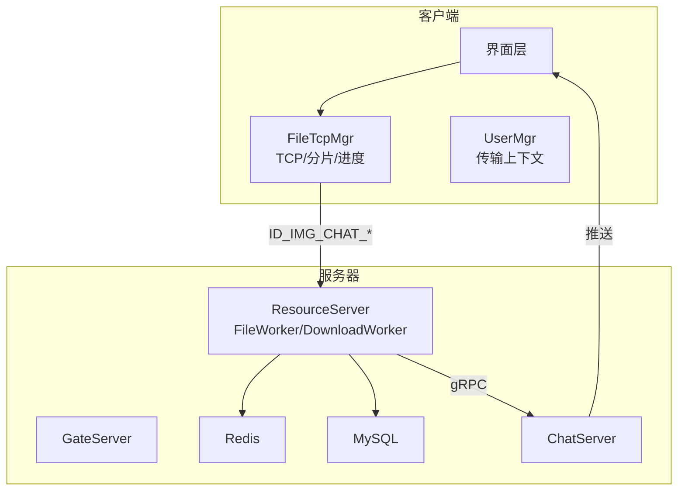
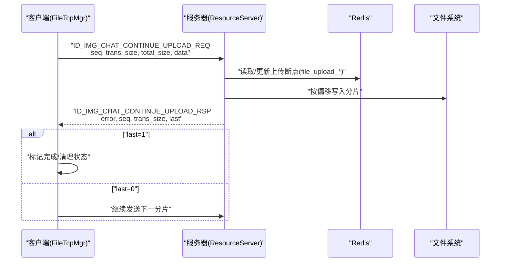
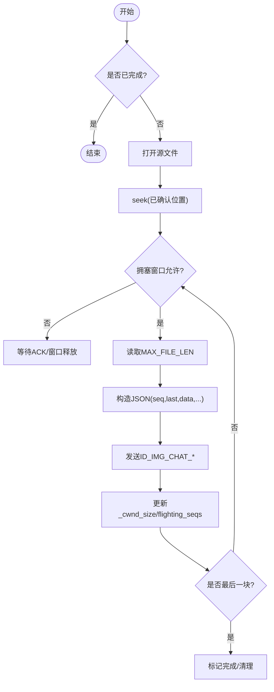
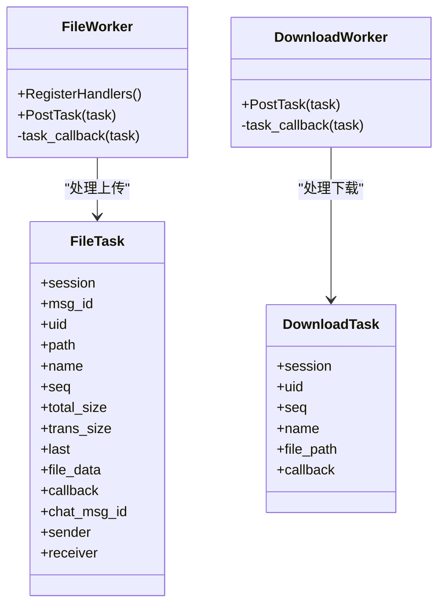
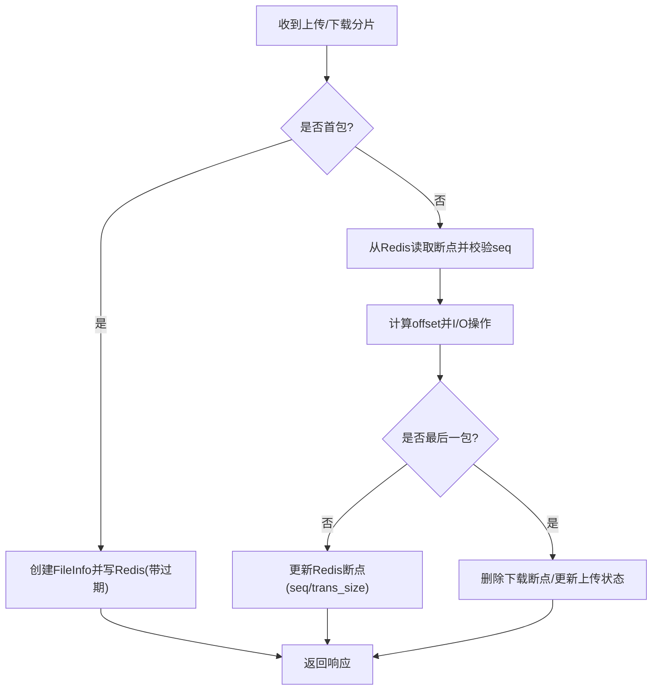
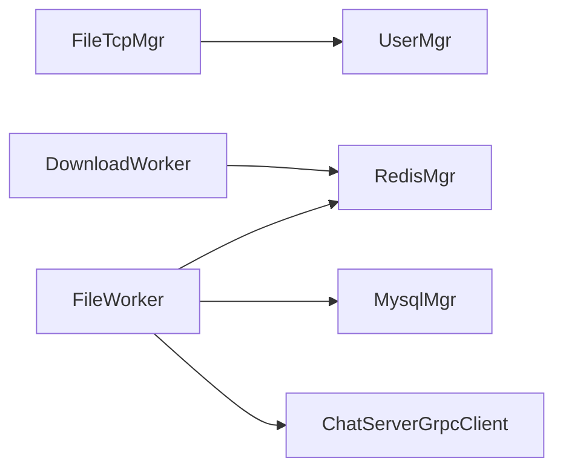

# 断点续传机制

<cite>
**本文引用的文件**   
- [filetcpmgr.h](file://client/llfcchat/include/filetcpmgr.h)
- [filetcpmgr.cpp](file://client/llfcchat/src/filetcpmgr.cpp)
- [FileWorker.h](file://server/ResourceServer/include/FileWorker.h)
- [FileWorker.cpp](file://server/ResourceServer/src/FileWorker.cpp)
- [RedisMgr.h](file://server/ResourceServer/include/RedisMgr.h)
- [RedisMgr.cpp](file://server/ResourceServer/src/RedisMgr.cpp)
- [day38-断点续传.md](file://开发文档/day38-断点续传.md)
- [day40-聊天图片资源续传和进度显示.md](file://开发文档/day40-聊天图片资源续传和进度显示.md)
- [day41-通知客户端异步下载聊天图片.md](file://开发文档/day41-通知客户端异步下载聊天图片.md)
</cite>

## 目录
1. [简介](#简介)
2. [项目结构](#项目结构)
3. [核心组件](#核心组件)
4. [架构总览](#架构总览)
5. [详细组件分析](#详细组件分析)
6. [依赖关系分析](#依赖关系分析)
7. [性能考量](#性能考量)
8. [故障排查指南](#故障排查指南)
9. [结论](#结论)
10. [附录：API接口说明](#附录api接口说明)

## 简介
本技术文档围绕 LLFCChat 的断点续传能力，系统性阐述上传与下载的断点记录机制、分片策略、状态同步方案，以及 ContinueUploadFile 与 ContinueDownloadFile 的实现原理。内容涵盖唯一文件名生成、分片索引管理、进度持久化（Redis）、断点恢复算法、冲突解决策略与数据一致性保证，并提供完整的 API 接口说明、参数定义、返回值规范及异常处理与调试技巧。

## 项目结构
本项目采用客户端-服务器分层架构：
- 客户端侧通过 FileTcpMgr 管理 TCP 连接、消息收发、分片发送与接收、进度更新与断点续传控制。
- 服务器端 ResourceServer 提供文件读写、任务队列、Redis 持久化与跨服务通知（gRPC）。
- 使用 Redis 作为断点信息的共享存储，确保多进程/多实例下的状态一致性与可恢复性。

**图表来源** 
- [filetcpmgr.cpp:243-896](file://client/llfcchat/src/filetcpmgr.cpp#L243-L896)
- [FileWorker.cpp:49-456](file://server/ResourceServer/src/FileWorker.cpp#L49-L456)
- [RedisMgr.h:269-311](file://server/ResourceServer/include/RedisMgr.h#L269-L311)

**章节来源**
- [filetcpmgr.h:26-82](file://client/llfcchat/include/filetcpmgr.h#L26-L82)
- [filetcpmgr.cpp:1-143](file://client/llfcchat/src/filetcpmgr.cpp#L1-L143)

## 核心组件
- FileTcpMgr（客户端）
  - 负责 TCP 粘包/拆包解析、消息分发、分片发送与接收、进度回调、断点续传触发。
  - 关键方法：ContinueUploadFile、ContinueDownloadFile、BatchSend、slot_continue_upload_file、slot_continue_download_file。
- FileWorker / DownloadWorker（服务器）
  - 基于线程池的任务处理器，分别处理上传与下载的分片 I/O、Base64 编解码、偏移定位、Redis 状态更新。
- RedisMgr（服务器）
  - 封装 Redis 连接池、键值操作、过期时间设置；维护上传/下载断点信息（file_upload_*, file_download_*）。

**章节来源**
- [filetcpmgr.h:26-82](file://client/llfcchat/include/filetcpmgr.h#L26-L82)
- [FileWorker.h:14-90](file://server/ResourceServer/include/FileWorker.h#L14-L90)
- [RedisMgr.h:269-311](file://server/ResourceServer/include/RedisMgr.h#L269-L311)

## 架构总览
下图展示一次“断点续传”的端到端流程：客户端发起续传请求，服务器根据 Redis 中的断点信息定位分片并返回，客户端写入本地文件并继续下一分片，直至完成。

**图表来源** 
- [filetcpmgr.cpp:917-1076](file://client/llfcchat/src/filetcpmgr.cpp#L917-L1076)
- [FileWorker.cpp:372-456](file://server/ResourceServer/src/FileWorker.cpp#L372-L456)
- [RedisMgr.cpp:498-536](file://server/ResourceServer/src/RedisMgr.cpp#L498-L536)

## 详细组件分析

### 客户端 FileTcpMgr 分析
- 分片发送与续传
  - BatchSend：按 MAX_FILE_LEN 分片，计算 last 标志，维护 _cwnd_size 拥塞窗口，批量发送 ID_IMG_CHAT_UPLOAD_REQ。
  - slot_continue_upload_file：从已确认序列号 _last_confirmed_seq 继续发送，支持暂停/继续。
- 分片接收与落盘
  - ID_IMG_CHAT_DOWN_RSP：Base64 解码后按 seq 决定覆盖或追加写入，更新 current_size/total_size，is_last 时完成。
  - ID_IMG_CHAT_DOWN_INFO_SYNC_RSP：初始化下载元数据，创建目录，启动首次下载。
- 断点恢复
  - ContinueDownloadFile：根据当前 _current_size/_total_size 判断是否完成，组织下一次下载请求。
  - ContinueUploadFile：触发 slot_continue_upload_file，基于 _last_confirmed_seq 续传。

**图表来源** 
- [filetcpmgr.cpp:925-996](file://client/llfcchat/src/filetcpmgr.cpp#L925-L996)
- [filetcpmgr.cpp:1002-1076](file://client/llfcchat/src/filetcpmgr.cpp#L1002-L1076)

**章节来源**
- [filetcpmgr.cpp:243-896](file://client/llfcchat/src/filetcpmgr.cpp#L243-L896)
- [filetcpmgr.cpp:917-1105](file://client/llfcchat/src/filetcpmgr.cpp#L917-L1105)

### 服务器 FileWorker / DownloadWorker 分析
- 上传处理（ID_IMG_CHAT_UPLOAD_REQ / ID_IMG_CHAT_CONTINUE_UPLOAD_REQ）
  - 首包创建文件（trunc），后续包追加（app）。
  - Base64 解码后按偏移写入，last=1 时更新数据库状态并通过 gRPC 通知 ChatServer。
- 下载处理（ID_IMG_CHAT_DOWN_REQ）
  - 首包获取文件大小，初始化 FileInfo 并写入 Redis（file_download_*）。
  - 续传时从 Redis 加载断点，校验 seq，计算 offset=(seq-1)*MAX_FILE_LEN，读取分片并 Base64 编码返回。
  - is_last=1 时删除 Redis 断点，否则更新 seq/trans_size。

**图表来源** 
- [FileWorker.h:14-90](file://server/ResourceServer/include/FileWorker.h#L14-L90)
- [FileWorker.cpp:49-456](file://server/ResourceServer/src/FileWorker.cpp#L49-L456)
- [FileWorker.cpp:483-663](file://server/ResourceServer/src/FileWorker.cpp#L483-L663)

**章节来源**
- [FileWorker.cpp:49-456](file://server/ResourceServer/src/FileWorker.cpp#L49-L456)
- [FileWorker.cpp:483-663](file://server/ResourceServer/src/FileWorker.cpp#L483-L663)

### Redis 持久化与状态同步
- 上传断点 key：file_upload_{name}，包含 name、seq、total_size、trans_size、file_path_str，设置过期时间（默认 3600s）。
- 下载断点 key：file_download_{name}，字段同上，用于服务端断点续传。
- 常用接口：SetFileInfo、GetFileInfo、SetDownLoadInfo、GetDownloadInfo、DelDownLoadInfo。

**图表来源** 
- [RedisMgr.cpp:498-536](file://server/ResourceServer/src/RedisMgr.cpp#L498-L536)
- [FileWorker.cpp:557-663](file://server/ResourceServer/src/FileWorker.cpp#L557-L663)

**章节来源**
- [RedisMgr.h:269-311](file://server/ResourceServer/include/RedisMgr.h#L269-L311)
- [RedisMgr.cpp:498-536](file://server/ResourceServer/src/RedisMgr.cpp#L498-L536)

### 唯一文件名与分片索引管理
- 唯一文件名生成
  - 客户端：使用 MD5 哈希作为标识（_file_md5），结合原始文件名进行去重与定位。
  - 服务器：以 name 为维度构建 Redis key（file_upload_/file_download_），避免并发冲突。
- 分片索引管理
  - seq：自增分片序号，首包 seq=1，last 标志指示末包。
  - trans_size：累计已传输字节数，用于进度与断点恢复。
  - last_seq：最大期望序列号，辅助客户端判断是否全部发送完毕。

**章节来源**
- [filetcpmgr.cpp:925-996](file://client/llfcchat/src/filetcpmgr.cpp#L925-L996)
- [FileWorker.cpp:557-663](file://server/ResourceServer/src/FileWorker.cpp#L557-L663)

### 断点恢复算法与冲突解决
- 恢复算法
  - 上传：客户端依据 _last_confirmed_seq 定位起始分片，服务器依据 Redis 中 seq/trans_size 定位偏移。
  - 下载：客户端依据 _current_size/_total_size 判断是否完成，服务器依据 Redis 中 seq 与 offset 读取分片。
- 冲突解决
  - 使用 Redis 原子 SETEX 设置断点，避免重复覆盖。
  - 校验 seq 一致性，不匹配则拒绝并返回错误码。
  - 拥塞窗口 _cwnd_size 控制并发，防止网络拥塞导致的状态错乱。

**章节来源**
- [filetcpmgr.cpp:1002-1076](file://client/llfcchat/src/filetcpmgr.cpp#L1002-L1076)
- [FileWorker.cpp:557-663](file://server/ResourceServer/src/FileWorker.cpp#L557-L663)

### 数据一致性保证
- 客户端：
  - 使用 flighting_seqs/rsp_seqs 跟踪未确认与已确认序列号，计算 _last_confirmed_seq。
  - 仅在收到 ACK 后才推进进度，避免丢包导致的错位。
- 服务器：
  - 每分片完成后立即更新 Redis 断点，确保重启后可恢复。
  - 最后分片完成时更新数据库状态并通知对端。

**章节来源**
- [filetcpmgr.cpp:435-519](file://client/llfcchat/src/filetcpmgr.cpp#L435-L519)
- [FileWorker.cpp:372-456](file://server/ResourceServer/src/FileWorker.cpp#L372-L456)

## 依赖关系分析
- FileTcpMgr 依赖 UserMgr 获取/更新传输上下文（如 MsgInfo/DownloadInfo）。
- FileWorker/DownloadWorker 依赖 RedisMgr 进行断点持久化，依赖 MysqlMgr 更新业务状态。
- 服务器间通过 gRPC（ChatServerGrpcClient）通知 ChatServer 完成消息推送。

**图表来源** 
- [filetcpmgr.cpp:243-896](file://client/llfcchat/src/filetcpmgr.cpp#L243-L896)
- [FileWorker.cpp:49-456](file://server/ResourceServer/src/FileWorker.cpp#L49-L456)

**章节来源**
- [filetcpmgr.cpp:243-896](file://client/llfcchat/src/filetcpmgr.cpp#L243-L896)
- [FileWorker.cpp:49-456](file://server/ResourceServer/src/FileWorker.cpp#L49-L456)

## 性能考量
- 分片大小：MAX_FILE_LEN 平衡内存占用与网络开销，建议根据带宽调整。
- 拥塞控制：_cwnd_size 限制并发分片数量，避免拥塞。
- Redis 过期：断点信息设置合理 TTL，避免长期占用内存。
- 文件 I/O：首包 trunc，后续 app，减少磁盘随机写。

[本节为通用指导，无需源码引用]

## 故障排查指南
- 常见问题
  - 断点丢失：检查 Redis 键是否存在且未过期。
  - 序列号不匹配：核对客户端 seq 与服务端期望是否一致。
  - 权限问题：服务器写入失败时检查目录权限。
- 调试技巧
  - 打印 JSON 报文与错误码，定位解析失败。
  - 观察 _cwnd_size 与 flighting_seqs 变化，排查拥塞与丢包。
  - 检查文件偏移与 last 标志是否正确。

**章节来源**
- [filetcpmgr.cpp:243-896](file://client/llfcchat/src/filetcpmgr.cpp#L243-L896)
- [FileWorker.cpp:557-663](file://server/ResourceServer/src/FileWorker.cpp#L557-L663)

## 结论
LLFCChat 的断点续传机制通过客户端分片发送、服务器分片写入与 Redis 断点持久化，实现了稳定可靠的上传/下载能力。其设计在一致性、可恢复性与性能之间取得良好平衡，适用于大文件与不稳定网络的场景。

[本节为总结，无需源码引用]

## 附录：API接口说明
- 上传相关
  - ID_IMG_CHAT_UPLOAD_REQ / ID_IMG_CHAT_CONTINUE_UPLOAD_REQ
    - 参数：md5/name/seq/trans_size/total_size/data/last/last_seq/sender/receiver/message_id/uid
    - 返回：error/seq/trans_size/last/md5/name
  - ID_IMG_CHAT_UPLOAD_RSP / ID_IMG_CHAT_CONTINUE_UPLOAD_RSP
    - 作用：确认分片接收，推进 _last_confirmed_seq
- 下载相关
  - ID_IMG_CHAT_DOWN_REQ
    - 参数：name/seq/trans_size/total_size/token/sender_id/receiver_id/message_id/uid
    - 返回：data/seq/is_last/total_size/current_size/name
  - ID_IMG_CHAT_DOWN_INFO_SYNC_RSP
    - 作用：同步下载元数据，初始化 client_path 与目录
- 其他
  - ID_DOWN_LOAD_FILE_REQ / ID_DOWN_LOAD_FILE_RSP
    - 作用：头像等资源下载，含 req_type 区分来源

**章节来源**
- [filetcpmgr.cpp:243-896](file://client/llfcchat/src/filetcpmgr.cpp#L243-L896)
- [day38-断点续传.md:479-837](file://开发文档/day38-断点续传.md#L479-L837)
- [day40-聊天图片资源续传和进度显示.md:468-543](file://开发文档/day40-聊天图片资源续传和进度显示.md#L468-L543)
- [day41-通知客户端异步下载聊天图片.md:1022-1108](file://开发文档/day41-通知客户端异步下载聊天图片.md#L1022-L1108)