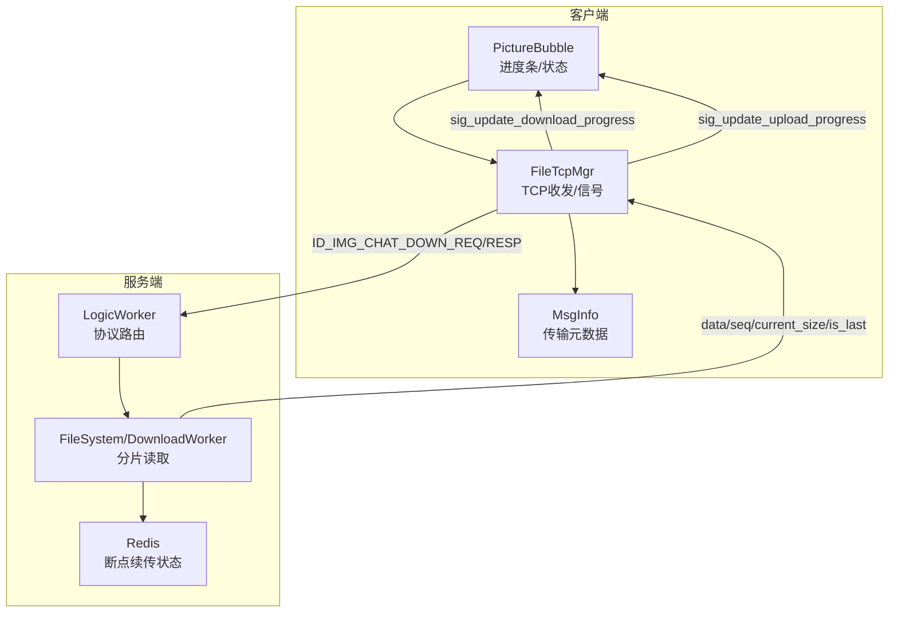
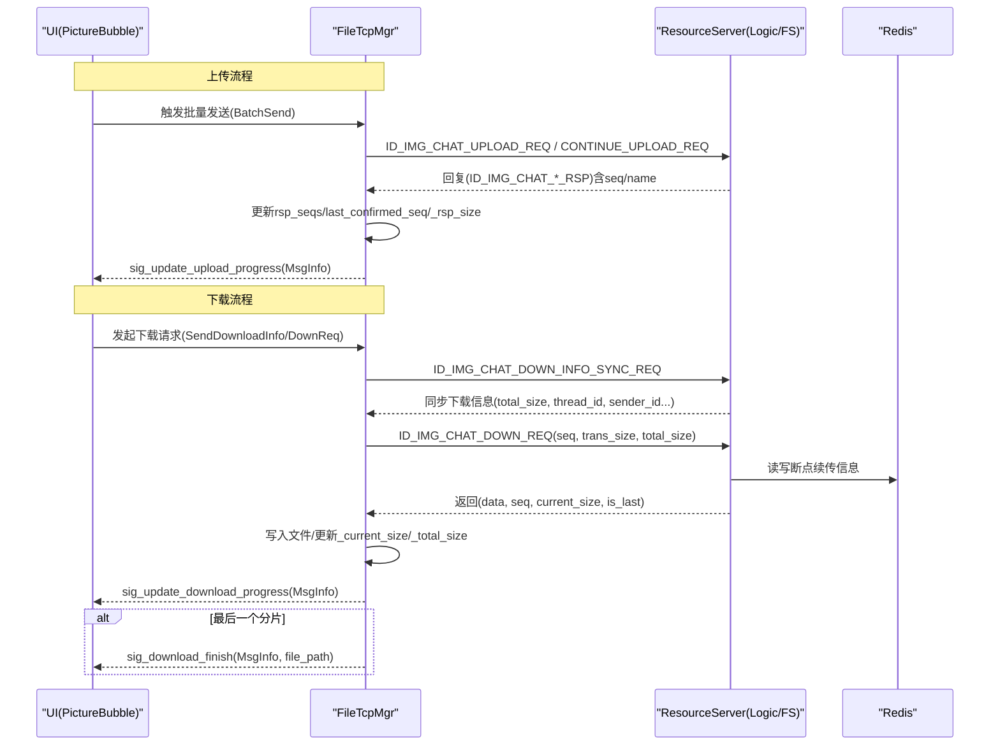
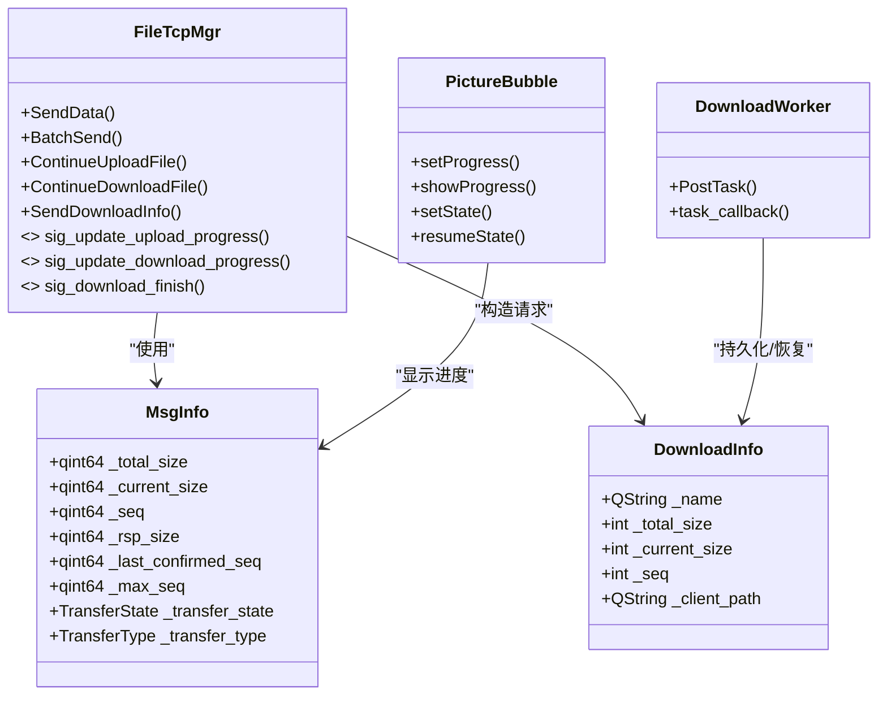

# 进度跟踪与监控

<cite>
**本文引用的文件**   
- [filetcpmgr.h](file://client/llfcchat/include/filetcpmgr.h)
- [filetcpmgr.cpp](file://client/llfcchat/src/filetcpmgr.cpp)
- [global.h](file://client/llfcchat/include/global.h)
- [userdata.h](file://client/llfcchat/include/userdata.h)
- [PictureBubble.cpp](file://client/llfcchat/src/PictureBubble.cpp)
- [FileWorker.h](file://server/ResourceServer/include/FileWorker.h)
- [FileWorker.cpp](file://server/ResourceServer/src/FileWorker.cpp)
- [FileInfo.cpp](file://server/ResourceServer/src/FileInfo.cpp)
- [LogicWorker.cpp](file://server/ResourceServer/src/LogicWorker.cpp)
</cite>

## 目录
1. [简介](#简介)
2. [项目结构](#项目结构)
3. [核心组件](#核心组件)
4. [架构总览](#架构总览)
5. [详细组件分析](#详细组件分析)
6. [依赖关系分析](#依赖关系分析)
7. [性能考虑](#性能考虑)
8. [故障排查指南](#故障排查指南)
9. [结论](#结论)
10. [附录](#附录)

## 简介
本技术文档围绕 LLFCChat 的文件传输进度跟踪系统，系统性阐述以下要点：
- 信号机制：sig_update_upload_progress 与 sig_update_download_progress 的触发时机、数据承载体与 UI 更新策略。
- 进度计算算法：基于分片序列号（seq）、已确认序列（last_confirmed_seq）与累计字节数（current_size/rsp_size）的百分比计算；剩余时间估算思路。
- 数据结构：DownloadInfo 与 MsgInfo 的设计与作用域；上传/下载状态机。
- 用户体验：实时进度显示、进度条动画、暂停/恢复、完成态延迟隐藏等。
- 可靠性：断点续传、网络波动处理、拥塞窗口控制、带宽统计扩展点。
- 实现示例与自定义组件开发指南：如何接入现有信号、如何封装可复用进度组件。

## 项目结构
LLFCChat 客户端通过 FileTcpMgr 管理 TCP 文件传输，服务端 ResourceServer 提供分片读取与断点续传能力。UI 层 PictureBubble 负责展示图片/文件气泡及进度条。关键路径如下：
- 客户端发送/接收分片请求与响应，维护 MsgInfo 中的 seq、rsp_seqs、flighting_seqs、last_confirmed_seq 等字段。
- 服务端 DownloadWorker 按 seq 偏移读取文件，返回 data、seq、total_size、current_size、is_last 等字段，并持久化下载信息到 Redis。
- UI 通过 Qt 信号槽将进度更新映射到 QProgressBar，实现平滑刷新。

图表来源
- [filetcpmgr.cpp:334-433](file://client/llfcchat/src/filetcpmgr.cpp#L334-L433)
- [filetcpmgr.cpp:695-811](file://client/llfcchat/src/filetcpmgr.cpp#L695-L811)
- [FileWorker.cpp:528-709](file://server/ResourceServer/src/FileWorker.cpp#L528-L709)
- [LogicWorker.cpp:461-570](file://server/ResourceServer/src/LogicWorker.cpp#L461-L570)

章节来源
- [filetcpmgr.h:26-84](file://client/llfcchat/include/filetcpmgr.h#L26-L84)
- [filetcpmgr.cpp:1-143](file://client/llfcchat/src/filetcpmgr.cpp#L1-L143)
- [global.h:167-200](file://client/llfcchat/include/global.h#L167-L200)
- [FileWorker.h:41-89](file://server/ResourceServer/include/FileWorker.h#L41-L89)

## 核心组件
- FileTcpMgr（客户端）
  - 职责：TCP 粘包/拆包、消息分发、上传/下载分片调度、拥塞窗口控制、信号发射。
  - 关键信号：sig_update_upload_progress、sig_update_download_progress、sig_download_finish。
  - 关键方法：BatchSend、ContinueUploadFile、ContinueDownloadFile、SendDownloadInfo。
- MsgInfo（客户端）
  - 职责：记录单条消息对应的文件传输元数据（类型、大小、当前进度、序列号、集合等）。
  - 关键字段：_total_size、_current_size、_seq、_rsp_size、_last_confirmed_seq、_max_seq、_transfer_state、_transfer_type。
- DownloadInfo（客户端）
  - 职责：用于通用下载流程（如头像下载）的轻量结构，包含 name、total_size、current_size、seq、client_path。
- DownloadWorker（服务端）
  - 职责：按 seq 偏移读取文件，Base64 编码后返回，维护 Redis 中的断点续传信息。
- PictureBubble（客户端 UI）
  - 职责：渲染图片/文件气泡、显示/隐藏进度条、根据状态切换图标、点击暂停/恢复。

章节来源
- [filetcpmgr.h:26-84](file://client/llfcchat/include/filetcpmgr.h#L26-L84)
- [filetcpmgr.cpp:925-996](file://client/llfcchat/src/filetcpmgr.cpp#L925-L996)
- [global.h:167-200](file://client/llfcchat/include/global.h#L167-L200)
- [global.h:284-290](file://client/llfcchat/include/global.h#L284-L290)
- [FileWorker.h:41-89](file://server/ResourceServer/include/FileWorker.h#L41-L89)
- [PictureBubble.cpp:82-149](file://client/llfcchat/src/PictureBubble.cpp#L82-L149)

## 架构总览
下图展示了“上传”和“下载”两条主链路，以及进度信号在客户端内部的传播路径。

图表来源
- [filetcpmgr.cpp:521-608](file://client/llfcchat/src/filetcpmgr.cpp#L521-L608)
- [filetcpmgr.cpp:610-693](file://client/llfcchat/src/filetcpmgr.cpp#L610-L693)
- [filetcpmgr.cpp:695-811](file://client/llfcchat/src/filetcpmgr.cpp#L695-L811)
- [filetcpmgr.cpp:813-894](file://client/llfcchat/src/filetcpmgr.cpp#L813-L894)
- [FileWorker.cpp:528-709](file://server/ResourceServer/src/FileWorker.cpp#L528-L709)

## 详细组件分析

### 信号机制与 UI 更新策略
- sig_update_upload_progress
  - 触发点：每次收到服务器对上传分片的确认（ID_IMG_CHAT_UPLOAD_RSP、ID_IMG_CHAT_CONTINUE_UPLOAD_RSP、ID_FILE_INFO_SYNC_RSP），更新 last_confirmed_seq 与 _rsp_size，并发射信号。
  - 数据体：std::shared_ptr<MsgInfo>，包含最新 _rsp_size、_total_size、_transfer_state 等。
  - UI 策略：PictureBubble 根据 _rsp_size/_total_size 计算百分比，设置 QProgressBar；完成后延迟隐藏进度条。
- sig_update_download_progress
  - 触发点：每次收到下载分片响应（ID_IMG_CHAT_DOWN_RSP、ID_IMG_CHAT_DOWN_INFO_SYNC_RSP），更新 _current_size/_total_size，并发射信号。
  - 数据体：std::shared_ptr<MsgInfo>，包含最新 _current_size、_total_size、_seq 等。
  - UI 策略：同上传，百分比驱动进度条；is_last 为真时触发 sig_download_finish，替换缩略图为真实图片。

章节来源
- [filetcpmgr.cpp:521-608](file://client/llfcchat/src/filetcpmgr.cpp#L521-L608)
- [filetcpmgr.cpp:610-693](file://client/llfcchat/src/filetcpmgr.cpp#L610-L693)
- [filetcpmgr.cpp:695-811](file://client/llfcchat/src/filetcpmgr.cpp#L695-L811)
- [filetcpmgr.cpp:813-894](file://client/llfcchat/src/filetcpmgr.cpp#L813-L894)
- [PictureBubble.cpp:82-149](file://client/llfcchat/src/PictureBubble.cpp#L82-L149)

### 进度计算算法
- 百分比
  - 上传：percent = (_rsp_size / _total_size) * 100
  - 下载：percent = (_current_size / _total_size) * 100
- 最后确认序列号
  - 利用 rsp_seqs 集合推进 last_confirmed_seq，直到不连续为止，确保顺序一致性。
- 最大序列号
  - _max_seq = ceil(_total_size / MAX_FILE_LEN)，用于判断是否全部完成。
- 剩余时间估算（建议）
  - 使用滑动窗口统计最近 N 秒内累计字节增量，得到瞬时速率 v；剩余字节 rem = total - current；ETA = rem / v。若 v=0 则显示未知。

章节来源
- [global.h:167-200](file://client/llfcchat/include/global.h#L167-L200)
- [filetcpmgr.cpp:521-608](file://client/llfcchat/src/filetcpmgr.cpp#L521-L608)
- [filetcpmgr.cpp:695-811](file://client/llfcchat/src/filetcpmgr.cpp#L695-L811)

### 下载信息结构体 DownloadInfo 设计
- 字段说明
  - _name：文件名
  - _total_size：总大小
  - _current_size：已下载大小
  - _seq：当前分片序号
  - _client_path：本地保存路径
- 用途
  - 用于通用下载流程（如头像下载）的请求构造与进度上报。

章节来源
- [global.h:284-290](file://client/llfcchat/include/global.h#L284-L290)
- [filetcpmgr.cpp:1111-1125](file://client/llfcchat/src/filetcpmgr.cpp#L1111-L1125)

### 实时进度显示与进度条动画
- PictureBubble
  - setProgress(value, total_value)：计算百分比并设置 QProgressBar；达到 100% 自动置 Completed。
  - showProgress(bool)：显隐进度条并调整布局尺寸。
  - setState(state)：根据状态切换显示逻辑，Completed 延迟隐藏。
  - resumeState()：从 Paused 恢复到 Downloading/Uploading。
- 交互
  - 点击气泡触发 onPictureClicked：进行中→暂停；暂停/失败→继续/重试。

章节来源
- [PictureBubble.cpp:82-149](file://client/llfcchat/src/PictureBubble.cpp#L82-L149)
- [PictureBubble.cpp:176-187](file://client/llfcchat/src/PictureBubble.cpp#L176-L187)

### 断点续传与网络波动处理
- 客户端
  - 上传：BatchSend/ContinueUploadFile 依据 last_confirmed_seq 定位偏移，结合拥塞窗口 _cwnd_size 控制并发。
  - 下载：ContinueDownloadFile 依据 _current_size/_seq 发起续传；收到 is_last=false 时自动拉取下一分片。
- 服务端
  - DownloadWorker：seq==1 新建 FileInfo 并写 Redis；否则从 Redis 恢复 _seq/_trans_size，校验 seq 一致性，按 offset=(seq-1)*MAX_FILE_LEN 读取。
  - 完成或中间状态均更新 Redis，is_last=true 时清理下载信息。
- 网络错误
  - QTcpSocket 错误事件分类处理（连接拒绝、超时、主机不可达等），并向上抛出连接结果信号。

章节来源
- [filetcpmgr.cpp:925-996](file://client/llfcchat/src/filetcpmgr.cpp#L925-L996)
- [filetcpmgr.cpp:1002-1076](file://client/llfcchat/src/filetcpmgr.cpp#L1002-L1076)
- [filetcpmgr.cpp:1078-1105](file://client/llfcchat/src/filetcpmgr.cpp#L1078-L1105)
- [FileWorker.cpp:528-709](file://server/ResourceServer/src/FileWorker.cpp#L528-L709)
- [filetcpmgr.cpp:64-93](file://client/llfcchat/src/filetcpmgr.cpp#L64-L93)

### 带宽统计与拥塞控制
- 拥塞窗口
  - _cwnd_size 限制同时未确认的分片数量，避免拥塞。
- 带宽统计（扩展点）
  - 可在 bytesWritten 回调中累计 _bytes_sent，结合时间戳计算瞬时/平均速率，供 UI 展示或自适应分片大小。

章节来源
- [filetcpmgr.cpp:106-132](file://client/llfcchat/src/filetcpmgr.cpp#L106-L132)
- [filetcpmgr.cpp:925-996](file://client/llfcchat/src/filetcpmgr.cpp#L925-L996)

### 完整实现示例（端到端）
- 上传
  - UI 触发 BatchSend → 分片发送 → 服务器确认 → 更新 last_confirmed_seq → 发射 sig_update_upload_progress → UI 刷新。
- 下载
  - UI 发起 DownInfoSync → 获取 total_size → 循环 DownReq 拉取分片 → 写入本地 → 发射 sig_update_download_progress → is_last=true 时发射 sig_download_finish。

章节来源
- [filetcpmgr.cpp:521-608](file://client/llfcchat/src/filetcpmgr.cpp#L521-L608)
- [filetcpmgr.cpp:695-811](file://client/llfcchat/src/filetcpmgr.cpp#L695-L811)
- [filetcpmgr.cpp:813-894](file://client/llfcchat/src/filetcpmgr.cpp#L813-L894)

## 依赖关系分析
- 客户端
  - FileTcpMgr 依赖全局常量（MAX_FILE_LEN、MAX_CWND_SIZE）、UserMgr（文件元数据管理）、QJson/QByteArray（序列化/反序列化）、QTcpSocket（网络 IO）。
  - PictureBubble 依赖 MsgInfo 与 TransferState/TransferType。
- 服务端
  - LogicWorker 解析协议并投递至 FileSystem/DownloadWorker。
  - DownloadWorker 依赖文件系统与 Redis（断点续传状态）。

图表来源
- [filetcpmgr.h:26-84](file://client/llfcchat/include/filetcpmgr.h#L26-L84)
- [global.h:167-200](file://client/llfcchat/include/global.h#L167-L200)
- [global.h:284-290](file://client/llfcchat/include/global.h#L284-L290)
- [FileWorker.h:41-89](file://server/ResourceServer/include/FileWorker.h#L41-L89)
- [PictureBubble.cpp:82-149](file://client/llfcchat/src/PictureBubble.cpp#L82-L149)

章节来源
- [filetcpmgr.h:26-84](file://client/llfcchat/include/filetcpmgr.h#L26-L84)
- [global.h:167-200](file://client/llfcchat/include/global.h#L167-L200)
- [FileWorker.h:41-89](file://server/ResourceServer/include/FileWorker.h#L41-L89)

## 性能考虑
- 分片大小 MAX_FILE_LEN：平衡内存占用与网络吞吐，过大导致内存峰值高，过小增加握手开销。
- 拥塞窗口 MAX_CWND_SIZE：限制并发未确认分片，避免丢包重传风暴。
- Base64 编解码：服务端对每个分片进行编码，CPU 开销显著，建议在高性能场景考虑二进制直传或压缩。
- 文件 I/O：服务端随机读（seek+read）与客户端追加写，注意磁盘碎片与缓存命中。
- UI 刷新频率：QProgressBar 频繁 setValue 可能引起卡顿，可合并更新或使用节流。

[本节为通用指导，无需源码引用]

## 故障排查指南
- 常见问题
  - 进度不更新：检查是否收到对应 RSP；确认 last_confirmed_seq 推进逻辑；核对 _total_size 是否为 0。
  - 下载中断：查看 is_last 标志；确认 Redis 中断点信息是否存在且 seq 匹配。
  - 上传卡住：检查 _cwnd_size 是否耗尽；确认服务器是否回包；观察 bytesWritten 回调是否正常。
- 定位手段
  - 打印 JSON 报文字段（error、seq、name、total_size、current_size、is_last）。
  - 检查 QTcpSocket 错误码（ConnectionRefusedError、HostNotFoundError、SocketTimeoutError）。
  - 验证本地文件路径与权限。

章节来源
- [filetcpmgr.cpp:64-93](file://client/llfcchat/src/filetcpmgr.cpp#L64-L93)
- [filetcpmgr.cpp:334-433](file://client/llfcchat/src/filetcpmgr.cpp#L334-L433)
- [filetcpmgr.cpp:695-811](file://client/llfcchat/src/filetcpmgr.cpp#L695-L811)

## 结论
LLFCChat 的文件传输进度跟踪系统以 MsgInfo 为核心状态载体，配合 FileTcpMgr 的信号机制与 PictureBubble 的 UI 渲染，实现了稳定可靠的上传/下载进度可视化。服务端 DownloadWorker 通过 Redis 支撑断点续传，保证网络波动下的鲁棒性。在此基础上，可进一步引入带宽统计、自适应分片、更丰富的 ETA 提示与更细粒度的 UI 动画，提升用户体验。

[本节为总结，无需源码引用]

## 附录
- 自定义进度显示组件开发指南
  - 继承 QWidget，内部嵌入 QProgressBar，暴露 setProgress(value,total)、showProgress(show)、setState(state) 接口。
  - 绑定外部信号（如 sig_update_download_progress/sig_update_upload_progress），在槽函数中调用 setProgress。
  - 支持暂停/恢复按钮，转发 pauseRequested/resumeRequested 给上层控制器。
  - 样式定制：使用 QSS 美化进度条外观，保持与主题一致。

[本节为通用指导，无需源码引用]